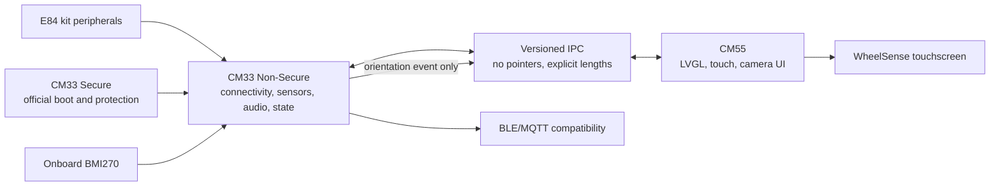
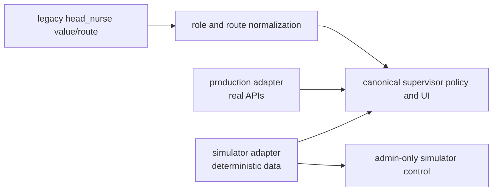

# WheelSense E84 Firmware Architecture

Status: proposed; no target source has been created.

## Base-project decision

| Finding | Status | Consequence |
|---|---|---|
| `firmware/Node_Tsimcam/` is ESP32 Arduino/PlatformIO firmware | CONFIRMED | Preserve behavior only; do not reuse HAL or pins |
| The old camera path uses `esp_camera`, JPEG, VGA/QVGA fallback, and PSRAM buffers | CONFIRMED | Treat these as compatibility requirements, not E84 implementation details |
| The old BLE path advertises the node name but defines no GATT service/UUID | CONFIRMED | Preserve advertising; new GATT payloads require versioned definitions |
| Official E84 data-collection projects provide CM33 Secure, CM33 Non-Secure, and CM55 bases; upstream documents `KIT_PSE84_AI` as the default target | CONFIRMED by Phase 0 audit and pinned upstream README | Use the official project as hardware base; do not confuse it with TESA's custom `APP_KIT_PSE84_AI` target |
| All three official baseline cores compiled with the installed ModusToolbox toolchain | CONFIRMED by Phase 0 audit | Begin from that buildable baseline after approval |
| Physical display, touch controller, codec wiring, and board revision | UNKNOWN | Block pin/peripheral implementation until BSP/schematic evidence exists |

## Core ownership



CM33 Secure is intentionally boring: no normal application logic and no change unless a documented boot, protection, or memory-layout issue requires it.

## Data flow rules

- Hardware callbacks publish state or enqueue work; they never call `lv_*`.
- Only the CM55 UI task calls LVGL.
- BLE callbacks enqueue commands and return quickly.
- IPC and BLE use explicit serialization, fixed-width fields, protocol version, length, sequence, timestamp where required, and documented little-endian encoding.
- No padded C structure or raw pointer crosses a core or BLE boundary.
- Target builds fail closed on missing sensors; generated data exists only in `host_sim`.

## Feature defaults

```c
WS_FEATURE_WIFI=1
WS_FEATURE_BLE=1
WS_FEATURE_CAMERA=1
WS_FEATURE_ENVIRONMENT=1
WS_FEATURE_MICROPHONE=1
WS_FEATURE_SPEAKER=1
WS_FEATURE_TOUCH=1
WS_FEATURE_MOTION_AI=0
WS_FEATURE_HOST_SIM=0
WS_FEATURE_BITSTREAM=0
WS_FEATURE_SENSOR_STUDIO=0
WS_FEATURE_DIGITAL_TWIN=0
```

Each subsystem remains independently switchable. `WS_FEATURE_MOTION_AI` stays off until Gate C.

## Planned shared contracts

- `ws_imu_sample_t`: timestamp, acceleration in m/s², angular rate in rad/s, validity.
- `ws_environment_sample_t`: timestamp, °C, %RH, hPa, validity mask.
- `ws_motion_result_t`: class, confidence, inference latency, model version, validity; compiled only when enabled.
- IPC events: environment, IMU orientation, AI result, audio, camera, Wi-Fi, BLE, UI command, calibration, and diagnostics.
- New BLE payloads: environment, optional AI result, audio status, device health, and configuration.

## Sensor policy

- BMI270: 50–100 Hz acquisition as required for stable display orientation; screen update is rate-limited and hysteretic.
- SHT40/DPS368: 1–2 Hz.
- BMM350: disabled by default; add only if a real heading requirement survives calibration testing.
- No wheelchair-mounted sensor data is acquired or inferred by this firmware.

## UI policy

Required WheelSense screens are splash, dashboard, environment, camera, BLE, Wi-Fi, audio, calibration, and diagnostics. The Motion AI screen is conditional on `WS_FEATURE_MOTION_AI`.

The host simulator is an application simulator: LVGL desktop window, mouse touch, environmental generation, WAV input, mock connectivity/camera states, warning states, and screenshot capture. It is not a PSoC chip simulator.

## Platform role and runtime-mode architecture

`supervisor` becomes the canonical operational-lead role. `head_nurse` remains only as a temporary compatibility input/route alias and normalizes immediately to `supervisor`.



Rules:

- Backend policy is authoritative; frontend capability/navigation code mirrors it and is verified by contract tests.
- Canonical Supervisor is the explicit union of current Head Nurse and Supervisor capabilities, excluding Admin-only operations.
- Stored user/caregiver/workflow target roles are migrated idempotently. Chat message actor roles (`user|assistant|system`) are not part of the migration.
- Production and simulator reuse the same view components and normalized DTOs.
- Production cannot activate simulator mode through a client-only flag and never exposes scenario/reset controls.
- Simulator mode has a persistent visible identity and deterministic fixtures.
- Web production/simulation and embedded target/host simulation are separate adapter pairs; no adapter is treated as a full device emulator.

## Provenance policy

`firmware/WheelSense_E84/docs/provenance.md` will record every reused file, upstream URL, revision, license, local modifications, and destination. Copy only the narrow modules required from TESA or Infineon; do not copy whole applications. No credential or certificate material enters the repository.
