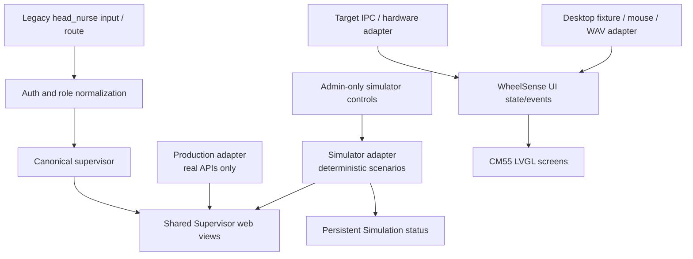

# Phase 2 Detailed Brief — Production UX, Simulator UX, Role Merge, Embedded UI

Status: **IMPLEMENTATION STARTED — PHASE 2A AND 2B COMPLETE; PHASE 2C NEXT**  
Depends on: Phase 1 shared contracts for embedded LVGL; Phase 2A/2B may begin independently for the platform after Gate A.

## Product intent

Phase 2 is no longer only “LVGL plus host simulator.” It owns the complete WheelSense experience across:

1. The production Next.js application.
2. The platform simulator/demo mode.
3. The embedded WheelSense LVGL UI on CM55.
4. The desktop LVGL host simulator.

These are not four unrelated designs. Production and platform simulator share web components and data contracts. Embedded and desktop LVGL share UI state/events. Hardware adapters and simulator adapters stay separate.

## Brand migration contract

- The user-facing platform name is **Ease AI** in web metadata, authentication, navigation, localized product copy, and later embedded UI.
- `WheelSense` remains the compatibility namespace for deployed MQTT topics, environment variables, cookies, internal events, API headers, firmware protocol identifiers, and database fields during this phase.
- Do not bulk-replace `WheelSense`; each remaining occurrence must be classified as user-visible brand copy, legacy protocol compatibility, internal implementation naming, or historical/provenance text.
- The existing `EaseAI` assistant identifier remains compatible. User-facing copy may use “EaseAI assistant” when distinction from the Ease AI platform is necessary.

## Non-goals

- Do not redesign Admin, Observer, or Patient roles beyond changes required by the Supervisor role migration and shared components.
- Do not copy the old medical LVGL UI into firmware.
- Do not add Motion AI screens while `WS_FEATURE_MOTION_AI=0`.
- Do not replace React Query, shadcn/Radix, Tailwind, Lucide, the current API client, or the current role shell.
- Do not create a second backend API, second IPC framework, or a separate simulator-only frontend.
- Do not delete `/head-nurse/**` routes in the first cutover.
- Do not invent hardware pins/display profiles.

## Architecture

The shortest safe implementation is to evolve existing shared surfaces rather than build new parallel systems:

- Keep `/supervisor` as canonical.
- Evolve `SupervisorQueue.tsx` into the one queue model.
- Retire `SupervisorHealthQueue.tsx` after behavior is covered by tests.
- Reduce `RoleQuickActions` to predictable links or remove it where the sidebar/queue already owns the journey.
- Reuse `RoleShell`, `RoleSidebar`, API client, query keys, translation system, and shadcn components.

## Canonical Supervisor experience

### Primary question

“What needs my attention now, who owns it, and what is the next safe action?”

### Information hierarchy

1. Critical alerts and escalations.
2. My accepted/in-progress work.
3. Unassigned or waiting work.
4. Patients needing attention.
5. Staffing/schedule exceptions.
6. Handover/messages.
7. Device/location exceptions.
8. Secondary reports, settings, and diagnostics.

### Navigation

Primary:

- Command Center
- Emergency
- Work
- People
- Messages

More:

- Floor Map
- Reports/diagnostics when allowed
- Support
- Account

Staff management, schedules, directives, prescriptions, and other Head Nurse capabilities remain available under these canonical destinations; they do not each become a new top-level item.

### Action semantics

| Action type | Visual/behavior contract |
|---|---|
| Navigation | Link with destination-oriented label; no mutation or AI side effect |
| Clinical mutation | Button with explicit verb, pending/disabled state, success/error result, and confirmation when destructive/high impact |
| EaseAI | Clearly labeled “Ask EaseAI”; visually distinct from navigation and clinical actions |
| Unavailable | Hidden when irrelevant or disabled with a specific reason; never a clickable “coming soon” fallback |

## Role merge contract

### Canonical value

`supervisor` is the only active operational-lead role emitted after migration.

### Capability policy

The new Supervisor inherits the union of the current Head Nurse and Supervisor permissions:

- user, patient, caregiver, schedule, device, alert, workflow, message, report, facility-read, medication, vitals/care-note, room, and relevant MCP capabilities currently available to either role;
- no Admin-only AI settings, workspace ownership, unrestricted system settings, or other Admin-only operation.

The union must be written once as the canonical backend policy and mirrored/tested by the frontend. Do not maintain two independently handwritten matrices after migration.

### Data migration inventory

The idempotent Alembic migration must normalize role-bearing domain fields, not blindly replace every string named `role`:

- `users.role`
- `caregivers.role`
- `tasks.assigned_role`
- `task_management_tasks.assigned_role`
- workflow task/schedule `assigned_role`
- role message `recipient_role`
- handover/directive `target_role`
- routine-task `assigned_role`
- JSON/array `target_roles` where `head_nurse` is an element

Do **not** rewrite `chat.role`, whose values are `user|assistant|system`.

### Compatibility window

- User decision confirmed 2026-08-18: the compatibility window is exactly one release.
- Accept `head_nurse` only in an input normalization function or schema compatibility adapter.
- Normalize immediately to `supervisor`; new writes and responses emit `supervisor`.
- `/head-nurse/**` routes redirect to the closest `/supervisor/**` route while preserving useful query parameters.
- Tokens/sessions are reissued or revoked/refreshed because effective scopes are computed from the stored role and token claims/scopes.
- Seeds, demo users, fixtures, tests, i18n role labels, AI system prompts, MCP allowlists/scopes, notifications, and message targets move to `supervisor`.
- Release N contains the role/data migration, legacy input normalization, and route redirects.
- In Release N+1, remove the alias only after an exhaustive search, tests, and observed client/route usage prove no active dependency. If that proof fails, stop removal and report the dependency.

### Rollback

The database migration must be reversible only if the previous distinction can be recovered. Because a union migration loses which Supervisor originated as Head Nurse, the safe default is:

- record affected user/caregiver IDs and previous values in migration evidence or a scoped backup process approved before production;
- make code backward-compatible before running the data update;
- treat downgrade as operational restoration from the captured mapping, not an invented split.

## Production and simulator contracts

### Shared view contract

Both modes expose the same normalized data types:

- runtime mode/status;
- people and rooms;
- alerts;
- tasks and directives;
- messages/handover;
- devices/location;
- mutation status and errors.

### Production adapter guarantees

- Calls real APIs only.
- No scenario injection/reset/probability control.
- No generated patients, alerts, sensor samples, or camera states.
- If simulator-only endpoints are unavailable, the production UI remains functional and does not retry them from role pages.
- Simulator mode cannot be activated by a client-only query parameter.

### Simulator adapter guarantees

- Deterministic seed/profile and replay.
- Persistent Simulation banner with workspace/profile identity.
- Clear reset confirmation and post-reset result.
- Scenario controls stay admin-only.
- Role pages render through the same shared view components as production.
- Warning, offline, timeout, empty, loading, and partial-failure states are reproducible.

## Subphases

| Task | Owned paths | RED guarantee | Done gate | Prompt | Recommended AI |
|---|---|---|---|---|---|
| 2A Characterize | `frontend/`, `server/`, `e2e/` tests/docs only | Tests demonstrate current role/route/action/mode contracts and known dead/duplicate behavior | COMPLETE: [`phase-2a-role-inventory.md`](phase-2a-role-inventory.md), 161-file manifest, RED list, 19/19 Docker role E2E | `prompts/02a-characterize-contracts.md` | Codex |
| 2B Role migration | Backend RBAC/schemas/services/migration + frontend role maps + existing role tests | New canonical/legacy/security tests fail before production edits | **COMPLETE:** [`phase-2b-role-merge-report.md`](phase-2b-role-merge-report.md); migration, permissions, sessions, MCP, routes, seeds, Docker, and negative tests pass | `prompts/02b-merge-roles.md` | Codex lead; Devin+GLM bounded tests |
| 2C UX/IA design | `DESIGN.md`, plan artifacts, component/journey tests; no production markup until contract freeze | Tests/spec assert hierarchy/action semantics | **COMPLETE:** [`phase-2c-supervisor-ux-ia.md`](phase-2c-supervisor-ux-ia.md); Workbench macrostructure, Hallmark and click-path audits, desktop/mobile evidence, RED gates frozen | `prompts/02c-supervisor-ux.md` | Codex |
| 2D Production UI | Supervisor pages/components, shared nav/actions, i18n, focused tests | Production journeys and dead-action tests fail | **IN PROGRESS:** P2D.1 workbench complete in [`phase-2d-production-ui-report.md`](phase-2d-production-ui-report.md); P2D.2–2D.6 remain | `prompts/02d-production-ui.md`; `prompts/02d2-production-ui-continuation.md` | Devin+GLM; Codex review |
| 2E Simulator UI | Demo/simulator adapter, banner, admin controls, parity tests | Mode-leak and deterministic scenario tests fail | Same views/contracts; persistent mode; no production leak | `prompts/02e-simulator-ui.md` | Devin+GLM; Codex review |
| 2F Embedded LVGL | `firmware/WheelSense_E84/proj_cm55/source/ui/` and host state tests | Screen registry/event/state tests fail | WheelSense screens compile; UI task owns LVGL | `prompts/02f-embedded-lvgl.md` | Codex interface; GLM implementation |
| 2G LVGL host sim | `firmware/WheelSense_E84/host_sim/` | Navigation, fixture, warning, screenshot tests fail | Desktop app deterministic; separate build | `prompts/02g-lvgl-host-sim.md` | Devin+GLM |
| 2H Cutover | Existing unit/integration/E2E/build suites and evidence docs | Cross-mode/legacy/role matrix catches remaining divergence | All Phase 2 gates green; old duplicate implementations can be removed only with evidence | `prompts/02h-phase-2-cutover.md` | Codex |

## Exact platform files expected to change

### Backend/security

- `server/app/api/dependencies.py`
- `server/app/schemas/users.py`
- `server/app/models/users.py` and `server/app/models/caregivers.py` comments/contracts as needed
- `server/app/services/auth.py`
- `server/app/services/ai_chat.py`
- `server/app/services/service_requests.py`
- role-gated endpoint files found by the exhaustive `head_nurse|supervisor` inventory
- `server/alembic/versions/<new_revision>_merge_head_nurse_into_supervisor.py`
- existing RBAC/MCP/access-control tests; add one focused migration-contract test only if existing files cannot express it clearly

### Frontend

- `frontend/lib/permissions.ts`
- `frontend/lib/routes.ts`
- `frontend/lib/sidebarConfig.ts`
- `frontend/lib/types.ts`
- `frontend/lib/i18n.tsx`
- `frontend/components/RoleSidebar.tsx`
- `frontend/components/RoleSwitcher.tsx`
- `frontend/components/TopBar.tsx`
- `frontend/app/supervisor/**`
- `frontend/components/supervisor/SupervisorQueue.tsx`
- `frontend/components/supervisor/SupervisorHealthQueue.tsx` only to retire after parity
- `frontend/components/dashboard/RoleQuickActions.tsx`
- `frontend/components/dashboard/FeatureDetailActions.tsx`
- `frontend/app/head-nurse/**` converted to compatibility redirects/adapters before later deletion
- `frontend/app/admin/demo-control/page.tsx`
- `frontend/components/admin/demo-control/DemoPanel.tsx`
- `frontend/components/admin/settings/ServerSettingsPanel.tsx`
- one shared runtime-mode type/helper location selected from existing duplicates

### Tests

- `frontend/lib/navigation.test.ts`
- existing relevant frontend Jest tests; add focused queue/runtime-mode tests where behavior has no owner
- `server/tests/test_access_control_backend_contracts.py`
- `server/tests/test_mcp_auth.py`
- `server/tests/test_mcp_policy.py`
- existing endpoint/auth/session tests affected by the migration
- `e2e/role-tests.spec.ts`
- `e2e/redesign.spec.ts`
- `e2e/accessibility.spec.ts`
- one production/simulator parity spec only if the existing E2E files would become ambiguous

This list is an audit scope, not permission for a bulk search-and-replace. Each task owns only the smallest necessary subset.

## Embedded LVGL screens

Always present:

- Splash
- Main dashboard
- Environment
- Camera
- BLE status/devices
- Wi-Fi settings
- Calibration
- Diagnostics

Conditional:

- Motion AI only when Gate C enables `WS_FEATURE_MOTION_AI`.
- Audio only when the deferred `WS_FEATURE_MICROPHONE` or `WS_FEATURE_SPEAKER` is explicitly re-enabled.

### 2026-08-22 KIT_PSE84_AI display/touch decision gate

- The AI kit has no onboard LCD. J10 carries two-lane Raspberry Pi-compatible MIPI-DSI and touch; J16 is unpopulated by default and is needed by displays that require separate touch/power wiring. Record the physical display MPN before selecting a driver.
- TESA reference `f1de4071e4fd27f4eeac0216f92a7170fdb910fb` targets `APP_KIT_PSE84_AI` and provides three mutually exclusive proven profiles: `W4P3INCH_DISP` = Waveshare 4.3-inch 800x480 + FT5406; `WS7P0DSI_RPI_DISP` = Waveshare 7-inch 1024x600 + GT911; `WF101JTYAHMNB0_DISP` = 10.1-inch 1024x600 + ILI2511.
- Infineon graphics reference `026596ba8632c59dccfafd87c7efeeb46e683d56` independently supports the Waveshare 4.3-inch DSI panel on `KIT_PSE84_AI`, including `CYBSP_I2C_DISPLAY_CONTROLLER`; it is display-path evidence, not a touchscreen/LVGL application.
- Reuse only the selected TESA `proj_cm55/modules/lvgl_display` controller/core paths and matching official display/touch libraries. Do not copy the TESA application UI or select a fallback controller after an I2C probe failure.
- Hardware acceptance requires controller init, visible framebuffer, raw touch coordinates at corners/center, rotation mapping, five-minute navigation, and zero false touches. Until the MPN and cable/J10/J16 arrangement are known, target rendering remains `UNKNOWN`, not failed.

Only the designated CM55 UI task calls `lv_*`. Sensor, connectivity, camera, and audio callbacks publish events/queue updates.

## TDD guarantee map

| Journey/behavior | Test level | Required RED |
|---|---|---|
| Legacy Head Nurse becomes canonical Supervisor | Migration integration + auth/RBAC unit | Stored/input `head_nurse` is not yet normalized |
| Supervisor inherits approved union, not Admin | RBAC/MCP matrix | At least one required union permission fails and Admin-only negatives remain forbidden |
| Legacy routes preserve access | Route unit + E2E | `/head-nurse/**` does not redirect to canonical mapping |
| One operational queue | Component/domain unit + E2E | Duplicate ordering/action behavior differs or dead prop is exposed |
| Predictable actions | Component tests | Link/AI/mutation affordances are ambiguous under current contract |
| Production has no simulator controls | Integration + E2E negative | Production role surface can reach/invoke simulator-only behavior |
| Simulator matches production views | Adapter unit + E2E | Same fixture produces divergent normalized view state |
| Embedded screen registry/state | Host C unit | Required screen/event mapping is missing |
| Host LVGL deterministic replay | Host integration/screenshot | Fixture/replay or warning state is missing/non-deterministic |

## Phase 2 acceptance

- One canonical Supervisor role and home.
- Approved permission union with Admin-only negative tests.
- Idempotent migration and legacy normalization/redirect window.
- One queue model and mutation owner.
- No visible no-op/“coming soon” primary action.
- Navigation, mutation, and EaseAI actions are distinguishable.
- Production and simulator share views but not data/control adapters.
- Persistent Simulation status and admin-only scenario controls.
- Desktop/mobile keyboard/accessibility/visual/console/network checks pass.
- Embedded LVGL target and desktop simulator share state/events and build separately.
- No production or firmware source is claimed hardware-validated without observation.

## Docker runtime contract

- Validate the production Next.js image through `server/docker-compose.sim.yml`, not only a host dev server.
- Keep existing Compose service keys, container DNS names, persistent volume namespaces, and `WheelSense/...` MQTT topics for compatibility during the display-brand migration.
- Set user-facing OCI image/container titles and the server `APP_NAME` to Ease AI.
- The web container must expose a healthcheck against `/login` and reach `healthy` before browser acceptance runs.
- Chromium acceptance must cover desktop and mobile viewports, title/visible-brand assertions, no visible legacy brand, no horizontal overflow, no console errors, no failed HTTP responses, and retained screenshots.
