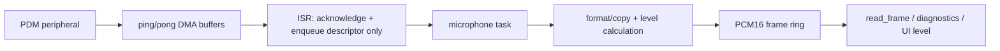

# Phase 4 — IM73D122V01 PDM Microphone and PCM16 Frame Service

Status: **DEFERRED BY USER — ACTIVE TARGET/HOST FEATURES OFF; REAL-BOARD CHECKPOINT RETAINED**  
Implementation lane: **Devin Desktop + GLM-5.2**  
DMA/ISR/resource/final review: **Codex**

## 4.0 2026-08-22 hardware checkpoint and deferral

Microphone work is intentionally out of the current product slice. `WS_FEATURE_MICROPHONE=0` is the default until the user reactivates Phase 4. Do not start the GLM handoff or add microphone work to BLE/server integration.

- `KIT_PSE84_AI`/`APP_KIT_PSE84_AI` proves the onboard PDM resource is already owned by the official CM55 data-collection driver; no pin, clock, IRQ, or core reassignment was invented.
- COM23 boot configured the existing driver as mono PCM16, 16 kHz, 5 dB and emitted `PDM PCM16 frame capture PASS` only after the four upstream startup-discard frames.
- This proves bounded frame arrival from the onboard PDM path. It does **not** satisfy the final API: the upstream buffer is 1,024 samples and its ISR copies FIFO samples into ping-pong buffers; 160/320-sample ring access, RMS/peak, overflow/underrun counters, DMA suitability, cadence, acoustic quality, and soak remain open.
- The unfinished P4.1–P4.7 lane remains documented for later; none of it is active work.

## 4.1 Outcome

Provide asynchronous onboard digital-microphone capture as mono PCM16 at 16 kHz, with 160-sample (10 ms) and 320-sample (20 ms) frame access, ring-buffer diagnostics, and audio level reporting.

The target prefers IM73D122V01 PDM when the actual board proves it is populated. Host simulation reads PCM-compatible WAV input through the same service contract. Raw microphone PCM is not streamed over BLE.

## 4.2 Entry gates

- Phase 1 flags/status/types/host harness are green.
- Gate B proves microphone part/population, PDM data/clock pins, peripheral instance, clock tree, DMA channel/request, voltage/power domain, and any board routing/selectors.
- The CM33 Non-Secure memory/stack budget can hold the selected DMA and ring buffers.
- The upstream EULA/provenance decision is accepted.

Stop if the board is analog-microphone-only, if PDM resources conflict with display/camera/audio, or if the selected BSP legally owns acquisition on a different core. Re-plan from proven hardware rather than substituting pins.

## 4.3 Pinned upstream inputs

Infineon data collection `master@26bfd44f58b00099787f7b77882cc45175ac6d88`:

- `proj_cm55/devices/dev_pdm_pcm.[ch]`
- `proj_cm55/devices/pdm_pcm.[ch]`
- `templates/TARGET_KIT_PSE84_AI/config/design.modus`

The upstream code is a resource/conversion reference, not a drop-in core assignment. WheelSense targets CM33 Non-Secure ownership unless Gate B proves otherwise.

## 4.4 Exact proposed paths

```text
firmware/WheelSense_E84/
  proj_cm33_ns/source/services/ws_microphone.c
  proj_cm33_ns/source/services/ws_microphone.h
  proj_cm33_ns/source/platform/ws_pdm_platform.c
  proj_cm33_ns/source/platform/ws_pdm_platform.h
  proj_cm33_ns/source/tasks/ws_microphone_task.c
  host_sim/source/ws_wav_microphone.c
  host_sim/source/ws_wav_microphone.h
  host_sim/fixtures/audio/silence_16k_mono.wav
  host_sim/fixtures/audio/tone_1khz_16k_mono.wav
  host_sim/fixtures/audio/step_level_16k_mono.wav
  host_sim/tests/test_microphone_ring.c
  host_sim/tests/test_microphone_level.c
  host_sim/tests/test_wav_microphone.c
  docs/microphone.md
```

Use the existing audio/platform seam if Phase 1 or the BSP already owns it; do not create an interface with only a duplicate implementation.

## 4.5 Public API contract

```c
ws_status_t ws_microphone_init(const ws_microphone_config_t *config);
ws_status_t ws_microphone_start(void);
ws_status_t ws_microphone_stop(void);
ws_status_t ws_microphone_read_frame(int16_t *dst,
                                     uint32_t capacity_samples,
                                     uint32_t requested_samples,
                                     uint32_t *samples_read,
                                     uint64_t *timestamp_us);
ws_status_t ws_microphone_get_level(ws_audio_level_t *level);
ws_status_t ws_microphone_get_status(ws_microphone_status_t *status);
```

Required semantics:

- `init` validates 16 kHz, mono, PCM16, and supported frame sizes before touching hardware.
- `start` is idempotent or returns a documented state error; it never creates duplicate DMA ownership.
- `stop` disables acquisition safely, resolves partial DMA state, and leaves diagnostics readable.
- `read_frame` is non-blocking at the service boundary: it returns `READY`, `BUSY`/no-frame, or an error; it never waits an unbounded time.
- A successful frame has exactly 160 or 320 samples and the timestamp of its first sample or one explicitly documented convention.
- `get_level` returns a documented RMS/peak representation computed outside ISR context.
- `get_status` reports lifecycle, buffered frame/sample count, total frames, overflows, underruns/no-frame reads, DMA errors, and high-water mark.

## 4.6 Buffer and concurrency model



Rules:

- DMA buffers and ring storage are statically bounded or allocated once at initialization.
- ISR does not calculate RMS/FFT, publish BLE, call LVGL, log large payloads, or allocate memory.
- Producer/consumer indices use a proven single-producer/single-consumer primitive or a minimal critical section appropriate to the RTOS/platform.
- Overflow policy is explicit. Initial policy: drop the oldest complete frame to preserve recent level/UI data, increment a counter, and mark status; change only if a downstream capture requirement says otherwise.
- Partial frames are never exposed as successful full frames.
- Initial ring capacity is selected from the Phase 1 memory budget; it must hold at least four 320-sample frames. The chosen count and byte cost are documented, not hidden in a magic number.

Reference sizes:

| Frame | Duration | Payload |
|---:|---:|---:|
| 160 samples | 10 ms at 16 kHz | 320 bytes PCM16 |
| 320 samples | 20 ms at 16 kHz | 640 bytes PCM16 |

## 4.7 WAV host adapter

- Accept RIFF/WAVE PCM with validated chunk bounds.
- Required supported input for tests: PCM16, 16 kHz, mono.
- Reject truncated headers/chunks, unsupported encoding/rate/channels, integer overflow, and data not aligned to samples.
- End-of-file behavior is configured explicitly as stop or deterministic loop; tests cover both if both are exposed.
- Host adapter uses the same frame-size and timestamp contract as target acquisition.
- WAV fixtures are synthetic/non-sensitive and carry provenance.

## 4.8 Audio-level contract

Level computation is lightweight and outside the ISR:

- `peak_abs`: maximum absolute PCM16 magnitude with `INT16_MIN` handled safely;
- `rms`: finite normalized or PCM-unit RMS with the unit documented;
- optional dBFS derived with a defined silence floor, only if the UI needs it;
- window is exactly the most recently completed frame unless a later requirement approves smoothing.

No speech recognition, recording archive, streaming, or heavy DSP is included.

## 4.9 TDD task breakdown

| Task | Owner | Required RED | Minimum GREEN | Evidence |
|---|---|---|---|---|
| P4.1 Freeze API/state machine | Codex | Missing/invalid state and config tests fail | API, config validation, lifecycle only | Contract tests and docs |
| P4.2 Ring buffer | Devin+GLM | Wrap/full/empty/drop/timestamp tests fail | Small bounded ring implementation | RED/GREEN, randomized sequence/reference model, coverage |
| P4.3 Level calculation | Devin+GLM | Silence/full-scale/INT16_MIN/known RMS vectors fail | Peak and RMS only | Numeric tolerance tests |
| P4.4 WAV adapter | Devin+GLM | Valid and malformed fixtures fail | Minimal safe RIFF parser | Parser negative matrix and EOF behavior |
| P4.5 PDM/DMA platform port | Devin+GLM after Gate B | Platform fake/target compile fails before wiring | Official resource path plus ISR signaling | Resource table, provenance, target build |
| P4.6 Task/diagnostic integration | Devin+GLM | Overflow/DMA error/state propagation fails | Frame task and counters only | Stress and recovery tests |
| P4.7 Concurrency/resource review | Codex | N/A gate | No race/ISR overwork/resource guess | Diff, trace, memory and target evidence |

## 4.10 Required test guarantees

- configuration rejects null/unsupported frame/rate/channel/format values;
- start/stop/restart/idempotency and read-before-start behavior;
- ring empty, one frame, exact full, wrap, overflow, consumer lag, and timestamp order;
- `INT16_MIN`, silence, DC, full-scale, 1 kHz tone, and known RMS/peak;
- DMA completion order and injected DMA error;
- no frame exposes half-written data under producer/consumer stress;
- malformed WAV chunk sizes, unsupported format, truncated data, odd alignment, EOF stop/loop;
- target build has no host WAV/file dependency;
- BLE layer has no raw-PCM characteristic/notification path.

## 4.11 Software acceptance

- Host unit/integration tests are GREEN with 80%+ changed-logic coverage.
- 160- and 320-sample PCM16 frames are deterministic.
- Overflow/underrun/no-frame/DMA errors are observable without logging raw PCM.
- CM33 Non-Secure builds with microphone enabled and disabled.
- Memory cost and task stack assumptions are recorded.
- ISR work is limited to hardware acknowledgement and signaling/bookkeeping.
- Provenance is complete.

## 4.12 Board-ready validation procedure

1. Record board/BSP/configurator/firmware/tool hashes.
2. Verify the PDM clock with an appropriate safe instrument or platform measurement when available; record configured and observed rates.
3. Capture silence, normal speech/noise, and a stable reference tone without storing sensitive speech in the repository.
4. Measure frame cadence/timestamps for at least 60 seconds.
5. Compare expected 10/20 ms cadence, inspect dropped/overflow/DMA counters, and verify no unbounded drift.
6. Start/stop/restart repeatedly; check stale DMA interrupts and buffer corruption.
7. Load the integrated UI/connectivity/camera path and repeat to expose contention.
8. Run an approved extended capture test and confirm counters/stack/heap remain bounded.

Real microphone quality, noise floor, sensitivity, and clock accuracy remain `NOT VERIFIED` until these observations exist.

## 4.13 Phase exit checklist

- [ ] Gate B microphone/DMA/clock resources proven.
- [ ] API/ring/level/WAV tests RED then GREEN.
- [ ] ISR and task ownership reviewed.
- [ ] Enabled/disabled target builds pass.
- [ ] No raw PCM over BLE and no target file fixture.
- [ ] Memory/stack/overflow policy documented.
- [ ] Provenance and validation steps complete.
- [ ] Hardware status remains honest until Gate D.
