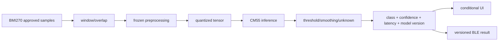

# Phase 6 — Optional BMI270 Motion AI

Status: **NOT REQUIRED / BLOCKED BY DESIGN**  
Current feature state: `WS_FEATURE_MOTION_AI=0`  
Current usage allocation: **no Codex or Devin implementation work**

## 6.1 Current decision

The current WheelSense requirement uses onboard BMI270 only to rotate the touchscreen. It explicitly excludes the wheelchair-mounted sensor from this firmware. Therefore Phase 6 must not add a model, motion classification, dataset pipeline, BLE AI characteristic behavior, or Motion AI screen at this time.

Phase 6 becomes executable only after explicit Gate C approval that defines a real classification journey and confirms which physical sensor/orientation/data source is permitted.

## 6.2 Feature-off acceptance now

- `WS_FEATURE_MOTION_AI=0` in target defaults.
- No TFLM/DEEPCRAFT/model dependency or binary asset linked.
- No inference task, tensor arena, motion class, or AI notification runs.
- Motion AI UI is absent or clearly feature-disabled; it does not show fake results.
- BMI270 orientation remains independently functional.
- Phase 1/3/7 build tests prove the feature-off image remains link-clean.

These checks are part of the surrounding phases; they do not justify a separate implementation task or usage spend.

## 6.3 Gate C approval packet required later

Before enabling this phase, the user/product owner must approve:

1. User-visible classes and the decision/action each class supports.
2. Allowed sensor: onboard BMI270 only, or a separately defined source.
3. Sensor physical orientation and axis remap.
4. Dataset provenance, participant/privacy status, labeling method, train/validation/test split, and leakage controls.
5. Initial official model versus WheelSense model replacement strategy.
6. False-positive/false-negative tolerance and `unknown` behavior.
7. UI/BLE exposure and whether any result has safety implications.
8. Model update/versioning/rollback policy.
9. CM55 memory/latency/energy budget.

Without this packet, “add motion AI” is under-specified and remains stopped.

## 6.4 Pinned reference if approved

Infineon deploy motion `master@9618fc2a70eed9ec50764df212971b5e659a407a`:

- `proj_cm55/imu.[ch]`
- `proj_cm55/config.h`
- `proj_cm55/model/model.[ch]`
- `proj_cm55/main.c`
- `proj_cm55/deps/ml-middleware.mtb`
- `proj_cm55/deps/ml-tflite-micro.mtb`

Preserve the official pipeline first. The relevant CM55 build configuration uses Helium/DSP and applicable hard-float constraints. Do not substitute a WheelSense model until recorded official-pipeline replay is understood and deterministic.

## 6.5 Exact proposed paths after approval

```text
firmware/WheelSense_E84/
  proj_cm55/source/motion_ai/ws_motion_ai.c
  proj_cm55/source/motion_ai/ws_motion_ai.h
  proj_cm55/source/motion_ai/ws_motion_preprocess.c
  proj_cm55/source/motion_ai/ws_motion_preprocess.h
  proj_cm55/source/motion_ai/model/<approved_model_assets>
  host_sim/source/ws_ai_replay.c
  host_sim/source/ws_ai_replay.h
  host_sim/fixtures/motion/<approved_recordings>
  host_sim/tests/test_motion_preprocess.c
  host_sim/tests/test_motion_inference.c
  docs/motion-ai.md
  docs/model-card.md
```

Do not create these paths while Gate C is closed.

## 6.6 Frozen model contract required before code

| Item | Must document |
|---|---|
| Sensor | exact part, range, ODR, resolution |
| Orientation | physical axes and model remap |
| Window | samples, duration, stride/overlap |
| Preprocessing | filters, gravity handling, normalization, feature extraction |
| Tensor input | shape, dtype, scale/zero point, order |
| Tensor output | class order, dtype, scale/zero point |
| Decision | confidence threshold, smoothing/debounce, unknown/fallback |
| Runtime | tensor arena, stack, heap, model bytes, core, priority |
| Version | model/preprocessing/schema version and compatibility |
| Evidence | dataset IDs/hashes and deterministic expected outputs |

## 6.7 Execution flow after approval



Raw sample ownership and transport must be bounded; no pointer passes between cores. Profile CM55 before considering CM33. A core move requires a separate architecture decision.

## 6.8 TDD task breakdown after Gate C

| Task | Owner | Required RED | Minimum GREEN | Evidence |
|---|---|---|---|---|
| P6.1 Freeze model/data contract | Codex | N/A, design gate | Approved model card/fixtures/hashes | Gate C packet |
| P6.2 Preprocessing parity | Devin+GLM | Recorded tensor vectors differ | Exact official preprocessing | Per-stage golden values, coverage |
| P6.3 Recorded inference parity | Codex lead, Devin fixture support | Official recordings lack expected output | Official model integration only | Class/confidence/tensor/latency evidence |
| P6.4 WheelSense model substitution | Codex | Candidate fails offline acceptance | Replace model only, preserve frozen interface | Held-out metrics and replay |
| P6.5 Result policy/UI/BLE | Devin+GLM | Threshold/unknown/version tests fail | Versioned result/state wiring | Host/E2E/protocol tests |
| P6.6 Target profile | Codex | Budget regression test fails | Optimize only measured bottleneck | Memory/latency/load evidence |

## 6.9 Required guarantees after approval

- identical fixture produces identical preprocessed tensor bytes within documented float tolerance;
- class ordering and quantization metadata match model assets;
- known, boundary-confidence, below-threshold, invalid-window, dropped-sample, and unknown behavior;
- inference latency and model version are populated from real runtime/metadata;
- feature-off build excludes all AI assets/dependencies;
- UI/BLE never presents stale result as current;
- no dataset/test leakage or silent model replacement;
- no vision/audio AI is introduced.

## 6.10 Acceptance after approval

Software:

- official pipeline recorded replay is deterministic before model substitution;
- WheelSense model meets the separately approved held-out metrics;
- CM55 target builds with hardfp/ML constraints and stays inside recorded memory limits;
- class, confidence, latency, and model version reach UI/BLE through versioned messages;
- `unknown` and disabled states are explicit.

Hardware:

- physical sensor rate/orientation/window continuity observed;
- latency/load/confidence captured on board;
- UI/camera/audio/connectivity remain responsive under inference load.

Until Gate C, the correct completion state is **NOT REQUIRED**, not “partially implemented.”
