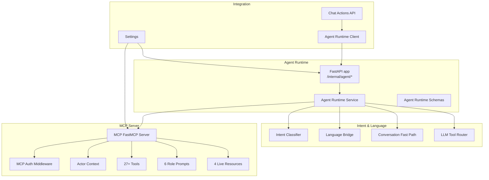
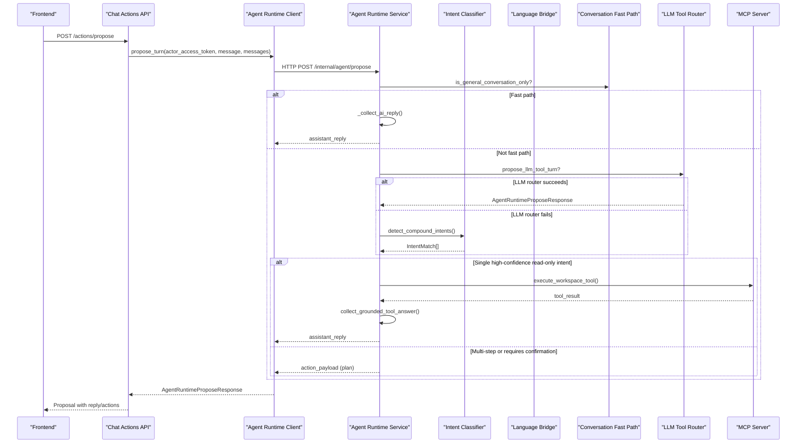
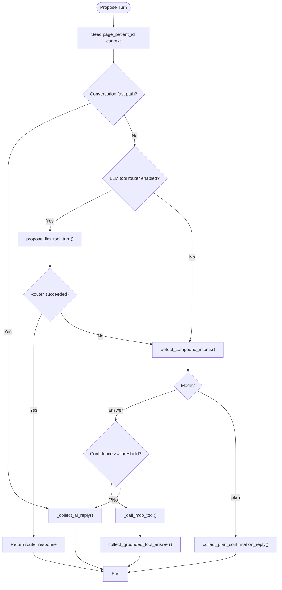
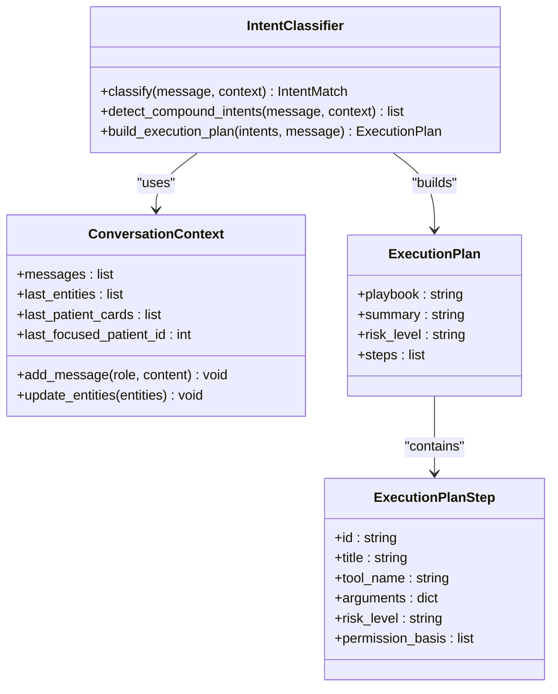
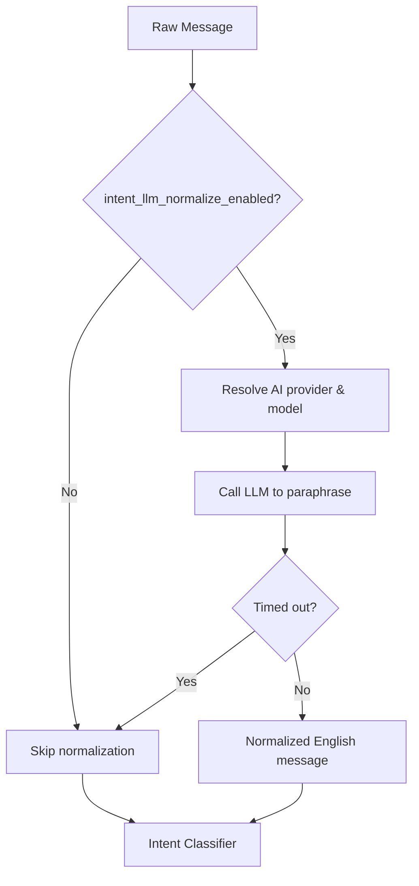
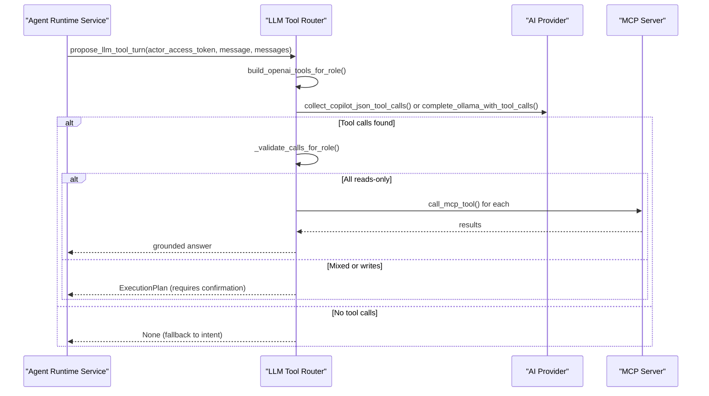
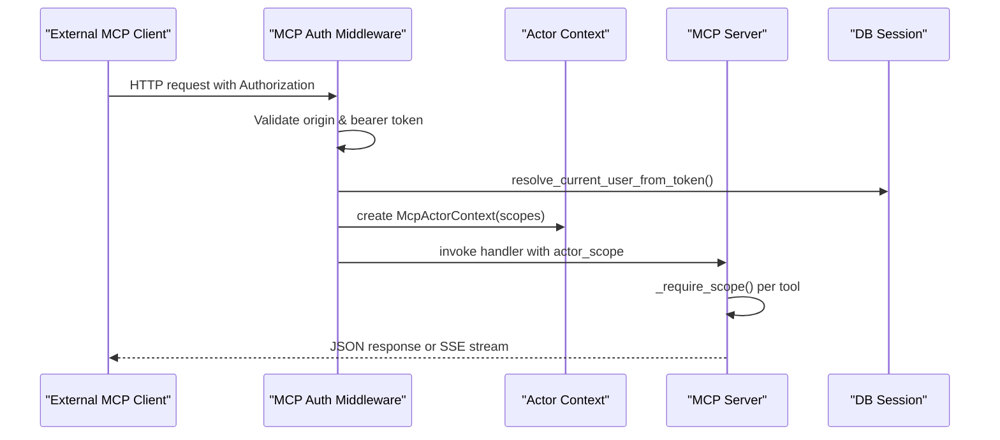
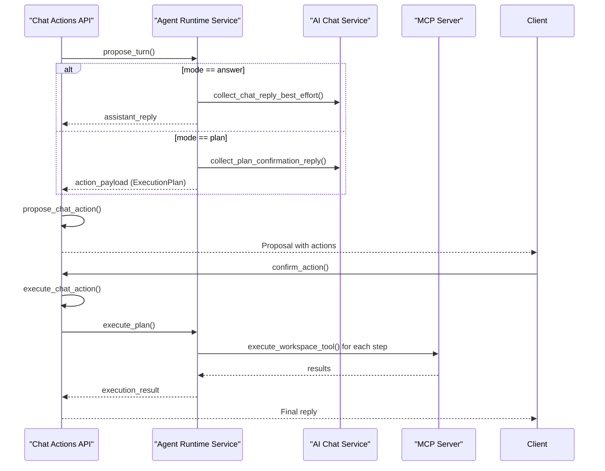
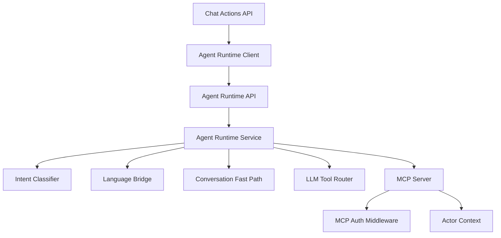

# AI & Agent Runtime

<cite>
**Referenced Files in This Document**
- [main.py](file://server/app/agent_runtime/main.py)
- [service.py](file://server/app/agent_runtime/service.py)
- [intent.py](file://server/app/agent_runtime/intent.py)
- [language_bridge.py](file://server/app/agent_runtime/language_bridge.py)
- [conversation_fastpath.py](file://server/app/agent_runtime/conversation_fastpath.py)
- [llm_tool_router.py](file://server/app/agent_runtime/llm_tool_router.py)
- [server.py](file://server/app/mcp/server.py)
- [auth.py](file://server/app/mcp/auth.py)
- [context.py](file://server/app/mcp/context.py)
- [__init__.py](file://server/app/mcp/__init__.py)
- [agent_runtime.py](file://server/app/schemas/agent_runtime.py)
- [chat_actions.py](file://server/app/api/endpoints/chat_actions.py)
- [config.py](file://server/app/config.py)
- [agent_runtime_client.py](file://server/app/services/agent_runtime_client.py)
- [mcp_auth.py](file://server/app/api/endpoints/mcp_auth.py)
- [MCP-README.md](file://docs/MCP-README.md)
</cite>

## Table of Contents
1. [Introduction](#introduction)
2. [Project Structure](#project-structure)
3. [Core Components](#core-components)
4. [Architecture Overview](#architecture-overview)
5. [Detailed Component Analysis](#detailed-component-analysis)
6. [Dependency Analysis](#dependency-analysis)
7. [Performance Considerations](#performance-considerations)
8. [Troubleshooting Guide](#troubleshooting-guide)
9. [Conclusion](#conclusion)
10. [Appendices](#appendices)

## Introduction
This document describes the AI and agent runtime for the WheelSense Platform, focusing on:
- Model Context Protocol (MCP) implementation for secure AI tool execution
- Intent classification for natural language understanding and tool selection
- Three-stage chat action flow: propose, confirm, execute
- Multilingual support via a language bridge and conversation fastpath handling
- MCP server implementation, authentication, and scope-based authorization
- Agent runtime service, conversation management, and workflow integration
- Performance optimization, error handling, and debugging strategies
- Practical examples and guidance for AI tool usage and custom tool development

## Project Structure
The AI and agent runtime spans several modules:
- Agent Runtime API and orchestration
- Intent classification and multilingual normalization
- MCP server with tools, prompts, resources, and auth middleware
- Chat action endpoints integrating with the agent runtime
- Configuration and client utilities

**Diagram sources**
- [main.py:14-55](file://server/app/agent_runtime/main.py#L14-L55)
- [service.py:1-561](file://server/app/agent_runtime/service.py#L1-L561)
- [intent.py:1-800](file://server/app/agent_runtime/intent.py#L1-L800)
- [language_bridge.py:1-125](file://server/app/agent_runtime/language_bridge.py#L1-L125)
- [conversation_fastpath.py:1-45](file://server/app/agent_runtime/conversation_fastpath.py#L1-L45)
- [llm_tool_router.py:1-366](file://server/app/agent_runtime/llm_tool_router.py#L1-L366)
- [server.py:110-800](file://server/app/mcp/server.py#L110-L800)
- [auth.py:16-190](file://server/app/mcp/auth.py#L16-L190)
- [context.py:8-38](file://server/app/mcp/context.py#L8-L38)
- [chat_actions.py:124-300](file://server/app/api/endpoints/chat_actions.py#L124-L300)
- [config.py:68-95](file://server/app/config.py#L68-L95)
- [agent_runtime_client.py:23-65](file://server/app/services/agent_runtime_client.py#L23-L65)

**Section sources**
- [main.py:14-55](file://server/app/agent_runtime/main.py#L14-L55)
- [service.py:1-561](file://server/app/agent_runtime/service.py#L1-L561)
- [server.py:110-800](file://server/app/mcp/server.py#L110-L800)
- [chat_actions.py:124-300](file://server/app/api/endpoints/chat_actions.py#L124-L300)
- [config.py:68-95](file://server/app/config.py#L68-L95)

## Core Components
- Agent Runtime API: Exposes internal endpoints for proposing and executing plans with an internal secret guard.
- Agent Runtime Service: Orchestrates intent classification, multilingual normalization, fastpath detection, plan building, and MCP tool execution.
- Intent Classifier: Regex-based + semantic matching with thresholds and context-awareness for multi-turn conversations.
- Language Bridge: Optional LLM-based normalization to English for intent classification.
- Conversation Fast Path: Heuristic to bypass MCP for general chit-chat.
- LLM Tool Router: Experimental tool selection via LLM with role-based allowlists and read-only auto-execution.
- MCP Server: FastMCP implementation with 27+ tools, 6 role prompts, 4 live resources, and strict scope-based authorization.
- MCP Auth Middleware: Validates origin, bearer tokens, and MCP token lifecycles/scopes.
- Chat Actions API: Integrates agent runtime proposals into a user-facing 3-stage flow.
- Configuration: Centralized settings for AI providers, routing modes, and internal service URLs.

**Section sources**
- [main.py:30-55](file://server/app/agent_runtime/main.py#L30-L55)
- [service.py:346-561](file://server/app/agent_runtime/service.py#L346-L561)
- [intent.py:347-800](file://server/app/agent_runtime/intent.py#L347-L800)
- [language_bridge.py:38-125](file://server/app/agent_runtime/language_bridge.py#L38-L125)
- [conversation_fastpath.py:32-45](file://server/app/agent_runtime/conversation_fastpath.py#L32-L45)
- [llm_tool_router.py:173-366](file://server/app/agent_runtime/llm_tool_router.py#L173-L366)
- [server.py:110-800](file://server/app/mcp/server.py#L110-L800)
- [auth.py:16-190](file://server/app/mcp/auth.py#L16-L190)
- [chat_actions.py:124-300](file://server/app/api/endpoints/chat_actions.py#L124-L300)
- [config.py:68-95](file://server/app/config.py#L68-L95)

## Architecture Overview
The system integrates front-end chat with agent runtime orchestration and MCP tool execution. The chat actions API triggers agent runtime propose, which may return either a grounded answer or an execution plan. The plan is presented to the user for confirmation and then executed.

**Diagram sources**
- [chat_actions.py:174-239](file://server/app/api/endpoints/chat_actions.py#L174-L239)
- [agent_runtime_client.py:23-45](file://server/app/services/agent_runtime_client.py#L23-L45)
- [service.py:346-520](file://server/app/agent_runtime/service.py#L346-L520)
- [llm_tool_router.py:173-366](file://server/app/agent_runtime/llm_tool_router.py#L173-L366)
- [intent.py:347-800](file://server/app/agent_runtime/intent.py#L347-L800)
- [conversation_fastpath.py:32-45](file://server/app/agent_runtime/conversation_fastpath.py#L32-L45)
- [server.py:110-800](file://server/app/mcp/server.py#L110-L800)

## Detailed Component Analysis

### Agent Runtime Orchestration
- Internal endpoints enforce an internal service secret header.
- Propose flow:
  - Fast-path for general conversation
  - Optional LLM tool router
  - Fallback to intent classifier
  - Immediate read-only tool execution vs. plan generation
- Execute flow:
  - Sequentially executes steps in the plan
  - Aggregates results and returns a consolidated message

**Diagram sources**
- [service.py:346-520](file://server/app/agent_runtime/service.py#L346-L520)
- [conversation_fastpath.py:32-45](file://server/app/agent_runtime/conversation_fastpath.py#L32-L45)
- [llm_tool_router.py:173-366](file://server/app/agent_runtime/llm_tool_router.py#L173-L366)
- [intent.py:347-800](file://server/app/agent_runtime/intent.py#L347-L800)

**Section sources**
- [main.py:30-55](file://server/app/agent_runtime/main.py#L30-L55)
- [service.py:346-520](file://server/app/agent_runtime/service.py#L346-L520)

### Intent Classification System
- Regex patterns for high-confidence matches (Thai + English)
- Semantic similarity using sentence transformers (optional)
- Thresholds for high/medium/low confidence
- Context-aware conversation state with last entities and focused patient
- Automatic execution for high-confidence read-only tools; others require confirmation

**Diagram sources**
- [intent.py:347-800](file://server/app/agent_runtime/intent.py#L347-L800)
- [agent_runtime.py:21-30](file://server/app/schemas/agent_runtime.py#L21-L30)

**Section sources**
- [intent.py:16-194](file://server/app/agent_runtime/intent.py#L16-L194)
- [intent.py:347-800](file://server/app/agent_runtime/intent.py#L347-L800)
- [agent_runtime.py:10-30](file://server/app/schemas/agent_runtime.py#L10-L30)

### Language Bridge and Conversation Fast Path
- Language Bridge: Optional LLM normalization to English for intent classification, respecting timeouts and provider selection.
- Conversation Fast Path: Conservative heuristic to skip MCP for pure chit-chat, improving latency and reducing unnecessary tool calls.

**Diagram sources**
- [language_bridge.py:38-125](file://server/app/agent_runtime/language_bridge.py#L38-L125)
- [conversation_fastpath.py:32-45](file://server/app/agent_runtime/conversation_fastpath.py#L32-L45)

**Section sources**
- [language_bridge.py:38-125](file://server/app/agent_runtime/language_bridge.py#L38-L125)
- [conversation_fastpath.py:32-45](file://server/app/agent_runtime/conversation_fastpath.py#L32-L45)
- [config.py:83-84](file://server/app/config.py#L83-L84)

### LLM Tool Router (Experimental)
- Builds OpenAI-style tool definitions from registered MCP workspace tools
- Role-based allowlist restricts available tools
- Reads-only tools may auto-execute when alone; writes require confirmation
- Falls back between Copilot JSON tool calls and Ollama tool-calling

**Diagram sources**
- [llm_tool_router.py:173-366](file://server/app/agent_runtime/llm_tool_router.py#L173-L366)
- [service.py:369-382](file://server/app/agent_runtime/service.py#L369-L382)

**Section sources**
- [llm_tool_router.py:84-104](file://server/app/agent_runtime/llm_tool_router.py#L84-L104)
- [llm_tool_router.py:173-366](file://server/app/agent_runtime/llm_tool_router.py#L173-L366)

### MCP Server Implementation, Authentication, and Authorization
- FastMCP server exposing tools, prompts, and resources
- Strict scope checks per tool invocation
- Actor context carried in thread-local context var
- Auth middleware validates origin, bearer token, and MCP token lifecycle
- OAuth metadata endpoint for protected resource discovery

**Diagram sources**
- [auth.py:30-143](file://server/app/mcp/auth.py#L30-L143)
- [context.py:24-38](file://server/app/mcp/context.py#L24-L38)
- [server.py:113-128](file://server/app/mcp/server.py#L113-L128)
- [server.py:283-313](file://server/app/mcp/server.py#L283-L313)

**Section sources**
- [server.py:110-800](file://server/app/mcp/server.py#L110-L800)
- [auth.py:16-190](file://server/app/mcp/auth.py#L16-L190)
- [context.py:8-38](file://server/app/mcp/context.py#L8-L38)
- [mcp_auth.py:93-178](file://server/app/api/endpoints/mcp_auth.py#L93-L178)

### Agent Runtime Service, Conversation Management, and Workflow Integration
- Propose returns either a grounded answer or an action payload encapsulating an execution plan
- Chat actions API manages lifecycle: propose, confirm, execute
- Execution aggregates step results and returns a consolidated message
- Page-patient seeding primes context for Thai follow-ups

**Diagram sources**
- [chat_actions.py:174-299](file://server/app/api/endpoints/chat_actions.py#L174-L299)
- [service.py:533-561](file://server/app/agent_runtime/service.py#L533-L561)

**Section sources**
- [chat_actions.py:124-300](file://server/app/api/endpoints/chat_actions.py#L124-L300)
- [service.py:346-561](file://server/app/agent_runtime/service.py#L346-L561)

### Practical Examples and Custom Tool Development
- Using MCP from external clients via Streamable HTTP transport
- Creating MCP tokens with narrowed scopes for third-party integrations
- Developing custom tools by adding entries to the MCP registry and updating permissions

Examples and references:
- [MCP-README.md:233-287](file://docs/MCP-README.md#L233-L287)
- [MCP-README.md:113-150](file://docs/MCP-README.md#L113-L150)
- [MCP-README.md:157-175](file://docs/MCP-README.md#L157-L175)
- [MCP-README.md:300-356](file://docs/MCP-README.md#L300-L356)

**Section sources**
- [MCP-README.md:113-150](file://docs/MCP-README.md#L113-L150)
- [MCP-README.md:157-175](file://docs/MCP-README.md#L157-L175)
- [MCP-README.md:233-287](file://docs/MCP-README.md#L233-L287)
- [MCP-README.md:300-356](file://docs/MCP-README.md#L300-L356)

## Dependency Analysis
- Agent Runtime depends on:
  - Intent classifier and language bridge
  - MCP server for tool execution
  - AI chat service for grounded answers and plan confirmation
- MCP server depends on:
  - Auth middleware for bearer token validation
  - Actor context for scope enforcement
  - Database session for access control checks
- Chat actions API depends on:
  - Agent runtime client for internal orchestration
  - AI chat service for streaming responses

**Diagram sources**
- [main.py:30-55](file://server/app/agent_runtime/main.py#L30-L55)
- [service.py:346-561](file://server/app/agent_runtime/service.py#L346-L561)
- [chat_actions.py:174-239](file://server/app/api/endpoints/chat_actions.py#L174-L239)
- [agent_runtime_client.py:23-65](file://server/app/services/agent_runtime_client.py#L23-L65)
- [server.py:110-800](file://server/app/mcp/server.py#L110-L800)
- [auth.py:16-190](file://server/app/mcp/auth.py#L16-L190)
- [context.py:8-38](file://server/app/mcp/context.py#L8-L38)

**Section sources**
- [main.py:30-55](file://server/app/agent_runtime/main.py#L30-L55)
- [service.py:346-561](file://server/app/agent_runtime/service.py#L346-L561)
- [chat_actions.py:174-239](file://server/app/api/endpoints/chat_actions.py#L174-L239)
- [agent_runtime_client.py:23-65](file://server/app/services/agent_runtime_client.py#L23-L65)
- [server.py:110-800](file://server/app/mcp/server.py#L110-L800)
- [auth.py:16-190](file://server/app/mcp/auth.py#L16-L190)
- [context.py:8-38](file://server/app/mcp/context.py#L8-L38)

## Performance Considerations
- Conversation fast path reduces latency for general chit-chat by bypassing MCP and intent classification.
- LLM tool router can auto-execute read-only tools, minimizing user confirmation overhead.
- Semantic embeddings are lazily loaded and cached; disable if not needed to reduce startup cost.
- Internal service secret guards prevent unauthorized access to agent runtime endpoints.
- MCP auth middleware validates origin and token early to fail fast.
- Streaming responses and SSE compatibility improve responsiveness for long-running operations.

[No sources needed since this section provides general guidance]

## Troubleshooting Guide
Common issues and resolutions:
- Agent runtime unavailable: Check internal service URL and secret; verify health endpoint and logs.
- Intent classification low confidence: Enable LLM normalization or adjust thresholds; ensure proper context seeding.
- MCP scope errors: Verify MCP token scopes and role permissions; confirm origin validation settings.
- Chat actions failing: Inspect propose/confirm/execute flows; validate action payload serialization.
- LLM tool router failures: Switch to intent-based routing; verify provider configuration and model availability.

**Section sources**
- [chat_actions.py:182-186](file://server/app/api/endpoints/chat_actions.py#L182-L186)
- [service.py:380-382](file://server/app/agent_runtime/service.py#L380-L382)
- [auth.py:36-50](file://server/app/mcp/auth.py#L36-L50)
- [server.py:113-117](file://server/app/mcp/server.py#L113-L117)
- [config.py:74-76](file://server/app/config.py#L74-L76)

## Conclusion
The WheelSense AI and agent runtime integrates intent classification, multilingual normalization, and MCP tool execution into a robust, secure, and user-friendly chat interface. The three-stage flow ensures transparency and safety for potentially risky operations, while the MCP server enforces strict scope-based authorization. Configuration options allow tuning for performance and accuracy, and the provided examples facilitate quick adoption and extension.

[No sources needed since this section summarizes without analyzing specific files]

## Appendices

### Configuration Options
- AI and routing settings:
  - intent_semantic_enabled, intent_embedding_model, intent_llm_normalize_enabled, intent_ai_conversation_fastpath_enabled
  - agent_routing_mode, agent_llm_router_model
- Internal service and MCP:
  - agent_runtime_url, internal_service_secret
  - mcp_allowed_origins, mcp_require_origin

**Section sources**
- [config.py:68-95](file://server/app/config.py#L68-L95)

### MCP Tools and Scopes Overview
- Tools span system, workspace, patient, device, alert, room, workflow, and messaging domains
- Scopes are role-based; MCP tokens can narrow scopes further
- OAuth metadata endpoint supports protected resource discovery

**Section sources**
- [MCP-README.md:44-112](file://docs/MCP-README.md#L44-L112)
- [MCP-README.md:157-175](file://docs/MCP-README.md#L157-L175)
- [MCP-README.md:136-150](file://docs/MCP-README.md#L136-L150)