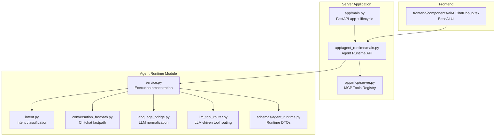
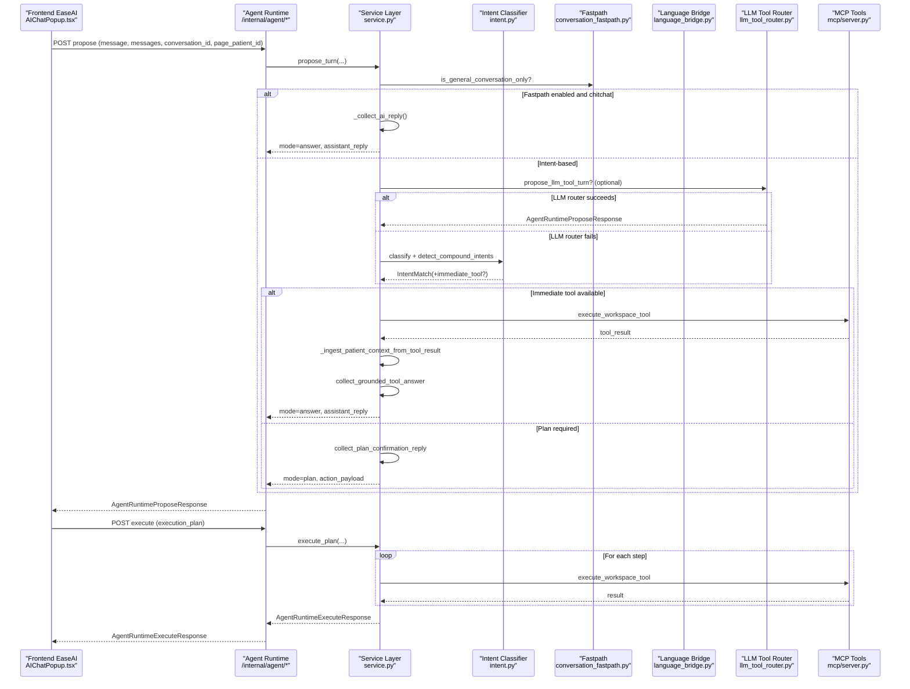
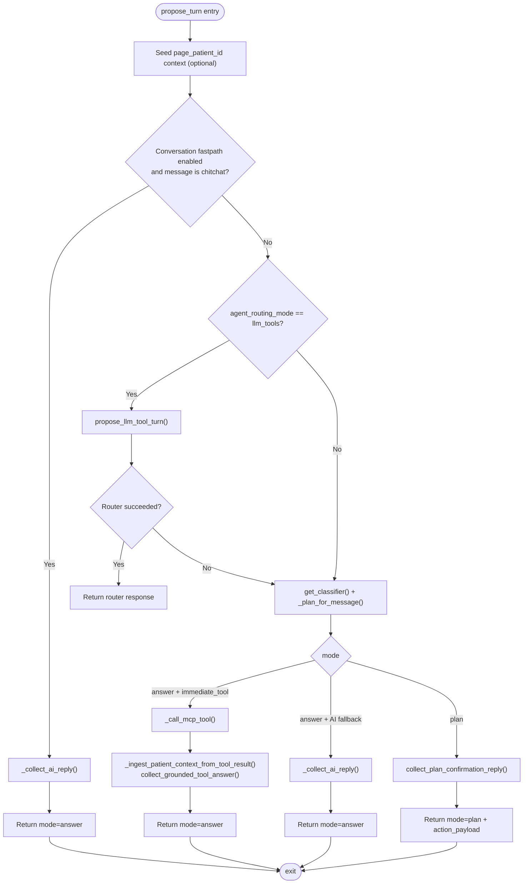
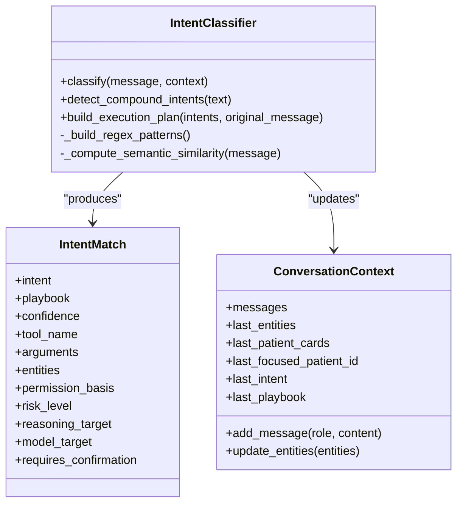
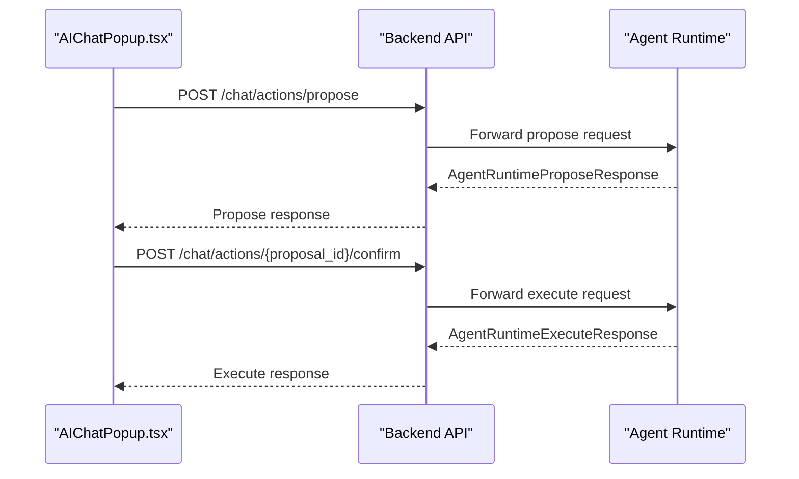
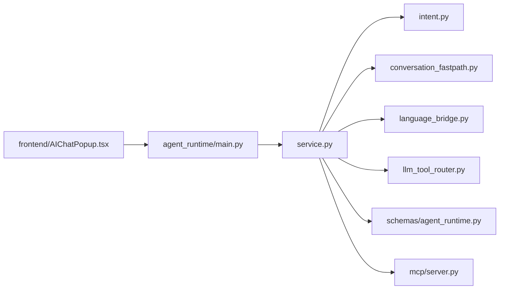

# Agent Runtime Core Services

<cite>
**Referenced Files in This Document**
- [main.py](file://server/app/agent_runtime/main.py)
- [service.py](file://server/app/agent_runtime/service.py)
- [conversation_fastpath.py](file://server/app/agent_runtime/conversation_fastpath.py)
- [intent.py](file://server/app/agent_runtime/intent.py)
- [language_bridge.py](file://server/app/agent_runtime/language_bridge.py)
- [llm_tool_router.py](file://server/app/agent_runtime/llm_tool_router.py)
- [config.py](file://server/app/config.py)
- [schemas/agent_runtime.py](file://server/app/schemas/agent_runtime.py)
- [main.py](file://server/app/main.py)
- [mcp/server.py](file://server/app/mcp/server.py)
- [api/endpoints/chat.py](file://server/app/api/endpoints/chat.py)
- [components/ai/AIChatPopup.tsx](file://frontend/components/ai/AIChatPopup.tsx)
- [tests/test_agent_runtime.py](file://server/tests/test_agent_runtime.py)
</cite>

## Table of Contents
1. [Introduction](#introduction)
2. [Project Structure](#project-structure)
3. [Core Components](#core-components)
4. [Architecture Overview](#architecture-overview)
5. [Detailed Component Analysis](#detailed-component-analysis)
6. [Dependency Analysis](#dependency-analysis)
7. [Performance Considerations](#performance-considerations)
8. [Troubleshooting Guide](#troubleshooting-guide)
9. [Conclusion](#conclusion)
10. [Appendices](#appendices)

## Introduction
This document describes the core agent runtime services powering the WheelSense AI system. It covers the main agent runtime controller, initialization and lifecycle management, the conversation fastpath for immediate responses, runtime context management, the service layer with dependency injection and error handling, integration with frontend AI components, and practical configuration and scalability guidance.

## Project Structure
The agent runtime is implemented as a FastAPI application module under server/app/agent_runtime, exposing internal endpoints for planning and execution. It integrates with the broader server application, MCP tooling, and the frontend chat UI.

**Diagram sources**
- [main.py:1-55](file://server/app/agent_runtime/main.py#L1-L55)
- [service.py:1-561](file://server/app/agent_runtime/service.py#L1-L561)
- [intent.py:1-1024](file://server/app/agent_runtime/intent.py#L1-L1024)
- [conversation_fastpath.py:1-45](file://server/app/agent_runtime/conversation_fastpath.py#L1-L45)
- [language_bridge.py:1-125](file://server/app/agent_runtime/language_bridge.py#L1-L125)
- [llm_tool_router.py:1-366](file://server/app/agent_runtime/llm_tool_router.py#L1-L366)
- [schemas/agent_runtime.py:1-57](file://server/app/schemas/agent_runtime.py#L1-L57)
- [main.py:1-123](file://server/app/main.py#L1-L123)
- [mcp/server.py:1-800](file://server/app/mcp/server.py#L1-L800)
- [components/ai/AIChatPopup.tsx:1-677](file://frontend/components/ai/AIChatPopup.tsx#L1-L677)

**Section sources**
- [main.py:1-55](file://server/app/agent_runtime/main.py#L1-L55)
- [main.py:1-123](file://server/app/main.py#L1-L123)

## Core Components
- Agent Runtime Controller: Exposes internal endpoints for propose and execute flows, validates internal secrets, and delegates to the service layer.
- Service Layer: Orchestrates intent classification, MCP tool execution, conversation context, and AI fallback replies.
- Intent Classifier: Regex-based + semantic matching with confidence thresholds and context-awareness.
- Conversation Fastpath: Heuristic to bypass intent/MCP for obvious chitchat.
- Language Bridge: Optional LLM normalization to improve multilingual intent classification.
- LLM Tool Router: Experimental LLM-driven tool selection for propose_turn.
- Configuration: Centralized settings controlling routing modes, timeouts, and AI providers.
- Frontend Integration: EaseAI chat UI sends propose/confirm/execute requests and renders grounded answers.

**Section sources**
- [main.py:1-55](file://server/app/agent_runtime/main.py#L1-L55)
- [service.py:1-561](file://server/app/agent_runtime/service.py#L1-L561)
- [intent.py:1-1024](file://server/app/agent_runtime/intent.py#L1-L1024)
- [conversation_fastpath.py:1-45](file://server/app/agent_runtime/conversation_fastpath.py#L1-L45)
- [language_bridge.py:1-125](file://server/app/agent_runtime/language_bridge.py#L1-L125)
- [llm_tool_router.py:1-366](file://server/app/agent_runtime/llm_tool_router.py#L1-L366)
- [config.py:1-152](file://server/app/config.py#L1-L152)
- [schemas/agent_runtime.py:1-57](file://server/app/schemas/agent_runtime.py#L1-L57)
- [components/ai/AIChatPopup.tsx:1-677](file://frontend/components/ai/AIChatPopup.tsx#L1-L677)

## Architecture Overview
The agent runtime sits behind internal-only endpoints and coordinates intent classification, MCP tool execution, and AI fallback. It maintains conversation context and supports two routing modes: intent classifier and LLM tool router. MCP tools are exposed via a mounted FastMCP server.

**Diagram sources**
- [main.py:30-55](file://server/app/agent_runtime/main.py#L30-L55)
- [service.py:346-561](file://server/app/agent_runtime/service.py#L346-L561)
- [intent.py:347-800](file://server/app/agent_runtime/intent.py#L347-L800)
- [conversation_fastpath.py:32-45](file://server/app/agent_runtime/conversation_fastpath.py#L32-L45)
- [language_bridge.py:38-125](file://server/app/agent_runtime/language_bridge.py#L38-L125)
- [llm_tool_router.py:173-366](file://server/app/agent_runtime/llm_tool_router.py#L173-L366)
- [mcp/server.py:110-800](file://server/app/mcp/server.py#L110-L800)
- [components/ai/AIChatPopup.tsx:306-431](file://frontend/components/ai/AIChatPopup.tsx#L306-L431)

## Detailed Component Analysis

### Agent Runtime Controller
- Internal-only endpoints:
  - GET /health
  - POST /internal/agent/propose
  - POST /internal/agent/execute
- Validates internal service secret via header.
- Delegates to service functions for propose and execute.

**Section sources**
- [main.py:1-55](file://server/app/agent_runtime/main.py#L1-L55)

### Service Layer Orchestration
Responsibilities:
- Conversation context management: per-conversation dictionaries stored in-memory (production-grade deployments should externalize to Redis/DB).
- Page patient seeding: pre-seeds context when EaseAI is opened from a patient record page.
- Intent planning: orchestrates intent classification, LLM normalization, and LLM tool router fallback.
- Immediate tool execution: runs high-confidence read-only tools without confirmation.
- Execution plan execution: iterates steps and aggregates results.
- Grounded replies: constructs assistant replies from tool results and AI fallback.

Key functions and flows:
- propose_turn: Fastpath check, optional LLM tool router, intent classification, immediate tool execution, plan confirmation, AI fallback.
- execute_plan: step-wise MCP execution and result aggregation.

**Diagram sources**
- [service.py:346-520](file://server/app/agent_runtime/service.py#L346-L520)
- [conversation_fastpath.py:32-45](file://server/app/agent_runtime/conversation_fastpath.py#L32-L45)
- [llm_tool_router.py:173-366](file://server/app/agent_runtime/llm_tool_router.py#L173-L366)
- [intent.py:202-321](file://server/app/agent_runtime/intent.py#L202-L321)

**Section sources**
- [service.py:1-561](file://server/app/agent_runtime/service.py#L1-L561)

### Conversation Fastpath
- Purpose: Skip intent classification and MCP for obvious greetings/thanks.
- Heuristics:
  - Enforces maximum length.
  - Rejects domain-specific tokens (e.g., patient/alert/room/device/ward/workflow).
  - Rejects messages containing digits (avoiding commands).
  - Matches strict chitchat patterns in Thai and English.

**Section sources**
- [conversation_fastpath.py:1-45](file://server/app/agent_runtime/conversation_fastpath.py#L1-L45)

### Intent Classification and Context
- IntentClassifier:
  - Regex patterns for high-confidence matches.
  - Semantic embeddings (sentence-transformers) fallback when enabled.
  - Confidence thresholds: HIGH, MEDIUM, LOW.
  - Context-awareness via ConversationContext (last N messages, entities, focused patient).
- Entity resolution:
  - Resolves patient IDs from roster/context for follow-up requests.
  - Updates conversation context with tool results (e.g., last_patient_cards, last_focused_patient_id).
- Tool metadata and permission mapping.

**Diagram sources**
- [intent.py:59-1024](file://server/app/agent_runtime/intent.py#L59-L1024)

**Section sources**
- [intent.py:1-1024](file://server/app/agent_runtime/intent.py#L1-L1024)

### Language Bridge (LLM Normalization)
- Optional normalization of non-English messages to English for intent classification.
- Uses configured AI provider (Ollama/Copilot) with timeouts.
- Returns normalized text or None if disabled/failed.

**Section sources**
- [language_bridge.py:1-125](file://server/app/agent_runtime/language_bridge.py#L1-L125)

### LLM Tool Router (Experimental)
- When enabled, proposes tool calls directly from the LLM.
- Builds OpenAI-style tool schemas from registered MCP tools and enforces role-based allowlists.
- Supports read-only auto-execution and mutation confirmation flows.
- Falls back to intent classifier if LLM routing fails.

**Section sources**
- [llm_tool_router.py:1-366](file://server/app/agent_runtime/llm_tool_router.py#L1-L366)

### Runtime Context Management
- In-memory dictionary keyed by conversation_id.
- Stores recent messages, entities, and focused patient context.
- Persistence: Current implementation is in-memory; recommended to externalize to Redis/DB for production.

**Section sources**
- [service.py:148-200](file://server/app/agent_runtime/service.py#L148-L200)

### Dependency Injection and Service Layer Contracts
- Service functions depend on:
  - SQLAlchemy async sessions for DB access.
  - Token resolution and workspace retrieval.
  - MCP tool execution via execute_workspace_tool.
  - AI chat services for replies and grounded answers.
- Strong separation of concerns: controller delegates to service, which depends on classifiers, bridges, routers, and MCP.

**Section sources**
- [service.py:1-561](file://server/app/agent_runtime/service.py#L1-L561)
- [mcp/server.py:1-800](file://server/app/mcp/server.py#L1-L800)

### Frontend Integration (EaseAI)
- UI component sends propose/confirm/execute requests to backend endpoints.
- Renders grounded replies and execution step lists.
- Handles conversation history and fallback streaming chat when agent endpoints are unavailable.

**Diagram sources**
- [components/ai/AIChatPopup.tsx:306-431](file://frontend/components/ai/AIChatPopup.tsx#L306-L431)
- [api/endpoints/chat.py:1-150](file://server/app/api/endpoints/chat.py#L1-L150)
- [main.py:30-55](file://server/app/agent_runtime/main.py#L30-L55)

**Section sources**
- [components/ai/AIChatPopup.tsx:1-677](file://frontend/components/ai/AIChatPopup.tsx#L1-L677)
- [api/endpoints/chat.py:1-150](file://server/app/api/endpoints/chat.py#L1-L150)

## Dependency Analysis
- Internal dependencies:
  - agent_runtime/main.py depends on service.py and schemas.
  - service.py depends on intent.py, conversation_fastpath.py, language_bridge.py, llm_tool_router.py, and MCP server.
- External integrations:
  - AI providers (Ollama/Copilot) for normalization and chat.
  - MCP tools registry for workspace-scoped operations.
  - Frontend UI for user interactions.

**Diagram sources**
- [main.py:1-55](file://server/app/agent_runtime/main.py#L1-L55)
- [service.py:1-561](file://server/app/agent_runtime/service.py#L1-L561)
- [intent.py:1-1024](file://server/app/agent_runtime/intent.py#L1-L1024)
- [conversation_fastpath.py:1-45](file://server/app/agent_runtime/conversation_fastpath.py#L1-L45)
- [language_bridge.py:1-125](file://server/app/agent_runtime/language_bridge.py#L1-L125)
- [llm_tool_router.py:1-366](file://server/app/agent_runtime/llm_tool_router.py#L1-L366)
- [schemas/agent_runtime.py:1-57](file://server/app/schemas/agent_runtime.py#L1-L57)
- [mcp/server.py:1-800](file://server/app/mcp/server.py#L1-L800)
- [components/ai/AIChatPopup.tsx:1-677](file://frontend/components/ai/AIChatPopup.tsx#L1-L677)

**Section sources**
- [main.py:1-55](file://server/app/agent_runtime/main.py#L1-L55)
- [service.py:1-561](file://server/app/agent_runtime/service.py#L1-L561)

## Performance Considerations
- Conversation fastpath reduces latency for simple chitchat by bypassing intent and MCP.
- LLM normalization and semantic embeddings add latency; tune thresholds and disable where unnecessary.
- MCP tool execution is synchronous; consider batching or caching where appropriate.
- Memory usage grows with conversation contexts; externalize to Redis/DB for scale.
- AI provider timeouts should be tuned to avoid blocking propose/execute.

[No sources needed since this section provides general guidance]

## Troubleshooting Guide
Common issues and diagnostics:
- Internal secret mismatch: 401 responses on internal endpoints indicate missing or incorrect X-WheelSense-Internal-Secret header.
- Intent classification failures: Verify regex patterns and semantic model availability; check thresholds and normalization settings.
- LLM tool router failures: Inspect provider configuration and role-based tool allowlists; fallback to intent classifier logs.
- MCP tool errors: Review tool permissions, workspace scoping, and actor context; check MCP server logs.
- Conversation context anomalies: Confirm in-memory store behavior and consider persistence migration.

**Section sources**
- [main.py:17-23](file://server/app/agent_runtime/main.py#L17-L23)
- [service.py:427-442](file://server/app/agent_runtime/service.py#L427-L442)
- [llm_tool_router.py:221-263](file://server/app/agent_runtime/llm_tool_router.py#L221-L263)
- [mcp/server.py:113-128](file://server/app/mcp/server.py#L113-L128)

## Conclusion
The WheelSense agent runtime provides a robust, extensible foundation for conversational AI in healthcare environments. It balances speed (fastpath), accuracy (intent + semantics), and safety (confirmation flows) while integrating tightly with MCP tools and the frontend UI. Production deployments should focus on externalizing conversation context, tuning AI providers, and monitoring performance and reliability.

## Appendices

### Practical Configuration Examples
- Enable/disable intent AI fastpath and routing mode:
  - intent_ai_conversation_fastpath_enabled
  - agent_routing_mode
- AI provider and model selection:
  - ai_provider, ai_default_model, ollama_base_url, copilot_cli_url
- LLM normalization:
  - intent_llm_normalize_enabled, intent_llm_normalize_timeout_seconds
- Agent LLM router model:
  - agent_llm_router_model

**Section sources**
- [config.py:68-94](file://server/app/config.py#L68-L94)

### Service Initialization and Lifecycle
- Server lifecycle initializes DB, admin user, and background tasks; agent runtime endpoints are part of the mounted FastAPI app.
- Internal secret enforcement ensures only trusted callers can reach propose/execute endpoints.

**Section sources**
- [main.py:26-67](file://server/app/main.py#L26-L67)
- [main.py:17-23](file://server/app/agent_runtime/main.py#L17-L23)

### Conversation Flow Management
- Frontend initiates propose, receives either immediate answer or plan with action payload.
- Confirmation triggers execution plan step-by-step, aggregating results and returning a consolidated response.

**Section sources**
- [components/ai/AIChatPopup.tsx:306-431](file://frontend/components/ai/AIChatPopup.tsx#L306-L431)
- [service.py:533-561](file://server/app/agent_runtime/service.py#L533-L561)
- [tests/test_agent_runtime.py:460-597](file://server/tests/test_agent_runtime.py#L460-L597)