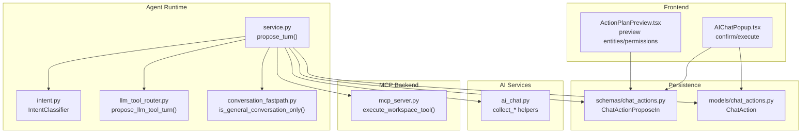
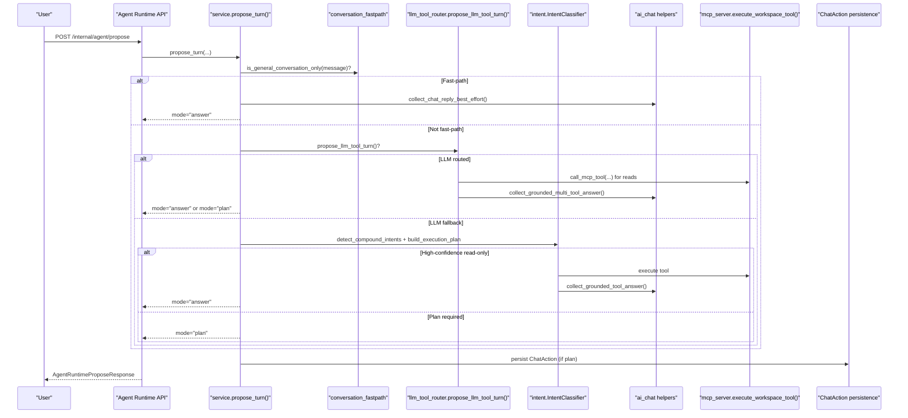
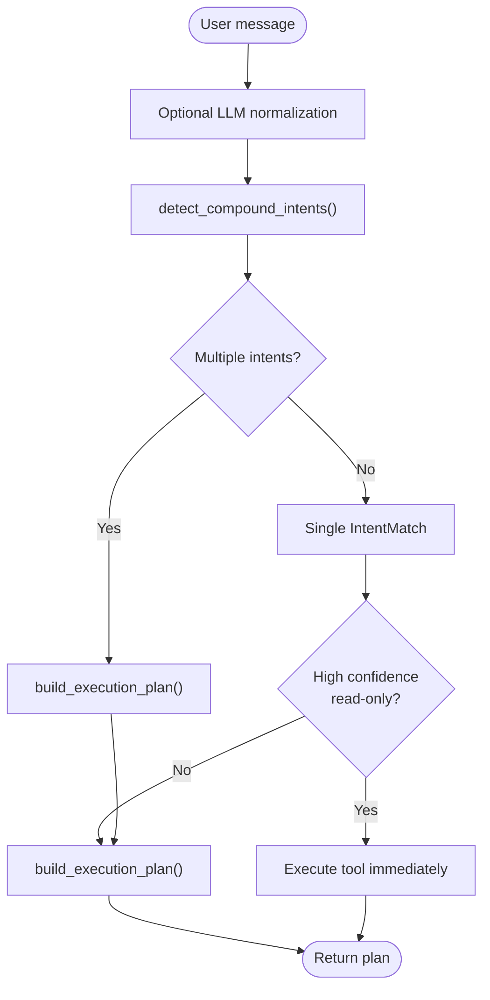
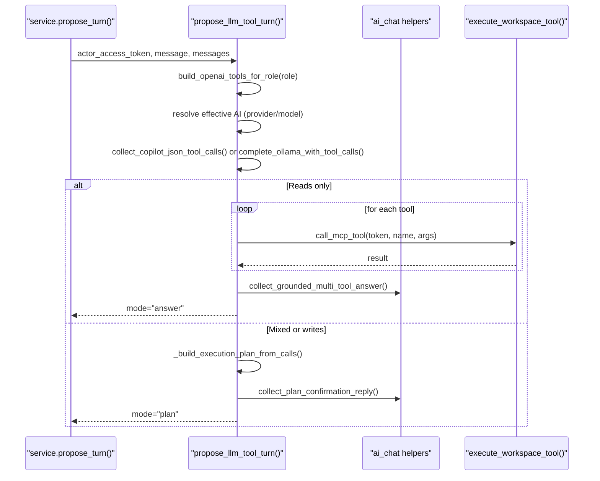
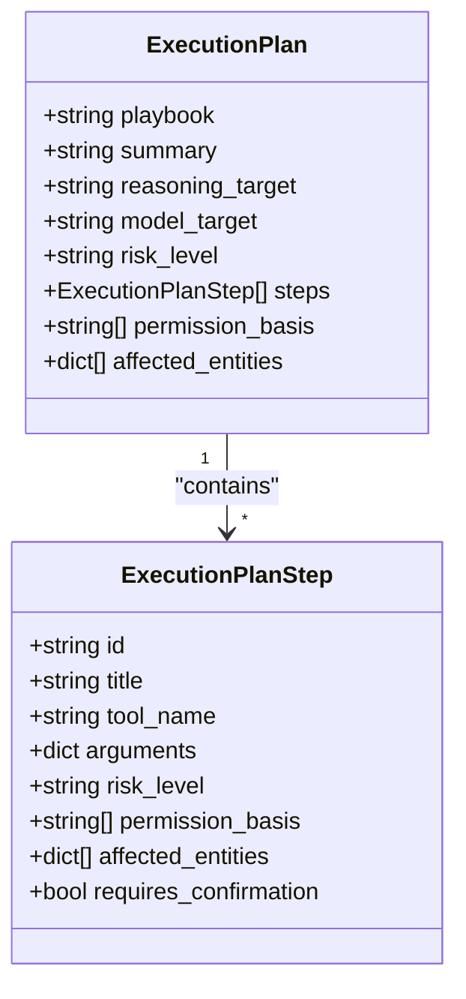
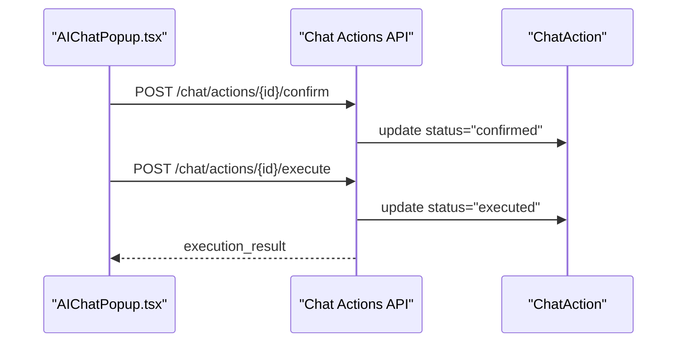
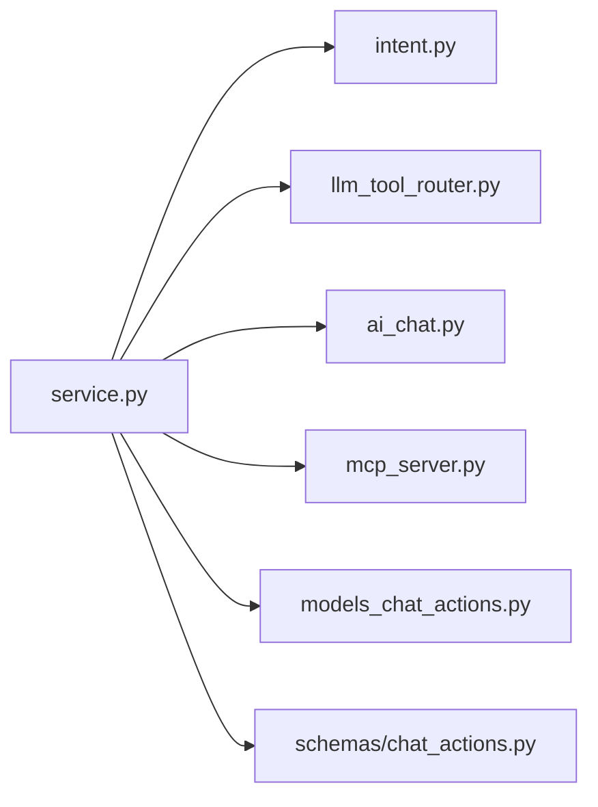

# Action Proposal Stage

<cite>
**Referenced Files in This Document**
- [intent.py](file://server/app/agent_runtime/intent.py)
- [llm_tool_router.py](file://server/app/agent_runtime/llm_tool_router.py)
- [conversation_fastpath.py](file://server/app/agent_runtime/conversation_fastpath.py)
- [service.py](file://server/app/agent_runtime/service.py)
- [main.py](file://server/app/agent_runtime/main.py)
- [agent_runtime.py](file://server/app/schemas/agent_runtime.py)
- [chat_actions.py](file://server/app/schemas/chat_actions.py)
- [models_chat_actions.py](file://server/app/models/chat_actions.py)
- [ai_chat.py](file://server/app/services/ai_chat.py)
- [mcp_server.py](file://server/app/mcp/server.py)
- [AIChatPopup.tsx](file://frontend/components/ai/AIChatPopup.tsx)
- [ActionPlanPreview.tsx](file://frontend/components/ai/ActionPlanPreview.tsx)
</cite>

## Table of Contents
1. [Introduction](#introduction)
2. [Project Structure](#project-structure)
3. [Core Components](#core-components)
4. [Architecture Overview](#architecture-overview)
5. [Detailed Component Analysis](#detailed-component-analysis)
6. [Dependency Analysis](#dependency-analysis)
7. [Performance Considerations](#performance-considerations)
8. [Troubleshooting Guide](#troubleshooting-guide)
9. [Conclusion](#conclusion)
10. [Appendices](#appendices)

## Introduction
This document explains the Action Proposal Stage in the three-stage chat actions flow. It covers how user intent is classified, how compound intents are detected, how confidence scores guide decisions, and how the system chooses between immediate execution, plan-based confirmation, or fallback answers. It also documents the MCP tool routing mechanism for LLM-native tool selection, the conversation fast-path for general chat, the execution plan building process, affected entity tracking, permission basis determination, and the transition from proposal to confirmation. Practical examples illustrate intent classification, tool selection, and automatic execution patterns, along with error handling for failed tool executions.

## Project Structure
The Action Proposal Stage spans several modules:
- Agent runtime orchestration and routing
- Intent classification and execution plan building
- LLM-driven MCP tool routing
- Conversation fast-path for general chat
- Persistent chat action proposals and confirmation/execution
- Frontend integration for confirming and executing proposals

**Diagram sources**
- [service.py:346-520](file://server/app/agent_runtime/service.py#L346-L520)
- [intent.py:347-1023](file://server/app/agent_runtime/intent.py#L347-L1023)
- [llm_tool_router.py:173-366](file://server/app/agent_runtime/llm_tool_router.py#L173-L366)
- [conversation_fastpath.py:32-45](file://server/app/agent_runtime/conversation_fastpath.py#L32-L45)
- [ai_chat.py:1165-1249](file://server/app/services/ai_chat.py#L1165-L1249)
- [mcp_server.py:122-146](file://server/app/mcp/server.py#L122-L146)
- [chat_actions.py:17-31](file://server/app/schemas/chat_actions.py#L17-L31)
- [models_chat_actions.py:11-62](file://server/app/models/chat_actions.py#L11-L62)
- [AIChatPopup.tsx:363-433](file://frontend/components/ai/AIChatPopup.tsx#L363-L433)
- [ActionPlanPreview.tsx:260-292](file://frontend/components/ai/ActionPlanPreview.tsx#L260-L292)

**Section sources**
- [service.py:346-520](file://server/app/agent_runtime/service.py#L346-L520)
- [intent.py:347-1023](file://server/app/agent_runtime/intent.py#L347-L1023)
- [llm_tool_router.py:173-366](file://server/app/agent_runtime/llm_tool_router.py#L173-L366)
- [conversation_fastpath.py:32-45](file://server/app/agent_runtime/conversation_fastpath.py#L32-L45)
- [ai_chat.py:1165-1249](file://server/app/services/ai_chat.py#L1165-L1249)
- [mcp_server.py:122-146](file://server/app/mcp/server.py#L122-L146)
- [chat_actions.py:17-31](file://server/app/schemas/chat_actions.py#L17-L31)
- [models_chat_actions.py:11-62](file://server/app/models/chat_actions.py#L11-L62)
- [AIChatPopup.tsx:363-433](file://frontend/components/ai/AIChatPopup.tsx#L363-L433)
- [ActionPlanPreview.tsx:260-292](file://frontend/components/ai/ActionPlanPreview.tsx#L260-L292)

## Core Components
- IntentClassifier: Regex-based and semantic intent detection, compound intent parsing, confidence scoring, and execution plan building.
- LLM Tool Router: LLM-native MCP tool selection with role-based allow-lists, read-only auto-execution, and plan generation.
- Conversation Fast Path: Heuristic filter to bypass intent/classification for pure chit-chat.
- Agent Runtime Service: Orchestrates fast-path, LLM routing, intent classification, immediate execution, plan creation, and AI fallback.
- Chat Action Schema/Model: Defines proposal payloads and persists proposals until confirmation/execution.
- MCP Backend: Executes tools with scoped permissions and returns structured results.
- Frontend Integration: Confirms and executes proposals, displays affected entities and permissions.

**Section sources**
- [intent.py:347-1023](file://server/app/agent_runtime/intent.py#L347-L1023)
- [llm_tool_router.py:173-366](file://server/app/agent_runtime/llm_tool_router.py#L173-L366)
- [conversation_fastpath.py:32-45](file://server/app/agent_runtime/conversation_fastpath.py#L32-L45)
- [service.py:346-520](file://server/app/agent_runtime/service.py#L346-L520)
- [chat_actions.py:17-31](file://server/app/schemas/chat_actions.py#L17-L31)
- [models_chat_actions.py:11-62](file://server/app/models/chat_actions.py#L11-L62)
- [mcp_server.py:122-146](file://server/app/mcp/server.py#L122-L146)
- [AIChatPopup.tsx:363-433](file://frontend/components/ai/AIChatPopup.tsx#L363-L433)
- [ActionPlanPreview.tsx:260-292](file://frontend/components/ai/ActionPlanPreview.tsx#L260-L292)

## Architecture Overview
The proposal stage selects among:
- Conversation fast-path: immediate AI answer for small talk
- LLM tool routing: LLM selects MCP tools (auto-run read-only, otherwise plan)
- Intent classification: regex + semantic classification, compound intent detection, confidence scoring, immediate read-only execution, or plan
- AI fallback: when confidence is low or classification fails

**Diagram sources**
- [service.py:346-520](file://server/app/agent_runtime/service.py#L346-L520)
- [conversation_fastpath.py:32-45](file://server/app/agent_runtime/conversation_fastpath.py#L32-L45)
- [llm_tool_router.py:173-366](file://server/app/agent_runtime/llm_tool_router.py#L173-L366)
- [intent.py:347-1023](file://server/app/agent_runtime/intent.py#L347-L1023)
- [ai_chat.py:1165-1249](file://server/app/services/ai_chat.py#L1165-L1249)
- [mcp_server.py:122-146](file://server/app/mcp/server.py#L122-L146)
- [models_chat_actions.py:11-62](file://server/app/models/chat_actions.py#L11-L62)

## Detailed Component Analysis

### Intent Classification and Compound Intents
- Regex + semantic matching: The classifier builds regex patterns for common intents and falls back to semantic similarity using sentence transformers when enabled.
- Compound intent detection: Splits messages with conjunctions and constructs multiple IntentMatch entries, later aggregated into a multi-step ExecutionPlan.
- Confidence scoring: Thresholds drive decisions (e.g., high-confidence read-only tools may auto-run).
- Execution plan building: Aggregates entities, permissions, and risk levels; deduplicates entities and permissions; sets playbook and model targets.

**Diagram sources**
- [intent.py:887-915](file://server/app/agent_runtime/intent.py#L887-L915)
- [intent.py:916-1011](file://server/app/agent_runtime/intent.py#L916-L1011)
- [service.py:202-321](file://server/app/agent_runtime/service.py#L202-L321)

**Section sources**
- [intent.py:347-1023](file://server/app/agent_runtime/intent.py#L347-L1023)
- [service.py:202-321](file://server/app/agent_runtime/service.py#L202-L321)

### LLM Tool Routing Mechanism (MCP-native)
- Role-based tool allow-list: Tools are exposed to the LLM based on the acting user’s role.
- Read-only auto-execution: If the LLM selects only read-only tools, they are executed immediately and grounded answers are produced.
- Plan generation: If writes are requested, a plan is built and returned for confirmation.
- Fallback: If JSON tool-calling fails, the system falls back to OpenAI-compatible tool-calling.

**Diagram sources**
- [llm_tool_router.py:173-366](file://server/app/agent_runtime/llm_tool_router.py#L173-L366)
- [ai_chat.py:1165-1249](file://server/app/services/ai_chat.py#L1165-L1249)
- [mcp_server.py:122-146](file://server/app/mcp/server.py#L122-L146)

**Section sources**
- [llm_tool_router.py:173-366](file://server/app/agent_runtime/llm_tool_router.py#L173-L366)
- [ai_chat.py:1165-1249](file://server/app/services/ai_chat.py#L1165-L1249)
- [mcp_server.py:122-146](file://server/app/mcp/server.py#L122-L146)

### Conversation Fast Path for General Chat
- Conservative heuristic: Messages that are short, lack digits, and do not hint at domain-specific commands are routed directly to the AI chat model.
- Prevents unnecessary intent/classification overhead for small talk.

**Section sources**
- [conversation_fastpath.py:32-45](file://server/app/agent_runtime/conversation_fastpath.py#L32-L45)
- [service.py:356-367](file://server/app/agent_runtime/service.py#L356-L367)

### Execution Plan Building and Affected Entity Tracking
- ExecutionPlan aggregates steps, permission basis, affected entities, and risk level.
- Entities are deduplicated by type/id; permissions are de-duplicated and ordered.
- Risk level is derived from the highest risk among steps.

**Diagram sources**
- [agent_runtime.py:10-30](file://server/app/schemas/agent_runtime.py#L10-L30)

**Section sources**
- [intent.py:916-1011](file://server/app/agent_runtime/intent.py#L916-L1011)
- [agent_runtime.py:10-30](file://server/app/schemas/agent_runtime.py#L10-L30)

### Permission Basis Determination
- Permission basis is derived from tool names and intent metadata.
- For LLM routing, each step’s permission basis reflects the tool name.
- For intent classification, permission basis is taken from the intent metadata.

**Section sources**
- [intent.py:16-45](file://server/app/agent_runtime/intent.py#L16-L45)
- [llm_tool_router.py:136-170](file://server/app/agent_runtime/llm_tool_router.py#L136-L170)

### Automatic Tool Execution for High-Confidence Read-Only Operations
- High-confidence read-only tools (e.g., list_visible_patients, list_active_alerts) are executed immediately and grounded answers are produced.
- Patient-scoped reads (e.g., get_patient_vitals, get_patient_timeline) may auto-run even with entities present.

**Section sources**
- [service.py:281-310](file://server/app/agent_runtime/service.py#L281-L310)
- [intent.py:47-56](file://server/app/agent_runtime/intent.py#L47-L56)
- [intent.py:61-66](file://server/app/agent_runtime/intent.py#L61-L66)

### Transition from Proposal to Confirmation
- When a plan is generated, the system returns mode="plan" with an execution plan and an action payload.
- The frontend confirms the proposal, then executes it, updating step results and completion state.

**Diagram sources**
- [AIChatPopup.tsx:363-433](file://frontend/components/ai/AIChatPopup.tsx#L363-L433)
- [ai_chat.py:1198-1249](file://server/app/services/ai_chat.py#L1198-L1249)

**Section sources**
- [AIChatPopup.tsx:363-433](file://frontend/components/ai/AIChatPopup.tsx#L363-L433)
- [ai_chat.py:1198-1249](file://server/app/services/ai_chat.py#L1198-L1249)

### Practical Examples

- Example 1: Compound intent “list patients and show alerts”
  - Classifier detects two intents, builds a multi-step plan with affected entities and permission basis.
  - Risk level determined by the highest risk among steps.

- Example 2: High-confidence read-only “list rooms”
  - Regex match triggers immediate execution; grounded answer is produced.

- Example 3: LLM-native tool selection “acknowledge alert 123”
  - LLM selects acknowledge_alert; if read-only, auto-executes; otherwise, generates a plan.

- Example 4: Conversation fast-path “hi there”
  - Message matches small talk pattern; AI reply is returned without intent/classification.

**Section sources**
- [intent.py:887-915](file://server/app/agent_runtime/intent.py#L887-L915)
- [intent.py:916-1011](file://server/app/agent_runtime/intent.py#L916-L1011)
- [service.py:281-310](file://server/app/agent_runtime/service.py#L281-L310)
- [llm_tool_router.py:173-366](file://server/app/agent_runtime/llm_tool_router.py#L173-L366)
- [conversation_fastpath.py:32-45](file://server/app/agent_runtime/conversation_fastpath.py#L32-L45)

## Dependency Analysis
- Agent runtime orchestrator depends on:
  - Intent classifier for regex + semantic classification and plan building
  - LLM tool router for role-based MCP tool selection
  - AI chat services for grounded answers and plan confirmation replies
  - MCP backend for tool execution with scoped permissions
  - Persistence layer for chat action proposals

**Diagram sources**
- [service.py:346-520](file://server/app/agent_runtime/service.py#L346-L520)
- [intent.py:347-1023](file://server/app/agent_runtime/intent.py#L347-L1023)
- [llm_tool_router.py:173-366](file://server/app/agent_runtime/llm_tool_router.py#L173-L366)
- [ai_chat.py:1165-1249](file://server/app/services/ai_chat.py#L1165-L1249)
- [mcp_server.py:122-146](file://server/app/mcp/server.py#L122-L146)
- [models_chat_actions.py:11-62](file://server/app/models/chat_actions.py#L11-L62)
- [chat_actions.py:17-31](file://server/app/schemas/chat_actions.py#L17-L31)

**Section sources**
- [service.py:346-520](file://server/app/agent_runtime/service.py#L346-L520)
- [intent.py:347-1023](file://server/app/agent_runtime/intent.py#L347-L1023)
- [llm_tool_router.py:173-366](file://server/app/agent_runtime/llm_tool_router.py#L173-L366)
- [ai_chat.py:1165-1249](file://server/app/services/ai_chat.py#L1165-L1249)
- [mcp_server.py:122-146](file://server/app/mcp/server.py#L122-L146)
- [models_chat_actions.py:11-62](file://server/app/models/chat_actions.py#L11-L62)
- [chat_actions.py:17-31](file://server/app/schemas/chat_actions.py#L17-L31)

## Performance Considerations
- Semantic embeddings are lazily loaded and cached per model name to avoid repeated initialization.
- Conversation context is kept minimal (last N messages and recent entities) to reduce memory footprint.
- LLM tool routing supports fallbacks to avoid blocking on failures.
- Immediate read-only tools are executed synchronously during propose to minimize latency for simple queries.

[No sources needed since this section provides general guidance]

## Troubleshooting Guide
Common issues and resolutions:
- LLM tool routing failure: Falls back to intent classification; logs exceptions and continues with AI fallback if needed.
- Intent classification low confidence: Switches to AI fallback; ensure messages are clear and unambiguous.
- Immediate tool execution failure: Returns an answer with error details and classification metadata.
- MCP tool execution errors: Logged with exception details; UI surfaces user-friendly messages.

**Section sources**
- [service.py:378-382](file://server/app/agent_runtime/service.py#L378-L382)
- [service.py:427-442](file://server/app/agent_runtime/service.py#L427-L442)
- [llm_tool_router.py:231-263](file://server/app/agent_runtime/llm_tool_router.py#L231-L263)
- [llm_tool_router.py:285-299](file://server/app/agent_runtime/llm_tool_router.py#L285-L299)

## Conclusion
The Action Proposal Stage integrates multiple pathways to handle user intent efficiently: conversation fast-path for small talk, LLM-native MCP tool routing for precise tool selection, and robust intent classification with plan building for complex or risky operations. High-confidence read-only tools are auto-executed for quick responses, while write operations are presented as plans requiring confirmation. The system tracks affected entities and permission basis, persists proposals, and provides a clear transition to confirmation and execution.

[No sources needed since this section summarizes without analyzing specific files]

## Appendices

### A. API Contracts and Payloads
- AgentRuntimeProposeRequest: input message, conversation context, actor access token, optional page_patient_id.
- AgentRuntimeProposeResponse: mode, assistant_reply, optional plan, optional action_payload, grounding metadata.
- ChatActionProposeIn: defines the proposal payload persisted for confirmation/execution.

**Section sources**
- [agent_runtime.py:32-57](file://server/app/schemas/agent_runtime.py#L32-L57)
- [chat_actions.py:17-31](file://server/app/schemas/chat_actions.py#L17-L31)

### B. Frontend Integration Notes
- Confirm and execute flows are handled by the frontend component, which posts to the chat actions endpoints and updates UI state based on step results.

**Section sources**
- [AIChatPopup.tsx:363-433](file://frontend/components/ai/AIChatPopup.tsx#L363-L433)