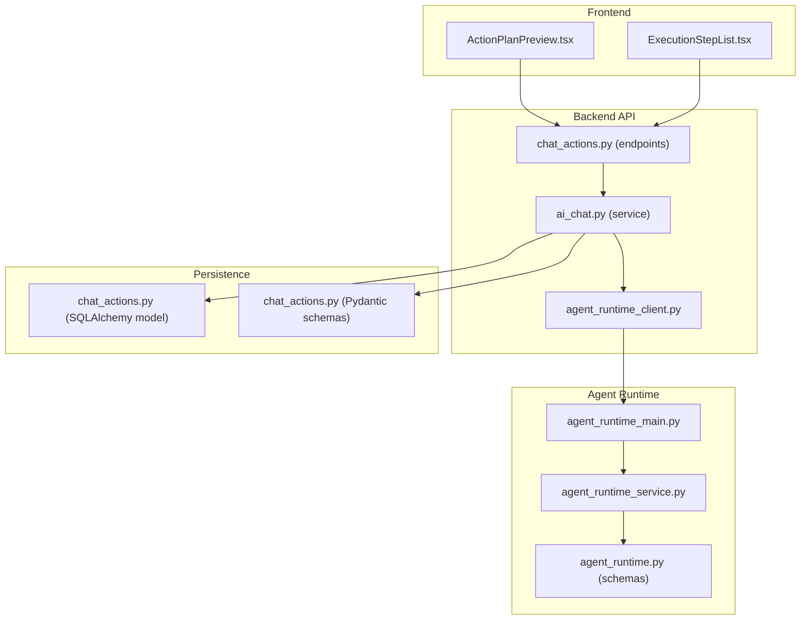
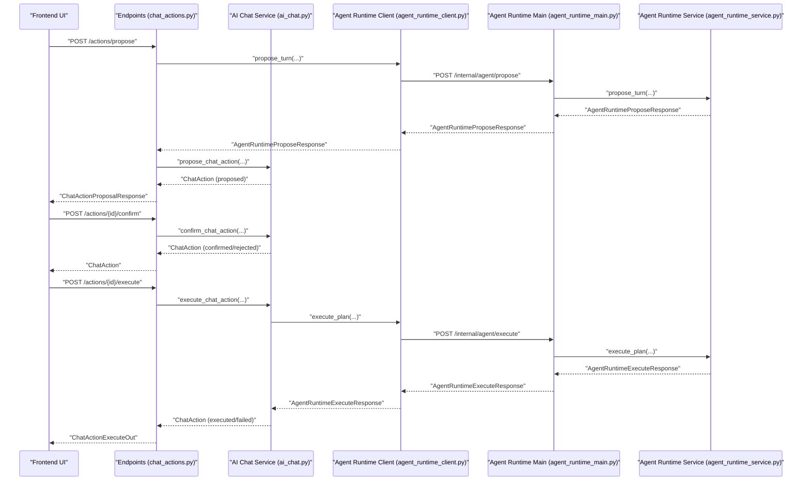
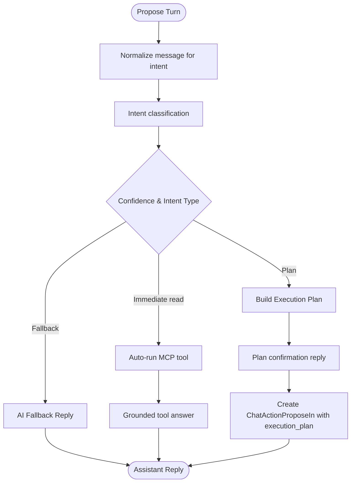
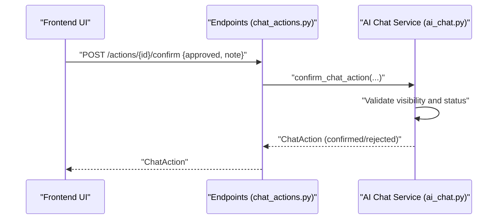
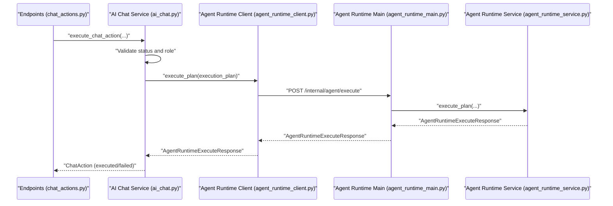
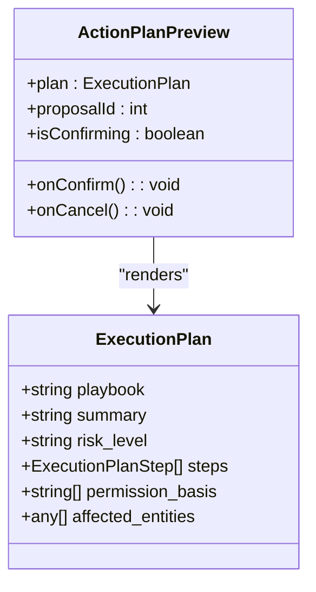
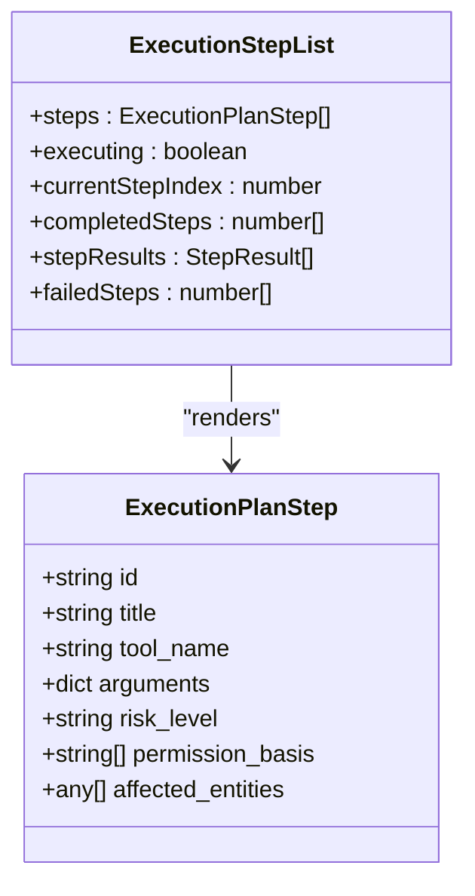
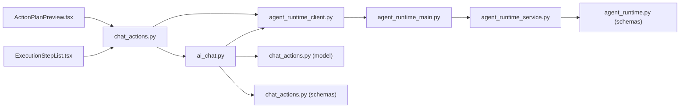

# Chat Actions & Three-Stage Flow

<cite>
**Referenced Files in This Document**
- [chat_actions.py](file://server/app/models/chat_actions.py)
- [chat_actions.py](file://server/app/schemas/chat_actions.py)
- [chat_actions.py](file://server/app/api/endpoints/chat_actions.py)
- [ai_chat.py](file://server/app/services/ai_chat.py)
- [agent_runtime.py](file://server/app/schemas/agent_runtime.py)
- [agent_runtime_main.py](file://server/app/agent_runtime/main.py)
- [agent_runtime_service.py](file://server/app/agent_runtime/service.py)
- [agent_runtime_client.py](file://server/app/services/agent_runtime_client.py)
- [ActionPlanPreview.tsx](file://frontend/components/ai/ActionPlanPreview.tsx)
- [ExecutionStepList.tsx](file://frontend/components/ai/ExecutionStepList.tsx)
- [test_chat_actions.py](file://server/tests/test_chat_actions.py)
- [test_chat_actions_integration.py](file://server/tests/test_chat_actions_integration.py)
</cite>

## Table of Contents
1. [Introduction](#introduction)
2. [Project Structure](#project-structure)
3. [Core Components](#core-components)
4. [Architecture Overview](#architecture-overview)
5. [Detailed Component Analysis](#detailed-component-analysis)
6. [Dependency Analysis](#dependency-analysis)
7. [Performance Considerations](#performance-considerations)
8. [Troubleshooting Guide](#troubleshooting-guide)
9. [Conclusion](#conclusion)

## Introduction
This document explains the WheelSense AI chat actions system and its three-stage flow: propose → confirm → execute. It covers how the system classifies intent, selects tools, plans execution, assesses risk, and mediates user approvals. It documents the action plan preview UI, the execution step list, and the audit trail. Practical examples illustrate typical flows, risk scenarios, and user interactions. Error handling and rollback semantics are also addressed.

## Project Structure
The chat actions system spans backend API endpoints, service orchestration, agent runtime integration, and frontend UI components:
- Backend API: endpoints for listing, proposing, confirming, and executing actions
- Services: AI chat orchestration, agent runtime client, and workflow audit trail
- Agent Runtime: intent classification, plan building, and tool execution
- Frontend: action plan preview and execution step list UIs

**Diagram sources**
- [chat_actions.py:124-300](file://server/app/api/endpoints/chat_actions.py#L124-L300)
- [ai_chat.py:1140-1361](file://server/app/services/ai_chat.py#L1140-L1361)
- [agent_runtime_client.py:23-65](file://server/app/services/agent_runtime_client.py#L23-L65)
- [agent_runtime_main.py:30-55](file://server/app/agent_runtime/main.py#L30-L55)
- [agent_runtime_service.py:346-520](file://server/app/agent_runtime/service.py#L346-L520)
- [agent_runtime.py:10-57](file://server/app/schemas/agent_runtime.py#L10-L57)
- [chat_actions.py:11-62](file://server/app/models/chat_actions.py#L11-L62)
- [chat_actions.py:17-102](file://server/app/schemas/chat_actions.py#L17-L102)

**Section sources**
- [chat_actions.py:124-300](file://server/app/api/endpoints/chat_actions.py#L124-L300)
- [ai_chat.py:1140-1361](file://server/app/services/ai_chat.py#L1140-L1361)
- [agent_runtime_main.py:30-55](file://server/app/agent_runtime/main.py#L30-L55)
- [agent_runtime_service.py:346-520](file://server/app/agent_runtime/service.py#L346-L520)
- [agent_runtime.py:10-57](file://server/app/schemas/agent_runtime.py#L10-L57)
- [chat_actions.py:11-62](file://server/app/models/chat_actions.py#L11-L62)
- [chat_actions.py:17-102](file://server/app/schemas/chat_actions.py#L17-L102)

## Core Components
- ChatAction model: persistent record of proposed, confirmed, executed, rejected, or failed actions with timestamps and execution results
- Pydantic schemas: input/output contracts for propose/confirm/execute and action proposal responses
- Endpoints: REST API for listing, retrieving, proposing, confirming, and executing actions
- AI chat service: orchestrates propose/confirm/execute lifecycle, enforces role-based tool allowlists, records audit trail, and normalizes timestamps
- Agent runtime: intent classification, plan construction, and MCP tool execution
- Frontend components: action plan preview and execution step list UIs

**Section sources**
- [chat_actions.py:11-62](file://server/app/models/chat_actions.py#L11-L62)
- [chat_actions.py:17-102](file://server/app/schemas/chat_actions.py#L17-L102)
- [chat_actions.py:93-300](file://server/app/api/endpoints/chat_actions.py#L93-L300)
- [ai_chat.py:1140-1361](file://server/app/services/ai_chat.py#L1140-L1361)
- [agent_runtime.py:10-57](file://server/app/schemas/agent_runtime.py#L10-L57)
- [agent_runtime_main.py:30-55](file://server/app/agent_runtime/main.py#L30-L55)
- [agent_runtime_service.py:346-520](file://server/app/agent_runtime/service.py#L346-L520)
- [ActionPlanPreview.tsx:117-361](file://frontend/components/ai/ActionPlanPreview.tsx#L117-L361)
- [ExecutionStepList.tsx:218-295](file://frontend/components/ai/ExecutionStepList.tsx#L218-L295)

## Architecture Overview
The system integrates frontend UI with backend endpoints, which delegate to the AI chat service. The AI chat service interacts with the agent runtime via an internal HTTP client. The agent runtime classifies intent, builds execution plans, and executes MCP tools. Results are persisted and audited.

**Diagram sources**
- [chat_actions.py:124-300](file://server/app/api/endpoints/chat_actions.py#L124-L300)
- [ai_chat.py:1140-1361](file://server/app/services/ai_chat.py#L1140-L1361)
- [agent_runtime_client.py:23-65](file://server/app/services/agent_runtime_client.py#L23-L65)
- [agent_runtime_main.py:30-55](file://server/app/agent_runtime/main.py#L30-L55)
- [agent_runtime_service.py:346-520](file://server/app/agent_runtime/service.py#L346-L520)

## Detailed Component Analysis

### Action Proposal Stage
- Intent classification and tool selection: The agent runtime classifies user messages, detects compound or single intents, and decides whether to auto-answer, build a plan, or fall back to AI.
- Execution planning with risk assessment: Plans include steps with risk levels, permission basis, and affected entities. The plan summary and steps inform the action payload.
- Risk assessment: Risk levels are embedded in the execution plan and surfaced in the UI.
- Permission validation: The AI chat service validates that the actor’s role is allowed to call the tools in the plan or single tool.

**Diagram sources**
- [agent_runtime_service.py:202-321](file://server/app/agent_runtime/service.py#L202-L321)
- [agent_runtime_service.py:346-520](file://server/app/agent_runtime/service.py#L346-L520)
- [agent_runtime.py:10-57](file://server/app/schemas/agent_runtime.py#L10-L57)
- [ai_chat.py:1140-1196](file://server/app/services/ai_chat.py#L1140-L1196)

**Section sources**
- [agent_runtime_service.py:202-321](file://server/app/agent_runtime/service.py#L202-L321)
- [agent_runtime_service.py:346-520](file://server/app/agent_runtime/service.py#L346-L520)
- [agent_runtime.py:10-57](file://server/app/schemas/agent_runtime.py#L10-L57)
- [ai_chat.py:1140-1196](file://server/app/services/ai_chat.py#L1140-L1196)

### Confirmation Stage
- User approval workflows: The endpoint accepts a confirmation request with approval decision and note.
- Risk mitigation strategies: The plan’s risk level and permission basis are presented to the user for informed consent.
- Permission validation: The AI chat service ensures the actor can act on the proposed changes and that the action is visible to the actor.

**Diagram sources**
- [chat_actions.py:242-259](file://server/app/api/endpoints/chat_actions.py#L242-L259)
- [ai_chat.py:1198-1232](file://server/app/services/ai_chat.py#L1198-L1232)

**Section sources**
- [chat_actions.py:242-259](file://server/app/api/endpoints/chat_actions.py#L242-L259)
- [ai_chat.py:1198-1232](file://server/app/services/ai_chat.py#L1198-L1232)

### Execution Stage
- Tool invocation: For single tool actions, a minimal plan is constructed; for plan actions, the stored execution plan is used.
- Status tracking: Execution updates the action’s status, timestamps, and result payload.
- Result reporting: The endpoint returns a structured execution result and updates the conversation if linked.

**Diagram sources**
- [chat_actions.py:261-299](file://server/app/api/endpoints/chat_actions.py#L261-L299)
- [ai_chat.py:1234-1361](file://server/app/services/ai_chat.py#L1234-L1361)
- [agent_runtime_client.py:48-65](file://server/app/services/agent_runtime_client.py#L48-L65)
- [agent_runtime_main.py:45-55](file://server/app/agent_runtime/main.py#L45-L55)
- [agent_runtime_service.py:533-561](file://server/app/agent_runtime/service.py#L533-L561)

**Section sources**
- [chat_actions.py:261-299](file://server/app/api/endpoints/chat_actions.py#L261-L299)
- [ai_chat.py:1234-1361](file://server/app/services/ai_chat.py#L1234-L1361)
- [agent_runtime_client.py:48-65](file://server/app/services/agent_runtime_client.py#L48-L65)
- [agent_runtime_service.py:533-561](file://server/app/agent_runtime/service.py#L533-L561)

### Action Plan Preview Interface
- Proposed actions: The UI displays the action title, summary, risk level, affected entities, and required permissions.
- Confirmation requirements: The UI shows step count and estimated time to help users understand the scope.
- User interaction: Approve or reject buttons trigger the confirmation endpoint.

**Diagram sources**
- [ActionPlanPreview.tsx:26-32](file://frontend/components/ai/ActionPlanPreview.tsx#L26-L32)
- [agent_runtime.py:21-30](file://server/app/schemas/agent_runtime.py#L21-L30)

**Section sources**
- [ActionPlanPreview.tsx:117-361](file://frontend/components/ai/ActionPlanPreview.tsx#L117-L361)
- [agent_runtime.py:21-30](file://server/app/schemas/agent_runtime.py#L21-L30)

### Execution Step List
- Step tracking: Renders each step with status (pending, executing, completed, failed), risk level, tool name, permissions, and affected entities.
- Result display: Shows success or error messages per step with timestamps.
- Progress tracking: Displays overall progress and counts of completed/failed steps.

**Diagram sources**
- [ExecutionStepList.tsx:32-40](file://frontend/components/ai/ExecutionStepList.tsx#L32-L40)
- [agent_runtime.py:10-19](file://server/app/schemas/agent_runtime.py#L10-L19)

**Section sources**
- [ExecutionStepList.tsx:218-295](file://frontend/components/ai/ExecutionStepList.tsx#L218-L295)
- [agent_runtime.py:10-19](file://server/app/schemas/agent_runtime.py#L10-L19)

### Practical Examples
- Example 1: Propose a tool action, confirm, and execute
  - Propose: Create a chat action with a tool name and arguments
  - Confirm: Approve the action with a note
  - Execute: Run the action and receive a structured result
- Example 2: Propose a plan action with multiple steps
  - The agent runtime builds a plan with steps, risk levels, and permissions
  - The UI previews the plan and allows approval
  - On execution, step results are aggregated and returned
- Example 3: Force execution bypassing confirmation
  - Executing from proposed state with force flag is supported for admin/head nurse roles

**Section sources**
- [test_chat_actions.py:18-163](file://server/tests/test_chat_actions.py#L18-L163)
- [test_chat_actions_integration.py:102-172](file://server/tests/test_chat_actions_integration.py#L102-L172)
- [test_chat_actions_integration.py:272-364](file://server/tests/test_chat_actions_integration.py#L272-L364)
- [test_chat_actions_integration.py:627-668](file://server/tests/test_chat_actions_integration.py#L627-L668)

### Risk Assessment Scenarios
- Low-risk actions: Single read-only tools may auto-run if confidence is high and no entities are involved
- Medium/high-risk actions: Require explicit confirmation; the plan surfaces risk levels, permissions, and affected entities
- Permission basis: Required permissions are listed in the plan and validated against the actor’s role

**Section sources**
- [agent_runtime_service.py:286-310](file://server/app/agent_runtime/service.py#L286-L310)
- [agent_runtime.py:21-30](file://server/app/schemas/agent_runtime.py#L21-L30)
- [ai_chat.py:1154-1164](file://server/app/services/ai_chat.py#L1154-L1164)

### User Interaction Patterns
- Role-based visibility: Admins and head nurses can see all actions; observers see only their own
- Conversation linkage: Actions can be linked to a chat conversation; replies are appended upon execution
- Timestamp normalization: All timestamps are stored in UTC

**Section sources**
- [ai_chat.py:1126-1137](file://server/app/services/ai_chat.py#L1126-L1137)
- [chat_actions.py:109-122](file://server/app/api/endpoints/chat_actions.py#L109-L122)
- [test_chat_actions_integration.py:462-537](file://server/tests/test_chat_actions_integration.py#L462-L537)
- [test_chat_actions_integration.py:671-708](file://server/tests/test_chat_actions_integration.py#L671-L708)

### Error Handling, Rollback, and Audit Trail
- Error handling: Execution failures mark the action as failed, store the error message, and log an audit event
- Rollback: Not implemented; failed actions remain in failed state with error details
- Audit trail: Events are logged for propose, confirm, reject, execute, and execute_failed actions

**Section sources**
- [ai_chat.py:1284-1304](file://server/app/services/ai_chat.py#L1284-L1304)
- [ai_chat.py:1318-1337](file://server/app/services/ai_chat.py#L1318-L1337)
- [ai_chat.py:1179-1192](file://server/app/services/ai_chat.py#L1179-L1192)
- [ai_chat.py:1219-1228](file://server/app/services/ai_chat.py#L1219-L1228)
- [ai_chat.py:1347-1356](file://server/app/services/ai_chat.py#L1347-L1356)
- [test_chat_actions.py:18-93](file://server/tests/test_chat_actions.py#L18-L93)
- [test_chat_actions_integration.py:367-459](file://server/tests/test_chat_actions_integration.py#L367-L459)
- [test_chat_actions_integration.py:711-765](file://server/tests/test_chat_actions_integration.py#L711-L765)

## Dependency Analysis
- Endpoint dependencies: Endpoints depend on AI chat service and agent runtime client
- AI chat service dependencies: Uses SQLAlchemy models, Pydantic schemas, agent runtime client, and audit trail service
- Agent runtime dependencies: Depends on intent classification, MCP tool execution, and schemas
- Frontend dependencies: UI components depend on generated API types and translation utilities

**Diagram sources**
- [chat_actions.py:124-300](file://server/app/api/endpoints/chat_actions.py#L124-L300)
- [ai_chat.py:1140-1361](file://server/app/services/ai_chat.py#L1140-L1361)
- [agent_runtime_client.py:23-65](file://server/app/services/agent_runtime_client.py#L23-L65)
- [agent_runtime_main.py:30-55](file://server/app/agent_runtime/main.py#L30-L55)
- [agent_runtime_service.py:346-520](file://server/app/agent_runtime/service.py#L346-L520)
- [agent_runtime.py:10-57](file://server/app/schemas/agent_runtime.py#L10-L57)
- [chat_actions.py:11-62](file://server/app/models/chat_actions.py#L11-L62)
- [chat_actions.py:17-102](file://server/app/schemas/chat_actions.py#L17-L102)
- [ActionPlanPreview.tsx:117-361](file://frontend/components/ai/ActionPlanPreview.tsx#L117-L361)
- [ExecutionStepList.tsx:218-295](file://frontend/components/ai/ExecutionStepList.tsx#L218-L295)

**Section sources**
- [chat_actions.py:124-300](file://server/app/api/endpoints/chat_actions.py#L124-L300)
- [ai_chat.py:1140-1361](file://server/app/services/ai_chat.py#L1140-L1361)
- [agent_runtime_client.py:23-65](file://server/app/services/agent_runtime_client.py#L23-L65)
- [agent_runtime_main.py:30-55](file://server/app/agent_runtime/main.py#L30-L55)
- [agent_runtime_service.py:346-520](file://server/app/agent_runtime/service.py#L346-L520)
- [agent_runtime.py:10-57](file://server/app/schemas/agent_runtime.py#L10-L57)
- [chat_actions.py:11-62](file://server/app/models/chat_actions.py#L11-L62)
- [chat_actions.py:17-102](file://server/app/schemas/chat_actions.py#L17-L102)
- [ActionPlanPreview.tsx:117-361](file://frontend/components/ai/ActionPlanPreview.tsx#L117-L361)
- [ExecutionStepList.tsx:218-295](file://frontend/components/ai/ExecutionStepList.tsx#L218-L295)

## Performance Considerations
- Streaming and fallbacks: AI chat supports streaming responses and provider fallbacks to improve availability
- Plan confidence thresholds: Low-confidence plans fall back to AI answers to avoid risky auto-executions
- Asynchronous execution: Agent runtime executes steps sequentially; consider batching or parallelization for multi-step plans if needed

[No sources needed since this section provides general guidance]

## Troubleshooting Guide
- Agent runtime unavailability: The propose endpoint raises a 502 error when the agent runtime is unreachable
- Validation errors: Invalid payloads or unsupported actions raise 422 errors; role-based tool restrictions raise 403
- Execution failures: Failures during execution mark the action as failed and include error details
- Visibility issues: Non-admin roles cannot access actions they did not propose

**Section sources**
- [chat_actions.py:174-187](file://server/app/api/endpoints/chat_actions.py#L174-L187)
- [ai_chat.py:1154-1164](file://server/app/services/ai_chat.py#L1154-L1164)
- [ai_chat.py:1247-1249](file://server/app/services/ai_chat.py#L1247-L1249)
- [ai_chat.py:1284-1304](file://server/app/services/ai_chat.py#L1284-L1304)
- [ai_chat.py:1318-1337](file://server/app/services/ai_chat.py#L1318-L1337)
- [chat_actions.py:119-121](file://server/app/api/endpoints/chat_actions.py#L119-L121)

## Conclusion
The WheelSense AI chat actions system provides a robust three-stage flow for safe, auditable automation. The agent runtime classifies intents, constructs execution plans with risk and permissions, and the AI chat service enforces role-based access, tracks state, and maintains an audit trail. The frontend components present actionable previews and execution progress, enabling informed user decisions and transparency.