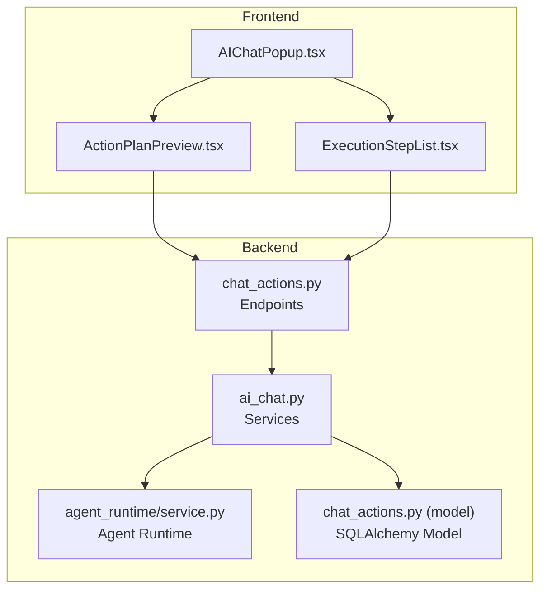
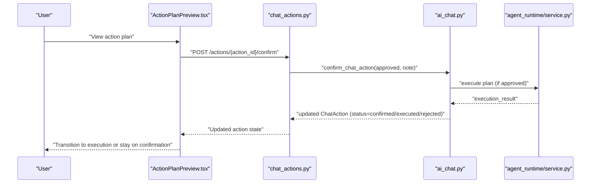
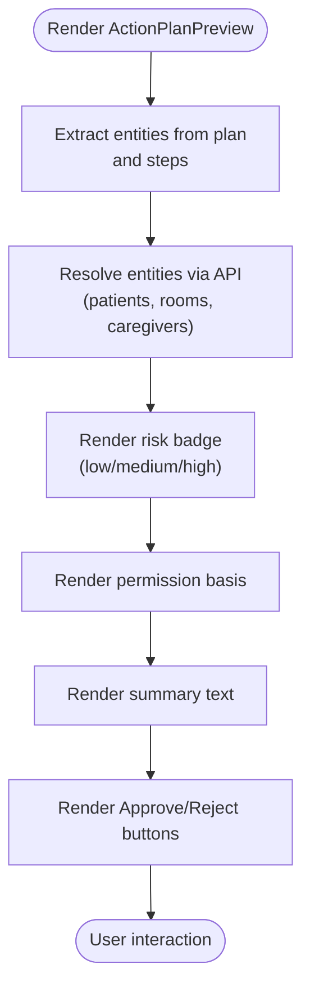
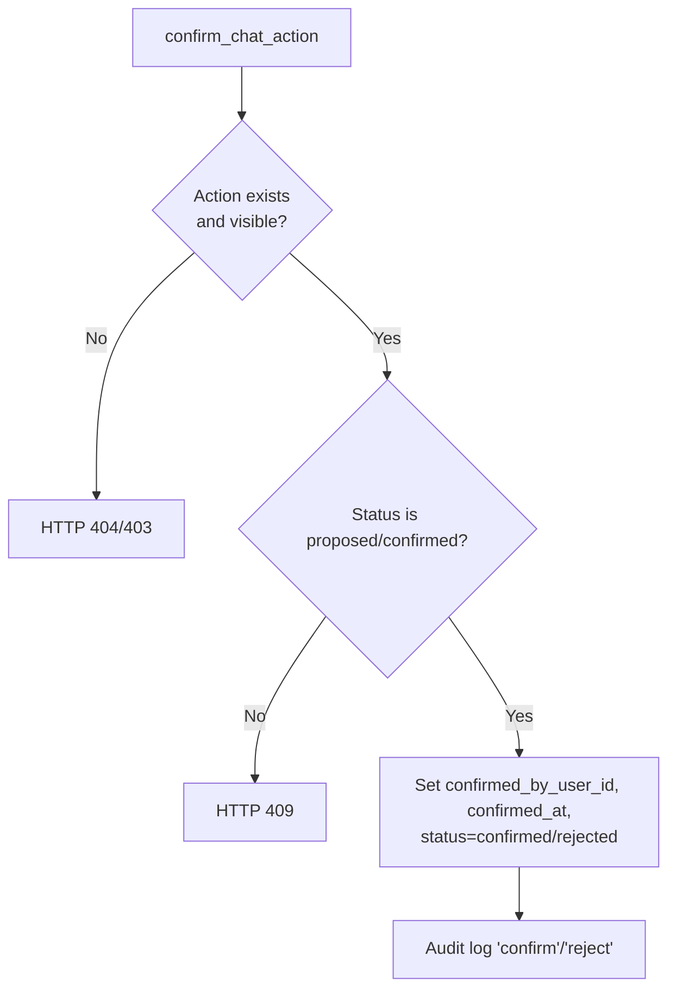
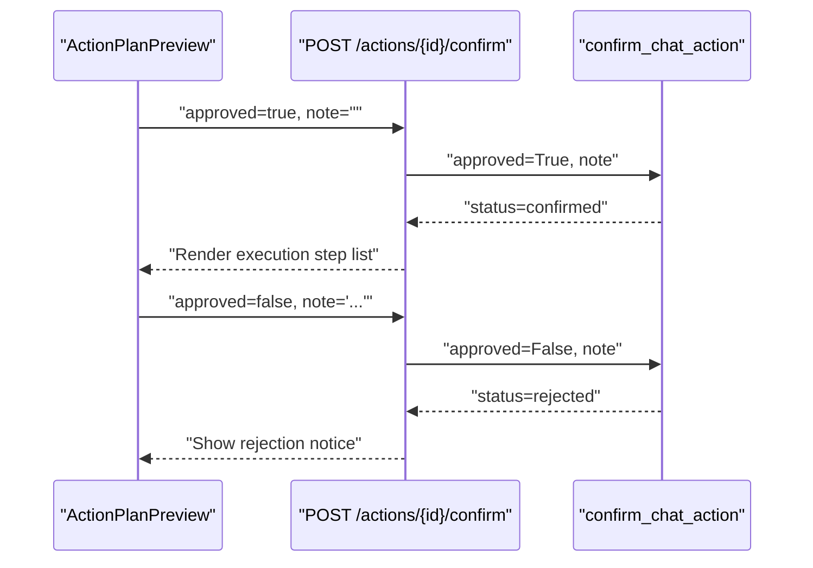
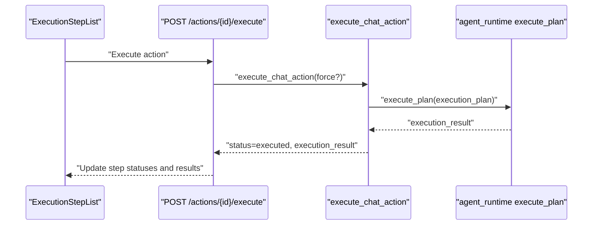
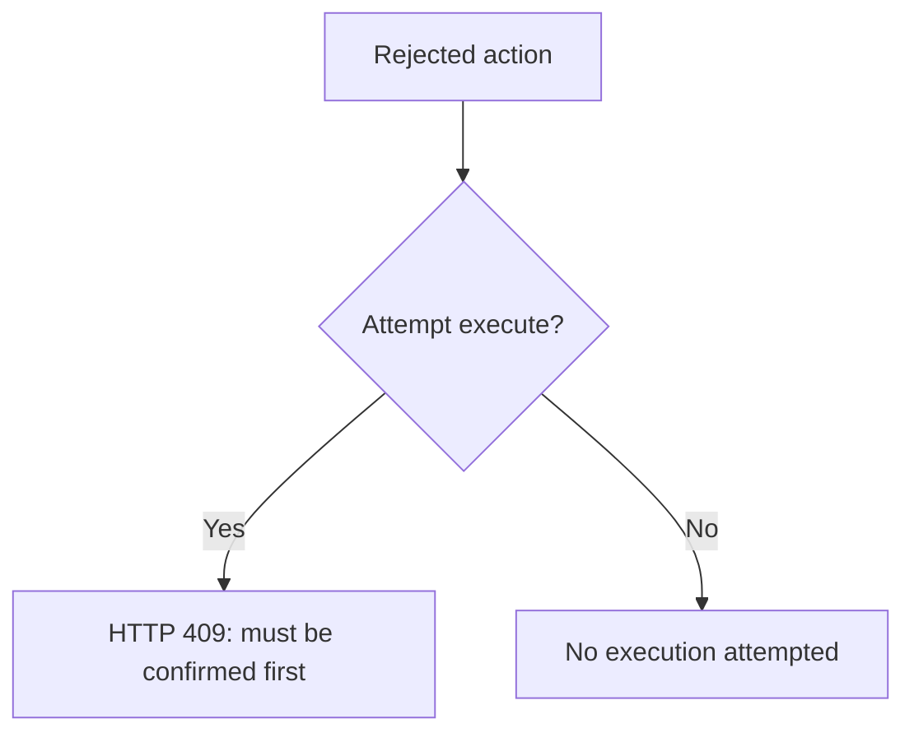
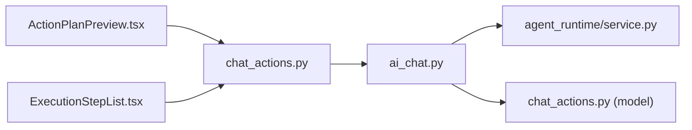

# Confirmation Stage

<cite>
**Referenced Files in This Document**
- [ActionPlanPreview.tsx](file://frontend/components/ai/ActionPlanPreview.tsx)
- [ExecutionStepList.tsx](file://frontend/components/ai/ExecutionStepList.tsx)
- [AIChatPopup.tsx](file://frontend/components/ai/AIChatPopup.tsx)
- [chat_actions.py](file://server/app/api/endpoints/chat_actions.py)
- [ai_chat.py](file://server/app/services/ai_chat.py)
- [service.py](file://server/app/agent_runtime/service.py)
- [chat_actions.py (model)](file://server/app/models/chat_actions.py)
- [chat_actions.py (schema)](file://server/app/schemas/chat_actions.py)
- [test_chat_actions_integration.py](file://server/tests/test_chat_actions_integration.py)
</cite>

## Table of Contents
1. [Introduction](#introduction)
2. [Project Structure](#project-structure)
3. [Core Components](#core-components)
4. [Architecture Overview](#architecture-overview)
5. [Detailed Component Analysis](#detailed-component-analysis)
6. [Dependency Analysis](#dependency-analysis)
7. [Performance Considerations](#performance-considerations)
8. [Troubleshooting Guide](#troubleshooting-guide)
9. [Conclusion](#conclusion)

## Introduction
This document explains the confirmation stage of the three-stage chat actions flow: propose → confirm → execute. It focuses on the user approval workflow, including the AI-generated confirmation message that summarizes proposed actions, risks, and required permissions; the action plan preview interface that shows step-by-step breakdown, affected entities, and potential side effects; and the user interaction patterns for approving or rejecting proposed actions. It also covers transitions to the execution stage upon approval, rejection handling, and practical examples of confirmation scenarios.

## Project Structure
The confirmation stage spans frontend UI components and backend services:
- Frontend: Action plan preview and step-by-step execution visualization
- Backend: API endpoints, service logic for confirmation, and agent runtime integration

**Diagram sources**
- [AIChatPopup.tsx:1-38](file://frontend/components/ai/AIChatPopup.tsx#L1-L38)
- [ActionPlanPreview.tsx:1-361](file://frontend/components/ai/ActionPlanPreview.tsx#L1-L361)
- [ExecutionStepList.tsx:1-295](file://frontend/components/ai/ExecutionStepList.tsx#L1-L295)
- [chat_actions.py:1-300](file://server/app/api/endpoints/chat_actions.py#L1-L300)
- [ai_chat.py:1198-1361](file://server/app/services/ai_chat.py#L1198-L1361)
- [service.py:450-561](file://server/app/agent_runtime/service.py#L450-L561)
- [chat_actions.py (model):1-62](file://server/app/models/chat_actions.py#L1-L62)

**Section sources**
- [ActionPlanPreview.tsx:1-361](file://frontend/components/ai/ActionPlanPreview.tsx#L1-L361)
- [ExecutionStepList.tsx:1-295](file://frontend/components/ai/ExecutionStepList.tsx#L1-L295)
- [AIChatPopup.tsx:1-38](file://frontend/components/ai/AIChatPopup.tsx#L1-L38)
- [chat_actions.py:1-300](file://server/app/api/endpoints/chat_actions.py#L1-L300)
- [ai_chat.py:1198-1361](file://server/app/services/ai_chat.py#L1198-L1361)
- [service.py:450-561](file://server/app/agent_runtime/service.py#L450-L561)
- [chat_actions.py (model):1-62](file://server/app/models/chat_actions.py#L1-L62)

## Core Components
- ActionPlanPreview: Presents the AI-generated confirmation message, risk level, affected entities, and required permissions; provides Approve/Reject controls.
- ExecutionStepList: Visualizes step-by-step execution details, risk badges, permissions, affected entities, and per-step results.
- API endpoints: Expose propose, confirm, and execute operations; handle conversation linkage and assistant replies.
- Services: Implement confirmation logic, permission checks, and execution orchestration.
- Agent runtime: Generates the plan, constructs the confirmation message, and executes steps.

**Section sources**
- [ActionPlanPreview.tsx:117-361](file://frontend/components/ai/ActionPlanPreview.tsx#L117-L361)
- [ExecutionStepList.tsx:218-295](file://frontend/components/ai/ExecutionStepList.tsx#L218-L295)
- [chat_actions.py:124-259](file://server/app/api/endpoints/chat_actions.py#L124-L259)
- [ai_chat.py:1198-1361](file://server/app/services/ai_chat.py#L1198-L1361)
- [service.py:454-561](file://server/app/agent_runtime/service.py#L454-L561)

## Architecture Overview
The confirmation stage centers on an ExecutionPlan produced by the agent runtime. The plan is serialized into a ChatAction proposal, presented to the user via the ActionPlanPreview, and then confirmed or rejected. Approval transitions to execution; rejection prevents execution.

**Diagram sources**
- [ActionPlanPreview.tsx:328-357](file://frontend/components/ai/ActionPlanPreview.tsx#L328-L357)
- [chat_actions.py:242-258](file://server/app/api/endpoints/chat_actions.py#L242-L258)
- [ai_chat.py:1198-1361](file://server/app/services/ai_chat.py#L1198-L1361)
- [service.py:533-561](file://server/app/agent_runtime/service.py#L533-L561)

## Detailed Component Analysis

### Action Plan Presentation and Risk Assessment
- AI-generated confirmation message: The agent runtime composes a natural-language summary of the plan, highlighting what will change, key targets, and that user confirmation is required.
- Risk display: The preview shows a risk level badge (low/medium/high) with appropriate icons and variants.
- Permissions display: Required permission basis strings are listed for transparency.
- Affected entities: The preview extracts and resolves entities (patients, rooms, caregivers, devices) and displays them as badges with optional status and subtitles.

**Diagram sources**
- [ActionPlanPreview.tsx:68-115](file://frontend/components/ai/ActionPlanPreview.tsx#L68-L115)
- [ActionPlanPreview.tsx:128-201](file://frontend/components/ai/ActionPlanPreview.tsx#L128-L201)
- [ActionPlanPreview.tsx:243-246](file://frontend/components/ai/ActionPlanPreview.tsx#L243-L246)
- [ActionPlanPreview.tsx:291-304](file://frontend/components/ai/ActionPlanPreview.tsx#L291-L304)
- [ActionPlanPreview.tsx:250-254](file://frontend/components/ai/ActionPlanPreview.tsx#L250-L254)

**Section sources**
- [ActionPlanPreview.tsx:1-361](file://frontend/components/ai/ActionPlanPreview.tsx#L1-L361)
- [service.py:454-502](file://server/app/agent_runtime/service.py#L454-L502)
- [ai_chat.py:1075-1101](file://server/app/services/ai_chat.py#L1075-L1101)

### Permission Validation and Access Control
- Visibility checks: The backend ensures the requesting user can see the action before confirming.
- Role-based tool allowance: During execution, tools are validated against the actor’s role to prevent unauthorized operations.
- Conversation linkage: Actions can be associated with a chat conversation; retrieval enforces visibility rules.

**Diagram sources**
- [ai_chat.py:1198-1231](file://server/app/services/ai_chat.py#L1198-L1231)
- [chat_actions.py:116-121](file://server/app/api/endpoints/chat_actions.py#L116-L121)

**Section sources**
- [ai_chat.py:1198-1231](file://server/app/services/ai_chat.py#L1198-L1231)
- [chat_actions.py:116-121](file://server/app/api/endpoints/chat_actions.py#L116-L121)

### User Interaction Patterns: Approve or Modify
- Approve: The user confirms the action; the backend updates status to confirmed and records confirmation metadata.
- Reject: The user rejects the action; the backend sets status to rejected and prevents subsequent execution attempts.
- Modification: The plan is generated by the agent runtime and embedded in the proposal; the UI does not expose inline modifications at confirmation time. Modifications would require re-proposal.

**Diagram sources**
- [ActionPlanPreview.tsx:328-357](file://frontend/components/ai/ActionPlanPreview.tsx#L328-L357)
- [chat_actions.py:242-258](file://server/app/api/endpoints/chat_actions.py#L242-L258)
- [ai_chat.py:1198-1231](file://server/app/services/ai_chat.py#L1198-L1231)

**Section sources**
- [ActionPlanPreview.tsx:328-357](file://frontend/components/ai/ActionPlanPreview.tsx#L328-L357)
- [chat_actions.py:242-258](file://server/app/api/endpoints/chat_actions.py#L242-L258)
- [ai_chat.py:1198-1231](file://server/app/services/ai_chat.py#L1198-L1231)

### Transition to Execution Stage Upon Approval
- Approved actions move to the execution stage, where the agent runtime executes the plan step-by-step.
- The execution UI shows progress, per-step results, and final outcomes.
- Execution errors are captured and surfaced to the user.

**Diagram sources**
- [ExecutionStepList.tsx:218-295](file://frontend/components/ai/ExecutionStepList.tsx#L218-L295)
- [chat_actions.py:261-299](file://server/app/api/endpoints/chat_actions.py#L261-L299)
- [ai_chat.py:1234-1361](file://server/app/services/ai_chat.py#L1234-L1361)
- [service.py:533-561](file://server/app/agent_runtime/service.py#L533-L561)

**Section sources**
- [ExecutionStepList.tsx:1-295](file://frontend/components/ai/ExecutionStepList.tsx#L1-L295)
- [chat_actions.py:261-299](file://server/app/api/endpoints/chat_actions.py#L261-L299)
- [ai_chat.py:1234-1361](file://server/app/services/ai_chat.py#L1234-L1361)
- [service.py:533-561](file://server/app/agent_runtime/service.py#L533-L561)

### Rejection Handling and Prevention of Execution
- Rejected actions cannot be executed; attempting to execute a rejected action raises a conflict error.
- The backend preserves the rejection note and audit trail for compliance.

**Diagram sources**
- [ai_chat.py:1247-1249](file://server/app/services/ai_chat.py#L1247-L1249)
- [test_chat_actions_integration.py:546-589](file://server/tests/test_chat_actions_integration.py#L546-L589)

**Section sources**
- [ai_chat.py:1247-1249](file://server/app/services/ai_chat.py#L1247-L1249)
- [test_chat_actions_integration.py:546-589](file://server/tests/test_chat_actions_integration.py#L546-L589)

### Practical Examples and Decision-Making Processes
- Example scenario: A plan proposes multiple steps affecting patients and rooms. The preview highlights risk, permissions, and affected entities. The user reviews and approves.
- Risk mitigation: Low-risk plans may be auto-executed under special conditions (e.g., force flag), but high-risk plans require explicit confirmation.
- Decision-making: The UI emphasizes transparency (permissions, entities, risk) to support informed decisions.

[No sources needed since this section synthesizes patterns without quoting specific code]

## Dependency Analysis
- Frontend depends on backend schemas and endpoints for rendering and submitting confirmations.
- Backend services depend on the agent runtime for plan generation and execution.
- Database model persists action lifecycle and metadata.

**Diagram sources**
- [ActionPlanPreview.tsx:1-361](file://frontend/components/ai/ActionPlanPreview.tsx#L1-L361)
- [ExecutionStepList.tsx:1-295](file://frontend/components/ai/ExecutionStepList.tsx#L1-L295)
- [chat_actions.py:1-300](file://server/app/api/endpoints/chat_actions.py#L1-L300)
- [ai_chat.py:1198-1361](file://server/app/services/ai_chat.py#L1198-L1361)
- [service.py:450-561](file://server/app/agent_runtime/service.py#L450-L561)
- [chat_actions.py (model):1-62](file://server/app/models/chat_actions.py#L1-L62)

**Section sources**
- [chat_actions.py (schema):1-102](file://server/app/schemas/chat_actions.py#L1-L102)
- [chat_actions.py (model):1-62](file://server/app/models/chat_actions.py#L1-L62)

## Performance Considerations
- Entity resolution: Batched entity resolution in the preview avoids redundant network calls and surfaces unresolved entities gracefully.
- Rendering: Conditional rendering of risk, permissions, and affected entities reduces unnecessary DOM updates.
- Execution progress: The step list efficiently tracks completed/failed steps and renders minimal UI for pending steps.

[No sources needed since this section provides general guidance]

## Troubleshooting Guide
- Confirmation fails with conflict: Ensure the action is in the proposed or confirmed state before confirming.
- Rejected action cannot execute: Verify the action status is confirmed before attempting execution.
- Execution errors: Inspect the execution result payload and error message recorded on the action.
- Conversation linkage: When retrieving actions, ensure the user has visibility to the associated conversation.

**Section sources**
- [ai_chat.py:1211-1217](file://server/app/services/ai_chat.py#L1211-L1217)
- [ai_chat.py:1247-1249](file://server/app/services/ai_chat.py#L1247-L1249)
- [test_chat_actions_integration.py:546-589](file://server/tests/test_chat_actions_integration.py#L546-L589)
- [chat_actions.py:116-121](file://server/app/api/endpoints/chat_actions.py#L116-L121)

## Conclusion
The confirmation stage ensures safe, transparent, and auditable transitions from proposed actions to execution. The ActionPlanPreview communicates risks, permissions, and affected entities, while the confirm endpoint enforces access control and state transitions. Approved actions proceed to execution; rejected actions remain non-executable. This design balances automation with user control and compliance.