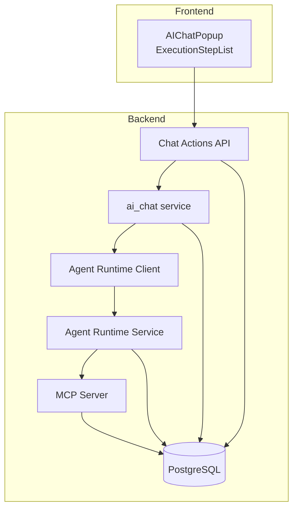
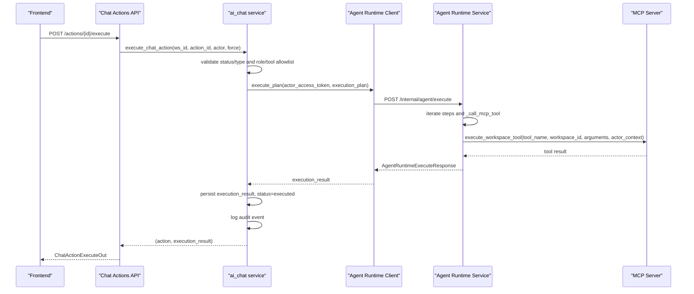
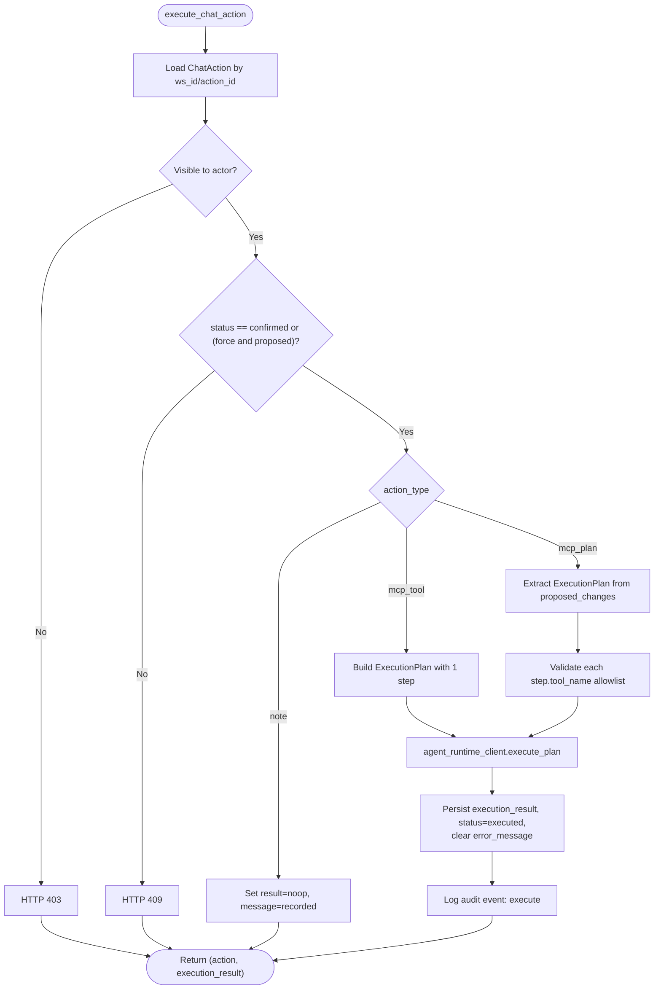
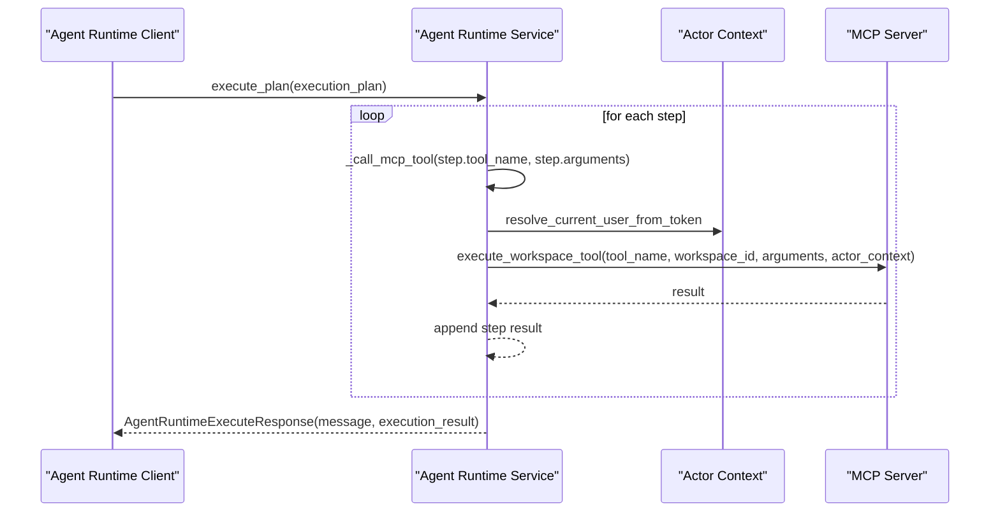
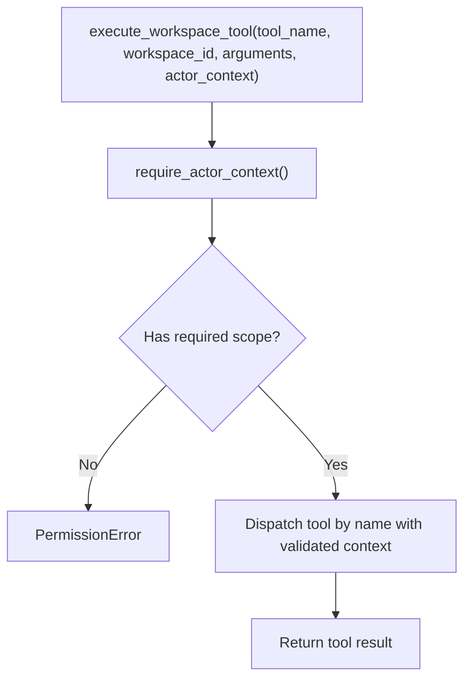
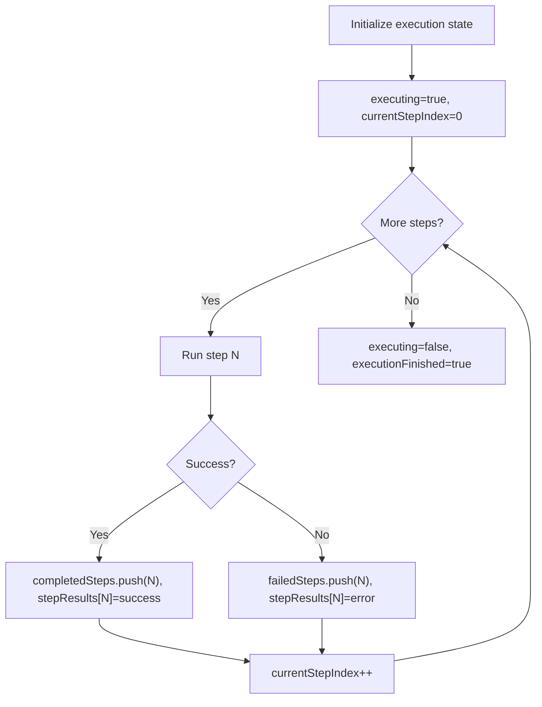
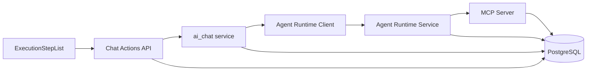

# Execution Stage

<cite>
**Referenced Files in This Document**
- [chat_actions.py](file://server/app/models/chat_actions.py)
- [chat_actions.py](file://server/app/schemas/chat_actions.py)
- [chat_actions.py](file://server/app/api/endpoints/chat_actions.py)
- [ai_chat.py](file://server/app/services/ai_chat.py)
- [service.py](file://server/app/agent_runtime/service.py)
- [agent_runtime.py](file://server/app/schemas/agent_runtime.py)
- [agent_runtime_client.py](file://server/app/services/agent_runtime_client.py)
- [context.py](file://server/app/mcp/context.py)
- [server.py](file://server/app/mcp/server.py)
- [ExecutionStepList.tsx](file://frontend/components/ai/ExecutionStepList.tsx)
- [AIChatPopup.tsx](file://frontend/components/ai/AIChatPopup.tsx)
</cite>

## Table of Contents
1. [Introduction](#introduction)
2. [Project Structure](#project-structure)
3. [Core Components](#core-components)
4. [Architecture Overview](#architecture-overview)
5. [Detailed Component Analysis](#detailed-component-analysis)
6. [Dependency Analysis](#dependency-analysis)
7. [Performance Considerations](#performance-considerations)
8. [Troubleshooting Guide](#troubleshooting-guide)
9. [Conclusion](#conclusion)

## Introduction
This document explains the execution stage of the three-stage chat actions flow: propose → confirm → execute. It focuses on the MCP tool invocation process, workspace-scoped execution, actor context validation, and result processing. It also covers step-by-step execution tracking with progress monitoring and status reporting, the execution step list interface, tool result formatting, payload extraction, response generation, practical execution workflows, error recovery, audit trail creation, and final response generation with system state updates.

## Project Structure
The execution stage spans backend services and frontend UI components:
- Backend orchestration and persistence: chat actions model, schemas, and endpoints
- Execution engine: agent runtime service and client
- MCP server and actor context: workspace-scoped tool execution and validation
- Frontend execution UI: real-time step list and progress

**Diagram sources**
- [chat_actions.py:261-299](file://server/app/api/endpoints/chat_actions.py#L261-L299)
- [ai_chat.py:1234-1359](file://server/app/services/ai_chat.py#L1234-L1359)
- [agent_runtime_client.py:48-64](file://server/app/services/agent_runtime_client.py#L48-L64)
- [service.py:533-560](file://server/app/agent_runtime/service.py#L533-L560)
- [server.py:1-800](file://server/app/mcp/server.py#L1-L800)

**Section sources**
- [chat_actions.py:93-106](file://server/app/api/endpoints/chat_actions.py#L93-L106)
- [ai_chat.py:1126-1137](file://server/app/services/ai_chat.py#L1126-L1137)

## Core Components
- ChatAction persistence and schema define the lifecycle of a proposed action, including status, tool metadata, and execution results.
- ExecutionPlan and ExecutionPlanStep represent the ordered steps to execute, including tool names, arguments, and risk/routing metadata.
- AgentRuntimeExecuteResponse carries the consolidated execution result and a human-readable message.
- MCP actor context enforces workspace-scoped execution and role-based permissions.
- Frontend ExecutionStepList renders real-time progress and completion status.

**Section sources**
- [chat_actions.py:11-62](file://server/app/models/chat_actions.py#L11-L62)
- [chat_actions.py:17-102](file://server/app/schemas/chat_actions.py#L17-L102)
- [agent_runtime.py:10-57](file://server/app/schemas/agent_runtime.py#L10-L57)
- [context.py:8-38](file://server/app/mcp/context.py#L8-L38)
- [ExecutionStepList.tsx:218-294](file://frontend/components/ai/ExecutionStepList.tsx#L218-L294)

## Architecture Overview
The execution stage follows a strict flow:
- Confirm → Execute validates the action’s status and type.
- For mcp_tool actions, a minimal ExecutionPlan is constructed and passed to the agent runtime.
- For mcp_plan actions, the stored ExecutionPlan is retrieved and validated against the actor’s role.
- Agent runtime executes each step by invoking MCP tools within the actor’s workspace scope.
- Results are aggregated into AgentRuntimeExecuteResponse and persisted as execution_result on the ChatAction.
- Audit trail events are logged for each execution outcome.

**Diagram sources**
- [chat_actions.py:261-299](file://server/app/api/endpoints/chat_actions.py#L261-L299)
- [ai_chat.py:1234-1359](file://server/app/services/ai_chat.py#L1234-L1359)
- [agent_runtime_client.py:48-64](file://server/app/services/agent_runtime_client.py#L48-L64)
- [service.py:533-560](file://server/app/agent_runtime/service.py#L533-L560)
- [server.py:1-800](file://server/app/mcp/server.py#L1-L800)

## Detailed Component Analysis

### Backend Execution Orchestration
- Endpoint: execute_action validates the action and delegates to ai_chat.execute_chat_action.
- ai_chat.execute_chat_action:
  - Enforces visibility and status rules.
  - For mcp_tool: builds a minimal ExecutionPlan with a single step and calls agent_runtime_client.execute_plan.
  - For mcp_plan: extracts the ExecutionPlan from proposed_changes and validates each step’s tool against the actor’s role allowlist.
  - On success: sets status=executed, clears error_message, persists execution_result, and logs an audit event.
  - On failure: marks status=failed, records error_message and execution_result, logs an audit event, and raises HTTP 500.

**Diagram sources**
- [chat_actions.py:261-299](file://server/app/api/endpoints/chat_actions.py#L261-L299)
- [ai_chat.py:1234-1359](file://server/app/services/ai_chat.py#L1234-L1359)

**Section sources**
- [chat_actions.py:261-299](file://server/app/api/endpoints/chat_actions.py#L261-L299)
- [ai_chat.py:1234-1359](file://server/app/services/ai_chat.py#L1234-L1359)

### Agent Runtime Execution Engine
- agent_runtime_client.execute_plan posts the ExecutionPlan to the internal agent endpoint and returns AgentRuntimeExecuteResponse.
- agent_runtime.service.execute_plan:
  - Iterates steps and calls _call_mcp_tool for each.
  - _call_mcp_tool resolves actor from the access token, constructs actor_context with user/workspace/role/scopes, and invokes execute_workspace_tool.
  - Aggregates step results into execution_result with playbook, steps, risk_level, model_target, and reasoning_target.

**Diagram sources**
- [agent_runtime_client.py:48-64](file://server/app/services/agent_runtime_client.py#L48-L64)
- [service.py:533-560](file://server/app/agent_runtime/service.py#L533-L560)
- [service.py:122-146](file://server/app/agent_runtime/service.py#L122-L146)
- [context.py:8-38](file://server/app/mcp/context.py#L8-L38)
- [server.py:1-800](file://server/app/mcp/server.py#L1-L800)

**Section sources**
- [agent_runtime_client.py:48-64](file://server/app/services/agent_runtime_client.py#L48-L64)
- [service.py:533-560](file://server/app/agent_runtime/service.py#L533-L560)
- [service.py:122-146](file://server/app/agent_runtime/service.py#L122-L146)
- [context.py:8-38](file://server/app/mcp/context.py#L8-L38)

### MCP Tool Invocation and Actor Context Validation
- execute_workspace_tool enforces:
  - Workspace scope: tool runs within the actor’s workspace_id.
  - Role-based allowlist: tools must be permitted for the actor’s role.
  - Scope checks: required scopes are present in actor.scopes.
- Actor context includes user_id, workspace_id, role, optional patient_id/caregiver_id, and scopes.

**Diagram sources**
- [server.py:113-129](file://server/app/mcp/server.py#L113-L129)
- [server.py:1-800](file://server/app/mcp/server.py#L1-L800)
- [context.py:8-38](file://server/app/mcp/context.py#L8-L38)

**Section sources**
- [server.py:113-129](file://server/app/mcp/server.py#L113-L129)
- [context.py:8-38](file://server/app/mcp/context.py#L8-L38)

### Execution Step List Interface and Progress Monitoring
- Frontend maintains execution state: executing flag, currentStepIndex, completedSteps, failedSteps, stepResults, executionFinished.
- ExecutionStepList renders:
  - Overall progress percentage and counts.
  - Per-step status: pending, executing, completed, failed.
  - Step result previews and timestamps.
  - Collapsed argument preview during execution.

**Diagram sources**
- [AIChatPopup.tsx:122-129](file://frontend/components/ai/AIChatPopup.tsx#L122-L129)
- [ExecutionStepList.tsx:218-294](file://frontend/components/ai/ExecutionStepList.tsx#L218-L294)

**Section sources**
- [AIChatPopup.tsx:622-647](file://frontend/components/ai/AIChatPopup.tsx#L622-L647)
- [ExecutionStepList.tsx:218-294](file://frontend/components/ai/ExecutionStepList.tsx#L218-L294)

### Tool Result Formatting, Payload Extraction, and Response Generation
- ai_chat.execute_chat_action persists execution_result as-is for mcp_tool and mcp_plan actions.
- AgentRuntimeExecuteResponse.message is used to construct the assistant reply in the API layer.
- _build_execution_message chooses a message based on action.type and execution_result.message; otherwise defaults to a success message.

**Section sources**
- [ai_chat.py:1234-1359](file://server/app/services/ai_chat.py#L1234-L1359)
- [chat_actions.py:84-91](file://server/app/api/endpoints/chat_actions.py#L84-L91)

### Practical Execution Workflows
- Single tool execution (mcp_tool):
  - Propose creates a ChatAction with action_type=mcp_tool and tool_name/tool_arguments.
  - Confirm sets status=confirmed.
  - Execute builds a minimal ExecutionPlan and calls agent runtime; results are persisted.
- Multi-step plan execution (mcp_plan):
  - Propose creates a ChatAction with action_type=mcp_plan and proposed_changes.execution_plan.
  - Confirm sets status=confirmed.
  - Execute validates each step’s tool allowlist and executes the plan; results are persisted.

**Section sources**
- [ai_chat.py:1254-1339](file://server/app/services/ai_chat.py#L1254-L1339)
- [chat_actions.py:261-299](file://server/app/api/endpoints/chat_actions.py#L261-L299)

### Error Recovery Mechanisms and Audit Trail
- On execution failure:
  - ai_chat.execute_chat_action sets status=failed, error_message, execution_result={"error": ...}, logs audit event "execute_failed".
  - Raises HTTP 500 with a standardized message.
- Audit trail events:
  - "propose" for chat action proposals.
  - "confirm"/"reject" for confirmations.
  - "execute" for successful executions.
  - "execute_failed" for failures.

**Section sources**
- [ai_chat.py:1284-1304](file://server/app/services/ai_chat.py#L1284-L1304)
- [ai_chat.py:1291-1300](file://server/app/services/ai_chat.py#L1291-L1300)
- [ai_chat.py:1317-1337](file://server/app/services/ai_chat.py#L1317-L1337)
- [ai_chat.py:1324-1333](file://server/app/services/ai_chat.py#L1324-L1333)
- [ai_chat.py:1347-1356](file://server/app/services/ai_chat.py#L1347-L1356)

### Final Response Generation and System State Updates
- The API endpoint returns ChatActionExecuteOut with action, execution_result, message, and reply.
- The assistant reply is built from execution_result.message if present; otherwise a default success message is used.
- The ChatAction is updated with executed_by_user_id, executed_at, cleared error_message, and persisted execution_result.

**Section sources**
- [chat_actions.py:261-299](file://server/app/api/endpoints/chat_actions.py#L261-L299)
- [ai_chat.py:1341-1359](file://server/app/services/ai_chat.py#L1341-L1359)

## Dependency Analysis
- Chat Actions API depends on ai_chat service for validation, execution, and persistence.
- ai_chat service depends on agent_runtime_client for plan execution and on audit_trail_service for logging.
- agent_runtime_client depends on agent_runtime_url and internal secret header.
- agent_runtime.service depends on MCP server for tool execution and on actor context for workspace-scoped enforcement.
- Frontend depends on ExecutionStepList and AIChatPopup to render execution progress and results.

**Diagram sources**
- [chat_actions.py:261-299](file://server/app/api/endpoints/chat_actions.py#L261-L299)
- [ai_chat.py:1234-1359](file://server/app/services/ai_chat.py#L1234-L1359)
- [agent_runtime_client.py:48-64](file://server/app/services/agent_runtime_client.py#L48-L64)
- [service.py:533-560](file://server/app/agent_runtime/service.py#L533-L560)
- [server.py:1-800](file://server/app/mcp/server.py#L1-L800)
- [ExecutionStepList.tsx:218-294](file://frontend/components/ai/ExecutionStepList.tsx#L218-L294)

**Section sources**
- [chat_actions.py:261-299](file://server/app/api/endpoints/chat_actions.py#L261-L299)
- [ai_chat.py:1234-1359](file://server/app/services/ai_chat.py#L1234-L1359)
- [agent_runtime_client.py:48-64](file://server/app/services/agent_runtime_client.py#L48-L64)
- [service.py:533-560](file://server/app/agent_runtime/service.py#L533-L560)
- [server.py:1-800](file://server/app/mcp/server.py#L1-L800)
- [ExecutionStepList.tsx:218-294](file://frontend/components/ai/ExecutionStepList.tsx#L218-L294)

## Performance Considerations
- Plan execution loops sequentially; long-running tools will proportionally increase total execution time.
- Frontend rendering of ExecutionStepList is lightweight; keep stepResults minimal to avoid large re-renders.
- Agent runtime client timeouts are set to balance responsiveness and long-running operations.
- Consider batching read-only tools into a single plan to reduce round-trips when feasible.

## Troubleshooting Guide
Common issues and resolutions:
- HTTP 403 “Tool is not allowed for this role”:
  - Verify the actor’s role allowlist and ensure the tool is permitted.
- HTTP 409 “Chat action must be confirmed first”:
  - Confirm the action before executing, or use force=true only when status=proposed.
- HTTP 422 “execution_plan is required”:
  - Ensure proposed_changes contains a valid execution_plan for mcp_plan actions.
- HTTP 500 “Chat action execution failed”:
  - Inspect error_message and execution_result.error from the persisted ChatAction.
  - Review audit trail for “execute_failed” event details.
- Missing credentials for agent runtime:
  - Ensure actor_access_token is present in request headers or derived from auth dependency.

**Section sources**
- [ai_chat.py:1247-1249](file://server/app/services/ai_chat.py#L1247-L1249)
- [ai_chat.py:1307-1308](file://server/app/services/ai_chat.py#L1307-L1308)
- [ai_chat.py:1284-1304](file://server/app/services/ai_chat.py#L1284-L1304)
- [ai_chat.py:1317-1337](file://server/app/services/ai_chat.py#L1317-L1337)

## Conclusion
The execution stage ensures secure, workspace-scoped MCP tool invocation with robust validation, clear progress tracking, and comprehensive audit logging. The backend orchestrates plan execution and result persistence, while the frontend provides real-time feedback on step-by-step progress. Error handling and audit trails enable reliable recovery and traceability for all execution outcomes.