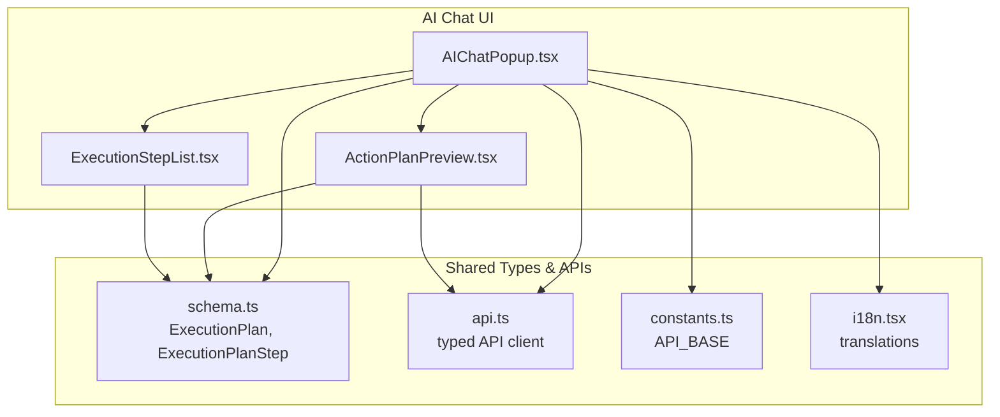
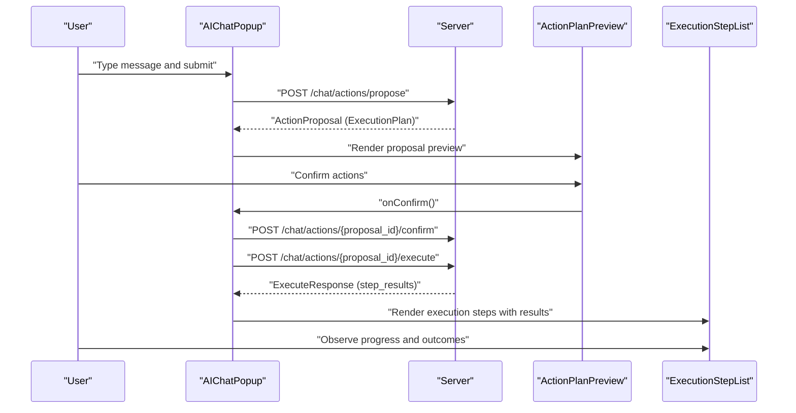
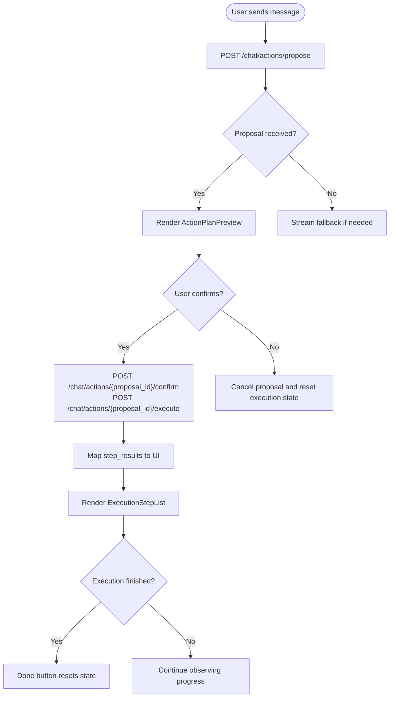
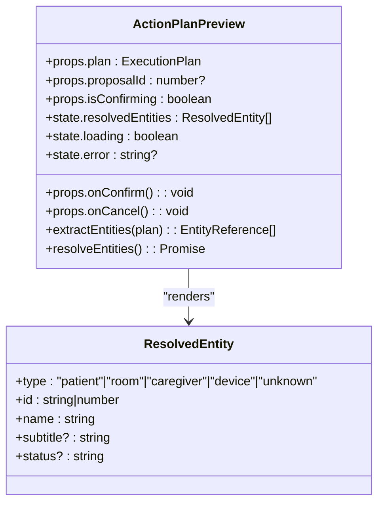
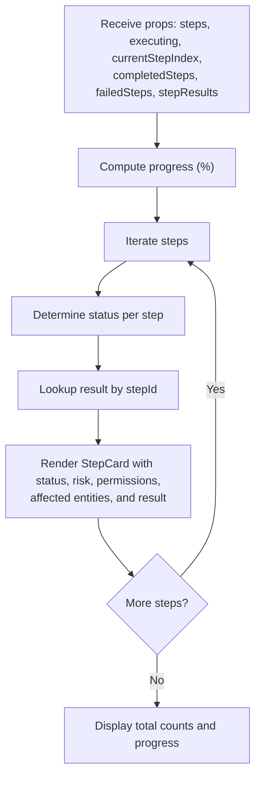
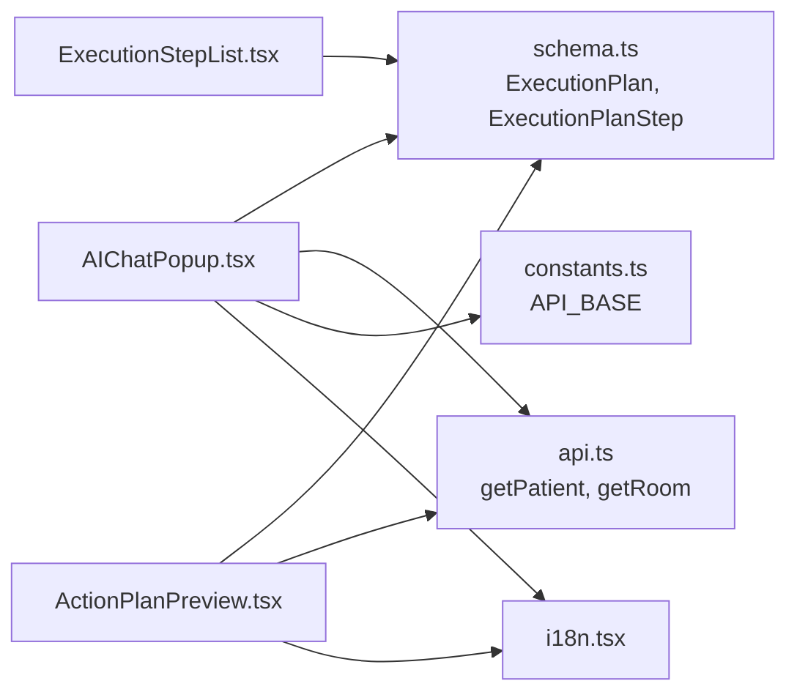

# UI Components & Interfaces

<cite>
**Referenced Files in This Document**
- [AIChatPopup.tsx](file://frontend/components/ai/AIChatPopup.tsx)
- [ActionPlanPreview.tsx](file://frontend/components/ai/ActionPlanPreview.tsx)
- [ExecutionStepList.tsx](file://frontend/components/ai/ExecutionStepList.tsx)
- [schema.ts](file://frontend/lib/api/generated/schema.ts)
- [api.ts](file://frontend/lib/api.ts)
- [constants.ts](file://frontend/lib/constants.ts)
- [i18n.tsx](file://frontend/lib/i18n.tsx)
</cite>

## Table of Contents
1. [Introduction](#introduction)
2. [Project Structure](#project-structure)
3. [Core Components](#core-components)
4. [Architecture Overview](#architecture-overview)
5. [Detailed Component Analysis](#detailed-component-analysis)
6. [Dependency Analysis](#dependency-analysis)
7. [Performance Considerations](#performance-considerations)
8. [Troubleshooting Guide](#troubleshooting-guide)
9. [Conclusion](#conclusion)
10. [Appendices](#appendices)

## Introduction
This document describes the AI chat action UI components in WheelSense that enable natural language interaction with the system, propose actionable plans, and visualize execution progress. It covers:
- ActionPlanPreview: Presents proposed actions, risks, affected entities, and permissions, with interactive approval and rejection controls.
- ExecutionStepList: Displays real-time execution progress, completion status, and error states for each step.
- AIChatPopup: The primary chat interface integrating conversation history, quick prompts, markdown rendering, and orchestration of action proposals and execution.

The guide explains component props, state management, user interaction patterns, styling guidelines, responsive design considerations, and accessibility features.

## Project Structure
The AI chat action UI lives under the frontend components directory and integrates with the generated OpenAPI schema, API client, and internationalization utilities.

**Diagram sources**
- [AIChatPopup.tsx:101-676](file://frontend/components/ai/AIChatPopup.tsx#L101-L676)
- [ActionPlanPreview.tsx:117-360](file://frontend/components/ai/ActionPlanPreview.tsx#L117-L360)
- [ExecutionStepList.tsx:218-294](file://frontend/components/ai/ExecutionStepList.tsx#L218-L294)
- [schema.ts:4646-4705](file://frontend/lib/api/generated/schema.ts#L4646-L4705)
- [api.ts:342-1092](file://frontend/lib/api.ts#L342-L1092)
- [constants.ts:1-27](file://frontend/lib/constants.ts#L1-L27)
- [i18n.tsx:1-800](file://frontend/lib/i18n.tsx#L1-L800)

**Section sources**
- [AIChatPopup.tsx:101-676](file://frontend/components/ai/AIChatPopup.tsx#L101-L676)
- [ActionPlanPreview.tsx:117-360](file://frontend/components/ai/ActionPlanPreview.tsx#L117-L360)
- [ExecutionStepList.tsx:218-294](file://frontend/components/ai/ExecutionStepList.tsx#L218-L294)
- [schema.ts:4646-4705](file://frontend/lib/api/generated/schema.ts#L4646-L4705)
- [api.ts:342-1092](file://frontend/lib/api.ts#L342-L1092)
- [constants.ts:1-27](file://frontend/lib/constants.ts#L1-L27)
- [i18n.tsx:1-800](file://frontend/lib/i18n.tsx#L1-L800)

## Core Components
- AIChatPopup: Orchestrates chat input, message history, markdown rendering, quick prompts, conversation history, and action proposal/execution lifecycle. It conditionally renders ActionPlanPreview and ExecutionStepList based on proposal availability and execution state.
- ActionPlanPreview: Summarizes the execution plan, displays risk level, affected entities, permissions, and step count; provides Confirm/Reject buttons with loading and error states.
- ExecutionStepList: Renders a step-by-step execution view with status badges, risk indicators, permission badges, affected entities, and per-step results; includes progress bar and summary counts.

Key props and state are detailed in the next sections.

**Section sources**
- [AIChatPopup.tsx:101-676](file://frontend/components/ai/AIChatPopup.tsx#L101-L676)
- [ActionPlanPreview.tsx:117-360](file://frontend/components/ai/ActionPlanPreview.tsx#L117-L360)
- [ExecutionStepList.tsx:218-294](file://frontend/components/ai/ExecutionStepList.tsx#L218-L294)

## Architecture Overview
The AI chat UI composes three primary pieces:
- UI composition and orchestration in AIChatPopup
- Proposal preview and entity resolution in ActionPlanPreview
- Execution visualization in ExecutionStepList

**Diagram sources**
- [AIChatPopup.tsx:306-431](file://frontend/components/ai/AIChatPopup.tsx#L306-L431)
- [ActionPlanPreview.tsx:329-357](file://frontend/components/ai/ActionPlanPreview.tsx#L329-L357)
- [ExecutionStepList.tsx:218-294](file://frontend/components/ai/ExecutionStepList.tsx#L218-L294)

## Detailed Component Analysis

### AIChatPopup
- Purpose: Primary chat interface enabling natural language queries, conversation history, markdown rendering, quick prompts, and action proposal/execution flow.
- Key responsibilities:
  - Manage messages, loading, error, and conversation history.
  - Propose actions via server endpoint and render ActionPlanPreview when applicable.
  - Execute confirmed actions and render ExecutionStepList with real-time progress and results.
  - Provide quick prompts tailored to user role.
- Props: None (self-contained UI state).
- State:
  - Messages, input, loading, error, conversationId, conversations, historyNotice, showHistory.
  - Proposal and execution tracking: proposal, confirmingActions, executing, currentStepIndex, completedSteps, failedSteps, stepResults, executionFinished.
- Interaction patterns:
  - Enter key submits messages; quick prompts populate input.
  - ActionPlanPreview triggers confirmAndExecuteActions which posts confirm and execute endpoints and maps step results.
  - ExecutionStepList updates progress and results; Done button resets execution state.
- Accessibility:
  - Buttons include aria-labels and aria-hidden where appropriate.
  - Focus management via scrollIntoView and controlled input.
- Responsive design:
  - Fixed position floating panel with constrained width and height.
  - Scrollable message area; collapsible history sidebar.

**Diagram sources**
- [AIChatPopup.tsx:280-431](file://frontend/components/ai/AIChatPopup.tsx#L280-L431)

**Section sources**
- [AIChatPopup.tsx:101-676](file://frontend/components/ai/AIChatPopup.tsx#L101-L676)
- [schema.ts:4646-4705](file://frontend/lib/api/generated/schema.ts#L4646-L4705)
- [api.ts:342-1092](file://frontend/lib/api.ts#L342-L1092)
- [constants.ts:1-27](file://frontend/lib/constants.ts#L1-L27)
- [i18n.tsx:1-800](file://frontend/lib/i18n.tsx#L1-L800)

### ActionPlanPreview
- Purpose: Summarize and present an execution plan with risk, affected entities, permissions, and step count; allow user confirmation or rejection.
- Props:
  - plan: ExecutionPlan
  - proposalId?: number | null
  - onConfirm: () => void
  - onCancel: () => void
  - isConfirming?: boolean
- State:
  - resolvedEntities: ResolvedEntity[]
  - loading: boolean
  - error: string | null
- Behavior:
  - Extract entities from plan.affected_entities and plan.steps.affected_entities and step.arguments.
  - Resolve entities via api (patient, room, caregiver) and display friendly names and subtitles.
  - Compute stepCount and estimatedTime.
  - Map riskLevel to badge variant and icon.
  - Disable Confirm while resolving entities or confirming.
- Accessibility:
  - Buttons include icons and labels; loading spinner indicates async resolution.
- Styling:
  - Uses Card, Badge, Button, Alert components; amber-themed border/background for emphasis.

**Diagram sources**
- [ActionPlanPreview.tsx:26-360](file://frontend/components/ai/ActionPlanPreview.tsx#L26-L360)
- [schema.ts:4646-4705](file://frontend/lib/api/generated/schema.ts#L4646-L4705)
- [api.ts:384-531](file://frontend/lib/api.ts#L384-L531)

**Section sources**
- [ActionPlanPreview.tsx:117-360](file://frontend/components/ai/ActionPlanPreview.tsx#L117-L360)
- [schema.ts:4646-4705](file://frontend/lib/api/generated/schema.ts#L4646-L4705)
- [api.ts:384-531](file://frontend/lib/api.ts#L384-L531)

### ExecutionStepList
- Purpose: Visualize execution steps with status, risk, permissions, affected entities, and per-step results; show overall progress.
- Props:
  - steps: ExecutionPlanStep[]
  - executing?: boolean
  - currentStepIndex?: number
  - completedSteps?: number[]
  - stepResults?: StepResult[]
  - failedSteps?: number[]
- State:
  - None (pure functional component).
- Behavior:
  - Compute progress percentage from completedSteps.
  - Determine step status: pending, executing, completed, failed.
  - Render step cards with status icons, risk badges, permission badges, affected entities, and optional result blocks.
  - Show argument preview only when executing.
- Accessibility:
  - Clear status indicators and color-coded borders for each step.
  - Progress bar and summary counts aid comprehension.
- Styling:
  - Uses Card, Badge, Progress; distinct styles per status.

**Diagram sources**
- [ExecutionStepList.tsx:218-294](file://frontend/components/ai/ExecutionStepList.tsx#L218-L294)

**Section sources**
- [ExecutionStepList.tsx:218-294](file://frontend/components/ai/ExecutionStepList.tsx#L218-L294)
- [schema.ts:4676-4705](file://frontend/lib/api/generated/schema.ts#L4676-L4705)

## Dependency Analysis
- AIChatPopup depends on:
  - ExecutionPlan and ExecutionPlanStep types from schema.ts.
  - Typed API client from api.ts for patient/room resolution and chat endpoints.
  - API_BASE constant for server endpoints.
  - i18n for localized strings.
- ActionPlanPreview depends on:
  - ExecutionPlan and entity resolution via api.ts.
  - i18n for labels and messages.
- ExecutionStepList depends on:
  - ExecutionPlanStep and StepResult types from schema.ts.

**Diagram sources**
- [AIChatPopup.tsx:1-676](file://frontend/components/ai/AIChatPopup.tsx#L1-L676)
- [ActionPlanPreview.tsx:1-360](file://frontend/components/ai/ActionPlanPreview.tsx#L1-L360)
- [ExecutionStepList.tsx:1-294](file://frontend/components/ai/ExecutionStepList.tsx#L1-L294)
- [schema.ts:4646-4705](file://frontend/lib/api/generated/schema.ts#L4646-L4705)
- [api.ts:342-1092](file://frontend/lib/api.ts#L342-L1092)
- [constants.ts:1-27](file://frontend/lib/constants.ts#L1-L27)
- [i18n.tsx:1-800](file://frontend/lib/i18n.tsx#L1-L800)

**Section sources**
- [AIChatPopup.tsx:1-676](file://frontend/components/ai/AIChatPopup.tsx#L1-L676)
- [ActionPlanPreview.tsx:1-360](file://frontend/components/ai/ActionPlanPreview.tsx#L1-L360)
- [ExecutionStepList.tsx:1-294](file://frontend/components/ai/ExecutionStepList.tsx#L1-L294)
- [schema.ts:4646-4705](file://frontend/lib/api/generated/schema.ts#L4646-L4705)
- [api.ts:342-1092](file://frontend/lib/api.ts#L342-L1092)
- [constants.ts:1-27](file://frontend/lib/constants.ts#L1-L27)
- [i18n.tsx:1-800](file://frontend/lib/i18n.tsx#L1-L800)

## Performance Considerations
- Debounce or throttle chat submissions to avoid excessive network calls.
- Lazy-load entity resolution; batch requests where possible to reduce API overhead.
- Virtualize long message lists and step lists for large datasets.
- Cache resolved entities per session to minimize repeated lookups.
- Use progressive disclosure for argument previews to avoid heavy DOM rendering during execution.

## Troubleshooting Guide
- Proposal not rendered:
  - Verify server response includes execution_plan or actions.payload.execution_plan.
  - Check coerceExecutionPlan logic for shape mismatches.
- Entity resolution failures:
  - ActionPlanPreview displays an error alert and unresolved placeholders; ensure api.getPatient and api.getRoom are reachable.
- Execution step results mismatch:
  - ExecutionStepList relies on stepId alignment; ensure server returns step_results with matching stepId values.
- Execution errors:
  - AIChatPopup marks remaining steps as failed and surfaces error messages; confirmAndExecuteActions handles exceptions and updates state accordingly.
- Accessibility issues:
  - Ensure focus moves to new messages; verify aria-labels and roles for interactive elements.

**Section sources**
- [AIChatPopup.tsx:345-431](file://frontend/components/ai/AIChatPopup.tsx#L345-L431)
- [ActionPlanPreview.tsx:128-201](file://frontend/components/ai/ActionPlanPreview.tsx#L128-L201)
- [ExecutionStepList.tsx:218-294](file://frontend/components/ai/ExecutionStepList.tsx#L218-L294)

## Conclusion
The AI chat action UI components provide a cohesive, accessible, and responsive interface for proposing and executing actions. AIChatPopup orchestrates the end-to-end flow, ActionPlanPreview communicates risks and permissions, and ExecutionStepList delivers transparency during execution. Together they support efficient clinical workflows with strong internationalization and accessibility foundations.

## Appendices

### Component Props Reference
- AIChatPopup
  - Props: None
  - Internal state: messages, input, loading, error, conversationId, conversations, historyNotice, showHistory, proposal, confirmingActions, executing, currentStepIndex, completedSteps, failedSteps, stepResults, executionFinished
- ActionPlanPreview
  - Props: plan, proposalId?, onConfirm, onCancel, isConfirming?
  - State: resolvedEntities, loading, error
- ExecutionStepList
  - Props: steps, executing?, currentStepIndex?, completedSteps?, stepResults?, failedSteps?

**Section sources**
- [AIChatPopup.tsx:101-676](file://frontend/components/ai/AIChatPopup.tsx#L101-L676)
- [ActionPlanPreview.tsx:117-360](file://frontend/components/ai/ActionPlanPreview.tsx#L117-L360)
- [ExecutionStepList.tsx:218-294](file://frontend/components/ai/ExecutionStepList.tsx#L218-L294)

### Styling Guidelines
- Use Card, Badge, Button, Alert, Progress components consistently.
- Apply color-coded borders and backgrounds for step statuses.
- Maintain consistent spacing and typography scales.
- Respect dark mode variants for badges and backgrounds.

### Responsive Design Considerations
- Floating panel constrained by viewport; adjust width for small screens.
- Scrollable areas for messages and step lists.
- Collapsible history sidebar for narrow widths.

### Accessibility Features
- ARIA labels on interactive elements.
- Keyboard navigation support (Enter to submit).
- Screen reader-friendly status indicators and progress summaries.