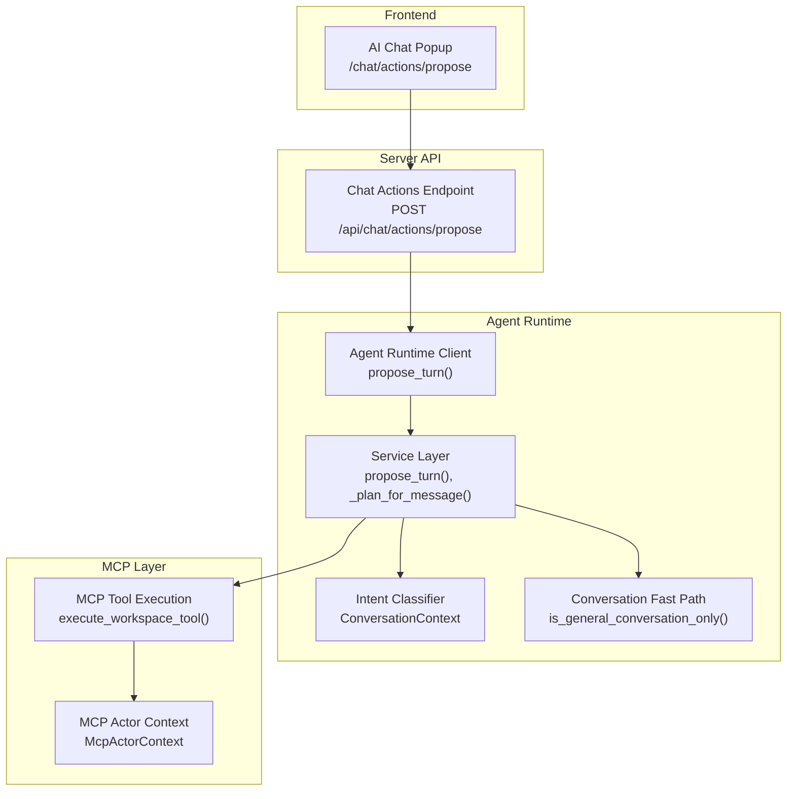
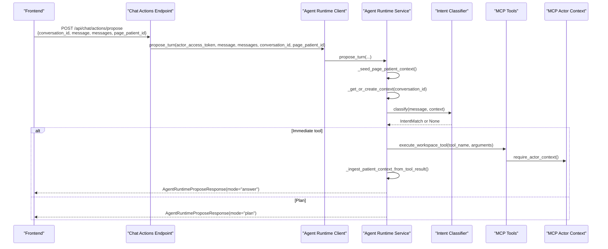
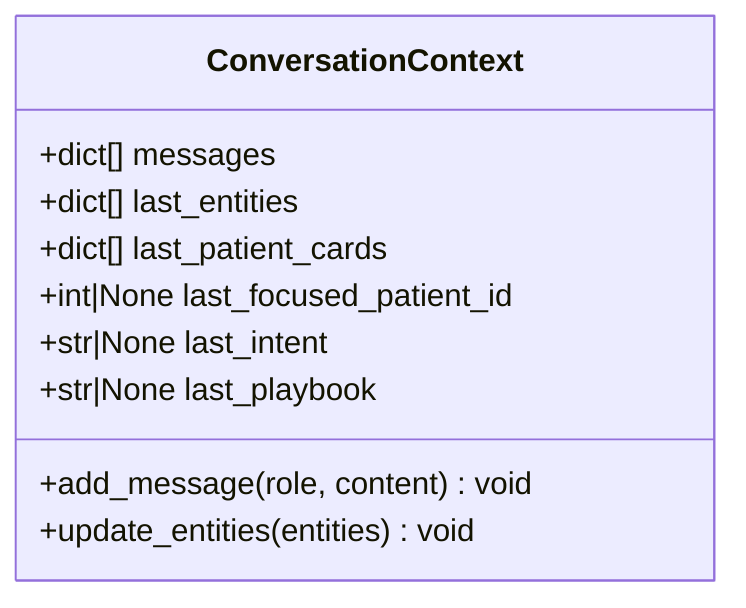
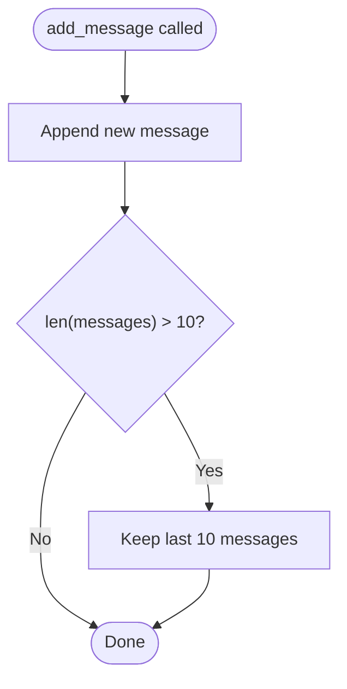
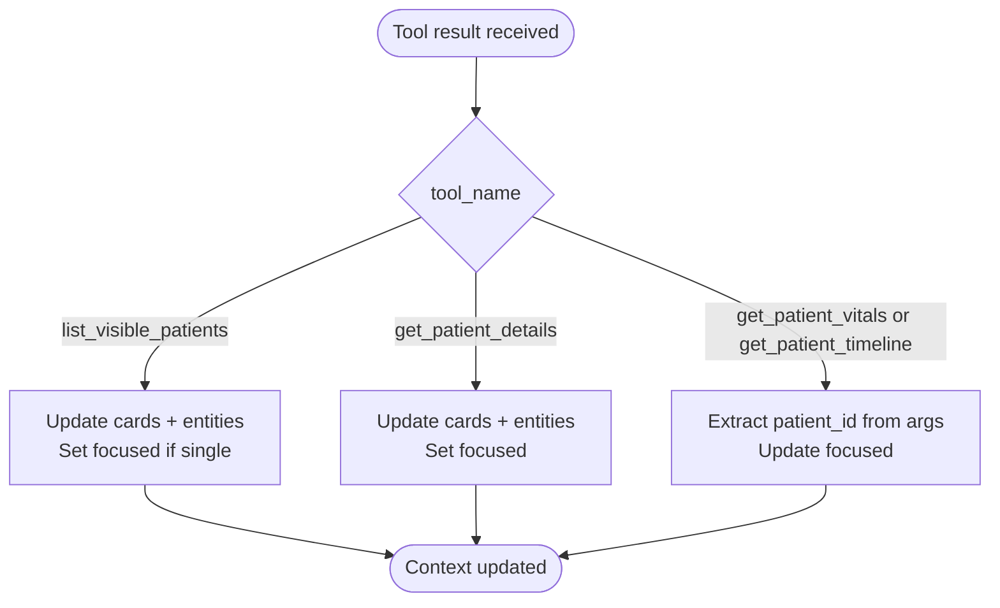
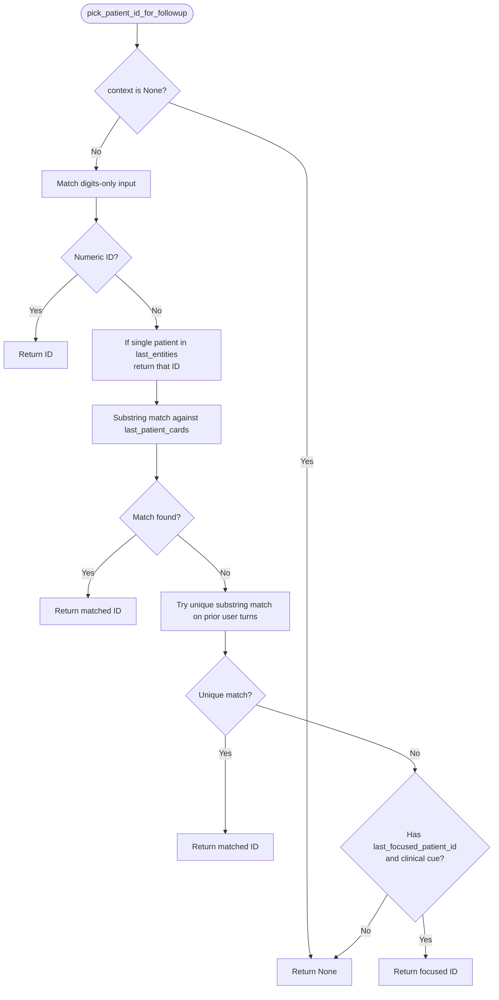
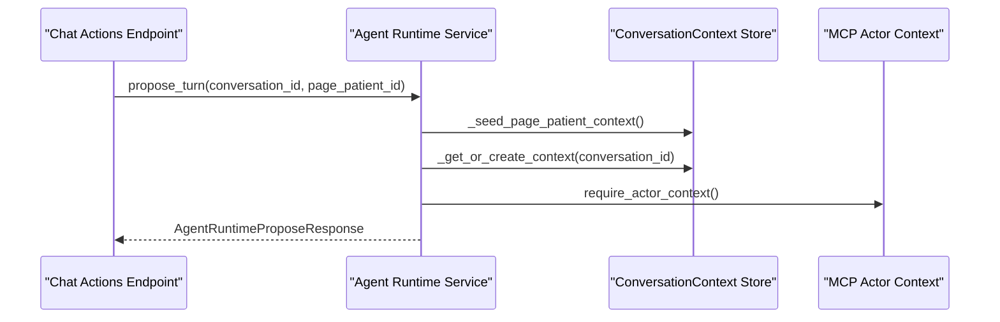
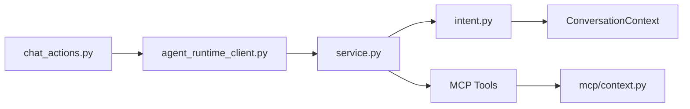

# Conversation Context & Multi-Turn Awareness

<cite>
**Referenced Files in This Document**
- [intent.py](file://server/app/agent_runtime/intent.py)
- [service.py](file://server/app/agent_runtime/service.py)
- [conversation_fastpath.py](file://server/app/agent_runtime/conversation_fastpath.py)
- [chat_actions.py](file://server/app/api/endpoints/chat_actions.py)
- [agent_runtime_client.py](file://server/app/services/agent_runtime_client.py)
- [test_agent_runtime.py](file://server/tests/test_agent_runtime.py)
- [context.py](file://server/app/mcp/context.py)
</cite>

## Table of Contents
1. [Introduction](#introduction)
2. [Project Structure](#project-structure)
3. [Core Components](#core-components)
4. [Architecture Overview](#architecture-overview)
5. [Detailed Component Analysis](#detailed-component-analysis)
6. [Dependency Analysis](#dependency-analysis)
7. [Performance Considerations](#performance-considerations)
8. [Troubleshooting Guide](#troubleshooting-guide)
9. [Conclusion](#conclusion)

## Introduction
This document explains the conversation context tracking system that enables multi-turn awareness in the WheelSense AI runtime. It covers the ConversationContext class for managing message history, entity extraction persistence, and patient focus management. It documents context window management, patient ID resolution for short follow-up questions, automatic patient context detection for vitals/timeline/profile requests, and integration with conversation history and workspace-scoped context management.

## Project Structure
The conversation context system spans several modules:
- Intent classification and context-awareness logic
- Agent runtime service orchestrating classification, tool execution, and context updates
- Fast-path heuristics for general conversation
- API endpoints exposing chat actions with conversation context
- Agent runtime client for internal service calls
- MCP actor context for workspace-scoped execution

**Diagram sources**
- [chat_actions.py:124-239](file://server/app/api/endpoints/chat_actions.py#L124-L239)
- [agent_runtime_client.py:23-45](file://server/app/services/agent_runtime_client.py#L23-L45)
- [service.py:346-519](file://server/app/agent_runtime/service.py#L346-L519)
- [intent.py:76-107](file://server/app/agent_runtime/intent.py#L76-L107)
- [conversation_fastpath.py:32-44](file://server/app/agent_runtime/conversation_fastpath.py#L32-L44)
- [context.py:8-37](file://server/app/mcp/context.py#L8-L37)

**Section sources**
- [chat_actions.py:124-239](file://server/app/api/endpoints/chat_actions.py#L124-L239)
- [agent_runtime_client.py:23-45](file://server/app/services/agent_runtime_client.py#L23-L45)
- [service.py:346-519](file://server/app/agent_runtime/service.py#L346-L519)
- [intent.py:76-107](file://server/app/agent_runtime/intent.py#L76-L107)
- [conversation_fastpath.py:32-44](file://server/app/agent_runtime/conversation_fastpath.py#L32-L44)
- [context.py:8-37](file://server/app/mcp/context.py#L8-L37)

## Core Components
- ConversationContext: Tracks conversation state with a bounded message history, last entities, recent patient cards, focused patient ID, and last intent/playbook.
- IntentClassifier: Provides regex-based and semantic intent classification with context-awareness for patient-scoped reads.
- Agent Runtime Service: Orchestrates classification, immediate tool execution, plan building, and context updates.
- Conversation Fast Path: Heuristic to skip MCP/intent for general conversation.
- MCP Actor Context: Provides workspace-scoped execution context for tools.

**Section sources**
- [intent.py:76-107](file://server/app/agent_runtime/intent.py#L76-L107)
- [intent.py:347-800](file://server/app/agent_runtime/intent.py#L347-L800)
- [service.py:202-320](file://server/app/agent_runtime/service.py#L202-L320)
- [conversation_fastpath.py:32-44](file://server/app/agent_runtime/conversation_fastpath.py#L32-L44)
- [context.py:8-37](file://server/app/mcp/context.py#L8-L37)

## Architecture Overview
The system integrates conversation context across the runtime pipeline:
- Frontend sends a chat proposal with conversation_id and messages.
- API validates and forwards to agent runtime client.
- Agent runtime service loads or creates ConversationContext keyed by conversation_id.
- Intent classifier evaluates message with context-aware patterns and thresholds.
- For high-confidence, read-only tools may auto-run; otherwise, a plan is built.
- Tool execution updates context (patient cards, entities, focused patient).
- Final response is returned to the frontend.

**Diagram sources**
- [chat_actions.py:174-181](file://server/app/api/endpoints/chat_actions.py#L174-L181)
- [agent_runtime_client.py:23-45](file://server/app/services/agent_runtime_client.py#L23-L45)
- [service.py:346-519](file://server/app/agent_runtime/service.py#L346-L519)
- [intent.py:719-800](file://server/app/agent_runtime/intent.py#L719-L800)
- [context.py:33-37](file://server/app/mcp/context.py#L33-L37)

## Detailed Component Analysis

### ConversationContext Class
The ConversationContext class encapsulates multi-turn awareness:
- Message history: bounded to last 10 entries to keep context window manageable.
- Entities: tracks the latest extracted entities (e.g., patients) for cross-turn resolution.
- Patient cards: stores recent patient rows from roster/list/detail for name-based follow-ups.
- Focused patient: the last narrowed patient ID used for context-aware reads.
- Last intent/playbook: for analytics and plan building.

**Diagram sources**
- [intent.py:76-107](file://server/app/agent_runtime/intent.py#L76-L107)

**Section sources**
- [intent.py:76-107](file://server/app/agent_runtime/intent.py#L76-L107)
- [test_agent_runtime.py:45-62](file://server/tests/test_agent_runtime.py#L45-L62)

### Context Window Management
- The add_message method enforces a maximum of 10 messages.
- When exceeded, the oldest messages are pruned from the front while preserving the latest.

**Diagram sources**
- [intent.py:89-94](file://server/app/agent_runtime/intent.py#L89-L94)

**Section sources**
- [intent.py:89-94](file://server/app/agent_runtime/intent.py#L89-L94)
- [test_agent_runtime.py:45-53](file://server/tests/test_agent_runtime.py#L45-L53)

### Patient Focus Management
- Roster ingestion: list_visible_patients updates last_patient_cards, last_entities, and sets last_focused_patient_id when a single patient is present.
- Details ingestion: get_patient_details updates last_patient_cards, last_entities, and last_focused_patient_id.
- Context-aware reads: vitals/timeline/profile reads update last_focused_patient_id when arguments include patient_id.

**Diagram sources**
- [service.py:69-120](file://server/app/agent_runtime/service.py#L69-L120)

**Section sources**
- [service.py:69-120](file://server/app/agent_runtime/service.py#L69-L120)

### Patient ID Resolution for Follow-Up Questions
The pick_patient_id_for_followup function resolves patient_id for short follow-ups using:
- Numeric patient ID (direct match).
- Single patient in last_entities.
- Name substring matching against last_patient_cards.
- Unique substring matching across unsegmented Thai text using prior user turns.
- Automatic fallback to last_focused_patient_id for vitals/timeline/profile cues.

**Diagram sources**
- [intent.py:271-320](file://server/app/agent_runtime/intent.py#L271-L320)

**Section sources**
- [intent.py:271-320](file://server/app/agent_runtime/intent.py#L271-L320)

### Automatic Patient Context Detection
Certain Thai phrases trigger automatic patient-scoped reads without explicit naming:
- Vitals/timeline follow-ups: "สัญญาณชีพ", "ประวัติสุขภาพ", "ไทม์ไลน์" map to get_patient_vitals/get_patient_timeline.
- Profile follow-ups: "โรคเรื้อรัง", "แพ้ยา", "ภาวะสุขภาพ" map to get_patient_details.
- The classifier injects entity hints and may auto-run when confidence is high and no confirmation is required.

**Section sources**
- [intent.py:363-383](file://server/app/agent_runtime/intent.py#L363-L383)
- [intent.py:755-776](file://server/app/agent_runtime/intent.py#L755-L776)

### Integration with Conversation History and Workspace-Scoped Context
- Conversation history: messages are appended and pruned to the last 10 entries.
- Workspace-scoped context: MCP actor context includes workspace_id and roles for permission checks.
- Page-scoped priming: When EaseAI opens from a patient page, the system seeds context with that patient’s card and focus.

**Diagram sources**
- [service.py:161-200](file://server/app/agent_runtime/service.py#L161-L200)
- [service.py:152-158](file://server/app/agent_runtime/service.py#L152-L158)
- [context.py:33-37](file://server/app/mcp/context.py#L33-L37)

**Section sources**
- [service.py:161-200](file://server/app/agent_runtime/service.py#L161-L200)
- [service.py:152-158](file://server/app/agent_runtime/service.py#L152-L158)
- [context.py:33-37](file://server/app/mcp/context.py#L33-L37)

### Practical Examples

#### Example 1: Context-Aware Intent Resolution
- User: "สัญญาณชีพล่าสุด"
- Classifier detects vitals intent and injects entity hints.
- If last_focused_patient_id is set, immediate tool get_patient_vitals is executed with patient_id.

**Section sources**
- [intent.py:363-370](file://server/app/agent_runtime/intent.py#L363-L370)
- [intent.py:755-776](file://server/app/agent_runtime/intent.py#L755-L776)

#### Example 2: Patient Focus Management
- User: "แสดงรายชื่อผู้ป่วย"
- Classifier triggers list_visible_patients.
- Service updates last_patient_cards, last_entities, and last_focused_patient_id when a single patient is shown.

**Section sources**
- [service.py:81-98](file://server/app/agent_runtime/service.py#L81-L98)

#### Example 3: Multi-Turn Conversation Handling
- Turn 1: "ผู้ป่วยมีใครบ้าง" → list_visible_patients → context updated with cards/entities.
- Turn 2: "ขอของคุณวิชัย" → pick_patient_id_for_followup resolves via name substring match.
- Turn 3: "ประวัติสุขภาพล่าสุด" → uses last_focused_patient_id for vitals.

**Section sources**
- [test_agent_runtime.py:100-142](file://server/tests/test_agent_runtime.py#L100-L142)
- [intent.py:271-320](file://server/app/agent_runtime/intent.py#L271-L320)

## Dependency Analysis
The system exhibits clear separation of concerns:
- API layer depends on agent runtime client.
- Agent runtime service depends on intent classifier and MCP execution.
- Intent classifier depends on ConversationContext and regex/semantic patterns.
- MCP actor context provides workspace-scoped execution context.

**Diagram sources**
- [chat_actions.py:174-181](file://server/app/api/endpoints/chat_actions.py#L174-L181)
- [agent_runtime_client.py:23-45](file://server/app/services/agent_runtime_client.py#L23-L45)
- [service.py:346-519](file://server/app/agent_runtime/service.py#L346-L519)
- [intent.py:719-800](file://server/app/agent_runtime/intent.py#L719-L800)
- [context.py:33-37](file://server/app/mcp/context.py#L33-L37)

**Section sources**
- [chat_actions.py:174-181](file://server/app/api/endpoints/chat_actions.py#L174-L181)
- [agent_runtime_client.py:23-45](file://server/app/services/agent_runtime_client.py#L23-L45)
- [service.py:346-519](file://server/app/agent_runtime/service.py#L346-L519)
- [intent.py:719-800](file://server/app/agent_runtime/intent.py#L719-L800)
- [context.py:33-37](file://server/app/mcp/context.py#L33-L37)

## Performance Considerations
- Context window pruning ensures constant-time message management and bounded memory usage.
- Regex-based intent classification is deterministic and fast; semantic similarity is optional and lazy-loaded.
- Immediate tool execution avoids plan building for high-confidence, read-only queries.
- Conversation context store is in-memory; for production, consider Redis or database-backed storage to scale across instances.

## Troubleshooting Guide
Common issues and resolutions:
- No patient context for vitals/timeline: Ensure a previous list_visible_patients or get_patient_details was executed to populate last_patient_cards and last_focused_patient_id.
- Follow-up not resolving patient ID: Verify that the message contains a unique name substring or that last_focused_patient_id is set via prior context.
- Low confidence fallback: If confidence falls below thresholds, the system falls back to AI chat; adjust prompts or ensure sufficient context is present.

**Section sources**
- [service.py:202-320](file://server/app/agent_runtime/service.py#L202-L320)
- [intent.py:190-193](file://server/app/agent_runtime/intent.py#L190-L193)

## Conclusion
The WheelSense AI runtime’s conversation context system provides robust multi-turn awareness through a bounded message history, persistent entity and patient card tracking, and intelligent patient focus management. It supports seamless Thai/English follow-ups, automatic patient-scoped reads, and workspace-scoped execution via MCP actor context. The design balances performance with flexibility, enabling both fast-path general conversation and deep, context-aware clinical workflows.