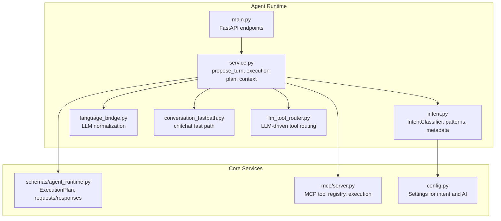
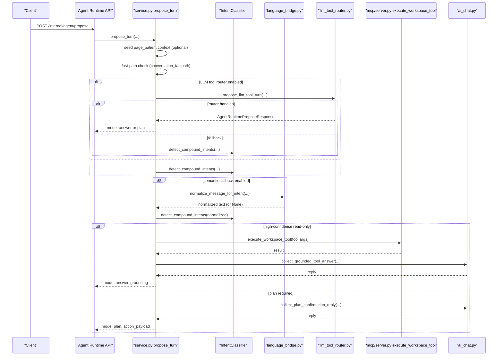
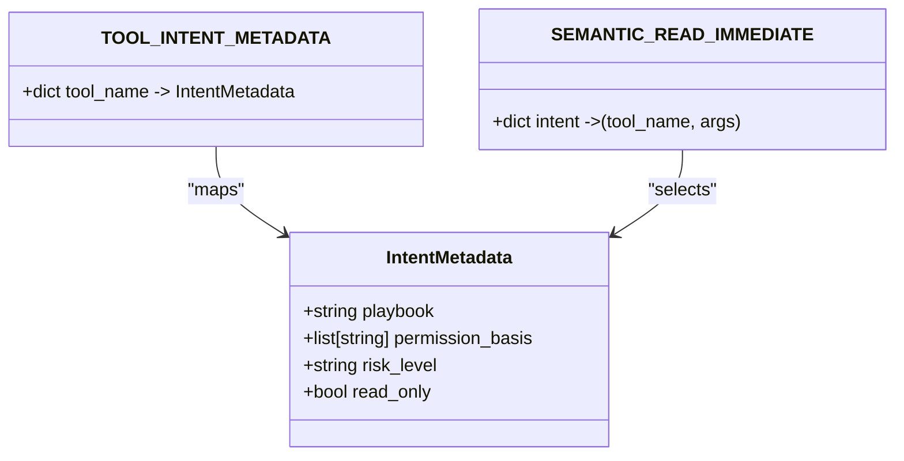
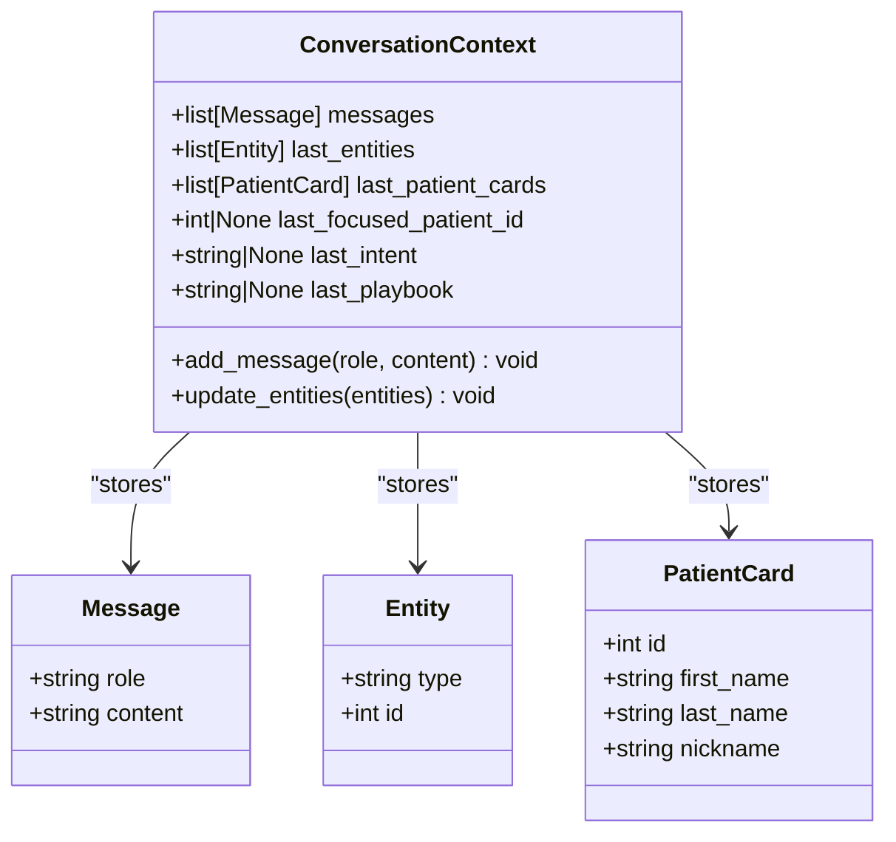
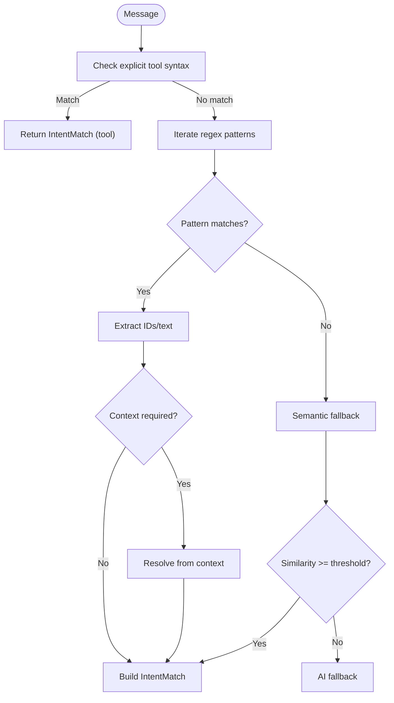
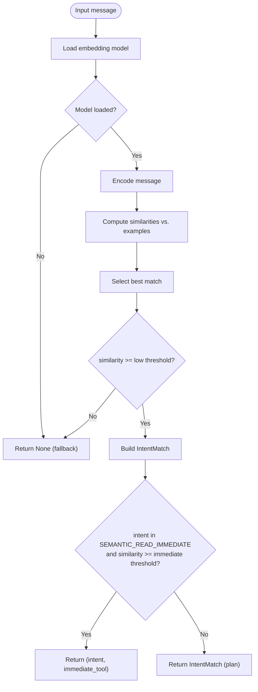
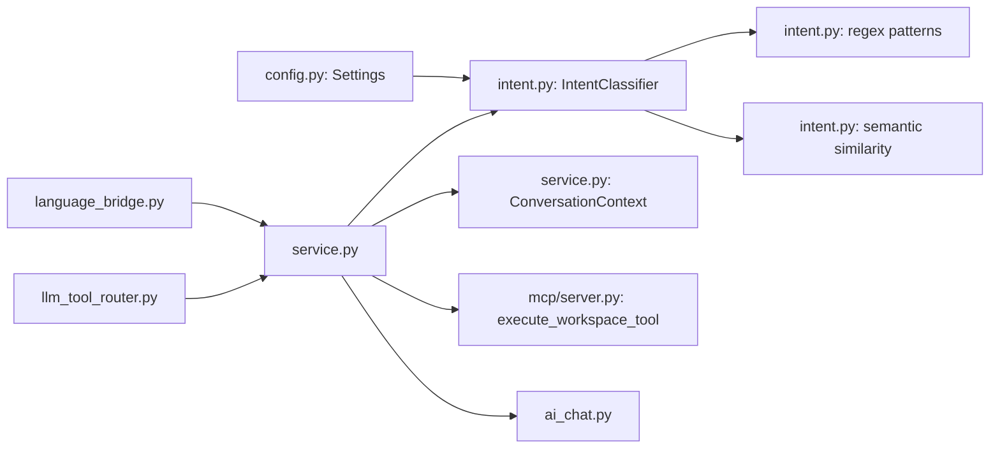

# Intent Classification & NLP

<cite>
**Referenced Files in This Document**
- [intent.py](file://server/app/agent_runtime/intent.py)
- [service.py](file://server/app/agent_runtime/service.py)
- [main.py](file://server/app/agent_runtime/main.py)
- [language_bridge.py](file://server/app/agent_runtime/language_bridge.py)
- [conversation_fastpath.py](file://server/app/agent_runtime/conversation_fastpath.py)
- [llm_tool_router.py](file://server/app/agent_runtime/llm_tool_router.py)
- [config.py](file://server/app/config.py)
- [agent_runtime.py](file://server/app/schemas/agent_runtime.py)
- [mcp_server.py](file://server/app/mcp/server.py)
</cite>

## Table of Contents
1. [Introduction](#introduction)
2. [Project Structure](#project-structure)
3. [Core Components](#core-components)
4. [Architecture Overview](#architecture-overview)
5. [Detailed Component Analysis](#detailed-component-analysis)
6. [Dependency Analysis](#dependency-analysis)
7. [Performance Considerations](#performance-considerations)
8. [Troubleshooting Guide](#troubleshooting-guide)
9. [Conclusion](#conclusion)
10. [Appendices](#appendices)

## Introduction
This document describes the intent classification and NLP subsystem powering the WheelSense AI runtime. It covers:
- Enhanced intent classifier combining regex pattern matching and multilingual semantic similarity
- Intent metadata system for playbook categorization, permission basis, risk levels, and read-only flags
- Conversation context tracking for multi-turn awareness, including message history, entity tracking, and patient focus management
- Regex pattern library for Thai and English natural language processing across domains (patient management, clinical triage, device control, workflow operations, system health)
- Semantic matching algorithm using paraphrase-multilingual-MiniLM-L12-v2 with confidence thresholding
- Practical examples of intent classification, pattern matching, and context-aware follow-up resolution
- Performance optimization, model loading strategies, and fallback mechanisms for semantic processing

## Project Structure
The intent classification system resides in the agent runtime module and integrates with the MCP tool execution layer and AI chat services.

**Diagram sources**
- [intent.py](file://server/app/agent_runtime/intent.py)
- [service.py](file://server/app/agent_runtime/service.py)
- [main.py](file://server/app/agent_runtime/main.py)
- [language_bridge.py](file://server/app/agent_runtime/language_bridge.py)
- [conversation_fastpath.py](file://server/app/agent_runtime/conversation_fastpath.py)
- [llm_tool_router.py](file://server/app/agent_runtime/llm_tool_router.py)
- [agent_runtime.py](file://server/app/schemas/agent_runtime.py)
- [mcp_server.py](file://server/app/mcp/server.py)
- [config.py](file://server/app/config.py)

**Section sources**
- [main.py:14-55](file://server/app/agent_runtime/main.py#L14-L55)
- [service.py:1-120](file://server/app/agent_runtime/service.py#L1-L120)
- [intent.py:1-120](file://server/app/agent_runtime/intent.py#L1-L120)

## Core Components
- IntentClassifier: Builds regex patterns, extracts entities, computes semantic similarity, and constructs IntentMatch results with confidence and metadata.
- ConversationContext: Stores multi-turn state (messages, entities, patient cards, focused patient) for context-aware follow-ups.
- ExecutionPlan and ExecutionPlanStep: Data models representing multi-step tool execution plans.
- Tool metadata: Playbook, permission basis, risk level, and read-only flags for each MCP tool.
- LLM normalization bridge: Optional translation/paraphrasing for non-English messages to improve semantic matching.
- LLM tool router: Alternative routing mode where an LLM selects MCP tools directly.
- Settings: Controls semantic matching enablement, model name, thresholds, and routing mode.

**Section sources**
- [intent.py:16-45](file://server/app/agent_runtime/intent.py#L16-L45)
- [intent.py:59-88](file://server/app/agent_runtime/intent.py#L59-L88)
- [intent.py:101-108](file://server/app/agent_runtime/intent.py#L101-L108)
- [intent.py:347-356](file://server/app/agent_runtime/intent.py#L347-L356)
- [agent_runtime.py:10-30](file://server/app/schemas/agent_runtime.py#L10-L30)
- [config.py:79-90](file://server/app/config.py#L79-L90)

## Architecture Overview
End-to-end flow from user message to action or grounded answer.

**Diagram sources**
- [service.py:346-520](file://server/app/agent_runtime/service.py#L346-L520)
- [intent.py:880-915](file://server/app/agent_runtime/intent.py#L880-L915)
- [language_bridge.py:38-124](file://server/app/agent_runtime/language_bridge.py#L38-L124)
- [llm_tool_router.py:173-366](file://server/app/agent_runtime/llm_tool_router.py#L173-L366)
- [mcp_server.py:2734-2755](file://server/app/mcp/server.py#L2734-L2755)

## Detailed Component Analysis

### Intent Metadata System
- Playbooks: Organize tools by domain (e.g., patient-management, clinical-triage, device-control, facility-ops, workflow, system).
- Permission basis: Scope identifiers required to execute a tool (e.g., patients.read, alerts.manage).
- Risk levels: low, medium, high to guide confirmation and execution policies.
- Read-only flags: Determines whether a tool can auto-run without confirmation.
- Immediate read semantics: Certain intents can auto-execute read tools when confidence thresholds are met.

**Diagram sources**
- [intent.py:16-45](file://server/app/agent_runtime/intent.py#L16-L45)
- [intent.py:48-56](file://server/app/agent_runtime/intent.py#L48-L56)

**Section sources**
- [intent.py:16-45](file://server/app/agent_runtime/intent.py#L16-L45)
- [intent.py:48-56](file://server/app/agent_runtime/intent.py#L48-L56)

### Conversation Context Tracking
- Stores recent messages, last entities, last patient cards, and last focused patient ID.
- Supports multi-turn awareness for Thai follow-ups and reference resolution.
- Seeding from page context (e.g., opening EaseAI from a patient page) primes focus for subsequent turns.

**Diagram sources**
- [intent.py:77-98](file://server/app/agent_runtime/intent.py#L77-L98)
- [service.py:148-159](file://server/app/agent_runtime/service.py#L148-L159)

**Section sources**
- [intent.py:77-98](file://server/app/agent_runtime/intent.py#L77-L98)
- [service.py:69-120](file://server/app/agent_runtime/service.py#L69-L120)
- [service.py:161-200](file://server/app/agent_runtime/service.py#L161-L200)

### Regex Pattern Library (Thai and English)
Patterns cover:
- Clinical vitals and timeline slices requiring patient context
- Chronic conditions/allergies/profile slices
- Patient roster queries and room location queries
- System health, rooms/devices/alerts/tasks/schedules listings
- Explicit tool invocation syntax
- Patient references and ID extractions

**Diagram sources**
- [intent.py:357-564](file://server/app/agent_runtime/intent.py#L357-L564)
- [intent.py:591-625](file://server/app/agent_runtime/intent.py#L591-L625)

**Section sources**
- [intent.py:357-564](file://server/app/agent_runtime/intent.py#L357-L564)
- [intent.py:591-625](file://server/app/agent_runtime/intent.py#L591-L625)

### Semantic Matching Algorithm
- Model: paraphrase-multilingual-MiniLM-L12-v2 (configurable)
- Embedding caching: Precomputed example embeddings to avoid recomputation
- Similarity: Cosine similarity against example corpus
- Thresholding: Low confidence threshold for fallback; higher threshold for immediate read execution
- Confidence scoring: Used to decide auto-run vs. plan confirmation

**Diagram sources**
- [intent.py:566-589](file://server/app/agent_runtime/intent.py#L566-L589)
- [intent.py:600-625](file://server/app/agent_runtime/intent.py#L600-L625)
- [intent.py:853-878](file://server/app/agent_runtime/intent.py#L853-L878)

**Section sources**
- [intent.py:566-589](file://server/app/agent_runtime/intent.py#L566-L589)
- [intent.py:600-625](file://server/app/agent_runtime/intent.py#L600-L625)
- [intent.py:853-878](file://server/app/agent_runtime/intent.py#L853-L878)
- [config.py:80-82](file://server/app/config.py#L80-L82)

### Practical Examples
- Regex-based:
  - “show me all patients” → patients.read → list_visible_patients
  - “where is Wichai” → patients.read → list_visible_patients (with name extraction)
  - “acknowledge alert #123” → alerts.manage → acknowledge_alert (ID extraction)
- Semantic-based:
  - “สัญญาณชีพล่าสุด” (Thai) → patients.read.vitals → get_patient_vitals (contextual)
  - “timeline of recent events” → patients.read.timeline → get_patient_timeline
- Compound intent:
  - “show vitals and timeline” → two steps in ExecutionPlan
- Context-aware follow-up:
  - After “list visible patients”, short Thai phrases like “ประวัติสุขภาพ” resolve to get_patient_vitals using last_focused_patient_id

**Section sources**
- [intent.py:111-188](file://server/app/agent_runtime/intent.py#L111-L188)
- [intent.py:347-564](file://server/app/agent_runtime/intent.py#L347-L564)
- [intent.py:719-878](file://server/app/agent_runtime/intent.py#L719-L878)
- [service.py:202-321](file://server/app/agent_runtime/service.py#L202-L321)

### LLM Normalization Bridge
- Optional English paraphrase for non-English messages to improve semantic matching
- Uses configured AI provider (Ollama/Copilot) with a strict timeout
- Only affects intent classification, not MCP execution

**Section sources**
- [language_bridge.py:38-124](file://server/app/agent_runtime/language_bridge.py#L38-L124)
- [config.py:83-84](file://server/app/config.py#L83-L84)

### LLM Tool Router (Alternative Routing Mode)
- When enabled, an LLM selects MCP tools directly
- Read-only tools may auto-run; writes require confirmation
- Falls back to intent classifier if no tools selected or allowed

**Section sources**
- [llm_tool_router.py:173-366](file://server/app/agent_runtime/llm_tool_router.py#L173-L366)
- [config.py:88-90](file://server/app/config.py#L88-L90)

### Conversation Fast Path
- Heuristic to skip intent/classifier for obvious small talk
- Prevents unnecessary processing for greetings/thanks

**Section sources**
- [conversation_fastpath.py:32-45](file://server/app/agent_runtime/conversation_fastpath.py#L32-L45)

## Dependency Analysis
- IntentClassifier depends on:
  - Regex patterns and metadata
  - SentenceTransformers model (lazy-loaded)
  - Settings for thresholds and model name
- service.py orchestrates:
  - ConversationContext lifecycle
  - Intent detection and plan building
  - MCP tool execution and grounding replies
  - AI fallbacks and fast-path logic
- language_bridge.py and llm_tool_router.py are optional integrations
- MCP server executes tools with scope enforcement

**Diagram sources**
- [config.py:79-90](file://server/app/config.py#L79-L90)
- [intent.py:347-356](file://server/app/agent_runtime/intent.py#L347-L356)
- [service.py:28-36](file://server/app/agent_runtime/service.py#L28-L36)
- [mcp_server.py:2734-2755](file://server/app/mcp/server.py#L2734-L2755)

**Section sources**
- [service.py:28-36](file://server/app/agent_runtime/service.py#L28-L36)
- [mcp_server.py:2734-2755](file://server/app/mcp/server.py#L2734-L2755)

## Performance Considerations
- Lazy-loading of sentence-transformers model avoids cold-start overhead when semantic matching is disabled.
- Example embeddings are cached per model instance to prevent repeated encoding of the example corpus.
- Context window capped to last 10 messages to limit memory usage.
- Immediate read-only tools with high confidence can auto-run without planning overhead.
- Optional LLM normalization has a timeout to avoid blocking.
- Page-scoped seeding reduces disambiguation turns for frequent workflows.

[No sources needed since this section provides general guidance]

## Troubleshooting Guide
- Semantic model not loaded:
  - Symptom: Semantic fallback disabled; classification falls back to regex only.
  - Cause: sentence-transformers not installed or model load failure.
  - Action: Install sentence-transformers or disable intent_semantic_enabled.
- Low confidence or no intent:
  - Symptom: AI fallback triggered.
  - Cause: No regex matches and semantic similarity below thresholds.
  - Action: Improve training examples or enable LLM normalization.
- Context resolution failures:
  - Symptom: Thai follow-ups fail to resolve patient_id.
  - Cause: No last_focused_patient_id and ambiguous or missing names.
  - Action: Ensure prior read tools executed and context ingested.
- LLM normalization failures:
  - Symptom: Normalizer timeouts or exceptions.
  - Cause: Provider misconfiguration or network issues.
  - Action: Adjust timeouts or disable normalization.

**Section sources**
- [intent.py:581-588](file://server/app/agent_runtime/intent.py#L581-L588)
- [language_bridge.py:56-61](file://server/app/agent_runtime/language_bridge.py#L56-L61)
- [service.py:427-442](file://server/app/agent_runtime/service.py#L427-L442)

## Conclusion
The WheelSense intent classification system combines robust regex patterns with multilingual semantic similarity to deliver accurate, context-aware intent recognition. Its metadata-driven design ensures proper permission gating and risk-aware execution, while conversation context enables seamless multi-turn interactions. Optional LLM normalization and tool routing modes provide flexibility and resilience, and performance optimizations keep latency low in production deployments.

[No sources needed since this section summarizes without analyzing specific files]

## Appendices

### Configuration Options
- intent_semantic_enabled: Enable/disable semantic matching
- intent_embedding_model: Model name for sentence-transformers
- intent_semantic_immediate_threshold: Threshold for immediate read execution
- intent_llm_normalize_enabled: Enable/disable LLM normalization
- intent_llm_normalize_timeout_seconds: Timeout for normalization
- intent_ai_conversation_fastpath_enabled: Enable fast path for small talk
- agent_routing_mode: Choose intent or llm_tools routing
- agent_llm_router_model: Model for LLM tool router

**Section sources**
- [config.py:79-90](file://server/app/config.py#L79-L90)