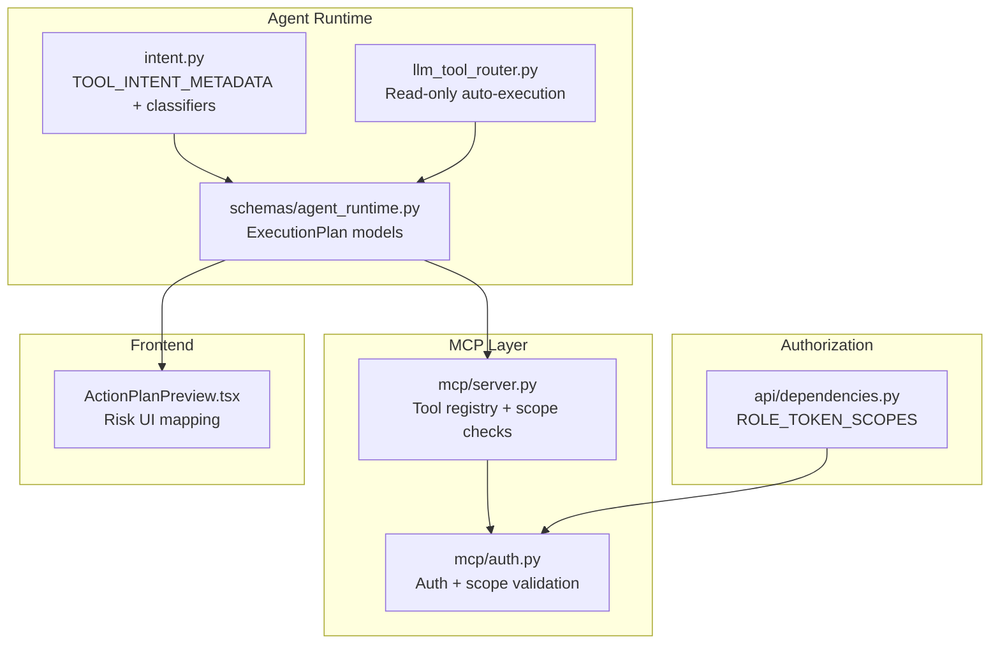
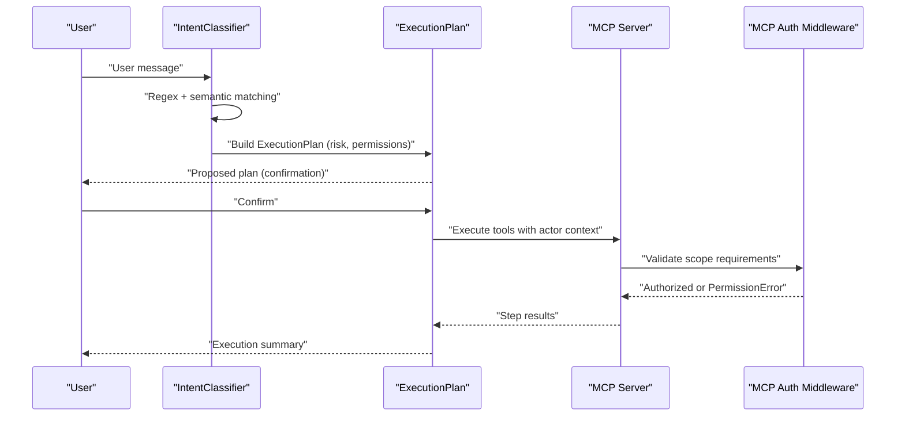
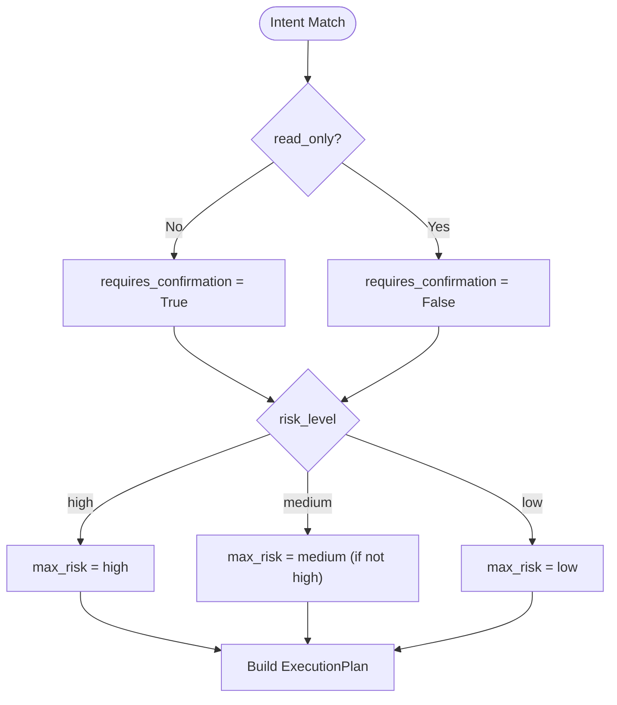
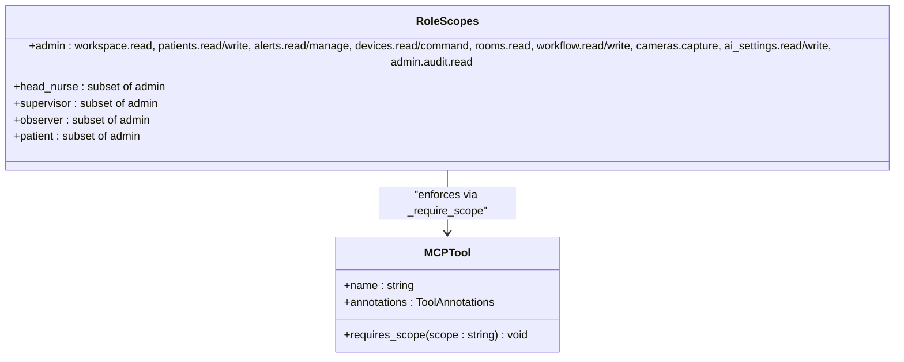
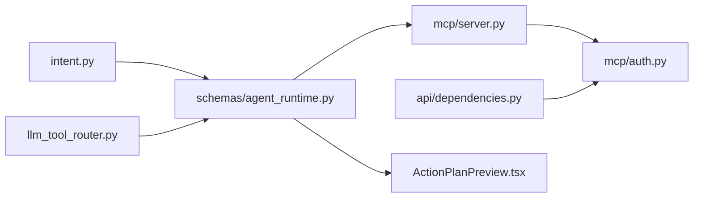

# Intent Metadata & Permission System

<cite>
**Referenced Files in This Document**
- [intent.py](file://server/app/agent_runtime/intent.py)
- [llm_tool_router.py](file://server/app/agent_runtime/llm_tool_router.py)
- [schemas/agent_runtime.py](file://server/app/schemas/agent_runtime.py)
- [mcp/server.py](file://server/app/mcp/server.py)
- [mcp/auth.py](file://server/app/mcp/auth.py)
- [api/dependencies.py](file://server/app/api/dependencies.py)
- [ARCHITECTURE.md](file://docs/ARCHITECTURE.md)
- [ActionPlanPreview.tsx](file://frontend/components/ai/ActionPlanPreview.tsx)
- [test_agent_runtime.py](file://server/tests/test_agent_runtime.py)
- [test_chat_actions_integration.py](file://server/tests/test_chat_actions_integration.py)
</cite>

## Table of Contents
1. [Introduction](#introduction)
2. [Project Structure](#project-structure)
3. [Core Components](#core-components)
4. [Architecture Overview](#architecture-overview)
5. [Detailed Component Analysis](#detailed-component-analysis)
6. [Dependency Analysis](#dependency-analysis)
7. [Performance Considerations](#performance-considerations)
8. [Troubleshooting Guide](#troubleshooting-guide)
9. [Conclusion](#conclusion)

## Introduction
This document explains the comprehensive intent metadata system that governs WheelSense AI runtime permissions and risk assessment. It documents the TOOL_INTENT_METADATA dictionary that defines playbook categorization, permission basis requirements, risk levels, and read-only flags for all supported tools. It also details the playbook taxonomy, the permission basis system with granular permissions, the risk level classification, and the SEMANTIC_READ_IMMEDIATE mechanism for high-confidence read operations that can auto-execute MCP tools. Practical examples demonstrate metadata usage, permission checking, risk assessment workflows, and tool execution authorization.

## Project Structure
The intent metadata and permission system spans several modules:
- Agent runtime intent classification and plan building
- LLM-driven tool router for read-only auto-execution
- MCP tool registry and execution with scope enforcement
- Role-based scope definitions and authorization middleware
- Frontend risk visualization and plan preview

**Diagram sources**
- [intent.py:16-45](file://server/app/agent_runtime/intent.py#L16-L45)
- [llm_tool_router.py:36-52](file://server/app/agent_runtime/llm_tool_router.py#L36-L52)
- [schemas/agent_runtime.py:10-29](file://server/app/schemas/agent_runtime.py#L10-L29)
- [mcp/server.py:113-117](file://server/app/mcp/server.py#L113-L117)
- [mcp/auth.py:16-142](file://server/app/mcp/auth.py#L16-L142)
- [api/dependencies.py:250-311](file://server/app/api/dependencies.py#L250-L311)
- [ActionPlanPreview.tsx:43-66](file://frontend/components/ai/ActionPlanPreview.tsx#L43-L66)

**Section sources**
- [intent.py:16-45](file://server/app/agent_runtime/intent.py#L16-L45)
- [llm_tool_router.py:36-52](file://server/app/agent_runtime/llm_tool_router.py#L36-L52)
- [schemas/agent_runtime.py:10-29](file://server/app/schemas/agent_runtime.py#L10-L29)
- [mcp/server.py:113-117](file://server/app/mcp/server.py#L113-L117)
- [mcp/auth.py:16-142](file://server/app/mcp/auth.py#L16-L142)
- [api/dependencies.py:250-311](file://server/app/api/dependencies.py#L250-L311)
- [ActionPlanPreview.tsx:43-66](file://frontend/components/ai/ActionPlanPreview.tsx#L43-L66)

## Core Components
- TOOL_INTENT_METADATA: Central registry mapping MCP tool names to playbook, permission basis, risk level, and read-only flag. Used by intent classifiers to build ExecutionPlan objects and to enable semantic read auto-execution.
- SEMANTIC_READ_IMMEDIATE: Mapping of permission basis to MCP tool names for high-confidence semantic similarity reads that bypass confirmation.
- ExecutionPlan and ExecutionPlanStep: Data models representing multi-step plans with risk levels, permission basis, affected entities, and confirmation requirements.
- MCP tool registry and scope enforcement: Tools enforce required scopes at runtime; unauthorized access raises PermissionError.
- Role-based scopes: ROLE_TOKEN_SCOPES define allowable permissions per role; MCP tokens may narrow scopes further.

**Section sources**
- [intent.py:16-45](file://server/app/agent_runtime/intent.py#L16-L45)
- [intent.py:47-56](file://server/app/agent_runtime/intent.py#L47-L56)
- [schemas/agent_runtime.py:10-29](file://server/app/schemas/agent_runtime.py#L10-L29)
- [mcp/server.py:113-117](file://server/app/mcp/server.py#L113-L117)
- [api/dependencies.py:250-311](file://server/app/api/dependencies.py#L250-L311)

## Architecture Overview
The system orchestrates intent classification, plan generation, and MCP execution with strict permission and risk controls.

**Diagram sources**
- [intent.py:719-747](file://server/app/agent_runtime/intent.py#L719-L747)
- [schemas/agent_runtime.py:21-29](file://server/app/schemas/agent_runtime.py#L21-L29)
- [mcp/server.py:113-117](file://server/app/mcp/server.py#L113-L117)
- [mcp/auth.py:16-142](file://server/app/mcp/auth.py#L16-L142)

**Section sources**
- [intent.py:719-747](file://server/app/agent_runtime/intent.py#L719-L747)
- [schemas/agent_runtime.py:21-29](file://server/app/schemas/agent_runtime.py#L21-L29)
- [mcp/server.py:113-117](file://server/app/mcp/server.py#L113-L117)
- [mcp/auth.py:16-142](file://server/app/mcp/auth.py#L16-L142)

## Detailed Component Analysis

### TOOL_INTENT_METADATA Dictionary
The dictionary defines the playbook taxonomy, permission basis, risk levels, and read-only flags for each MCP tool. Playbooks include:
- system: system health, workspace context, analytics
- patient-management: patient listing, details, records, room updates
- clinical-triage: alerts, vitals, timelines
- device-control: devices, cameras, room smart devices
- facility-ops: rooms, facilities, floorplans
- workflow: tasks, schedules, messaging

Each tool entry specifies:
- playbook: domain category
- permission_basis: required scope(s)
- risk_level: low/medium/high
- read_only: whether the tool mutates data

Examples of entries:
- list_visible_patients: playbook "patient-management", permission "patients.read", risk "low", read_only True
- acknowledge_alert: playbook "clinical-triage", permission "alerts.manage", risk "medium", read_only False
- update_patient_room: playbook "facility-ops", permission "patients.write", risk "high", read_only False
- send_device_command: playbook "device-control", permission "devices.command", risk "high", read_only False

These metadata drive plan construction, confirmation requirements, and semantic read auto-execution.

**Section sources**
- [intent.py:16-45](file://server/app/agent_runtime/intent.py#L16-L45)

### SEMANTIC_READ_IMMEDIATE System
High-confidence semantic similarity matches for read-only permissions can auto-execute MCP tools without confirmation. The mapping pairs permission basis to MCP tool names and arguments. Examples:
- patients.read → list_visible_patients({})
- alerts.read → list_active_alerts({})
- devices.read → list_devices({})
- rooms.read → list_rooms({})
- tasks.read → list_workflow_tasks({})
- schedules.read → list_workflow_schedules({})
- system.health → get_system_health({})

This enables immediate reads for common queries while preserving confirmation for writes.

**Section sources**
- [intent.py:47-56](file://server/app/agent_runtime/intent.py#L47-L56)

### Risk Level Classification and Confirmation Requirements
Risk levels are classified as low, medium, and high. Confirmation requirements are derived from read-only flags and risk levels:
- read_only True: requires_confirmation False (auto-executed for semantic reads)
- read_only False: requires_confirmation True (including high-risk writes)

The intent classifier sets requires_confirmation based on metadata read_only flag. ExecutionPlan aggregates risk levels across steps, taking the highest risk among steps.

**Diagram sources**
- [intent.py:70-74](file://server/app/agent_runtime/intent.py#L70-L74)
- [intent.py:956-984](file://server/app/agent_runtime/intent.py#L956-L984)

**Section sources**
- [intent.py:70-74](file://server/app/agent_runtime/intent.py#L70-L74)
- [intent.py:956-984](file://server/app/agent_runtime/intent.py#L956-L984)

### Permission Basis System and Role Scopes
The system uses granular permission scopes aligned with roles:
- patients.read/write, alerts.read/manage, devices.read/command, rooms.read, workflow.read/write, cameras.capture, ai_settings.read/write, admin.audit.read, etc.

ROLE_TOKEN_SCOPES define the full set of scopes per role. MCP tokens may narrow scopes further. At execution, tools enforce required scopes via _require_scope.

**Diagram sources**
- [api/dependencies.py:250-311](file://server/app/api/dependencies.py#L250-L311)
- [mcp/server.py:113-117](file://server/app/mcp/server.py#L113-L117)

**Section sources**
- [api/dependencies.py:250-311](file://server/app/api/dependencies.py#L250-L311)
- [mcp/server.py:113-117](file://server/app/mcp/server.py#L113-L117)

### LLM Tool Router Read-Only Auto-Execution
When AGENT_ROUTING_MODE is "llm_tools", the LLM router selects tools and can auto-execute read-only tools during propose. Write tools become part of an ExecutionPlan requiring confirmation.

Key points:
- _MCP_WRITE_TOOL_NAMES enumerates mutations
- MCP_TOOL_READ_ONLY_ROUTING excludes writes
- If all selected tools are read-only, they execute immediately during propose
- Otherwise, a plan is generated and requires user confirmation

**Section sources**
- [llm_tool_router.py:36-52](file://server/app/agent_runtime/llm_tool_router.py#L36-L52)
- [llm_tool_router.py:136-170](file://server/app/agent_runtime/llm_tool_router.py#L136-L170)
- [llm_tool_router.py:279-315](file://server/app/agent_runtime/llm_tool_router.py#L279-L315)

### Frontend Risk Visualization
The frontend maps risk levels to UI affordances:
- low → success color/icon
- medium → warning color/icon
- high → destructive color/icon

This provides immediate visual feedback for plan risk levels.

**Section sources**
- [ActionPlanPreview.tsx:43-66](file://frontend/components/ai/ActionPlanPreview.tsx#L43-L66)

### Practical Examples

#### Example 1: Metadata Usage in Intent Classification
- Message: "list active alerts"
- Classifier matches regex pattern for alerts.read
- Intent metadata maps to acknowledge_alert with playbook "clinical-triage", permission "alerts.manage", risk "medium"
- ExecutionPlan built with requires_confirmation True
- If semantic read auto-execution applies, immediate read tool is used instead

**Section sources**
- [intent.py:426-432](file://server/app/agent_runtime/intent.py#L426-L432)
- [intent.py:25-26](file://server/app/agent_runtime/intent.py#L25-L26)
- [test_agent_runtime.py:378-398](file://server/tests/test_agent_runtime.py#L378-L398)

#### Example 2: Permission Checking and Scope Enforcement
- Tool: send_device_command
- Required scope: devices.command
- MCP tool enforces scope via _require_scope
- Auth middleware validates bearer token and resolves effective scopes
- Unauthorized access raises PermissionError

**Section sources**
- [intent.py:42-42](file://server/app/agent_runtime/intent.py#L42-L42)
- [mcp/server.py:113-117](file://server/app/mcp/server.py#L113-L117)
- [mcp/auth.py:16-142](file://server/app/mcp/auth.py#L16-L142)

#### Example 3: Risk Assessment Workflow
- Message: "move patient 123 to room 5 and acknowledge alert 456"
- Classifier builds compound ExecutionPlan with two steps
- Step 1: update_patient_room (risk "high")
- Step 2: acknowledge_alert (risk "medium")
- Plan risk level: "high" (max risk)
- Permission basis: ["patients.write", "alerts.manage"]
- Affected entities: [patient 123, room 5, alert 456]

**Section sources**
- [intent.py:952-1011](file://server/app/agent_runtime/intent.py#L952-L1011)
- [test_agent_runtime.py:398-429](file://server/tests/test_agent_runtime.py#L398-L429)

#### Example 4: Tool Execution Authorization
- ExecutionPlan prepared with permission_basis and risk_level
- Frontend ActionPlanPreview displays risk indicators
- User confirms execution
- Agent runtime executes via MCP tools with actor context
- MCP tools enforce required scopes

**Section sources**
- [schemas/agent_runtime.py:21-29](file://server/app/schemas/agent_runtime.py#L21-L29)
- [ActionPlanPreview.tsx:43-66](file://frontend/components/ai/ActionPlanPreview.tsx#L43-L66)
- [mcp/server.py:2734-2754](file://server/app/mcp/server.py#L2734-L2754)

## Dependency Analysis
The system exhibits clear separation of concerns:
- intent.py depends on schemas/agent_runtime.py for ExecutionPlan models
- llm_tool_router.py depends on the MCP tool registry and role allowlists
- mcp/server.py enforces scope checks and provides tool implementations
- mcp/auth.py validates tokens and narrows scopes
- api/dependencies.py defines role scopes
- Frontend components consume risk metadata from ExecutionPlan

**Diagram sources**
- [intent.py:11-12](file://server/app/agent_runtime/intent.py#L11-L12)
- [llm_tool_router.py:16-24](file://server/app/agent_runtime/llm_tool_router.py#L16-L24)
- [schemas/agent_runtime.py:7-8](file://server/app/schemas/agent_runtime.py#L7-L8)
- [mcp/server.py:19-27](file://server/app/mcp/server.py#L19-L27)
- [mcp/auth.py:10-13](file://server/app/mcp/auth.py#L10-L13)
- [api/dependencies.py:250-311](file://server/app/api/dependencies.py#L250-L311)
- [ActionPlanPreview.tsx:68-85](file://frontend/components/ai/ActionPlanPreview.tsx#L68-L85)

**Section sources**
- [intent.py:11-12](file://server/app/agent_runtime/intent.py#L11-L12)
- [llm_tool_router.py:16-24](file://server/app/agent_runtime/llm_tool_router.py#L16-L24)
- [schemas/agent_runtime.py:7-8](file://server/app/schemas/agent_runtime.py#L7-L8)
- [mcp/server.py:19-27](file://server/app/mcp/server.py#L19-L27)
- [mcp/auth.py:10-13](file://server/app/mcp/auth.py#L10-L13)
- [api/dependencies.py:250-311](file://server/app/api/dependencies.py#L250-L311)
- [ActionPlanPreview.tsx:68-85](file://frontend/components/ai/ActionPlanPreview.tsx#L68-L85)

## Performance Considerations
- Regex-first intent classification minimizes embedding model usage and reduces latency for common patterns.
- Semantic similarity is computed lazily and cached per model name to avoid repeated initialization overhead.
- LLM tool router auto-executes read-only tools during propose to reduce round trips.
- MCP scope checks are lightweight and performed per-tool execution.

## Troubleshooting Guide
Common issues and resolutions:
- PermissionError on MCP tool execution: Ensure the actor context includes the required scope (e.g., patients.write, alerts.manage, devices.command).
- Unauthorized origin or missing bearer token: MCP auth middleware returns 403/401; verify origin allowlist and token validity.
- Revoked or expired MCP token: Auth middleware rejects requests; regenerate or revoke tokens as needed.
- Plan not confirming: Check requires_confirmation flag derived from read_only and risk_level; high-risk writes require explicit user confirmation.
- Frontend risk indicators incorrect: Verify risk_level values in ExecutionPlan and UI mapping logic.

**Section sources**
- [mcp/server.py:113-117](file://server/app/mcp/server.py#L113-L117)
- [mcp/auth.py:35-50](file://server/app/mcp/auth.py#L35-L50)
- [mcp/auth.py:85-111](file://server/app/mcp/auth.py#L85-L111)
- [schemas/agent_runtime.py:15-18](file://server/app/schemas/agent_runtime.py#L15-L18)
- [ActionPlanPreview.tsx:43-66](file://frontend/components/ai/ActionPlanPreview.tsx#L43-L66)

## Conclusion
The intent metadata and permission system provides a robust, layered approach to secure and transparent AI-driven operations. TOOL_INTENT_METADATA defines playbook, permissions, risk, and read-only characteristics for each tool. SEMANTIC_READ_IMMEDIATE accelerates common reads, while MCP scope enforcement and role-based permissions ensure least-privilege execution. ExecutionPlan models unify risk assessment and confirmation workflows, and the frontend surfaces risk visually. Together, these components deliver a secure, auditable, and user-friendly runtime for WheelSense AI.