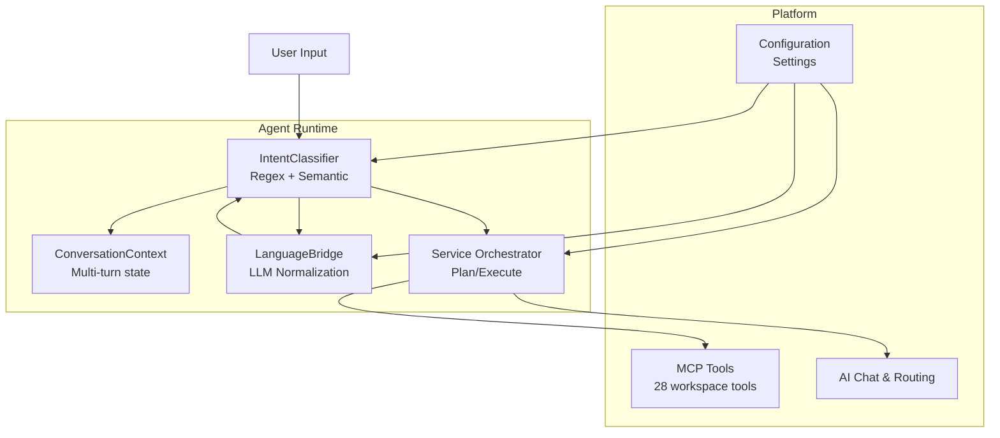
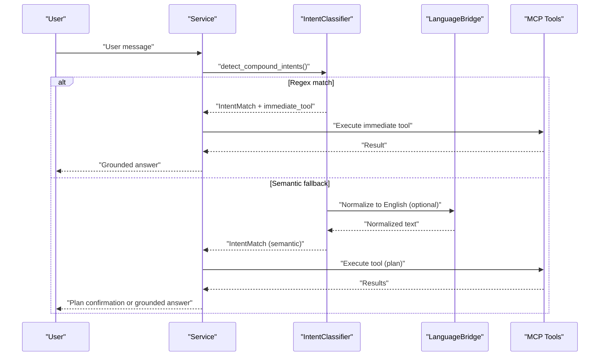

# Regex Pattern Library

<cite>
**Referenced Files in This Document**
- [intent.py](file://server/app/agent_runtime/intent.py)
- [language_bridge.py](file://server/app/agent_runtime/language_bridge.py)
- [service.py](file://server/app/agent_runtime/service.py)
- [AGENTS.md](file://server/AGENTS.md)
- [config.py](file://server/app/config.py)
- [test_agent_runtime.py](file://server/tests/test_agent_runtime.py)
- [test_agent_runtime_extended.py](file://server/tests/test_agent_runtime_extended.py)
</cite>

## Table of Contents
1. [Introduction](#introduction)
2. [Project Structure](#project-structure)
3. [Core Components](#core-components)
4. [Architecture Overview](#architecture-overview)
5. [Pattern Catalog](#pattern-catalog)
6. [Pattern Matching Syntax and Extraction](#pattern-matching-syntax-and-extraction)
7. [Context-Aware Matching Strategies](#context-aware-matching-strategies)
8. [Entity Extraction Patterns](#entity-extraction-patterns)
9. [Multi-Language Support](#multi-language-support)
10. [Pattern Metadata and Classification](#pattern-metadata-and-classification)
11. [Performance Considerations](#performance-considerations)
12. [Fallback Mechanisms](#fallback-mechanisms)
13. [Practical Usage Examples](#practical-usage-examples)
14. [Troubleshooting Guide](#troubleshooting-guide)
15. [Conclusion](#conclusion)

## Introduction
This document describes the WheelSense intent classification regex pattern library used by the agent runtime to process natural language queries into executable operations. The system supports both Thai and English natural language processing for patient management, clinical triage, device control, workflow operations, and system health queries. It combines high-precision regex patterns with optional multilingual semantic matching and an LLM-based normalization bridge to achieve robust intent recognition across diverse user utterances.

## Project Structure
The intent classification system resides in the server-side agent runtime module and integrates with the broader WheelSense platform:

- Pattern library and classification logic: `server/app/agent_runtime/intent.py`
- Optional LLM normalization bridge: `server/app/agent_runtime/language_bridge.py`
- Service orchestration and execution: `server/app/agent_runtime/service.py`
- Configuration and environment settings: `server/app/config.py`
- Platform documentation and runtime behavior: `server/AGENTS.md`
- Unit tests validating patterns and behavior: `server/tests/test_agent_runtime.py`, `server/tests/test_agent_runtime_extended.py`

**Diagram sources**
- [intent.py:347-878](file://server/app/agent_runtime/intent.py#L347-L878)
- [language_bridge.py:38-124](file://server/app/agent_runtime/language_bridge.py#L38-L124)
- [service.py:202-321](file://server/app/agent_runtime/service.py#L202-L321)
- [config.py:79-91](file://server/app/config.py#L79-L91)

**Section sources**
- [intent.py:1-1024](file://server/app/agent_runtime/intent.py#L1-L1024)
- [service.py:1-561](file://server/app/agent_runtime/service.py#L1-L561)
- [AGENTS.md:420-425](file://server/AGENTS.md#L420-L425)

## Core Components
- IntentClassifier: Builds regex patterns, performs classification, extracts entities, and constructs execution plans.
- ConversationContext: Tracks multi-turn conversation state for context-aware matching.
- LanguageBridge: Optional LLM-based normalization to English for improved semantic matching.
- Service orchestrator: Coordinates classification, plan generation, and MCP tool execution.

Key capabilities:
- High-precision regex matching for immediate tool execution
- Multilingual semantic similarity using sentence transformers
- LLM normalization bridge for non-English inputs
- Context-aware entity resolution for Thai follow-ups
- Permission and risk metadata attached to each intent

**Section sources**
- [intent.py:347-878](file://server/app/agent_runtime/intent.py#L347-L878)
- [service.py:202-321](file://server/app/agent_runtime/service.py#L202-L321)
- [language_bridge.py:38-124](file://server/app/agent_runtime/language_bridge.py#L38-L124)

## Architecture Overview
The intent classification pipeline operates in stages:

1. Regex classification: High-confidence exact matches for immediate tool execution
2. Semantic classification: Optional multilingual similarity against labeled examples
3. LLM normalization bridge: Optional paraphrase to English for missed cases
4. Plan generation: For compound or mutation intents
5. Execution: MCP tool invocation with permission and risk checks

**Diagram sources**
- [service.py:202-321](file://server/app/agent_runtime/service.py#L202-L321)
- [intent.py:719-878](file://server/app/agent_runtime/intent.py#L719-L878)
- [language_bridge.py:38-124](file://server/app/agent_runtime/language_bridge.py#L38-L124)

**Section sources**
- [AGENTS.md:420-425](file://server/AGENTS.md#L420-L425)
- [service.py:202-321](file://server/app/agent_runtime/service.py#L202-L321)

## Pattern Catalog
The pattern library organizes regex patterns by intent category and playbook. Each pattern includes metadata for tool selection, argument extraction, and permission/risk requirements.

Categories and playbooks:
- Patient Management: patients.read, patients.write
- Clinical Triage: alerts.read, alerts.manage, patients.read.vitals, patients.read.timeline, patients.read.profile
- Device Control: devices.read, devices.control
- Facility Operations: rooms.read, facility-ops playbooks
- Workflow: tasks.read, schedules.read, workflow operations
- System Health: system.health

Representative patterns include:
- Vitals/timeline follow-ups: Thai phrases for "latest vitals", "health history", "timeline"
- Patient information requests: Thai phrases for "patient info", "location", "detail requests"
- Room listings: English and Thai room listing patterns
- Device status queries: device listing and status patterns
- Alert management: acknowledgment and resolution patterns with IDs
- Task/schedule retrieval: personal task and schedule patterns
- Patient movement operations: transfer and room assignment patterns
- System health queries: system status and platform status patterns

**Section sources**
- [intent.py:357-564](file://server/app/agent_runtime/intent.py#L357-L564)
- [intent.py:16-45](file://server/app/agent_runtime/intent.py#L16-L45)

## Pattern Matching Syntax and Extraction
The classifier uses Python regex with case-insensitive matching and named extraction groups. Extraction mechanisms include:

- Numeric ID extraction: `#?(\d+)` captures IDs with optional hash prefix
- Multiple ID extraction: Groups for patient and room IDs
- Text extraction: Named groups for query strings and free-text segments
- Default arguments: Predefined tool arguments for certain intents
- Context-dependent references: Resolves references from conversation context when no ID is present

Extraction examples:
- Alert acknowledgment: Extracts alert ID from "acknowledge alert #123"
- Patient movement: Extracts patient and room IDs from "move patient #123 to room #5"
- Camera capture: Extracts device ID from "trigger camera #42"
- Text queries: Extracts free-text from "where is John" or "list rooms"

**Section sources**
- [intent.py:626-648](file://server/app/agent_runtime/intent.py#L626-L648)
- [intent.py:806-851](file://server/app/agent_runtime/intent.py#L806-L851)

## Context-Aware Matching Strategies
The system maintains conversation context to enable context-aware matching:

- ConversationContext tracks:
  - Recent messages (last 10)
  - Last entities (alerts, patients)
  - Last patient cards (name/alias/id)
  - Last focused patient ID
  - Last intent and playbook

- Thai follow-up strategies:
  - Resolve vitals/timeline requests to last focused patient
  - Resolve detail requests using roster cards and substring matching
  - Use prior user turns to extract names when current message lacks explicit names
  - Support "chronic condition" and "allergy" queries without explicit patient names

- Entity resolution:
  - Single-entity contexts: Auto-fill patient_id for vitals/timeline
  - Multi-entity contexts: Use context to resolve ambiguous references
  - Page-scoped context: Seed patient context when opening patient pages

**Section sources**
- [intent.py:77-107](file://server/app/agent_runtime/intent.py#L77-L107)
- [intent.py:271-320](file://server/app/agent_runtime/intent.py#L271-L320)
- [service.py:69-120](file://server/app/agent_runtime/service.py#L69-L120)
- [AGENTS.md:422-424](file://server/AGENTS.md#L422-L424)

## Entity Extraction Patterns
The classifier extracts entities and attaches them to intents for downstream processing:

- ID extraction patterns:
  - Single ID: `#?(\d+)`
  - Multiple IDs: Groups for patient_id, room_id, alert_id
- Text extraction patterns:
  - Free-text queries: Names, locations, conditions
  - Substring matching for Thai names without spaces
- Entity types:
  - alert, patient, room (derived from ID fields)
- Risk and permission metadata:
  - Attached to each intent based on tool metadata
  - Used for confirmation requirements and execution gating

**Section sources**
- [intent.py:806-851](file://server/app/agent_runtime/intent.py#L806-L851)
- [intent.py:16-45](file://server/app/agent_runtime/intent.py#L16-L45)

## Multi-Language Support
The system supports Thai and English through:

- Thai-specific patterns:
  - Vitals/timeline: "สัญญาณชีพ", "ประวัติสุขภาพ", "ไทม์ไลน์"
  - Patient info: "ผู้ป่วย", "คนไข้", "อยู่ที่ไหน"
  - Location queries: "ห้อง", "อยู่ห้องอะไร"
  - Chronic conditions: "โรคเรื้อรัง", "แพ้ยา", "ภาวะสุขภาพ"
- Mixed-language patterns:
  - Embedding-based semantic matching over labeled examples
  - LLM normalization bridge for non-English inputs
- Semantic example bank:
  - English and Thai examples for each intent
  - Threshold-based semantic matching for fallback

**Section sources**
- [intent.py:111-188](file://server/app/agent_runtime/intent.py#L111-L188)
- [language_bridge.py:38-124](file://server/app/agent_runtime/language_bridge.py#L38-L124)
- [AGENTS.md:420-425](file://server/AGENTS.md#L420-L425)

## Pattern Metadata and Classification
Each pattern includes metadata for classification and execution:

- Intent classification:
  - intent: Unique intent identifier
  - playbook: Domain categorization (patient-management, clinical-triage, device-control, etc.)
  - confidence: High confidence for regex matches, semantic similarity for fallback
- Tool metadata:
  - tool_name: MCP tool to execute
  - permission_basis: Required scopes for execution
  - risk_level: Low, medium, high
  - read_only: Whether tool is read-only
- Immediate execution:
  - immediate_tool: Tool to execute immediately for read-only queries
  - immediate_read_context_tool: Tool with patient context resolution
- Example bank:
  - Labeled examples for semantic matching
  - Thresholds for immediate semantic execution

**Section sources**
- [intent.py:16-45](file://server/app/agent_runtime/intent.py#L16-L45)
- [intent.py:111-188](file://server/app/agent_runtime/intent.py#L111-L188)
- [service.py:61-66](file://server/app/agent_runtime/service.py#L61-L66)

## Performance Considerations
- Regex-first classification ensures high precision and low latency for common patterns
- Semantic matching is optional and lazy-loaded to minimize startup overhead
- Embedding caching reduces repeated encoding costs
- Immediate tool execution avoids plan generation for read-only queries
- Conversation context pruning limits memory usage
- Threshold-based confidence controls reduce unnecessary AI fallbacks

Optimization techniques:
- Use regex patterns for frequent, well-defined queries
- Enable semantic matching only when needed
- Cache embedding vectors for example bank
- Limit conversation context size to 10 messages
- Apply confidence thresholds to avoid low-quality matches

**Section sources**
- [intent.py:566-624](file://server/app/agent_runtime/intent.py#L566-L624)
- [service.py:281-310](file://server/app/agent_runtime/service.py#L281-L310)

## Fallback Mechanisms
The system implements layered fallback strategies:

1. Regex classification: High-confidence exact matches
2. Semantic classification: Multilingual similarity against labeled examples
3. LLM normalization bridge: Paraphrase non-English inputs to English for routing
4. AI fallback: Direct chat model response for low-confidence or unknown queries

Fallback behavior:
- Low confidence (< threshold) triggers AI fallback
- Semantic matching disabled when model unavailable
- LLM normalization disabled when provider unavailable
- Conversation fast-path for obvious greetings/thanks

**Section sources**
- [intent.py:853-878](file://server/app/agent_runtime/intent.py#L853-L878)
- [language_bridge.py:38-124](file://server/app/agent_runtime/language_bridge.py#L38-L124)
- [service.py:400-419](file://server/app/agent_runtime/service.py#L400-L419)

## Practical Usage Examples
Common usage patterns validated by tests:

- System health queries:
  - "What is the system health?" → get_system_health
  - "แสดงสถานะระบบ" (Thai) → get_system_health
- Patient listing:
  - "Show me all patients" → list_visible_patients
  - "ตอนนี้มีผู้ป่วยคือใครบ้าง" (Thai) → list_visible_patients
- Patient location:
  - "Where is Wichai" → list_visible_patients(query="Wichai")
  - "วิชัยอยู่ที่ไหน" (Thai) → list_visible_patients(query="วิชัย")
- Vitals/timeline follow-ups:
  - "สัญญาณชีพล่าสุด" (Thai) → get_patient_vitals with patient context
  - "ประวัติสุขภาพล่าสุด" (Thai) → get_patient_vitals with patient context
- Alert management:
  - "Acknowledge alert #123" → acknowledge_alert (plan)
  - "Resolve alert #456" → resolve_alert (plan)
- Device control:
  - "Trigger camera #42" → trigger_camera_photo
  - "List devices" → list_devices (immediate)
- Workflow operations:
  - "My tasks" → list_workflow_tasks (immediate)
  - "My schedule" → list_workflow_schedules (immediate)

**Section sources**
- [test_agent_runtime.py:80-280](file://server/tests/test_agent_runtime.py#L80-L280)
- [test_agent_runtime_extended.py:264-292](file://server/tests/test_agent_runtime_extended.py#L264-L292)

## Troubleshooting Guide
Common issues and resolutions:

- Pattern not matching:
  - Verify regex pattern includes Thai equivalents for Thai-only queries
  - Check confidence thresholds and semantic matching settings
  - Ensure LLM normalization bridge is enabled if using non-English inputs
- Entity resolution failures:
  - Confirm conversation context contains last_patient_cards or last_entities
  - Verify patient focus is established before Thai follow-ups
  - Check that name substring matching logic is working for Thai names
- Permission errors:
  - Review tool metadata permission_basis for required scopes
  - Verify user roles and workspace assignments
- Performance issues:
  - Disable semantic matching if not needed
  - Reduce embedding model complexity
  - Monitor embedding cache usage

Diagnostic tips:
- Use test cases as reference for expected behavior
- Check service logs for classification attempts and confidence scores
- Validate MCP tool availability and authentication

**Section sources**
- [test_agent_runtime.py:540-576](file://server/tests/test_agent_runtime.py#L540-L576)
- [service.py:400-419](file://server/app/agent_runtime/service.py#L400-L419)

## Conclusion
The WheelSense intent classification regex pattern library provides a robust, multilingual solution for natural language processing across patient management, clinical triage, device control, workflow operations, and system health queries. By combining high-precision regex patterns with optional semantic matching and LLM normalization, the system achieves reliable intent recognition while maintaining performance and security through strict permission and risk controls.