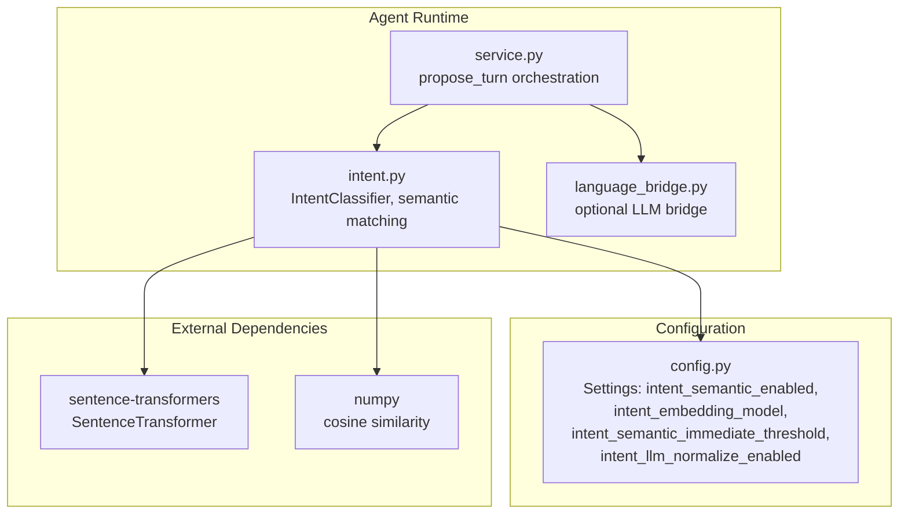
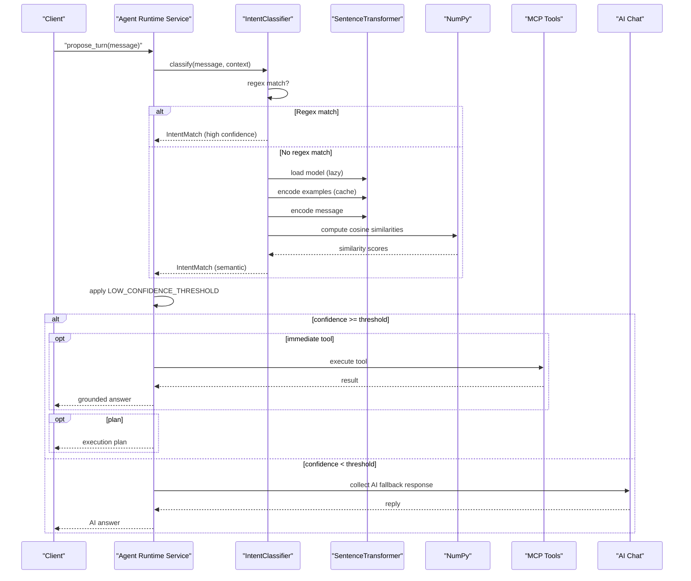
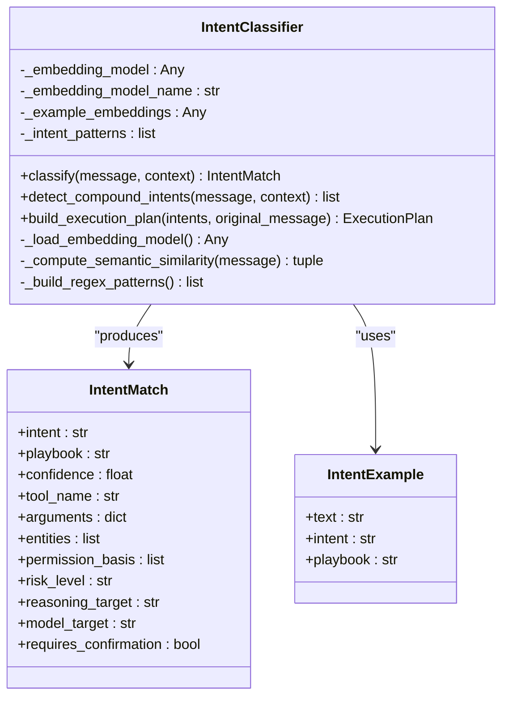
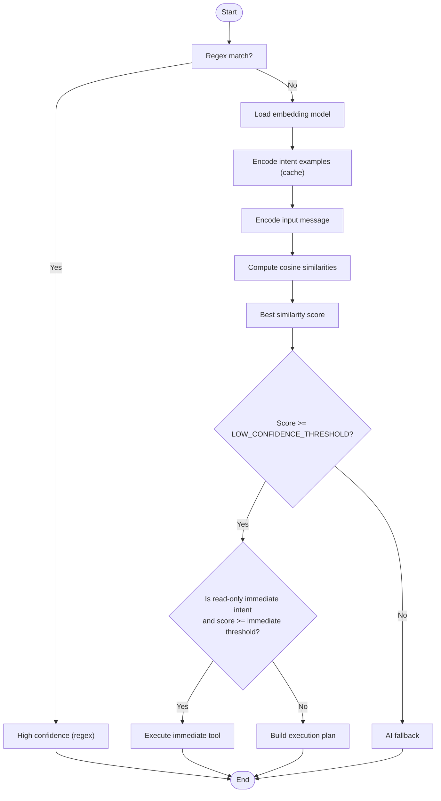
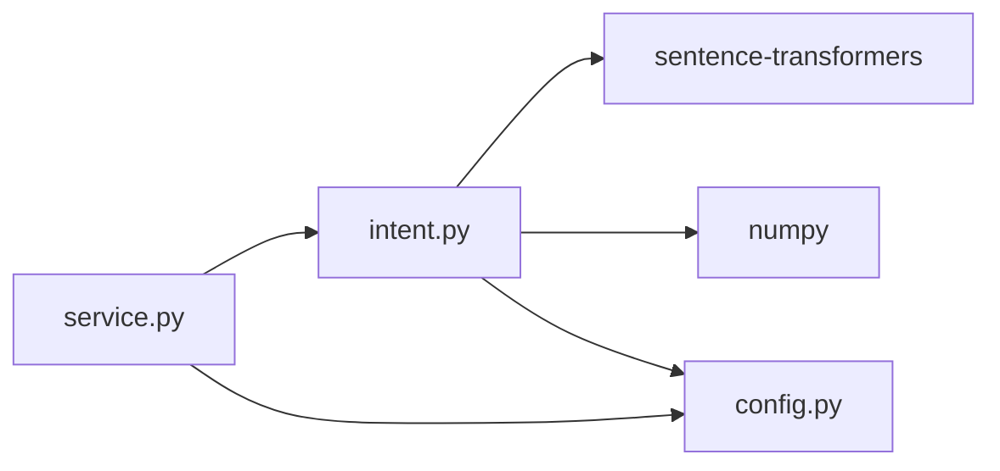

# Semantic Matching & Embeddings

<cite>
**Referenced Files in This Document**
- [intent.py](file://server/app/agent_runtime/intent.py)
- [service.py](file://server/app/agent_runtime/service.py)
- [config.py](file://server/app/config.py)
- [requirements.txt](file://server/requirements.txt)
- [language_bridge.py](file://server/app/agent_runtime/language_bridge.py)
- [test_agent_runtime.py](file://server/tests/test_agent_runtime.py)
</cite>

## Table of Contents
1. [Introduction](#introduction)
2. [Project Structure](#project-structure)
3. [Core Components](#core-components)
4. [Architecture Overview](#architecture-overview)
5. [Detailed Component Analysis](#detailed-component-analysis)
6. [Dependency Analysis](#dependency-analysis)
7. [Performance Considerations](#performance-considerations)
8. [Troubleshooting Guide](#troubleshooting-guide)
9. [Conclusion](#conclusion)

## Introduction
This document describes the semantic intent matching system powered by sentence transformers. It covers the integration of the paraphrase-multilingual-MiniLM-L12-v2 model, embedding computation, cosine similarity scoring, and the confidence thresholding pipeline. It documents the intent example database with multilingual training data (Thai and English), the lazy-loading mechanism for sentence transformer models, memory optimization strategies, and fallback handling when semantic processing is unavailable. Practical examples illustrate semantic similarity computation, intent classification confidence scores, and integration with regex pattern matching. Finally, it outlines model configuration options, performance tuning, and troubleshooting common embedding issues.

## Project Structure
The semantic matching system resides in the agent runtime module and integrates with configuration, service orchestration, and tests:
- Intent classification and semantic matching logic
- Configuration settings for enabling/disabling semantic processing and selecting the model
- Service orchestration that applies confidence thresholds and decides between MCP execution and AI fallback
- Optional language bridge for translating non-English messages into English for intent classification
- Tests validating thresholds and intent examples

**Diagram sources**
- [intent.py:347-878](file://server/app/agent_runtime/intent.py#L347-L878)
- [service.py:380-519](file://server/app/agent_runtime/service.py#L380-L519)
- [config.py:79-90](file://server/app/config.py#L79-L90)

**Section sources**
- [intent.py:1-1024](file://server/app/agent_runtime/intent.py#L1-L1024)
- [service.py:380-519](file://server/app/agent_runtime/service.py#L380-L519)
- [config.py:79-90](file://server/app/config.py#L79-L90)

## Core Components
- IntentClassifier: Implements regex-based intent matching with semantic fallback, including lazy-loading of the sentence transformer model, precomputation of example embeddings, and cosine similarity scoring.
- Confidence thresholds: HIGH_CONFIDENCE_THRESHOLD (0.85), MEDIUM_CONFIDENCE_THRESHOLD (0.60), LOW_CONFIDENCE_THRESHOLD (0.40).
- Intent example database: Multilingual training corpus covering patient management, alerts, devices, rooms, tasks/workflow, and system health, including Thai and English phrases.
- Lazy-loading and caching: Sentence transformer model and example embeddings are loaded on demand and cached per model name.
- Fallback handling: When semantic processing is unavailable or confidence is below threshold, the system falls back to AI chat.

**Section sources**
- [intent.py:190-194](file://server/app/agent_runtime/intent.py#L190-L194)
- [intent.py:110-188](file://server/app/agent_runtime/intent.py#L110-L188)
- [intent.py:566-589](file://server/app/agent_runtime/intent.py#L566-L589)
- [intent.py:603-624](file://server/app/agent_runtime/intent.py#L603-L624)
- [service.py:400-408](file://server/app/agent_runtime/service.py#L400-L408)

## Architecture Overview
The semantic matching pipeline integrates regex-based intent recognition with multilingual sentence embeddings. The flow is:
- Regex patterns match high-confidence, exact-language queries.
- If no regex match, semantic similarity compares the input against a curated intent example database.
- Confidence thresholds determine whether to execute immediately, build a plan, or fall back to AI.

**Diagram sources**
- [intent.py:719-878](file://server/app/agent_runtime/intent.py#L719-L878)
- [service.py:380-519](file://server/app/agent_runtime/service.py#L380-L519)

## Detailed Component Analysis

### IntentClassifier: Semantic Matching Engine
The IntentClassifier orchestrates:
- Regex pattern matching for high-confidence, exact-language queries.
- Semantic similarity computation using sentence transformers and cosine similarity.
- Confidence thresholding and immediate tool execution decisions.
- Context-aware patient resolution for follow-up requests.

Key implementation highlights:
- Lazy-loading of the sentence transformer model with model name caching and reload on change.
- Precomputation and caching of example embeddings to avoid repeated encoding.
- Cosine similarity calculation using NumPy dot products and norms.
- Immediate tool execution for read-only intents when confidence exceeds a higher threshold.
- Context-aware patient selection for follow-up queries.

**Diagram sources**
- [intent.py:347-1024](file://server/app/agent_runtime/intent.py#L347-L1024)

**Section sources**
- [intent.py:347-878](file://server/app/agent_runtime/intent.py#L347-L878)
- [intent.py:566-624](file://server/app/agent_runtime/intent.py#L566-L624)

### Confidence Thresholding System
Confidence thresholds govern the behavior of semantic matches:
- HIGH_CONFIDENCE_THRESHOLD: 0.85
- MEDIUM_CONFIDENCE_THRESHOLD: 0.60
- LOW_CONFIDENCE_THRESHOLD: 0.40

Behavior:
- If semantic similarity is below LOW_CONFIDENCE_THRESHOLD, the system falls back to AI.
- If similarity meets or exceeds the threshold and the intent is a read-only semantic immediate candidate, the system executes the corresponding tool immediately.
- Otherwise, it builds an execution plan for user confirmation.

**Diagram sources**
- [intent.py:853-878](file://server/app/agent_runtime/intent.py#L853-L878)
- [service.py:400-408](file://server/app/agent_runtime/service.py#L400-L408)

**Section sources**
- [intent.py:190-194](file://server/app/agent_runtime/intent.py#L190-L194)
- [intent.py:853-878](file://server/app/agent_runtime/intent.py#L853-L878)
- [service.py:400-408](file://server/app/agent_runtime/service.py#L400-L408)

### Intent Example Database (Multilingual Training Data)
The intent example database includes curated English and Thai phrases covering:
- Patient management: listing, locating, creating records, moving/assigning rooms
- Alerts: listing, acknowledging, resolving
- Devices: listing, capturing photos
- Rooms: listing
- Tasks/workflow: listing tasks and schedules
- System health: status checks

These examples enable multilingual semantic matching using the paraphrase-multilingual-MiniLM-L12-v2 model.

**Section sources**
- [intent.py:110-188](file://server/app/agent_runtime/intent.py#L110-L188)

### Lazy-Loading Mechanism and Memory Optimization
- Lazy-loading: The sentence transformer model is initialized only when semantic processing is enabled and requested. The model is cached by name; if the configured model name changes, the cache is invalidated and reloaded.
- Caching: Example embeddings are computed once and reused until the model name changes.
- Import-time safety: Missing sentence-transformers dependency disables semantic processing gracefully.

**Section sources**
- [intent.py:566-589](file://server/app/agent_runtime/intent.py#L566-L589)
- [intent.py:603-607](file://server/app/agent_runtime/intent.py#L603-L607)

### Fallback Handling When Semantic Processing Is Unavailable
Fallback mechanisms:
- Disabled by configuration: If semantic processing is disabled, the classifier returns None for semantic similarity.
- Missing dependency: ImportError logs a message and disables semantic processing.
- Exception during model load: Exceptions are caught and logged; semantic processing remains disabled.
- Low confidence: If similarity is below LOW_CONFIDENCE_THRESHOLD, the system switches to AI fallback.
- AI fallback failure: If AI fallback fails, a user-friendly message is returned.

**Section sources**
- [intent.py:568-588](file://server/app/agent_runtime/intent.py#L568-L588)
- [service.py:504-519](file://server/app/agent_runtime/service.py#L504-L519)

### Integration With Regex Pattern Matching
The classifier prioritizes regex-based matching for high-confidence, exact-language queries. Regex patterns cover:
- Vitals and timeline follow-ups requiring patient context
- Patient profile and detail requests
- Immediate read-only tools (list visible patients, system health, rooms, devices, alerts, tasks, schedules)
- Patient location queries and room assignments
- Alert acknowledgments and resolutions
- Device controls and camera captures
- Reference-based queries (acknowledge that alert, what about patient #123)

Regex matches yield high confidence and often immediate tool execution.

**Section sources**
- [intent.py:357-564](file://server/app/agent_runtime/intent.py#L357-L564)

### Practical Examples

#### Semantic Similarity Computation
- Input message is encoded using the sentence transformer model.
- Example embeddings are precomputed and cached.
- Cosine similarity is computed between the input and each example.
- The highest-scoring example determines the intent and playbook, with the similarity score serving as confidence.

**Section sources**
- [intent.py:591-624](file://server/app/agent_runtime/intent.py#L591-L624)

#### Intent Classification Confidence Scores
- Regex matches: confidence is set to a high value (e.g., 0.95).
- Semantic matches: confidence equals the cosine similarity score.
- Thresholding: Below LOW_CONFIDENCE_THRESHOLD triggers AI fallback.

**Section sources**
- [intent.py:753](file://server/app/agent_runtime/intent.py#L753)
- [intent.py:858-878](file://server/app/agent_runtime/intent.py#L858-L878)
- [service.py:400-408](file://server/app/agent_runtime/service.py#L400-L408)

#### Integration With Regex Pattern Matching
- The classifier first attempts regex-based matching; if successful, it returns an IntentMatch with immediate tool execution when applicable.
- If no regex match, it falls back to semantic similarity.

**Section sources**
- [intent.py:719-878](file://server/app/agent_runtime/intent.py#L719-L878)

## Dependency Analysis
- External libraries:
  - sentence-transformers: Provides the paraphrase-multilingual-MiniLM-L12-v2 model for embeddings.
  - numpy: Performs vectorized cosine similarity computations.
- Internal dependencies:
  - Configuration settings control semantic processing enablement, model selection, and thresholds.
  - Service layer applies confidence thresholds and orchestrates MCP execution or AI fallback.

**Diagram sources**
- [requirements.txt:29](file://server/requirements.txt#L29)
- [intent.py:566-624](file://server/app/agent_runtime/intent.py#L566-L624)
- [config.py:79-90](file://server/app/config.py#L79-L90)

**Section sources**
- [requirements.txt:29](file://server/requirements.txt#L29)
- [intent.py:566-624](file://server/app/agent_runtime/intent.py#L566-L624)
- [config.py:79-90](file://server/app/config.py#L79-L90)

## Performance Considerations
- Model initialization cost: Lazy-loading avoids initializing the model until needed; subsequent calls reuse the cached model and example embeddings.
- Embedding precomputation: Example embeddings are computed once and reused, reducing repeated encoding overhead.
- Vectorized similarity: NumPy dot product and norm operations provide efficient batched similarity computation.
- Threshold tuning: Adjusting intent_semantic_immediate_threshold balances speed (immediate execution) versus safety (plan confirmation).
- Memory footprint: Embeddings are stored in memory; consider model size and vocabulary when selecting the embedding model.

[No sources needed since this section provides general guidance]

## Troubleshooting Guide
Common issues and remedies:
- Missing sentence-transformers dependency: Install the library to enable semantic processing.
- Model load failures: Check logs for exceptions during model initialization; ensure model name is valid and accessible.
- Low confidence matches: Increase training examples or adjust thresholds; verify multilingual coverage.
- Performance regressions: Verify that example embeddings are cached and model is not repeatedly reloaded.
- Regex vs semantic conflicts: Ensure regex patterns are specific enough to avoid false positives; adjust pattern specificity.

Validation references:
- Threshold constants and tests
- Semantic fallback behavior and AI fallback

**Section sources**
- [requirements.txt:29](file://server/requirements.txt#L29)
- [intent.py:568-588](file://server/app/agent_runtime/intent.py#L568-L588)
- [test_agent_runtime.py:602-612](file://server/tests/test_agent_runtime.py#L602-L612)
- [service.py:504-519](file://server/app/agent_runtime/service.py#L504-L519)

## Conclusion
The semantic intent matching system combines regex-based high-confidence rules with multilingual sentence embeddings to deliver robust, context-aware intent classification. The paraphrase-multilingual-MiniLM-L12-v2 model, combined with cosine similarity and a carefully tuned thresholding pipeline, enables immediate execution for read-only queries and safe plan-based execution for write operations. Lazy-loading and embedding caching optimize performance, while fallback handling ensures resilience when semantic processing is unavailable. Configuration options allow operators to tune behavior for their deployment environment.