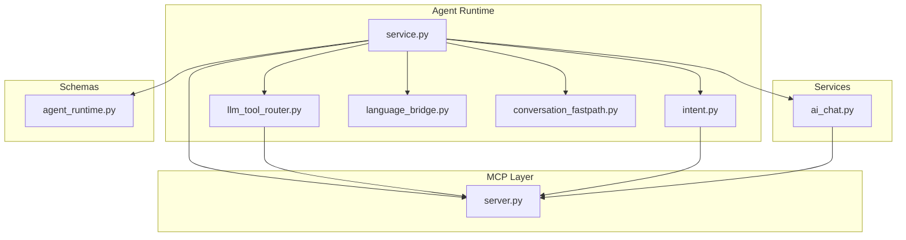
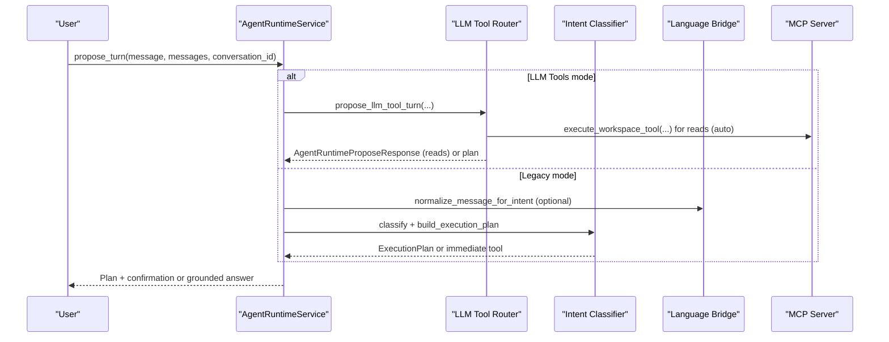
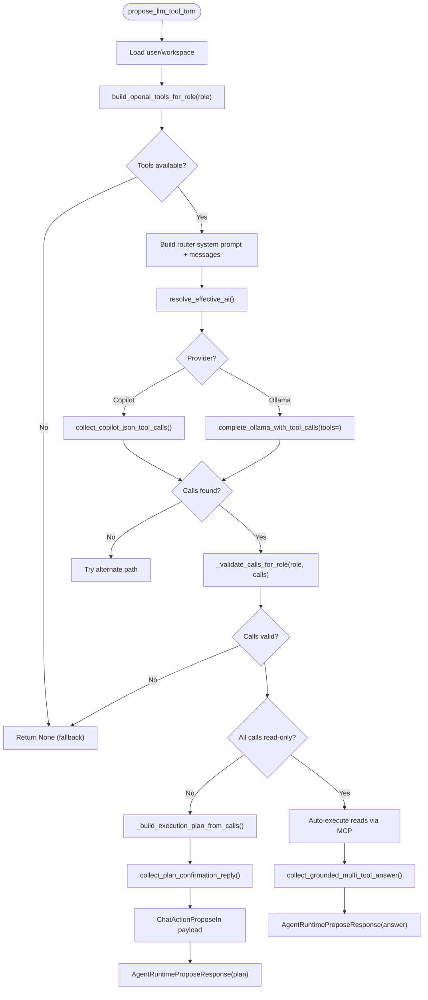
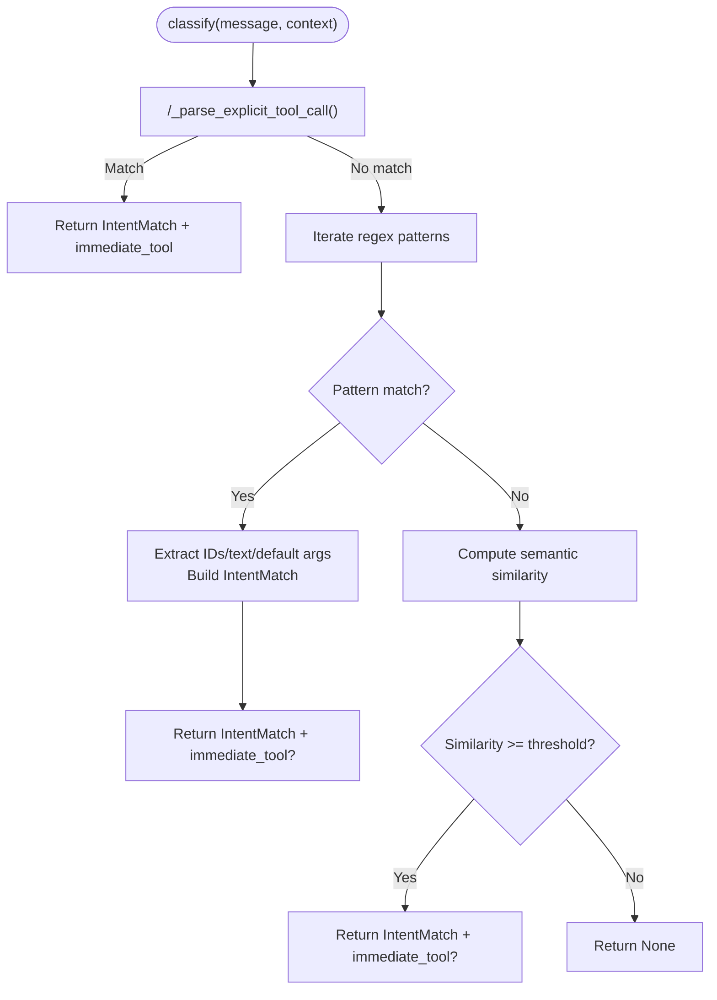
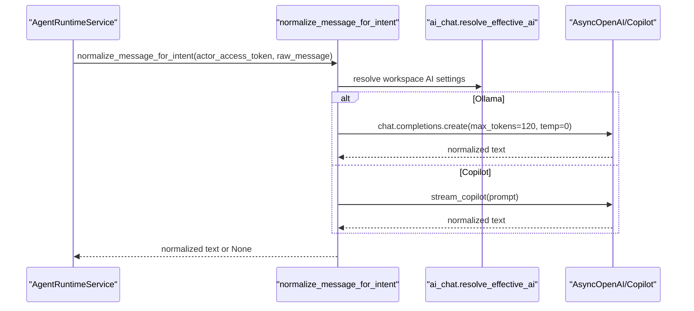
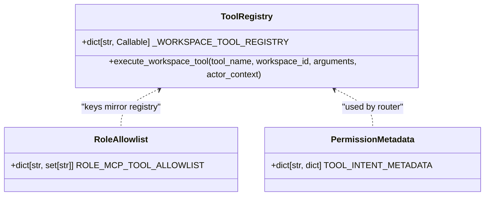
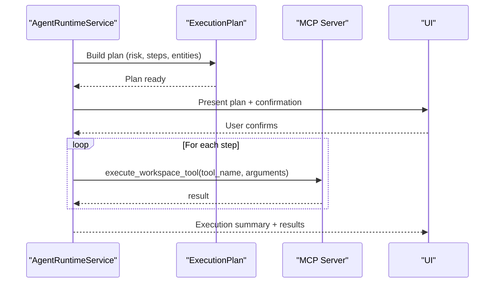
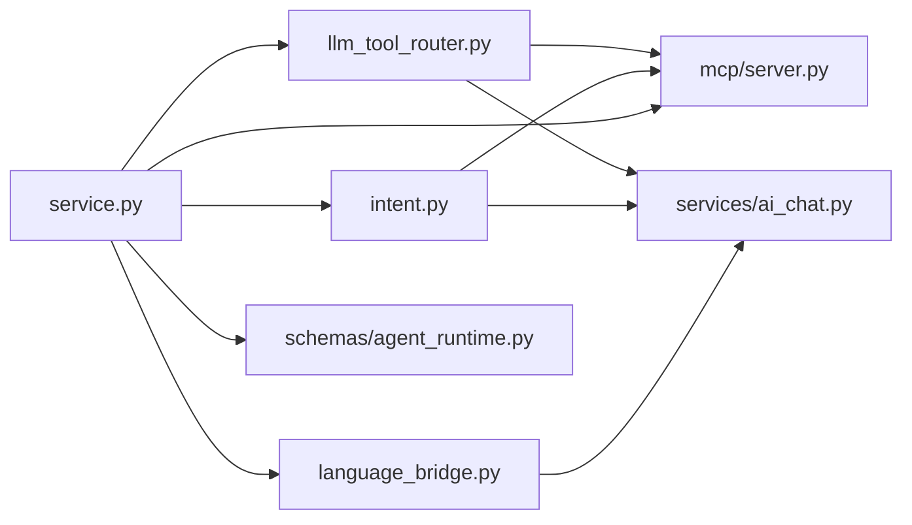

# LLM Tool Router & Intent Classification

<cite>
**Referenced Files in This Document**
- [llm_tool_router.py](file://server/app/agent_runtime/llm_tool_router.py)
- [intent.py](file://server/app/agent_runtime/intent.py)
- [language_bridge.py](file://server/app/agent_runtime/language_bridge.py)
- [service.py](file://server/app/agent_runtime/service.py)
- [server.py](file://server/app/mcp/server.py)
- [ai_chat.py](file://server/app/services/ai_chat.py)
- [agent_runtime.py](file://server/app/schemas/agent_runtime.py)
- [conversation_fastpath.py](file://server/app/agent_runtime/conversation_fastpath.py)
- [test_llm_tool_router.py](file://server/tests/test_llm_tool_router.py)
- [test_llm_tool_propose_integration.py](file://server/tests/test_llm_tool_propose_integration.py)
</cite>

## Table of Contents
1. [Introduction](#introduction)
2. [Project Structure](#project-structure)
3. [Core Components](#core-components)
4. [Architecture Overview](#architecture-overview)
5. [Detailed Component Analysis](#detailed-component-analysis)
6. [Dependency Analysis](#dependency-analysis)
7. [Performance Considerations](#performance-considerations)
8. [Troubleshooting Guide](#troubleshooting-guide)
9. [Conclusion](#conclusion)
10. [Appendices](#appendices)

## Introduction
This document explains the LLM tool router and intent classification system that powers the WheelSense platform’s conversational agent. It covers:
- The LLM-driven tool router that selects MCP tools from natural language requests
- The three-stage action flow: planning, risk assessment, and execution
- The intent classification pipeline for understanding user requests, extracting parameters, and selecting tools
- Multilingual support via a language bridge and context-aware responses
- The tool registry with metadata for permissions, risk levels, and execution patterns
- Practical routing scenarios, intent parsing workflows, and risk assessment logic
- Monitoring, error handling, and fallback mechanisms for robust operation

## Project Structure
The system spans several modules:
- Agent runtime: routing, intent classification, language normalization, and orchestration
- MCP server: tool registry and execution with scoped permissions
- Services: AI chat helpers for tool-call extraction and grounded replies
- Tests: integration and unit tests validating routing behavior

**Diagram sources**
- [service.py:346-520](file://server/app/agent_runtime/service.py#L346-L520)
- [llm_tool_router.py:173-366](file://server/app/agent_runtime/llm_tool_router.py#L173-L366)
- [intent.py:347-1024](file://server/app/agent_runtime/intent.py#L347-L1024)
- [language_bridge.py:38-125](file://server/app/agent_runtime/language_bridge.py#L38-L125)
- [server.py:2614-2754](file://server/app/mcp/server.py#L2614-L2754)
- [ai_chat.py:748-776](file://server/app/services/ai_chat.py#L748-L776)
- [agent_runtime.py:10-57](file://server/app/schemas/agent_runtime.py#L10-L57)

**Section sources**
- [service.py:346-520](file://server/app/agent_runtime/service.py#L346-L520)
- [llm_tool_router.py:173-366](file://server/app/agent_runtime/llm_tool_router.py#L173-L366)
- [intent.py:347-1024](file://server/app/agent_runtime/intent.py#L347-L1024)
- [language_bridge.py:38-125](file://server/app/agent_runtime/language_bridge.py#L38-L125)
- [server.py:2614-2754](file://server/app/mcp/server.py#L2614-L2754)
- [ai_chat.py:748-776](file://server/app/services/ai_chat.py#L748-L776)
- [agent_runtime.py:10-57](file://server/app/schemas/agent_runtime.py#L10-L57)

## Core Components
- LLM Tool Router: Builds role-specific tool schemas, routes user messages to MCP tools, constructs execution plans, and auto-runs safe reads.
- Intent Classifier: Regex-based + semantic matching with multilingual support, entity tracking, and compound intent detection.
- Language Bridge: Optional LLM-based normalization for non-English messages to improve intent classification.
- MCP Tool Registry: Central registry of tools with metadata, permission scopes, and execution semantics.
- Agent Runtime Service: Orchestrates routing modes, conversation fast-path, plan execution, and error handling.

**Section sources**
- [llm_tool_router.py:84-171](file://server/app/agent_runtime/llm_tool_router.py#L84-L171)
- [intent.py:16-45](file://server/app/agent_runtime/intent.py#L16-L45)
- [language_bridge.py:38-125](file://server/app/agent_runtime/language_bridge.py#L38-L125)
- [server.py:2614-2754](file://server/app/mcp/server.py#L2614-L2754)
- [service.py:346-520](file://server/app/agent_runtime/service.py#L346-L520)

## Architecture Overview
The system supports two routing modes:
- LLM Tools Router: Uses LLM-native tool-calling to select and plan MCP tool execution.
- Legacy Intent Classifier: Regex + semantic matching with optional LLM normalization.

**Diagram sources**
- [service.py:346-520](file://server/app/agent_runtime/service.py#L346-L520)
- [llm_tool_router.py:173-366](file://server/app/agent_runtime/llm_tool_router.py#L173-L366)
- [intent.py:347-1024](file://server/app/agent_runtime/intent.py#L347-L1024)
- [language_bridge.py:38-125](file://server/app/agent_runtime/language_bridge.py#L38-L125)
- [server.py:2734-2754](file://server/app/mcp/server.py#L2734-L2754)

## Detailed Component Analysis

### LLM Tool Router
The router builds role-specific tool schemas, validates tool calls against role allowlists, and decides whether to auto-execute safe reads or construct a plan requiring confirmation.

Key behaviors:
- Role-based tool schema generation using MCP registry metadata
- Provider-aware model selection (Ollama vs Copilot)
- Dual-path routing: native tool-calls or JSON-based tool-list
- Auto-execution of read-only tools when sole selection
- Risk-aware plan construction and confirmation prompts

**Diagram sources**
- [llm_tool_router.py:173-366](file://server/app/agent_runtime/llm_tool_router.py#L173-L366)
- [ai_chat.py:748-776](file://server/app/services/ai_chat.py#L748-L776)

**Section sources**
- [llm_tool_router.py:84-171](file://server/app/agent_runtime/llm_tool_router.py#L84-L171)
- [llm_tool_router.py:173-366](file://server/app/agent_runtime/llm_tool_router.py#L173-L366)
- [ai_chat.py:748-776](file://server/app/services/ai_chat.py#L748-L776)

### Intent Classification System
The classifier combines regex patterns and semantic similarity to extract intents, arguments, and entities. It supports compound intents, context-aware references, and immediate-read shortcuts.

Highlights:
- Regex patterns for common commands (patients, alerts, devices, rooms, tasks)
- Semantic similarity with multilingual embedding model
- Context-aware entity tracking for Thai follow-ups
- Immediate-read shortcuts for high-confidence low-risk operations
- Compound intent planning with dependency handling

**Diagram sources**
- [intent.py:347-878](file://server/app/agent_runtime/intent.py#L347-L878)

**Section sources**
- [intent.py:16-45](file://server/app/agent_runtime/intent.py#L16-L45)
- [intent.py:347-878](file://server/app/agent_runtime/intent.py#L347-L878)
- [intent.py:880-1024](file://server/app/agent_runtime/intent.py#L880-L1024)

### Language Bridge (Multilingual Normalization)
The language bridge optionally translates non-English messages into English for improved intent classification. It respects provider settings and timeouts.

**Diagram sources**
- [language_bridge.py:38-125](file://server/app/agent_runtime/language_bridge.py#L38-L125)
- [ai_chat.py:385-387](file://server/app/services/ai_chat.py#L385-L387)

**Section sources**
- [language_bridge.py:38-125](file://server/app/agent_runtime/language_bridge.py#L38-L125)

### Tool Registry and Metadata
The MCP server maintains a central registry of tools with metadata for permissions, risk levels, and execution semantics. The agent runtime maps roles to allowed tools and enforces scope checks at execution time.

**Diagram sources**
- [server.py:2614-2754](file://server/app/mcp/server.py#L2614-L2754)
- [ai_chat.py:77-202](file://server/app/services/ai_chat.py#L77-L202)
- [intent.py:16-45](file://server/app/agent_runtime/intent.py#L16-L45)

**Section sources**
- [server.py:2614-2754](file://server/app/mcp/server.py#L2614-L2754)
- [ai_chat.py:77-202](file://server/app/services/ai_chat.py#L77-L202)
- [intent.py:16-45](file://server/app/agent_runtime/intent.py#L16-L45)

### Three-Stage Action Flow
The system implements a consistent three-stage flow across both routing modes:

1) Planning
- Router or classifier detects intent(s), extracts arguments/entities, and builds an execution plan
- Compound intents are aggregated with risk propagation (low → medium → high)

2) Risk Assessment
- Risk level computed per step and plan-wide
- Read-only steps may auto-execute; mutations require confirmation

3) Execution
- Confirmation prompt presented to user
- On approval, steps executed sequentially with monitoring and error handling

**Diagram sources**
- [service.py:533-561](file://server/app/agent_runtime/service.py#L533-L561)
- [agent_runtime.py:10-30](file://server/app/schemas/agent_runtime.py#L10-L30)
- [server.py:2734-2754](file://server/app/mcp/server.py#L2734-L2754)

**Section sources**
- [service.py:533-561](file://server/app/agent_runtime/service.py#L533-L561)
- [agent_runtime.py:10-30](file://server/app/schemas/agent_runtime.py#L10-L30)

### Practical Routing Scenarios
- Multiple reads: Router auto-executes read-only tools and returns a grounded, multi-tool answer
- Mutation required: Router constructs a plan with confirmation; user approves before execution
- Low confidence: Falls back to AI chat reply or legacy intent classifier
- Conversation fast-path: Social/small-talk messages bypass routing and return AI answers

**Section sources**
- [test_llm_tool_propose_integration.py:28-79](file://server/tests/test_llm_tool_propose_integration.py#L28-L79)
- [test_llm_tool_propose_integration.py:112-129](file://server/tests/test_llm_tool_propose_integration.py#L112-L129)
- [service.py:356-367](file://server/app/agent_runtime/service.py#L356-L367)

### Risk Assessment Logic
- Read-only tools: low risk; may auto-execute when sole selection
- Mutations: medium-high risk; require confirmation
- Plan risk: derived from step risks; highest risk wins

**Section sources**
- [llm_tool_router.py:144-170](file://server/app/agent_runtime/llm_tool_router.py#L144-L170)
- [intent.py:956-985](file://server/app/agent_runtime/intent.py#L956-L985)

### Tool Execution Monitoring and Error Handling
- Direct MCP execution path with structured result extraction
- Conversation context updates after reads to support Thai follow-ups
- Fallback grounded answers on MCP failures
- Execution plan step-by-step monitoring with results aggregation

**Section sources**
- [service.py:122-146](file://server/app/agent_runtime/service.py#L122-L146)
- [service.py:69-121](file://server/app/agent_runtime/service.py#L69-L121)
- [service.py:533-561](file://server/app/agent_runtime/service.py#L533-L561)

## Dependency Analysis
The agent runtime orchestrates multiple subsystems with clear boundaries and minimal coupling.

**Diagram sources**
- [llm_tool_router.py:173-366](file://server/app/agent_runtime/llm_tool_router.py#L173-L366)
- [intent.py:347-1024](file://server/app/agent_runtime/intent.py#L347-L1024)
- [language_bridge.py:38-125](file://server/app/agent_runtime/language_bridge.py#L38-L125)
- [service.py:346-520](file://server/app/agent_runtime/service.py#L346-L520)
- [server.py:2614-2754](file://server/app/mcp/server.py#L2614-L2754)
- [ai_chat.py:748-776](file://server/app/services/ai_chat.py#L748-L776)
- [agent_runtime.py:10-57](file://server/app/schemas/agent_runtime.py#L10-L57)

**Section sources**
- [llm_tool_router.py:173-366](file://server/app/agent_runtime/llm_tool_router.py#L173-L366)
- [intent.py:347-1024](file://server/app/agent_runtime/intent.py#L347-L1024)
- [language_bridge.py:38-125](file://server/app/agent_runtime/language_bridge.py#L38-L125)
- [service.py:346-520](file://server/app/agent_runtime/service.py#L346-L520)
- [server.py:2614-2754](file://server/app/mcp/server.py#L2614-L2754)
- [ai_chat.py:748-776](file://server/app/services/ai_chat.py#L748-L776)
- [agent_runtime.py:10-57](file://server/app/schemas/agent_runtime.py#L10-L57)

## Performance Considerations
- Prefer regex-based classification for high-confidence, low-latency reads
- Use semantic similarity judiciously; enable only when needed
- Limit conversation context window to reduce memory and latency
- Cache embedding models and example vectors when available
- Minimize tool-calling round trips by combining reads into multi-tool grounded answers

## Troubleshooting Guide
Common issues and resolutions:
- LLM tool router failures: falls back to legacy intent classifier; check provider configuration and timeouts
- JSON tool-call path failing: verify Copilot connectivity and model availability
- Ollama tool-calls failing: ensure model names are compatible with Ollama tools API
- MCP execution errors: review permission scopes and actor context; check tool argument validation
- Low confidence routing: enable language bridge normalization for non-English inputs

**Section sources**
- [llm_tool_router.py:231-263](file://server/app/agent_runtime/llm_tool_router.py#L231-L263)
- [service.py:380-382](file://server/app/agent_runtime/service.py#L380-L382)
- [language_bridge.py:56-61](file://server/app/agent_runtime/language_bridge.py#L56-L61)

## Conclusion
The LLM tool router and intent classification system provide a robust, multilingual, and permission-aware pathway from natural language to MCP tool execution. By combining deterministic regex patterns with LLM-native tool-calling and optional semantic matching, the system balances accuracy, safety, and responsiveness. Clear risk assessment, execution monitoring, and fallback strategies ensure reliable operation across diverse user inputs and languages.

## Appendices

### A. Role Allowlists and Tool Metadata
- Role-specific tool allowlists define permitted operations per role
- Tool metadata includes permission basis, risk level, and read-only hints
- Router validates calls against role allowlists and MCP registry keys

**Section sources**
- [ai_chat.py:345-383](file://server/app/services/ai_chat.py#L345-L383)
- [intent.py:16-45](file://server/app/agent_runtime/intent.py#L16-L45)
- [llm_tool_router.py:95-103](file://server/app/agent_runtime/llm_tool_router.py#L95-L103)

### B. Conversation Fast Path
- General conversation-only messages bypass routing and return AI answers directly
- Reduces unnecessary tool invocations for small talk

**Section sources**
- [conversation_fastpath.py:32-44](file://server/app/agent_runtime/conversation_fastpath.py#L32-L44)
- [service.py:356-367](file://server/app/agent_runtime/service.py#L356-L367)

### C. Tests and Validation
- Unit tests validate role-based tool schema building and call validation
- Integration tests validate LLM tool router behavior for reads and plans

**Section sources**
- [test_llm_tool_router.py:13-33](file://server/tests/test_llm_tool_router.py#L13-L33)
- [test_llm_tool_propose_integration.py:28-79](file://server/tests/test_llm_tool_propose_integration.py#L28-L79)
- [test_llm_tool_propose_integration.py:112-129](file://server/tests/test_llm_tool_propose_integration.py#L112-L129)