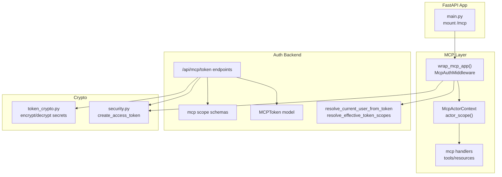
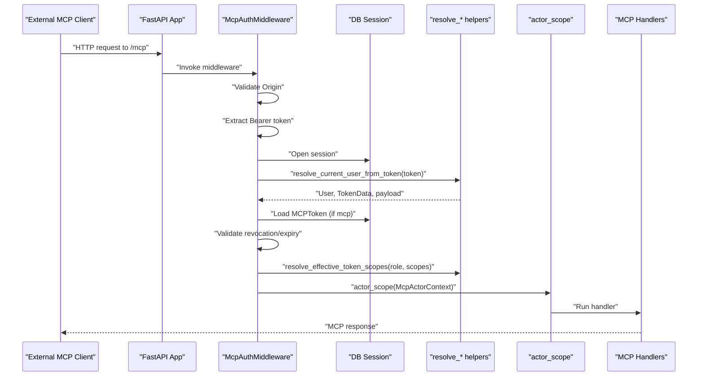
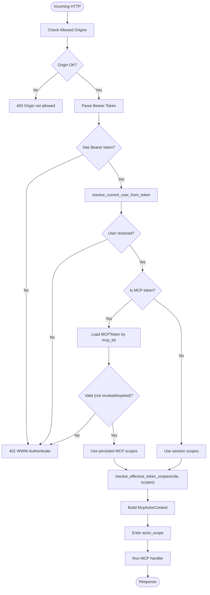
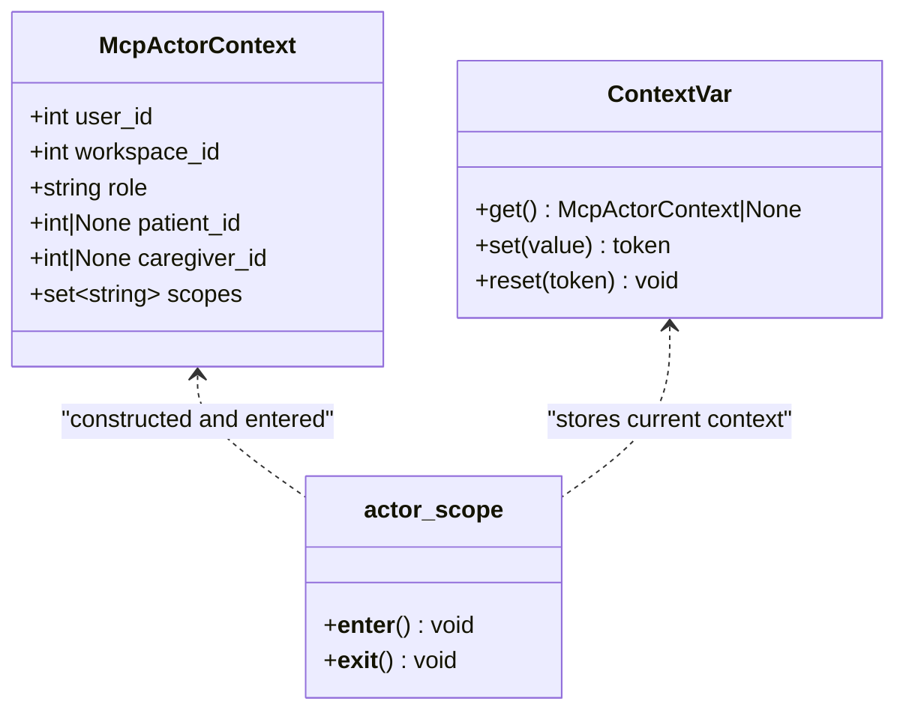
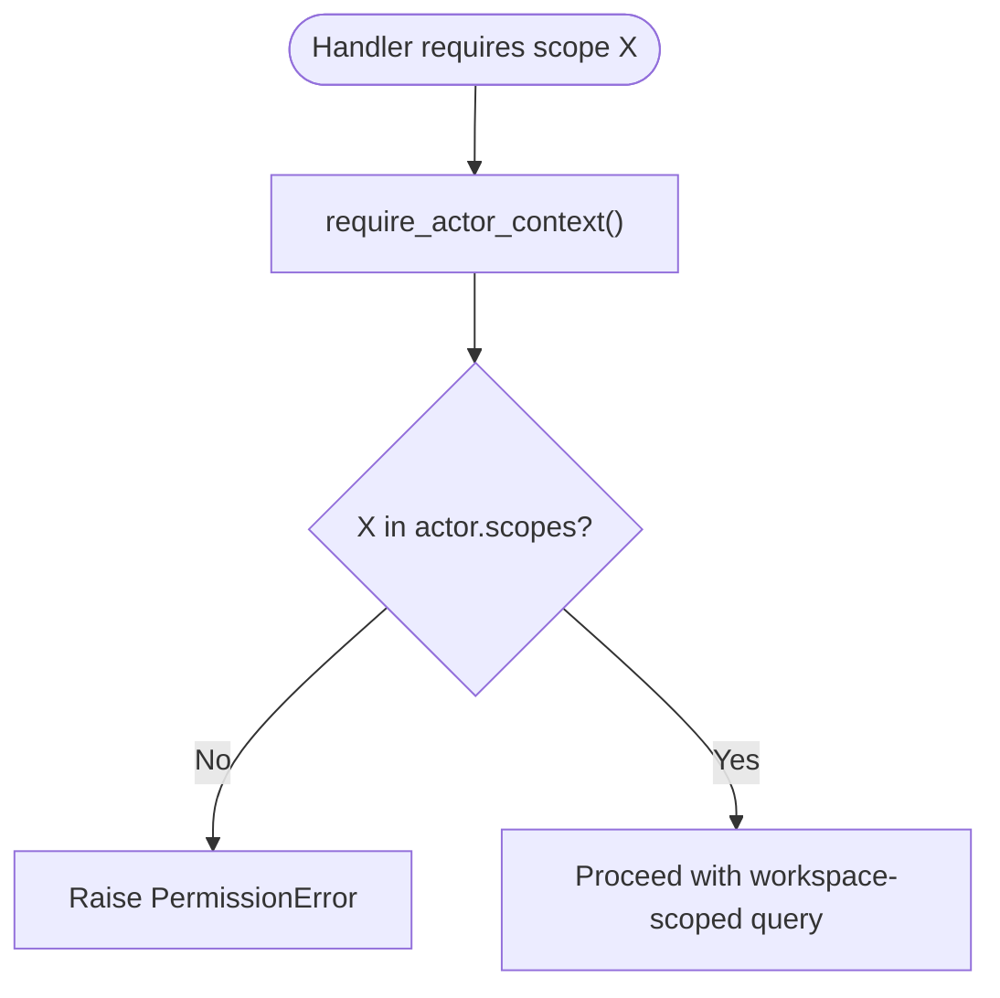
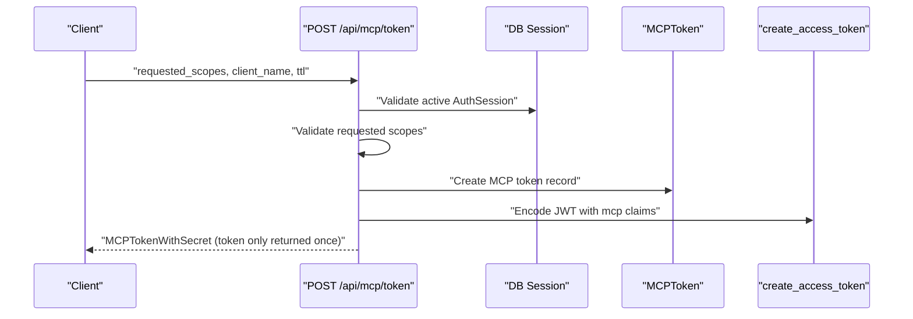
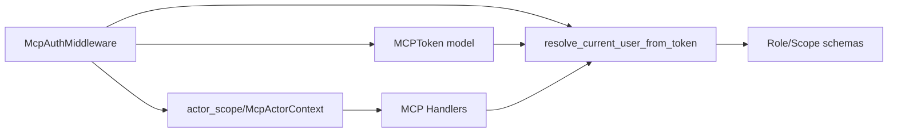

# MCP Authentication & Authorization

<cite>
**Referenced Files in This Document**
- [auth.py](file://server/app/mcp/auth.py)
- [context.py](file://server/app/mcp/context.py)
- [server.py](file://server/app/mcp/server.py)
- [dependencies.py](file://server/app/api/dependencies.py)
- [mcp_auth.py](file://server/app/api/endpoints/mcp_auth.py)
- [mcp_tokens.py](file://server/app/models/mcp_tokens.py)
- [token_crypto.py](file://server/app/core/token_crypto.py)
- [security.py](file://server/app/core/security.py)
- [main.py](file://server/app/main.py)
- [schemas/mcp_auth.py](file://server/app/schemas/mcp_auth.py)
</cite>

## Table of Contents
1. [Introduction](#introduction)
2. [Project Structure](#project-structure)
3. [Core Components](#core-components)
4. [Architecture Overview](#architecture-overview)
5. [Detailed Component Analysis](#detailed-component-analysis)
6. [Dependency Analysis](#dependency-analysis)
7. [Performance Considerations](#performance-considerations)
8. [Troubleshooting Guide](#troubleshooting-guide)
9. [Conclusion](#conclusion)

## Introduction
This document explains the MCP authentication and authorization system used by the WheelSense platform. It covers how external MCP clients authenticate using short-lived, scope-narrowed tokens, how actor contexts are created and enforced, and how authorization is enforced per role and scope. It also documents token cryptography utilities, FastAPI integration, and practical guidance for building custom authorization checks, managing sessions, and handling failures. Security considerations such as token expiration, scope validation, and audit logging are addressed.

## Project Structure
The MCP authentication stack spans several modules:
- HTTP middleware for origin gating and Bearer token validation
- Actor context management via contextvars
- Endpoint-driven MCP token issuance and revocation
- Role-based scope resolution and enforcement
- Token cryptography for secure storage and validation
- FastAPI integration and OAuth protected resource metadata

**Diagram sources**
- [main.py:116-123](file://server/app/main.py#L116-L123)
- [auth.py:145-157](file://server/app/mcp/auth.py#L145-L157)
- [context.py:8-37](file://server/app/mcp/context.py#L8-L37)
- [server.py:113-128](file://server/app/mcp/server.py#L113-L128)
- [dependencies.py:58-120](file://server/app/api/dependencies.py#L58-L120)
- [schemas/mcp_auth.py:54-123](file://server/app/schemas/mcp_auth.py#L54-L123)
- [mcp_tokens.py:10-84](file://server/app/models/mcp_tokens.py#L10-L84)
- [mcp_auth.py:93-178](file://server/app/api/endpoints/mcp_auth.py#L93-L178)
- [security.py:21-41](file://server/app/core/security.py#L21-L41)
- [token_crypto.py:12-25](file://server/app/core/token_crypto.py#L12-L25)

**Section sources**
- [main.py:116-123](file://server/app/main.py#L116-L123)
- [auth.py:145-157](file://server/app/mcp/auth.py#L145-L157)
- [context.py:8-37](file://server/app/mcp/context.py#L8-L37)
- [server.py:113-128](file://server/app/mcp/server.py#L113-L128)
- [dependencies.py:58-120](file://server/app/api/dependencies.py#L58-L120)
- [schemas/mcp_auth.py:54-123](file://server/app/schemas/mcp_auth.py#L54-L123)
- [mcp_tokens.py:10-84](file://server/app/models/mcp_tokens.py#L10-L84)
- [mcp_auth.py:93-178](file://server/app/api/endpoints/mcp_auth.py#L93-L178)
- [security.py:21-41](file://server/app/core/security.py#L21-L41)
- [token_crypto.py:12-25](file://server/app/core/token_crypto.py#L12-L25)

## Core Components
- McpAuthMiddleware: Validates origin, Bearer tokens, resolves user/session, validates MCP token lifecycles, computes effective scopes, and injects McpActorContext into the request lifecycle.
- McpActorContext and actor_scope: Provides a thread/process-safe actor context propagated via contextvars for all MCP handlers.
- MCP token endpoints: Issue short-lived, scope-narrowed tokens bound to an active AuthSession; support listing, revocation, and bulk revocation.
- Role-based scope resolution: Enforces allowed scopes per role and narrows them according to requested scopes.
- Token cryptography: Securely stores secrets at rest using a Fernet-derived key derived from the SECRET_KEY.

**Section sources**
- [auth.py:16-142](file://server/app/mcp/auth.py#L16-L142)
- [context.py:8-37](file://server/app/mcp/context.py#L8-L37)
- [mcp_auth.py:93-178](file://server/app/api/endpoints/mcp_auth.py#L93-L178)
- [dependencies.py:123-128](file://server/app/api/dependencies.py#L123-L128)
- [token_crypto.py:12-25](file://server/app/core/token_crypto.py#L12-L25)

## Architecture Overview
The MCP server is mounted under /mcp and protected by an authentication middleware that:
- Validates Origin against configured allowed origins
- Requires Bearer tokens
- Decodes JWTs and validates sessions
- For MCP tokens, verifies revocation and expiration
- Computes effective scopes from role and token claims
- Creates McpActorContext and runs handlers within it

Handlers enforce scope checks internally and rely on actor context for workspace scoping and role-based visibility.

**Diagram sources**
- [auth.py:30-142](file://server/app/mcp/auth.py#L30-L142)
- [dependencies.py:58-120](file://server/app/api/dependencies.py#L58-L120)
- [context.py:24-37](file://server/app/mcp/context.py#L24-L37)
- [mcp_tokens.py:59-84](file://server/app/models/mcp_tokens.py#L59-L84)

**Section sources**
- [auth.py:30-142](file://server/app/mcp/auth.py#L30-L142)
- [server.py:113-128](file://server/app/mcp/server.py#L113-L128)

## Detailed Component Analysis

### MCP Authentication Wrapper
- Origin validation: Enforces allowed origins and optional requirement for Origin header.
- Bearer token parsing: Ensures Authorization: Bearer is present and valid.
- User/session resolution: Uses JWT decoding and session validation to obtain the authenticated user and token claims.
- MCP token validation: For tokens flagged as MCP, loads the MCPToken record and enforces revocation and expiry.
- Scope resolution: Combines role-based allowed scopes with requested scopes to compute effective scopes.
- Actor context creation: Builds McpActorContext with user_id, workspace_id, role, optional patient_id/caregiver_id, and scopes; enters actor_scope for downstream handlers.

**Diagram sources**
- [auth.py:30-142](file://server/app/mcp/auth.py#L30-L142)
- [dependencies.py:58-120](file://server/app/api/dependencies.py#L58-L120)
- [mcp_tokens.py:59-84](file://server/app/models/mcp_tokens.py#L59-L84)

**Section sources**
- [auth.py:16-142](file://server/app/mcp/auth.py#L16-L142)
- [dependencies.py:58-120](file://server/app/api/dependencies.py#L58-L120)
- [mcp_tokens.py:10-84](file://server/app/models/mcp_tokens.py#L10-L84)

### Actor Context Management
- McpActorContext: Immutable snapshot of the authenticated actor’s identity and permissions.
- actor_scope: Context manager that sets the current actor context for the duration of a request.
- require_actor_context: Utility to enforce that handlers run within a valid actor context.

**Diagram sources**
- [context.py:8-37](file://server/app/mcp/context.py#L8-L37)

**Section sources**
- [context.py:8-37](file://server/app/mcp/context.py#L8-L37)

### Scope-Based Authorization and Workspace Scoping
- Role-to-scope mapping: Canonical MCP scopes are defined per role.
- Effective scope computation: Intersection of role-scopes and requested scopes.
- Handler-level enforcement: Handlers call a scope-check helper to ensure the actor possesses the required scope.
- Workspace scoping: Handlers filter queries by workspace_id and, for non-admin roles, by visible patient lists derived from role and assignments.

**Diagram sources**
- [server.py:113-128](file://server/app/mcp/server.py#L113-L128)
- [dependencies.py:123-128](file://server/app/api/dependencies.py#L123-L128)

**Section sources**
- [schemas/mcp_auth.py:54-123](file://server/app/schemas/mcp_auth.py#L54-L123)
- [server.py:113-128](file://server/app/mcp/server.py#L113-L128)
- [dependencies.py:123-128](file://server/app/api/dependencies.py#L123-L128)

### MCP Token Lifecycle and Issuance
- Endpoint: POST /api/mcp/token creates a short-lived MCP token bound to the current AuthSession.
- Validation: Requests scopes are validated against allowed MCP scopes and intersected with role permissions.
- Persistence: MCP token record stored with scopes, expiry, and revocation tracking.
- JWT claims: Includes mcp flag, mcp_tid, sid, and narrow scope list.
- Revocation: Supports per-token revoke, view, list, and bulk revoke.

**Diagram sources**
- [mcp_auth.py:93-178](file://server/app/api/endpoints/mcp_auth.py#L93-L178)
- [mcp_tokens.py:10-84](file://server/app/models/mcp_tokens.py#L10-L84)
- [security.py:21-41](file://server/app/core/security.py#L21-L41)

**Section sources**
- [mcp_auth.py:93-178](file://server/app/api/endpoints/mcp_auth.py#L93-L178)
- [mcp_tokens.py:10-84](file://server/app/models/mcp_tokens.py#L10-L84)
- [security.py:21-41](file://server/app/core/security.py#L21-L41)

### Token Crypto Utilities
- Fernet-based encryption/decryption for secrets at rest, keyed from SECRET_KEY.
- Used to protect sensitive MCP token secrets when persisted.

**Section sources**
- [token_crypto.py:12-25](file://server/app/core/token_crypto.py#L12-L25)

### FastAPI Integration and OAuth Discovery
- Mounts MCP server under /mcp when enabled.
- Exposes OAuth protected resource metadata endpoint for MCP, listing supported scopes and authorization servers.

**Section sources**
- [main.py:116-123](file://server/app/main.py#L116-L123)
- [main.py:89-114](file://server/app/main.py#L89-L114)

## Dependency Analysis
The MCP auth stack depends on:
- JWT decoding and session validation from the shared auth dependencies
- Role and scope definitions from schemas
- MCP token persistence and lifecycle
- Context propagation via contextvars

**Diagram sources**
- [auth.py:10-13](file://server/app/mcp/auth.py#L10-L13)
- [dependencies.py:58-120](file://server/app/api/dependencies.py#L58-L120)
- [context.py:24-37](file://server/app/mcp/context.py#L24-L37)
- [mcp_tokens.py:10-84](file://server/app/models/mcp_tokens.py#L10-L84)
- [schemas/mcp_auth.py:54-123](file://server/app/schemas/mcp_auth.py#L54-L123)

**Section sources**
- [auth.py:10-13](file://server/app/mcp/auth.py#L10-L13)
- [dependencies.py:58-120](file://server/app/api/dependencies.py#L58-L120)
- [context.py:24-37](file://server/app/mcp/context.py#L24-L37)
- [mcp_tokens.py:10-84](file://server/app/models/mcp_tokens.py#L10-L84)
- [schemas/mcp_auth.py:54-123](file://server/app/schemas/mcp_auth.py#L54-L123)

## Performance Considerations
- Middleware performs minimal synchronous work; most cost is JWT decode and DB lookups.
- Scope intersection is O(n) over requested scopes; keep requested scopes minimal.
- Actor context uses contextvars to avoid passing actor around explicitly.
- MCP token revocation/expiry checks occur per request; caching is not implemented, so ensure DB is responsive.

## Troubleshooting Guide
Common issues and resolutions:
- 401 Unauthorized: Missing or invalid Bearer token; ensure Authorization header is present and valid.
- 403 Origin not allowed: Origin missing or not in allowed list; configure allowed origins appropriately.
- 401 MCP token revoked/expired: Re-issue MCP token via /api/mcp/token; verify AuthSession is active.
- 403 Forbidden (scope): Handler requires a scope not included in effective scopes; adjust requested scopes or role.
- 404 Not Found (token lookup): Token ID incorrect or not owned by workspace; verify token ownership and workspace.

Operational tips:
- Use GET /api/mcp/tokens to list active tokens and inspect expiry/revocation status.
- Use DELETE /api/mcp/token/{id} to revoke a specific token.
- Use POST /api/mcp/tokens/revoke-all to bulk revoke active tokens for rotation.

**Section sources**
- [auth.py:36-111](file://server/app/mcp/auth.py#L36-L111)
- [mcp_auth.py:229-265](file://server/app/api/endpoints/mcp_auth.py#L229-L265)
- [mcp_auth.py:181-226](file://server/app/api/endpoints/mcp_auth.py#L181-L226)

## Conclusion
The MCP authentication and authorization system combines JWT-based session validation, MCP-specific token issuance and revocation, and strict scope enforcement. Actor context ensures consistent workspace scoping and role-based visibility across handlers. The design leverages FastAPI dependencies and contextvars for clean, testable flows while maintaining strong security boundaries.