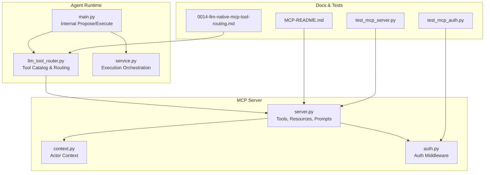
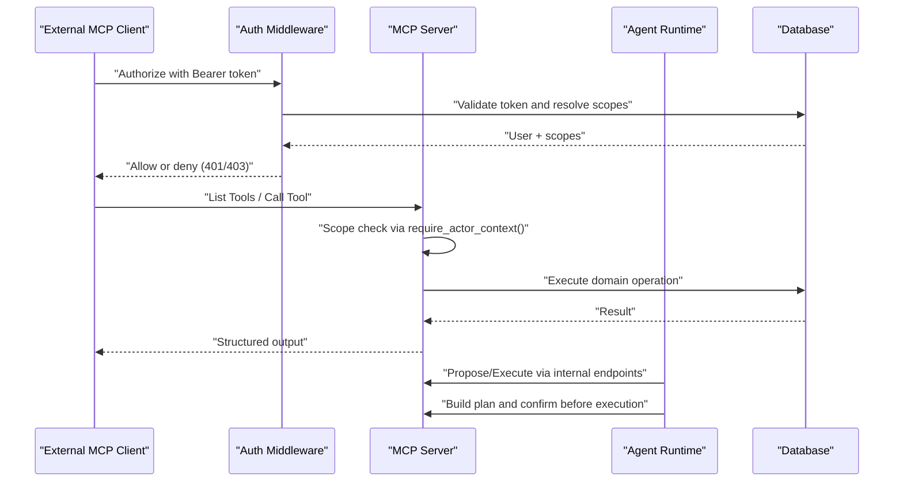
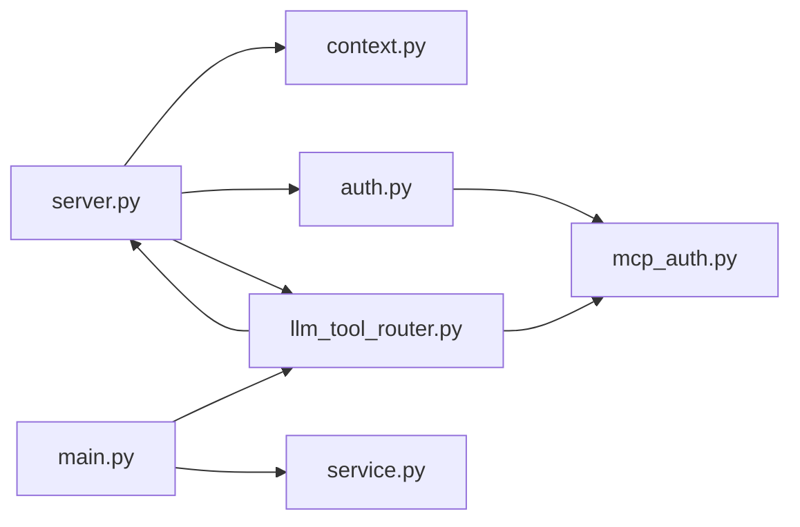

# MCP Development & Tool Creation Guide

<cite>
**Referenced Files in This Document**
- [MCP-README.md](file://docs/MCP-README.md)
- [server.py](file://server/app/mcp/server.py)
- [context.py](file://server/app/mcp/context.py)
- [auth.py](file://server/app/mcp/auth.py)
- [mcp_auth.py](file://server/app/schemas/mcp_auth.py)
- [llm_tool_router.py](file://server/app/agent_runtime/llm_tool_router.py)
- [main.py](file://server/app/agent_runtime/main.py)
- [service.py](file://server/app/agent_runtime/service.py)
- [ARCHITECTURE.md](file://docs/ARCHITECTURE.md)
- [test_mcp_server.py](file://server/tests/test_mcp_server.py)
- [test_mcp_auth.py](file://server/tests/test_mcp_auth.py)
- [0014-llm-native-mcp-tool-routing.md](file://docs/adr/0014-llm-native-mcp-tool-routing.md)
- [0001-fastmcp-sse-for-ai-integration.md](file://docs/adr/0001-fastmcp-sse-for-ai-integration.md)
</cite>

## Table of Contents
1. [Introduction](#introduction)
2. [Project Structure](#project-structure)
3. [Core Components](#core-components)
4. [Architecture Overview](#architecture-overview)
5. [Detailed Component Analysis](#detailed-component-analysis)
6. [Dependency Analysis](#dependency-analysis)
7. [Performance Considerations](#performance-considerations)
8. [Troubleshooting Guide](#troubleshooting-guide)
9. [Conclusion](#conclusion)
10. [Appendices](#appendices)

## Introduction
This guide explains how to develop MCP tools and extend the WheelSense AI runtime. It covers the MCP tool lifecycle, parameter specification, output schema design, tool annotations, context integration, permissions and scopes, testing strategies, and best practices. The goal is to help you build secure, reliable, and well-documented MCP tools that integrate seamlessly with the WheelSense platform.

## Project Structure
The MCP system is implemented in the server application and integrated with the agent runtime and frontend chat flow:
- MCP server and tool registry: server/app/mcp/server.py
- Actor context and scope enforcement: server/app/mcp/context.py, server/app/mcp/auth.py
- Role-based scopes and OAuth metadata: server/app/schemas/mcp_auth.py
- Agent runtime tool routing and execution: server/app/agent_runtime/llm_tool_router.py, server/app/agent_runtime/main.py, server/app/agent_runtime/service.py
- Documentation and ADRs: docs/MCP-README.md, docs/adr/*.md
- Tests: server/tests/test_mcp_server.py, server/tests/test_mcp_auth.py

**Diagram sources**
- [server.py](file://server/app/mcp/server.py)
- [context.py](file://server/app/mcp/context.py)
- [auth.py](file://server/app/mcp/auth.py)
- [llm_tool_router.py](file://server/app/agent_runtime/llm_tool_router.py)
- [main.py](file://server/app/agent_runtime/main.py)
- [service.py](file://server/app/agent_runtime/service.py)
- [MCP-README.md](file://docs/MCP-README.md)
- [0014-llm-native-mcp-tool-routing.md](file://docs/adr/0014-llm-native-mcp-tool-routing.md)
- [test_mcp_server.py](file://server/tests/test_mcp_server.py)
- [test_mcp_auth.py](file://server/tests/test_mcp_auth.py)

**Section sources**
- [MCP-README.md](file://docs/MCP-README.md)
- [server.py](file://server/app/mcp/server.py)
- [context.py](file://server/app/mcp/context.py)
- [auth.py](file://server/app/mcp/auth.py)
- [mcp_auth.py](file://server/app/schemas/mcp_auth.py)
- [llm_tool_router.py](file://server/app/agent_runtime/llm_tool_router.py)
- [main.py](file://server/app/agent_runtime/main.py)
- [service.py](file://server/app/agent_runtime/service.py)
- [ARCHITECTURE.md](file://docs/ARCHITECTURE.md)
- [test_mcp_server.py](file://server/tests/test_mcp_server.py)
- [test_mcp_auth.py](file://server/tests/test_mcp_auth.py)
- [0014-llm-native-mcp-tool-routing.md](file://docs/adr/0014-llm-native-mcp-tool-routing.md)
- [0001-fastmcp-sse-for-ai-integration.md](file://docs/adr/0001-fastmcp-sse-for-ai-integration.md)

## Core Components
- MCP Server: Declares tools, resources, and prompts; enforces scopes; streams responses.
- Actor Context: Captures user identity, workspace, role, and effective scopes.
- Authentication: Validates tokens, enforces origin policies, resolves effective scopes.
- Agent Runtime: Routes tools via LLM, builds execution plans, and coordinates 3-stage chat flow.
- Testing: Covers auth, scope enforcement, OAuth metadata, and MCP server behavior.

Key responsibilities:
- Tool definition and parameter specification are declared in the MCP server module.
- Context integration ensures tools operate within the authenticated actor’s workspace and role.
- Permissions are enforced via scope checks and middleware.
- Agent runtime enables LLM-native tool selection and plan generation.

**Section sources**
- [server.py](file://server/app/mcp/server.py)
- [context.py](file://server/app/mcp/context.py)
- [auth.py](file://server/app/mcp/auth.py)
- [mcp_auth.py](file://server/app/schemas/mcp_auth.py)
- [llm_tool_router.py](file://server/app/agent_runtime/llm_tool_router.py)
- [main.py](file://server/app/agent_runtime/main.py)
- [service.py](file://server/app/agent_runtime/service.py)

## Architecture Overview
The MCP runtime integrates with the agent runtime and chat actions to deliver a secure, role-scoped tool execution pipeline.

**Diagram sources**
- [auth.py](file://server/app/mcp/auth.py)
- [server.py](file://server/app/mcp/server.py)
- [main.py](file://server/app/agent_runtime/main.py)
- [service.py](file://server/app/agent_runtime/service.py)

**Section sources**
- [auth.py](file://server/app/mcp/auth.py)
- [server.py](file://server/app/mcp/server.py)
- [main.py](file://server/app/agent_runtime/main.py)
- [service.py](file://server/app/agent_runtime/service.py)
- [ARCHITECTURE.md](file://docs/ARCHITECTURE.md)

## Detailed Component Analysis

### MCP Tool Definition and Parameter Specification
- Tools are decorated in the MCP server module with metadata and structured output.
- Parameters are typed and validated via function signatures; optional parameters are supported.
- Tools enforce scope checks internally using the actor context.

Common patterns:
- Define tool with @mcp.tool decorator and ToolAnnotations.
- Use require_actor_context() to access user, workspace, role, and scopes.
- Validate scopes with _require_scope() before performing writes.
- Return structured JSON payloads suitable for AI consumption.

Example references:
- Tool registration and annotations: [server.py](file://server/app/mcp/server.py)
- Scope enforcement helpers: [server.py](file://server/app/mcp/server.py)
- Actor context accessors: [server.py](file://server/app/mcp/server.py)

**Section sources**
- [server.py](file://server/app/mcp/server.py)

### Output Schema Design
- Tools return dictionaries designed for downstream AI grounding and chat rendering.
- Read-only tools may return compact summaries; mutating tools return confirmation payloads with identifiers and messages.
- Consistent field naming improves reliability for plan generation and UI rendering.

Guidelines:
- Include identifiers (ids) for referenced entities.
- Provide human-readable messages for user-facing feedback.
- Keep output minimal and deterministic for repeatable tool calls.

**Section sources**
- [server.py](file://server/app/mcp/server.py)

### Tool Annotation System (Metadata)
- ToolAnnotations provide hints for AI assistants:
  - readOnlyHint
  - destructiveHint
  - idempotentHint
  - openWorldHint
- These hints influence whether read-only tools auto-execute during propose and whether write tools require confirmation.

Reference:
- Tool annotations usage: [server.py](file://server/app/mcp/server.py)
- Tool annotations reference: [MCP-README.md](file://docs/MCP-README.md)

**Section sources**
- [server.py](file://server/app/mcp/server.py)
- [MCP-README.md](file://docs/MCP-README.md)

### Context Integration Patterns
- Actor context encapsulates user_id, workspace_id, role, patient_id, caregiver_id, and scopes.
- wrap_actor_context sets up a scoped execution environment for tool calls.
- Resources provide live data via wheelsense:// URIs and are filtered by actor visibility.

Patterns:
- Use require_actor_context() to access current actor.
- Filter lists and queries by workspace and visibility rules.
- Expose resources for current user, visible patients, active alerts, and rooms.

References:
- Actor context dataclass and helpers: [context.py](file://server/app/mcp/context.py)
- Resource definitions: [server.py](file://server/app/mcp/server.py)
- Execution wrapper: [server.py](file://server/app/mcp/server.py)

**Section sources**
- [context.py](file://server/app/mcp/context.py)
- [server.py](file://server/app/mcp/server.py)

### Permission and Scope Requirements
- Roles map to sets of MCP scopes; effective scopes are resolved from tokens.
- MCP tokens can narrow scopes and are individually revocable.
- OAuth metadata endpoint exposes supported scopes and authorization servers.

Scope matrix highlights:
- Admin: broad read/write scopes across domains.
- Head Nurse/Supervisor/Observer: role-specific subsets aligned to their duties.
- Patient: limited to self-related data and room controls.

References:
- Role-to-scope mapping: [mcp_auth.py](file://server/app/schemas/mcp_auth.py)
- OAuth metadata schema: [mcp_auth.py](file://server/app/schemas/mcp_auth.py)
- Auth middleware and token handling: [auth.py](file://server/app/mcp/auth.py)

**Section sources**
- [mcp_auth.py](file://server/app/schemas/mcp_auth.py)
- [auth.py](file://server/app/mcp/auth.py)

### Agent Runtime Tool Routing and Execution
- LLM-native routing builds a tool catalog per role and selects tools from the MCP registry.
- Read-only tools may auto-execute during propose; writes always require plan confirmation.
- Execution plan generation and 3-stage chat flow (propose → confirm → execute) are coordinated by internal endpoints.

References:
- Tool catalog and routing: [llm_tool_router.py](file://server/app/agent_runtime/llm_tool_router.py)
- Internal propose/execute endpoints: [main.py](file://server/app/agent_runtime/main.py)
- Execution orchestration: [service.py](file://server/app/agent_runtime/service.py)
- ADR on LLM-native routing: [0014-llm-native-mcp-tool-routing.md](file://docs/adr/0014-llm-native-mcp-tool-routing.md)
- Chat actions flow: [ARCHITECTURE.md](file://docs/ARCHITECTURE.md)

**Section sources**
- [llm_tool_router.py](file://server/app/agent_runtime/llm_tool_router.py)
- [main.py](file://server/app/agent_runtime/main.py)
- [service.py](file://server/app/agent_runtime/service.py)
- [0014-llm-native-mcp-tool-routing.md](file://docs/adr/0014-llm-native-mcp-tool-routing.md)
- [ARCHITECTURE.md](file://docs/ARCHITECTURE.md)

### Practical Examples and Patterns
- Read-only tool example: list_visible_patients returns filtered patient summaries.
- Mutating tool example: update_patient_room updates a patient’s room and returns a confirmation message.
- Resource example: wheelsense://current-user returns actor context and scopes.
- Prompt example: role-specific playbooks guide AI behavior.

References:
- Tool examples: [server.py](file://server/app/mcp/server.py)
- Resource examples: [server.py](file://server/app/mcp/server.py)
- Prompt examples: [server.py](file://server/app/mcp/server.py)

**Section sources**
- [server.py](file://server/app/mcp/server.py)

### Error Handling and Status Codes
- Standard HTTP codes: 200 success, 401/403 authentication/scopes, 404 not found, 500 server error.
- Error responses include a detail field describing the issue.
- WWW-Authenticate header is set on 401 with resource metadata.

References:
- Error handling and status codes: [MCP-README.md](file://docs/MCP-README.md)
- Auth middleware error responses: [auth.py](file://server/app/mcp/auth.py)

**Section sources**
- [MCP-README.md](file://docs/MCP-README.md)
- [auth.py](file://server/app/mcp/auth.py)

### Testing Strategies
Unit and integration testing approaches:
- MCP server tests: authentication, SSE mount, direct tool calls.
- MCP auth tests: OAuth metadata, token creation, scope narrowing, listing/retrieval, revocation, TTL validation, DB persistence.

References:
- MCP server tests: [test_mcp_server.py](file://server/tests/test_mcp_server.py)
- MCP auth tests: [test_mcp_auth.py](file://server/tests/test_mcp_auth.py)

**Section sources**
- [test_mcp_server.py](file://server/tests/test_mcp_server.py)
- [test_mcp_auth.py](file://server/tests/test_mcp_auth.py)

## Dependency Analysis
MCP tool development depends on:
- MCP server decorators and execution environment.
- Actor context and scope enforcement.
- Agent runtime routing and plan generation.
- OAuth metadata and token schemas.

**Diagram sources**
- [server.py](file://server/app/mcp/server.py)
- [context.py](file://server/app/mcp/context.py)
- [auth.py](file://server/app/mcp/auth.py)
- [llm_tool_router.py](file://server/app/agent_runtime/llm_tool_router.py)
- [main.py](file://server/app/agent_runtime/main.py)
- [service.py](file://server/app/agent_runtime/service.py)
- [mcp_auth.py](file://server/app/schemas/mcp_auth.py)

**Section sources**
- [server.py](file://server/app/mcp/server.py)
- [context.py](file://server/app/mcp/context.py)
- [auth.py](file://server/app/mcp/auth.py)
- [llm_tool_router.py](file://server/app/agent_runtime/llm_tool_router.py)
- [main.py](file://server/app/agent_runtime/main.py)
- [service.py](file://server/app/agent_runtime/service.py)
- [mcp_auth.py](file://server/app/schemas/mcp_auth.py)

## Performance Considerations
- Prefer read-only tools for propose when feasible; they can auto-execute to reduce latency.
- Minimize database round trips by batching queries and leveraging visibility filters.
- Use structured outputs to avoid parsing overhead in downstream consumers.
- Avoid long-running operations in tools; delegate to workers when necessary.

[No sources needed since this section provides general guidance]

## Troubleshooting Guide
Common issues and resolutions:
- Authentication failures: verify Bearer token validity and WWW-Authenticate header on 401 responses.
- Scope denials: ensure the token includes required scopes; check role-to-scope mapping.
- Origin restrictions: confirm allowed origins and origin header requirements.
- SSE compatibility: legacy endpoint may require authenticated streaming; verify transport and headers.

References:
- Error handling and status codes: [MCP-README.md](file://docs/MCP-README.md)
- Auth middleware and headers: [auth.py](file://server/app/mcp/auth.py)
- SSE behavior and security notes: [0001-fastmcp-sse-for-ai-integration.md](file://docs/adr/0001-fastmcp-sse-for-ai-integration.md)

**Section sources**
- [MCP-README.md](file://docs/MCP-README.md)
- [auth.py](file://server/app/mcp/auth.py)
- [0001-fastmcp-sse-for-ai-integration.md](file://docs/adr/0001-fastmcp-sse-for-ai-integration.md)

## Conclusion
By following this guide, you can develop MCP tools that are secure, well-annotated, and integrated with the WheelSense runtime. Use role-based scopes, structured outputs, and clear annotations to maximize AI usability. Leverage the agent runtime’s LLM-native routing for intelligent tool selection and adhere to the 3-stage chat flow for safe, auditable operations.

[No sources needed since this section summarizes without analyzing specific files]

## Appendices

### A. Tool Lifecycle Checklist
- Define tool with @mcp.tool and ToolAnnotations.
- Specify parameters via function signature; mark optional parameters clearly.
- Enforce scope checks using require_actor_context() and _require_scope().
- Return structured outputs with identifiers and messages.
- Add resource or prompt metadata when applicable.
- Write unit and integration tests covering auth, scope enforcement, and behavior.

**Section sources**
- [server.py](file://server/app/mcp/server.py)
- [mcp_auth.py](file://server/app/schemas/mcp_auth.py)
- [test_mcp_server.py](file://server/tests/test_mcp_server.py)
- [test_mcp_auth.py](file://server/tests/test_mcp_auth.py)

### B. Permission Classifications
- Read-only tools: safe to auto-execute during propose.
- Destructive tools: require explicit confirmation.
- Idempotent tools: safe to retry without side effects.
- Open-world tools: may call external APIs; handle with caution.

**Section sources**
- [MCP-README.md](file://docs/MCP-README.md)
- [server.py](file://server/app/mcp/server.py)

### C. Security Best Practices
- Never expose tokens; store securely and rotate regularly.
- Request only necessary scopes; use MCP tokens for narrower permissions.
- Validate origins in production; monitor token usage.
- Revoke tokens promptly when no longer needed.

**Section sources**
- [MCP-README.md](file://docs/MCP-README.md)
- [auth.py](file://server/app/mcp/auth.py)
- [mcp_auth.py](file://server/app/schemas/mcp_auth.py)