# MCP Integration & Tool Execution

<cite>
**Referenced Files in This Document**
- [server.py](file://server/app/mcp/server.py)
- [auth.py](file://server/app/mcp/auth.py)
- [context.py](file://server/app/mcp/context.py)
- [llm_tool_router.py](file://server/app/agent_runtime/llm_tool_router.py)
- [conversation_fastpath.py](file://server/app/agent_runtime/conversation_fastpath.py)
- [mcp_auth.py](file://server/app/api/endpoints/mcp_auth.py)
- [mcp_tokens.py](file://server/app/models/mcp_tokens.py)
- [mcp_auth_schemas.py](file://server/app/schemas/mcp_auth.py)
- [dependencies.py](file://server/app/api/dependencies.py)
</cite>

## Table of Contents
1. [Introduction](#introduction)
2. [Project Structure](#project-structure)
3. [Core Components](#core-components)
4. [Architecture Overview](#architecture-overview)
5. [Detailed Component Analysis](#detailed-component-analysis)
6. [Dependency Analysis](#dependency-analysis)
7. [Performance Considerations](#performance-considerations)
8. [Troubleshooting Guide](#troubleshooting-guide)
9. [Conclusion](#conclusion)
10. [Appendices](#appendices)

## Introduction
This document explains the Model Context Protocol (MCP) integration for the WheelSense AI runtime. It covers the MCP server implementation, authentication and scope-based authorization, the LLM tool router for secure tool execution with permission validation and risk assessment, the MCP context system for workspace scoping and user roles, the tool registry with metadata and execution patterns, and the conversation fastpath for immediate tool execution without planning. Practical examples and debugging guidance are included to help developers integrate MCP clients securely and effectively.

## Project Structure
The MCP integration spans several modules:
- MCP server and tool registry: defines MCP resources, prompts, and tools
- MCP authentication middleware: validates tokens, enforces origins, and injects actor context
- MCP token management: creates, lists, revokes, and validates short-lived MCP tokens
- LLM tool router: proposes tool plans based on role and safety heuristics
- Conversation fastpath: bypasses planning for small talk
- Shared dependencies: token parsing, scope resolution, and actor context

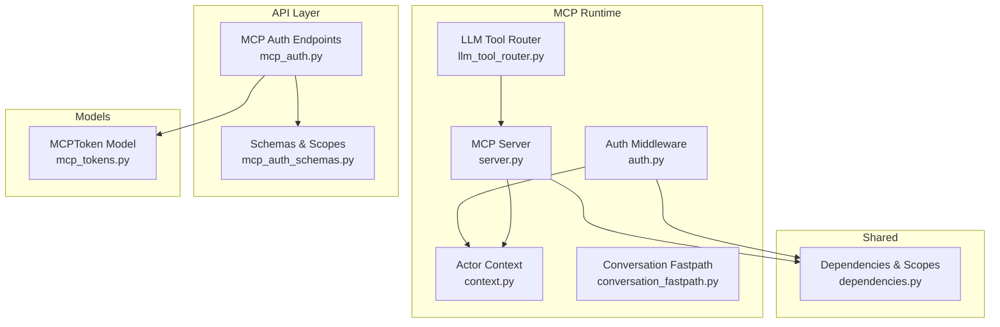

**Diagram sources**
- [server.py:110-280](file://server/app/mcp/server.py#L110-L280)
- [auth.py:16-157](file://server/app/mcp/auth.py#L16-L157)
- [context.py:8-38](file://server/app/mcp/context.py#L8-L38)
- [llm_tool_router.py:173-366](file://server/app/agent_runtime/llm_tool_router.py#L173-L366)
- [conversation_fastpath.py:32-45](file://server/app/agent_runtime/conversation_fastpath.py#L32-L45)
- [mcp_auth.py:93-339](file://server/app/api/endpoints/mcp_auth.py#L93-L339)
- [mcp_tokens.py:10-84](file://server/app/models/mcp_tokens.py#L10-L84)
- [mcp_auth_schemas.py:15-212](file://server/app/schemas/mcp_auth.py#L15-L212)
- [dependencies.py:58-129](file://server/app/api/dependencies.py#L58-L129)

**Section sources**
- [server.py:110-280](file://server/app/mcp/server.py#L110-L280)
- [auth.py:16-157](file://server/app/mcp/auth.py#L16-L157)
- [context.py:8-38](file://server/app/mcp/context.py#L8-L38)
- [llm_tool_router.py:173-366](file://server/app/agent_runtime/llm_tool_router.py#L173-L366)
- [conversation_fastpath.py:32-45](file://server/app/agent_runtime/conversation_fastpath.py#L32-L45)
- [mcp_auth.py:93-339](file://server/app/api/endpoints/mcp_auth.py#L93-L339)
- [mcp_tokens.py:10-84](file://server/app/models/mcp_tokens.py#L10-L84)
- [mcp_auth_schemas.py:15-212](file://server/app/schemas/mcp_auth.py#L15-L212)
- [dependencies.py:58-129](file://server/app/api/dependencies.py#L58-L129)

## Core Components
- MCP Server: registers MCP resources, prompts, and tools; enforces scope checks per operation; exposes typed tool outputs and annotations
- MCP Auth Middleware: validates Bearer tokens, checks allowed origins, resolves effective scopes, and injects actor context
- Actor Context: thread-local context carrying user, workspace, role, patient/caregiver linkage, and effective scopes
- MCP Token Management: creates short-lived tokens with narrow scopes, tracks usage, supports revocation and audits
- LLM Tool Router: builds role-specific tool catalogs, proposes safe plans, auto-executes read-only tools, and requests confirmation for writes
- Conversation Fastpath: detects small talk and avoids planning overhead

**Section sources**
- [server.py:113-128](file://server/app/mcp/server.py#L113-L128)
- [auth.py:16-157](file://server/app/mcp/auth.py#L16-L157)
- [context.py:8-38](file://server/app/mcp/context.py#L8-L38)
- [mcp_auth.py:93-179](file://server/app/api/endpoints/mcp_auth.py#L93-L179)
- [mcp_tokens.py:10-84](file://server/app/models/mcp_tokens.py#L10-L84)
- [llm_tool_router.py:37-52](file://server/app/agent_runtime/llm_tool_router.py#L37-L52)
- [conversation_fastpath.py:32-45](file://server/app/agent_runtime/conversation_fastpath.py#L32-L45)

## Architecture Overview
The MCP runtime integrates with the WheelSense backend via a FastMCP server, protected by an authentication middleware that validates tokens and enforces scope-based authorization. Tools and prompts are registered centrally and invoked with strict permission checks. The LLM tool router augments natural-language turns with MCP tool calls while preserving safety and transparency.

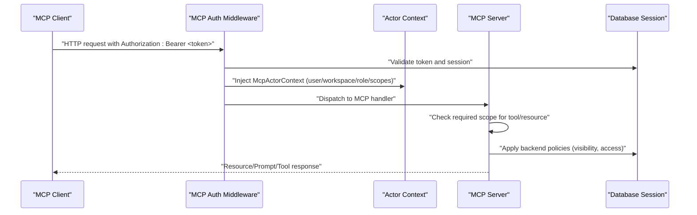

**Diagram sources**
- [auth.py:30-142](file://server/app/mcp/auth.py#L30-L142)
- [context.py:24-38](file://server/app/mcp/context.py#L24-L38)
- [server.py:113-128](file://server/app/mcp/server.py#L113-L128)

## Detailed Component Analysis

### MCP Server Implementation
The MCP server initializes a FastMCP instance and registers:
- Resources: current user context, visible patients, active alerts, rooms catalog
- Prompts: role-specific playbooks for admin operations, clinical triage, observer shift, patient support, device control, facility operations
- Tools: read-only and write tools for patients, alerts, devices, rooms, workflow, and camera control

Scope enforcement is centralized via a helper that raises permission errors when required scopes are missing. Actor context is accessed to enforce workspace and role boundaries.

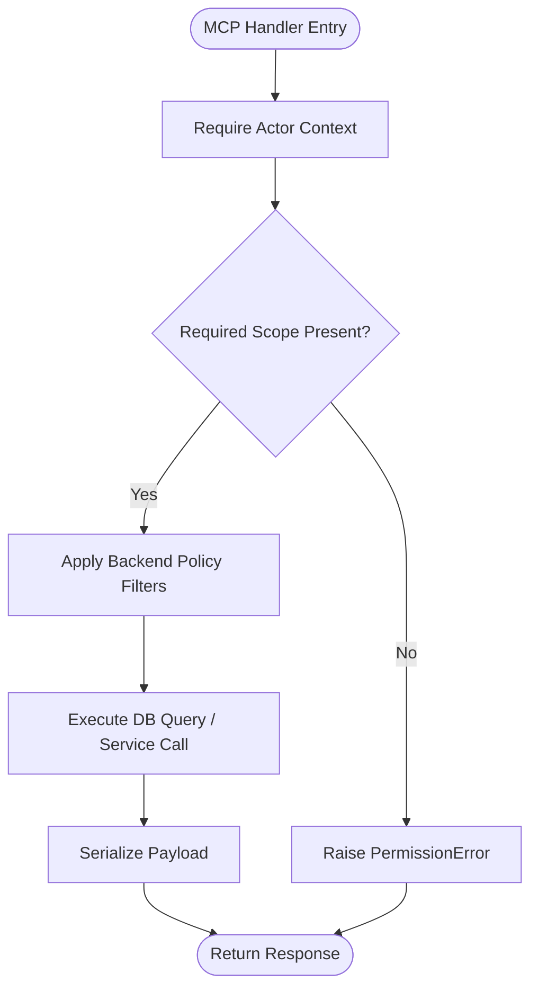

**Diagram sources**
- [server.py:113-128](file://server/app/mcp/server.py#L113-L128)
- [server.py:135-161](file://server/app/mcp/server.py#L135-L161)
- [server.py:366-385](file://server/app/mcp/server.py#L366-L385)

**Section sources**
- [server.py:179-281](file://server/app/mcp/server.py#L179-L281)
- [server.py:283-706](file://server/app/mcp/server.py#L283-L706)
- [server.py:113-128](file://server/app/mcp/server.py#L113-L128)

### Authentication and Scope-Based Authorization
The MCP auth middleware:
- Validates Origin headers against configured allowed origins
- Requires Bearer tokens and decodes JWTs
- Supports MCP tokens with revocation and expiration checks
- Resolves effective scopes from role and token claims
- Injects McpActorContext for downstream handlers

Token validation distinguishes MCP tokens (with mcp flag and mcp_tid) from regular session tokens. Effective scopes are computed using role-based allowances intersected with requested scopes.

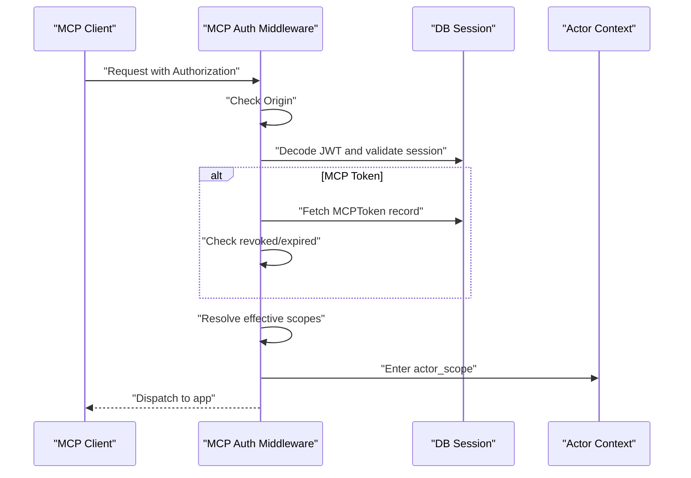

**Diagram sources**
- [auth.py:30-142](file://server/app/mcp/auth.py#L30-L142)
- [mcp_auth.py:155-165](file://server/app/api/endpoints/mcp_auth.py#L155-L165)
- [mcp_tokens.py:59-84](file://server/app/models/mcp_tokens.py#L59-L84)

**Section sources**
- [auth.py:16-157](file://server/app/mcp/auth.py#L16-L157)
- [mcp_auth.py:93-179](file://server/app/api/endpoints/mcp_auth.py#L93-L179)
- [mcp_tokens.py:10-84](file://server/app/models/mcp_tokens.py#L10-L84)
- [dependencies.py:123-129](file://server/app/api/dependencies.py#L123-L129)

### MCP Context System
Actor context encapsulates:
- user_id, workspace_id, role
- patient_id and caregiver_id (when applicable)
- scopes (effective set derived from role and token)

A context manager ensures the actor context is available to all MCP handlers and raises an error if missing.

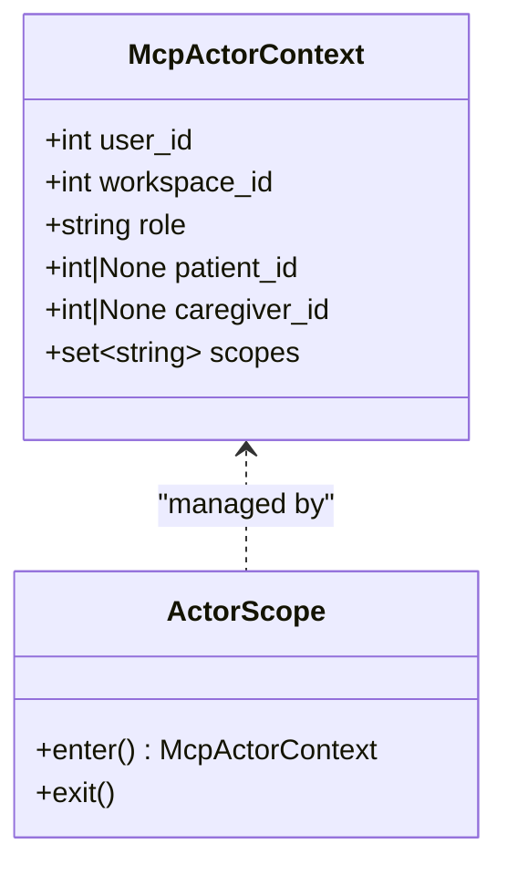

**Diagram sources**
- [context.py:8-38](file://server/app/mcp/context.py#L8-L38)

**Section sources**
- [context.py:8-38](file://server/app/mcp/context.py#L8-L38)

### LLM Tool Router for Secure Tool Execution
The router:
- Builds a role-specific tool catalog from the workspace tool registry
- Generates OpenAI-style tool schemas from MCP tool signatures
- Routes user messages to appropriate tools using provider-specific completion APIs
- Auto-executes read-only tools when safe and sole selections
- Constructs execution plans for write operations requiring confirmation
- Assigns risk levels and permission basis per step

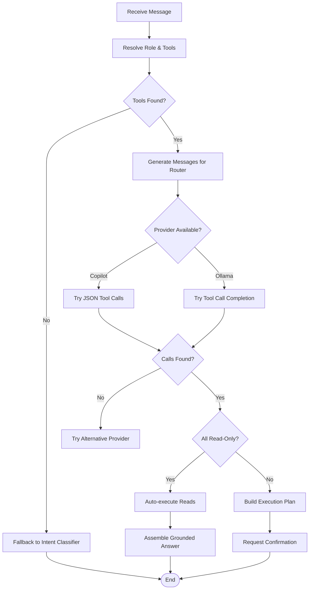

**Diagram sources**
- [llm_tool_router.py:84-92](file://server/app/agent_runtime/llm_tool_router.py#L84-L92)
- [llm_tool_router.py:173-366](file://server/app/agent_runtime/llm_tool_router.py#L173-L366)

**Section sources**
- [llm_tool_router.py:37-52](file://server/app/agent_runtime/llm_tool_router.py#L37-L52)
- [llm_tool_router.py:173-366](file://server/app/agent_runtime/llm_tool_router.py#L173-L366)

### MCP Context System for Workspace Scoping and Roles
The MCP server enforces workspace scoping and role-based access:
- Current user resource and workspace listing restrict to the actor’s workspace
- Patient and alert operations apply visibility filters based on role and access grants
- Room and device operations respect role permissions and, for patients, device assignment visibility

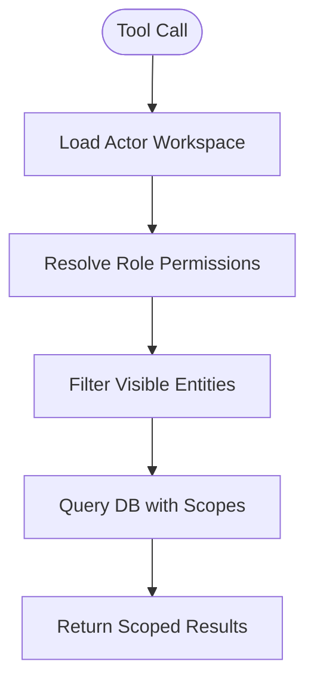

**Diagram sources**
- [server.py:327-335](file://server/app/mcp/server.py#L327-L335)
- [server.py:366-385](file://server/app/mcp/server.py#L366-L385)
- [server.py:521-544](file://server/app/mcp/server.py#L521-L544)

**Section sources**
- [server.py:327-335](file://server/app/mcp/server.py#L327-L335)
- [server.py:366-385](file://server/app/mcp/server.py#L366-L385)
- [server.py:521-544](file://server/app/mcp/server.py#L521-L544)

### Tool Registry and Metadata
The MCP server maintains a registry of workspace tools. Each tool:
- Has a name, description, and structured output
- Carries annotations indicating read-only, destructive, idempotent, and open-world hints
- Enforces scope requirements before execution
- Returns payloads aligned with the tool’s declared schema

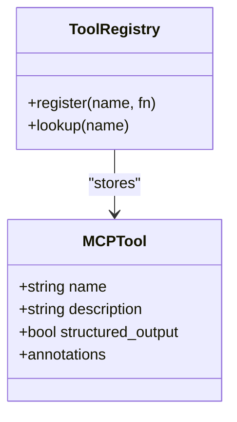

**Diagram sources**
- [server.py:283-706](file://server/app/mcp/server.py#L283-L706)

**Section sources**
- [server.py:283-706](file://server/app/mcp/server.py#L283-L706)

### Conversation Fastpath Handling
The fastpath heuristic:
- Detects small talk patterns and language cues
- Avoids invoking MCP or planning when the message is purely conversational
- Prevents accidental data access or mutations for non-domain queries

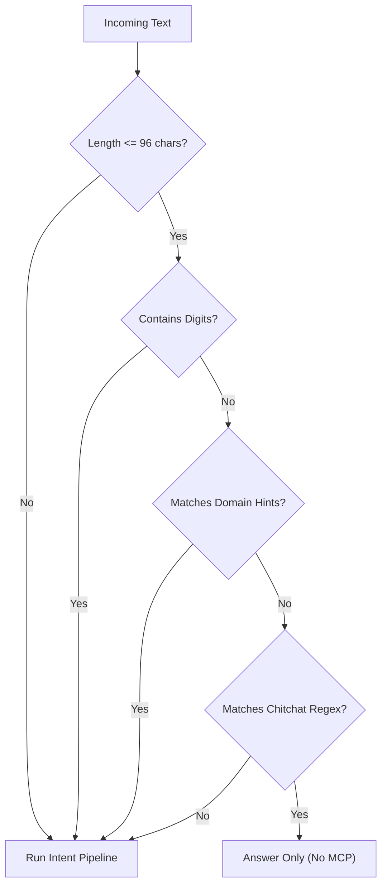

**Diagram sources**
- [conversation_fastpath.py:32-45](file://server/app/agent_runtime/conversation_fastpath.py#L32-L45)

**Section sources**
- [conversation_fastpath.py:32-45](file://server/app/agent_runtime/conversation_fastpath.py#L32-L45)

### MCP Token Management
Endpoints for MCP tokens:
- Create: issues short-lived tokens with validated and narrowed scopes, linked to the current auth session
- List: enumerates tokens with active/inactive status
- Revoke: supports per-token and bulk revocation
- Retrieve: allows viewing token details with role-based access

Tokens carry:
- client_name and client_origin
- scopes (space-separated)
- lifecycle fields (created_at, updated_at, expires_at, revoked_at, last_used_at)
- is_active property for quick checks

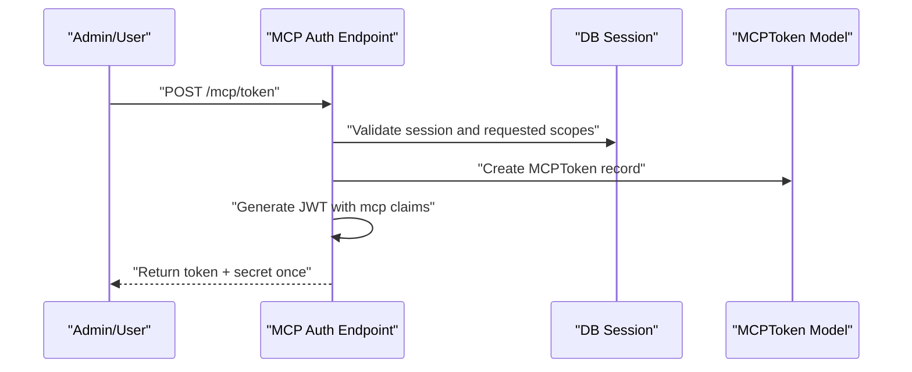

**Diagram sources**
- [mcp_auth.py:93-179](file://server/app/api/endpoints/mcp_auth.py#L93-L179)
- [mcp_tokens.py:10-84](file://server/app/models/mcp_tokens.py#L10-L84)

**Section sources**
- [mcp_auth.py:93-179](file://server/app/api/endpoints/mcp_auth.py#L93-L179)
- [mcp_auth.py:181-226](file://server/app/api/endpoints/mcp_auth.py#L181-L226)
- [mcp_auth.py:229-265](file://server/app/api/endpoints/mcp_auth.py#L229-L265)
- [mcp_auth.py:268-305](file://server/app/api/endpoints/mcp_auth.py#L268-L305)
- [mcp_auth.py:308-339](file://server/app/api/endpoints/mcp_auth.py#L308-L339)
- [mcp_tokens.py:10-84](file://server/app/models/mcp_tokens.py#L10-L84)

### Practical Examples

- Developing an MCP tool
  - Register a tool with a descriptive name and annotations
  - Enforce scope checks at the start of the handler
  - Apply backend visibility and access controls before mutating data
  - Return a structured payload aligned with the tool’s schema

- Authentication flows
  - Obtain an MCP token via the MCP auth endpoint with requested scopes
  - Use the token in Authorization headers for MCP requests
  - Ensure the client origin matches allowed origins

- Secure execution patterns
  - Prefer read-only tools for quick lookups
  - For write operations, construct a plan and request confirmation
  - Log and audit sensitive tool usage

[No sources needed since this section provides general guidance]

## Dependency Analysis
The MCP runtime relies on:
- FastMCP for server scaffolding and resource/tool registration
- SQLAlchemy sessions for scoped database access
- JWT decoding and session validation for authentication
- Role-based scope maps and MCP scope constants for authorization
- ContextVars for actor-scoped request context

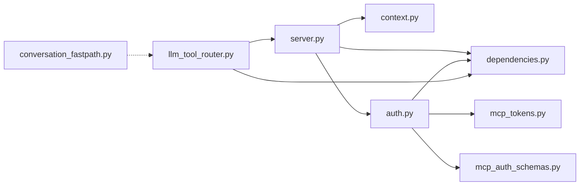

**Diagram sources**
- [server.py:19-105](file://server/app/mcp/server.py#L19-L105)
- [dependencies.py:58-129](file://server/app/api/dependencies.py#L58-L129)
- [context.py:8-38](file://server/app/mcp/context.py#L8-L38)
- [auth.py:16-157](file://server/app/mcp/auth.py#L16-L157)
- [mcp_tokens.py:10-84](file://server/app/models/mcp_tokens.py#L10-L84)
- [mcp_auth_schemas.py:15-212](file://server/app/schemas/mcp_auth.py#L15-L212)
- [llm_tool_router.py:16-32](file://server/app/agent_runtime/llm_tool_router.py#L16-L32)
- [conversation_fastpath.py:32-45](file://server/app/agent_runtime/conversation_fastpath.py#L32-L45)

**Section sources**
- [server.py:19-105](file://server/app/mcp/server.py#L19-L105)
- [dependencies.py:58-129](file://server/app/api/dependencies.py#L58-L129)
- [auth.py:16-157](file://server/app/mcp/auth.py#L16-L157)
- [mcp_tokens.py:10-84](file://server/app/models/mcp_tokens.py#L10-L84)
- [mcp_auth_schemas.py:15-212](file://server/app/schemas/mcp_auth.py#L15-L212)
- [llm_tool_router.py:16-32](file://server/app/agent_runtime/llm_tool_router.py#L16-L32)
- [conversation_fastpath.py:32-45](file://server/app/agent_runtime/conversation_fastpath.py#L32-L45)

## Performance Considerations
- Keep MCP tools focused and scoped to minimize database round trips
- Use read-only tools for frequent lookups; batch reads when possible
- Leverage the fastpath to avoid unnecessary planning for small talk
- Cache frequently accessed metadata (e.g., workspace catalogs) at the MCP layer when safe
- Monitor token usage and prune inactive tokens regularly

[No sources needed since this section provides general guidance]

## Troubleshooting Guide
Common issues and resolutions:
- Authentication failures
  - Verify the Authorization header uses Bearer tokens
  - Confirm the client origin is allowed
  - Ensure the token is not expired or revoked

- Scope errors
  - Check that the token includes the required scopes
  - Confirm role-based allowances align with requested scopes

- Permission errors
  - Ensure tools enforce required scopes before executing
  - Validate visibility filters for patients, alerts, and rooms

- Debugging tools
  - Inspect actor context in handlers to confirm user/workspace/role/scopes
  - Log tool calls and responses for auditing
  - Use the fastpath detection to confirm whether planning was skipped

**Section sources**
- [auth.py:30-142](file://server/app/mcp/auth.py#L30-L142)
- [server.py:113-128](file://server/app/mcp/server.py#L113-L128)
- [context.py:33-38](file://server/app/mcp/context.py#L33-L38)

## Conclusion
The WheelSense MCP integration provides a secure, role-aware runtime for AI tools. It enforces scope-based authorization, offers robust authentication with MCP tokens, and includes an LLM router that balances automation with safety. The MCP context system ensures workspace scoping and role alignment, while the fastpath optimizes conversational flows. Together, these components enable reliable, auditable AI interactions across clinical and administrative domains.

[No sources needed since this section summarizes without analyzing specific files]

## Appendices

### MCP Scope Reference
- patients.read, patients.write
- alerts.read, alerts.manage
- devices.read, devices.manage, devices.command
- rooms.read, rooms.manage
- room_controls.use
- workflow.read, workflow.write
- cameras.capture
- ai_settings.read, ai_settings.write
- admin.audit.read
- workspace.read

**Section sources**
- [mcp_auth_schemas.py:15-52](file://server/app/schemas/mcp_auth.py#L15-L52)