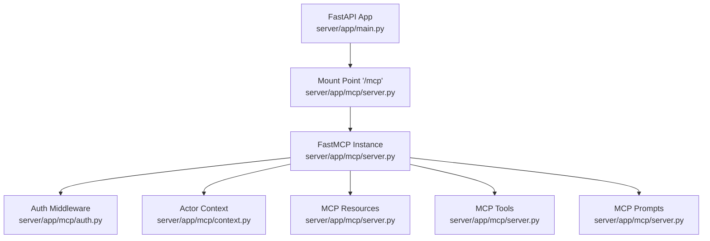
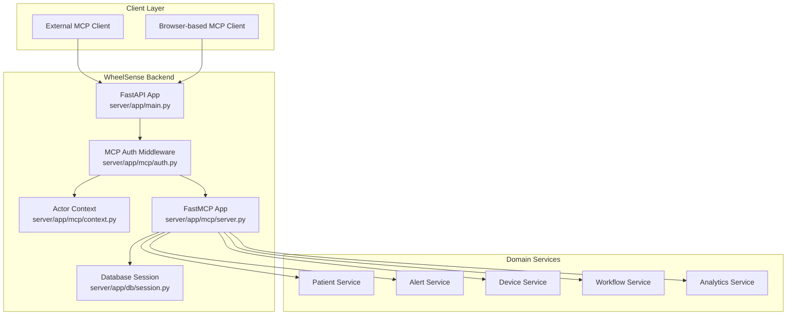
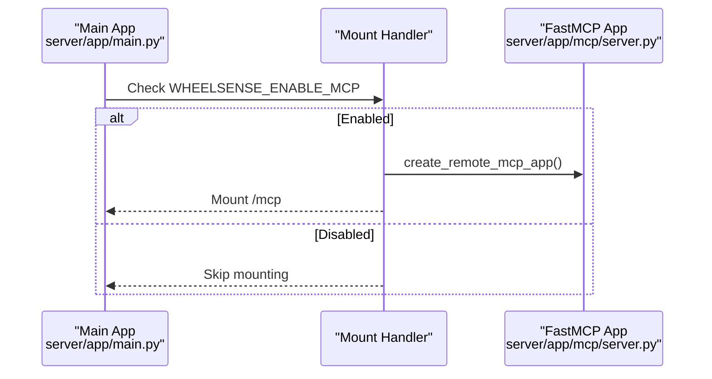
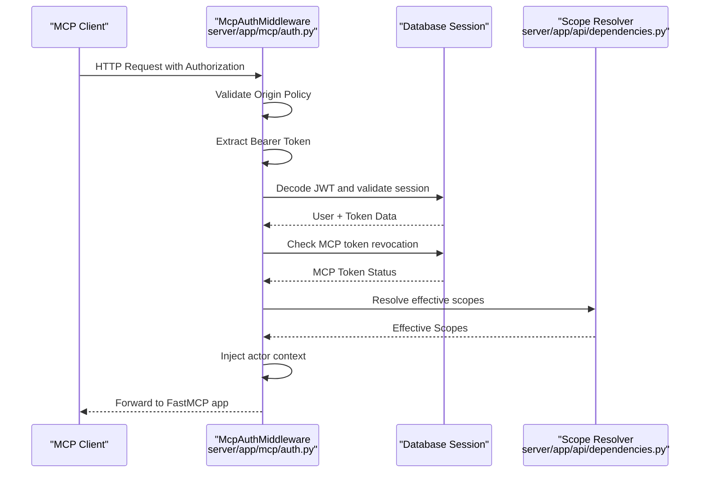
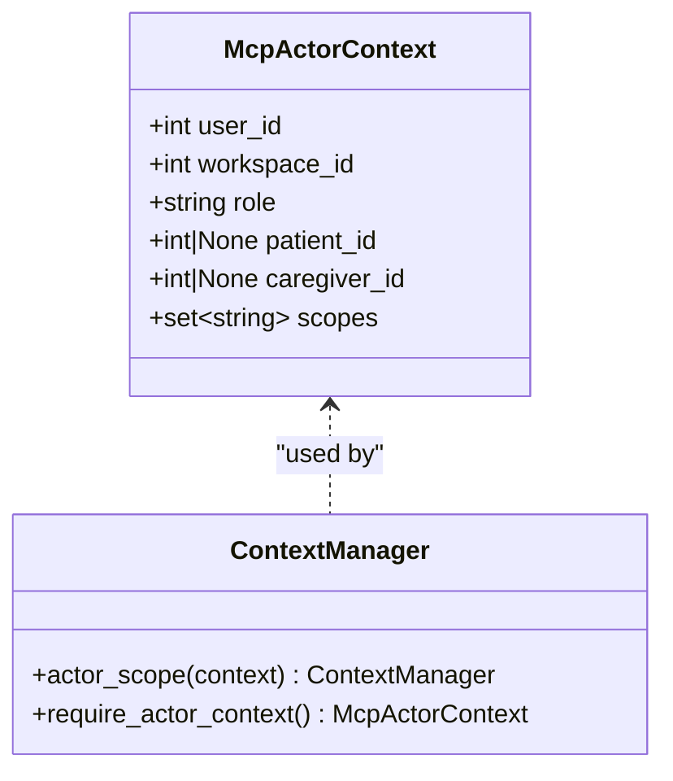
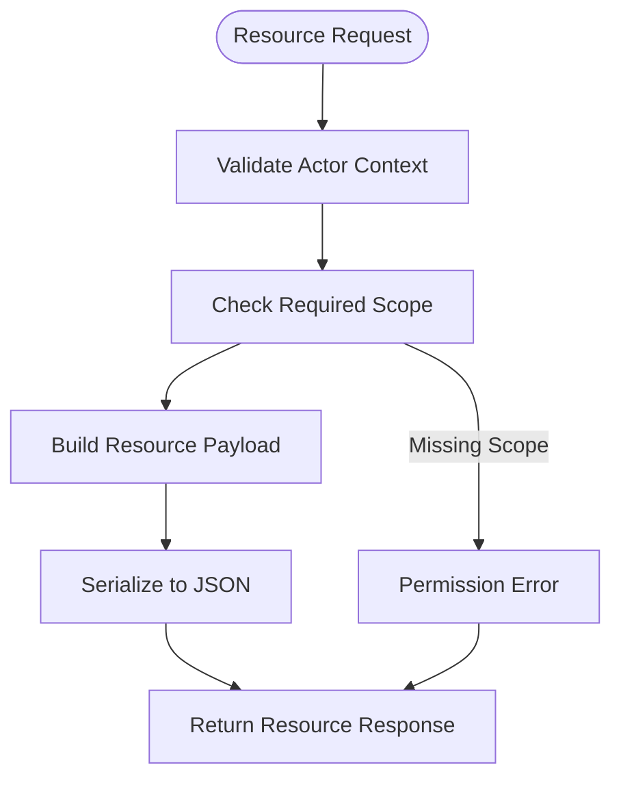
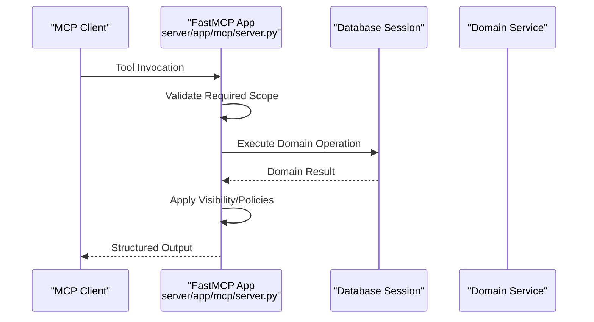
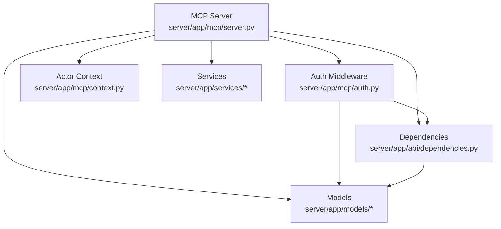

# MCP Server Implementation

<cite>
**Referenced Files in This Document**
- [server.py](file://server/app/mcp/server.py)
- [context.py](file://server/app/mcp/context.py)
- [auth.py](file://server/app/mcp/auth.py)
- [mcp_auth.py](file://server/app/api/endpoints/mcp_auth.py)
- [mcp_auth_schemas.py](file://server/app/schemas/mcp_auth.py)
- [mcp_tokens.py](file://server/app/models/mcp_tokens.py)
- [dependencies.py](file://server/app/api/dependencies.py)
- [main.py](file://server/app/main.py)
- [config.py](file://server/app/config.py)
- [MCP-README.md](file://docs/MCP-README.md)
- [ARCHITECTURE.md](file://ARCHITECTURE.md)
</cite>

## Table of Contents
1. [Introduction](#introduction)
2. [Project Structure](#project-structure)
3. [Core Components](#core-components)
4. [Architecture Overview](#architecture-overview)
5. [Detailed Component Analysis](#detailed-component-analysis)
6. [Dependency Analysis](#dependency-analysis)
7. [Performance Considerations](#performance-considerations)
8. [Troubleshooting Guide](#troubleshooting-guide)
9. [Conclusion](#conclusion)
10. [Appendices](#appendices)

## Introduction
This document provides comprehensive documentation for the WheelSense MCP (Model Context Protocol) server implementation. It covers FastMCP server initialization, resource definitions, and tool registration patterns. It explains the MCP context system including actor context requirements, workspace scoping, and role-based access control. It documents the authentication wrapper implementation with token validation and scope resolution. It details the MCP resource system for data exposure including patient catalogs, alert lists, and facility mappings. It documents MCP tool registration with structured output schemas, permission annotations, and error handling patterns. Practical examples demonstrate implementing custom MCP tools, context validation, and secure data access patterns. Finally, it addresses MCP server configuration, logging, and debugging approaches for development and production environments.

## Project Structure
The MCP server is implemented as a FastMCP application mounted under `/mcp` in the main FastAPI application. The implementation is organized into three primary modules:
- server.py: Defines the FastMCP application instance, resources, prompts, and tools
- auth.py: Implements the MCP authentication middleware and token validation
- context.py: Provides the actor context management using contextvars

**Diagram sources**
- [main.py:117-122](file://server/app/main.py#L117-L122)
- [server.py:110-111](file://server/app/mcp/server.py#L110-L111)
- [auth.py:16-29](file://server/app/mcp/auth.py#L16-L29)
- [context.py:8-21](file://server/app/mcp/context.py#L8-L21)

**Section sources**
- [main.py:117-122](file://server/app/main.py#L117-L122)
- [server.py:110-111](file://server/app/mcp/server.py#L110-L111)
- [auth.py:16-29](file://server/app/mcp/auth.py#L16-L29)
- [context.py:8-21](file://server/app/mcp/context.py#L8-L21)

## Core Components
This section outlines the core building blocks of the MCP server implementation.

- FastMCP Application Initialization
  - The MCP server initializes a FastMCP instance named "WheelSense" and registers resources, prompts, and tools.
  - The application is mounted under the "/mcp" path in the main FastAPI application.

- Authentication Wrapper
  - The McpAuthMiddleware validates origin policies, extracts Bearer tokens, decodes JWTs, and enforces MCP token revocation checks.
  - It resolves effective scopes from either MCP tokens or session tokens and injects the actor context into the request lifecycle.

- Actor Context Management
  - The McpActorContext stores user identity, workspace scope, role, linked patient/caregiver IDs, and effective scopes.
  - The actor_scope context manager sets and resets the contextvar for each request.

- Resource Definitions
  - Resources expose live data via wheelsense:// URIs:
    - Current user context
    - Visible patients
    - Active alerts
    - Rooms catalog

- Prompt Definitions
  - Six role-safe playbooks guide AI assistants:
    - Admin operations
    - Clinical triage
    - Observer shift assistant
    - Patient support
    - Device control
    - Facility operations

- Tool Registration Patterns
  - Tools are registered with structured output schemas, permission annotations, and scope enforcement.
  - Tools implement workspace scoping, visibility policies, and domain-specific validations.

**Section sources**
- [server.py:110-111](file://server/app/mcp/server.py#L110-L111)
- [server.py:179-281](file://server/app/mcp/server.py#L179-L281)
- [auth.py:16-157](file://server/app/mcp/auth.py#L16-L157)
- [context.py:8-37](file://server/app/mcp/context.py#L8-L37)
- [MCP-README.md:36-79](file://docs/MCP-README.md#L36-L79)

## Architecture Overview
The MCP server architecture integrates tightly with the WheelSense backend to provide secure, scope-based access to workspace data and operations.

**Diagram sources**
- [main.py:117-122](file://server/app/main.py#L117-L122)
- [auth.py:16-157](file://server/app/mcp/auth.py#L16-L157)
- [context.py:8-37](file://server/app/mcp/context.py#L8-L37)
- [server.py:110-111](file://server/app/mcp/server.py#L110-L111)

**Section sources**
- [main.py:117-122](file://server/app/main.py#L117-L122)
- [auth.py:16-157](file://server/app/mcp/auth.py#L16-L157)
- [context.py:8-37](file://server/app/mcp/context.py#L8-L37)
- [server.py:110-111](file://server/app/mcp/server.py#L110-L111)

## Detailed Component Analysis

### FastMCP Server Initialization
The MCP server initializes a FastMCP instance and mounts it under "/mcp". The server is conditionally enabled via environment variable and integrates with the main FastAPI application.

**Diagram sources**
- [main.py:24-25](file://server/app/main.py#L24-L25)
- [main.py:117-122](file://server/app/main.py#L117-L122)

**Section sources**
- [main.py:24-25](file://server/app/main.py#L24-L25)
- [main.py:117-122](file://server/app/main.py#L117-L122)

### Authentication Wrapper Implementation
The McpAuthMiddleware enforces origin validation, Bearer token authentication, and MCP token revocation checks. It resolves effective scopes and injects actor context.

**Diagram sources**
- [auth.py:30-142](file://server/app/mcp/auth.py#L30-L142)
- [dependencies.py:58-120](file://server/app/api/dependencies.py#L58-L120)
- [mcp_auth.py:94-178](file://server/app/api/endpoints/mcp_auth.py#L94-L178)

**Section sources**
- [auth.py:16-157](file://server/app/mcp/auth.py#L16-L157)
- [dependencies.py:58-120](file://server/app/api/dependencies.py#L58-L120)
- [mcp_auth.py:94-178](file://server/app/api/endpoints/mcp_auth.py#L94-L178)

### MCP Context System
The actor context system manages authenticated user identity, workspace scope, role, and effective scopes using contextvars. It ensures that every MCP operation runs within the correct context.

**Diagram sources**
- [context.py:8-37](file://server/app/mcp/context.py#L8-L37)

**Section sources**
- [context.py:8-37](file://server/app/mcp/context.py#L8-L37)

### MCP Resource System
The MCP resource system exposes live data feeds via wheelsense:// URIs. Resources are registered with metadata and MIME types.

**Diagram sources**
- [server.py:179-221](file://server/app/mcp/server.py#L179-L221)

**Section sources**
- [server.py:179-221](file://server/app/mcp/server.py#L179-L221)

### MCP Tool Registration Patterns
Tools are registered with structured output schemas, permission annotations, and scope enforcement. Each tool validates actor context, applies workspace scoping, and performs domain-specific validations.

**Diagram sources**
- [server.py:283-312](file://server/app/mcp/server.py#L283-L312)
- [server.py:354-385](file://server/app/mcp/server.py#L354-L385)

**Section sources**
- [server.py:283-312](file://server/app/mcp/server.py#L283-L312)
- [server.py:354-385](file://server/app/mcp/server.py#L354-L385)

### Practical Examples

#### Implementing a Custom MCP Tool
To implement a custom MCP tool:
1. Define tool metadata with annotations (title, readOnlyHint, destructiveHint, idempotentHint, openWorldHint)
2. Register the tool with the FastMCP instance
3. Implement scope checks using _require_scope
4. Apply workspace scoping and visibility policies
5. Return structured output

Example pattern reference:
- Tool registration with annotations: [server.py:283-296](file://server/app/mcp/server.py#L283-L296)
- Scope enforcement: [server.py:113-117](file://server/app/mcp/server.py#L113-L117)
- Workspace scoping: [server.py:367-371](file://server/app/mcp/server.py#L367-L371)

#### Context Validation and Secure Data Access
Secure data access patterns include:
- Actor context validation using require_actor_context
- Scope-based access control with _require_scope
- Visibility policy enforcement via get_visible_patient_ids
- Workspace-scoped database queries

Example pattern reference:
- Actor context requirement: [server.py:113-128](file://server/app/mcp/server.py#L113-L128)
- Visibility policy: [dependencies.py:328-351](file://server/app/api/dependencies.py#L328-L351)
- Workspace scoping: [server.py:135-161](file://server/app/mcp/server.py#L135-L161)

**Section sources**
- [server.py:113-128](file://server/app/mcp/server.py#L113-L128)
- [server.py:283-296](file://server/app/mcp/server.py#L283-L296)
- [dependencies.py:328-351](file://server/app/api/dependencies.py#L328-L351)

## Dependency Analysis
The MCP server depends on several backend components for authentication, authorization, and domain operations.

**Diagram sources**
- [server.py:1-106](file://server/app/mcp/server.py#L1-L106)
- [auth.py:1-28](file://server/app/mcp/auth.py#L1-L28)
- [dependencies.py:1-22](file://server/app/api/dependencies.py#L1-L22)

**Section sources**
- [server.py:1-106](file://server/app/mcp/server.py#L1-L106)
- [auth.py:1-28](file://server/app/mcp/auth.py#L1-L28)
- [dependencies.py:1-22](file://server/app/api/dependencies.py#L1-L22)

## Performance Considerations
- Asynchronous database operations: All MCP tools use async database sessions to avoid blocking I/O.
- Efficient query construction: Tools construct targeted queries with workspace scoping and visibility filters.
- Minimal serialization overhead: Tools return structured JSON payloads with minimal transformation.
- Caching opportunities: Consider caching frequently accessed metadata (e.g., facility layouts) where appropriate.
- Connection pooling: Database connections are managed via SQLAlchemy async session factory.

## Troubleshooting Guide
Common issues and resolutions:
- Authentication failures:
  - Verify Bearer token format and expiration
  - Check MCP token revocation status
  - Confirm origin validation settings
- Scope errors:
  - Validate requested scopes against role permissions
  - Ensure effective scopes are properly resolved
- Context errors:
  - Confirm actor context is injected by middleware
  - Verify workspace_id and role alignment
- Database connectivity:
  - Check async session configuration
  - Monitor connection pool exhaustion

Error handling patterns:
- Permission errors with descriptive messages
- HTTP status codes aligned with MCP specification
- WWW-Authenticate headers for 401 responses

**Section sources**
- [auth.py:30-142](file://server/app/mcp/auth.py#L30-L142)
- [server.py:113-117](file://server/app/mcp/server.py#L113-L117)
- [MCP-README.md:371-399](file://docs/MCP-README.md#L371-L399)

## Conclusion
The WheelSense MCP server implementation provides a robust, secure, and extensible foundation for AI-assisted operations in healthcare environments. It leverages FastMCP for standardized protocol compliance, implements comprehensive role-based access control, and ensures workspace-scoped data access. The modular design facilitates easy extension with custom tools and resources while maintaining strong security boundaries.

## Appendices

### MCP Server Configuration
Environment variables and settings:
- WHEELSENSE_ENABLE_MCP: Controls MCP server mounting
- mcp_allowed_origins: Allowed client origins for MCP access
- mcp_require_origin: Enforces origin validation
- Database and MQTT settings for integrated operations

**Section sources**
- [main.py:24-25](file://server/app/main.py#L24-L25)
- [config.py:76-77](file://server/app/config.py#L76-L77)
- [config.py:105-110](file://server/app/config.py#L105-L110)

### Logging and Debugging
- Centralized logging configuration in main application
- MCP-specific logger "wheelsense.mcp" for server logs
- Debug mode support via settings.debug
- Production-ready logging with structured formatting

**Section sources**
- [main.py:18-23](file://server/app/main.py#L18-L23)
- [server.py:107-108](file://server/app/mcp/server.py#L107-L108)

### MCP Token Management
External MCP clients can obtain scope-narrowed tokens:
- Create MCP tokens with requested scopes
- List and revoke MCP tokens
- Token lifecycle management with expiry and revocation tracking

**Section sources**
- [mcp_auth.py:94-178](file://server/app/api/endpoints/mcp_auth.py#L94-L178)
- [mcp_tokens.py:10-84](file://server/app/models/mcp_tokens.py#L10-L84)
- [mcp_auth_schemas.py:140-212](file://server/app/schemas/mcp_auth.py#L140-L212)