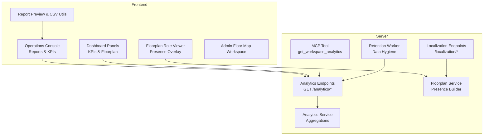
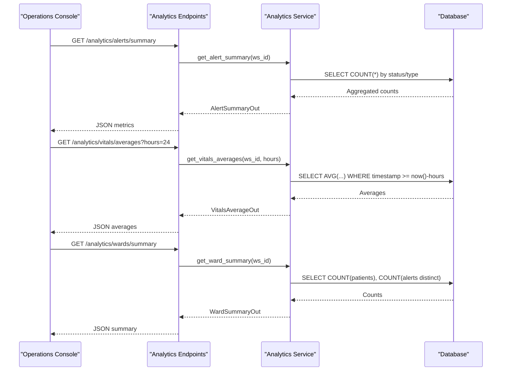
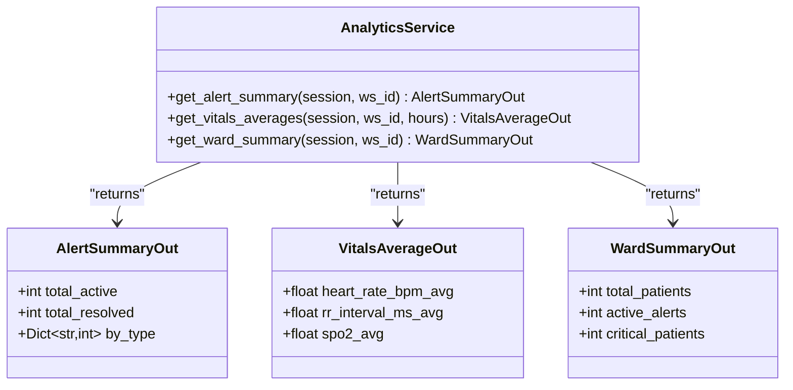
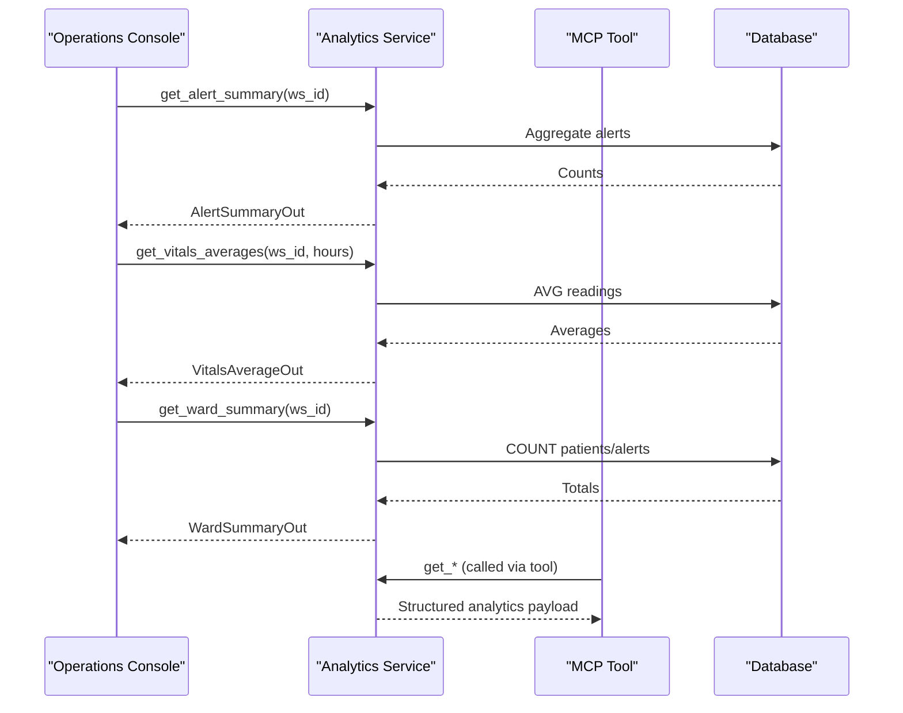
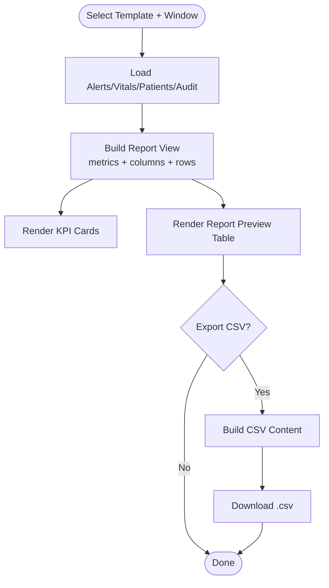
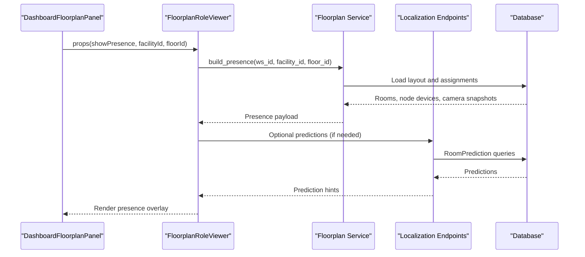
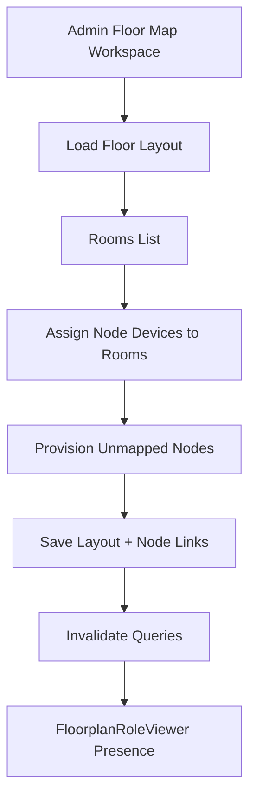
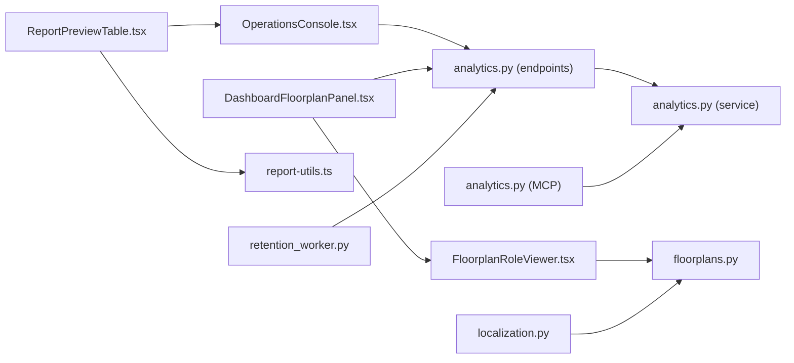

# Analytics & Reporting

<cite>
**Referenced Files in This Document**
- [analytics.py](file://server/app/services/analytics.py)
- [analytics.py](file://server/app/schemas/analytics.py)
- [analytics.py](file://server/app/api/endpoints/analytics.py)
- [analytics.py](file://server/app/mcp/server.py)
- [OperationsConsole.tsx](file://frontend/components/workflow/OperationsConsole.tsx)
- [ReportPreviewTable.tsx](file://frontend/components/reports/ReportPreviewTable.tsx)
- [report-utils.ts](file://frontend/components/reports/report-utils.ts)
- [KPIStatCard.tsx](file://frontend/components/dashboard/KPIStatCard.tsx)
- [DashboardFloorplanPanel.tsx](file://frontend/components/dashboard/DashboardFloorplanPanel.tsx)
- [FloorplanRoleViewer.tsx](file://frontend/components/floorplan/FloorplanRoleViewer.tsx)
- [floorplans.py](file://server/app/services/floorplans.py)
- [localization.py](file://server/app/api/endpoints/localization.py)
- [retention_worker.py](file://server/app/workers/retention_worker.py)
- [FloorMapWorkspace.tsx](file://frontend/components/admin/monitoring/FloorMapWorkspace.tsx)
- [RoomDetailDrawer.tsx](file://frontend/components/admin/monitoring/RoomDetailDrawer.tsx)
- [RoomSmartDevicesPanel.tsx](file://frontend/components/admin/monitoring/RoomSmartDevicesPanel.tsx)
- [FacilityFloorToolbar.tsx](file://frontend/components/admin/monitoring/FacilityFloorToolbar.tsx)
- [patientMetrics.ts](file://frontend/lib/patientMetrics.ts)
</cite>

## Table of Contents
1. [Introduction](#introduction)
2. [Project Structure](#project-structure)
3. [Core Components](#core-components)
4. [Architecture Overview](#architecture-overview)
5. [Detailed Component Analysis](#detailed-component-analysis)
6. [Dependency Analysis](#dependency-analysis)
7. [Performance Considerations](#performance-considerations)
8. [Troubleshooting Guide](#troubleshooting-guide)
9. [Conclusion](#conclusion)
10. [Appendices](#appendices)

## Introduction
This document describes the WheelSense Platform’s analytics and reporting capabilities. It covers real-time metrics and KPI generation for patient monitoring, device utilization, and workflow performance. It also documents floorplan visualization for room mapping, presence detection, and monitoring dashboards; interactive reporting features including customizable templates, CSV exports, and automated distribution; analytics data models and aggregation strategies; and performance optimization and operational hygiene. Privacy, security, and compliance considerations are addressed alongside practical examples of dashboard customization and report generation.

## Project Structure
The analytics and reporting system spans backend services and frontend components:
- Backend analytics endpoints expose alert summaries, vitals averages, and ward summaries.
- Frontend dashboards and reporting panels render KPI cards, presence overlays, and report tables.
- Floorplan services integrate presence projections and device links to rooms.
- Localization endpoints support room prediction and projection workflows.
- Workers manage data retention to keep datasets efficient and compliant.

**Diagram sources**
- [analytics.py:17-47](file://server/app/api/endpoints/analytics.py#L17-L47)
- [analytics.py:16-91](file://server/app/services/analytics.py#L16-L91)
- [analytics.py:1159-1197](file://server/app/mcp/server.py#L1159-L1197)
- [floorplans.py:42-61](file://server/app/services/floorplans.py#L42-L61)
- [localization.py:191-230](file://server/app/api/endpoints/localization.py#L191-L230)
- [retention_worker.py:42-87](file://server/app/workers/retention_worker.py#L42-L87)
- [OperationsConsole.tsx:2450-2556](file://frontend/components/workflow/OperationsConsole.tsx#L2450-L2556)
- [DashboardFloorplanPanel.tsx:1-30](file://frontend/components/dashboard/DashboardFloorplanPanel.tsx#L1-L30)
- [ReportPreviewTable.tsx:22-66](file://frontend/components/reports/ReportPreviewTable.tsx#L22-L66)
- [report-utils.ts:21-52](file://frontend/components/reports/report-utils.ts#L21-L52)
- [FloorplanRoleViewer.tsx:42-246](file://frontend/components/floorplan/FloorplanRoleViewer.tsx#L42-L246)

**Section sources**
- [analytics.py:17-47](file://server/app/api/endpoints/analytics.py#L17-L47)
- [analytics.py:16-91](file://server/app/services/analytics.py#L16-L91)
- [OperationsConsole.tsx:2450-2556](file://frontend/components/workflow/OperationsConsole.tsx#L2450-L2556)
- [DashboardFloorplanPanel.tsx:1-30](file://frontend/components/dashboard/DashboardFloorplanPanel.tsx#L1-L30)
- [ReportPreviewTable.tsx:22-66](file://frontend/components/reports/ReportPreviewTable.tsx#L22-L66)
- [report-utils.ts:21-52](file://frontend/components/reports/report-utils.ts#L21-L52)
- [FloorplanRoleViewer.tsx:42-246](file://frontend/components/floorplan/FloorplanRoleViewer.tsx#L42-L246)

## Core Components
- Analytics endpoints: Provide alert summaries, vitals averages, and ward summaries for role-scoped access.
- Analytics service: Implements SQL-based aggregations for counts, averages, and grouped metrics.
- MCP tool: Exposes a structured analytics summary for AI-assisted workflows.
- Reporting UI: Offers predefined report templates, KPI cards, and CSV export utilities.
- Floorplan presence: Builds room occupancy and device-linked presence overlays.
- Localization endpoints: Train and predict room assignments from RSSI vectors.
- Retention worker: Periodically prunes old telemetry to maintain performance and storage hygiene.

**Section sources**
- [analytics.py:17-47](file://server/app/api/endpoints/analytics.py#L17-L47)
- [analytics.py:16-91](file://server/app/services/analytics.py#L16-L91)
- [analytics.py:1159-1197](file://server/app/mcp/server.py#L1159-L1197)
- [OperationsConsole.tsx:731-761](file://frontend/components/workflow/OperationsConsole.tsx#L731-L761)
- [KPIStatCard.tsx:1-104](file://frontend/components/dashboard/KPIStatCard.tsx#L1-L104)
- [report-utils.ts:21-52](file://frontend/components/reports/report-utils.ts#L21-L52)
- [floorplans.py:42-61](file://server/app/services/floorplans.py#L42-L61)
- [localization.py:191-230](file://server/app/api/endpoints/localization.py#L191-L230)
- [retention_worker.py:42-87](file://server/app/workers/retention_worker.py#L42-L87)

## Architecture Overview
The analytics pipeline integrates frontend dashboards and reporting with backend services and models. Real-time presence feeds and vitals streams inform KPIs and reports. Predictive localization augments presence when live signals are unavailable. Retention policies ensure long-term sustainability.

**Diagram sources**
- [analytics.py:17-47](file://server/app/api/endpoints/analytics.py#L17-L47)
- [analytics.py:16-91](file://server/app/services/analytics.py#L16-L91)

## Detailed Component Analysis

### Analytics Data Models and Aggregation Strategies
- AlertSummaryOut: Total active and resolved alerts, plus counts by alert type.
- VitalsAverageOut: Averages for heart rate, RR interval, and SpO2 over a rolling window.
- WardSummaryOut: Total patients, active alerts, and placeholder for critical counts.

Aggregation strategies:
- Count distinct active alerts per workspace.
- Group counts by alert type for prioritization.
- Rolling averages over configurable windows for vitals.
- Patient and alert counts for ward-level KPIs.

**Diagram sources**
- [analytics.py:8-25](file://server/app/schemas/analytics.py#L8-L25)
- [analytics.py:16-91](file://server/app/services/analytics.py#L16-L91)

**Section sources**
- [analytics.py:8-25](file://server/app/schemas/analytics.py#L8-L25)
- [analytics.py:16-91](file://server/app/services/analytics.py#L16-L91)

### Real-Time Metrics and KPI Generation
- KPIStatCard renders value, label, optional trend percentage, and status tones.
- Operations Console builds report views from multiple domains (alerts, vitals, handovers, audits) and displays KPIs and tables.
- MCP tool get_workspace_analytics consolidates alert, vitals, and ward summaries for AI workflows.

**Diagram sources**
- [analytics.py:16-91](file://server/app/services/analytics.py#L16-L91)
- [analytics.py:1159-1197](file://server/app/mcp/server.py#L1159-L1197)
- [OperationsConsole.tsx:2529-2556](file://frontend/components/workflow/OperationsConsole.tsx#L2529-L2556)

**Section sources**
- [KPIStatCard.tsx:1-104](file://frontend/components/dashboard/KPIStatCard.tsx#L1-L104)
- [OperationsConsole.tsx:2529-2556](file://frontend/components/workflow/OperationsConsole.tsx#L2529-L2556)
- [analytics.py:1159-1197](file://server/app/mcp/server.py#L1159-L1197)

### Trend Analysis and Forecasting Capabilities
- Trending percentages are computed in the reporting builder and displayed in KPI cards.
- Forecasting is not implemented in the current codebase; present capabilities focus on rolling averages and presence projections.

Practical usage:
- Use the vitals averaging endpoint with different hours windows to compare trends.
- Presence projections from localization augment occupancy when live signals are missing.

**Section sources**
- [OperationsConsole.tsx:342-381](file://frontend/components/workflow/OperationsConsole.tsx#L342-L381)
- [localization.py:191-230](file://server/app/api/endpoints/localization.py#L191-L230)

### Customizable Reporting Features
- Report templates: Ward overview, alert summary, vitals window, handover notes, workflow audit.
- Report preview table supports dynamic columns and rows with empty-state handling.
- CSV export utilities: Build CSV content and download filenames derived from template labels and time windows.

**Diagram sources**
- [OperationsConsole.tsx:731-761](file://frontend/components/workflow/OperationsConsole.tsx#L731-L761)
- [OperationsConsole.tsx:365-761](file://frontend/components/workflow/OperationsConsole.tsx#L365-L761)
- [ReportPreviewTable.tsx:22-66](file://frontend/components/reports/ReportPreviewTable.tsx#L22-L66)
- [report-utils.ts:21-52](file://frontend/components/reports/report-utils.ts#L21-L52)

**Section sources**
- [OperationsConsole.tsx:731-761](file://frontend/components/workflow/OperationsConsole.tsx#L731-L761)
- [OperationsConsole.tsx:365-761](file://frontend/components/workflow/OperationsConsole.tsx#L365-L761)
- [ReportPreviewTable.tsx:22-66](file://frontend/components/reports/ReportPreviewTable.tsx#L22-L66)
- [report-utils.ts:21-52](file://frontend/components/reports/report-utils.ts#L21-L52)

### Floorplan Visualization System
- DashboardFloorplanPanel embeds FloorplanRoleViewer to display presence overlays.
- FloorplanRoleViewer computes room metadata, occupancy counts, and device/camera summaries.
- Services build presence from layout and live or predicted assignments.

**Diagram sources**
- [DashboardFloorplanPanel.tsx:1-30](file://frontend/components/dashboard/DashboardFloorplanPanel.tsx#L1-L30)
- [FloorplanRoleViewer.tsx:42-246](file://frontend/components/floorplan/FloorplanRoleViewer.tsx#L42-L246)
- [floorplans.py:42-61](file://server/app/services/floorplans.py#L42-L61)
- [localization.py:191-230](file://server/app/api/endpoints/localization.py#L191-L230)

**Section sources**
- [DashboardFloorplanPanel.tsx:1-30](file://frontend/components/dashboard/DashboardFloorplanPanel.tsx#L1-L30)
- [FloorplanRoleViewer.tsx:42-246](file://frontend/components/floorplan/FloorplanRoleViewer.tsx#L42-L246)
- [floorplans.py:42-61](file://server/app/services/floorplans.py#L42-L61)
- [localization.py:191-230](file://server/app/api/endpoints/localization.py#L191-L230)

### Device Utilization Reports and Room Mapping
- Admin Floor Map Workspace manages floor layouts, assigns node devices to rooms, and provisions unmapped nodes.
- RoomDetailDrawer and RoomSmartDevicesPanel manage room attributes and Home Assistant device integrations.

**Diagram sources**
- [FloorMapWorkspace.tsx:355-441](file://frontend/components/admin/monitoring/FloorMapWorkspace.tsx#L355-L441)
- [RoomDetailDrawer.tsx:20-88](file://frontend/components/admin/monitoring/RoomDetailDrawer.tsx#L20-L88)
- [RoomSmartDevicesPanel.tsx:16-174](file://frontend/components/admin/monitoring/RoomSmartDevicesPanel.tsx#L16-L174)

**Section sources**
- [FloorMapWorkspace.tsx:355-441](file://frontend/components/admin/monitoring/FloorMapWorkspace.tsx#L355-L441)
- [RoomDetailDrawer.tsx:20-88](file://frontend/components/admin/monitoring/RoomDetailDrawer.tsx#L20-L88)
- [RoomSmartDevicesPanel.tsx:16-174](file://frontend/components/admin/monitoring/RoomSmartDevicesPanel.tsx#L16-L174)

### Dashboard Components and Interactive Charts
- KPIStatCard renders status-colored cards with trend indicators.
- ReportPreviewTable provides a responsive table for report rows with formatted cells.
- FacilityFloorToolbar toggles between list and map views for monitoring.

Note: Interactive chart libraries are present in the frontend lockfile; however, explicit chart components are not shown in the referenced files. The KPI and table components serve as building blocks for dashboards.

**Section sources**
- [KPIStatCard.tsx:1-104](file://frontend/components/dashboard/KPIStatCard.tsx#L1-L104)
- [ReportPreviewTable.tsx:22-66](file://frontend/components/reports/ReportPreviewTable.tsx#L22-L66)
- [FacilityFloorToolbar.tsx:1-118](file://frontend/components/admin/monitoring/FacilityFloorToolbar.tsx#L1-L118)

### Data Export Capabilities
- CSV export: Build CSV from columns and rows, escape cells, and download with a generated filename.
- Filename template: Wheelsense label slug combined with window hours.

**Section sources**
- [report-utils.ts:21-52](file://frontend/components/reports/report-utils.ts#L21-L52)

### Analytics Data Models and Aggregation Strategies
- AlertSummaryOut aggregates counts and groups by type.
- VitalsAverageOut computes averages over a rolling window.
- WardSummaryOut counts patients and active alerts.

**Section sources**
- [analytics.py:8-25](file://server/app/schemas/analytics.py#L8-L25)
- [analytics.py:16-91](file://server/app/services/analytics.py#L16-L91)

### Performance Optimization
- Retention worker periodically deletes old IMU, RSSI, and prediction records to control dataset size.
- Query defaults for polling and staleness reduce unnecessary network load.
- Presence building filters and sorts predictions to show the most recent and confident assignments.

**Section sources**
- [retention_worker.py:42-87](file://server/app/workers/retention_worker.py#L42-L87)
- [FloorMapWorkspace.tsx:7-12](file://frontend/components/admin/monitoring/FloorMapWorkspace.tsx#L7-L12)
- [floorplans.py:395-419](file://server/app/services/floorplans.py#L395-L419)

## Dependency Analysis
The analytics system exhibits clean separation of concerns:
- Endpoints depend on the AnalyticsService for computation.
- The MCP tool depends on the AnalyticsService for structured outputs.
- Frontend components depend on endpoints and utilities for rendering and exporting.
- Floorplan presence depends on layout and prediction services.

**Diagram sources**
- [OperationsConsole.tsx:2450-2556](file://frontend/components/workflow/OperationsConsole.tsx#L2450-L2556)
- [DashboardFloorplanPanel.tsx:1-30](file://frontend/components/dashboard/DashboardFloorplanPanel.tsx#L1-L30)
- [ReportPreviewTable.tsx:22-66](file://frontend/components/reports/ReportPreviewTable.tsx#L22-L66)
- [report-utils.ts:21-52](file://frontend/components/reports/report-utils.ts#L21-L52)
- [FloorplanRoleViewer.tsx:42-246](file://frontend/components/floorplan/FloorplanRoleViewer.tsx#L42-L246)
- [analytics.py:17-47](file://server/app/api/endpoints/analytics.py#L17-L47)
- [analytics.py:16-91](file://server/app/services/analytics.py#L16-L91)
- [analytics.py:1159-1197](file://server/app/mcp/server.py#L1159-L1197)
- [floorplans.py:42-61](file://server/app/services/floorplans.py#L42-L61)
- [localization.py:191-230](file://server/app/api/endpoints/localization.py#L191-L230)
- [retention_worker.py:42-87](file://server/app/workers/retention_worker.py#L42-L87)

**Section sources**
- [OperationsConsole.tsx:2450-2556](file://frontend/components/workflow/OperationsConsole.tsx#L2450-L2556)
- [analytics.py:17-47](file://server/app/api/endpoints/analytics.py#L17-L47)
- [analytics.py:16-91](file://server/app/services/analytics.py#L16-L91)
- [analytics.py:1159-1197](file://server/app/mcp/server.py#L1159-L1197)
- [floorplans.py:42-61](file://server/app/services/floorplans.py#L42-L61)
- [localization.py:191-230](file://server/app/api/endpoints/localization.py#L191-L230)
- [retention_worker.py:42-87](file://server/app/workers/retention_worker.py#L42-L87)

## Performance Considerations
- Use appropriate hours windows for vitals averages to balance responsiveness and stability.
- Apply retention policies to prune historical telemetry and predictions.
- Prefer grouped and aggregated queries in AnalyticsService to minimize result size.
- Cache and debounce frequent UI updates in dashboards and reporting panels.

[No sources needed since this section provides general guidance]

## Troubleshooting Guide
Common issues and remedies:
- No vitals data returned: Verify the hours window and ensure recent entries exist.
- Empty presence overlay: Confirm floor layout rooms, node device assignments, and camera snapshots.
- CSV export yields unexpected formatting: Validate column keys and cell values via report-utils.
- Slow dashboard refreshes: Adjust query polling/stale times and enable caching where applicable.

**Section sources**
- [analytics.py:44-67](file://server/app/services/analytics.py#L44-L67)
- [FloorplanRoleViewer.tsx:223-246](file://frontend/components/floorplan/FloorplanRoleViewer.tsx#L223-L246)
- [report-utils.ts:11-31](file://frontend/components/reports/report-utils.ts#L11-L31)
- [FloorMapWorkspace.tsx:7-12](file://frontend/components/admin/monitoring/FloorMapWorkspace.tsx#L7-L12)

## Conclusion
WheelSense provides a robust foundation for analytics and reporting: real-time KPIs, customizable reports, floorplan presence, and operational hygiene through retention. While forecasting is not implemented, rolling averages and presence projections offer strong situational awareness. The modular design enables extension for advanced analytics and automated distribution.

[No sources needed since this section summarizes without analyzing specific files]

## Appendices

### Practical Examples
- Dashboard customization:
  - Use KPIStatCard to surface alert counts and vitals averages.
  - Toggle FacilityFloorToolbar between list and map views for different monitoring modes.
- Report generation:
  - Choose a template (e.g., alert summary, vitals window) and adjust the hours window.
  - Export to CSV for offline analysis or sharing.

**Section sources**
- [KPIStatCard.tsx:1-104](file://frontend/components/dashboard/KPIStatCard.tsx#L1-L104)
- [FacilityFloorToolbar.tsx:1-118](file://frontend/components/admin/monitoring/FacilityFloorToolbar.tsx#L1-L118)
- [OperationsConsole.tsx:731-761](file://frontend/components/workflow/OperationsConsole.tsx#L731-L761)
- [report-utils.ts:21-52](file://frontend/components/reports/report-utils.ts#L21-L52)

### Data Privacy, Security, and Compliance
- Access control: Analytics endpoints restrict roles to administrative and supervisory positions.
- Data retention: Automated cleanup reduces stored telemetry lifetimes to protect privacy and control costs.
- Secure export: CSV downloads occur client-side with no server-side persistence of report payloads.

**Section sources**
- [analytics.py:17-47](file://server/app/api/endpoints/analytics.py#L17-L47)
- [retention_worker.py:42-87](file://server/app/workers/retention_worker.py#L42-L87)