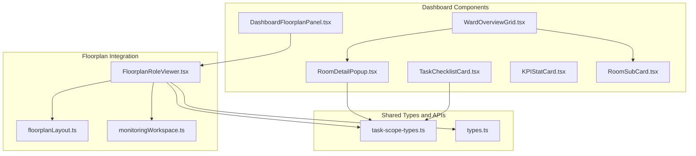
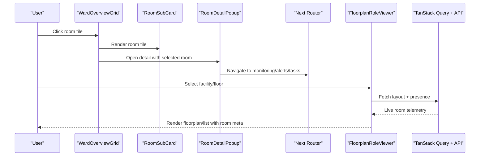
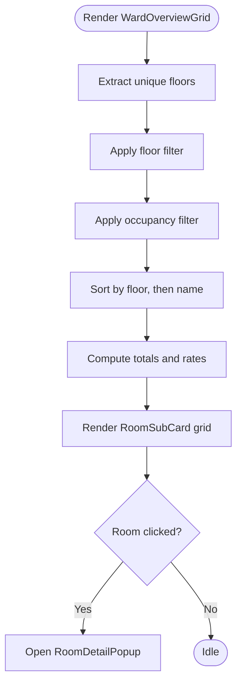
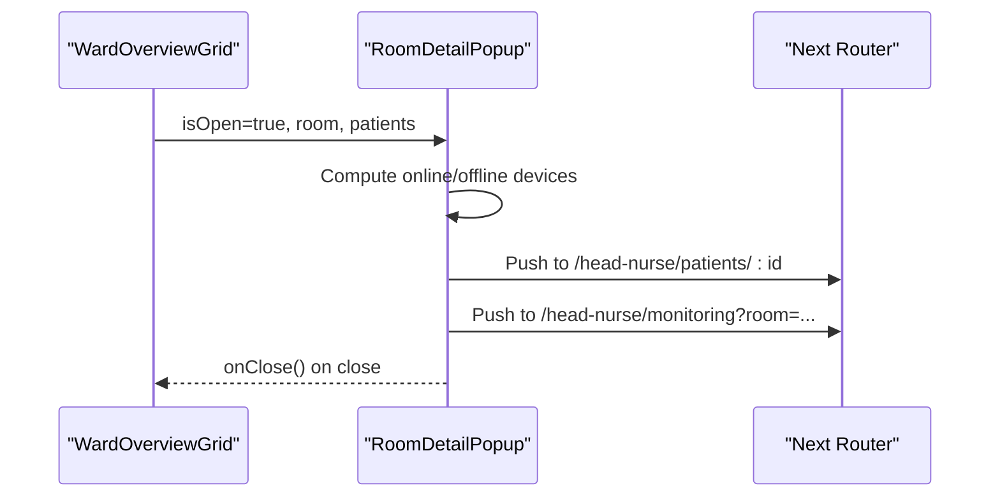
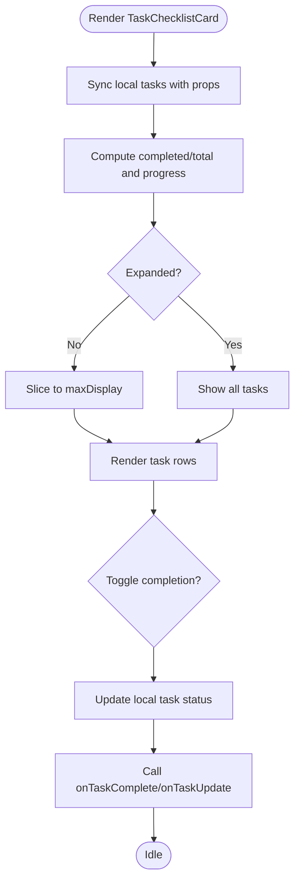
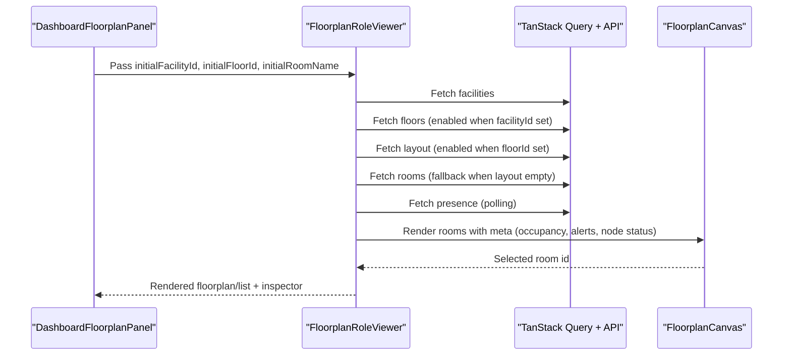
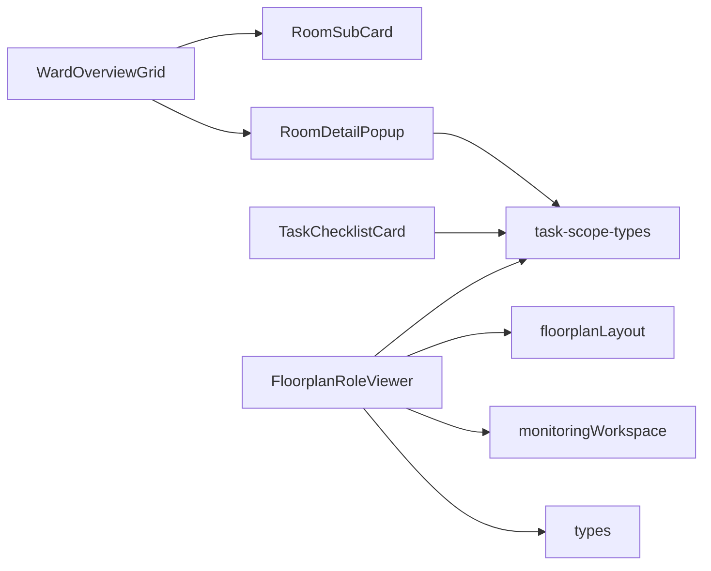

# Dashboard Components

<cite>
**Referenced Files in This Document**
- [WardOverviewGrid.tsx](file://frontend/components/dashboard/WardOverviewGrid.tsx)
- [RoomDetailPopup.tsx](file://frontend/components/dashboard/RoomDetailPopup.tsx)
- [TaskChecklistCard.tsx](file://frontend/components/dashboard/TaskChecklistCard.tsx)
- [KPIStatCard.tsx](file://frontend/components/dashboard/KPIStatCard.tsx)
- [DashboardFloorplanPanel.tsx](file://frontend/components/dashboard/DashboardFloorplanPanel.tsx)
- [RoomSubCard.tsx](file://frontend/components/dashboard/RoomSubCard.tsx)
- [FloorplanRoleViewer.tsx](file://frontend/components/floorplan/FloorplanRoleViewer.tsx)
- [monitoringWorkspace.ts](file://frontend/lib/monitoringWorkspace.ts)
- [task-scope-types.ts](file://frontend/lib/api/task-scope-types.ts)
- [types.ts](file://frontend/lib/types.ts)
- [floorplanLayout.ts](file://frontend/lib/floorplanLayout.ts)
- [page.tsx](file://frontend/app/head-nurse/monitoring/page.tsx)
</cite>

## Table of Contents
1. [Introduction](#introduction)
2. [Project Structure](#project-structure)
3. [Core Components](#core-components)
4. [Architecture Overview](#architecture-overview)
5. [Detailed Component Analysis](#detailed-component-analysis)
6. [Dependency Analysis](#dependency-analysis)
7. [Performance Considerations](#performance-considerations)
8. [Troubleshooting Guide](#troubleshooting-guide)
9. [Conclusion](#conclusion)
10. [Appendices](#appendices)

## Introduction
This document describes the WheelSense Platform’s dashboard components and visualization system. It focuses on the WardOverviewGrid, RoomDetailPopup, TaskChecklistCard, and KPIStatCard components, along with the monitoring workspace integration and floorplan role viewer. It explains real-time data binding, interactive chart implementations, responsive design patterns, component props/state/event handling, customization and configuration, performance optimization, accessibility, cross-browser compatibility, and integration with analytics and real-time data updates.

## Project Structure
The dashboard components reside under the frontend components dashboard and floorplan directories. They integrate with shared libraries for types, API contracts, floorplan layout normalization, and monitoring workspace URL parsing. The monitoring workspace utilities enable consistent navigation and filtering across roles.



**Diagram sources**
- [WardOverviewGrid.tsx:1-269](file://frontend/components/dashboard/WardOverviewGrid.tsx#L1-L269)
- [RoomDetailPopup.tsx:1-276](file://frontend/components/dashboard/RoomDetailPopup.tsx#L1-L276)
- [TaskChecklistCard.tsx:1-261](file://frontend/components/dashboard/TaskChecklistCard.tsx#L1-L261)
- [KPIStatCard.tsx:1-104](file://frontend/components/dashboard/KPIStatCard.tsx#L1-L104)
- [DashboardFloorplanPanel.tsx:1-30](file://frontend/components/dashboard/DashboardFloorplanPanel.tsx#L1-L30)
- [RoomSubCard.tsx:1-138](file://frontend/components/dashboard/RoomSubCard.tsx#L1-L138)
- [FloorplanRoleViewer.tsx:1-1143](file://frontend/components/floorplan/FloorplanRoleViewer.tsx#L1-L1143)
- [monitoringWorkspace.ts:1-146](file://frontend/lib/monitoringWorkspace.ts#L1-L146)
- [task-scope-types.ts:1-406](file://frontend/lib/api/task-scope-types.ts#L1-L406)
- [types.ts:1-482](file://frontend/lib/types.ts#L1-L482)
- [floorplanLayout.ts:1-103](file://frontend/lib/floorplanLayout.ts#L1-L103)

**Section sources**
- [WardOverviewGrid.tsx:1-269](file://frontend/components/dashboard/WardOverviewGrid.tsx#L1-L269)
- [RoomDetailPopup.tsx:1-276](file://frontend/components/dashboard/RoomDetailPopup.tsx#L1-L276)
- [TaskChecklistCard.tsx:1-261](file://frontend/components/dashboard/TaskChecklistCard.tsx#L1-L261)
- [KPIStatCard.tsx:1-104](file://frontend/components/dashboard/KPIStatCard.tsx#L1-L104)
- [DashboardFloorplanPanel.tsx:1-30](file://frontend/components/dashboard/DashboardFloorplanPanel.tsx#L1-L30)
- [RoomSubCard.tsx:1-138](file://frontend/components/dashboard/RoomSubCard.tsx#L1-L138)
- [FloorplanRoleViewer.tsx:1-1143](file://frontend/components/floorplan/FloorplanRoleViewer.tsx#L1-L1143)
- [monitoringWorkspace.ts:1-146](file://frontend/lib/monitoringWorkspace.ts#L1-L146)
- [task-scope-types.ts:1-406](file://frontend/lib/api/task-scope-types.ts#L1-L406)
- [types.ts:1-482](file://frontend/lib/types.ts#L1-L482)
- [floorplanLayout.ts:1-103](file://frontend/lib/floorplanLayout.ts#L1-L103)

## Core Components
- WardOverviewGrid: Renders an overview grid of rooms with filtering, sorting, occupancy stats, and a detail popup on selection.
- RoomDetailPopup: Presents a modal with quick stats, patient list, device status, and navigation actions for a selected room.
- TaskChecklistCard: Displays a prioritized and due-date-aware task list with completion toggles and expand/collapse behavior.
- KPIStatCard: A flexible stat card with optional trend indicator and status coloring for KPIs.
- DashboardFloorplanPanel: Wraps FloorplanRoleViewer for embedding a floorplan-based monitoring view in dashboards.
- RoomSubCard: A lightweight room tile used inside WardOverviewGrid.

**Section sources**
- [WardOverviewGrid.tsx:27-112](file://frontend/components/dashboard/WardOverviewGrid.tsx#L27-L112)
- [RoomDetailPopup.tsx:32-60](file://frontend/components/dashboard/RoomDetailPopup.tsx#L32-L60)
- [TaskChecklistCard.tsx:24-83](file://frontend/components/dashboard/TaskChecklistCard.tsx#L24-L83)
- [KPIStatCard.tsx:8-44](file://frontend/components/dashboard/KPIStatCard.tsx#L8-L44)
- [DashboardFloorplanPanel.tsx:5-29](file://frontend/components/dashboard/DashboardFloorplanPanel.tsx#L5-L29)
- [RoomSubCard.tsx:9-28](file://frontend/components/dashboard/RoomSubCard.tsx#L9-L28)

## Architecture Overview
The dashboard integrates React components with TanStack Query for real-time data fetching and caching. FloorplanRoleViewer orchestrates facility/floor selection, layout retrieval, and live presence feeds. Monitoring workspace utilities standardize URL parameters for facility, floor, room, and view mode.



**Diagram sources**
- [WardOverviewGrid.tsx:114-118](file://frontend/components/dashboard/WardOverviewGrid.tsx#L114-L118)
- [RoomDetailPopup.tsx:147-187](file://frontend/components/dashboard/RoomDetailPopup.tsx#L147-L187)
- [DashboardFloorplanPanel.tsx:13-28](file://frontend/components/dashboard/DashboardFloorplanPanel.tsx#L13-L28)
- [FloorplanRoleViewer.tsx:596-702](file://frontend/components/floorplan/FloorplanRoleViewer.tsx#L596-L702)

## Detailed Component Analysis

### WardOverviewGrid
- Purpose: Provides a responsive grid of rooms with occupancy stats, filters (floor, occupancy), and view modes (grid/compact).
- Props:
  - rooms: array of RoomWithPatients
  - onRoomClick: callback invoked on room selection
  - className: optional container class
  - showFilters: toggle filter controls visibility
- State:
  - selectedRoom: currently selected room for detail popup
  - viewMode: grid vs compact
  - activeFilter: occupancy filter
  - selectedFloor: floor filter
- Filtering and Sorting:
  - Applies floor filter, then occupancy filter, then sorts by floor and name.
- Stats Calculation:
  - Computes total patients, total capacity, occupancy rate, total alerts, available rooms.
- Interactions:
  - Opens RoomDetailPopup on room click.
  - Uses RoomSubCard for rendering tiles.



**Diagram sources**
- [WardOverviewGrid.tsx:49-91](file://frontend/components/dashboard/WardOverviewGrid.tsx#L49-L91)
- [WardOverviewGrid.tsx:94-112](file://frontend/components/dashboard/WardOverviewGrid.tsx#L94-L112)
- [WardOverviewGrid.tsx:240-255](file://frontend/components/dashboard/WardOverviewGrid.tsx#L240-L255)

**Section sources**
- [WardOverviewGrid.tsx:27-112](file://frontend/components/dashboard/WardOverviewGrid.tsx#L27-L112)
- [WardOverviewGrid.tsx:114-118](file://frontend/components/dashboard/WardOverviewGrid.tsx#L114-L118)
- [WardOverviewGrid.tsx:240-265](file://frontend/components/dashboard/WardOverviewGrid.tsx#L240-L265)

### RoomDetailPopup
- Purpose: Modal panel displaying room quick stats, patient list, device status, and action buttons.
- Props:
  - isOpen: controls visibility
  - onClose: handler to close
  - room: selected room metadata
  - patients: patient list for the room
  - devices: optional device list with status and battery
  - alertCount: optional active alert count
- Interactions:
  - Navigates to patient detail on click.
  - Routes to monitoring and alerts via links.
- Rendering:
  - Quick stats for patients and device connectivity.
  - Patient list with avatars and actions.
  - Device list with online/offline badges and battery indicators.



**Diagram sources**
- [RoomDetailPopup.tsx:53-60](file://frontend/components/dashboard/RoomDetailPopup.tsx#L53-L60)
- [RoomDetailPopup.tsx:147-187](file://frontend/components/dashboard/RoomDetailPopup.tsx#L147-L187)
- [RoomDetailPopup.tsx:257-269](file://frontend/components/dashboard/RoomDetailPopup.tsx#L257-L269)

**Section sources**
- [RoomDetailPopup.tsx:32-60](file://frontend/components/dashboard/RoomDetailPopup.tsx#L32-L60)
- [RoomDetailPopup.tsx:106-127](file://frontend/components/dashboard/RoomDetailPopup.tsx#L106-L127)
- [RoomDetailPopup.tsx:131-195](file://frontend/components/dashboard/RoomDetailPopup.tsx#L131-L195)
- [RoomDetailPopup.tsx:197-249](file://frontend/components/dashboard/RoomDetailPopup.tsx#L197-L249)
- [RoomDetailPopup.tsx:251-271](file://frontend/components/dashboard/RoomDetailPopup.tsx#L251-L271)

### TaskChecklistCard
- Purpose: Displays a prioritized and due-date-aware task list with completion toggles and expand/collapse.
- Props:
  - tasks: array of CareTaskOut
  - onTaskComplete: callback when a task completes
  - onTaskUpdate: callback with partial updates
  - className: optional container class
  - showHeader: toggle header with progress
  - maxDisplay: number of tasks to show initially
- Behavior:
  - Tracks local task state and syncs with incoming props.
  - Calculates completion progress and displays badge.
  - Expands to show all tasks when more than maxDisplay.
- Formatting:
  - Priority and status badges with icons.
  - Due time formatting with relative time thresholds.
  - Navigation to task detail on click.



**Diagram sources**
- [TaskChecklistCard.tsx:76-118](file://frontend/components/dashboard/TaskChecklistCard.tsx#L76-L118)
- [TaskChecklistCard.tsx:154-233](file://frontend/components/dashboard/TaskChecklistCard.tsx#L154-L233)

**Section sources**
- [TaskChecklistCard.tsx:24-83](file://frontend/components/dashboard/TaskChecklistCard.tsx#L24-L83)
- [TaskChecklistCard.tsx:47-74](file://frontend/components/dashboard/TaskChecklistCard.tsx#L47-L74)
- [TaskChecklistCard.tsx:100-118](file://frontend/components/dashboard/TaskChecklistCard.tsx#L100-L118)
- [TaskChecklistCard.tsx:154-233](file://frontend/components/dashboard/TaskChecklistCard.tsx#L154-L233)

### KPIStatCard
- Purpose: A reusable card for KPI metrics with optional trend and status coloring.
- Props:
  - value: metric value
  - label: metric label
  - trend: optional { value, direction, label }
  - icon: optional Lucide icon
  - status: good/warning/critical/neutral
  - onClick: optional click handler
  - className: optional container class
- Rendering:
  - Displays value, label, trend arrow/value/label, and optional icon with status color.

```mermaid
classDiagram
class KPIStatCard {
+value : string|number
+label : string
+trend? : {value : number, direction : "up"|"down", label? : string}
+icon? : LucideIcon
+status : "good"|"warning"|"critical"|"neutral"
+onClick?() : void
+render()
}
```

**Diagram sources**
- [KPIStatCard.tsx:8-44](file://frontend/components/dashboard/KPIStatCard.tsx#L8-L44)

**Section sources**
- [KPIStatCard.tsx:8-44](file://frontend/components/dashboard/KPIStatCard.tsx#L8-L44)
- [KPIStatCard.tsx:47-102](file://frontend/components/dashboard/KPIStatCard.tsx#L47-L102)

### DashboardFloorplanPanel and FloorplanRoleViewer
- DashboardFloorplanPanel: Thin wrapper exposing FloorplanRoleViewer with initial facility/floor/room parameters.
- FloorplanRoleViewer:
  - Manages facility/floor selection and room list.
  - Loads floorplan layout or bootstraps rooms from DB.
  - Fetches live presence with polling and window focus refetch.
  - Builds room metadata (occupancy, alerts, node status, predictions).
  - Integrates with Home Assistant devices and camera snapshots.
  - Supports list and floorplan view modes.
- Monitoring workspace integration:
  - Uses monitoringWorkspace utilities to parse and build URLs for facility/floor/room/view.



**Diagram sources**
- [DashboardFloorplanPanel.tsx:13-28](file://frontend/components/dashboard/DashboardFloorplanPanel.tsx#L13-L28)
- [FloorplanRoleViewer.tsx:567-702](file://frontend/components/floorplan/FloorplanRoleViewer.tsx#L567-L702)
- [monitoringWorkspace.ts:33-42](file://frontend/lib/monitoringWorkspace.ts#L33-L42)

**Section sources**
- [DashboardFloorplanPanel.tsx:5-29](file://frontend/components/dashboard/DashboardFloorplanPanel.tsx#L5-L29)
- [FloorplanRoleViewer.tsx:567-702](file://frontend/components/floorplan/FloorplanRoleViewer.tsx#L567-L702)
- [monitoringWorkspace.ts:33-42](file://frontend/lib/monitoringWorkspace.ts#L33-L42)
- [floorplanLayout.ts:55-72](file://frontend/lib/floorplanLayout.ts#L55-L72)

## Dependency Analysis
- WardOverviewGrid depends on RoomSubCard and RoomDetailPopup for rendering and interactions.
- RoomDetailPopup relies on task-scope types for patient data and uses Next Router for navigation.
- TaskChecklistCard consumes task-scope types and uses local state with callbacks for updates.
- FloorplanRoleViewer integrates with TanStack Query for facilities, floors, layout, rooms, presence, and HA devices.
- Monitoring workspace utilities provide URL parsing and building for consistent navigation.



**Diagram sources**
- [WardOverviewGrid.tsx:11-12](file://frontend/components/dashboard/WardOverviewGrid.tsx#L11-L12)
- [RoomDetailPopup.tsx:30](file://frontend/components/dashboard/RoomDetailPopup.tsx#L30)
- [TaskChecklistCard.tsx:22](file://frontend/components/dashboard/TaskChecklistCard.tsx#L22)
- [FloorplanRoleViewer.tsx:36-40](file://frontend/components/floorplan/FloorplanRoleViewer.tsx#L36-L40)
- [monitoringWorkspace.ts:1-146](file://frontend/lib/monitoringWorkspace.ts#L1-L146)
- [task-scope-types.ts:21-47](file://frontend/lib/api/task-scope-types.ts#L21-L47)
- [types.ts:209-224](file://frontend/lib/types.ts#L209-L224)
- [floorplanLayout.ts:1-103](file://frontend/lib/floorplanLayout.ts#L1-L103)

**Section sources**
- [WardOverviewGrid.tsx:11-12](file://frontend/components/dashboard/WardOverviewGrid.tsx#L11-L12)
- [RoomDetailPopup.tsx:30](file://frontend/components/dashboard/RoomDetailPopup.tsx#L30)
- [TaskChecklistCard.tsx:22](file://frontend/components/dashboard/TaskChecklistCard.tsx#L22)
- [FloorplanRoleViewer.tsx:36-40](file://frontend/components/floorplan/FloorplanRoleViewer.tsx#L36-L40)
- [monitoringWorkspace.ts:1-146](file://frontend/lib/monitoringWorkspace.ts#L1-L146)
- [task-scope-types.ts:21-47](file://frontend/lib/api/task-scope-types.ts#L21-L47)
- [types.ts:209-224](file://frontend/lib/types.ts#L209-L224)
- [floorplanLayout.ts:1-103](file://frontend/lib/floorplanLayout.ts#L1-L103)

## Performance Considerations
- Memoization:
  - WardOverviewGrid uses useMemo for filtered rooms, stats, and derived values to avoid unnecessary re-renders.
  - TaskChecklistCard memoizes displayed tasks and progress.
  - FloorplanRoleViewer memoizes room entries, presence meta, and computed counts.
- Polling and Staleness:
  - Presence and device queries use refetch intervals and stale times to balance freshness and bandwidth.
- Rendering:
  - Compact view in FloorplanRoleViewer reduces DOM and improves responsiveness.
  - Virtualization or pagination could be considered for very large room lists.
- Accessibility:
  - Use semantic HTML and ARIA where appropriate (e.g., SheetTitle for dialog).
  - Ensure keyboard navigation and focus management for modals and sheets.
- Cross-browser compatibility:
  - Use standardized CSS and avoid experimental APIs.
  - Test with polyfills if needed for older browsers.
- Mobile responsiveness:
  - Responsive grid classes and compact modes reduce cognitive load on small screens.
  - Touch-friendly targets for buttons and cards.

[No sources needed since this section provides general guidance]

## Troubleshooting Guide
- Room filters not applying:
  - Verify selectedFloor and activeFilter are controlled and updated via Tabs triggers.
- No rooms shown after filtering:
  - Check that filteredRooms length triggers empty state rendering.
- Task completion not reflected:
  - Ensure onTaskComplete and onTaskUpdate callbacks are passed and invoked on toggle.
- Presence not updating:
  - Confirm refetch interval and window focus/reconnect settings are active.
- Navigation issues:
  - Validate monitoring workspace query parsing and URL building utilities.

**Section sources**
- [WardOverviewGrid.tsx:159-219](file://frontend/components/dashboard/WardOverviewGrid.tsx#L159-L219)
- [TaskChecklistCard.tsx:100-118](file://frontend/components/dashboard/TaskChecklistCard.tsx#L100-L118)
- [FloorplanRoleViewer.tsx:695-702](file://frontend/components/floorplan/FloorplanRoleViewer.tsx#L695-L702)
- [monitoringWorkspace.ts:33-42](file://frontend/lib/monitoringWorkspace.ts#L33-L42)

## Conclusion
The WheelSense dashboard components form a cohesive, real-time monitoring system. WardOverviewGrid and RoomDetailPopup provide efficient room-centric views with filtering and navigation. TaskChecklistCard offers actionable insights into care tasks. KPIStatCard standardizes KPI presentation. FloorplanRoleViewer integrates floorplan visualization with live presence and device telemetry, leveraging TanStack Query for robust data management. Together, these components support responsive, accessible, and performant dashboards across roles.

[No sources needed since this section summarizes without analyzing specific files]

## Appendices

### Component Prop Reference
- WardOverviewGrid
  - rooms: RoomWithPatients[]
  - onRoomClick?: (room) => void
  - className?: string
  - showFilters?: boolean
- RoomDetailPopup
  - isOpen: boolean
  - onClose: () => void
  - room: { id, name, type?, floor?, facility? } | null
  - patients: PatientOut[]
  - devices?: { id, name, type, status, battery? }[]
  - alertCount?: number
- TaskChecklistCard
  - tasks: CareTaskOut[]
  - onTaskComplete?: (id) => void
  - onTaskUpdate?: (id, updates) => void
  - className?: string
  - showHeader?: boolean
  - maxDisplay?: number
- KPIStatCard
  - value: string|number
  - label: string
  - trend?: { value, direction, label? }
  - icon?: LucideIcon
  - status?: "good"|"warning"|"critical"|"neutral"
  - onClick?: () => void
  - className?: string
- DashboardFloorplanPanel
  - className?: string
  - showPresence?: boolean
  - initialFacilityId?: number|null
  - initialFloorId?: number|null
  - initialRoomName?: string|null

**Section sources**
- [WardOverviewGrid.tsx:27-42](file://frontend/components/dashboard/WardOverviewGrid.tsx#L27-L42)
- [RoomDetailPopup.tsx:32-60](file://frontend/components/dashboard/RoomDetailPopup.tsx#L32-L60)
- [TaskChecklistCard.tsx:24-83](file://frontend/components/dashboard/TaskChecklistCard.tsx#L24-L83)
- [KPIStatCard.tsx:8-20](file://frontend/components/dashboard/KPIStatCard.tsx#L8-L20)
- [DashboardFloorplanPanel.tsx:5-11](file://frontend/components/dashboard/DashboardFloorplanPanel.tsx#L5-L11)

### Real-time Data Binding and Analytics Integration
- TanStack Query manages polling, caching, and refetch on window focus/reconnect for presence and device data.
- Monitoring workspace utilities standardize URL parameters for facility, floor, room, and view mode.
- Analytics summaries (alerts, vitals averages, ward summary) are exposed via backend endpoints and can be integrated into dashboard widgets.

**Section sources**
- [FloorplanRoleViewer.tsx:596-702](file://frontend/components/floorplan/FloorplanRoleViewer.tsx#L596-L702)
- [monitoringWorkspace.ts:33-42](file://frontend/lib/monitoringWorkspace.ts#L33-L42)