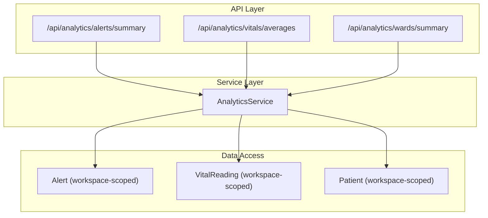
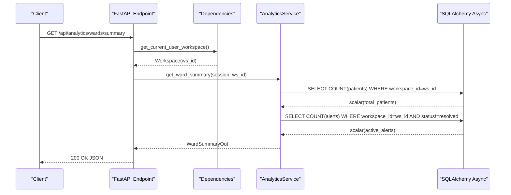
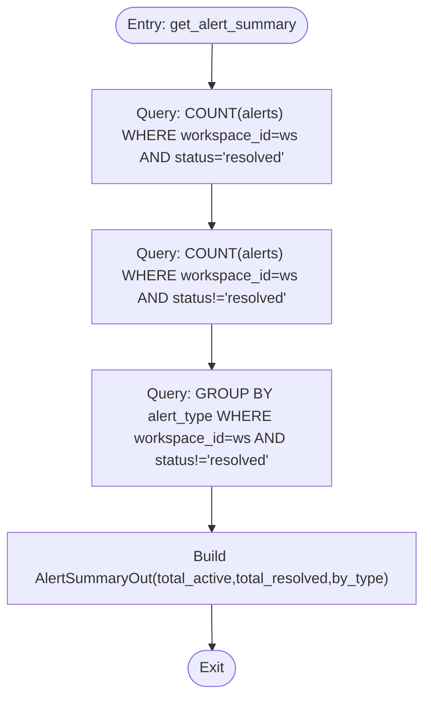
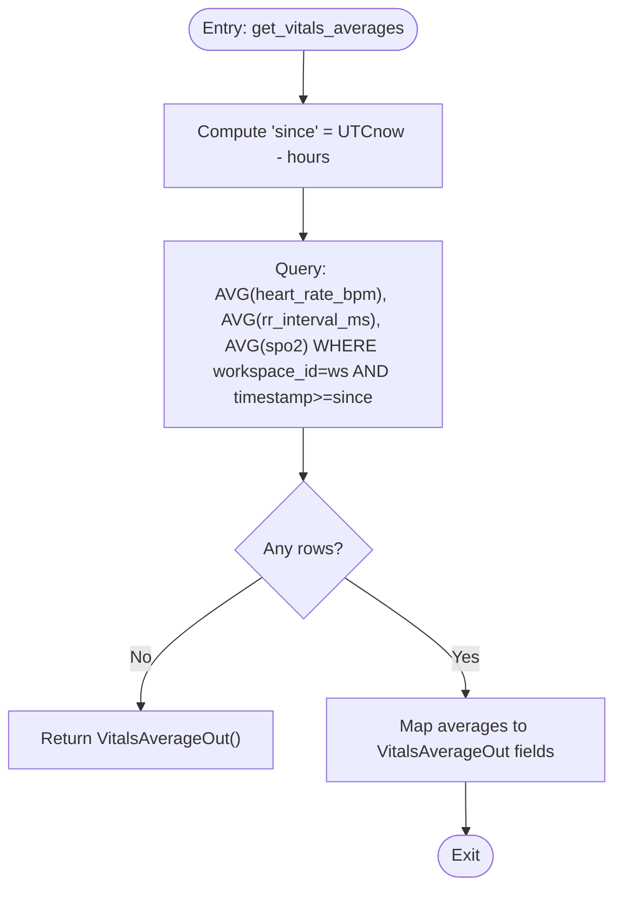
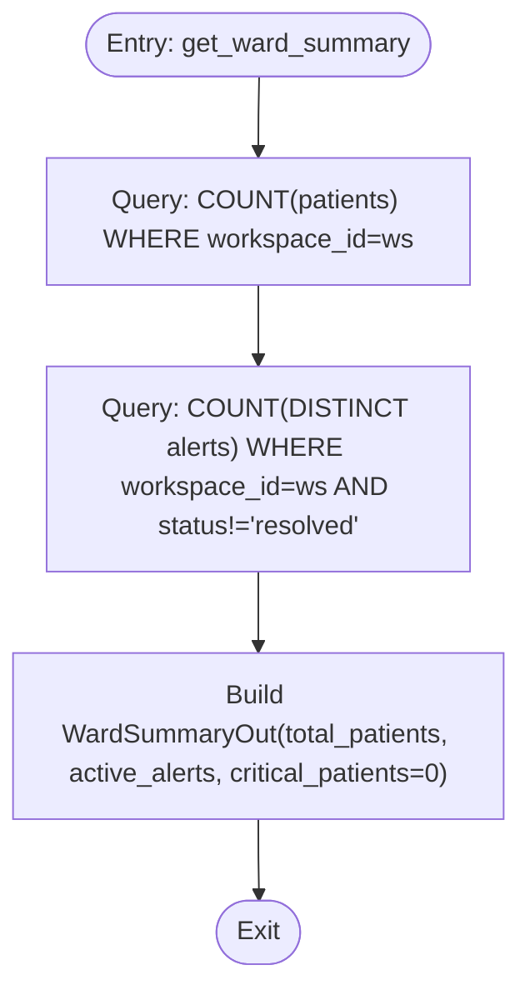
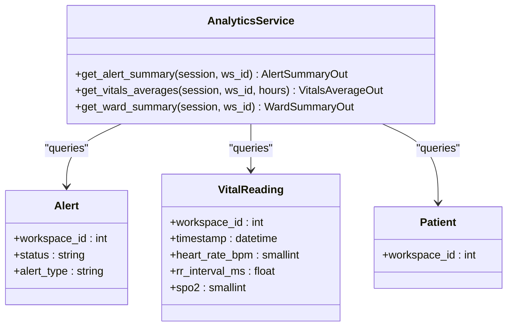

# Data Analytics

<cite>
**Referenced Files in This Document**
- [analytics.py](file://server/app/services/analytics.py)
- [analytics.py](file://server/app/api/endpoints/analytics.py)
- [analytics.py](file://server/app/schemas/analytics.py)
- [activity.py](file://server/app/models/activity.py)
- [vitals.py](file://server/app/models/vitals.py)
- [patients.py](file://server/app/models/patients.py)
- [dependencies.py](file://server/app/api/dependencies.py)
- [test_analytics.py](file://server/tests/test_analytics.py)
- [server.py](file://server/app/mcp/server.py)
- [openapi.generated.json](file://server/openapi.generated.json)
</cite>

## Table of Contents
1. [Introduction](#introduction)
2. [Project Structure](#project-structure)
3. [Core Components](#core-components)
4. [Architecture Overview](#architecture-overview)
5. [Detailed Component Analysis](#detailed-component-analysis)
6. [Dependency Analysis](#dependency-analysis)
7. [Performance Considerations](#performance-considerations)
8. [Troubleshooting Guide](#troubleshooting-guide)
9. [Conclusion](#conclusion)
10. [Appendices](#appendices)

## Introduction
This document describes the WheelSense Platform’s analytics service layer, focusing on the AnalyticsService class and its methods for alert summary calculations, vitals averages computation, and ward summaries generation. It explains the SQL query patterns used for real-time metric calculation, time-based aggregations, and workspace-scoped analytics. It also documents the AlertSummaryOut, VitalsAverageOut, and WardSummaryOut schema models, including field definitions and data types. Practical examples, performance optimization techniques, and multi-tenant analytics patterns are included.

## Project Structure
The analytics feature spans three layers:
- API endpoints: expose analytics under /api/analytics with role-based access control and workspace scoping.
- Service layer: implements AnalyticsService with three core methods for alert summaries, vitals averages, and ward summaries.
- Schemas: define output models for analytics responses.
- Models: provide the underlying data structures for alerts, vitals readings, and patients used by analytics queries.

**Diagram sources**
- [analytics.py:17-47](file://server/app/api/endpoints/analytics.py#L17-L47)
- [analytics.py:16-87](file://server/app/services/analytics.py#L16-L87)
- [activity.py:49-89](file://server/app/models/activity.py#L49-L89)
- [vitals.py:24-56](file://server/app/models/vitals.py#L24-L56)
- [patients.py:24-77](file://server/app/models/patients.py#L24-L77)

**Section sources**
- [analytics.py:1-49](file://server/app/api/endpoints/analytics.py#L1-L49)
- [analytics.py:1-91](file://server/app/services/analytics.py#L1-L91)
- [analytics.py:1-25](file://server/app/schemas/analytics.py#L1-L25)

## Core Components
- AnalyticsService: Static methods compute alert summaries, vitals averages, and ward summaries using SQLAlchemy async ORM.
- Endpoints: FastAPI routes expose analytics endpoints with role-based access control and workspace scoping.
- Schemas: Pydantic models define response shapes for analytics outputs.
- Models: Workspace-scoped tables for alerts, vitals, and patients power the analytics queries.

Key responsibilities:
- Alert summary: total active/resolved counts and breakdown by alert type for a workspace.
- Vitals averages: time-windowed averages for heart rate, RR interval, and SpO2 for a workspace.
- Ward summary: total patients and active alerts for a workspace.

**Section sources**
- [analytics.py:16-87](file://server/app/services/analytics.py#L16-L87)
- [analytics.py:17-47](file://server/app/api/endpoints/analytics.py#L17-L47)
- [analytics.py:8-25](file://server/app/schemas/analytics.py#L8-L25)

## Architecture Overview
The analytics pipeline follows a clean service-layer architecture:
- Endpoints validate roles and scope requests to the current workspace.
- AnalyticsService executes workspace-scoped queries against the database.
- Responses are serialized via Pydantic models.

**Diagram sources**
- [analytics.py:40-47](file://server/app/api/endpoints/analytics.py#L40-L47)
- [dependencies.py:139-150](file://server/app/api/dependencies.py#L139-L150)
- [analytics.py:69-87](file://server/app/services/analytics.py#L69-L87)

**Section sources**
- [analytics.py:17-47](file://server/app/api/endpoints/analytics.py#L17-L47)
- [dependencies.py:139-150](file://server/app/api/dependencies.py#L139-L150)
- [analytics.py:69-87](file://server/app/services/analytics.py#L69-L87)

## Detailed Component Analysis

### AnalyticsService Methods

#### Alert Summary Calculation
Purpose:
- Compute total active and resolved alerts, and a breakdown by alert type for the workspace.

Implementation highlights:
- Counts resolved vs non-resolved alerts using a single workspace filter.
- Groups by alert_type for active alerts to produce a dictionary of counts.
- Uses workspace_id to enforce multi-tenancy.

**Diagram sources**
- [analytics.py:18-42](file://server/app/services/analytics.py#L18-L42)
- [activity.py:54-89](file://server/app/models/activity.py#L54-L89)

**Section sources**
- [analytics.py:18-42](file://server/app/services/analytics.py#L18-L42)
- [activity.py:54-89](file://server/app/models/activity.py#L54-L89)

#### Vitals Averages Computation
Purpose:
- Compute time-windowed averages for heart rate, RR interval, and SpO2 for a workspace.

Implementation highlights:
- Builds a cutoff timestamp from current UTC minus N hours.
- Aggregates averages over workspace_id and timestamp bounds.
- Returns optional numeric fields; missing data yields an empty model.

**Diagram sources**
- [analytics.py:44-67](file://server/app/services/analytics.py#L44-L67)
- [vitals.py:29-56](file://server/app/models/vitals.py#L29-L56)

**Section sources**
- [analytics.py:44-67](file://server/app/services/analytics.py#L44-L67)
- [vitals.py:29-56](file://server/app/models/vitals.py#L29-L56)

#### Ward Summaries Generation
Purpose:
- Provide a high-level ward overview: total patients, active alerts, and placeholder for critical patients.

Implementation highlights:
- Counts total patients by workspace_id.
- Counts distinct active alerts by workspace_id.
- Leaves critical_patients as zero pending acuity scoring integration.

**Diagram sources**
- [analytics.py:69-87](file://server/app/services/analytics.py#L69-L87)
- [patients.py:29-77](file://server/app/models/patients.py#L29-L77)
- [activity.py:54-89](file://server/app/models/activity.py#L54-L89)

**Section sources**
- [analytics.py:69-87](file://server/app/services/analytics.py#L69-L87)
- [patients.py:29-77](file://server/app/models/patients.py#L29-L77)

### Schema Models

#### AlertSummaryOut
- total_active: integer
- total_resolved: integer
- by_type: dictionary mapping alert_type to integer count

Data type definitions:
- total_active: integer
- total_resolved: integer
- by_type: Dict[str, int]

Usage context:
- Returned by get_alert_summary.

**Section sources**
- [analytics.py:8-13](file://server/app/schemas/analytics.py#L8-L13)
- [analytics.py:38-42](file://server/app/services/analytics.py#L38-L42)

#### VitalsAverageOut
- heart_rate_bpm_avg: float or null
- rr_interval_ms_avg: float or null
- spo2_avg: float or null

Data type definitions:
- All fields are optional floats.

Usage context:
- Returned by get_vitals_averages.

**Section sources**
- [analytics.py:14-19](file://server/app/schemas/analytics.py#L14-L19)
- [analytics.py:63-67](file://server/app/services/analytics.py#L63-L67)

#### WardSummaryOut
- total_patients: integer
- active_alerts: integer
- critical_patients: integer

Data type definitions:
- All fields are integers.

Usage context:
- Returned by get_ward_summary.

**Section sources**
- [analytics.py:20-25](file://server/app/schemas/analytics.py#L20-L25)
- [analytics.py:83-87](file://server/app/services/analytics.py#L83-L87)

### API Endpoints and Access Control
Endpoints:
- GET /api/analytics/alerts/summary → AlertSummaryOut
- GET /api/analytics/vitals/averages → VitalsAverageOut (query param hours)
- GET /api/analytics/wards/summary → WardSummaryOut

Access control:
- Roles: admin, supervisor, head_nurse, observer for alert/vitals endpoints.
- Roles: admin, supervisor, head_nurse for ward summary.
- Workspace scoping via get_current_user_workspace.

**Section sources**
- [analytics.py:17-47](file://server/app/api/endpoints/analytics.py#L17-L47)
- [dependencies.py:159-169](file://server/app/api/dependencies.py#L159-L169)
- [dependencies.py:139-150](file://server/app/api/dependencies.py#L139-L150)

### Real-Time Data Processing Patterns
- Time-windowed vitals: the service computes a sliding window from UTC now minus hours.
- Workspace-scoped analytics: all queries filter by workspace_id to isolate tenant data.
- Distinct alert counts: the ward summary uses COUNT(DISTINCT alert_id) to avoid duplicates.

**Section sources**
- [analytics.py:44-67](file://server/app/services/analytics.py#L44-L67)
- [analytics.py:76-81](file://server/app/services/analytics.py#L76-L81)

### Multi-Tenant Analytics and Workspace Scoping
- Endpoints depend on get_current_user_workspace to derive ws_id.
- Models include workspace_id foreign keys and indexed fields for efficient filtering.
- MCP tool get_workspace_analytics reuses AnalyticsService with actor workspace context.

**Section sources**
- [dependencies.py:139-150](file://server/app/api/dependencies.py#L139-L150)
- [activity.py:55-60](file://server/app/models/activity.py#L55-L60)
- [vitals.py:30-35](file://server/app/models/vitals.py#L30-L35)
- [patients.py:30-35](file://server/app/models/patients.py#L30-L35)
- [server.py:1171-1179](file://server/app/mcp/server.py#L1171-L1179)

## Dependency Analysis
The analytics service depends on:
- SQLAlchemy async ORM for queries.
- Pydantic models for output serialization.
- Workspace scoping via dependencies and model foreign keys.

**Diagram sources**
- [analytics.py:16-87](file://server/app/services/analytics.py#L16-L87)
- [activity.py:54-89](file://server/app/models/activity.py#L54-L89)
- [vitals.py:29-56](file://server/app/models/vitals.py#L29-L56)
- [patients.py:29-77](file://server/app/models/patients.py#L29-L77)

**Section sources**
- [analytics.py:11-14](file://server/app/services/analytics.py#L11-L14)
- [analytics.py:8-25](file://server/app/schemas/analytics.py#L8-L25)

## Performance Considerations
- Indexes: workspace_id and timestamp are indexed on alerts and vitals tables, enabling efficient filtering and range scans.
- Aggregation efficiency: COUNT and AVG are computed server-side, minimizing data transfer.
- Time-window optimization: precompute the since timestamp to leverage indexes on timestamp.
- Distinct counting: COUNT(DISTINCT) ensures accurate active alert counts without duplicating rows.

Recommendations:
- Add composite indexes on (workspace_id, timestamp) for vitals if queries frequently filter by both.
- Consider materialized aggregates or scheduled rollups for very large datasets if latency becomes unacceptable.
- Cache short-lived analytics results (e.g., last 1–5 minutes) at the application layer if real-time updates are frequent and data volumes are high.

**Section sources**
- [vitals.py:42-43](file://server/app/models/vitals.py#L42-L43)
- [activity.py:20-25](file://server/app/models/activity.py#L20-L25)
- [activity.py](file://server/app/models/activity.py#L32)
- [analytics.py](file://server/app/services/analytics.py#L47)
- [analytics.py:76-81](file://server/app/services/analytics.py#L76-L81)

## Troubleshooting Guide
Common issues and resolutions:
- Missing workspace context: Ensure get_current_user_workspace resolves a valid workspace; otherwise, the endpoint returns a 400.
- Role violations: Accessing /api/analytics/wards/summary as observer returns 403; only admin, supervisor, head_nurse are permitted.
- No vitals data: get_vitals_averages returns an empty model when no rows match the time window; adjust hours or verify data ingestion.
- Inconsistent alert counts: The service counts active/acknowledged as active and resolved as resolved; verify alert status values.

Verification via tests:
- Alert summary respects status semantics and groups by type.
- Ward summary counts patients and active alerts.
- API endpoints return expected JSON shapes.

**Section sources**
- [dependencies.py:139-150](file://server/app/api/dependencies.py#L139-L150)
- [analytics.py:40-47](file://server/app/api/endpoints/analytics.py#L40-L47)
- [test_analytics.py:15-57](file://server/tests/test_analytics.py#L15-L57)
- [test_analytics.py:59-89](file://server/tests/test_analytics.py#L59-L89)
- [test_analytics.py:92-106](file://server/tests/test_analytics.py#L92-L106)
- [test_analytics.py:109-149](file://server/tests/test_analytics.py#L109-L149)

## Conclusion
The analytics service layer provides robust, workspace-scoped computations for alerts, vitals, and ward summaries. Its clean separation of concerns, strong typing via Pydantic models, and role-based access control enable secure, maintainable analytics. The current implementation leverages efficient SQL aggregations and indexes to support real-time dashboards and integrations.

## Appendices

### API Definitions
- GET /api/analytics/alerts/summary
  - Response: AlertSummaryOut
  - Roles: admin, supervisor, head_nurse, observer
- GET /api/analytics/vitals/averages
  - Query: hours (integer, default 24)
  - Response: VitalsAverageOut
  - Roles: admin, supervisor, head_nurse, observer
- GET /api/analytics/wards/summary
  - Response: WardSummaryOut
  - Roles: admin, supervisor, head_nurse

**Section sources**
- [analytics.py:17-47](file://server/app/api/endpoints/analytics.py#L17-L47)
- [openapi.generated.json:4825-4858](file://server/openapi.generated.json#L4825-L4858)

### Example Queries and Patterns
- Alert summary:
  - Filter by workspace_id and status to compute totals and group by alert_type.
- Vitals averages:
  - Filter by workspace_id and timestamp >= since; compute AVG for heart_rate_bpm, rr_interval_ms, spo2.
- Ward summary:
  - COUNT patients by workspace_id; COUNT(DISTINCT alerts) where status != resolved.

**Section sources**
- [analytics.py:18-42](file://server/app/services/analytics.py#L18-L42)
- [analytics.py:44-67](file://server/app/services/analytics.py#L44-L67)
- [analytics.py:69-87](file://server/app/services/analytics.py#L69-L87)