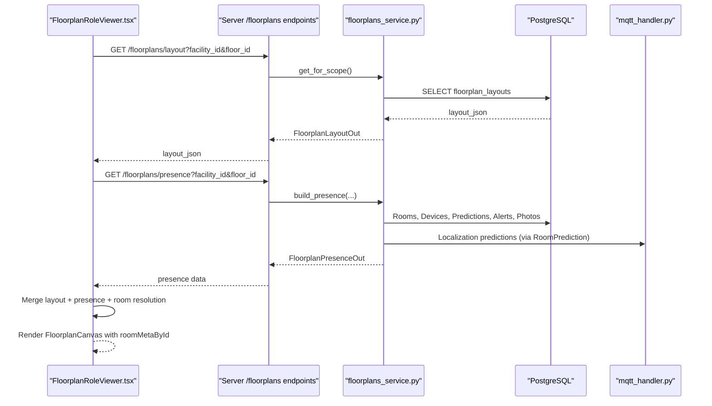
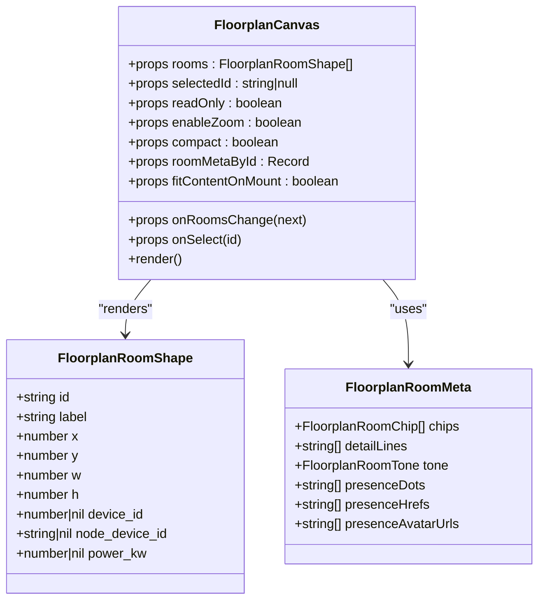
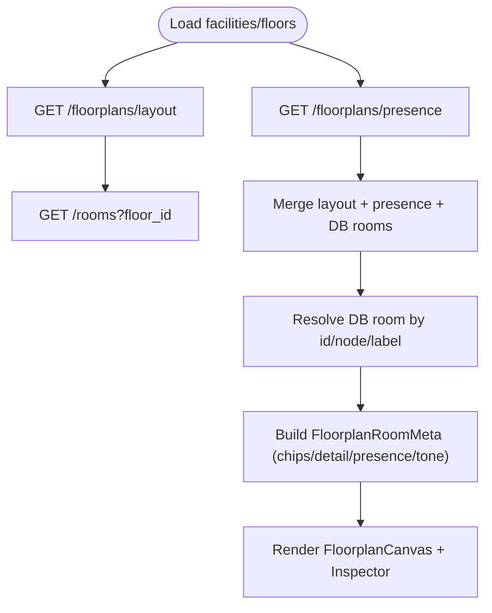
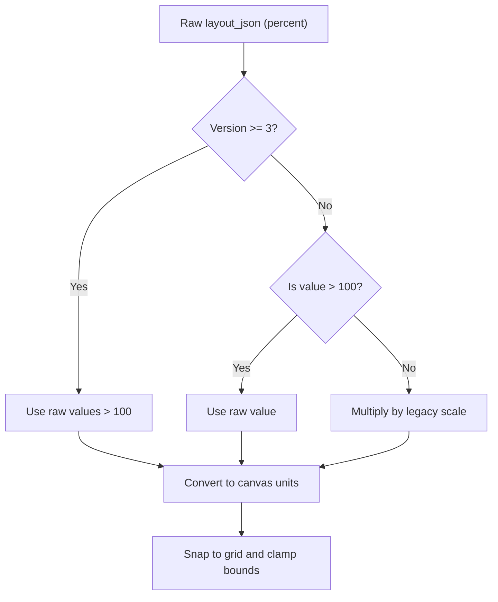
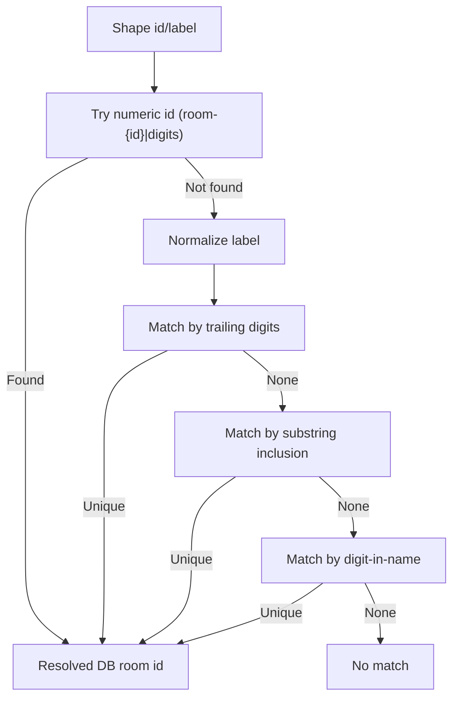
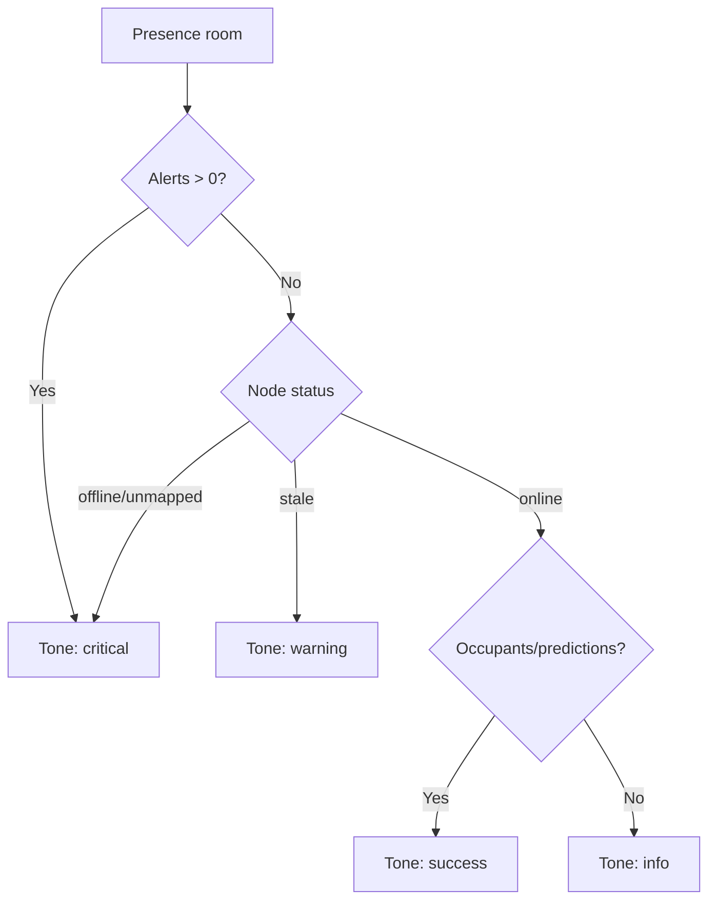
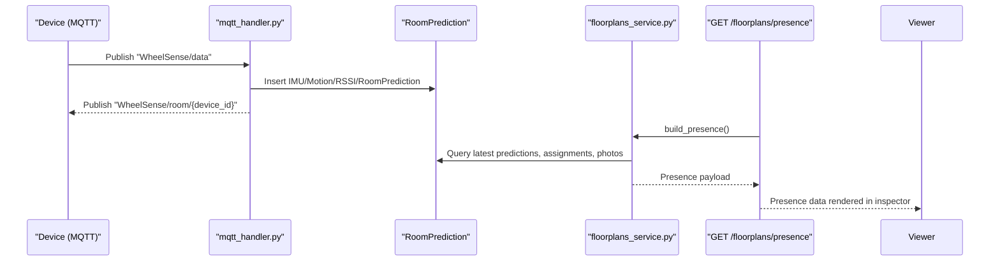
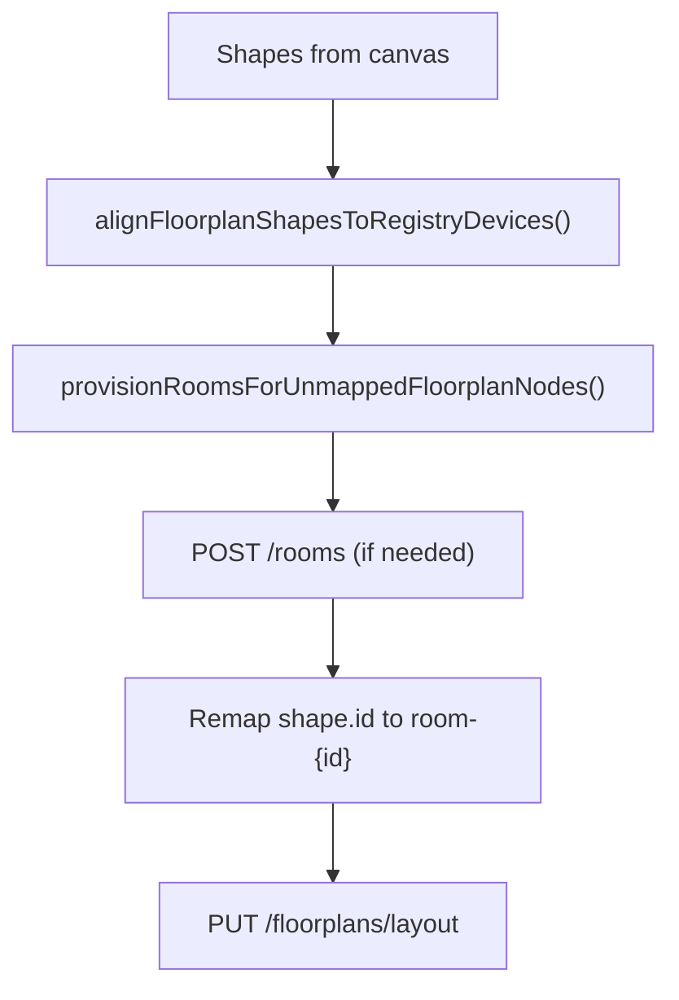
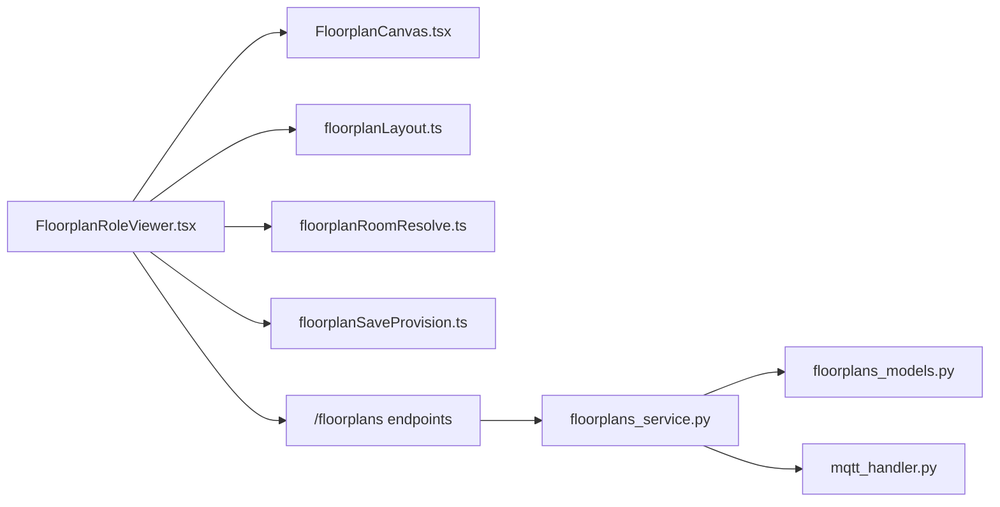

# Floorplan Visualization

<cite>
**Referenced Files in This Document**
- [FloorplanCanvas.tsx](file://frontend/components/floorplan/FloorplanCanvas.tsx)
- [FloorplanRoleViewer.tsx](file://frontend/components/floorplan/FloorplanRoleViewer.tsx)
- [floorplanLayout.ts](file://frontend/lib/floorplanLayout.ts)
- [floorplanRoomResolve.ts](file://frontend/lib/floorplanRoomResolve.ts)
- [floorplanSaveProvision.ts](file://frontend/lib/floorplanSaveProvision.ts)
- [monitoringWorkspace.ts](file://frontend/lib/monitoringWorkspace.ts)
- [types.ts](file://frontend/lib/types.ts)
- [floorplans.py](file://server/app/api/endpoints/floorplans.py)
- [floorplans_service.py](file://server/app/services/floorplans.py)
- [floorplans_models.py](file://server/app/models/floorplans.py)
- [mqtt_handler.py](file://server/app/mqtt_handler.py)
- [localization_setup.py](file://server/app/services/localization_setup.py)
</cite>

## Table of Contents
1. [Introduction](#introduction)
2. [Project Structure](#project-structure)
3. [Core Components](#core-components)
4. [Architecture Overview](#architecture-overview)
5. [Detailed Component Analysis](#detailed-component-analysis)
6. [Dependency Analysis](#dependency-analysis)
7. [Performance Considerations](#performance-considerations)
8. [Troubleshooting Guide](#troubleshooting-guide)
9. [Conclusion](#conclusion)
10. [Appendices](#appendices)

## Introduction
This document explains the WheelSense Platform’s floorplan visualization system, focusing on the FloorplanCanvas component, FloorplanRoleViewer, and room mapping functionality. It covers floorplan layout algorithms, room resolution mechanisms, device positioning logic, spatial data models, coordinate systems, room boundary calculations, real-time presence detection, patient tracking visualization, device status indicators, MQTT telemetry integration, localization algorithms, spatial analytics, and save/provision workflows for floorplan configurations.

## Project Structure
The floorplan visualization spans the frontend and backend:
- Frontend components render SVG-based floorplans, manage user interactions, and integrate presence data.
- Backend services expose endpoints for floorplan layouts and presence, ingest MQTT telemetry, and compute room occupancy and predictions.
- Utilities normalize coordinates, resolve room labels, and prepare shapes for saving.

```mermaid
graph TB
subgraph "Frontend"
FC["FloorplanCanvas.tsx"]
FRV["FloorplanRoleViewer.tsx"]
LAYOUT["floorplanLayout.ts"]
RESOLVE["floorplanRoomResolve.ts"]
SAVE["floorplanSaveProvision.ts"]
TYPES["types.ts"]
MW["monitoringWorkspace.ts"]
end
subgraph "Backend"
API["/floorplans endpoints"]
SVC["floorplans_service.py"]
MODELS["floorplans_models.py"]
MQTT["mqtt_handler.py"]
LOC["localization_setup.py"]
end
FC <- --> LAYOUT
FRV <- --> FC
FRV <- --> LAYOUT
FRV <- --> RESOLVE
FRV <- --> SAVE
FRV <- --> API
API --> SVC
SVC --> MODELS
MQTT --> SVC
LOC --> SVC
TYPES -.-> FRV
MW -.-> FRV
```

**Diagram sources**
- [FloorplanCanvas.tsx:1-617](file://frontend/components/floorplan/FloorplanCanvas.tsx#L1-L617)
- [FloorplanRoleViewer.tsx:1-1143](file://frontend/components/floorplan/FloorplanRoleViewer.tsx#L1-L1143)
- [floorplanLayout.ts:1-103](file://frontend/lib/floorplanLayout.ts#L1-L103)
- [floorplanRoomResolve.ts:1-108](file://frontend/lib/floorplanRoomResolve.ts#L1-L108)
- [floorplanSaveProvision.ts:1-64](file://frontend/lib/floorplanSaveProvision.ts#L1-L64)
- [monitoringWorkspace.ts:1-146](file://frontend/lib/monitoringWorkspace.ts#L1-L146)
- [types.ts:1-482](file://frontend/lib/types.ts#L1-L482)
- [floorplans.py:1-242](file://server/app/api/endpoints/floorplans.py#L1-L242)
- [floorplans_service.py:1-613](file://server/app/services/floorplans.py#L1-L613)
- [floorplans_models.py:1-48](file://server/app/models/floorplans.py#L1-L48)
- [mqtt_handler.py:1-667](file://server/app/mqtt_handler.py#L1-L667)
- [localization_setup.py:37-557](file://server/app/services/localization_setup.py#L37-L557)

**Section sources**
- [FloorplanCanvas.tsx:1-617](file://frontend/components/floorplan/FloorplanCanvas.tsx#L1-L617)
- [FloorplanRoleViewer.tsx:1-1143](file://frontend/components/floorplan/FloorplanRoleViewer.tsx#L1-L1143)
- [floorplanLayout.ts:1-103](file://frontend/lib/floorplanLayout.ts#L1-L103)
- [floorplanRoomResolve.ts:1-108](file://frontend/lib/floorplanRoomResolve.ts#L1-L108)
- [floorplanSaveProvision.ts:1-64](file://frontend/lib/floorplanSaveProvision.ts#L1-L64)
- [monitoringWorkspace.ts:1-146](file://frontend/lib/monitoringWorkspace.ts#L1-L146)
- [types.ts:1-482](file://frontend/lib/types.ts#L1-L482)
- [floorplans.py:1-242](file://server/app/api/endpoints/floorplans.py#L1-L242)
- [floorplans_service.py:1-613](file://server/app/services/floorplans.py#L1-L613)
- [floorplans_models.py:1-48](file://server/app/models/floorplans.py#L1-L48)
- [mqtt_handler.py:1-667](file://server/app/mqtt_handler.py#L1-L667)
- [localization_setup.py:37-557](file://server/app/services/localization_setup.py#L37-L557)

## Core Components
- FloorplanCanvas: An interactive SVG canvas for rendering rooms, dragging/resizing, panning, zooming, and displaying presence dots and chips.
- FloorplanRoleViewer: A role-aware viewer that fetches facility/floor data, merges presence telemetry, resolves room identities, and renders a dashboard-style panel with inspector details.
- Spatial utilities: Coordinate normalization, room label matching, shape ID normalization, and save/provision helpers.

Key responsibilities:
- Rendering normalized room shapes with optional read-only mode and compact presentation.
- Resolving presence metadata (occupancy, alerts, predictions, device summaries).
- Mapping layout labels to database room rows and ensuring stable IDs for saves.
- Preparing shapes for persistence and provisioning unmapped nodes.

**Section sources**
- [FloorplanCanvas.tsx:183-617](file://frontend/components/floorplan/FloorplanCanvas.tsx#L183-L617)
- [FloorplanRoleViewer.tsx:567-1143](file://frontend/components/floorplan/FloorplanRoleViewer.tsx#L567-L1143)
- [floorplanLayout.ts:35-103](file://frontend/lib/floorplanLayout.ts#L35-L103)
- [floorplanRoomResolve.ts:24-108](file://frontend/lib/floorplanRoomResolve.ts#L24-L108)
- [floorplanSaveProvision.ts:11-64](file://frontend/lib/floorplanSaveProvision.ts#L11-L64)

## Architecture Overview
The floorplan visualization integrates frontend rendering with backend presence computation and MQTT-driven telemetry.



**Diagram sources**
- [FloorplanRoleViewer.tsx:639-780](file://frontend/components/floorplan/FloorplanRoleViewer.tsx#L639-L780)
- [floorplans.py:135-177](file://server/app/api/endpoints/floorplans.py#L135-L177)
- [floorplans_service.py:42-506](file://server/app/services/floorplans.py#L42-L506)
- [mqtt_handler.py:139-325](file://server/app/mqtt_handler.py#L139-L325)

## Detailed Component Analysis

### FloorplanCanvas
- Purpose: Interactive SVG canvas for room editing and visualization.
- Features:
  - Drag-to-move and resize corners with snapping to grid.
  - Zoom controls and keyboard zoom (Ctrl/Cmd + wheel).
  - Panning with pointer drag on empty space.
  - Grid background and constrained room sizes.
  - Presence dots with avatar fallback and links.
  - Compact mode for dashboards.
- Data model: Uses normalized room shapes with x/y/w/h in canvas units.



**Diagram sources**
- [FloorplanCanvas.tsx:1-617](file://frontend/components/floorplan/FloorplanCanvas.tsx#L1-L617)
- [floorplanLayout.ts:1-11](file://frontend/lib/floorplanLayout.ts#L1-L11)

**Section sources**
- [FloorplanCanvas.tsx:183-617](file://frontend/components/floorplan/FloorplanCanvas.tsx#L183-L617)
- [floorplanLayout.ts:1-11](file://frontend/lib/floorplanLayout.ts#L1-L11)

### FloorplanRoleViewer
- Purpose: Role-aware floorplan viewer with presence, occupancy, and device summaries.
- Data flow:
  - Loads facilities and floors, then fetches layout and presence.
  - Resolves presence rooms to DB rooms via numeric IDs, node_device_id, or fuzzy label matching.
  - Builds room metadata (chips, detail lines, presence dots, tones).
  - Provides inspector panel for selected room with patients/staff, predictions, smart devices, and camera snapshots.
- Real-time integration:
  - Polls presence endpoint every 5 seconds.
  - Uses role-aware visibility and patient filtering.



**Diagram sources**
- [FloorplanRoleViewer.tsx:567-800](file://frontend/components/floorplan/FloorplanRoleViewer.tsx#L567-L800)
- [floorplanRoomResolve.ts:24-82](file://frontend/lib/floorplanRoomResolve.ts#L24-L82)

**Section sources**
- [FloorplanRoleViewer.tsx:567-800](file://frontend/components/floorplan/FloorplanRoleViewer.tsx#L567-L800)
- [floorplanRoomResolve.ts:24-82](file://frontend/lib/floorplanRoomResolve.ts#L24-L82)

### Spatial Data Models and Coordinate Systems
- Room shape model: id, label, x, y, w, h, optional device_id and node_device_id.
- Coordinate normalization:
  - Legacy scale factor and large-map scale factor convert percentages to internal units.
  - Version-aware normalization ensures backward compatibility.
- Canvas units: 1% equals a configurable scale; grid snapping and minimum room size enforce usability.



**Diagram sources**
- [floorplanLayout.ts:35-72](file://frontend/lib/floorplanLayout.ts#L35-L72)

**Section sources**
- [floorplanLayout.ts:35-72](file://frontend/lib/floorplanLayout.ts#L35-L72)

### Room Resolution Mechanisms
- Numeric ID precedence: room-{id} canonical IDs or pure numeric IDs.
- Label matching: exact match, trailing digits, substring inclusion, and digit-in-name patterns.
- Fallback to fuzzy matching against DB room names.



**Diagram sources**
- [floorplanRoomResolve.ts:24-82](file://frontend/lib/floorplanRoomResolve.ts#L24-L82)

**Section sources**
- [floorplanRoomResolve.ts:24-82](file://frontend/lib/floorplanRoomResolve.ts#L24-L82)

### Device Positioning Logic and Presence Visualization
- Presence metadata:
  - Chips: patient count, staff count, alert count, prediction confidence.
  - Detail lines: occupancy summary, node status, camera snapshot freshness.
  - Presence dots: truncated list of occupants with avatars or initials.
  - Tones: critical/warning/success/info derived from alerts, node status, and occupancy.
- Node status:
  - Online if last_seen within 5 minutes.
  - Stale if older than 5 minutes.
  - Offline/unmapped otherwise.
- Prediction hints:
  - Live predictions within a 90-second window override assignment when fresher.
  - Confidence-based chip tone.



**Diagram sources**
- [FloorplanRoleViewer.tsx:123-130](file://frontend/components/floorplan/FloorplanRoleViewer.tsx#L123-L130)
- [floorplans_service.py:326-506](file://server/app/services/floorplans.py#L326-L506)

**Section sources**
- [FloorplanRoleViewer.tsx:223-281](file://frontend/components/floorplan/FloorplanRoleViewer.tsx#L223-L281)
- [floorplans_service.py:326-506](file://server/app/services/floorplans.py#L326-L506)

### Real-time Presence Detection and Patient Tracking
- Telemetry ingestion:
  - MQTT topics for device telemetry, camera registration/status, photos, and acknowledgments.
  - Room predictions generated from RSSI vectors and published to room-specific topics.
- Backend presence computation:
  - Aggregates latest RoomPrediction entries, patient assignments, manual staff positions, and camera photos.
  - Filters by visibility for roles like “patient”.
- Timeline events:
  - Room transitions recorded in activity timeline when prediction room changes.



**Diagram sources**
- [mqtt_handler.py:139-325](file://server/app/mqtt_handler.py#L139-L325)
- [floorplans_service.py:42-506](file://server/app/services/floorplans.py#L42-L506)
- [floorplans.py:160-177](file://server/app/api/endpoints/floorplans.py#L160-L177)

**Section sources**
- [mqtt_handler.py:139-325](file://server/app/mqtt_handler.py#L139-L325)
- [floorplans_service.py:42-506](file://server/app/services/floorplans.py#L42-L506)
- [floorplans.py:160-177](file://server/app/api/endpoints/floorplans.py#L160-L177)

### Device Status Indicators and Smart Devices
- Device status:
  - Node online/stale/offline based on last_seen thresholds.
  - Camera snapshots tracked and surfaced with timestamps.
- Smart devices:
  - Home Assistant devices linked to rooms are summarized in the inspector.
- Alerts:
  - Active alerts per room counted and shown as chips.

**Section sources**
- [FloorplanRoleViewer.tsx:475-507](file://frontend/components/floorplan/FloorplanRoleViewer.tsx#L475-L507)
- [floorplans_service.py:241-266](file://server/app/services/floorplans.py#L241-L266)

### Save and Provision Workflows
- Shape alignment:
  - Ensure shape.device_id matches registry device for node_device_id; clear stale device_id if not found.
- Provisioning:
  - For shapes with node + label but no matching DB room, create a room and remap shape id to room-{id}.
- Persistence:
  - PUT /floorplans/layout validates uniqueness of device_id per room and persists layout_json with version.



**Diagram sources**
- [floorplanSaveProvision.ts:11-64](file://frontend/lib/floorplanSaveProvision.ts#L11-L64)
- [floorplans.py:202-242](file://server/app/api/endpoints/floorplans.py#L202-L242)

**Section sources**
- [floorplanSaveProvision.ts:11-64](file://frontend/lib/floorplanSaveProvision.ts#L11-L64)
- [floorplans.py:202-242](file://server/app/api/endpoints/floorplans.py#L202-L242)

### Integration with MQTT Telemetry and Localization
- Localization:
  - Predictions computed from RSSI vectors and persisted as RoomPrediction.
  - Strongest-RSSI strategy and ML models supported; readiness service can auto-create baseline facility/floor/room.
- Telemetry topics:
  - Device telemetry ingestion, camera registration/status, photo chunks, and ACK handling.
- Room tracking:
  - Room transitions recorded in activity timeline when prediction room changes.

**Section sources**
- [localization_setup.py:493-557](file://server/app/services/localization_setup.py#L493-L557)
- [mqtt_handler.py:139-325](file://server/app/mqtt_handler.py#L139-L325)

## Dependency Analysis
- Frontend dependencies:
  - FloorplanRoleViewer depends on FloorplanCanvas, layout utilities, room resolve utilities, and save/provision helpers.
  - Uses typed models from types.ts for API contracts.
- Backend dependencies:
  - Floorplan endpoints depend on FloorplanLayoutService and FloorplanPresenceService.
  - Presence service aggregates RoomPrediction, assignments, alerts, and photos.
  - MQTT handler ingests telemetry and publishes room predictions.



**Diagram sources**
- [FloorplanRoleViewer.tsx:1-1143](file://frontend/components/floorplan/FloorplanRoleViewer.tsx#L1-L1143)
- [FloorplanCanvas.tsx:1-617](file://frontend/components/floorplan/FloorplanCanvas.tsx#L1-L617)
- [floorplanLayout.ts:1-103](file://frontend/lib/floorplanLayout.ts#L1-L103)
- [floorplanRoomResolve.ts:1-108](file://frontend/lib/floorplanRoomResolve.ts#L1-L108)
- [floorplanSaveProvision.ts:1-64](file://frontend/lib/floorplanSaveProvision.ts#L1-L64)
- [floorplans.py:1-242](file://server/app/api/endpoints/floorplans.py#L1-L242)
- [floorplans_service.py:1-613](file://server/app/services/floorplans.py#L1-L613)
- [floorplans_models.py:1-48](file://server/app/models/floorplans.py#L1-L48)
- [mqtt_handler.py:1-667](file://server/app/mqtt_handler.py#L1-L667)

**Section sources**
- [FloorplanRoleViewer.tsx:1-1143](file://frontend/components/floorplan/FloorplanRoleViewer.tsx#L1-L1143)
- [floorplans.py:1-242](file://server/app/api/endpoints/floorplans.py#L1-L242)
- [floorplans_service.py:1-613](file://server/app/services/floorplans.py#L1-L613)

## Performance Considerations
- Canvas rendering:
  - Use compact mode for dashboards to reduce DOM and repaint costs.
  - Avoid frequent re-renders by memoizing roomMetaById and roomEntries.
- Queries:
  - Presence polling interval is tuned to balance freshness and load.
  - Use staleTime/refetch intervals to minimize redundant requests.
- Data normalization:
  - Normalize coordinates once per layout load; avoid repeated conversions.
- Device mapping:
  - Cache resolved device mappings and room references to prevent repeated lookups.

[No sources needed since this section provides general guidance]

## Troubleshooting Guide
- Rooms not appearing:
  - Verify layout exists for facility/floor; otherwise, DB rooms are bootstrapped in a grid.
  - Ensure node_device_id is registered and mapped to a room.
- Presence not updating:
  - Confirm device is registered and publishing telemetry; check MQTT broker connectivity.
  - Verify RoomPrediction entries exist and are within the live window.
- Save conflicts:
  - Each device can be assigned to at most one room; fix duplicate device_id in shapes.
- Avatar fallback:
  - Presence dots fall back to initials when avatar URLs are unavailable or broken.

**Section sources**
- [floorplans.py:210-224](file://server/app/api/endpoints/floorplans.py#L210-L224)
- [floorplans_service.py:32-506](file://server/app/services/floorplans.py#L32-L506)
- [mqtt_handler.py:139-325](file://server/app/mqtt_handler.py#L139-L325)

## Conclusion
The WheelSense floorplan visualization combines an interactive SVG canvas with robust presence computation and MQTT-driven telemetry. Room resolution, coordinate normalization, and save/provision workflows ensure accurate and maintainable floorplan layouts. The system supports real-time presence detection, patient tracking, device status indicators, and integrates with localization algorithms and spatial analytics.

[No sources needed since this section summarizes without analyzing specific files]

## Appendices

### Examples and Best Practices
- Customizing floorplan layout:
  - Use read-only mode for dashboards; enable editing for admin/supervisor.
  - Fit content on mount to center all rooms initially.
- Room configuration:
  - Prefer numeric room-{id} canonical IDs for stable saves.
  - Match labels carefully; trailing digits and substring matching improve reliability.
- Layout optimization:
  - Snap to grid and clamp bounds keep rooms visually consistent.
  - Use compact mode for embedded panels to save space.

**Section sources**
- [FloorplanCanvas.tsx:183-243](file://frontend/components/floorplan/FloorplanCanvas.tsx#L183-L243)
- [floorplanRoomResolve.ts:24-82](file://frontend/lib/floorplanRoomResolve.ts#L24-L82)
- [floorplanSaveProvision.ts:11-64](file://frontend/lib/floorplanSaveProvision.ts#L11-L64)