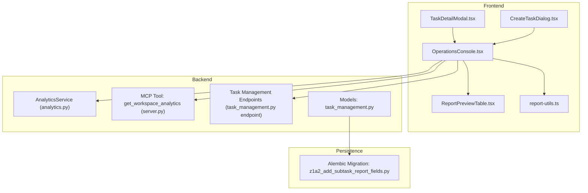
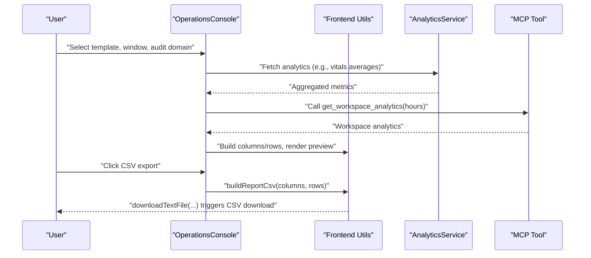
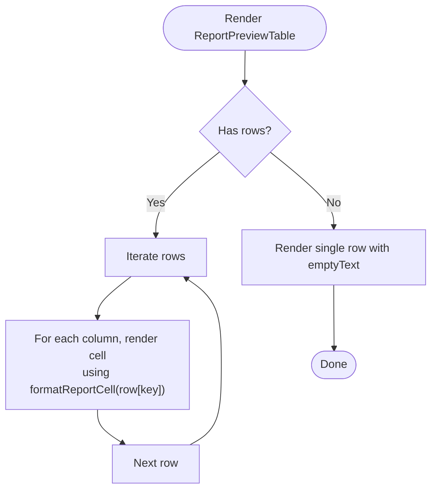
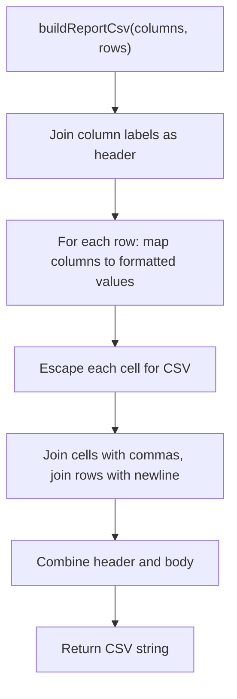
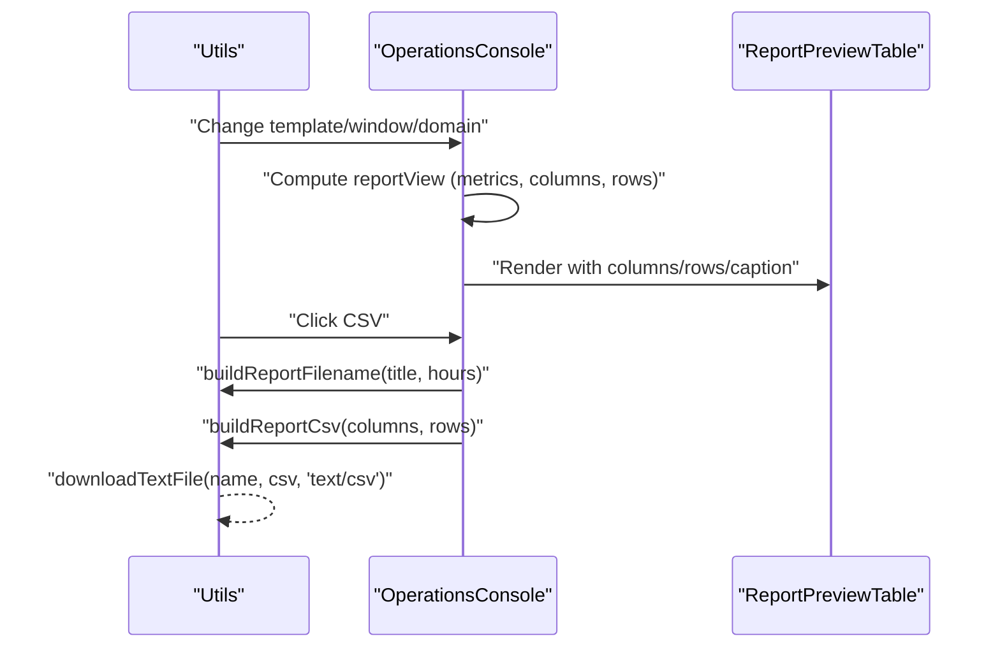
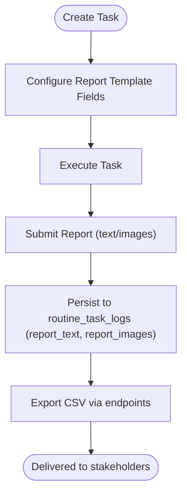
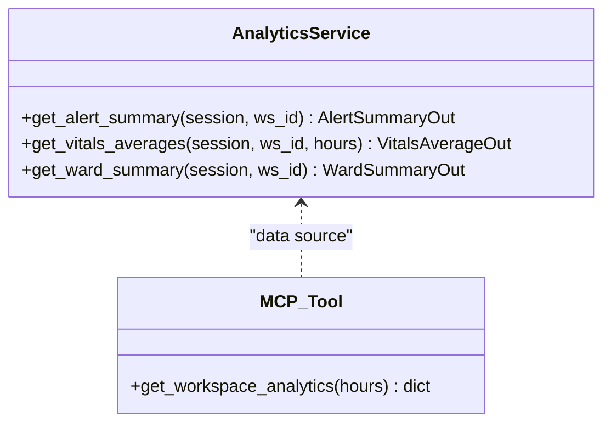
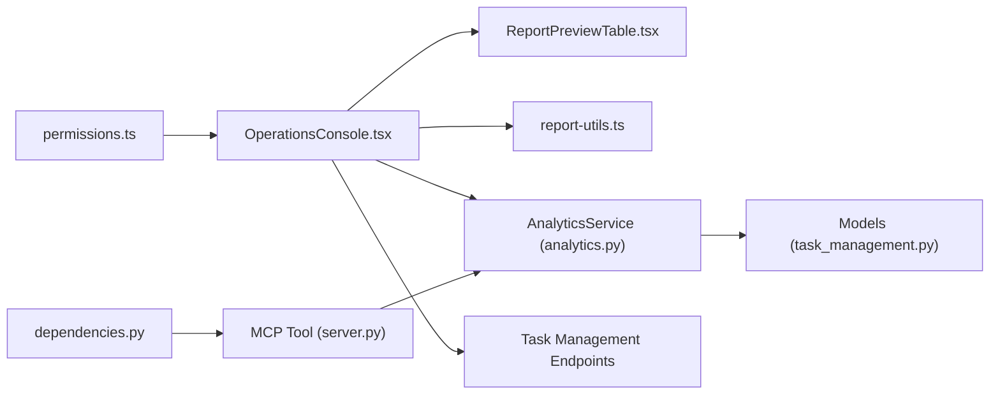

# Reporting System

<cite>
**Referenced Files in This Document**
- [ReportPreviewTable.tsx](file://frontend/components/reports/ReportPreviewTable.tsx)
- [report-utils.ts](file://frontend/components/reports/report-utils.ts)
- [OperationsConsole.tsx](file://frontend/components/workflow/OperationsConsole.tsx)
- [TaskDetailModal.tsx](file://frontend/components/head-nurse/tasks/TaskDetailModal.tsx)
- [CreateTaskDialog.tsx](file://frontend/components/head-nurse/tasks/CreateTaskDialog.tsx)
- [analytics.py](file://server/app/services/analytics.py)
- [server.py](file://server/app/mcp/server.py)
- [dependencies.py](file://server/app/api/dependencies.py)
- [permissions.ts](file://frontend/lib/permissions.ts)
- [z1a2_add_subtask_report_fields.py](file://server/alembic/versions/z1a2_add_subtask_report_fields.py)
- [task_management.py](file://server/app/models/task_management.py)
- [task_management.py (endpoint)](file://server/app/api/endpoints/task_management.py)
</cite>

## Table of Contents
1. [Introduction](#introduction)
2. [Project Structure](#project-structure)
3. [Core Components](#core-components)
4. [Architecture Overview](#architecture-overview)
5. [Detailed Component Analysis](#detailed-component-analysis)
6. [Dependency Analysis](#dependency-analysis)
7. [Performance Considerations](#performance-considerations)
8. [Troubleshooting Guide](#troubleshooting-guide)
9. [Conclusion](#conclusion)
10. [Appendices](#appendices)

## Introduction
This document describes the WheelSense Platform’s reporting and export system. It covers the ReportPreviewTable component, report generation workflows, and data export capabilities. It explains reporting templates, customizable report parameters, and automated report scheduling. It also documents report utilities, data formatting functions, and supported export formats (CSV). Security, access controls, and distribution mechanisms are addressed, along with examples of custom report creation, scheduling, and automated delivery. Finally, it covers performance optimization for large datasets, batch processing, and integration with analytics services and real-time data sources for dynamic reporting.

## Project Structure
The reporting system spans the frontend and backend:
- Frontend components define the report preview table, formatting utilities, and the workflow console that drives report generation and export.
- Backend services compute analytics and expose endpoints for exporting data.
- Database migrations introduce report-related fields for task logs.
- Permissions and roles govern who can manage and read reports.

**Diagram sources**
- [ReportPreviewTable.tsx:1-67](file://frontend/components/reports/ReportPreviewTable.tsx#L1-L67)
- [report-utils.ts:1-53](file://frontend/components/reports/report-utils.ts#L1-L53)
- [OperationsConsole.tsx:2450-2556](file://frontend/components/workflow/OperationsConsole.tsx#L2450-L2556)
- [TaskDetailModal.tsx:813-1021](file://frontend/components/head-nurse/tasks/TaskDetailModal.tsx#L813-L1021)
- [CreateTaskDialog.tsx:366-390](file://frontend/components/head-nurse/tasks/CreateTaskDialog.tsx#L366-L390)
- [analytics.py:1-91](file://server/app/services/analytics.py#L1-L91)
- [server.py:1159-1197](file://server/app/mcp/server.py#L1159-L1197)
- [task_management.py (endpoint):594-608](file://server/app/api/endpoints/task_management.py#L594-L608)
- [task_management.py:93-128](file://server/app/models/task_management.py#L93-L128)
- [z1a2_add_subtask_report_fields.py:22-41](file://server/alembic/versions/z1a2_add_subtask_report_fields.py#L22-L41)

**Section sources**
- [ReportPreviewTable.tsx:1-67](file://frontend/components/reports/ReportPreviewTable.tsx#L1-L67)
- [report-utils.ts:1-53](file://frontend/components/reports/report-utils.ts#L1-L53)
- [OperationsConsole.tsx:2450-2556](file://frontend/components/workflow/OperationsConsole.tsx#L2450-L2556)
- [TaskDetailModal.tsx:813-1021](file://frontend/components/head-nurse/tasks/TaskDetailModal.tsx#L813-L1021)
- [CreateTaskDialog.tsx:366-390](file://frontend/components/head-nurse/tasks/CreateTaskDialog.tsx#L366-L390)
- [analytics.py:1-91](file://server/app/services/analytics.py#L1-L91)
- [server.py:1159-1197](file://server/app/mcp/server.py#L1159-L1197)
- [task_management.py (endpoint):594-608](file://server/app/api/endpoints/task_management.py#L594-L608)
- [task_management.py:93-128](file://server/app/models/task_management.py#L93-L128)
- [z1a2_add_subtask_report_fields.py:22-41](file://server/alembic/versions/z1a2_add_subtask_report_fields.py#L22-L41)

## Core Components
- ReportPreviewTable: Renders a responsive, formatted table for report previews with optional captions and empty-state messaging.
- Report Utilities: Provide cell formatting, CSV building, filename generation, and client-side download helpers.
- Operations Console Reports Tab: Drives report selection, parameterization (time window, audit domain), preview rendering, and export actions (CSV, print).
- Analytics Services: Compute alert summaries, vitals averages, and ward summaries for dynamic reporting.
- MCP Tool: Exposes workspace analytics via a tool interface with a configurable hours parameter.
- Task Management Endpoints: Provide CSV exports for routines and routine logs.
- Database Schema: Adds report_text and report_images to routine task logs for custom report storage.

**Section sources**
- [ReportPreviewTable.tsx:14-66](file://frontend/components/reports/ReportPreviewTable.tsx#L14-L66)
- [report-utils.ts:11-52](file://frontend/components/reports/report-utils.ts#L11-L52)
- [OperationsConsole.tsx:2450-2556](file://frontend/components/workflow/OperationsConsole.tsx#L2450-L2556)
- [analytics.py:16-91](file://server/app/services/analytics.py#L16-L91)
- [server.py:1159-1197](file://server/app/mcp/server.py#L1159-L1197)
- [task_management.py (endpoint):594-608](file://server/app/api/endpoints/task_management.py#L594-L608)
- [z1a2_add_subtask_report_fields.py:22-41](file://server/alembic/versions/z1a2_add_subtask_report_fields.py#L22-L41)

## Architecture Overview
The reporting pipeline integrates frontend UI, analytics computation, and backend export endpoints. Users configure report parameters in the Operations Console, which requests analytics data from backend services or MCP tools. The frontend renders a preview table and supports CSV export and printing. For task-based reporting, routine logs can store custom report content persisted in the database.

**Diagram sources**
- [OperationsConsole.tsx:2450-2556](file://frontend/components/workflow/OperationsConsole.tsx#L2450-L2556)
- [report-utils.ts:21-44](file://frontend/components/reports/report-utils.ts#L21-L44)
- [analytics.py:44-67](file://server/app/services/analytics.py#L44-L67)
- [server.py:1159-1197](file://server/app/mcp/server.py#L1159-L1197)

## Detailed Component Analysis

### ReportPreviewTable Component
- Purpose: Render a formatted, responsive table for report previews with optional caption and empty-state handling.
- Behavior:
  - Uses column definitions to render headers.
  - Iterates rows and renders cells using a shared formatter.
  - Displays an empty message when no rows are present.
- Extensibility: Accepts a className for styling and supports a caption below the table.

**Diagram sources**
- [ReportPreviewTable.tsx:42-59](file://frontend/components/reports/ReportPreviewTable.tsx#L42-L59)

**Section sources**
- [ReportPreviewTable.tsx:14-66](file://frontend/components/reports/ReportPreviewTable.tsx#L14-L66)

### Report Utilities
- Data Types: Defines ReportCell, ReportRow, and ReportColumn for consistent typing across the system.
- Cell Formatting: Converts booleans to Yes/No and null/undefined to a dash for display.
- CSV Building: Escapes CSV cells and joins headers and rows into a CSV string.
- Filename Generation: Creates a standardized filename incorporating template label and time window.
- Download Helper: Creates a Blob, generates a temporary link, and triggers a client-side download.

**Diagram sources**
- [report-utils.ts:21-31](file://frontend/components/reports/report-utils.ts#L21-L31)

**Section sources**
- [report-utils.ts:1-53](file://frontend/components/reports/report-utils.ts#L1-L53)

### Operations Console Reports Tab
- Controls:
  - Report Template selector with description.
  - Time window selector (6h, 12h, 24h, 72h).
  - Audit domain selector (all, task, schedule, directive, handover, messaging, alert).
  - Export buttons: CSV download and Print.
- Preview:
  - Metrics cards display computed KPIs.
  - ReportPreviewTable renders the final report view.
- Actions:
  - CSV export builds a filename and CSV content and triggers a download.
  - Print action delegates to the browser’s print dialog.

**Diagram sources**
- [OperationsConsole.tsx:2450-2556](file://frontend/components/workflow/OperationsConsole.tsx#L2450-L2556)
- [report-utils.ts:21-52](file://frontend/components/reports/report-utils.ts#L21-L52)
- [ReportPreviewTable.tsx:22-66](file://frontend/components/reports/ReportPreviewTable.tsx#L22-L66)

**Section sources**
- [OperationsConsole.tsx:2450-2556](file://frontend/components/workflow/OperationsConsole.tsx#L2450-L2556)

### Task-Based Reporting and Custom Report Fields
- Custom Report Creation:
  - Head Nurse can configure report template fields during task creation.
  - Fields support types (text, number, boolean) and are rendered in the task detail modal.
- Submission and Storage:
  - Tasks can be submitted with report content.
  - Database migration adds report_text and report_images to routine task logs for persistent storage.
- Distribution:
  - Reports can be exported via CSV endpoints for routines and routine logs.

**Diagram sources**
- [CreateTaskDialog.tsx:366-390](file://frontend/components/head-nurse/tasks/CreateTaskDialog.tsx#L366-L390)
- [TaskDetailModal.tsx:813-1021](file://frontend/components/head-nurse/tasks/TaskDetailModal.tsx#L813-L1021)
- [z1a2_add_subtask_report_fields.py:22-41](file://server/alembic/versions/z1a2_add_subtask_report_fields.py#L22-L41)
- [task_management.py (endpoint):594-608](file://server/app/api/endpoints/task_management.py#L594-L608)

**Section sources**
- [CreateTaskDialog.tsx:366-390](file://frontend/components/head-nurse/tasks/CreateTaskDialog.tsx#L366-L390)
- [TaskDetailModal.tsx:813-1021](file://frontend/components/head-nurse/tasks/TaskDetailModal.tsx#L813-L1021)
- [z1a2_add_subtask_report_fields.py:22-41](file://server/alembic/versions/z1a2_add_subtask_report_fields.py#L22-L41)
- [task_management.py (endpoint):594-608](file://server/app/api/endpoints/task_management.py#L594-L608)

### Analytics Integration and Real-Time Data
- AnalyticsService computes:
  - Alert summaries (total active/resolved, counts by type).
  - Vitals averages over a configurable hours window.
  - Ward summaries (total patients, active alerts).
- MCP Tool get_workspace_analytics exposes analytics with a hours parameter for dynamic windows.
- These services power the Operations Console reports tab with live metrics and vitals.

**Diagram sources**
- [analytics.py:16-91](file://server/app/services/analytics.py#L16-L91)
- [server.py:1159-1197](file://server/app/mcp/server.py#L1159-L1197)

**Section sources**
- [analytics.py:16-91](file://server/app/services/analytics.py#L16-L91)
- [server.py:1159-1197](file://server/app/mcp/server.py#L1159-L1197)

## Dependency Analysis
- Frontend dependencies:
  - OperationsConsole depends on ReportPreviewTable and report-utils for rendering and export.
  - TaskDetailModal and CreateTaskDialog depend on report templates for custom report creation.
- Backend dependencies:
  - AnalyticsService depends on Alert, VitalReading, and Patient models for aggregations.
  - MCP tool depends on AnalyticsService and requires workspace.read scope.
  - Task management endpoints depend on routine task models and export CSV logic.
- Permissions:
  - Roles grant capability to read/manage reports and access analytics endpoints.
  - Frontend mirrors backend capabilities for UI control.

**Diagram sources**
- [OperationsConsole.tsx:2450-2556](file://frontend/components/workflow/OperationsConsole.tsx#L2450-L2556)
- [ReportPreviewTable.tsx:1-67](file://frontend/components/reports/ReportPreviewTable.tsx#L1-L67)
- [report-utils.ts:1-53](file://frontend/components/reports/report-utils.ts#L1-L53)
- [analytics.py:1-91](file://server/app/services/analytics.py#L1-L91)
- [server.py:1159-1197](file://server/app/mcp/server.py#L1159-L1197)
- [task_management.py (endpoint):594-608](file://server/app/api/endpoints/task_management.py#L594-L608)
- [permissions.ts:26-93](file://frontend/lib/permissions.ts#L26-L93)
- [dependencies.py:200-311](file://server/app/api/dependencies.py#L200-L311)

**Section sources**
- [OperationsConsole.tsx:2450-2556](file://frontend/components/workflow/OperationsConsole.tsx#L2450-L2556)
- [ReportPreviewTable.tsx:1-67](file://frontend/components/reports/ReportPreviewTable.tsx#L1-L67)
- [report-utils.ts:1-53](file://frontend/components/reports/report-utils.ts#L1-L53)
- [analytics.py:1-91](file://server/app/services/analytics.py#L1-L91)
- [server.py:1159-1197](file://server/app/mcp/server.py#L1159-L1197)
- [task_management.py (endpoint):594-608](file://server/app/api/endpoints/task_management.py#L594-L608)
- [permissions.ts:26-93](file://frontend/lib/permissions.ts#L26-L93)
- [dependencies.py:200-311](file://server/app/api/dependencies.py#L200-L311)

## Performance Considerations
- Large Dataset Handling:
  - Use sliding windows and batch processing for time-series analytics to avoid memory spikes.
  - Paginate report exports and limit concurrent downloads.
- Aggregation Efficiency:
  - Prefer SQL-level aggregations (as seen in AnalyticsService) to minimize round trips.
  - Cache frequent analytics queries with appropriate invalidation.
- Rendering Optimization:
  - Virtualize large report tables to reduce DOM overhead.
  - Defer heavy computations until after initial render.
- Export Scalability:
  - Stream large CSV exports using server-side generators.
  - Compress exports when bandwidth is constrained.
- Real-time Data:
  - Use incremental updates and debounced refreshes for live dashboards.
  - Employ efficient polling intervals and backoff strategies.

[No sources needed since this section provides general guidance]

## Troubleshooting Guide
- CSV Export Issues:
  - Verify that columns and rows are properly typed and formatted.
  - Ensure filenames are sanitized and unique to prevent conflicts.
- Missing Data in Preview:
  - Confirm that the selected time window and audit domain match the intended scope.
  - Check that analytics queries return results for the given workspace.
- Permissions and Access:
  - Validate that the user role includes reports.read/reports.manage and analytics scopes.
  - Confirm MCP token scopes align with workspace.read and required domain permissions.
- Task Report Persistence:
  - Ensure routine task logs include report_text and report_images fields.
  - Verify export endpoints are accessible to the requesting role.

**Section sources**
- [report-utils.ts:21-52](file://frontend/components/reports/report-utils.ts#L21-L52)
- [permissions.ts:26-93](file://frontend/lib/permissions.ts#L26-L93)
- [dependencies.py:200-311](file://server/app/api/dependencies.py#L200-L311)
- [z1a2_add_subtask_report_fields.py:22-41](file://server/alembic/versions/z1a2_add_subtask_report_fields.py#L22-L41)

## Conclusion
The WheelSense reporting system combines a flexible frontend preview and export pipeline with robust backend analytics and persistence. Users can configure templates, customize parameters, and export reports in CSV format. Security is enforced through role-based capabilities and MCP scopes. Task-based reporting enables custom fields and persistent storage for logs. Integrations with analytics services and MCP tools provide dynamic, real-time insights suitable for operational dashboards and automated delivery.

[No sources needed since this section summarizes without analyzing specific files]

## Appendices

### Example Workflows

- Custom Report Creation
  - Configure report template fields in the task creation dialog.
  - Render and collect user inputs in the task detail modal.
  - Persist report_text and report_images to routine task logs.

- Automated Report Scheduling
  - Define schedules on tasks with schedule_type and recurrence_rule.
  - Use the Operations Console to generate periodic reports with chosen windows.
  - Distribute via CSV export and integrate with external systems.

- Dynamic Reporting with Analytics
  - Call get_workspace_analytics with a desired hours window.
  - Aggregate alert summaries, vitals averages, and ward stats.
  - Render in ReportPreviewTable and export as needed.

**Section sources**
- [CreateTaskDialog.tsx:366-390](file://frontend/components/head-nurse/tasks/CreateTaskDialog.tsx#L366-L390)
- [TaskDetailModal.tsx:813-1021](file://frontend/components/head-nurse/tasks/TaskDetailModal.tsx#L813-L1021)
- [server.py:1159-1197](file://server/app/mcp/server.py#L1159-L1197)
- [OperationsConsole.tsx:2450-2556](file://frontend/components/workflow/OperationsConsole.tsx#L2450-L2556)