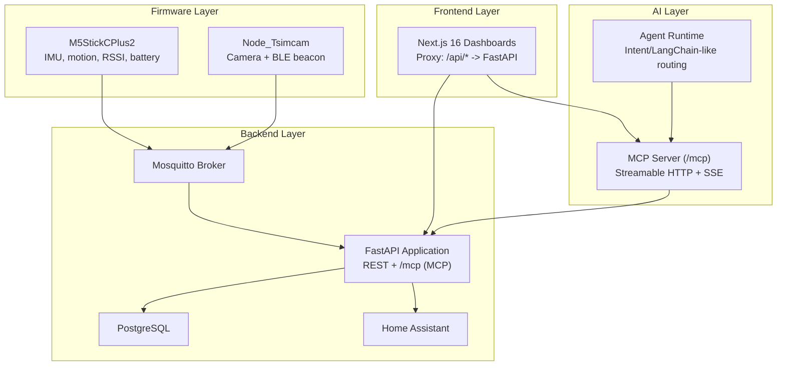
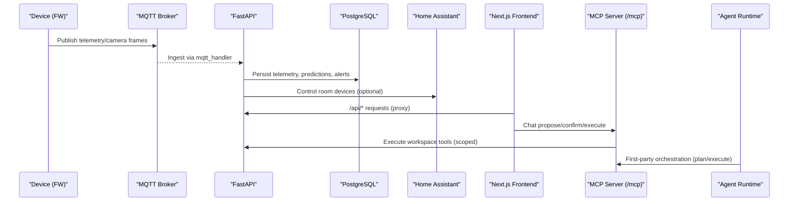
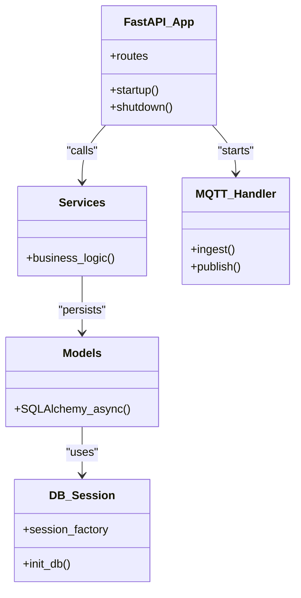
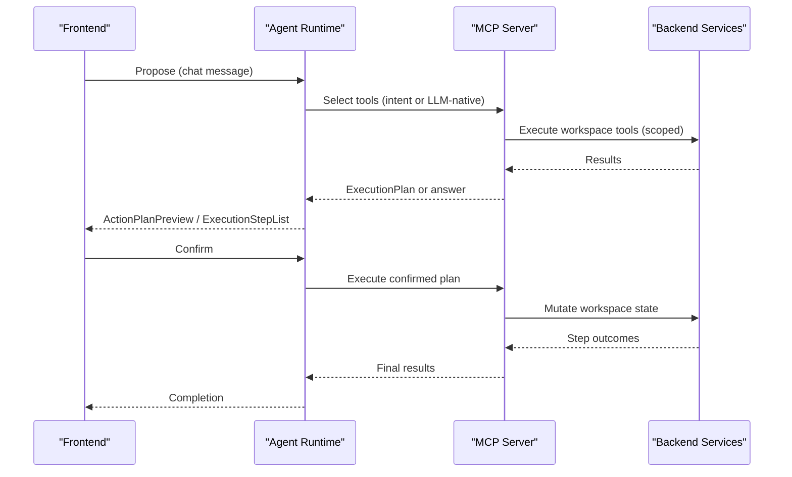
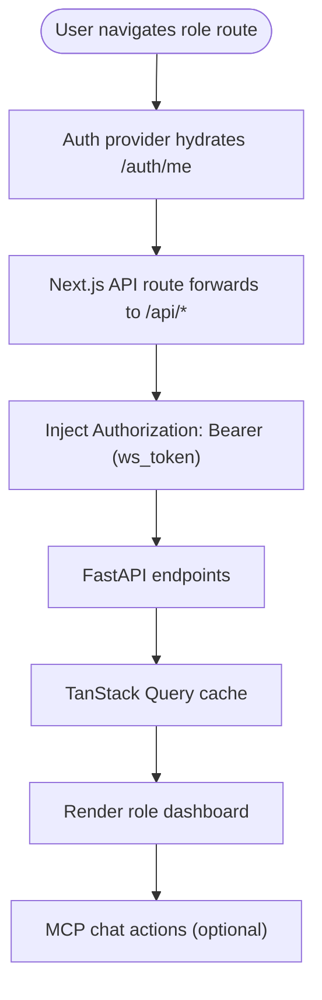
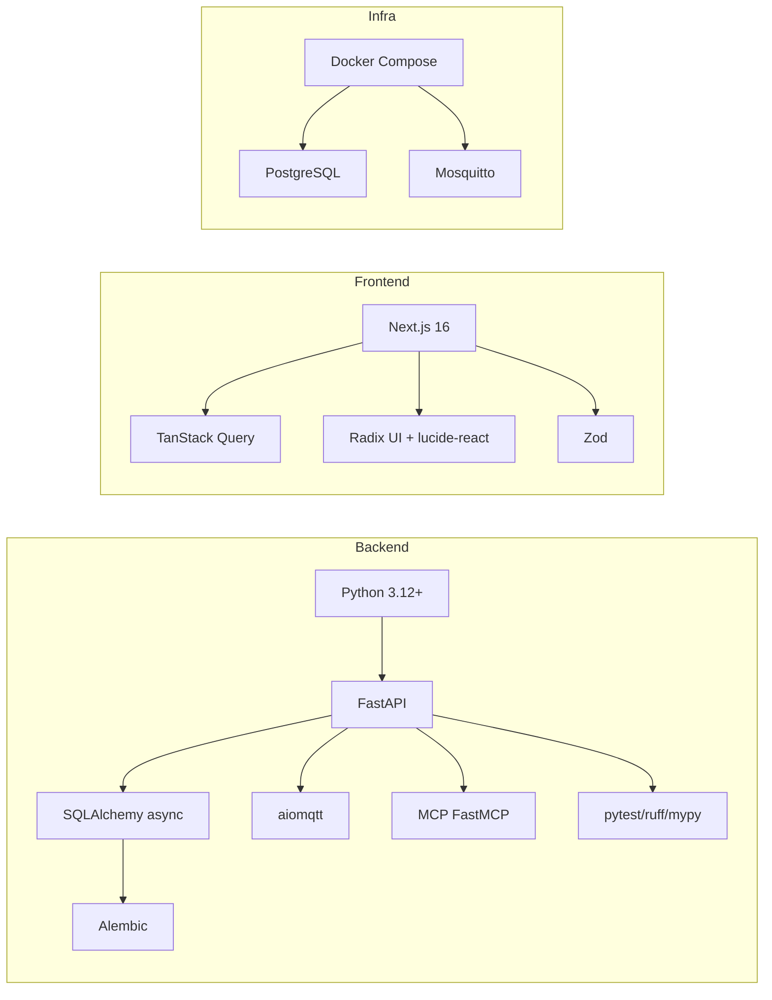

# Architecture & Design

<cite>
**Referenced Files in This Document**
- [ARCHITECTURE.md](file://docs/ARCHITECTURE.md)
- [README.md](file://README.md)
- [server/AGENTS.md](file://server/AGENTS.md)
- [server/app/main.py](file://server/app/main.py)
- [server/app/mcp/server.py](file://server/app/mcp/server.py)
- [server/docker-compose.yml](file://server/docker-compose.yml)
- [server/pyproject.toml](file://server/pyproject.toml)
- [frontend/package.json](file://frontend/package.json)
- [frontend/app/layout.tsx](file://frontend/app/layout.tsx)
- [docs/adr/README.md](file://docs/adr/README.md)
- [docs/adr/0001-fastmcp-sse-for-ai-integration.md](file://docs/adr/0001-fastmcp-sse-for-ai-integration.md)
- [docs/adr/0007-tdd-service-layer-architecture.md](file://docs/adr/0007-tdd-service-layer-architecture.md)
- [docs/adr/0008-workflow-domains-for-role-operations.md](file://docs/adr/0008-workflow-domains-for-role-operations.md)
- [docs/adr/0014-llm-native-mcp-tool-routing.md](file://docs/adr/0014-llm-native-mcp-tool-routing.md)
</cite>

## Table of Contents
1. [Introduction](#introduction)
2. [Project Structure](#project-structure)
3. [Core Components](#core-components)
4. [Architecture Overview](#architecture-overview)
5. [Detailed Component Analysis](#detailed-component-analysis)
6. [Dependency Analysis](#dependency-analysis)
7. [Performance Considerations](#performance-considerations)
8. [Troubleshooting Guide](#troubleshooting-guide)
9. [Conclusion](#conclusion)
10. [Appendices](#appendices)

## Introduction
This document describes the WheelSense Platform architecture and design. It explains the layered runtime (firmware, backend, frontend, AI), microservices approach, event-driven communication via MQTT, and workspace-based multi-tenancy. It synthesizes architectural decisions recorded as Architectural Decision Records (ADRs), outlines infrastructure and deployment topology, and documents cross-cutting concerns such as security, monitoring, and observability. The goal is to help contributors and operators understand how the system is organized, how components interact, and how to extend and operate the platform safely and scalably.

## Project Structure
The repository is organized into four primary runtime layers:
- Firmware: PlatformIO-based devices publishing telemetry and camera data over MQTT
- Backend: FastAPI application with PostgreSQL, MQTT ingestion, localization, MCP server, and AI orchestration
- Frontend: Next.js 16 role-based dashboards with a proxy to backend APIs
- AI: Model Context Protocol (MCP) server and agent runtime orchestrating plan/ground/execute flows

**Diagram sources**
- [ARCHITECTURE.md](file://docs/ARCHITECTURE.md)
- [server/app/main.py](file://server/app/main.py)
- [server/AGENTS.md](file://server/AGENTS.md)

**Section sources**
- [README.md](file://README.md)
- [ARCHITECTURE.md](file://docs/ARCHITECTURE.md)

## Core Components
- Firmware devices publish telemetry and camera frames to MQTT topics. The backend ingests and normalizes these events into database records and triggers derived workflows (localization, vitals, alerts).
- The backend exposes REST APIs consumed by the frontend and integrates with Home Assistant for room actuation. It also hosts an authenticated MCP server at /mcp with 28 workspace tools, 6 role-based prompts, and 4 live data resources.
- The agent runtime orchestrates plan/ground/execute flows for chat actions, with configurable routing modes (intent-based or LLM-native tool selection).
- The frontend is a role-based Next.js application that proxies API calls to the backend and renders dashboards for administrators, head nurses, supervisors, observers, and patients.

**Section sources**
- [server/AGENTS.md](file://server/AGENTS.md)
- [ARCHITECTURE.md](file://docs/ARCHITECTURE.md)
- [server/app/main.py](file://server/app/main.py)
- [server/app/mcp/server.py](file://server/app/mcp/server.py)

## Architecture Overview
WheelSense employs a layered, event-driven architecture:
- Layered runtime: firmware → backend → frontend → AI
- Microservices approach: FastAPI as the primary service; MQTT broker and database as shared infrastructure; optional AI runtime and MCP server co-located
- Event-driven communication: MQTT topics carry telemetry, camera frames, and control acknowledgements
- Workspace-based multi-tenancy: all APIs and MCP tools scope by current user’s workspace
- Security: JWT-based session management, bearer auth for MCP, OAuth discovery metadata, and scope enforcement

**Diagram sources**
- [server/AGENTS.md](file://server/AGENTS.md)
- [server/app/main.py](file://server/app/main.py)
- [server/app/mcp/server.py](file://server/app/mcp/server.py)

## Detailed Component Analysis

### Backend: FastAPI, Services, and Data Layer
- Entry and lifecycle: startup initializes DB, admin bootstrap, MQTT listener, and retention scheduler; shutdown cancels tasks cleanly.
- Service layer architecture: business logic encapsulated in services; endpoints and MQTT handlers delegate to services.
- Data modeling: SQLAlchemy async models backed by PostgreSQL; migrations managed by Alembic.
- API surface: REST endpoints under /api; includes auth, patients, devices, alerts, workflow, analytics, and integrations.

**Diagram sources**
- [server/app/main.py](file://server/app/main.py)
- [server/AGENTS.md](file://server/AGENTS.md)

**Section sources**
- [server/app/main.py](file://server/app/main.py)
- [server/AGENTS.md](file://server/AGENTS.md)

### MCP Server and AI Orchestration
- MCP server mounted at /mcp with Streamable HTTP primary and SSE compatibility. Authentication uses bearer tokens and optional origin gating; OAuth discovery metadata is published at /.well-known.
- Actor context: user_id, workspace_id, role, patient_id, caregiver_id, and effective scopes are carried via contextvars.
- Workspace tools: 28 tools across domains (patients, devices, alerts, rooms, workflow, messaging, AI settings, system). Tools enforce scope-based authorization.
- Prompts: 6 role-based prompts guide safe AI assistance.
- Resources: 4 live data URIs for current user, visible patients, active alerts, and rooms.
- Agent runtime: plan/ground/execute orchestration; routing modes include intent-based and LLM-native tool selection with fallback.

**Diagram sources**
- [server/AGENTS.md](file://server/AGENTS.md)
- [server/app/mcp/server.py](file://server/app/mcp/server.py)

**Section sources**
- [server/AGENTS.md](file://server/AGENTS.md)
- [server/app/mcp/server.py](file://server/app/mcp/server.py)
- [docs/adr/0001-fastmcp-sse-for-ai-integration.md](file://docs/adr/0001-fastmcp-sse-for-ai-integration.md)
- [docs/adr/0014-llm-native-mcp-tool-routing.md](file://docs/adr/0014-llm-native-mcp-tool-routing.md)

### Frontend: Next.js Role-Based Dashboards
- Next.js 16 App Router with role-based pages and proxies to backend APIs.
- Cookie-based auth using HttpOnly ws_token; proxy injects Authorization: Bearer on requests.
- TanStack Query for client caching; explicit queryKey namespaces and defaults.
- Role navigation and sidebar configuration; in-app alert toasts and notification deep links.

**Diagram sources**
- [ARCHITECTURE.md](file://docs/ARCHITECTURE.md)
- [frontend/app/layout.tsx](file://frontend/app/layout.tsx)

**Section sources**
- [ARCHITECTURE.md](file://docs/ARCHITECTURE.md)
- [frontend/package.json](file://frontend/package.json)
- [frontend/app/layout.tsx](file://frontend/app/layout.tsx)

### Firmware: Telemetry and Camera Nodes
- M5StickCPlus2 publishes IMU, motion, RSSI, and battery telemetry to MQTT.
- Node_Tsimcam publishes camera registration, status, and photo chunks; supports control commands.
- Topics include device-specific control/ack channels and derived broadcasts (room predictions, vitals, alerts).

**Section sources**
- [ARCHITECTURE.md](file://docs/ARCHITECTURE.md)
- [server/AGENTS.md](file://server/AGENTS.md)

### MQTT Communication and Data Flows
- Topics: WheelSense/data (telemetry), WheelSense/camera/{device_id}/registration/status/photo, control/ack channels, derived broadcasts.
- Ingestion: mqtt_handler parses payloads, resolves devices, writes telemetry, runs room prediction, and publishes room updates.
- Camera flow: registration/status updates device registry; photo chunks assembled into records; control commands published to camera.

**Section sources**
- [server/AGENTS.md](file://server/AGENTS.md)

### Workspace-Based Multi-Tenancy and RBAC
- All protected APIs and MCP tools scope by current user.workspace_id.
- Role-based capabilities and visibility policies govern access to patients, alerts, devices, workflow, and rooms.
- Patient visibility is enforced centrally; caregiver ↔ patient access is governed by explicit assignment tables.

**Section sources**
- [server/AGENTS.md](file://server/AGENTS.md)

### Architectural Decision Records (ADRs)
- ADR-0001: Use FastMCP SSE for AI integration — MCP mounted within FastAPI for simplicity and shared service layer.
- ADR-0007: TDD with Service Layer Architecture — strict separation of business logic, test-driven development, quality gates.
- ADR-0008: Workflow domains for role operations — introduce first-class workflow module with RBAC and auditability.
- ADR-0014: LLM-native MCP tool routing — introduce AGENT_ROUTING_MODE supporting LLM-native tool selection with fallback.

**Section sources**
- [docs/adr/README.md](file://docs/adr/README.md)
- [docs/adr/0001-fastmcp-sse-for-ai-integration.md](file://docs/adr/0001-fastmcp-sse-for-ai-integration.md)
- [docs/adr/0007-tdd-service-layer-architecture.md](file://docs/adr/0007-tdd-service-layer-architecture.md)
- [docs/adr/0008-workflow-domains-for-role-operations.md](file://docs/adr/0008-workflow-domains-for-role-operations.md)
- [docs/adr/0014-llm-native-mcp-tool-routing.md](file://docs/adr/0014-llm-native-mcp-tool-routing.md)

## Dependency Analysis
- Backend runtime dependencies: Python 3.12+, FastAPI, SQLAlchemy async, Alembic, aiomqtt, MCP FastMCP, and test/tooling (pytest, ruff, mypy).
- Frontend runtime dependencies: Next.js 16, TanStack Query, Radix UI, react-hook-form, zod, sonner, lucide-react, tailwindcss.
- Deployment dependencies: Docker Compose with shared core stack and environment-specific data fragments; Mosquitto and PostgreSQL services.

**Diagram sources**
- [server/pyproject.toml](file://server/pyproject.toml)
- [frontend/package.json](file://frontend/package.json)
- [server/docker-compose.yml](file://server/docker-compose.yml)

**Section sources**
- [server/pyproject.toml](file://server/pyproject.toml)
- [frontend/package.json](file://frontend/package.json)
- [server/docker-compose.yml](file://server/docker-compose.yml)

## Performance Considerations
- Service layer separation reduces duplication and improves testability; shared service methods minimize round-trips.
- MQTT ingestion is asynchronous and event-driven; ensure adequate broker capacity and topic fan-out for derived broadcasts.
- MCP tool execution occurs within the same process as REST; monitor latency and consider authentication gating before enabling remote access.
- Frontend caching via TanStack Query reduces backend load; tune staleTime/refetchInterval per route for optimal UX and freshness.

[No sources needed since this section provides general guidance]

## Troubleshooting Guide
- Health and MCP discovery: GET /api/health and /.well-known/oauth-protected-resource/mcp provide quick checks.
- Session and auth: Verify ws_token cookie presence and HttpOnly behavior; backend validates active sessions and rejects revoked/expired ones.
- MCP routing: If AGENT_ROUTING_MODE=llm_tools, ensure OLLAMA_BASE_URL is reachable; fallback to intent mode when LLM router fails.
- MQTT topics: Confirm device registration and aliases; verify node_device_id bindings and room predictions converge to a stable state.

**Section sources**
- [server/app/main.py](file://server/app/main.py)
- [server/AGENTS.md](file://server/AGENTS.md)

## Conclusion
WheelSense Platform combines a firmware telemetry layer, a FastAPI backend with a robust service layer, a role-based Next.js frontend, and an MCP-powered AI orchestration layer. The system emphasizes workspace-based multi-tenancy, event-driven communication via MQTT, and test-driven development with clear separation of concerns. ADRs codify key architectural decisions, guiding evolution toward scalable, secure, and operable deployments.

[No sources needed since this section summarizes without analyzing specific files]

## Appendices

### System Context and Integration Patterns
- Device-to-broker-to-backend ingestion via MQTT
- Backend-to-frontend API proxy with cookie-based auth
- MCP server as the AI integration layer with OAuth discovery and scope enforcement
- Home Assistant integration for room actuation

**Section sources**
- [server/AGENTS.md](file://server/AGENTS.md)
- [ARCHITECTURE.md](file://docs/ARCHITECTURE.md)

### Infrastructure Requirements and Deployment Topology
- Backend: FastAPI app, PostgreSQL, Mosquitto, optional Copilot CLI profile
- Frontend: Next.js web service (Docker image compiled at build time)
- Profiles: Production DB mode and mock/simulator mode using Compose includes

**Section sources**
- [server/docker-compose.yml](file://server/docker-compose.yml)
- [ARCHITECTURE.md](file://docs/ARCHITECTURE.md)

### Technology Stack and Version Compatibility
- Backend: Python 3.12+, FastAPI, SQLAlchemy async, Alembic, aiomqtt, MCP FastMCP
- Frontend: Next.js 16, TanStack Query, Zod, radix-ui, sonner, lucide-react
- Tooling: pytest, ruff, mypy, ESLint, TailwindCSS

**Section sources**
- [server/pyproject.toml](file://server/pyproject.toml)
- [frontend/package.json](file://frontend/package.json)

### Extensibility and Adding Features
- Follow the service layer pattern: encapsulate business logic in services and call them from endpoints and MQTT handlers
- Use TDD: write tests first, implement minimal passing code, refactor, and maintain coverage
- Respect workspace scoping and RBAC: all new endpoints/tools must enforce current_user.workspace_id and role-based permissions
- Leverage MCP: add new tools to the workspace registry and prompts/resources as needed; ensure scope enforcement and proper error handling

**Section sources**
- [docs/adr/0007-tdd-service-layer-architecture.md](file://docs/adr/0007-tdd-service-layer-architecture.md)
- [server/AGENTS.md](file://server/AGENTS.md)