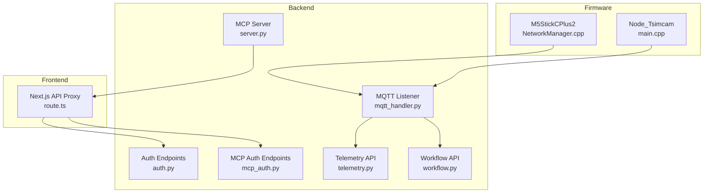
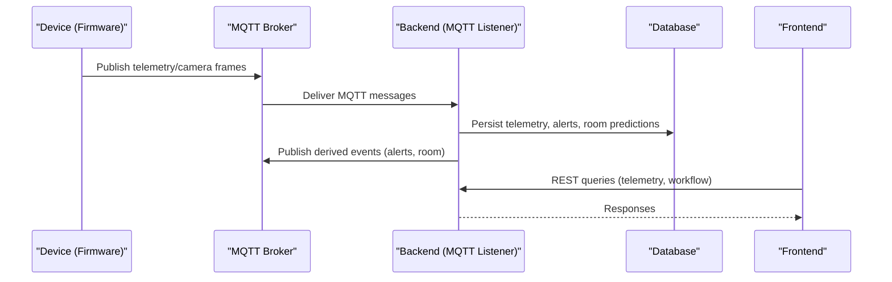
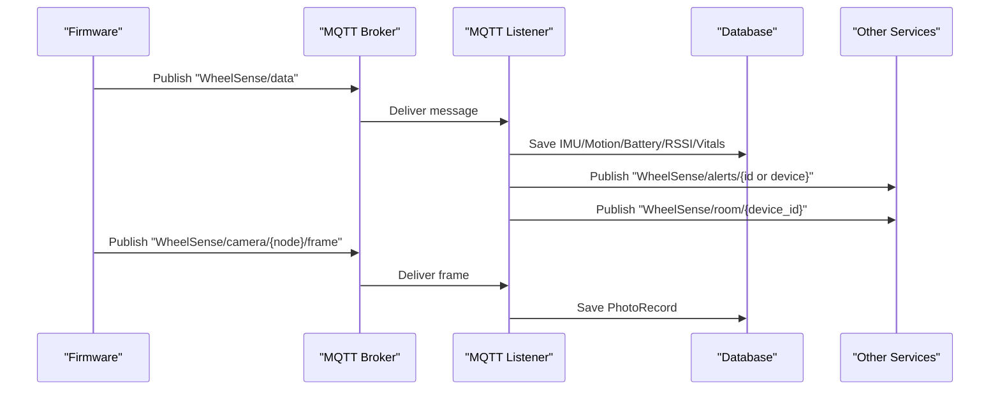
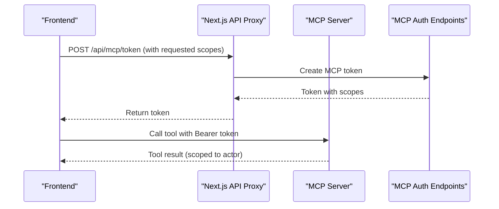
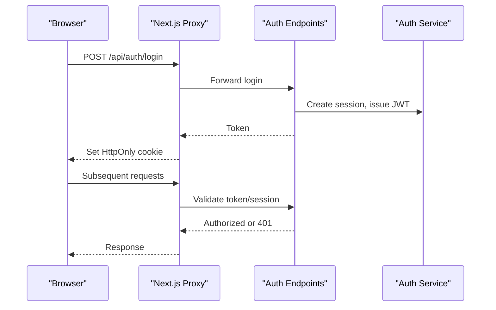
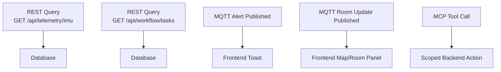
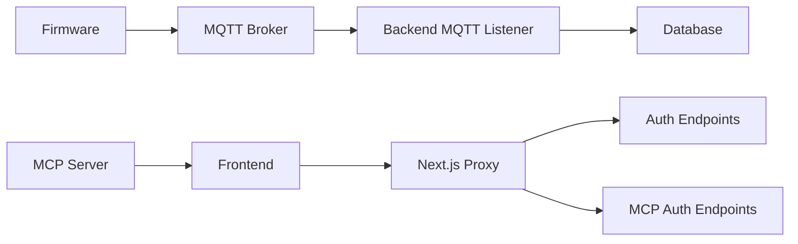

# Component Interactions & Communication

<cite>
**Referenced Files in This Document**
- [mqtt_handler.py](file://server/app/mqtt_handler.py)
- [NetworkManager.cpp](file://firmware/M5StickCPlus2/src/managers/NetworkManager.cpp)
- [main.cpp](file://firmware/Node_Tsimcam/src/main.cpp)
- [server.py](file://server/app/mcp/server.py)
- [mcp_server.py](file://server/app/mcp_server.py)
- [mcp_auth.py](file://server/app/api/endpoints/mcp_auth.py)
- [auth.py](file://server/app/api/endpoints/auth.py)
- [route.ts](file://frontend/app/api/[[...path]]/route.ts)
- [telemetry.py](file://server/app/api/endpoints/telemetry.py)
- [workflow.py](file://server/app/api/endpoints/workflow.py)
- [auth.py](file://server/app/services/auth.py)
- [test_mqtt_handler.py](file://server/tests/test_mqtt_handler.py)
- [MCP-README.md](file://docs/MCP-README.md)
- [0014-llm-native-mcp-tool-routing.md](file://docs/adr/0014-llm-native-mcp-tool-routing.md)
- [0001-fastmcp-sse-for-ai-integration.md](file://docs/adr/0001-fastmcp-sse-for-ai-integration.md)
- [0005-camera-photo-only-internet-independent.md](file://docs/adr/0005-camera-photo-only-internet-independent.md)
- [ARCHITECTURE.md](file://docs/ARCHITECTURE.md)
</cite>

## Table of Contents
1. [Introduction](#introduction)
2. [Project Structure](#project-structure)
3. [Core Components](#core-components)
4. [Architecture Overview](#architecture-overview)
5. [Detailed Component Analysis](#detailed-component-analysis)
6. [Dependency Analysis](#dependency-analysis)
7. [Performance Considerations](#performance-considerations)
8. [Troubleshooting Guide](#troubleshooting-guide)
9. [Conclusion](#conclusion)

## Introduction
This document explains how the platform coordinates device telemetry, AI tool execution via Model Context Protocol (MCP), and real-time updates through MQTT and HTTP/SSE-like proxies. It documents event-driven flows from firmware to backend services and frontend components, including authentication and authorization, cross-component data sharing, and error handling strategies.

## Project Structure
The system integrates three primary communication channels:
- MQTT pub/sub for device telemetry, camera frames, and room commands
- MCP for AI tool execution and resource access
- HTTP proxy with JWT-based authentication and session tracking for frontend-backend interactions

**Diagram sources**
- [mqtt_handler.py:73-136](file://server/app/mqtt_handler.py#L73-L136)
- [NetworkManager.cpp:81-113](file://firmware/M5StickCPlus2/src/managers/NetworkManager.cpp#L81-L113)
- [main.cpp:500-552](file://firmware/Node_Tsimcam/src/main.cpp#L500-L552)
- [server.py:110-111](file://server/app/mcp/server.py#L110-L111)
- [auth.py:57-105](file://server/app/api/endpoints/auth.py#L57-L105)
- [mcp_auth.py:93-178](file://server/app/api/endpoints/mcp_auth.py#L93-L178)
- [telemetry.py:15-73](file://server/app/api/endpoints/telemetry.py#L15-L73)
- [workflow.py:110-134](file://server/app/api/endpoints/workflow.py#L110-L134)
- [route.ts:127-258](file://frontend/app/api/[[...path]]/route.ts#L127-L258)

**Section sources**
- [mqtt_handler.py:73-136](file://server/app/mqtt_handler.py#L73-L136)
- [NetworkManager.cpp:81-113](file://firmware/M5StickCPlus2/src/managers/NetworkManager.cpp#L81-L113)
- [main.cpp:500-552](file://firmware/Node_Tsimcam/src/main.cpp#L500-L552)
- [server.py:110-111](file://server/app/mcp/server.py#L110-L111)
- [auth.py:57-105](file://server/app/api/endpoints/auth.py#L57-L105)
- [mcp_auth.py:93-178](file://server/app/api/endpoints/mcp_auth.py#L93-L178)
- [telemetry.py:15-73](file://server/app/api/endpoints/telemetry.py#L15-L73)
- [workflow.py:110-134](file://server/app/api/endpoints/workflow.py#L110-L134)
- [route.ts:127-258](file://frontend/app/api/[[...path]]/route.ts#L127-L258)

## Core Components
- MQTT listener and handlers ingest telemetry, camera status/photo, and device acknowledgments, persisting data and publishing derived events.
- Firmware components connect to MQTT, publish telemetry and camera frames, and subscribe to room and control topics.
- MCP server exposes tools/resources for AI workflows, enforcing scope-based authorization and enabling device control and room operations.
- Authentication and session management secure HTTP interactions and MCP token issuance.
- Frontend proxies API calls, injecting JWT cookies and handling impersonation and session lifecycle.

**Section sources**
- [mqtt_handler.py:139-325](file://server/app/mqtt_handler.py#L139-L325)
- [NetworkManager.cpp:216-238](file://firmware/M5StickCPlus2/src/managers/NetworkManager.cpp#L216-L238)
- [main.cpp:500-552](file://firmware/Node_Tsimcam/src/main.cpp#L500-L552)
- [server.py:283-706](file://server/app/mcp/server.py#L283-L706)
- [auth.py:57-105](file://server/app/api/endpoints/auth.py#L57-L105)
- [mcp_auth.py:93-178](file://server/app/api/endpoints/mcp_auth.py#L93-L178)
- [route.ts:127-258](file://frontend/app/api/[[...path]]/route.ts#L127-L258)

## Architecture Overview
The platform follows an event-driven architecture:
- Devices publish telemetry and camera frames to MQTT topics.
- Backend MQTT listener processes messages, persists data, and publishes derived events (alerts, room predictions).
- Frontend consumes REST APIs and receives real-time updates via the Next.js proxy.
- MCP enables AI agents to execute tools scoped to the authenticated actor’s workspace and role.

**Diagram sources**
- [mqtt_handler.py:108-136](file://server/app/mqtt_handler.py#L108-L136)
- [telemetry.py:15-73](file://server/app/api/endpoints/telemetry.py#L15-L73)
- [workflow.py:110-134](file://server/app/api/endpoints/workflow.py#L110-L134)

## Detailed Component Analysis

### MQTT Pub/Sub for Telemetry and Camera
- Topics subscribed by backend include telemetry, camera registration/status/photo/frame, and device acknowledgments.
- Handlers parse payloads, register devices, persist IMU/motion/battery/RSSI/vitals, detect falls, infer room predictions, and publish alerts and room updates.
- Firmware connects to MQTT, publishes telemetry and camera frames, and subscribes to room and control topics.

**Diagram sources**
- [mqtt_handler.py:108-136](file://server/app/mqtt_handler.py#L108-L136)
- [mqtt_handler.py:139-325](file://server/app/mqtt_handler.py#L139-L325)
- [NetworkManager.cpp:216-238](file://firmware/M5StickCPlus2/src/managers/NetworkManager.cpp#L216-L238)
- [main.cpp:500-552](file://firmware/Node_Tsimcam/src/main.cpp#L500-L552)

**Section sources**
- [mqtt_handler.py:108-136](file://server/app/mqtt_handler.py#L108-L136)
- [mqtt_handler.py:139-325](file://server/app/mqtt_handler.py#L139-L325)
- [NetworkManager.cpp:216-238](file://firmware/M5StickCPlus2/src/managers/NetworkManager.cpp#L216-L238)
- [main.cpp:500-552](file://firmware/Node_Tsimcam/src/main.cpp#L500-L552)

### MCP (Model Context Protocol) for AI Tool Execution
- MCP server exposes tools/resources for patients, alerts, rooms, devices, workflow tasks/schedules, and camera control.
- Tools enforce scope-based authorization; execution occurs within the authenticated actor’s workspace and role.
- MCP endpoints issue short-lived, scope-narrowed tokens for external clients.

**Diagram sources**
- [server.py:283-706](file://server/app/mcp/server.py#L283-L706)
- [mcp_auth.py:93-178](file://server/app/api/endpoints/mcp_auth.py#L93-L178)
- [MCP-README.md:228-287](file://docs/MCP-README.md#L228-L287)

**Section sources**
- [server.py:283-706](file://server/app/mcp/server.py#L283-L706)
- [mcp_server.py:5-12](file://server/app/mcp_server.py#L5-L12)
- [mcp_auth.py:93-178](file://server/app/api/endpoints/mcp_auth.py#L93-L178)
- [MCP-README.md:228-287](file://docs/MCP-README.md#L228-L287)
- [0014-llm-native-mcp-tool-routing.md:1-20](file://docs/adr/0014-llm-native-mcp-tool-routing.md#L1-L20)

### Authentication and Authorization Flows
- HTTP authentication uses JWT with server-tracked sessions and HttpOnly cookies.
- The Next.js proxy forwards Authorization headers and manages impersonation via backup cookies.
- MCP tokens are issued with narrow scopes and tied to active auth sessions.

**Diagram sources**
- [auth.py:57-105](file://server/app/api/endpoints/auth.py#L57-L105)
- [auth.py:588-626](file://server/app/services/auth.py#L588-L626)
- [route.ts:127-258](file://frontend/app/api/[[...path]]/route.ts#L127-L258)
- [ARCHITECTURE.md:140-183](file://docs/ARCHITECTURE.md#L140-L183)

**Section sources**
- [auth.py:57-105](file://server/app/api/endpoints/auth.py#L57-L105)
- [auth.py:588-626](file://server/app/services/auth.py#L588-L626)
- [route.ts:127-258](file://frontend/app/api/[[...path]]/route.ts#L127-L258)
- [ARCHITECTURE.md:140-183](file://docs/ARCHITECTURE.md#L140-L183)

### Real-Time Updates and Cross-Component Data Sharing
- REST endpoints serve telemetry and workflow data; clients use TanStack Query for caching and polling.
- Derived MQTT events (alerts, room predictions) feed frontend dashboards and notifications.
- MCP tools enable AI agents to propose and execute actions scoped to the actor’s visibility.

**Diagram sources**
- [telemetry.py:15-73](file://server/app/api/endpoints/telemetry.py#L15-L73)
- [workflow.py:110-134](file://server/app/api/endpoints/workflow.py#L110-L134)
- [mqtt_handler.py:293-310](file://server/app/mqtt_handler.py#L293-L310)
- [mqtt_handler.py:312-324](file://server/app/mqtt_handler.py#L312-L324)

**Section sources**
- [telemetry.py:15-73](file://server/app/api/endpoints/telemetry.py#L15-L73)
- [workflow.py:110-134](file://server/app/api/endpoints/workflow.py#L110-L134)
- [mqtt_handler.py:293-324](file://server/app/mqtt_handler.py#L293-L324)

## Dependency Analysis
- Firmware depends on MQTT broker configuration and publishes to device-specific topics.
- Backend MQTT listener depends on SQLAlchemy sessions and aiomqtt for broker connectivity.
- MCP server depends on FastMCP and enforces actor context and scopes.
- Frontend proxy depends on Next.js App Router and forwards cookies and Authorization headers.

**Diagram sources**
- [NetworkManager.cpp:81-113](file://firmware/M5StickCPlus2/src/managers/NetworkManager.cpp#L81-L113)
- [mqtt_handler.py:73-136](file://server/app/mqtt_handler.py#L73-L136)
- [route.ts:127-258](file://frontend/app/api/[[...path]]/route.ts#L127-L258)
- [server.py:110-111](file://server/app/mcp/server.py#L110-L111)

**Section sources**
- [NetworkManager.cpp:81-113](file://firmware/M5StickCPlus2/src/managers/NetworkManager.cpp#L81-L113)
- [mqtt_handler.py:73-136](file://server/app/mqtt_handler.py#L73-L136)
- [route.ts:127-258](file://frontend/app/api/[[...path]]/route.ts#L127-L258)
- [server.py:110-111](file://server/app/mcp/server.py#L110-L111)

## Performance Considerations
- MQTT message handling batches writes and publishes derived events asynchronously to minimize latency.
- Camera photo ingestion buffers chunks and persists assembled frames to disk and records to database.
- REST endpoints cap limits for telemetry and RSSI queries to control payload sizes.
- MCP tool execution is scoped to actor’s workspace and role to reduce unnecessary cross-domain lookups.

[No sources needed since this section provides general guidance]

## Troubleshooting Guide
Common issues and resolutions:
- MQTT connection drops: backend reconnects with exponential backoff; firmware retries connection with capped delays.
- Unregistered device telemetry: backend drops telemetry until device is registered; tests verify behavior.
- Camera photo chunk loss: backend requests missing chunks; firmware publishes frames with chunking and fallback mechanisms.
- Authentication session revocation: REST endpoints revoke sessions server-side; frontend clears cookies and handles impersonation stop.
- MCP token validation: tokens are tied to active sessions and validated on each use.

**Section sources**
- [mqtt_handler.py:73-136](file://server/app/mqtt_handler.py#L73-L136)
- [NetworkManager.cpp:81-113](file://firmware/M5StickCPlus2/src/managers/NetworkManager.cpp#L81-L113)
- [test_mqtt_handler.py:99-136](file://server/tests/test_mqtt_handler.py#L99-L136)
- [test_mqtt_handler.py:523-545](file://server/tests/test_mqtt_handler.py#L523-L545)
- [main.cpp:500-552](file://firmware/Node_Tsimcam/src/main.cpp#L500-L552)
- [auth.py:160-204](file://server/app/api/endpoints/auth.py#L160-L204)
- [auth.py:554-573](file://server/app/services/auth.py#L554-L573)
- [mcp_auth.py:93-178](file://server/app/api/endpoints/mcp_auth.py#L93-L178)
- [0005-camera-photo-only-internet-independent.md:58-61](file://docs/adr/0005-camera-photo-only-internet-independent.md#L58-L61)

## Conclusion
The platform’s event-driven design leverages MQTT for efficient device telemetry and camera ingestion, MCP for secure AI tool execution, and robust HTTP authentication with session tracking. Firmware components publish to well-defined topics, backend services transform raw data into actionable insights, and the frontend consumes curated REST and MQTT-derived signals. Clear authorization boundaries and resilient error handling ensure reliable operation across devices, backend services, and user interfaces.