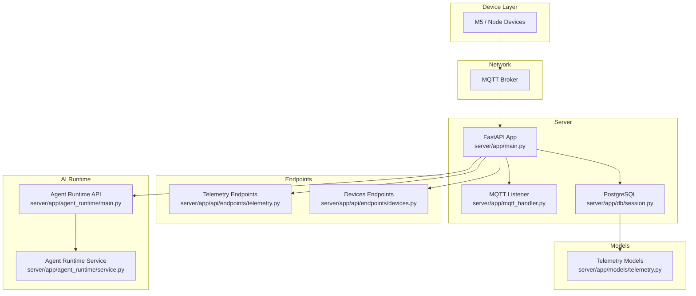
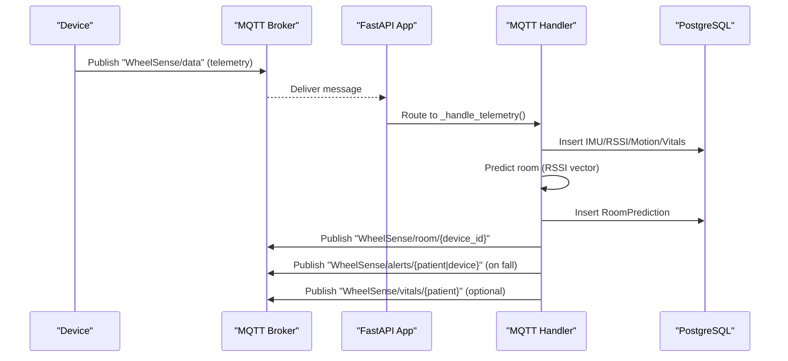
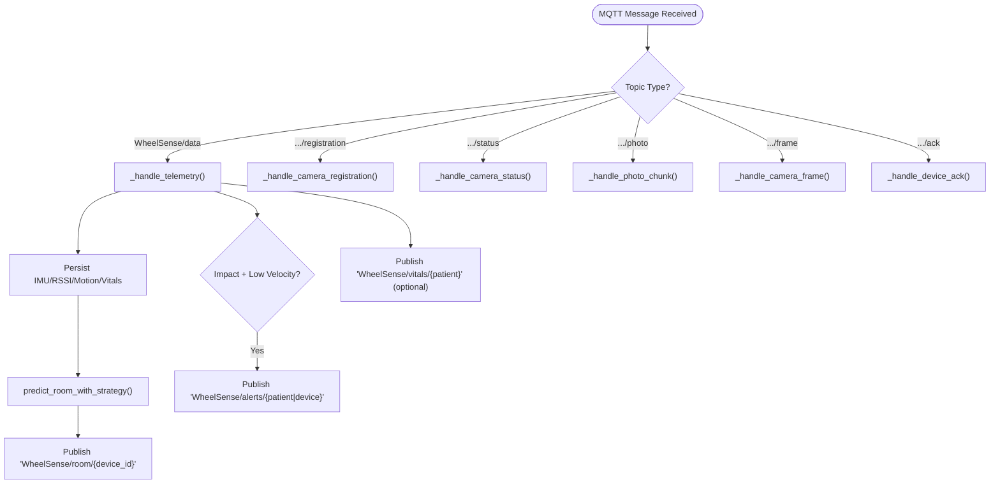
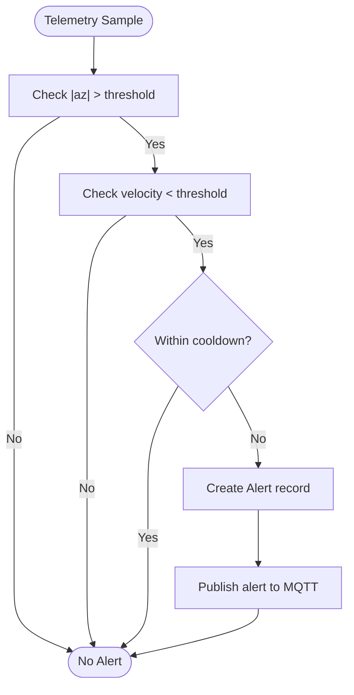
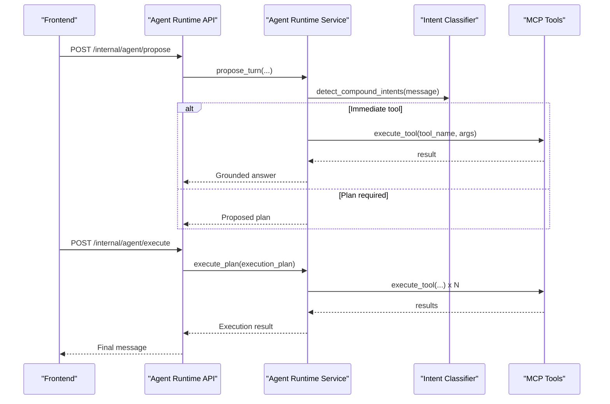
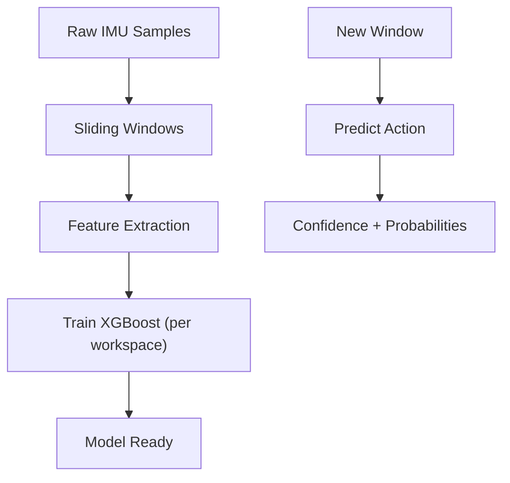
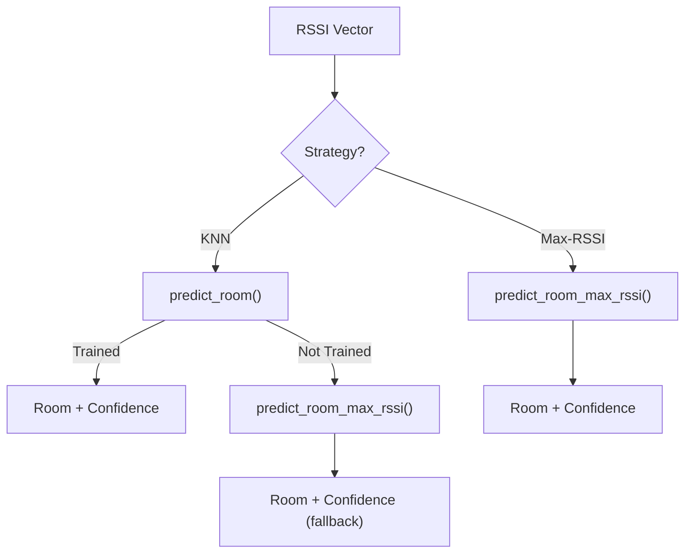
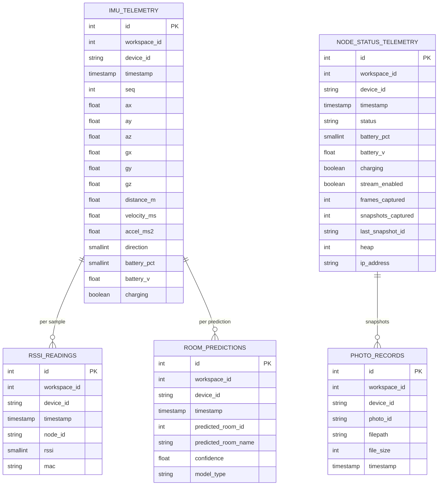
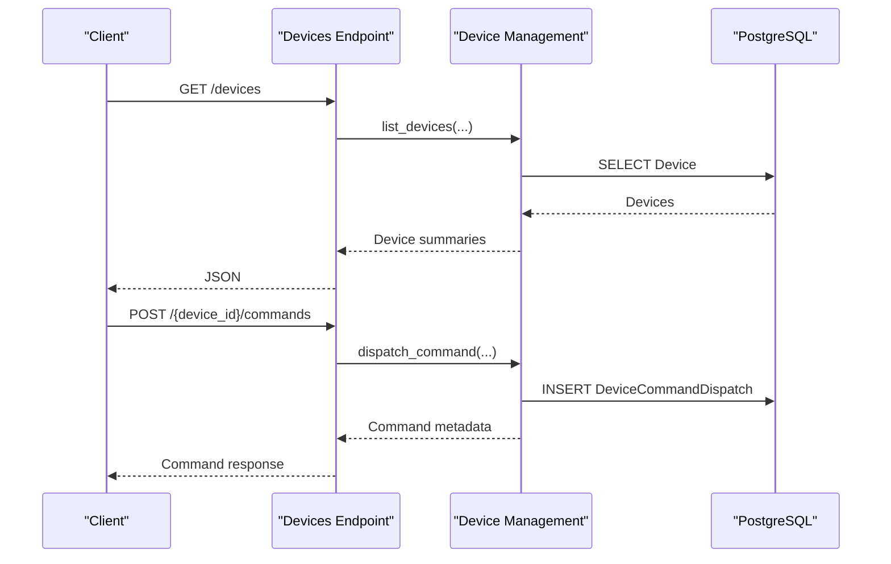
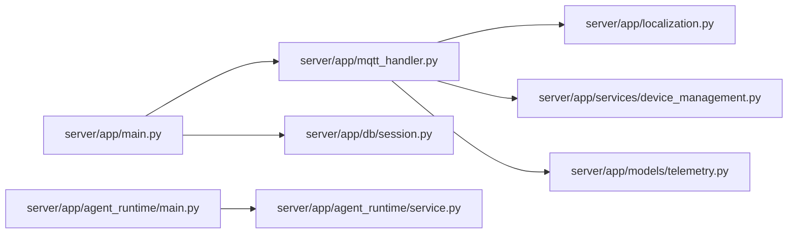

# Data Flow & Processing Architecture

<cite>
**Referenced Files in This Document**
- [server/app/main.py](file://server/app/main.py)
- [server/app/mqtt_handler.py](file://server/app/mqtt_handler.py)
- [server/app/localization.py](file://server/app/localization.py)
- [server/app/motion_classifier.py](file://server/app/motion_classifier.py)
- [server/app/feature_engineering.py](file://server/app/feature_engineering.py)
- [server/app/models/telemetry.py](file://server/app/models/telemetry.py)
- [server/app/api/endpoints/telemetry.py](file://server/app/api/endpoints/telemetry.py)
- [server/app/api/endpoints/devices.py](file://server/app/api/endpoints/devices.py)
- [server/app/db/session.py](file://server/app/db/session.py)
- [server/app/services/device_management.py](file://server/app/services/device_management.py)
- [server/app/agent_runtime/main.py](file://server/app/agent_runtime/main.py)
- [server/app/agent_runtime/service.py](file://server/app/agent_runtime/service.py)
</cite>

## Table of Contents
1. [Introduction](#introduction)
2. [Project Structure](#project-structure)
3. [Core Components](#core-components)
4. [Architecture Overview](#architecture-overview)
5. [Detailed Component Analysis](#detailed-component-analysis)
6. [Dependency Analysis](#dependency-analysis)
7. [Performance Considerations](#performance-considerations)
8. [Troubleshooting Guide](#troubleshooting-guide)
9. [Conclusion](#conclusion)

## Introduction
This document explains the end-to-end data flow and processing architecture of the platform, focusing on:
- Device telemetry ingestion (device → MQTT → backend)
- Real-time room localization and alerts
- Motion classification and training pipeline
- AI agent runtime for intent classification and plan execution
- Data persistence, caching, and performance characteristics

It synthesizes concrete implementation details from the backend to provide a practical understanding of how data moves, transforms, and is persisted across the system.

## Project Structure
The backend is a FastAPI application that:
- Starts an MQTT listener as a background task
- Exposes REST endpoints for querying telemetry and managing devices
- Provides AI agent runtime endpoints for intent classification and plan execution
- Persists data into a PostgreSQL database using SQLAlchemy async sessions

**Diagram sources**
- [server/app/main.py:1-123](file://server/app/main.py#L1-L123)
- [server/app/mqtt_handler.py:1-667](file://server/app/mqtt_handler.py#L1-L667)
- [server/app/db/session.py:1-64](file://server/app/db/session.py#L1-L64)
- [server/app/models/telemetry.py:1-222](file://server/app/models/telemetry.py#L1-L222)
- [server/app/api/endpoints/telemetry.py:1-73](file://server/app/api/endpoints/telemetry.py#L1-L73)
- [server/app/api/endpoints/devices.py:1-311](file://server/app/api/endpoints/devices.py#L1-L311)
- [server/app/agent_runtime/main.py:1-55](file://server/app/agent_runtime/main.py#L1-L55)
- [server/app/agent_runtime/service.py:1-561](file://server/app/agent_runtime/service.py#L1-L561)

**Section sources**
- [server/app/main.py:1-123](file://server/app/main.py#L1-L123)

## Core Components
- MQTT ingestion and processing: Handles device telemetry, camera registration/status/photo/frame, and ACKs; persists telemetry, derives room predictions, and emits alerts.
- Telemetry models: Define tables for IMU, RSSI, room predictions, training datasets, photos, and node status.
- Localization engine: Implements KNN and max-RSSI strategies to predict rooms from RSSI vectors.
- Motion classification: Provides sliding-window feature extraction and XGBoost-based action classification.
- Device management: Auto-registers devices, merges BLE/CAM identities, and maintains device registry.
- REST endpoints: Expose queries for IMU and RSSI telemetry, and device lifecycle operations.
- AI agent runtime: Classifies user intent, proposes execution plans, and executes MCP tools.

**Section sources**
- [server/app/mqtt_handler.py:1-667](file://server/app/mqtt_handler.py#L1-L667)
- [server/app/models/telemetry.py:1-222](file://server/app/models/telemetry.py#L1-L222)
- [server/app/localization.py:1-321](file://server/app/localization.py#L1-L321)
- [server/app/motion_classifier.py:1-246](file://server/app/motion_classifier.py#L1-L246)
- [server/app/feature_engineering.py:1-129](file://server/app/feature_engineering.py#L1-L129)
- [server/app/services/device_management.py:1-800](file://server/app/services/device_management.py#L1-L800)
- [server/app/api/endpoints/telemetry.py:1-73](file://server/app/api/endpoints/telemetry.py#L1-L73)
- [server/app/api/endpoints/devices.py:1-311](file://server/app/api/endpoints/devices.py#L1-L311)
- [server/app/agent_runtime/service.py:1-561](file://server/app/agent_runtime/service.py#L1-L561)

## Architecture Overview
The system follows a real-time ingestion pattern:
- Devices publish MQTT payloads to topics under the “WheelSense” namespace.
- The backend subscribes and routes messages to handlers that validate, transform, and persist data.
- Derived insights (room predictions, alerts) are published back to MQTT and/or persisted to the database.
- Frontend clients subscribe to relevant topics or call REST endpoints to render dashboards and alerts.

**Diagram sources**
- [server/app/mqtt_handler.py:100-325](file://server/app/mqtt_handler.py#L100-L325)
- [server/app/models/telemetry.py:20-154](file://server/app/models/telemetry.py#L20-L154)

## Detailed Component Analysis

### Device Telemetry Flow: Device → MQTT → Backend → Database → Frontend
- Topics handled:
  - “WheelSense/data”: IMU, motion, battery, RSSI, optional Polar HR
  - “WheelSense/camera/…/registration”, “status”, “photo”, “frame”
  - “WheelSense/…/ack”
- Processing highlights:
  - Validates and normalizes timestamps
  - Auto-registers devices if enabled
  - Persists IMU, RSSI, optional motion training data, and vitals
  - Derives room predictions via RSSI vector and publishes “WheelSense/room/{device_id}”
  - Emits real-time alerts (e.g., fall) to “WheelSense/alerts/{patient|device}”
  - Publishes vitals to “WheelSense/vitals/{patient}” when available

**Diagram sources**
- [server/app/mqtt_handler.py:100-325](file://server/app/mqtt_handler.py#L100-L325)
- [server/app/localization.py:268-290](file://server/app/localization.py#L268-L290)

**Section sources**
- [server/app/mqtt_handler.py:139-325](file://server/app/mqtt_handler.py#L139-L325)
- [server/app/localization.py:268-290](file://server/app/localization.py#L268-L290)
- [server/app/api/endpoints/telemetry.py:15-71](file://server/app/api/endpoints/telemetry.py#L15-L71)

### Data Validation and Transformation
- Timestamp normalization: ISO timestamp parsed or fallback to server time.
- Payload normalization: RSSI list, IMU fields, motion fields, battery fields.
- Room prediction: RSSI vector transformed and passed to localization strategy.
- Photo ingestion: Base64 chunks assembled and persisted; snapshot counters updated.

Concrete examples from the codebase:
- [server/app/mqtt_handler.py:139-325](file://server/app/mqtt_handler.py#L139-L325)
- [server/app/mqtt_handler.py:542-564](file://server/app/mqtt_handler.py#L542-L564)
- [server/app/mqtt_handler.py:485-540](file://server/app/mqtt_handler.py#L485-L540)

**Section sources**
- [server/app/mqtt_handler.py:139-325](file://server/app/mqtt_handler.py#L139-L325)
- [server/app/mqtt_handler.py:542-564](file://server/app/mqtt_handler.py#L542-L564)
- [server/app/mqtt_handler.py:485-540](file://server/app/mqtt_handler.py#L485-L540)

### Real-Time Alert Generation
- Fall detection thresholds: acceleration threshold and near-zero velocity.
- Cooldown mechanism prevents repeated alerts.
- Alert persistence and MQTT publication to targeted topic.

**Diagram sources**
- [server/app/mqtt_handler.py:246-311](file://server/app/mqtt_handler.py#L246-L311)
- [server/app/mqtt_handler.py:327-367](file://server/app/mqtt_handler.py#L327-L367)

**Section sources**
- [server/app/mqtt_handler.py:246-311](file://server/app/mqtt_handler.py#L246-L311)
- [server/app/mqtt_handler.py:327-367](file://server/app/mqtt_handler.py#L327-L367)

### Intent Classification and Plan Execution (AI Processing Flow)
- Agent runtime exposes internal endpoints for proposing turns and executing plans.
- Intent classifier detects compound/single intents, optionally normalizes message to English, and builds execution plans.
- For high-confidence read-only tools, immediate execution is performed; otherwise, a plan is proposed for confirmation.
- MCP tool execution is routed and grounded replies are generated.

**Diagram sources**
- [server/app/agent_runtime/main.py:30-55](file://server/app/agent_runtime/main.py#L30-L55)
- [server/app/agent_runtime/service.py:202-520](file://server/app/agent_runtime/service.py#L202-L520)

**Section sources**
- [server/app/agent_runtime/main.py:30-55](file://server/app/agent_runtime/main.py#L30-L55)
- [server/app/agent_runtime/service.py:202-520](file://server/app/agent_runtime/service.py#L202-L520)

### Motion Classification Pipeline
- Feature engineering: Sliding windows and statistical features from IMU samples.
- Model training: XGBoost classifier per workspace with label encoding.
- Prediction: Returns predicted label, confidence, and per-class probabilities.

**Diagram sources**
- [server/app/feature_engineering.py:89-129](file://server/app/feature_engineering.py#L89-L129)
- [server/app/motion_classifier.py:61-148](file://server/app/motion_classifier.py#L61-L148)
- [server/app/motion_classifier.py:150-177](file://server/app/motion_classifier.py#L150-L177)

**Section sources**
- [server/app/feature_engineering.py:25-88](file://server/app/feature_engineering.py#L25-L88)
- [server/app/motion_classifier.py:61-148](file://server/app/motion_classifier.py#L61-L148)
- [server/app/motion_classifier.py:150-177](file://server/app/motion_classifier.py#L150-L177)

### Room Localization Strategy
- Strategy selection: KNN or max-RSSI with fallback.
- KNN: Requires training data; predicts room with confidence.
- Max-RSSI: Strongest signal node mapped to a room via aliases.

**Diagram sources**
- [server/app/localization.py:268-290](file://server/app/localization.py#L268-L290)
- [server/app/localization.py:157-179](file://server/app/localization.py#L157-L179)
- [server/app/localization.py:215-265](file://server/app/localization.py#L215-L265)

**Section sources**
- [server/app/localization.py:268-290](file://server/app/localization.py#L268-L290)
- [server/app/localization.py:157-179](file://server/app/localization.py#L157-L179)
- [server/app/localization.py:215-265](file://server/app/localization.py#L215-L265)

### Data Persistence and Caching
- Database: PostgreSQL with async SQLAlchemy sessions; engine configured with pool settings.
- Telemetry tables: IMU, RSSI, room predictions, motion training data, photos, node status, vitals.
- Device registry: Auto-registration, BLE/CAM identity merging, and cleanup routines.
- Caching: In-memory room tracker and photo buffers; no external cache layer.

**Diagram sources**
- [server/app/models/telemetry.py:20-154](file://server/app/models/telemetry.py#L20-L154)

**Section sources**
- [server/app/db/session.py:18-64](file://server/app/db/session.py#L18-L64)
- [server/app/models/telemetry.py:20-154](file://server/app/models/telemetry.py#L20-L154)
- [server/app/services/device_management.py:635-761](file://server/app/services/device_management.py#L635-L761)

### User Interaction Flow
- REST endpoints support listing devices, querying device commands, assigning patients to devices, and ingesting mobile telemetry.
- Device auto-registration and BLE/CAM identity merging ensure consistent fleet views.

**Diagram sources**
- [server/app/api/endpoints/devices.py:63-263](file://server/app/api/endpoints/devices.py#L63-L263)
- [server/app/services/device_management.py:127-214](file://server/app/services/device_management.py#L127-L214)

**Section sources**
- [server/app/api/endpoints/devices.py:63-263](file://server/app/api/endpoints/devices.py#L63-L263)
- [server/app/services/device_management.py:127-214](file://server/app/services/device_management.py#L127-L214)

## Dependency Analysis
- Startup and lifecycle:
  - FastAPI app initializes database, admin user, and demo workspace.
  - Starts MQTT listener as a background task and retention scheduler based on configuration.
- MQTT handler depends on:
  - Localization module for room prediction
  - Device management for auto-registration and identity merging
  - Telemetry models for persistence
- Agent runtime depends on:
  - Intent classifier and MCP tool execution
  - Database sessions for user/workspace resolution

**Diagram sources**
- [server/app/main.py:26-66](file://server/app/main.py#L26-L66)
- [server/app/mqtt_handler.py:15-38](file://server/app/mqtt_handler.py#L15-L38)
- [server/app/localization.py:1-321](file://server/app/localization.py#L1-L321)
- [server/app/services/device_management.py:1-48](file://server/app/services/device_management.py#L1-L48)
- [server/app/models/telemetry.py:1-222](file://server/app/models/telemetry.py#L1-L222)
- [server/app/agent_runtime/main.py:1-55](file://server/app/agent_runtime/main.py#L1-L55)
- [server/app/agent_runtime/service.py:1-36](file://server/app/agent_runtime/service.py#L1-L36)

**Section sources**
- [server/app/main.py:26-66](file://server/app/main.py#L26-L66)
- [server/app/mqtt_handler.py:15-38](file://server/app/mqtt_handler.py#L15-L38)
- [server/app/agent_runtime/service.py:122-146](file://server/app/agent_runtime/service.py#L122-L146)

## Performance Considerations
- Asynchronous I/O: MQTT listener and REST endpoints use async/await; database sessions are async.
- Database pooling: Engine configured with pool_size and overflow for PostgreSQL.
- In-memory caches: Room tracker dictionary and photo buffer reduce I/O during multi-part photo assembly.
- Model locality: Motion and localization models are cached per workspace in memory.
- Concurrency: Background task for MQTT listener avoids blocking FastAPI lifecycle.

Recommendations:
- Tune database pool size and retention scheduler cadence for workload.
- Consider Redis for conversation context and room tracker persistence in multi-instance deployments.
- Batch writes for high-frequency telemetry if needed; current implementation persists per message.

**Section sources**
- [server/app/db/session.py:18-64](file://server/app/db/session.py#L18-L64)
- [server/app/mqtt_handler.py:42-46](file://server/app/mqtt_handler.py#L42-L46)
- [server/app/motion_classifier.py:25-36](file://server/app/motion_classifier.py#L25-L36)
- [server/app/localization.py:25-37](file://server/app/localization.py#L25-L37)

## Troubleshooting Guide
Common issues and diagnostics:
- MQTT connection drops: Reconnect loop logs warnings and retries.
- Unregistered device telemetry: Dropped with warning until device is registered.
- Photo assembly failures: Logs chunk indices and discards incomplete buffers.
- Device auto-registration disabled: No automatic creation of device rows.
- Intent classification fallback: When confidence is low, AI fallback reply is returned.

Actions:
- Verify MQTT broker credentials and TLS settings.
- Confirm device registration and workspace scoping.
- Check localization strategy and training data availability.
- Review agent runtime logs for MCP tool execution errors.

**Section sources**
- [server/app/mqtt_handler.py:73-137](file://server/app/mqtt_handler.py#L73-L137)
- [server/app/mqtt_handler.py:163-167](file://server/app/mqtt_handler.py#L163-L167)
- [server/app/mqtt_handler.py:542-564](file://server/app/mqtt_handler.py#L542-L564)
- [server/app/agent_runtime/service.py:400-410](file://server/app/agent_runtime/service.py#L400-L410)

## Conclusion
The platform implements a robust, real-time ingestion pipeline that transforms raw device telemetry into actionable insights:
- MQTT ingestion validates, persists, and enriches telemetry with room predictions and alerts.
- Localization and motion classification enable spatial and activity-aware workflows.
- The AI agent runtime provides intent-driven automation with grounded tool execution.
- Data persistence and in-memory caches balance throughput and responsiveness, with clear extension points for scaling.