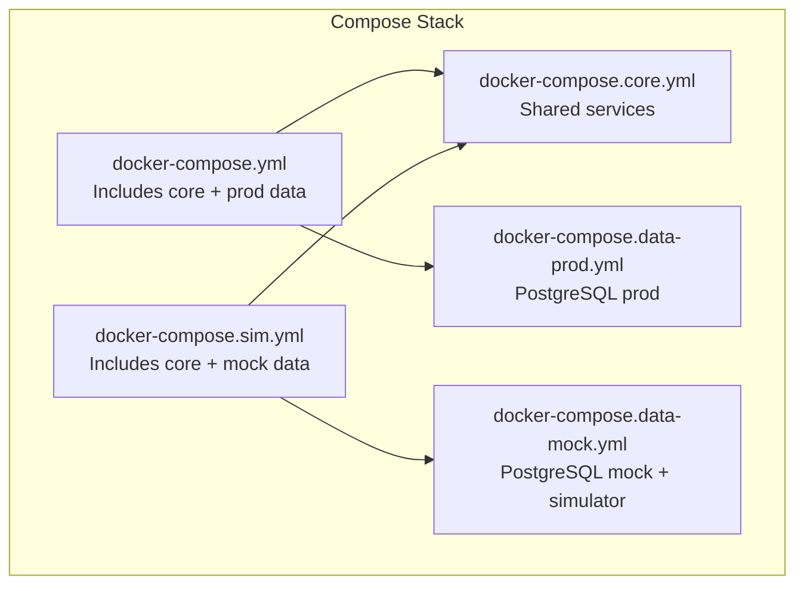
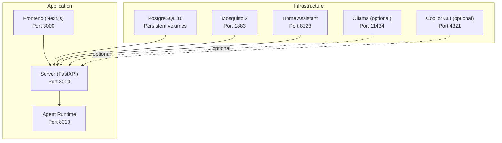
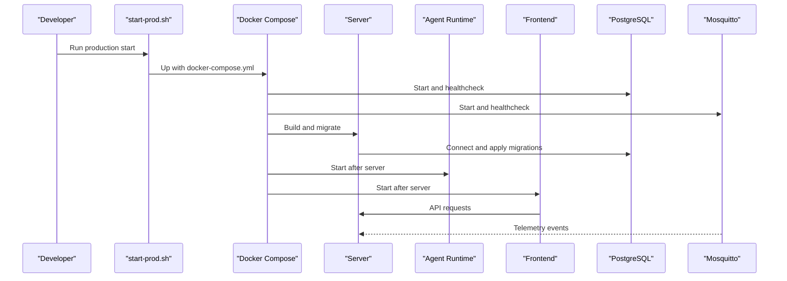
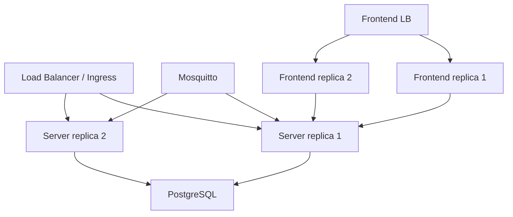
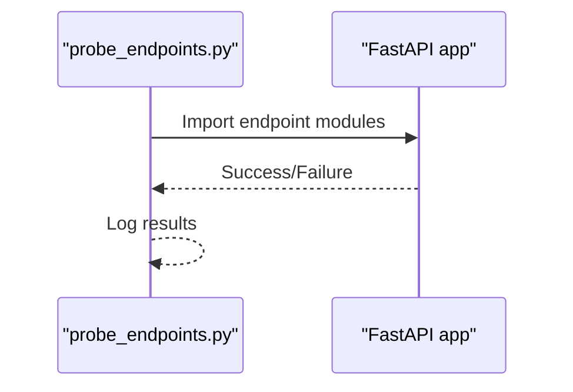
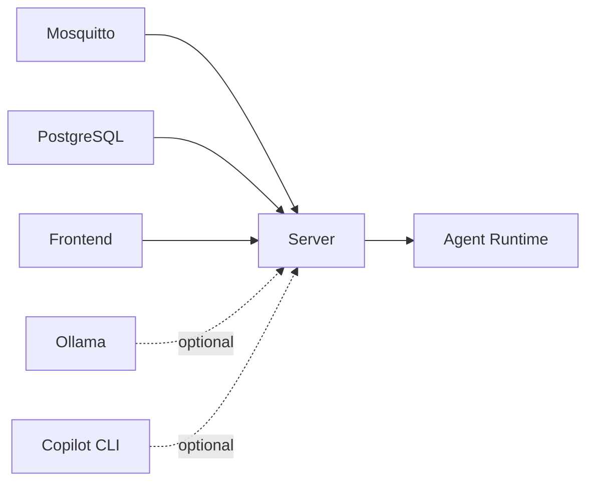

# Deployment & Infrastructure Architecture

<cite>
**Referenced Files in This Document**
- [docker-compose.yml](file://server/docker-compose.yml)
- [docker-compose.core.yml](file://server/docker-compose.core.yml)
- [docker-compose.data-prod.yml](file://server/docker-compose.data-prod.yml)
- [docker-compose.data-mock.yml](file://server/docker-compose.data-mock.yml)
- [docker-compose.sim.yml](file://server/docker-compose.sim.yml)
- [mosquitto.conf](file://server/mosquitto.conf)
- [Dockerfile (server)](file://server/Dockerfile)
- [Dockerfile (frontend)](file://frontend/Dockerfile)
- [app/config.py](file://server/app/config.py)
- [start-prod.sh](file://server/scripts/start-prod.sh)
- [start-sim.sh](file://server/scripts/start-sim.sh)
- [probe_endpoints.py](file://server/probe_endpoints.py)
- [requirements.txt](file://server/requirements.txt)
- [pyproject.toml](file://server/pyproject.toml)
</cite>

## Table of Contents
1. [Introduction](#introduction)
2. [Project Structure](#project-structure)
3. [Core Components](#core-components)
4. [Architecture Overview](#architecture-overview)
5. [Detailed Component Analysis](#detailed-component-analysis)
6. [Dependency Analysis](#dependency-analysis)
7. [Performance Considerations](#performance-considerations)
8. [Troubleshooting Guide](#troubleshooting-guide)
9. [Conclusion](#conclusion)
10. [Appendices](#appendices)

## Introduction
This document describes the containerized deployment and infrastructure architecture for the WheelSense platform. It explains the Docker Compose topology, infrastructure requirements for PostgreSQL, MQTT broker, and optional AI/agent services, and provides guidance on scaling, load balancing, high availability, environment configuration, service orchestration, monitoring, best practices, rollback, and disaster recovery. The content is grounded in the repository’s Compose files, configuration, and scripts.

## Project Structure
The deployment is orchestrated with Docker Compose and split into modular composition files:
- A shared core stack defines services and common environment.
- Separate data stacks provide either production PostgreSQL or a simulator stack with mock data.
- Scripts automate production and simulator environments.

**Diagram sources**
- [docker-compose.yml:1-10](file://server/docker-compose.yml#L1-L10)
- [docker-compose.sim.yml:1-9](file://server/docker-compose.sim.yml#L1-L9)
- [docker-compose.core.yml:1-143](file://server/docker-compose.core.yml#L1-L143)
- [docker-compose.data-prod.yml:1-29](file://server/docker-compose.data-prod.yml#L1-L29)
- [docker-compose.data-mock.yml:1-62](file://server/docker-compose.data-mock.yml#L1-L62)

**Section sources**
- [docker-compose.yml:1-10](file://server/docker-compose.yml#L1-L10)
- [docker-compose.sim.yml:1-9](file://server/docker-compose.sim.yml#L1-L9)
- [docker-compose.core.yml:1-143](file://server/docker-compose.core.yml#L1-L143)
- [docker-compose.data-prod.yml:1-29](file://server/docker-compose.data-prod.yml#L1-L29)
- [docker-compose.data-mock.yml:1-62](file://server/docker-compose.data-mock.yml#L1-L62)

## Core Components
- PostgreSQL (PostGIS recommended for spatial features): persistent relational store for application data and migrations.
- MQTT broker (Mosquitto): event bus for telemetry and device communications.
- Application server: FastAPI backend with async database connectivity and AI/agent integrations.
- Agent runtime: separate Uvicorn service for agent routing and tool invocation.
- Frontend web: Next.js application containerized for development and production.
- Optional AI/Agent services: Ollama and GitHub Copilot CLI for local LLM capabilities.
- Home Assistant: optional integration for smart home automations.

Environment and configuration are driven by Pydantic settings and Docker Compose environment variables.

**Section sources**
- [docker-compose.core.yml:5-143](file://server/docker-compose.core.yml#L5-L143)
- [docker-compose.data-prod.yml:3-29](file://server/docker-compose.data-prod.yml#L3-L29)
- [docker-compose.data-mock.yml:3-62](file://server/docker-compose.data-mock.yml#L3-L62)
- [app/config.py:12-152](file://server/app/config.py#L12-L152)

## Architecture Overview
The platform runs as a multi-container application. The core stack includes Mosquitto, the backend server, the agent runtime, the frontend, optional AI/agent services, and Home Assistant. Data mode is selected via included Compose fragments.

**Diagram sources**
- [docker-compose.core.yml:6-135](file://server/docker-compose.core.yml#L6-L135)
- [docker-compose.data-prod.yml:4-20](file://server/docker-compose.data-prod.yml#L4-L20)
- [docker-compose.data-mock.yml:4-58](file://server/docker-compose.data-mock.yml#L4-L58)

## Detailed Component Analysis

### Containerized Services and Orchestration
- Mosquitto: exposed on port 1883, configured via mounted mosquitto.conf, health-checked via mosquitto_pub.
- Server: FastAPI app built from server/Dockerfile, exposes port 8000, applies Alembic migrations on startup.
- Agent runtime: separate Uvicorn service for agent routing and MCP tool invocation.
- Frontend: Next.js built from frontend/Dockerfile, exposes port 3000.
- Optional AI/Agent: Ollama and Copilot CLI containers with mapped ports and tokens.
- Home Assistant: standalone container for smart home integrations.

**Diagram sources**
- [start-prod.sh:95-106](file://server/scripts/start-prod.sh#L95-L106)
- [docker-compose.core.yml:21-103](file://server/docker-compose.core.yml#L21-L103)
- [docker-compose.data-prod.yml:21-25](file://server/docker-compose.data-prod.yml#L21-L25)
- [Dockerfile (server):21](file://server/Dockerfile#L21)

**Section sources**
- [docker-compose.core.yml:5-143](file://server/docker-compose.core.yml#L5-L143)
- [docker-compose.data-prod.yml:1-29](file://server/docker-compose.data-prod.yml#L1-L29)
- [docker-compose.data-mock.yml:1-62](file://server/docker-compose.data-mock.yml#L1-L62)
- [Dockerfile (server):1-22](file://server/Dockerfile#L1-L22)
- [Dockerfile (frontend):1-31](file://frontend/Dockerfile#L1-L31)
- [mosquitto.conf:1-7](file://server/mosquitto.conf#L1-L7)

### Environment Configuration and Secrets
- Centralized settings via Pydantic Settings with environment variable overrides.
- Compose injects environment variables for database URLs, MQTT connection, AI provider, and internal secrets.
- Example keys include database credentials, MQTT broker/port/user/password, AI provider endpoints, and internal service secrets.

Best practices:
- Override defaults with secure environment variables.
- Use distinct internal service secrets per environment.
- Keep MQTT credentials minimal and rotate regularly.
- Store sensitive values outside the repository.

**Section sources**
- [app/config.py:12-152](file://server/app/config.py#L12-L152)
- [docker-compose.core.yml:29-52](file://server/docker-compose.core.yml#L29-L52)
- [docker-compose.data-prod.yml:22-25](file://server/docker-compose.data-prod.yml#L22-L25)
- [docker-compose.data-mock.yml:42-54](file://server/docker-compose.data-mock.yml#L42-L54)

### Scaling and Load Balancing
- Stateless API: The server is stateless and horizontally scalable behind a reverse proxy or ingress controller.
- Worker separation: Agent runtime runs as a separate process, allowing independent scaling.
- Database: Scale vertically first; consider read replicas for reporting/analytics if telemetry volume grows.
- MQTT: Single Mosquitto instance is sufficient for moderate loads; consider clustering for high-throughput telemetry.
- Frontend: Stateless; scale replicas behind a load balancer.

[No sources needed since this diagram shows conceptual scaling, not actual code structure]

### High Availability Patterns
- PostgreSQL: Use managed Postgres with automated backups and point-in-time recovery; enable replication for failover.
- Mosquitto: Run multiple brokers behind a load balancer with shared persistence if needed.
- Server: Stateless replicas with shared database; ensure consistent secrets and environment.
- Agent runtime: Independent process; deploy multiple replicas if agent traffic increases.
- Frontend: Stateless replicas; CDN and cache headers for performance.

[No sources needed since this section provides general guidance]

### Monitoring Setup
- Health checks: Mosquitto and PostgreSQL define health checks in Compose.
- Endpoint probing: A dedicated script imports all API routers to validate endpoint registration.
- Recommended additions: Metrics exporter, structured logs, alerting on health check failures, and dashboard for CPU/memory/disk.

**Diagram sources**
- [probe_endpoints.py:12-26](file://server/probe_endpoints.py#L12-L26)

**Section sources**
- [docker-compose.core.yml:15-19](file://server/docker-compose.core.yml#L15-L19)
- [docker-compose.data-prod.yml:15-19](file://server/docker-compose.data-prod.yml#L15-L19)
- [probe_endpoints.py:1-28](file://server/probe_endpoints.py#L1-L28)

### Rollback and Disaster Recovery
- Production reset: The production script supports a destructive reset of volumes with confirmation.
- Simulator reset: The simulator script supports resetting simulator volumes with confirmation.
- General guidance:
  - Back up PostgreSQL volumes before destructive actions.
  - Tag images and keep previous versions for quick rollback.
  - Automate backups and test restore procedures.
  - Maintain a disaster recovery playbook with steps for DB, MQTT, and app restart.

**Section sources**
- [start-prod.sh:77-87](file://server/scripts/start-prod.sh#L77-L87)
- [start-sim.sh:78-88](file://server/scripts/start-sim.sh#L78-L88)

### Production Hardening and Performance Optimization
- Security:
  - Enforce HTTPS at ingress; configure TLS termination.
  - Rotate SECRET_KEY and internal service secrets.
  - Restrict MQTT credentials and ACLs.
  - Limit exposed ports; disable unnecessary services.
- Performance:
  - Tune PostgreSQL connection pooling and autovacuum.
  - Enable compression and caching at the ingress.
  - Use read replicas for analytics queries.
  - Optimize AI provider endpoints and rate limits.
- Observability:
  - Centralize logs and metrics.
  - Monitor health checks and error rates.
  - Alert on migration failures and DB lag.

[No sources needed since this section provides general guidance]

## Dependency Analysis
The server depends on PostgreSQL and Mosquitto; the agent runtime depends on the server; the frontend depends on the server. AI/agent services are optional.

**Diagram sources**
- [docker-compose.core.yml:55-103](file://server/docker-compose.core.yml#L55-L103)
- [docker-compose.data-prod.yml:24-25](file://server/docker-compose.data-prod.yml#L24-L25)
- [docker-compose.data-mock.yml:44-51](file://server/docker-compose.data-mock.yml#L44-L51)

**Section sources**
- [docker-compose.core.yml:55-103](file://server/docker-compose.core.yml#L55-L103)
- [docker-compose.data-prod.yml:24-25](file://server/docker-compose.data-prod.yml#L24-L25)
- [docker-compose.data-mock.yml:44-51](file://server/docker-compose.data-mock.yml#L44-L51)

## Performance Considerations
- Database:
  - Use async drivers and connection pooling.
  - Index telemetry tables on time-series columns.
  - Archive old data to reduce table sizes.
- MQTT:
  - Tune message persistence and log levels.
  - Use QoS appropriate for telemetry.
- AI/Agent:
  - Batch tool calls and cache model responses.
  - Limit concurrent agent requests.
- Frontend:
  - Enable static asset caching and compression.
  - Use a CDN for global distribution.

[No sources needed since this section provides general guidance]

## Troubleshooting Guide
Common issues and remedies:
- Migration failures: Re-run migrations inside the server container; verify DATABASE_URL correctness.
- Health check failures: Inspect Mosquitto and PostgreSQL logs; confirm credentials and ports.
- Port conflicts: Ensure only one Compose stack is running at a time; simulator and production share host ports.
- Endpoint import errors: Use the endpoint probe script to diagnose missing imports.

**Section sources**
- [Dockerfile (server):21](file://server/Dockerfile#L21)
- [docker-compose.core.yml:15-19](file://server/docker-compose.core.yml#L15-L19)
- [docker-compose.data-prod.yml:15-19](file://server/docker-compose.data-prod.yml#L15-L19)
- [probe_endpoints.py:12-26](file://server/probe_endpoints.py#L12-L26)

## Conclusion
The WheelSense platform is designed for containerized deployment with clear separation between application services, data, and optional AI/agent integrations. The Compose-based setup supports both production and simulator modes, while scripts streamline environment bootstrapping. By applying the scaling, monitoring, and hardening recommendations herein, teams can operate a reliable, observable, and resilient platform in production.

## Appendices

### Practical Examples

- Start production environment:
  - Use the production script with optional build and detach flags.
  - Confirm services started and ports exposed.

- Start simulator environment:
  - Use the simulator script with optional build and detach flags.
  - Access default credentials and seeded data.

- Environment variables to review:
  - Database URLs, MQTT broker/port/user/password, AI provider endpoints, internal secrets, and MCP allowed origins.

- Monitoring checklist:
  - Verify health checks for Mosquitto and PostgreSQL.
  - Validate endpoint imports via the probe script.
  - Set up logging and alerting for critical failures.

**Section sources**
- [start-prod.sh:95-106](file://server/scripts/start-prod.sh#L95-L106)
- [start-sim.sh:102-107](file://server/scripts/start-sim.sh#L102-L107)
- [docker-compose.core.yml:29-52](file://server/docker-compose.core.yml#L29-L52)
- [probe_endpoints.py:12-26](file://server/probe_endpoints.py#L12-L26)