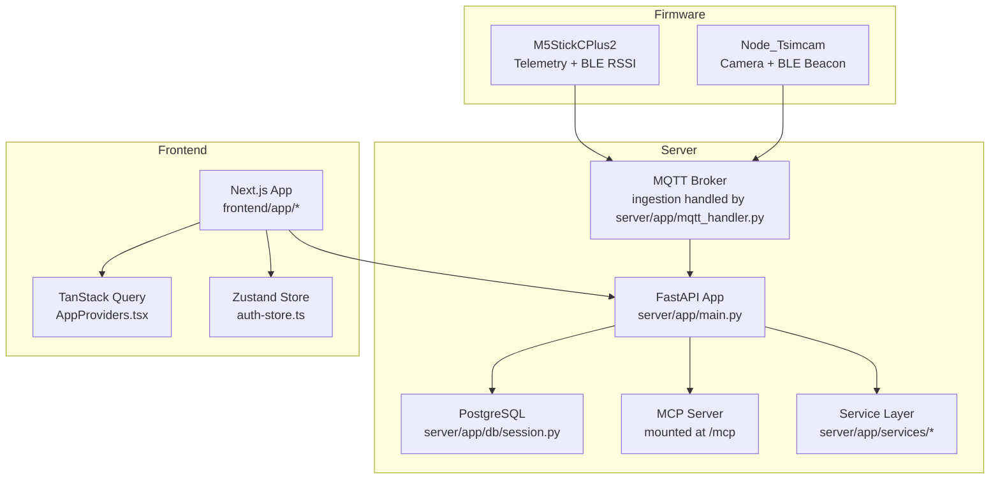
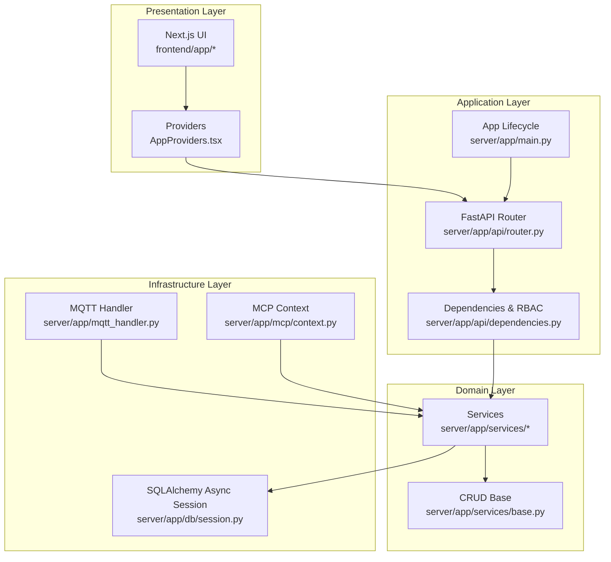
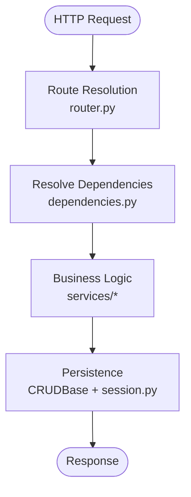
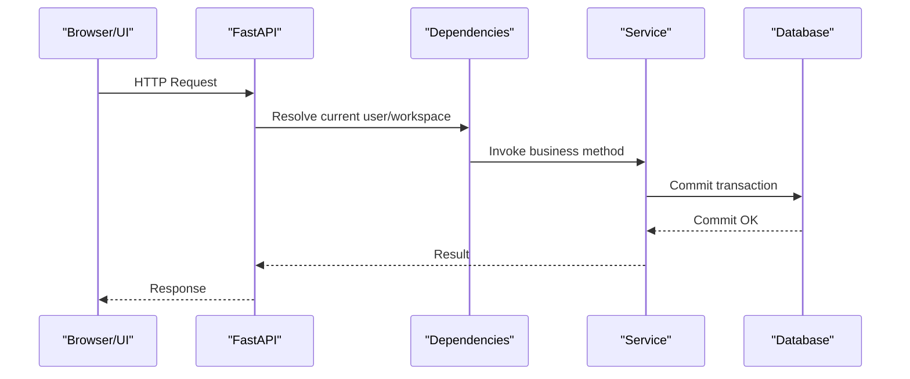
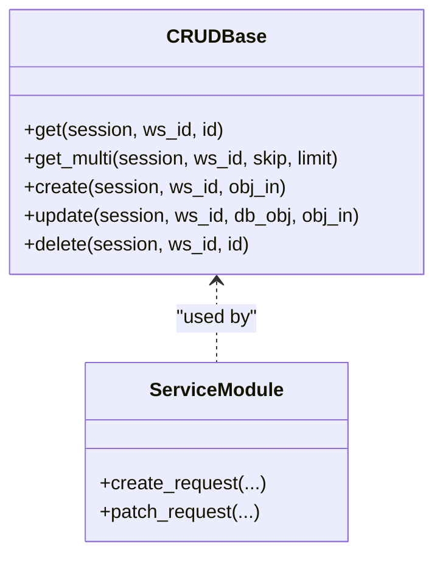
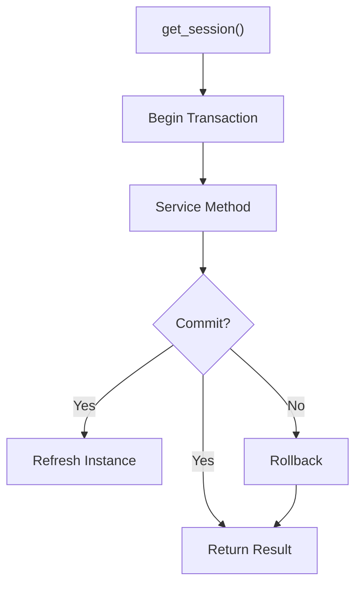
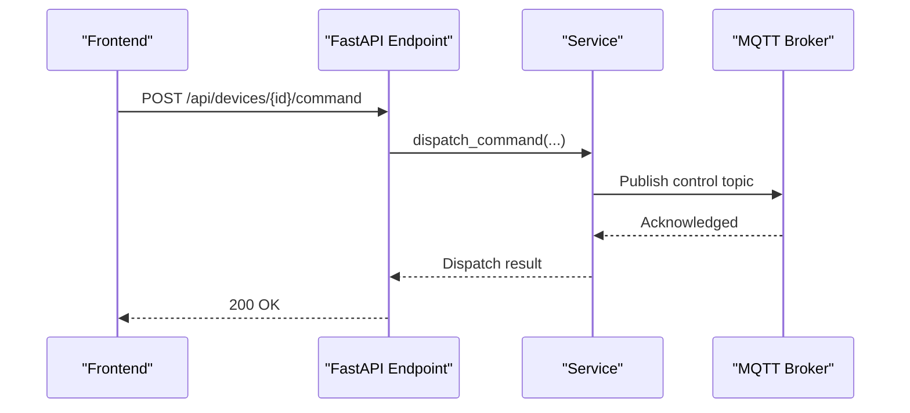
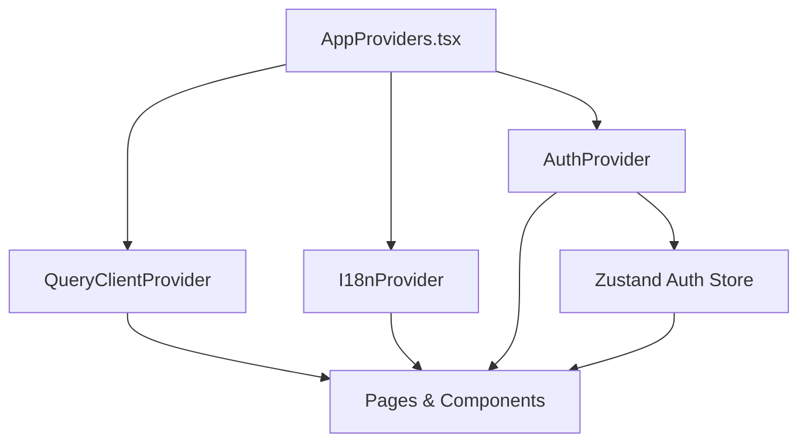
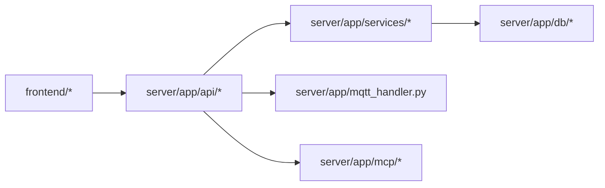

# Design Patterns & Principles

<cite>
**Referenced Files in This Document**
- [ARCHITECTURE.md](file://ARCHITECTURE.md)
- [main.py](file://server/app/main.py)
- [config.py](file://server/app/config.py)
- [router.py](file://server/app/api/router.py)
- [dependencies.py](file://server/app/api/dependencies.py)
- [session.py](file://server/app/db/session.py)
- [base.py](file://server/app/models/base.py)
- [base.py](file://server/app/services/base.py)
- [__init__.py](file://server/app/services/__init__.py)
- [service_requests.py](file://server/app/services/service_requests.py)
- [device_management.py](file://server/app/services/device_management.py)
- [context.py](file://server/app/mcp/context.py)
- [AppProviders.tsx](file://frontend/components/providers/AppProviders.tsx)
- [auth-store.ts](file://frontend/lib/stores/auth-store.ts)
- [useAuth.tsx](file://frontend/hooks/useAuth.tsx)
- [0007-tdd-service-layer-architecture.md](file://docs/adr/0007-tdd-service-layer-architecture.md)
</cite>

## Table of Contents
1. [Introduction](#introduction)
2. [Project Structure](#project-structure)
3. [Core Components](#core-components)
4. [Architecture Overview](#architecture-overview)
5. [Detailed Component Analysis](#detailed-component-analysis)
6. [Dependency Analysis](#dependency-analysis)
7. [Performance Considerations](#performance-considerations)
8. [Troubleshooting Guide](#troubleshooting-guide)
9. [Conclusion](#conclusion)

## Introduction
This document explains the design patterns and architectural principles that guide the WheelSense platform. It focuses on layered architecture, microservices approach, repository pattern, and service layer implementation. It also documents dependency injection, transaction management, and business logic organization, along with design principles such as workspace-based multi-tenancy, role-based access control (RBAC), and event-driven communication. Provider pattern for state management is explained and related to other architectural components.

## Project Structure
The platform is organized into three primary runtimes:
- Firmware: Telemetry and camera devices publish over MQTT.
- Server: FastAPI application with PostgreSQL-backed models/services, MQTT ingestion, localization, MCP server, and AI runtime.
- Frontend: Next.js role-based dashboards with TanStack Query for caching and Zustand for lightweight global state.

**Diagram sources**
- [main.py:68-86](file://server/app/main.py#L68-L86)
- [session.py:52-55](file://server/app/db/session.py#L52-L55)
- [router.py:16-154](file://server/app/api/router.py#L16-L154)
- [AppProviders.tsx:10-42](file://frontend/components/providers/AppProviders.tsx#L10-L42)
- [auth-store.ts:1-38](file://frontend/lib/stores/auth-store.ts#L1-L38)

**Section sources**
- [ARCHITECTURE.md:3-21](file://ARCHITECTURE.md#L3-L21)
- [main.py:68-86](file://server/app/main.py#L68-L86)
- [router.py:16-154](file://server/app/api/router.py#L16-L154)

## Core Components
- Layered architecture separates presentation, business logic, persistence, and infrastructure concerns.
- Microservices approach: FastAPI service, MCP server, MQTT ingestion, and optional simulator.
- Service layer encapsulates business logic and is reused by REST endpoints, MQTT handler, and MCP tools.
- Repository pattern: Implemented via a generic CRUD base class enforcing workspace isolation and typed schemas.
- Dependency injection: FastAPI dependency system supplies database sessions, current user, and workspace context.
- Transaction management: SQLAlchemy async sessions with commit/refresh semantics in services.
- Event-driven communication: MQTT topics for telemetry, camera frames, and device commands; MCP for AI tool orchestration.

**Section sources**
- [ARCHITECTURE.md:23-139](file://ARCHITECTURE.md#L23-L139)
- [base.py:13-89](file://server/app/services/base.py#L13-L89)
- [dependencies.py:25-120](file://server/app/api/dependencies.py#L25-L120)
- [session.py:52-55](file://server/app/db/session.py#L52-L55)
- [service_requests.py:56-88](file://server/app/services/service_requests.py#L56-L88)

## Architecture Overview
The system follows a layered, event-driven design with strong separation of concerns and explicit multi-tenancy and RBAC enforcement.

**Diagram sources**
- [router.py:16-154](file://server/app/api/router.py#L16-L154)
- [dependencies.py:25-120](file://server/app/api/dependencies.py#L25-L120)
- [main.py:26-66](file://server/app/main.py#L26-L66)
- [base.py:13-89](file://server/app/services/base.py#L13-L89)
- [session.py:52-55](file://server/app/db/session.py#L52-L55)
- [context.py:8-37](file://server/app/mcp/context.py#L8-L37)

## Detailed Component Analysis

### Layered Architecture
- Presentation: Next.js pages and components, TanStack Query for caching, Zustand for lightweight state.
- Application: FastAPI router and dependency chain, centralized RBAC and workspace resolution.
- Domain: Services encapsulate business logic; generic CRUD base ensures consistent persistence behavior.
- Infrastructure: Async database sessions, MQTT ingestion, MCP context propagation.

**Diagram sources**
- [router.py:16-154](file://server/app/api/router.py#L16-L154)
- [dependencies.py:25-120](file://server/app/api/dependencies.py#L25-L120)
- [base.py:13-89](file://server/app/services/base.py#L13-L89)
- [session.py:52-55](file://server/app/db/session.py#L52-L55)

**Section sources**
- [router.py:16-154](file://server/app/api/router.py#L16-L154)
- [dependencies.py:25-120](file://server/app/api/dependencies.py#L25-L120)
- [base.py:13-89](file://server/app/services/base.py#L13-L89)
- [session.py:52-55](file://server/app/db/session.py#L52-L55)

### Microservices Approach
- FastAPI service: Centralized API with modular routers and dependency injection.
- MCP server: Mounted at /mcp with dual transport support and actor context propagation.
- MQTT ingestion: Background task consuming telemetry and camera frames, dispatching to services.
- Optional simulator: Separate runtime profile for development and E2E testing.

**Diagram sources**
- [main.py:26-66](file://server/app/main.py#L26-L66)
- [dependencies.py:25-120](file://server/app/api/dependencies.py#L25-L120)
- [service_requests.py:56-88](file://server/app/services/service_requests.py#L56-L88)
- [session.py:52-55](file://server/app/db/session.py#L52-L55)

**Section sources**
- [main.py:26-66](file://server/app/main.py#L26-L66)
- [config.py:78-90](file://server/app/config.py#L78-L90)
- [context.py:8-37](file://server/app/mcp/context.py#L8-L37)

### Repository Pattern and Service Layer Implementation
- Generic CRUD base: Provides get/get_multi/create/update/delete with workspace enforcement and typed Pydantic schemas.
- Service layer: Static methods isolate business logic; services depend on SQLAlchemy async sessions and are reused by endpoints and MCP tools.
- Test-driven development: ADR-0007 mandates TDD and quality gates.

**Diagram sources**
- [base.py:13-89](file://server/app/services/base.py#L13-L89)
- [service_requests.py:56-88](file://server/app/services/service_requests.py#L56-L88)

**Section sources**
- [base.py:13-89](file://server/app/services/base.py#L13-L89)
- [__init__.py:1-18](file://server/app/services/__init__.py#L1-L18)
- [0007-tdd-service-layer-architecture.md:11-27](file://docs/adr/0007-tdd-service-layer-architecture.md#L11-L27)

### Dependency Injection and Transaction Management
- Database sessions: FastAPI dependency yields an async SQLAlchemy session from a shared factory.
- Current user and workspace: JWT decoding, session validation, and workspace resolution occur in dependency resolvers.
- Transactions: Services add, commit, and refresh entities; error handling is centralized in error handlers.

**Diagram sources**
- [session.py:52-55](file://server/app/db/session.py#L52-L55)
- [service_requests.py:84-88](file://server/app/services/service_requests.py#L84-L88)

**Section sources**
- [dependencies.py:25-120](file://server/app/api/dependencies.py#L25-L120)
- [session.py:52-55](file://server/app/db/session.py#L52-L55)
- [service_requests.py:56-88](file://server/app/services/service_requests.py#L56-L88)

### Business Logic Organization
- Endpoint delegation: All endpoints depend on current user and delegate to services.
- Workspace enforcement: CRUD base and dependency helpers enforce workspace scoping.
- Device command dispatch: Service publishes MQTT commands with TLS support and channel routing.

**Diagram sources**
- [device_management.py:1329-1342](file://server/app/services/device_management.py#L1329-L1342)
- [router.py:27-28](file://server/app/api/router.py#L27-L28)

**Section sources**
- [router.py:27-28](file://server/app/api/router.py#L27-L28)
- [device_management.py:1329-1342](file://server/app/services/device_management.py#L1329-L1342)

### Design Principles: Workspace-Based Multi-Tenancy
- All models and CRUD operations enforce workspace_id scoping.
- Current workspace is resolved from the authenticated user and injected into dependencies.
- Device registry and telemetry ingestion honor workspace boundaries.

**Section sources**
- [base.py:17-25](file://server/app/services/base.py#L17-L25)
- [dependencies.py:139-156](file://server/app/api/dependencies.py#L139-L156)

### Design Principles: Role-Based Access Control (RBAC)
- Roles and capabilities are defined centrally; effective token scopes are computed from role and requested scopes.
- Patient access filtering and device assignment checks restrict data exposure.
- Dedicated role groups govern who can manage users, patients, devices, and facilities.

**Section sources**
- [dependencies.py:171-311](file://server/app/api/dependencies.py#L171-L311)
- [dependencies.py:313-402](file://server/app/api/dependencies.py#L313-L402)

### Design Principles: Event-Driven Communication
- MQTT ingestion: Dedicated background task handles telemetry, camera frames, and device acknowledgments.
- MCP server: Secure, scope-based AI integration with actor context and OAuth discovery.
- Frontend state: TanStack Query manages caching and refetching; Zustand stores lightweight UI state.

**Section sources**
- [main.py:43-61](file://server/app/main.py#L43-L61)
- [ARCHITECTURE.md:23-139](file://ARCHITECTURE.md#L23-L139)
- [AppProviders.tsx:10-42](file://frontend/components/providers/AppProviders.tsx#L10-L42)
- [auth-store.ts:1-38](file://frontend/lib/stores/auth-store.ts#L1-L38)

### Provider Pattern for State Management
- TanStack Query provider: Centralized caching and refetching configuration.
- Zustand store: Lightweight global state for authentication and impersonation.
- Auth provider: Hydration and login/logout lifecycle.

**Diagram sources**
- [AppProviders.tsx:10-42](file://frontend/components/providers/AppProviders.tsx#L10-L42)
- [useAuth.tsx:88-97](file://frontend/hooks/useAuth.tsx#L88-L97)
- [auth-store.ts:22-38](file://frontend/lib/stores/auth-store.ts#L22-L38)

**Section sources**
- [AppProviders.tsx:10-42](file://frontend/components/providers/AppProviders.tsx#L10-L42)
- [useAuth.tsx:88-97](file://frontend/hooks/useAuth.tsx#L88-L97)
- [auth-store.ts:1-38](file://frontend/lib/stores/auth-store.ts#L1-L38)

## Dependency Analysis
The backend exhibits low coupling and high cohesion:
- Presentation depends on application layer via HTTP.
- Application depends on domain services and infrastructure via dependency injection.
- Domain services depend on the database abstraction and enforce business rules.
- Infrastructure provides asynchronous sessions and MQTT ingestion.

**Diagram sources**
- [router.py:16-154](file://server/app/api/router.py#L16-L154)
- [session.py:52-55](file://server/app/db/session.py#L52-L55)
- [main.py:43-61](file://server/app/main.py#L43-L61)
- [context.py:8-37](file://server/app/mcp/context.py#L8-L37)

**Section sources**
- [router.py:16-154](file://server/app/api/router.py#L16-L154)
- [dependencies.py:25-120](file://server/app/api/dependencies.py#L25-L120)
- [session.py:52-55](file://server/app/db/session.py#L52-L55)

## Performance Considerations
- Asynchronous database sessions reduce blocking and improve throughput.
- TanStack Query caching minimizes redundant network calls and improves UI responsiveness.
- MQTT ingestion runs as a background task to avoid impacting request latency.
- Configuration supports pooling and TLS for MQTT connections.

[No sources needed since this section provides general guidance]

## Troubleshooting Guide
- Authentication failures: Verify JWT decoding, session validation, and scope computation in dependency resolvers.
- Workspace scoping errors: Ensure workspace_id is enforced in CRUD operations and access assertions.
- Transaction issues: Confirm commit/refresh sequences in services and error handling in endpoints.
- MCP context errors: Validate actor context initialization and scope enforcement.

**Section sources**
- [dependencies.py:58-120](file://server/app/api/dependencies.py#L58-L120)
- [base.py:58-81](file://server/app/services/base.py#L58-L81)
- [context.py:33-37](file://server/app/mcp/context.py#L33-L37)

## Conclusion
The WheelSense platform employs a clean, layered architecture with a strong service layer, robust RBAC, and workspace-based multi-tenancy. The repository pattern via a generic CRUD base, combined with dependency injection and transaction management, ensures maintainable and testable business logic. Event-driven communication through MQTT and MCP complements the REST API, while frontend state management leverages TanStack Query and Zustand for scalability and usability.