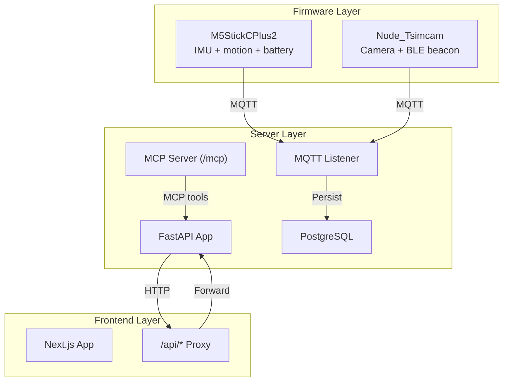
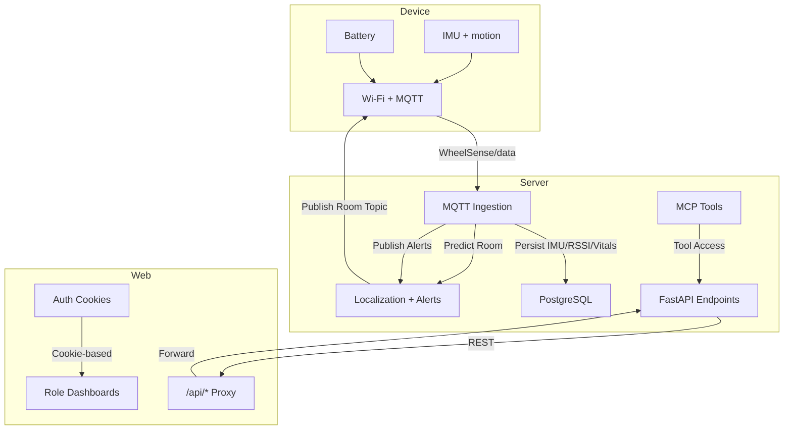
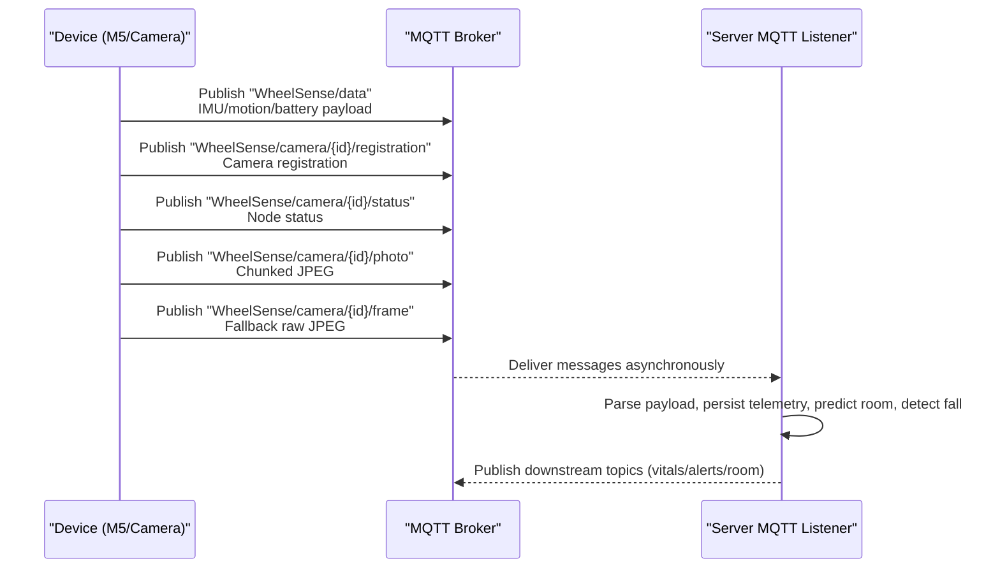
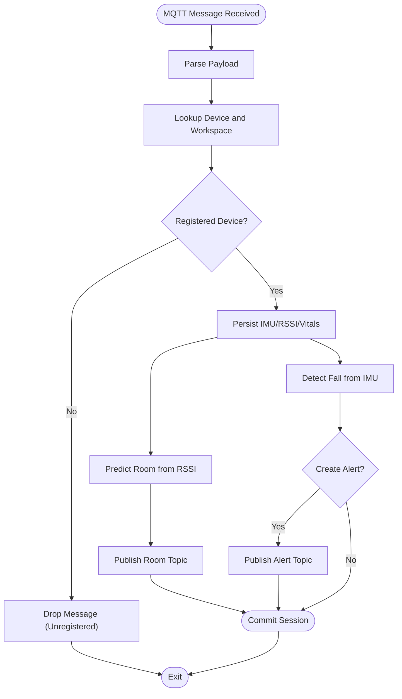
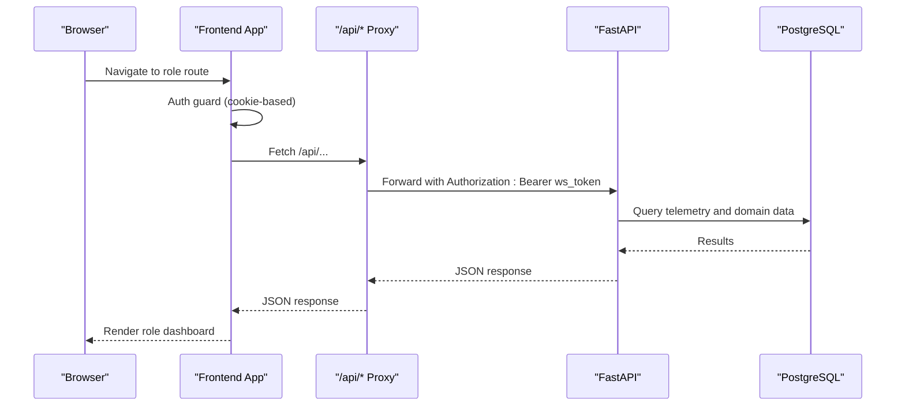
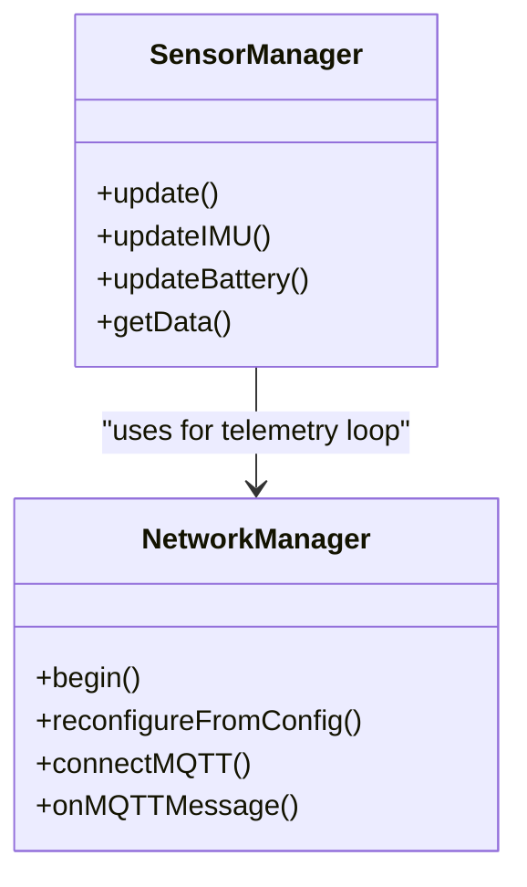
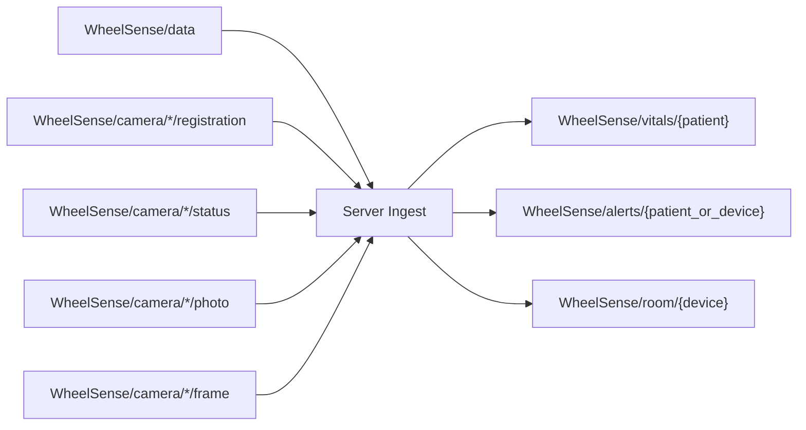
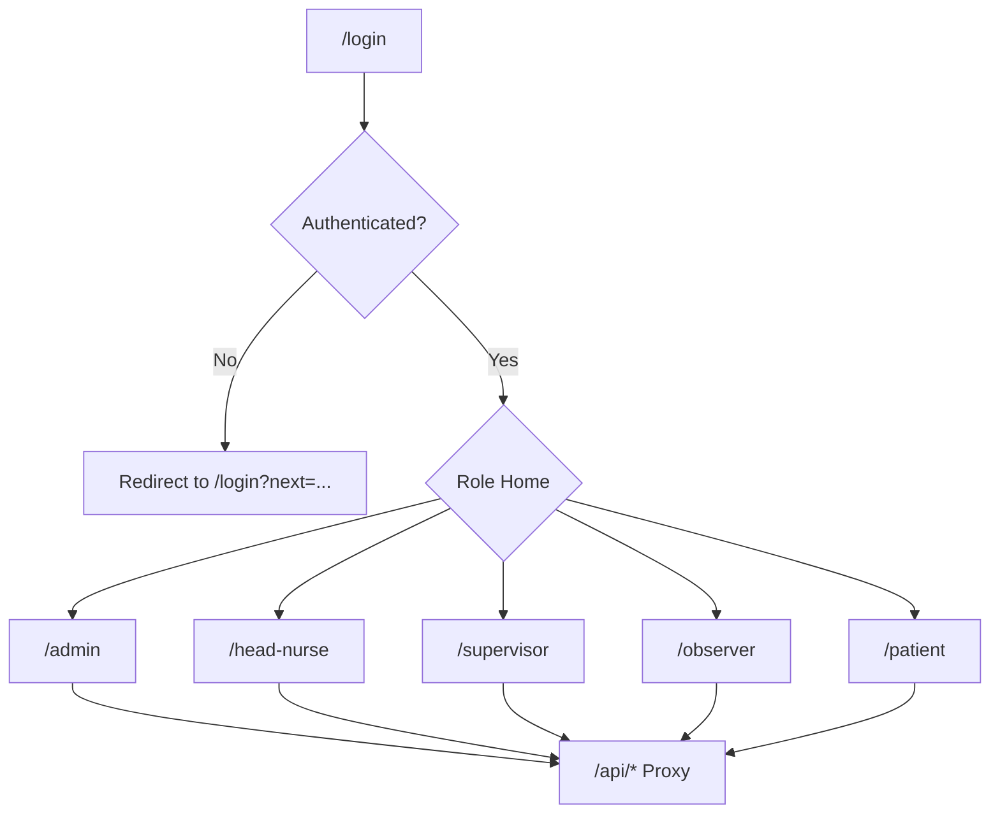
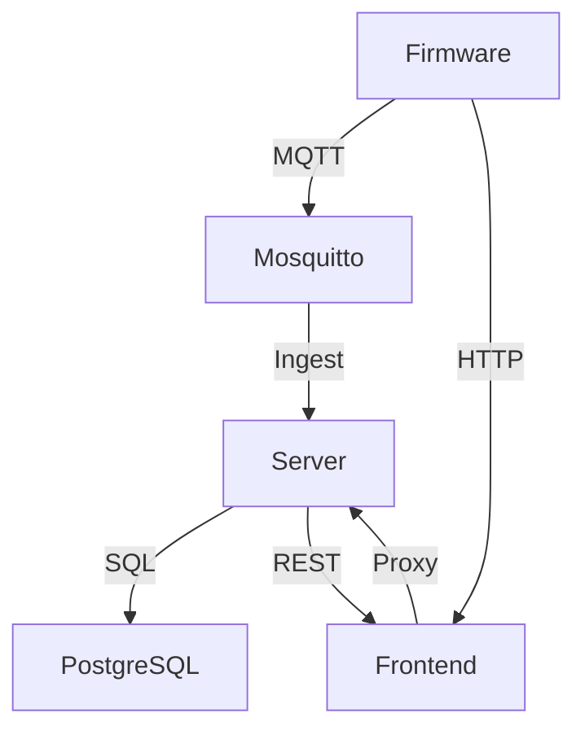

# System Overview

<cite>
**Referenced Files in This Document**
- [ARCHITECTURE.md](file://docs/ARCHITECTURE.md)
- [README.md](file://README.md)
- [TELEMETRY_CONTRACT.md](file://firmware/TELEMETRY_CONTRACT.md)
- [main.py](file://server/app/main.py)
- [mqtt_handler.py](file://server/app/mqtt_handler.py)
- [telemetry.py](file://server/app/api/endpoints/telemetry.py)
- [telemetry.py](file://server/app/models/telemetry.py)
- [NetworkManager.cpp](file://firmware/M5StickCPlus2/src/managers/NetworkManager.cpp)
- [SensorManager.cpp](file://firmware/M5StickCPlus2/src/managers/SensorManager.cpp)
- [main.cpp](file://firmware/Node_Tsimcam/src/main.cpp)
- [layout.tsx](file://frontend/app/layout.tsx)
- [login/page.tsx](file://frontend/app/login/page.tsx)
- [RoleSidebar.tsx](file://frontend/components/RoleSidebar.tsx)
- [RoleShell.tsx](file://frontend/components/RoleShell.tsx)
- [routes.ts](file://frontend/lib/routes.ts)
- [proxy.ts](file://frontend/proxy.ts)
- [constants.ts](file://frontend/lib/constants.ts)
</cite>

## Table of Contents
1. [Introduction](#introduction)
2. [Project Structure](#project-structure)
3. [Core Components](#core-components)
4. [Architecture Overview](#architecture-overview)
5. [Detailed Component Analysis](#detailed-component-analysis)
6. [Dependency Analysis](#dependency-analysis)
7. [Performance Considerations](#performance-considerations)
8. [Troubleshooting Guide](#troubleshooting-guide)
9. [Conclusion](#conclusion)

## Introduction
This document presents the WheelSense three-layer runtime architecture: firmware, server, and frontend. It explains how devices collect telemetry, how the server ingests and enriches data, and how the role-based frontend surfaces insights and operations. It covers the MQTT telemetry contract, device-to-cloud-to-web interaction flows, system boundaries, and integration patterns. The goal is to help both beginners and experienced developers understand how the platform works end-to-end.

## Project Structure
WheelSense is organized into three primary runtime layers:
- Firmware: PlatformIO-based device firmware for wheelchair and camera nodes publishing MQTT telemetry and responding to control commands.
- Server: FastAPI backend with PostgreSQL persistence, MQTT ingestion, localization, motion analytics, alerts, and MCP/AI runtime.
- Frontend: Next.js 16 role-based dashboards with cookie-based authentication and a proxy to the FastAPI backend.

**Diagram sources**
- [main.py:68-87](file://server/app/main.py#L68-L87)
- [mqtt_handler.py:73-136](file://server/app/mqtt_handler.py#L73-L136)
- [NetworkManager.cpp:12-133](file://firmware/M5StickCPlus2/src/managers/NetworkManager.cpp#L12-L133)
- [main.cpp:532-552](file://firmware/Node_Tsimcam/src/main.cpp#L532-L552)
- [layout.tsx:11-23](file://frontend/app/layout.tsx#L11-L23)
- [proxy.ts:1-40](file://frontend/proxy.ts#L1-L40)

**Section sources**
- [README.md:5-13](file://README.md#L5-L13)
- [ARCHITECTURE.md:3-21](file://docs/ARCHITECTURE.md#L3-L21)

## Core Components
- Firmware telemetry contract and topics define what devices publish and subscribe, including wheelchair IMU/motion/battery and camera registration/status/photo payloads.
- Server MQTT listener subscribes to device topics, parses payloads, persists telemetry, predicts rooms, detects falls, and publishes downstream topics for vitals, alerts, and room predictions.
- Frontend role-based dashboards render role-appropriate surfaces, enforce auth and role guards, and proxy API calls to the backend.

**Section sources**
- [TELEMETRY_CONTRACT.md:5-68](file://firmware/TELEMETRY_CONTRACT.md#L5-L68)
- [mqtt_handler.py:108-136](file://server/app/mqtt_handler.py#L108-L136)
- [layout.tsx:11-23](file://frontend/app/layout.tsx#L11-L23)

## Architecture Overview
The three-layer runtime architecture enforces clear separation of responsibilities:
- Firmware: Collects sensor data, publishes telemetry, and responds to control commands over MQTT.
- Server: Central ingestion, enrichment, and distribution engine. It persists telemetry, runs localization, triggers alerts, and exposes REST APIs consumed by the frontend.
- Frontend: Role-aware UI that authenticates via cookies, enforces access control, and renders dashboards and workflows.

**Diagram sources**
- [TELEMETRY_CONTRACT.md:7-34](file://firmware/TELEMETRY_CONTRACT.md#L7-L34)
- [mqtt_handler.py:139-325](file://server/app/mqtt_handler.py#L139-L325)
- [main.py:68-87](file://server/app/main.py#L68-L87)
- [proxy.ts:1-40](file://frontend/proxy.ts#L1-L40)

## Detailed Component Analysis

### Firmware: Telemetry Collection and MQTT
- M5StickCPlus2 collects IMU, computes motion metrics, and publishes a standardized payload to the WheelSense data topic. It subscribes to control and configuration topics and handles room assignment updates.
- Node_Tsimcam captures images and publishes registration/status payloads, supports chunked photo transport, and falls back to raw frame transport when needed.

**Diagram sources**
- [TELEMETRY_CONTRACT.md:7-68](file://firmware/TELEMETRY_CONTRACT.md#L7-L68)
- [NetworkManager.cpp:117-127](file://firmware/M5StickCPlus2/src/managers/NetworkManager.cpp#L117-L127)
- [main.cpp:532-552](file://firmware/Node_Tsimcam/src/main.cpp#L532-L552)
- [mqtt_handler.py:108-136](file://server/app/mqtt_handler.py#L108-L136)

**Section sources**
- [TELEMETRY_CONTRACT.md:5-68](file://firmware/TELEMETRY_CONTRACT.md#L5-L68)
- [NetworkManager.cpp:12-133](file://firmware/M5StickCPlus2/src/managers/NetworkManager.cpp#L12-L133)
- [SensorManager.cpp:50-132](file://firmware/M5StickCPlus2/src/managers/SensorManager.cpp#L50-L132)
- [main.cpp:532-552](file://firmware/Node_Tsimcam/src/main.cpp#L532-L552)

### Server: MQTT Ingestion, Enrichment, and Distribution
- The server starts an MQTT listener that subscribes to device and camera topics. It parses incoming payloads, persists IMU, RSSI, and vitals, and triggers room prediction and fall detection logic.
- Downstream topics are published for vitals, alerts, and room predictions, enabling real-time dashboards and integrations.

**Diagram sources**
- [mqtt_handler.py:139-325](file://server/app/mqtt_handler.py#L139-L325)

**Section sources**
- [mqtt_handler.py:73-136](file://server/app/mqtt_handler.py#L73-L136)
- [mqtt_handler.py:139-325](file://server/app/mqtt_handler.py#L139-L325)
- [telemetry.py:20-41](file://server/app/models/telemetry.py#L20-L41)
- [telemetry.py:42-51](file://server/app/models/telemetry.py#L42-L51)

### Frontend: Role-Based Dashboards and Authentication
- The Next.js app is protected by cookie-based authentication. Role shells enforce access control and route users to role-specific dashboards.
- The frontend proxy forwards browser requests to the FastAPI backend, injecting Authorization headers derived from the session cookie.

**Diagram sources**
- [layout.tsx:11-23](file://frontend/app/layout.tsx#L11-L23)
- [login/page.tsx:26-38](file://frontend/app/login/page.tsx#L26-L38)
- [RoleSidebar.tsx:60-77](file://frontend/components/RoleSidebar.tsx#L60-L77)
- [RoleShell.tsx:29-42](file://frontend/components/RoleShell.tsx#L29-L42)
- [routes.ts:1-17](file://frontend/lib/routes.ts#L1-L17)
- [proxy.ts:1-40](file://frontend/proxy.ts#L1-L40)
- [constants.ts:1-2](file://frontend/lib/constants.ts#L1-L2)

**Section sources**
- [ARCHITECTURE.md:140-183](file://docs/ARCHITECTURE.md#L140-L183)
- [login/page.tsx:26-38](file://frontend/app/login/page.tsx#L26-L38)
- [RoleSidebar.tsx:60-77](file://frontend/components/RoleSidebar.tsx#L60-L77)
- [RoleShell.tsx:29-42](file://frontend/components/RoleShell.tsx#L29-L42)
- [proxy.ts:1-40](file://frontend/proxy.ts#L1-L40)
- [constants.ts:1-26](file://frontend/lib/constants.ts#L1-L26)

### Device Telemetry Collection Details
- IMU and motion: The wheelchair firmware integrates gyroscope and accelerometer to compute distance, velocity, acceleration, and direction over sliding windows, then publishes a compact telemetry payload.
- Battery: Battery voltage and percentage are filtered and debounced to avoid noisy readings.
- Topics: The wheelchair publishes to the data topic and subscribes to control and configuration topics; camera nodes publish registration, status, and photo payloads.

**Diagram sources**
- [SensorManager.cpp:50-132](file://firmware/M5StickCPlus2/src/managers/SensorManager.cpp#L50-L132)
- [NetworkManager.cpp:12-133](file://firmware/M5StickCPlus2/src/managers/NetworkManager.cpp#L12-L133)

**Section sources**
- [SensorManager.cpp:50-132](file://firmware/M5StickCPlus2/src/managers/SensorManager.cpp#L50-L132)
- [NetworkManager.cpp:12-133](file://firmware/M5StickCPlus2/src/managers/NetworkManager.cpp#L12-L133)
- [TELEMETRY_CONTRACT.md:7-34](file://firmware/TELEMETRY_CONTRACT.md#L7-L34)

### MQTT Communication Patterns
- Topics:
  - Device data: WheelSense/data
  - Camera registration/status/photo: WheelSense/camera/{device_id}/registration, /status, /photo, /frame
  - Device control/acks: WheelSense/{device_id}/control, /ack
  - Downstream: WheelSense/vitals/{patient_id}, WheelSense/alerts/{patient_or_device}, WheelSense/room/{device_id}
- Parsing and persistence: The server parses payloads, ensures device registration, persists IMU/RSSI/vitals, and publishes downstream topics.

**Diagram sources**
- [TELEMETRY_CONTRACT.md:7-68](file://firmware/TELEMETRY_CONTRACT.md#L7-L68)
- [mqtt_handler.py:108-136](file://server/app/mqtt_handler.py#L108-L136)
- [mqtt_handler.py:280-324](file://server/app/mqtt_handler.py#L280-L324)

**Section sources**
- [TELEMETRY_CONTRACT.md:7-68](file://firmware/TELEMETRY_CONTRACT.md#L7-L68)
- [mqtt_handler.py:108-136](file://server/app/mqtt_handler.py#L108-L136)
- [mqtt_handler.py:280-324](file://server/app/mqtt_handler.py#L280-L324)

### Role-Based Dashboards
- Role shells and sidebars enforce access control and route users to appropriate dashboards.
- The proxy ensures requests are forwarded with proper authentication headers and preserves full paths for deep linking.

**Diagram sources**
- [login/page.tsx:26-38](file://frontend/app/login/page.tsx#L26-L38)
- [RoleShell.tsx:29-42](file://frontend/components/RoleShell.tsx#L29-L42)
- [RoleSidebar.tsx:60-77](file://frontend/components/RoleSidebar.tsx#L60-L77)
- [routes.ts:1-17](file://frontend/lib/routes.ts#L1-L17)
- [proxy.ts:1-40](file://frontend/proxy.ts#L1-L40)

**Section sources**
- [ARCHITECTURE.md:140-183](file://docs/ARCHITECTURE.md#L140-L183)
- [proxy.ts:1-40](file://frontend/proxy.ts#L1-L40)
- [routes.ts:1-17](file://frontend/lib/routes.ts#L1-L17)

## Dependency Analysis
- Firmware depends on Wi-Fi and MQTT libraries to publish telemetry and subscribe to control/config topics.
- Server depends on aiomqtt for asynchronous MQTT handling, SQLAlchemy for persistence, and FastAPI for HTTP routing.
- Frontend depends on Next.js App Router, TanStack Query for caching, and a proxy to forward API requests.

**Diagram sources**
- [main.py:68-87](file://server/app/main.py#L68-L87)
- [mqtt_handler.py:73-136](file://server/app/mqtt_handler.py#L73-L136)
- [proxy.ts:1-40](file://frontend/proxy.ts#L1-L40)

**Section sources**
- [main.py:68-87](file://server/app/main.py#L68-L87)
- [mqtt_handler.py:73-136](file://server/app/mqtt_handler.py#L73-L136)
- [proxy.ts:1-40](file://frontend/proxy.ts#L1-L40)

## Performance Considerations
- MQTT batching and chunked photo transport reduce bandwidth and improve reliability.
- Server-side sliding-window motion computation and RSSI-based localization balance accuracy and latency.
- Frontend caching with TanStack Query reduces redundant network calls and improves responsiveness.

## Troubleshooting Guide
- Device connectivity:
  - Verify Wi-Fi credentials and MQTT broker configuration in firmware.
  - Confirm subscription topics and keepalive settings.
- Server ingestion:
  - Check MQTT listener logs for connection errors and message parsing exceptions.
  - Ensure device registration exists or auto-registration is enabled.
- Frontend access:
  - Confirm cookie-based authentication and role guards.
  - Validate proxy configuration and Authorization header injection.

**Section sources**
- [NetworkManager.cpp:12-133](file://firmware/M5StickCPlus2/src/managers/NetworkManager.cpp#L12-L133)
- [mqtt_handler.py:126-136](file://server/app/mqtt_handler.py#L126-L136)
- [proxy.ts:1-40](file://frontend/proxy.ts#L1-L40)

## Conclusion
WheelSense’s three-layer architecture cleanly separates concerns: devices collect and publish telemetry, the server ingests, enriches, and distributes insights, and the frontend delivers role-aware dashboards. The MQTT contract, robust ingestion pipeline, and cookie-based role enforcement enable a scalable, secure, and maintainable platform for wheelchair monitoring and clinical workflows.