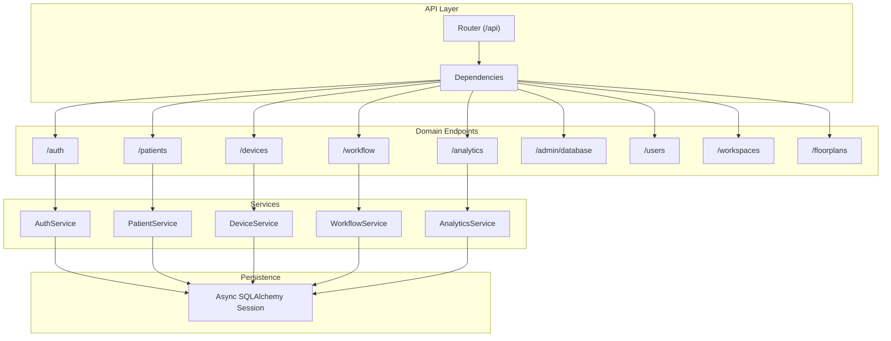
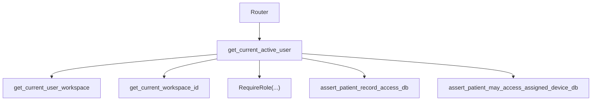

# API Endpoints

<cite>
**Referenced Files in This Document**
- [router.py](file://server/app/api/router.py)
- [dependencies.py](file://server/app/api/dependencies.py)
- [errors.py](file://server/app/api/errors.py)
- [auth.py](file://server/app/api/endpoints/auth.py)
- [patients.py](file://server/app/api/endpoints/patients.py)
- [devices.py](file://server/app/api/endpoints/devices.py)
- [workflow.py](file://server/app/api/endpoints/workflow.py)
- [analytics.py](file://server/app/api/endpoints/analytics.py)
- [admin_database.py](file://server/app/api/endpoints/admin_database.py)
- [users.py](file://server/app/api/endpoints/users.py)
- [workspaces.py](file://server/app/api/endpoints/workspaces.py)
- [floorplans.py](file://server/app/api/endpoints/floorplans.py)
- [users.py](file://server/app/schemas/users.py)
</cite>

## Table of Contents
1. [Introduction](#introduction)
2. [Project Structure](#project-structure)
3. [Core Components](#core-components)
4. [Architecture Overview](#architecture-overview)
5. [Detailed Component Analysis](#detailed-component-analysis)
6. [Dependency Analysis](#dependency-analysis)
7. [Performance Considerations](#performance-considerations)
8. [Troubleshooting Guide](#troubleshooting-guide)
9. [Conclusion](#conclusion)
10. [Appendices](#appendices)

## Introduction
This document provides comprehensive API endpoint documentation for the WheelSense Platform. It organizes endpoints by domain modules (authentication, patients, devices, workflow, analytics, administrative functions) and explains request/response schemas, parameter validation, data serialization patterns, authentication and authorization mechanisms, role-based access control, permission validation, dependency injection, request context management, workspace scoping, error handling, HTTP status codes, response formatting, OpenAPI/Swagger integration, endpoint testing patterns, and API versioning approach. Practical usage examples and integration guidelines are included.

## Project Structure
The API is implemented using FastAPI and mounted under a single router with modular sub-routers grouped by domain. Authentication middleware enforces bearer tokens and workspace scoping. Centralized dependency injection supplies database sessions, current user, workspace, and role checks.

```mermaid
graph TB
Client["Client"] --> API["FastAPI Router (/api)"]
API --> Auth["/auth (Authentication)"]
API --> Users["/users (Users)"]
API --> Workspaces["/workspaces (Workspaces)"]
API --> Devices["/devices (Devices)"]
API --> Rooms["/rooms (Rooms)"]
API --> Telemetry["/telemetry (Telemetry)"]
API --> Localization["/localization (Localization)"]
API --> Motion["/motion (Motion)"]
API --> Patients["/patients (Patients)"]
API --> Caregivers["/caregivers (Caregivers)"]
API --> Facilities["/facilities (Facilities)"]
API --> Vitals["/vitals (Vitals)"]
API --> Timeline["/timeline (Timeline)"]
API --> Alerts["/alerts (Alerts)"]
API --> Analytics["/analytics (Analytics)"]
API --> HomeAssistant["/ha (HomeAssistant)"]
API --> Retention["/retention (Retention)"]
API --> Cameras["/cameras (Cameras)"]
API --> Chat["/chat (Chat)"]
API --> AISettings["/settings/ai (AI Settings)"]
API --> Workflow["/workflow (Workflow)"]
API --> Floorplans["/floorplans (Floorplans)"]
API --> Care["/care (Care)"]
API --> Medication["/medication (Medication)"]
API --> Services["/services (Service Requests)"]
API --> Calendar["/calendar (Calendar)"]
API --> Support["/support (Support)"]
API --> ChatActions["/chat (Chat Actions)"]
API --> Demo["/demo (Demo Control)"]
API --> AdminDB["/admin/database (Admin Database)"]
API --> ShiftChecklist["/shift-checklist (Shift Checklist)"]
API --> MCPAuth["/mcp (MCP Auth)"]
API --> TaskManagement["/task-management (Task Management)"]
API --> Tasks["/tasks (Tasks)"]
API --> Health["/health (Health)"]
```

**Diagram sources**
- [router.py:16-159](file://server/app/api/router.py#L16-L159)

**Section sources**
- [router.py:16-159](file://server/app/api/router.py#L16-L159)

## Core Components
- Router and Mounting
  - The API router is prefixed with /api and mounts domain routers with optional global dependencies (e.g., requiring an active user).
  - Public endpoints (e.g., profile images) are mounted without mandatory authentication.
- Authentication and Authorization
  - JWT bearer tokens are validated centrally; sessions are verified against stored auth sessions.
  - Roles and token scopes define capability sets; RequireRole dependency restricts endpoints.
  - Workspace scoping ensures cross-workspace isolation.
- Dependency Injection
  - get_db yields an async SQLAlchemy session.
  - get_current_active_user resolves the current user from the token and verifies session validity.
  - get_current_user_workspace and get_current_workspace_id enforce workspace membership and scope.
- Error Handling
  - Standardized error envelopes with machine-readable codes and human-readable messages.
  - Validation errors and HTTP exceptions are normalized to consistent JSON responses.

**Section sources**
- [router.py:16-159](file://server/app/api/router.py#L16-L159)
- [dependencies.py:25-156](file://server/app/api/dependencies.py#L25-L156)
- [dependencies.py:159-311](file://server/app/api/dependencies.py#L159-L311)
- [errors.py:14-77](file://server/app/api/errors.py#L14-L77)

## Architecture Overview
The API follows a layered architecture:
- Router layer: Groups endpoints by domain and applies global dependencies.
- Dependency layer: Resolves current user, workspace, and validates roles/scopes.
- Service layer: Implements business logic per domain.
- Persistence layer: Uses async SQLAlchemy sessions.

**Diagram sources**
- [router.py:16-159](file://server/app/api/router.py#L16-L159)
- [dependencies.py:25-156](file://server/app/api/dependencies.py#L25-L156)

## Detailed Component Analysis

### Authentication Endpoints
- Base path: /api/auth
- Purpose: Login, session hydration, user info, password change, session listing/revoke, impersonation, profile image upload.
- Key behaviors:
  - Login issues JWT with optional session_id and impersonation flags.
  - Session hydration returns authenticated flag and user profile without raising 401.
  - Password change requires current password verification.
  - Impersonation requires admin role and returns a short-lived act-as token.
  - Profile image upload stores JPEGs and updates profile_image_url; data URLs are rejected.

Endpoints
- POST /login
  - Request: OAuth2 password request form (username, password).
  - Response: Token with access_token, token_type, optional session_id, impersonation flags.
  - Validation: Username/password verified; IP and User-Agent recorded.
- GET /session
  - Response: AuthHydrateOut indicating authenticated and optional user.
- GET /me
  - Response: AuthMeOut with impersonation context and optional contact fields.
- GET /me/profile
  - Response: AuthMeProfileOut including linked caregiver/patient profiles.
- PATCH /me/profile
  - Request: AuthMeProfilePatch; updates user and linked person records.
  - Response: AuthMeProfileOut.
- POST /change-password
  - Request: ChangePasswordIn (current_password, new_password); returns {"ok": true}.
- GET /sessions
  - Response: List of AuthSessionOut for the current user.
- POST /logout
  - Status: 204 No Content; revokes current session if present.
- DELETE /sessions/{session_id}
  - Status: 204 No Content; revokes specified session.
- POST /impersonate/start
  - Request: ImpersonationStart (target_user_id).
  - Response: Token for acting as target user within the same workspace.
- PATCH /me
  - Request: MePatch; updates user profile fields; profile_image_url must be http(s) URL or platform-hosted path.
  - Response: UserOut.
- POST /me/profile-image
  - Request: multipart/form-data with file; stores JPEG and sets profile_image_url.
  - Response: UserOut.

Validation and Serialization
- Token schema includes session_id and impersonation flags.
- Profile image URL validation rejects data URLs and non-http schemes; accepts http(s) URLs or platform-hosted paths.

Authorization and Scopes
- Requires active user for most endpoints; impersonation requires admin role.

**Section sources**
- [auth.py:57-269](file://server/app/api/endpoints/auth.py#L57-L269)
- [users.py:33-150](file://server/app/schemas/users.py#L33-L150)

### Users Endpoints
- Base path: /api/users
- Purpose: Create, list, search, update, and soft-delete users within the current workspace.
- Authorization:
  - Create, update, delete require user managers (admin/head_nurse).
  - List/search require supervisor-read roles.

Endpoints
- POST /
  - Request: UserCreate; Response: UserOut.
- GET /
  - Response: List of UserOut for the workspace.
- GET /search
  - Query params: q, kind, role, roles (comma-separated), limit.
  - Response: List of UserSearchOut.
- PUT /{user_id}
  - Request: UserUpdate; Response: UserOut.
- DELETE /{user_id}
  - Status: 204 No Content; soft-deletes user by deactivating and unlinking.

**Section sources**
- [users.py:23-99](file://server/app/api/endpoints/users.py#L23-L99)

### Workspaces Endpoints
- Base path: /api/workspaces
- Purpose: List, create, and activate workspaces; admin-only.

Endpoints
- GET /
  - Response: List of WorkspaceOut.
- POST /
  - Request: WorkspaceCreate; Response: WorkspaceOut.
- POST /{ws_id}/activate
  - Request: Activate current user’s workspace; Response: WorkspaceOut.

**Section sources**
- [workspaces.py:15-58](file://server/app/api/endpoints/workspaces.py#L15-L58)

### Patients Endpoints
- Base path: /api/patients
- Purpose: CRUD, device assignment, contacts, mode switching, and caregiver access management.

Authorization
- List/read/update/delete require patient managers (admin/head_nurse).
- Device assignment and contacts require patient managers.
- Access to patient records is enforced via workspace visibility rules.

Endpoints
- GET /
  - Query params: is_active, care_level, q (search), skip, limit.
  - Response: List of PatientOut.
- POST /
  - Request: PatientCreate; Response: PatientOut.
- GET /{patient_id}
  - Response: PatientOut; 404 if not found.
- GET /{patient_id}/caregivers
  - Response: List of CareGiverOut.
- PUT /{patient_id}/caregivers
  - Request: PatientCaregiverAccessReplace; Response: List of CareGiverOut.
- PATCH /{patient_id}
  - Request: PatientUpdate; Response: PatientOut.
- POST /{patient_id}/profile-image
  - Request: multipart/form-data; Response: PatientOut.
- DELETE /{patient_id}
  - Status: 204 No Content.
- POST /{patient_id}/mode
  - Request: ModeSwitchRequest (mode: wheelchair|walking); Response: PatientOut.
- GET /{patient_id}/devices
  - Response: List of DeviceAssignmentOut.
- POST /{patient_id}/devices
  - Request: DeviceAssignmentCreate; Response: DeviceAssignmentOut.
- DELETE /{patient_id}/devices/{device_id}
  - Status: 204 No Content.
- GET /{patient_id}/contacts
  - Response: List of PatientContactOut.
- POST /{patient_id}/contacts
  - Request: PatientContactCreate; Response: PatientContactOut.
- PATCH /{patient_id}/contacts/{contact_id}
  - Request: PatientContactUpdate; Response: PatientContactOut.
- DELETE /{patient_id}/contacts/{contact_id}
  - Status: 204 No Content.

**Section sources**
- [patients.py:90-384](file://server/app/api/endpoints/patients.py#L90-L384)

### Devices Endpoints
- Base path: /api/devices
- Purpose: Registry management, device detail, mobile telemetry ingestion, commands, camera commands, activity logs.

Authorization
- Device managers: admin/head_nurse.
- Device commanders: admin/head_nurse/supervisor.
- Activity logs require admin/head_nurse/supervisor.
- Patient access to devices is restricted to assigned devices.

Endpoints
- GET /activity
  - Query: limit; Response: List of DeviceActivityEventOut.
- GET /
  - Query: device_type, hardware_type; Response: List of device summary dicts.
- GET /{device_id}/commands
  - Query: limit; Response: List of command dispatch records.
- GET /{device_id}
  - Response: Device detail dict.
- POST /mobile/ingest
  - Request: MobileTelemetryIngest; Response: MobileTelemetryIngestOut.
- POST /{device_id}/patient
  - Request: DevicePatientAssign; Response: {"status":"ok","patient_id","device_role","assigned_at"}.
- POST /
  - Request: DeviceCreate; Response: {"id","device_id","hardware_type"}.
- PATCH /{device_id}
  - Request: DevicePatch; Response: Device summary dict.
- DELETE /{device_id}
  - Status: 204 No Content.
- POST /{device_id}/commands
  - Request: DeviceCommandRequest; Response: DeviceCommandOut.
- POST /{device_id}/camera/check
  - Response: Command dispatch result.
- POST /cameras/{device_id}/command
  - Request: CameraCommand; Response: {"message","topic","command_id"}.

**Section sources**
- [devices.py:53-311](file://server/app/api/endpoints/devices.py#L53-L311)

### Workflow Endpoints
- Base path: /api/workflow
- Purpose: Schedules, tasks, role messages, handover notes, directives, audit trail, workflow item details, claims, handoffs, attachments.

Authorization
- Write operations generally require admin/head_nurse/supervisor/observer.
- Audit queries require admin/head_nurse/supervisor/observer.
- Patient access is enforced via visibility rules and patient record checks.

Endpoints
- GET /schedules
  - Query: status, patient_id, limit; Response: List of CareScheduleOut.
- POST /schedules
  - Request: CareScheduleCreate; Response: CareScheduleOut.
- PATCH /schedules/{schedule_id}
  - Request: CareScheduleUpdate; Response: CareScheduleOut.
- GET /tasks
  - Query: status, limit; Response: List of CareTaskOut.
- POST /tasks
  - Request: CareTaskCreate; Response: CareTaskOut.
- PATCH /tasks/{task_id}
  - Request: CareTaskUpdate; Response: CareTaskOut.
- GET /messages
  - Query: inbox_only, workflow_item_type, workflow_item_id, limit; Response: List of RoleMessageOut.
- GET /messaging/recipients
  - Response: List of UserSearchOut.
- POST /messages
  - Request: RoleMessageCreate; Response: RoleMessageOut.
- POST /messages/{message_id}/read
  - Response: RoleMessageOut.
- POST /messages/attachments
  - Request: multipart/form-data; Response: PendingWorkflowAttachmentUploadOut.
- GET /messages/{message_id}/attachments/{attachment_id}/content
  - Response: FileResponse.
- DELETE /messages/{message_id}
  - Status: 204 No Content.
- GET /handovers
  - Query: patient_id, limit; Response: List of HandoverNoteOut.
- POST /handovers
  - Request: HandoverNoteCreate; Response: HandoverNoteOut.
- GET /directives
  - Query: status, limit; Response: List of CareDirectiveOut.
- POST /directives
  - Request: CareDirectiveCreate; Response: CareDirectiveOut.
- PATCH /directives/{directive_id}
  - Request: CareDirectiveUpdate; Response: CareDirectiveOut.
- POST /directives/{directive_id}/acknowledge
  - Request: CareDirectiveAcknowledge; Response: CareDirectiveOut.
- GET /audit
  - Query: domain, action, entity_type, patient_id, limit; Response: List of AuditTrailEventOut.
- GET /items/{item_type}/{item_id}
  - Response: WorkflowItemDetailOut.
- POST /items/{item_type}/{item_id}/claim
  - Request: WorkflowClaimRequest; Response: Workflow item model.
- POST /items/{item_type}/{item_id}/handoff
  - Request: WorkflowHandoffRequest; Response: Workflow item model.

**Section sources**
- [workflow.py:110-800](file://server/app/api/endpoints/workflow.py#L110-L800)

### Analytics Endpoints
- Base path: /api/analytics
- Purpose: Alert summaries, vitals averages, ward summaries.

Endpoints
- GET /alerts/summary
  - Response: AlertSummaryOut.
- GET /vitals/averages
  - Query: hours (default 24); Response: VitalsAverageOut.
- GET /wards/summary
  - Response: WardSummaryOut.

**Section sources**
- [analytics.py:17-49](file://server/app/api/endpoints/analytics.py#L17-L49)

### Administrative Functions
- Base path: /api/admin/database
- Purpose: Clear entire database with password confirmation; preserves admin and creates a new workspace.

Endpoints
- POST /clear
  - Request: ClearDatabaseBody (password); Response: ClearDatabaseResult.
  - Constraints: Cannot be performed during impersonation; password must match.

**Section sources**
- [admin_database.py:15-60](file://server/app/api/endpoints/admin_database.py#L15-L60)

### Additional Domain Modules
- Floorplans: Upload, list, retrieve floorplan assets; manage layout; compute presence; capture room snapshots.
- Calendar, Support, Service Requests, Medication, Care, Shift Checklist, HomeAssistant, Retention, Cameras, Chat, AI Settings, Demo Control, MCP Auth, Task Management, Tasks: Mounted under /api with appropriate dependencies and role gating.

**Section sources**
- [router.py:26-154](file://server/app/api/router.py#L26-L154)
- [floorplans.py:74-242](file://server/app/api/endpoints/floorplans.py#L74-L242)

## Dependency Analysis
- Router-to-Endpoint Dependencies
  - Global dependencies: get_current_active_user applied to most domains to enforce JWT and active user.
  - Some domains (e.g., public profile images) bypass authentication.
- Role-Based Access Control
  - RequireRole decorator restricts endpoints by canonical roles.
  - Token scopes intersect with role capabilities for fine-grained permissions.
- Workspace Scoping
  - get_current_user_workspace and get_current_workspace_id ensure all operations occur within the user’s workspace.
- Patient Access Controls
  - assert_patient_record_access_db enforces visibility rules.
  - assert_patient_may_access_assigned_device_db restricts device reads to assigned devices for patients.

**Diagram sources**
- [router.py:26-154](file://server/app/api/router.py#L26-L154)
- [dependencies.py:131-156](file://server/app/api/dependencies.py#L131-L156)
- [dependencies.py:354-402](file://server/app/api/dependencies.py#L354-L402)

**Section sources**
- [dependencies.py:159-311](file://server/app/api/dependencies.py#L159-L311)
- [dependencies.py:313-402](file://server/app/api/dependencies.py#L313-L402)

## Performance Considerations
- Pagination and limits: Many endpoints accept limit parameters with upper bounds to prevent excessive loads.
- Asynchronous sessions: All endpoints use async SQLAlchemy sessions to minimize blocking.
- Workspace-scoped queries: Queries are constrained to the current workspace to avoid cross-domain scans.
- Caching and streaming: Consider caching frequently accessed floorplan layouts and presence data; stream large attachments.

## Troubleshooting Guide
Common Issues and Remedies
- 401 Unauthorized
  - Cause: Invalid or missing JWT; session expired or revoked; malformed token.
  - Resolution: Re-authenticate via /api/auth/login; ensure Authorization header is present.
- 403 Forbidden
  - Cause: Insufficient role or token scope; attempting to access another workspace’s data; patient accessing non-assigned device.
  - Resolution: Verify role and token scopes; ensure workspace membership; check patient-device assignment.
- 422 Unprocessable Entity
  - Cause: Validation errors in request body; invalid enum values; conflicting patches.
  - Resolution: Review request payload against schemas; fix validation errors.
- 404 Not Found
  - Cause: Resource not found (e.g., patient, device, message).
  - Resolution: Confirm identifiers and workspace scoping.
- 413 Payload Too Large
  - Cause: Uploaded floorplan exceeds 20MB.
  - Resolution: Compress or resize image before upload.

Error Handling Details
- Standardized error envelope with code, message, and optional details.
- Validation errors return code "validation_error"; HTTP exceptions are normalized.

**Section sources**
- [errors.py:24-77](file://server/app/api/errors.py#L24-L77)
- [dependencies.py:84-120](file://server/app/api/dependencies.py#L84-L120)

## Conclusion
WheelSense Platform exposes a comprehensive, role-scoped, workspace-aware API with strong authentication, consistent error handling, and modular domain endpoints. The documented endpoints, schemas, and policies enable secure integration across clinical workflows, device management, analytics, and administrative functions.

## Appendices

### Authentication and Authorization Reference
- JWT Bearer
  - Token URL: /api/auth/login
  - Claims: sub (user ID), role, sid (session_id), actor_admin_id, scope (intersected with role).
- Sessions
  - List, revoke, logout supported; session verification occurs during token resolution.
- Roles and Capabilities
  - Canonical roles: admin, head_nurse, supervisor, observer, patient.
  - Capability map defines domain permissions per role.
- Token Scopes
  - Role-specific allowed scopes intersect with requested scopes for effective permissions.

**Section sources**
- [dependencies.py:48-129](file://server/app/api/dependencies.py#L48-L129)
- [dependencies.py:200-311](file://server/app/api/dependencies.py#L200-L311)

### Request/Response Schemas Overview
- Users
  - Token, TokenData, UserBase, UserCreate, UserUpdate, UserOut, AuthMeOut, AuthHydrateOut, AuthMeProfileOut, ChangePasswordIn, ImpersonationStart, AuthSessionOut, UserSearchOut.
- Authentication Endpoints
  - Token, AuthMeOut, AuthMeProfileOut, AuthHydrateOut, ChangePasswordIn, AuthSessionOut, MePatch, ImpersonationStart.

**Section sources**
- [users.py:33-257](file://server/app/schemas/users.py#L33-L257)

### Endpoint Testing Patterns
- Unit tests should mock database sessions and dependencies (get_db, get_current_active_user).
- Use FastAPI TestClient to hit endpoints with proper Authorization headers.
- Validate error responses for invalid roles, missing sessions, and validation failures.
- For multipart uploads (profile images, attachments), construct proper form-data payloads.

### API Versioning Approach
- The API is served under /api; versioning is not explicitly indicated in the router. Maintain backward compatibility by adding new endpoints under new paths or suffixes and deprecating old ones gradually.