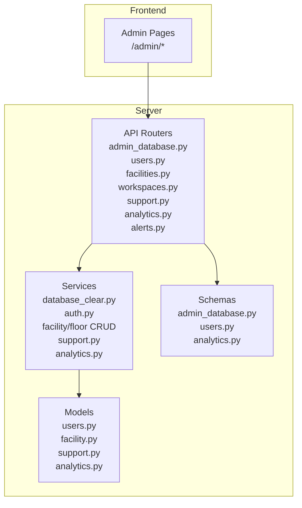
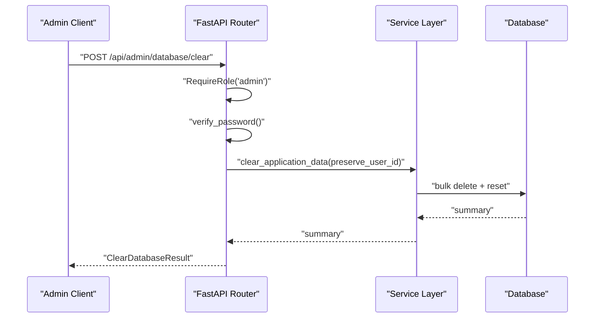
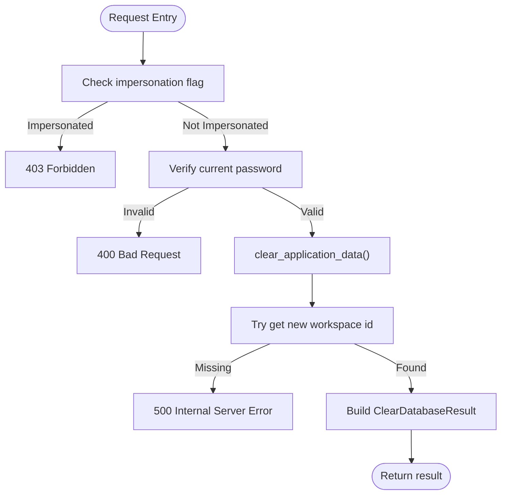
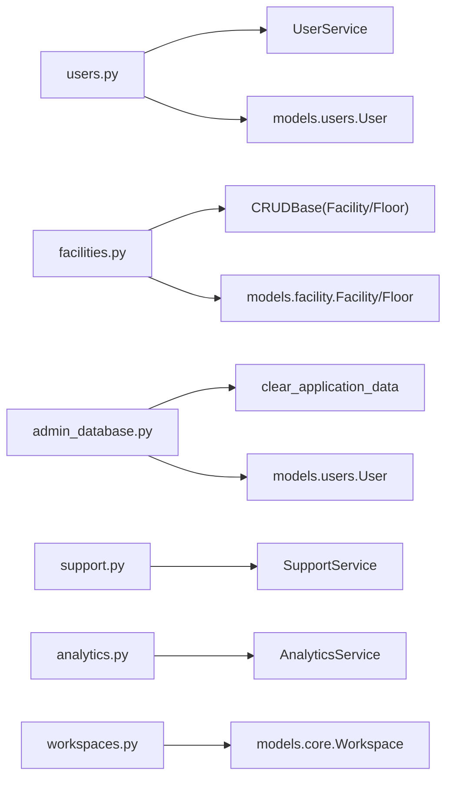

# Administrative Functions

<cite>
**Referenced Files in This Document**
- [admin_database.py](file://server/app/api/endpoints/admin_database.py)
- [admin_database.py](file://server/app/schemas/admin_database.py)
- [users.py](file://server/app/api/endpoints/users.py)
- [users.py](file://server/app/schemas/users.py)
- [facilities.py](file://server/app/api/endpoints/facilities.py)
- [workspaces.py](file://server/app/api/endpoints/workspaces.py)
- [support.py](file://server/app/api/endpoints/support.py)
- [analytics.py](file://server/app/api/endpoints/analytics.py)
- [analytics.py](file://server/app/schemas/analytics.py)
- [alerts.py](file://server/app/api/endpoints/alerts.py)
- [server.py](file://server/app/mcp/server.py)
- [openapi.generated.json](file://server/openapi.generated.json)
- [frontend admin floorplans page.tsx](file://frontend/app/admin/floorplans/page.tsx)
</cite>

## Table of Contents
1. [Introduction](#introduction)
2. [Project Structure](#project-structure)
3. [Core Components](#core-components)
4. [Architecture Overview](#architecture-overview)
5. [Detailed Component Analysis](#detailed-component-analysis)
6. [Dependency Analysis](#dependency-analysis)
7. [Performance Considerations](#performance-considerations)
8. [Troubleshooting Guide](#troubleshooting-guide)
9. [Conclusion](#conclusion)
10. [Appendices](#appendices)

## Introduction
This document provides comprehensive API documentation for administrative functions across the platform. It covers user management, facility and floor administration, floorplan configuration, database maintenance, support ticket management, analytics and reporting, workspace administration, and administrative security controls. It also outlines request/response schemas, bulk operation patterns, and integration points with the frontend administrative dashboards.

## Project Structure
Administrative endpoints are implemented as FastAPI routers under the server application. They are grouped by domain (users, facilities, floorplans, support, analytics, workspaces) and secured via role-based access control. OpenAPI specifications define the surface area of these endpoints and their schemas.

**Diagram sources**
- [admin_database.py:15-59](file://server/app/api/endpoints/admin_database.py#L15-L59)
- [users.py:23-98](file://server/app/api/endpoints/users.py#L23-L98)
- [facilities.py:38-165](file://server/app/api/endpoints/facilities.py#L38-L165)
- [workspaces.py:15-56](file://server/app/api/endpoints/workspaces.py#L15-L56)
- [support.py:62-169](file://server/app/api/endpoints/support.py#L62-L169)
- [analytics.py:17-47](file://server/app/api/endpoints/analytics.py#L17-L47)
- [alerts.py:29-132](file://server/app/api/endpoints/alerts.py#L29-L132)

**Section sources**
- [admin_database.py:1-60](file://server/app/api/endpoints/admin_database.py#L1-L60)
- [users.py:1-99](file://server/app/api/endpoints/users.py#L1-L99)
- [facilities.py:1-166](file://server/app/api/endpoints/facilities.py#L1-L166)
- [workspaces.py:1-58](file://server/app/api/endpoints/workspaces.py#L1-L58)
- [support.py:1-170](file://server/app/api/endpoints/support.py#L1-L170)
- [analytics.py:1-49](file://server/app/api/endpoints/analytics.py#L1-L49)
- [alerts.py:1-134](file://server/app/api/endpoints/alerts.py#L1-L134)

## Core Components
- Administrative database maintenance: wipe application data with password confirmation and session safety checks.
- User management: create, list, search, update, and soft-delete users within a workspace.
- Facility and floor administration: CRUD for facilities and floors scoped to a workspace.
- Floorplan configuration: retrieval of floorplan layouts and presence data.
- Support ticket management: create, list, update, comment, attach, and fetch attachments for tickets.
- Analytics and reporting: alert summaries, vitals averages, and ward summaries.
- Workspace administration: list, create, and activate workspaces.
- Administrative security controls: role gating, impersonation protections, and workspace scoping.

**Section sources**
- [admin_database.py:15-59](file://server/app/api/endpoints/admin_database.py#L15-L59)
- [users.py:23-98](file://server/app/api/endpoints/users.py#L23-L98)
- [facilities.py:38-165](file://server/app/api/endpoints/facilities.py#L38-L165)
- [workspaces.py:15-56](file://server/app/api/endpoints/workspaces.py#L15-L56)
- [support.py:62-169](file://server/app/api/endpoints/support.py#L62-L169)
- [analytics.py:17-47](file://server/app/api/endpoints/analytics.py#L17-L47)
- [alerts.py:29-132](file://server/app/api/endpoints/alerts.py#L29-L132)

## Architecture Overview
Administrative APIs are organized by domain and layered with services and schemas. Security is enforced via role decorators and workspace scoping. Frontend dashboards integrate with these endpoints to provide administrative capabilities.

**Diagram sources**
- [admin_database.py:15-59](file://server/app/api/endpoints/admin_database.py#L15-L59)

**Section sources**
- [admin_database.py:15-59](file://server/app/api/endpoints/admin_database.py#L15-L59)

## Detailed Component Analysis

### Administrative Database Maintenance
- Endpoint: POST /api/admin/database/clear
- Purpose: Wipe all workspaces and domain data; preserve the authenticated admin and create a fresh workspace.
- Security: Admin role required; password verification; disallow during impersonation.
- Request body: ClearDatabaseBody (password)
- Response: ClearDatabaseResult (message, preserved_user_id, new_workspace_id, preserved_username)
- Notes: On success, clients should refresh to the new workspace.

**Diagram sources**
- [admin_database.py:15-59](file://server/app/api/endpoints/admin_database.py#L15-L59)
- [admin_database.py:6-14](file://server/app/schemas/admin_database.py#L6-L14)

**Section sources**
- [admin_database.py:15-59](file://server/app/api/endpoints/admin_database.py#L15-L59)
- [admin_database.py:6-14](file://server/app/schemas/admin_database.py#L6-L14)

### User Management APIs
- Create user: POST /api/users (Admin required)
- List users: GET /api/users (Supervisor+ read)
- Search users: GET /api/users/search (Supervisor+ read)
- Update user: PUT /api/users/{user_id} (Admin required)
- Delete user: DELETE /api/users/{user_id} (Admin required; soft-deletes)

Access control and workspace scoping are enforced via role decorators and workspace context.

**Section sources**
- [users.py:23-98](file://server/app/api/endpoints/users.py#L23-L98)
- [users.py:68-87](file://server/app/schemas/users.py#L68-L87)

### Facility Administration
- List facilities: GET /api/facilities
- Create facility: POST /api/facilities
- Get facility: GET /api/facilities/{facility_id}
- Update facility: PATCH /api/facilities/{facility_id}
- Delete facility: DELETE /api/facilities/{facility_id}

- List floors: GET /api/facilities/{facility_id}/floors
- Create floor: POST /api/facilities/{facility_id}/floors
- Update floor: PATCH /api/facilities/{facility_id}/floors/{floor_id}
- Delete floor: DELETE /api/facilities/{facility_id}/floors/{floor_id} (prevents deletion if rooms exist)

All endpoints are scoped to the current workspace and require appropriate roles.

**Section sources**
- [facilities.py:38-165](file://server/app/api/endpoints/facilities.py#L38-L165)

### Floorplan Configuration
- Get floorplan layout: GET /api/floorplans/layout (requires facility_id and floor_id)
- Get floorplan presence: GET /api/floorplans/presence (requires facility_id and floor_id)

These endpoints are documented in the OpenAPI specification and return structured floorplan data.

**Section sources**
- [openapi.generated.json:8487-8587](file://server/openapi.generated.json#L8487-L8587)
- [openapi.generated.json:8216-8261](file://server/openapi.generated.json#L8216-L8261)

### Support Ticket Management
Endpoints:
- List tickets: GET /api/support/tickets
- Create ticket: POST /api/support/tickets
- Get ticket: GET /api/support/tickets/{ticket_id}
- Patch ticket: PATCH /api/support/tickets/{ticket_id}
- Add comment: POST /api/support/tickets/{ticket_id}/comments
- Add attachment: POST /api/support/tickets/{ticket_id}/attachments
- Download attachment: GET /api/support/tickets/{ticket_id}/attachments/{attachment_id}/content

Security: All authenticated users can access; service enforces workspace and role constraints.

**Section sources**
- [support.py:62-169](file://server/app/api/endpoints/support.py#L62-L169)

### Analytics and Reporting
- Alerts summary: GET /api/analytics/alerts/summary
- Vitals averages: GET /api/analytics/vitals/averages?hours={n}
- Ward summary: GET /api/analytics/wards/summary

Roles: Admin, supervisor, head_nurse, observer (alerts), supervisor/head_nurse (wards).

**Section sources**
- [analytics.py:17-47](file://server/app/api/endpoints/analytics.py#L17-L47)
- [analytics.py:8-25](file://server/app/schemas/analytics.py#L8-L25)

### Workspace Administration
- List workspaces: GET /api/workspaces
- Create workspace: POST /api/workspaces
- Activate workspace: POST /api/workspaces/{ws_id}/activate

Activation updates the admin/supervisor’s current workspace context.

**Section sources**
- [workspaces.py:15-56](file://server/app/api/endpoints/workspaces.py#L15-L56)

### Administrative Security Controls
- Role-based access: RequireRole decorator restricts endpoints to specific roles.
- Workspace scoping: Endpoints bind resources to the current workspace.
- Impersonation protections: Admin actions block impersonation sessions.
- Audit-relevant flows: Support tickets and administrative actions are logged by the backend services.

**Section sources**
- [admin_database.py:25-29](file://server/app/api/endpoints/admin_database.py#L25-L29)
- [users.py:28-33](file://server/app/api/endpoints/users.py#L28-L33)
- [facilities.py:53-55](file://server/app/api/endpoints/facilities.py#L53-L55)

### Administrative MCP Tool (Floor Creation)
- Tool: create_facility_floor (admin-only)
- Parameters: facility_id, name, floor_number
- Behavior: validates actor role, creates floor, returns created floor metadata

**Section sources**
- [server.py:2438-2449](file://server/app/mcp/server.py#L2438-L2449)

### Legacy Floorplans Redirect
- Legacy URL: /admin/floorplans redirects to /admin/facility-management

**Section sources**
- [frontend admin floorplans page.tsx:1-6](file://frontend/app/admin/floorplans/page.tsx#L1-L6)

## Dependency Analysis
Administrative endpoints depend on:
- Role enforcement and workspace context from dependencies
- Services for business logic
- Schemas for request/response validation
- Models for persistence

**Diagram sources**
- [users.py:23-98](file://server/app/api/endpoints/users.py#L23-L98)
- [facilities.py:31-32](file://server/app/api/endpoints/facilities.py#L31-L32)
- [admin_database.py:10-10](file://server/app/api/endpoints/admin_database.py#L10-L10)
- [support.py:22-22](file://server/app/api/endpoints/support.py#L22-L22)
- [analytics.py:13-13](file://server/app/api/endpoints/analytics.py#L13-L13)
- [workspaces.py:9-11](file://server/app/api/endpoints/workspaces.py#L9-L11)

**Section sources**
- [users.py:23-98](file://server/app/api/endpoints/users.py#L23-L98)
- [facilities.py:31-32](file://server/app/api/endpoints/facilities.py#L31-L32)
- [admin_database.py:10-10](file://server/app/api/endpoints/admin_database.py#L10-L10)
- [support.py:22-22](file://server/app/api/endpoints/support.py#L22-L22)
- [analytics.py:13-13](file://server/app/api/endpoints/analytics.py#L13-L13)
- [workspaces.py:9-11](file://server/app/api/endpoints/workspaces.py#L9-L11)

## Performance Considerations
- Pagination and limits: Many endpoints accept limit parameters to constrain result sizes (e.g., user search, analytics).
- Workspace scoping: Queries filter by workspace to avoid cross-boundary scans.
- Bulk operations: Database clear consolidates deletions; consider transaction boundaries and index impact.
- File uploads: Support ticket attachments are streamed; ensure storage capacity and cleanup policies.

[No sources needed since this section provides general guidance]

## Troubleshooting Guide
Common issues and resolutions:
- 403 Forbidden during impersonation: Certain admin actions are blocked while impersonating another user.
- 400 Bad Request on invalid password: Ensure the current admin password is provided for sensitive operations.
- 404 Not Found for facilities/floors: Verify workspace ownership and identifiers.
- 409 Conflict on floor deletion: Ensure no rooms are assigned to the floor before deletion.
- 422 Validation errors: Confirm request bodies match schemas (e.g., user role enums, ticket categories).

**Section sources**
- [admin_database.py:25-35](file://server/app/api/endpoints/admin_database.py#L25-L35)
- [facilities.py:158-161](file://server/app/api/endpoints/facilities.py#L158-L161)
- [support.py:136-154](file://server/app/api/endpoints/support.py#L136-L154)

## Conclusion
The administrative API suite provides comprehensive controls for managing users, facilities, floorplans, support tickets, analytics, and workspaces. Strong role-based access control, workspace scoping, and safeguards against unsafe operations ensure secure administration. Integration with the frontend dashboards enables efficient operational workflows.

[No sources needed since this section summarizes without analyzing specific files]

## Appendices

### Administrative Workflows and Patterns
- Bulk user management: Use search to discover candidates, then update or soft-delete as needed.
- Facility and floor lifecycle: Create facility, add floors, configure rooms, then manage floorplan assets.
- Support ticketing: Create tickets, add comments and attachments, track status, and resolve.
- Analytics-driven decisions: Use alert summaries and vitals averages to guide interventions.
- Workspace activation: Switch contexts safely for administrative tasks.

[No sources needed since this section provides general guidance]

### Integration with Frontend Dashboards
- Admin pages orchestrate administrative tasks by invoking backend endpoints.
- Floorplans redirect ensures canonical navigation to facility management.
- OpenAPI documents define endpoint signatures and schemas for client generation.

**Section sources**
- [frontend admin floorplans page.tsx:1-6](file://frontend/app/admin/floorplans/page.tsx#L1-L6)
- [openapi.generated.json:8487-8587](file://server/openapi.generated.json#L8487-L8587)