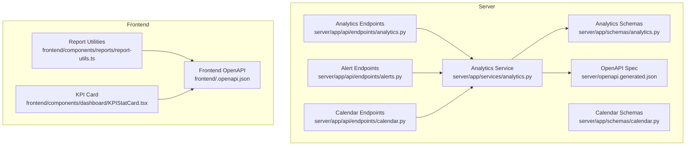
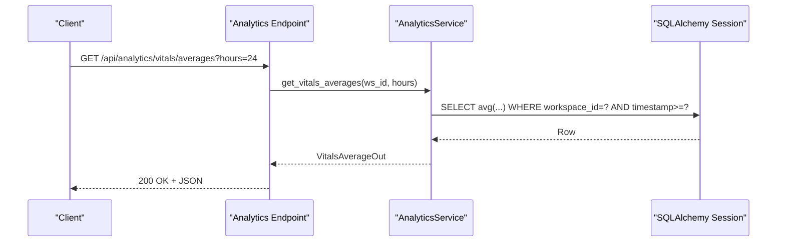

# Analytics & Reporting

<cite>
**Referenced Files in This Document**
- [analytics.py](file://server/app/api/endpoints/analytics.py)
- [analytics.py](file://server/app/schemas/analytics.py)
- [analytics.py](file://server/app/services/analytics.py)
- [alerts.py](file://server/app/api/endpoints/alerts.py)
- [calendar.py](file://server/app/api/endpoints/calendar.py)
- [calendar.py](file://server/app/schemas/calendar.py)
- [test_analytics.py](file://server/tests/test_analytics.py)
- [report-utils.ts](file://frontend/components/reports/report-utils.ts)
- [KPIStatCard.tsx](file://frontend/components/dashboard/KPIStatCard.tsx)
- [openapi.generated.json](file://server/openapi.generated.json)
- [frontend.openapi.json](file://frontend/.openapi.json)
</cite>

## Table of Contents
1. [Introduction](#introduction)
2. [Project Structure](#project-structure)
3. [Core Components](#core-components)
4. [Architecture Overview](#architecture-overview)
5. [Detailed Component Analysis](#detailed-component-analysis)
6. [Dependency Analysis](#dependency-analysis)
7. [Performance Considerations](#performance-considerations)
8. [Troubleshooting Guide](#troubleshooting-guide)
9. [Conclusion](#conclusion)
10. [Appendices](#appendices)

## Introduction
This document provides comprehensive API documentation for analytics and reporting endpoints, including KPI calculation APIs, trend analysis, alert management, calendar integration, and data visualization data endpoints. It also covers real-time analytics streaming, historical data aggregation, and performance metrics. The guide includes request/response schemas, filtering and pagination patterns, data export capabilities, and integration tips for frontend reporting components.

## Project Structure
The analytics and reporting surface spans backend endpoints, schemas, and services, plus frontend components for rendering KPIs and exporting reports. OpenAPI artifacts define the canonical API contracts.



**Diagram sources**
- [analytics.py:1-49](file://server/app/api/endpoints/analytics.py#L1-L49)
- [analytics.py:1-25](file://server/app/schemas/analytics.py#L1-L25)
- [analytics.py:1-91](file://server/app/services/analytics.py#L1-L91)
- [alerts.py:1-134](file://server/app/api/endpoints/alerts.py#L1-L134)
- [calendar.py:1-56](file://server/app/api/endpoints/calendar.py#L1-L56)
- [calendar.py:1-31](file://server/app/schemas/calendar.py#L1-L31)
- [openapi.generated.json:4825-4872](file://server/openapi.generated.json#L4825-L4872)
- [report-utils.ts:1-52](file://frontend/components/reports/report-utils.ts#L1-L52)
- [KPIStatCard.tsx:1-53](file://frontend/components/dashboard/KPIStatCard.tsx#L1-L53)
- [frontend.openapi.json:23117-23171](file://frontend/.openapi.json#L23117-L23171)

**Section sources**
- [analytics.py:1-49](file://server/app/api/endpoints/analytics.py#L1-L49)
- [analytics.py:1-25](file://server/app/schemas/analytics.py#L1-L25)
- [analytics.py:1-91](file://server/app/services/analytics.py#L1-L91)
- [alerts.py:1-134](file://server/app/api/endpoints/alerts.py#L1-L134)
- [calendar.py:1-56](file://server/app/api/endpoints/calendar.py#L1-L56)
- [calendar.py:1-31](file://server/app/schemas/calendar.py#L1-L31)
- [openapi.generated.json:4825-4872](file://server/openapi.generated.json#L4825-L4872)
- [report-utils.ts:1-52](file://frontend/components/reports/report-utils.ts#L1-L52)
- [KPIStatCard.tsx:1-53](file://frontend/components/dashboard/KPIStatCard.tsx#L1-L53)
- [frontend.openapi.json:23117-23171](file://frontend/.openapi.json#L23117-L23171)

## Core Components
- Analytics endpoints: alert summary, vitals averages, ward summary.
- Alert lifecycle endpoints: list, create, get, acknowledge, resolve.
- Calendar read projection endpoint: list events with filtering and limits.
- Frontend KPI cards and CSV report utilities for visualization and export.

**Section sources**
- [analytics.py:17-47](file://server/app/api/endpoints/analytics.py#L17-L47)
- [alerts.py:29-132](file://server/app/api/endpoints/alerts.py#L29-L132)
- [calendar.py:25-55](file://server/app/api/endpoints/calendar.py#L25-L55)
- [KPIStatCard.tsx:8-53](file://frontend/components/dashboard/KPIStatCard.tsx#L8-L53)
- [report-utils.ts:21-52](file://frontend/components/reports/report-utils.ts#L21-L52)

## Architecture Overview
The analytics layer composes FastAPI endpoints, SQLAlchemy queries, and Pydantic schemas. Services encapsulate computation and aggregation logic. OpenAPI documents the contract for clients. Frontend components consume these endpoints and render KPIs and reports.



**Diagram sources**
- [analytics.py:28-38](file://server/app/api/endpoints/analytics.py#L28-L38)
- [analytics.py:44-67](file://server/app/services/analytics.py#L44-L67)
- [openapi.generated.json:4825-4858](file://server/openapi.generated.json#L4825-L4858)

## Detailed Component Analysis

### Analytics Endpoints
- Base path: /api/analytics
- Roles: admin, supervisor, head_nurse, observer (for alerts/summary and vitals/averages); admin, supervisor, head_nurse (for wards/summary)

Endpoints:
- GET /alerts/summary
  - Purpose: Retrieve alert statistics and aggregations.
  - Response model: AlertSummaryOut
  - Roles: admin, supervisor, head_nurse, observer
  - Example request: GET /api/analytics/alerts/summary

- GET /vitals/averages
  - Purpose: Retrieve average vitals for the workspace over a time window.
  - Query: hours (default 24)
  - Response model: VitalsAverageOut
  - Roles: admin, supervisor, head_nurse, observer
  - Example request: GET /api/analytics/vitals/averages?hours=24

- GET /wards/summary
  - Purpose: Retrieve ward overview statistics.
  - Response model: WardSummaryOut
  - Roles: admin, supervisor, head_nurse
  - Example request: GET /api/analytics/wards/summary

Schemas:
- AlertSummaryOut
  - total_active: integer
  - total_resolved: integer
  - by_type: dict of string to integer

- VitalsAverageOut
  - heart_rate_bpm_avg: number or null
  - rr_interval_ms_avg: number or null
  - spo2_avg: number or null

- WardSummaryOut
  - total_patients: integer
  - active_alerts: integer
  - critical_patients: integer

Notes:
- Filtering and pagination are not exposed by these endpoints; they compute aggregates over the workspace scope.

**Section sources**
- [analytics.py:17-47](file://server/app/api/endpoints/analytics.py#L17-L47)
- [analytics.py:8-25](file://server/app/schemas/analytics.py#L8-L25)
- [analytics.py:18-87](file://server/app/services/analytics.py#L18-L87)
- [openapi.generated.json:4825-4872](file://server/openapi.generated.json#L4825-L4872)

### Alert Management Endpoints
- Base path: /api/alerts
- Roles:
  - Create: admin, head_nurse, supervisor, observer, patient
  - Acknowledge/Resolve: admin, head_nurse
  - List/Get: clinical staff and patient

Endpoints:
- GET /
  - Query: status, patient_id, limit (default 100)
  - Returns: list of AlertOut
  - Access control: requires authenticated user; applies visibility rules per role

- POST /
  - Body: AlertCreate
  - Returns: AlertOut
  - Patient role: auto-associates with the authenticated patient’s record

- GET /{alert_id}
  - Returns: AlertOut
  - Access control: enforces patient record visibility

- POST /{alert_id}/acknowledge
  - Body: AlertAcknowledge
  - Returns: AlertOut
  - Effective caregiver_id may come from body or current user

- POST /{alert_id}/resolve
  - Body: AlertResolve
  - Returns: AlertOut

Schemas (selected):
- AlertOut: includes fields such as id, alert_type, severity, status, timestamps, optional patient_id, etc.
- AlertCreate: fields for creating alerts (may include patient_id depending on role)
- AlertAcknowledge: fields for acknowledging (optional caregiver_id)
- AlertResolve: fields for resolving (resolution_note)

Access control highlights:
- Observers may not access /api/analytics/wards/summary (enforced by roles).
- Alert endpoints enforce visibility checks against patient records.

**Section sources**
- [alerts.py:29-132](file://server/app/api/endpoints/alerts.py#L29-L132)
- [test_analytics.py:108-149](file://server/tests/test_analytics.py#L108-L149)

### Calendar Integration Endpoints
- Base path: /api/calendar
- GET /events
  - Query: start_at, end_at, patient_id, person_user_id, person_role, limit (default 500, min 1, max 1000)
  - Response model: list of CalendarEventOut
  - Access control: authenticated users; admins/head nurses bypass visibility; others constrained by visible patients

Schema:
- CalendarEventOut
  - event_id: string
  - event_type: enum ["schedule", "task", "directive", "shift"]
  - source_id: integer
  - title: string
  - description: string
  - starts_at: datetime
  - ends_at: datetime or null
  - status: string or null
  - patient_id: integer or null
  - person_user_id: integer or null
  - person_role: string or null
  - can_edit: boolean
  - metadata: object

**Section sources**
- [calendar.py:25-55](file://server/app/api/endpoints/calendar.py#L25-L55)
- [calendar.py:13-31](file://server/app/schemas/calendar.py#L13-L31)

### Data Visualization Data Endpoints
- Analytics KPIs:
  - /api/analytics/alerts/summary → AlertSummaryOut
  - /api/analytics/vitals/averages → VitalsAverageOut
  - /api/analytics/wards/summary → WardSummaryOut

- Frontend consumption:
  - KPIStatCard renders KPIs with trend indicators and status colors.
  - Report utilities provide CSV building and download helpers.

**Section sources**
- [KPIStatCard.tsx:8-53](file://frontend/components/dashboard/KPIStatCard.tsx#L8-L53)
- [report-utils.ts:21-52](file://frontend/components/reports/report-utils.ts#L21-L52)

### Real-Time Analytics Streaming and Historical Aggregation
- Real-time ingestion:
  - Telemetry payloads are processed and persisted (e.g., vitals) via MQTT handler and services.
  - Analytics endpoints aggregate historical data over configurable windows (e.g., vitals averages over N hours).

- Streaming:
  - No SSE or WebSocket endpoints are present in the analyzed files. Real-time dashboards typically poll analytics endpoints or use separate streaming channels not covered here.

**Section sources**
- [sim_controller.py:800-866](file://server/sim_controller.py#L800-L866)
- [mqtt_handler.py:139-172](file://server/app/mqtt_handler.py#L139-L172)
- [analytics.py:44-67](file://server/app/services/analytics.py#L44-L67)

### Performance Metrics Endpoints
- No dedicated performance metrics endpoints were identified in the analyzed files. Metrics can be derived from analytics aggregations or external profiling.

[No sources needed since this section summarizes absence of specific endpoints]

## Dependency Analysis
```mermaid
classDiagram
class AnalyticsEndpoint {
+GET /alerts/summary
+GET /vitals/averages
+GET /wards/summary
}
class AlertEndpoint {
+GET /
+POST /
+GET /{id}
+POST /{id}/acknowledge
+POST /{id}/resolve
}
class CalendarEndpoint {
+GET /events
}
class AnalyticsService {
+get_alert_summary()
+get_vitals_averages()
+get_ward_summary()
}
class AlertService {
+create()
+get()
+get_active_alerts()
+acknowledge()
+resolve()
}
class CalendarService {
+list_calendar_events()
}
AnalyticsEndpoint --> AnalyticsService : "calls"
AlertEndpoint --> AlertService : "calls"
CalendarEndpoint --> CalendarService : "calls"
```

**Diagram sources**
- [analytics.py:17-47](file://server/app/api/endpoints/analytics.py#L17-L47)
- [alerts.py:29-132](file://server/app/api/endpoints/alerts.py#L29-L132)
- [calendar.py:25-55](file://server/app/api/endpoints/calendar.py#L25-L55)
- [analytics.py:18-87](file://server/app/services/analytics.py#L18-L87)

**Section sources**
- [analytics.py:17-47](file://server/app/api/endpoints/analytics.py#L17-L47)
- [alerts.py:29-132](file://server/app/api/endpoints/alerts.py#L29-L132)
- [calendar.py:25-55](file://server/app/api/endpoints/calendar.py#L25-L55)
- [analytics.py:18-87](file://server/app/services/analytics.py#L18-L87)

## Performance Considerations
- Use appropriate query windows:
  - vitals averages endpoint accepts an hours parameter to bound the aggregation window.
- Limit lists:
  - Alerts list endpoint supports a limit parameter (default 100) to constrain result sets.
- Pagination:
  - Analytics endpoints do not expose explicit pagination; consider client-side slicing or upstream enhancements if needed.
- Indexing:
  - Ensure database indexes exist on frequently filtered columns (workspace_id, timestamp, status) to optimize analytics queries.

[No sources needed since this section provides general guidance]

## Troubleshooting Guide
- 403 Forbidden on /api/analytics/wards/summary:
  - Observed behavior: observer role is forbidden; only admin, supervisor, head_nurse are permitted.
- Validation errors:
  - OpenAPI documents validation responses (e.g., HTTPValidationError) for analytics and alerts endpoints.
- Alert lifecycle:
  - Tests demonstrate expected transitions: active → acknowledged → resolved, with proper timestamps and notes.

**Section sources**
- [test_analytics.py:108-149](file://server/tests/test_analytics.py#L108-L149)
- [openapi.generated.json:4540-4637](file://server/openapi.generated.json#L4540-L4637)

## Conclusion
The analytics and reporting surface provides robust KPI computation, alert lifecycle management, and calendar read projections. Clients should leverage the documented schemas and endpoints, apply appropriate filtering and limits, and integrate with frontend components for visualization and export. For real-time dashboards, polling analytics endpoints or extending the platform with streaming channels is recommended.

[No sources needed since this section summarizes without analyzing specific files]

## Appendices

### Request/Response Schemas Reference
- AlertSummaryOut
  - total_active: integer
  - total_resolved: integer
  - by_type: object mapping alert_type to count

- VitalsAverageOut
  - heart_rate_bpm_avg: number or null
  - rr_interval_ms_avg: number or null
  - spo2_avg: number or null

- WardSummaryOut
  - total_patients: integer
  - active_alerts: integer
  - critical_patients: integer

- CalendarEventOut
  - event_id: string
  - event_type: enum ["schedule", "task", "directive", "shift"]
  - source_id: integer
  - title: string
  - description: string
  - starts_at: datetime
  - ends_at: datetime or null
  - status: string or null
  - patient_id: integer or null
  - person_user_id: integer or null
  - person_role: string or null
  - can_edit: boolean
  - metadata: object

**Section sources**
- [analytics.py:8-25](file://server/app/schemas/analytics.py#L8-L25)
- [calendar.py:13-31](file://server/app/schemas/calendar.py#L13-L31)
- [frontend.openapi.json:23117-23171](file://frontend/.openapi.json#L23117-L23171)

### Filtering and Pagination Patterns
- Analytics:
  - No explicit pagination; use smaller time windows or client-side constraints.
- Alerts:
  - Query parameters: status, patient_id, limit (default 100).
  - Visibility enforced per role and patient access rules.

**Section sources**
- [alerts.py:30-55](file://server/app/api/endpoints/alerts.py#L30-L55)
- [analytics.py:44-67](file://server/app/services/analytics.py#L44-L67)

### Data Export Capabilities
- CSV export:
  - Frontend utilities provide CSV building and download helpers for reports.
- Filename generation:
  - Template-based naming with time window included.

**Section sources**
- [report-utils.ts:21-52](file://frontend/components/reports/report-utils.ts#L21-L52)

### Real-Time Dashboard Data Updates
- Current state:
  - No SSE endpoints detected in the analyzed files.
- Recommended approach:
  - Poll analytics endpoints at intervals suitable for dashboard refresh.
  - Extend platform with streaming channels if real-time updates are required.

[No sources needed since this section provides general guidance]