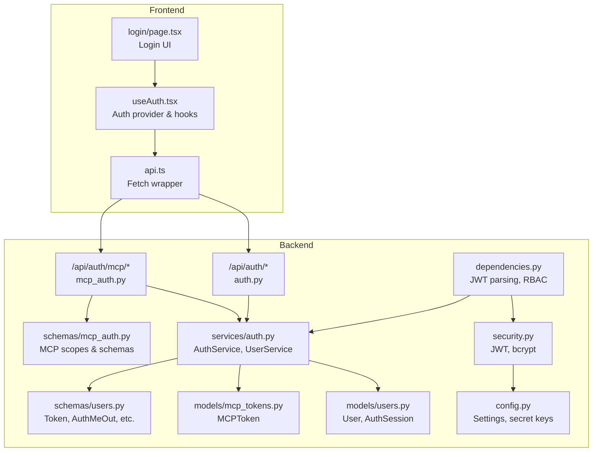
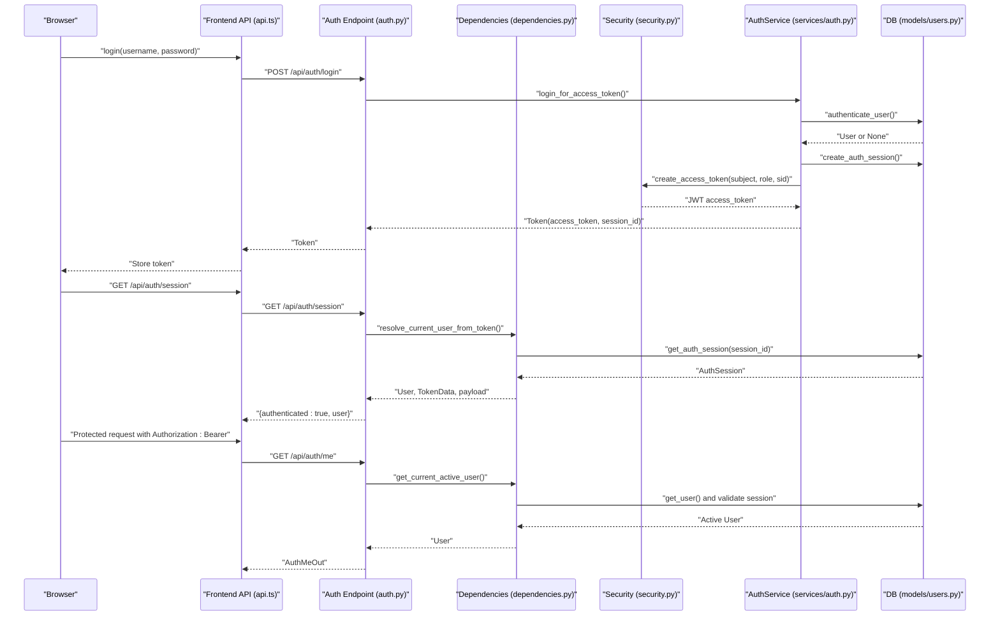
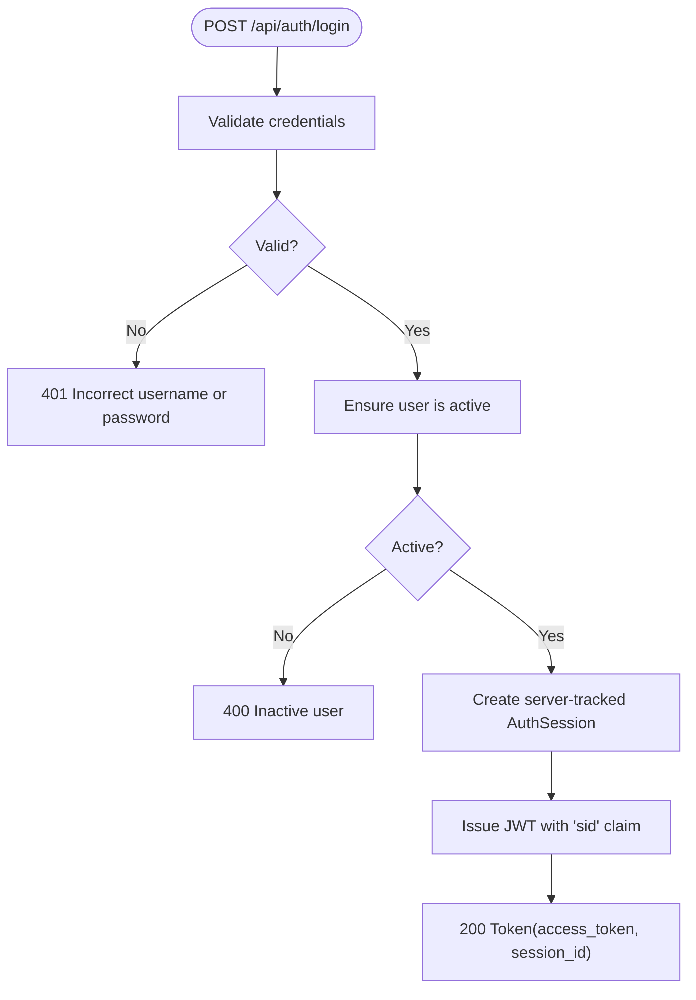
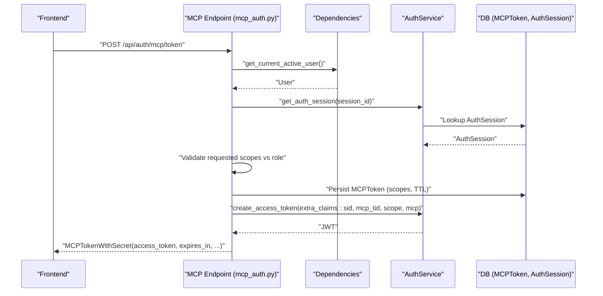
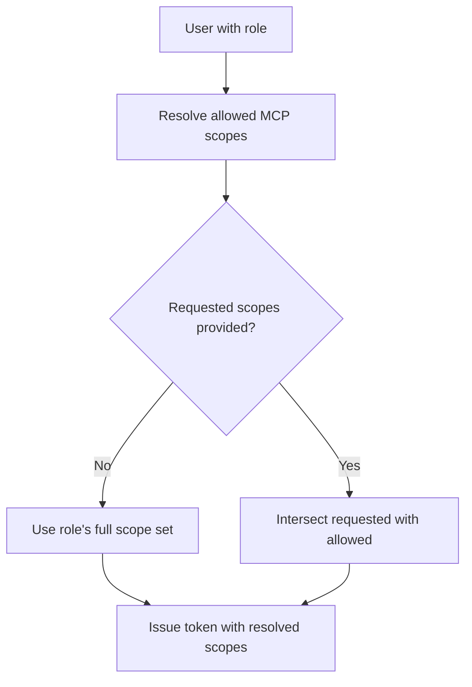
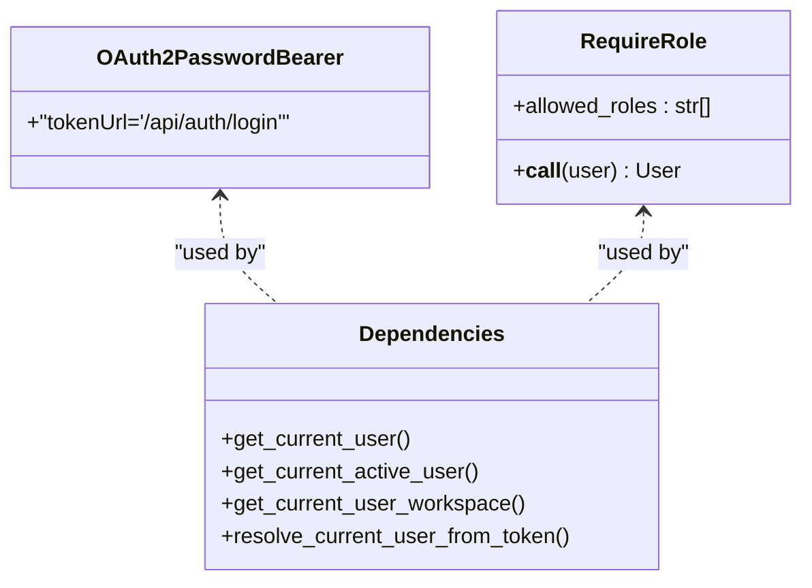
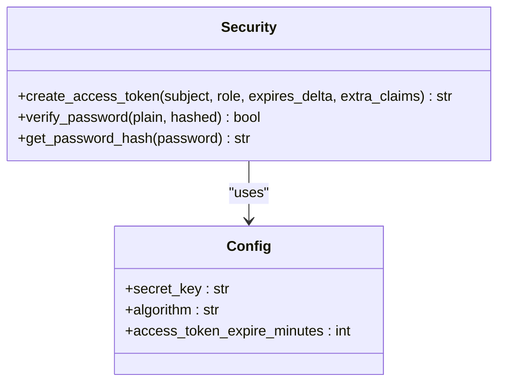
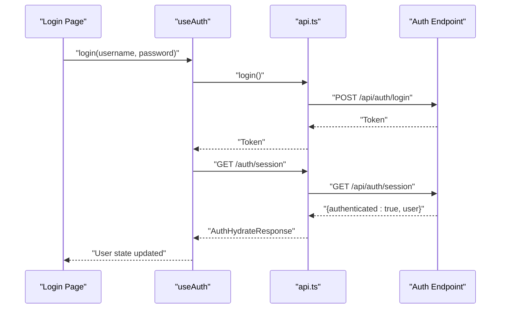
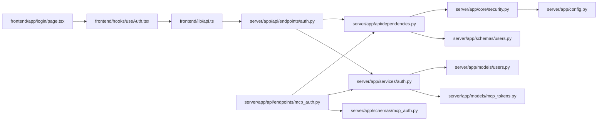

# Authentication & Authorization

<cite>
**Referenced Files in This Document**
- [auth.py](file://server/app/api/endpoints/auth.py)
- [mcp_auth.py](file://server/app/api/endpoints/mcp_auth.py)
- [security.py](file://server/app/core/security.py)
- [users.py](file://server/app/models/users.py)
- [mcp_tokens.py](file://server/app/models/mcp_tokens.py)
- [auth.py](file://server/app/services/auth.py)
- [users.py](file://server/app/schemas/users.py)
- [mcp_auth.py](file://server/app/schemas/mcp_auth.py)
- [dependencies.py](file://server/app/api/dependencies.py)
- [config.py](file://server/app/config.py)
- [api.ts](file://frontend/lib/api.ts)
- [useAuth.tsx](file://frontend/hooks/useAuth.tsx)
- [.openapi.json](file://frontend/.openapi.json)
- [page.tsx](file://frontend/app/login/page.tsx)
</cite>

## Table of Contents
1. [Introduction](#introduction)
2. [Project Structure](#project-structure)
3. [Core Components](#core-components)
4. [Architecture Overview](#architecture-overview)
5. [Detailed Component Analysis](#detailed-component-analysis)
6. [Dependency Analysis](#dependency-analysis)
7. [Performance Considerations](#performance-considerations)
8. [Troubleshooting Guide](#troubleshooting-guide)
9. [Conclusion](#conclusion)
10. [Appendices](#appendices)

## Introduction
This document provides comprehensive API documentation for authentication and authorization in the platform. It covers:
- Login and logout endpoints
- JWT token management and validation
- Session handling and lifecycle
- MCP (Model Context Protocol) authentication flows
- Role-based access control (RBAC), workspace scoping, and permission validation
- Authentication middleware and dependency injection patterns
- Token-based security implementation
- Request/response schemas, error handling, and security considerations
- Examples of authenticated API usage and frontend integration

## Project Structure
Authentication spans backend endpoints, services, models, schemas, and frontend integration:
- Backend FastAPI endpoints for OAuth2 password flow, session hydration, and MCP token management
- Security utilities for JWT creation and password hashing
- Database models for users, sessions, and MCP tokens
- Services encapsulating business logic for authentication and user operations
- Frontend API client and auth hooks integrating with backend endpoints

**Diagram sources**
- [auth.py:1-269](file://server/app/api/endpoints/auth.py#L1-L269)
- [mcp_auth.py:1-339](file://server/app/api/endpoints/mcp_auth.py#L1-L339)
- [dependencies.py:1-402](file://server/app/api/dependencies.py#L1-L402)
- [security.py:1-56](file://server/app/core/security.py#L1-L56)
- [auth.py:1-688](file://server/app/services/auth.py#L1-L688)
- [users.py:1-92](file://server/app/models/users.py#L1-L92)
- [mcp_tokens.py:1-84](file://server/app/models/mcp_tokens.py#L1-L84)
- [users.py:1-257](file://server/app/schemas/users.py#L1-L257)
- [mcp_auth.py:1-212](file://server/app/schemas/mcp_auth.py#L1-L212)
- [config.py:1-152](file://server/app/config.py#L1-L152)
- [api.ts:1-1092](file://frontend/lib/api.ts#L1-L1092)
- [useAuth.tsx:1-184](file://frontend/hooks/useAuth.tsx#L1-L184)
- [page.tsx:1-251](file://frontend/app/login/page.tsx#L1-L251)

**Section sources**
- [auth.py:1-269](file://server/app/api/endpoints/auth.py#L1-L269)
- [mcp_auth.py:1-339](file://server/app/api/endpoints/mcp_auth.py#L1-L339)
- [dependencies.py:1-402](file://server/app/api/dependencies.py#L1-L402)
- [security.py:1-56](file://server/app/core/security.py#L1-L56)
- [auth.py:1-688](file://server/app/services/auth.py#L1-L688)
- [users.py:1-92](file://server/app/models/users.py#L1-L92)
- [mcp_tokens.py:1-84](file://server/app/models/mcp_tokens.py#L1-L84)
- [users.py:1-257](file://server/app/schemas/users.py#L1-L257)
- [mcp_auth.py:1-212](file://server/app/schemas/mcp_auth.py#L1-L212)
- [config.py:1-152](file://server/app/config.py#L1-L152)
- [api.ts:1-1092](file://frontend/lib/api.ts#L1-L1092)
- [useAuth.tsx:1-184](file://frontend/hooks/useAuth.tsx#L1-L184)
- [page.tsx:1-251](file://frontend/app/login/page.tsx#L1-L251)

## Core Components
- Authentication endpoints
  - OAuth2 password flow: POST /api/auth/login
  - Session hydration: GET /api/auth/session
  - Current user: GET /api/auth/me
  - Profile read/write: GET/PATCH /api/auth/me/profile
  - Password change: POST /api/auth/change-password
  - Sessions listing and revocation: GET /api/auth/sessions, DELETE /api/auth/sessions/{session_id}, POST /api/auth/logout
  - Impersonation: POST /api/auth/impersonate/start
- MCP authentication endpoints
  - Create MCP token: POST /api/auth/mcp/token
  - List MCP tokens: GET /api/auth/mcp/tokens
  - Get MCP token: GET /api/auth/mcp/token/{token_id}
  - Revoke MCP token: DELETE /api/auth/mcp/token/{token_id}, POST /api/auth/mcp/tokens/revoke-all
- Security utilities
  - JWT creation and validation
  - Password hashing and verification
- Models
  - User, AuthSession, MCPToken
- Services
  - AuthService: authentication, session lifecycle, impersonation
  - UserService: user operations, profile updates
- Dependencies and middleware
  - OAuth2PasswordBearer, token parsing, RBAC checks, workspace scoping
- Frontend integration
  - API client with JWT, error handling, typed responses
  - Auth provider and hooks for login, logout, impersonation

**Section sources**
- [auth.py:57-269](file://server/app/api/endpoints/auth.py#L57-L269)
- [mcp_auth.py:93-339](file://server/app/api/endpoints/mcp_auth.py#L93-L339)
- [security.py:21-56](file://server/app/core/security.py#L21-L56)
- [users.py:9-92](file://server/app/models/users.py#L9-L92)
- [mcp_tokens.py:10-84](file://server/app/models/mcp_tokens.py#L10-L84)
- [auth.py:458-688](file://server/app/services/auth.py#L458-L688)
- [dependencies.py:30-150](file://server/app/api/dependencies.py#L30-L150)
- [api.ts:209-383](file://frontend/lib/api.ts#L209-L383)
- [useAuth.tsx:48-184](file://frontend/hooks/useAuth.tsx#L48-L184)

## Architecture Overview
The authentication architecture combines OAuth2 password flow with JWT-based session tokens and server-tracked sessions. MCP tokens are short-lived, scope-narrowed tokens for external MCP clients, linked to parent sessions for cascading revocation.

**Diagram sources**
- [auth.py:57-106](file://server/app/api/endpoints/auth.py#L57-L106)
- [dependencies.py:58-121](file://server/app/api/dependencies.py#L58-L121)
- [security.py:21-41](file://server/app/core/security.py#L21-L41)
- [auth.py:588-627](file://server/app/services/auth.py#L588-L627)
- [users.py:59-92](file://server/app/models/users.py#L59-L92)
- [api.ts:299-338](file://frontend/lib/api.ts#L299-L338)
- [useAuth.tsx:48-86](file://frontend/hooks/useAuth.tsx#L48-L86)

## Detailed Component Analysis

### Authentication Endpoints
- POST /api/auth/login
  - OAuth2 password flow
  - Validates credentials, ensures user is active, creates a server-tracked session, and issues a JWT with a session ID claim
  - Response: Token with access_token, token_type, session_id
- GET /api/auth/session
  - Probe endpoint returning 200 with authenticated flag and user info when a valid Bearer token is present and session is active
  - Used by frontend to hydrate auth state without triggering redirects
- GET /api/auth/me
  - Returns current authenticated user profile
- GET /api/auth/me/profile and PATCH /api/auth/me/profile
  - Retrieve and update current user’s profile and linked caregiver/patient details
- POST /api/auth/change-password
  - Changes current user’s password after validating current password
- GET /api/auth/sessions
  - Lists all active sessions for the current user in the current workspace
- POST /api/auth/logout
  - Revokes the current session and returns 204 No Content
- DELETE /api/auth/sessions/{session_id}
  - Revokes a specific session (requires ownership or admin role)
- POST /api/auth/impersonate/start
  - Admin-only endpoint to issue a short-lived token acting as another workspace user

**Diagram sources**
- [auth.py:57-72](file://server/app/api/endpoints/auth.py#L57-L72)
- [auth.py:588-627](file://server/app/services/auth.py#L588-L627)

**Section sources**
- [auth.py:57-204](file://server/app/api/endpoints/auth.py#L57-L204)
- [auth.py:588-688](file://server/app/services/auth.py#L588-L688)
- [users.py:59-92](file://server/app/models/users.py#L59-L92)

### MCP Authentication Endpoints
- POST /api/auth/mcp/token
  - Creates a short-lived MCP token (default 60 minutes, capped at 60) scoped to requested MCP scopes allowed by the user’s role
  - Requires an active tracked session; the MCP token is linked to the session for cascading revocation
  - Returns the MCP token with the actual secret once; subsequent retrievals only show metadata
- GET /api/auth/mcp/tokens
  - Lists MCP tokens for the current user; include_revoked flag toggles inclusion of revoked/expired tokens
- GET /api/auth/mcp/token/{token_id}
  - Retrieves MCP token details; users can only view their own tokens unless admin
- DELETE /api/auth/mcp/token/{token_id}
  - Revokes a specific MCP token; users can revoke their own tokens unless admin; admin can revoke any token in the workspace
- POST /api/auth/mcp/tokens/revoke-all
  - Revokes all active MCP tokens for the current user

**Diagram sources**
- [mcp_auth.py:93-178](file://server/app/api/endpoints/mcp_auth.py#L93-L178)
- [dependencies.py:131-150](file://server/app/api/dependencies.py#L131-L150)
- [auth.py:518-524](file://server/app/services/auth.py#L518-L524)
- [mcp_tokens.py:10-84](file://server/app/models/mcp_tokens.py#L10-L84)

**Section sources**
- [mcp_auth.py:93-339](file://server/app/api/endpoints/mcp_auth.py#L93-L339)
- [mcp_auth.py:119-134](file://server/app/schemas/mcp_auth.py#L119-L134)
- [mcp_tokens.py:10-84](file://server/app/models/mcp_tokens.py#L10-L84)

### Role-Based Access Control and Workspace Scoping
- Roles and capabilities
  - Roles: admin, head_nurse, supervisor, observer, patient
  - Capability maps define allowed operations per role
- Token scopes for MCP
  - Role-to-scope mapping defines allowed MCP scopes; requested scopes are intersected with allowed ones
- Workspace scoping
  - All user and session operations are scoped to the current workspace derived from the authenticated user
- Validation utilities
  - assert_patient_record_access and related helpers enforce access rules for patients and assigned devices

**Diagram sources**
- [dependencies.py:250-311](file://server/app/api/dependencies.py#L250-L311)
- [mcp_auth.py:119-134](file://server/app/schemas/mcp_auth.py#L119-L134)

**Section sources**
- [dependencies.py:159-311](file://server/app/api/dependencies.py#L159-L311)
- [mcp_auth.py:15-116](file://server/app/schemas/mcp_auth.py#L15-L116)

### Authentication Middleware and Dependency Injection
- OAuth2PasswordBearer
  - Token URL points to /api/auth/login
- Token resolution
  - resolve_current_user_from_token decodes JWT, validates session existence and expiry, and attaches session and scope metadata to the user object
- RBAC enforcement
  - RequireRole dependency checks role membership and raises 403 for unauthorized access
- Workspace scoping
  - get_current_user_workspace resolves the current workspace for protected endpoints

**Diagram sources**
- [dependencies.py:30-170](file://server/app/api/dependencies.py#L30-L170)
- [dependencies.py:159-170](file://server/app/api/dependencies.py#L159-L170)

**Section sources**
- [dependencies.py:30-170](file://server/app/api/dependencies.py#L30-L170)

### Token-Based Security Implementation
- JWT claims
  - sub: user ID
  - role: user role
  - sid: server-tracked session ID
  - Additional claims for MCP tokens include mcp_tid, scope, and mcp flag
- Secret key and algorithm
  - HS256 with configurable secret key and expiration minutes
- Password hashing
  - bcrypt for secure password hashing and verification

**Diagram sources**
- [security.py:21-56](file://server/app/core/security.py#L21-L56)
- [config.py:47-51](file://server/app/config.py#L47-L51)

**Section sources**
- [security.py:21-56](file://server/app/core/security.py#L21-L56)
- [config.py:47-51](file://server/app/config.py#L47-L51)

### Frontend Authentication Integration
- API client
  - Provides login, logout, impersonation, and typed request helpers
  - Handles 401 redirects to /login and timeout handling
- Auth provider and hooks
  - Hydrates user state via GET /api/auth/session
  - Supports login, logout, impersonation start/stop
- Login page
  - Collects credentials, validates input, and triggers login flow

**Diagram sources**
- [page.tsx:69-90](file://frontend/app/login/page.tsx#L69-L90)
- [useAuth.tsx:115-135](file://frontend/hooks/useAuth.tsx#L115-L135)
- [api.ts:299-338](file://frontend/lib/api.ts#L299-L338)
- [auth.py:75-96](file://server/app/api/endpoints/auth.py#L75-L96)

**Section sources**
- [api.ts:209-383](file://frontend/lib/api.ts#L209-L383)
- [useAuth.tsx:48-184](file://frontend/hooks/useAuth.tsx#L48-L184)
- [page.tsx:40-90](file://frontend/app/login/page.tsx#L40-L90)

## Dependency Analysis
- Backend dependencies
  - Endpoints depend on services for business logic
  - Services depend on models for persistence and schemas for validation
  - Dependencies module centralizes JWT parsing, RBAC, and workspace scoping
- Frontend dependencies
  - API client depends on constants for base URL and routes
  - Auth hooks depend on API client and React state

**Diagram sources**
- [api.ts:1-1092](file://frontend/lib/api.ts#L1-L1092)
- [useAuth.tsx:1-184](file://frontend/hooks/useAuth.tsx#L1-L184)
- [page.tsx:1-251](file://frontend/app/login/page.tsx#L1-L251)
- [auth.py:1-269](file://server/app/api/endpoints/auth.py#L1-L269)
- [mcp_auth.py:1-339](file://server/app/api/endpoints/mcp_auth.py#L1-L339)
- [dependencies.py:1-402](file://server/app/api/dependencies.py#L1-L402)
- [auth.py:1-688](file://server/app/services/auth.py#L1-L688)
- [security.py:1-56](file://server/app/core/security.py#L1-L56)
- [users.py:1-92](file://server/app/models/users.py#L1-L92)
- [mcp_tokens.py:1-84](file://server/app/models/mcp_tokens.py#L1-L84)
- [users.py:1-257](file://server/app/schemas/users.py#L1-L257)
- [mcp_auth.py:1-212](file://server/app/schemas/mcp_auth.py#L1-L212)
- [config.py:1-152](file://server/app/config.py#L1-L152)

**Section sources**
- [dependencies.py:1-402](file://server/app/api/dependencies.py#L1-L402)
- [auth.py:1-688](file://server/app/services/auth.py#L1-L688)
- [users.py:1-92](file://server/app/models/users.py#L1-L92)
- [mcp_tokens.py:1-84](file://server/app/models/mcp_tokens.py#L1-L84)
- [users.py:1-257](file://server/app/schemas/users.py#L1-L257)
- [mcp_auth.py:1-212](file://server/app/schemas/mcp_auth.py#L1-L212)
- [security.py:1-56](file://server/app/core/security.py#L1-L56)
- [config.py:1-152](file://server/app/config.py#L1-L152)
- [api.ts:1-1092](file://frontend/lib/api.ts#L1-L1092)
- [useAuth.tsx:1-184](file://frontend/hooks/useAuth.tsx#L1-L184)
- [page.tsx:1-251](file://frontend/app/login/page.tsx#L1-L251)

## Performance Considerations
- Token TTL and session expiry
  - Adjust access_token_expire_minutes in settings to balance security and UX
- Session tracking
  - Server-tracked sessions enable immediate revocation; ensure proper cleanup and indexing on auth_sessions
- MCP token lifecycle
  - Short TTLs reduce risk exposure; batch revoke-all when needed
- Frontend hydration
  - Use GET /api/auth/session to avoid unnecessary 401 errors on startup and reduce redirect churn

[No sources needed since this section provides general guidance]

## Troubleshooting Guide
- Invalid credentials
  - POST /api/auth/login returns 401 with detail “Incorrect username or password” when credentials are invalid
- Inactive user
  - POST /api/auth/login returns 400 with detail “Inactive user”
- Session not active
  - GET /api/auth/session and protected endpoints return 401 with detail “Session is no longer active” when session is revoked or expired
- Insufficient permissions
  - 403 responses when role lacks required permissions (e.g., admin-only endpoints)
- MCP token issues
  - 400 Bad Request for invalid scopes or missing tracked session
  - 403 Forbidden when role has no MCP access or requested scopes exceed permissions
- Frontend redirects
  - 401 triggers automatic redirect to /login in the API client

**Section sources**
- [auth.py:599-607](file://server/app/services/auth.py#L599-L607)
- [auth.py:84-95](file://server/app/api/endpoints/auth.py#L84-L95)
- [dependencies.py:98-114](file://server/app/api/dependencies.py#L98-L114)
- [mcp_auth.py:112-124](file://server/app/api/endpoints/mcp_auth.py#L112-L124)
- [mcp_auth.py:85-88](file://server/app/api/endpoints/mcp_auth.py#L85-L88)
- [api.ts:251-256](file://frontend/lib/api.ts#L251-L256)

## Conclusion
The platform implements a robust, layered authentication and authorization system:
- OAuth2 password flow with JWT and server-tracked sessions
- Strict RBAC with workspace scoping and MCP token support for external clients
- Comprehensive frontend integration with resilient auth state hydration and error handling
- Strong security foundations using bcrypt and configurable JWT settings

[No sources needed since this section summarizes without analyzing specific files]

## Appendices

### API Reference: Authentication Endpoints
- POST /api/auth/login
  - Description: OAuth2 compatible token login
  - Request: application/x-www-form-urlencoded with username and password
  - Response: 200 Token
  - Security: None
- GET /api/auth/session
  - Description: Browser-friendly session probe
  - Response: 200 AuthHydrateOut
  - Security: None
- GET /api/auth/me
  - Description: Get current user information
  - Response: 200 AuthMeOut
  - Security: OAuth2PasswordBearer
- GET /api/auth/me/profile
  - Description: Get current user with linked profiles
  - Response: 200 AuthMeProfileOut
  - Security: OAuth2PasswordBearer
- PATCH /api/auth/me/profile
  - Description: Update user and linked profiles
  - Response: 200 AuthMeProfileOut
  - Security: OAuth2PasswordBearer
- POST /api/auth/change-password
  - Description: Change current password
  - Response: 200 OK
  - Security: OAuth2PasswordBearer
- GET /api/auth/sessions
  - Description: List active sessions
  - Response: 200 list[AuthSessionOut]
  - Security: OAuth2PasswordBearer
- POST /api/auth/logout
  - Description: Logout current session
  - Response: 204 No Content
  - Security: OAuth2PasswordBearer
- DELETE /api/auth/sessions/{session_id}
  - Description: Revoke a session
  - Response: 204 No Content
  - Security: OAuth2PasswordBearer
- POST /api/auth/impersonate/start
  - Description: Admin act-as token for target user
  - Response: 200 Token
  - Security: OAuth2PasswordBearer (admin required)

**Section sources**
- [.openapi.json:5129-5162](file://frontend/.openapi.json#L5129-L5162)
- [.openapi.json:5163-5171](file://frontend/.openapi.json#L5163-L5171)
- [.openapi.json:5163-5427](file://frontend/.openapi.json#L5163-L5427)

### API Reference: MCP Authentication Endpoints
- POST /api/auth/mcp/token
  - Description: Create MCP token with requested scopes and TTL
  - Response: 201 MCPTokenWithSecret
  - Security: OAuth2PasswordBearer
- GET /api/auth/mcp/tokens
  - Description: List MCP tokens
  - Response: 200 MCPTokenList
  - Security: OAuth2PasswordBearer
- GET /api/auth/mcp/token/{token_id}
  - Description: Get MCP token details
  - Response: 200 MCPTokenOut
  - Security: OAuth2PasswordBearer
- DELETE /api/auth/mcp/token/{token_id}
  - Description: Revoke MCP token
  - Response: 204 No Content
  - Security: OAuth2PasswordBearer
- POST /api/auth/mcp/tokens/revoke-all
  - Description: Revoke all active MCP tokens
  - Response: 204 No Content
  - Security: OAuth2PasswordBearer

**Section sources**
- [.openapi.json:5163-5427](file://frontend/.openapi.json#L5163-L5427)
- [mcp_auth.py:93-339](file://server/app/api/endpoints/mcp_auth.py#L93-L339)

### Request/Response Schemas
- Token
  - access_token: string
  - token_type: string
  - session_id: string?
  - impersonation: boolean?
  - actor_admin_id: number? (when impersonating)
  - impersonated_user_id: number? (when impersonating)
- AuthHydrateOut
  - authenticated: boolean
  - user: AuthMeOut? (when authenticated)
- AuthMeOut
  - id, username, role, is_active, workspace_id, created_at, updated_at
  - impersonation: boolean?
  - impersonated_by_user_id: number?
  - email: string?
  - phone: string?
- AuthMeProfileOut
  - user: AuthMeOut
  - linked_caregiver: LinkedCaregiverProfileOut?
  - linked_patient: LinkedPatientProfileOut?
- AuthSessionOut
  - id, user_agent, ip_address, impersonated_by_user_id?, created_at, updated_at, last_seen_at, expires_at, revoked_at?, current: boolean
- MCPTokenWithSecret
  - id, access_token, token_type, client_name, client_origin, scopes, expires_at, expires_in
- MCPTokenOut
  - id, client_name, client_origin, scopes, created_at, updated_at, expires_at, revoked_at?, last_used_at?, is_active: boolean
- MCPTokenList
  - tokens: list[MCPTokenOut]
  - total: int

**Section sources**
- [users.py:33-174](file://server/app/schemas/users.py#L33-L174)
- [users.py:229-244](file://server/app/schemas/users.py#L229-L244)
- [mcp_auth.py:159-196](file://server/app/schemas/mcp_auth.py#L159-L196)

### Security Considerations
- Secret key management
  - Ensure SECRET_KEY is not the default value; validate at startup
- Token storage
  - Store JWT access_token securely; never expose the secret in client-side code
- Session lifecycle
  - Revoke sessions on logout and when changing passwords
- MCP tokens
  - Treat the actual secret as sensitive; store securely and rotate regularly
- CORS and origins
  - Configure MCP allowed origins and consider requiring origin validation

**Section sources**
- [config.py:133-134](file://server/app/config.py#L133-L134)
- [security.py:13-19](file://server/app/core/security.py#L13-L19)
- [mcp_auth.py:44-55](file://server/app/api/endpoints/mcp_auth.py#L44-L55)

### Example Usage Patterns
- Logging in and accessing protected resources
  - POST /api/auth/login with username/password
  - Use returned access_token in Authorization: Bearer header for subsequent requests
  - Call GET /api/auth/me to verify identity
- Managing sessions
  - GET /api/auth/sessions to list sessions
  - DELETE /api/auth/sessions/{session_id} to revoke a session
  - POST /api/auth/logout to revoke current session
- Using MCP tokens
  - POST /api/auth/mcp/token with requested_scopes and ttl_minutes
  - Use the returned access_token for MCP endpoints
  - Revoke tokens via DELETE /api/auth/mcp/token/{token_id} or POST /api/auth/mcp/tokens/revoke-all

**Section sources**
- [auth.py:57-204](file://server/app/api/endpoints/auth.py#L57-L204)
- [mcp_auth.py:93-339](file://server/app/api/endpoints/mcp_auth.py#L93-L339)
- [api.ts:299-338](file://frontend/lib/api.ts#L299-L338)
- [useAuth.tsx:115-181](file://frontend/hooks/useAuth.tsx#L115-L181)