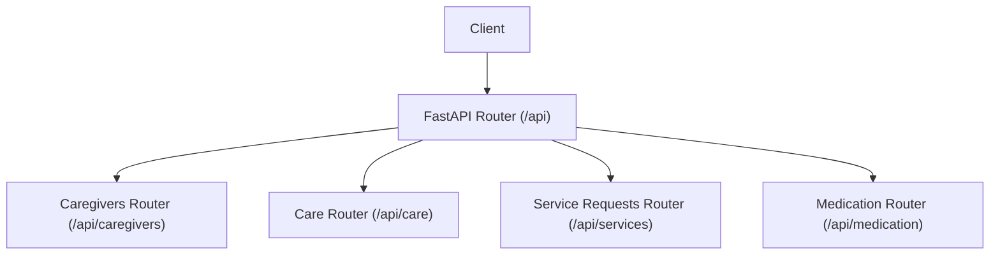
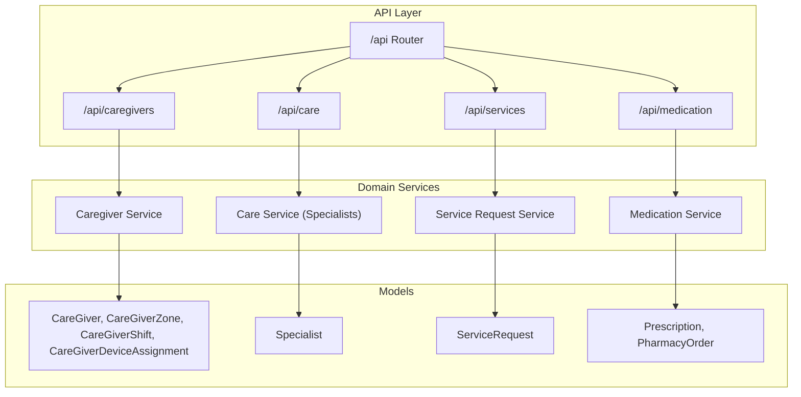
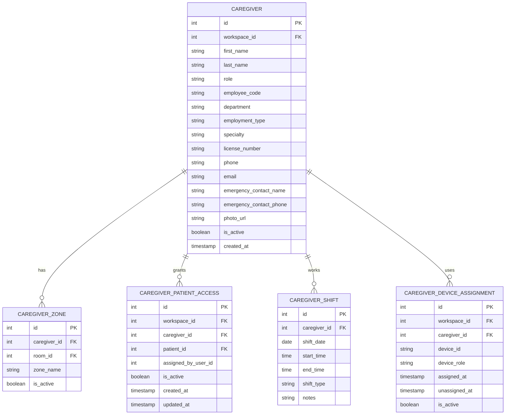
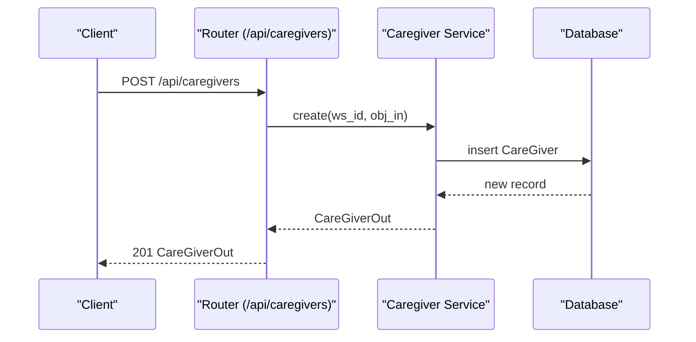
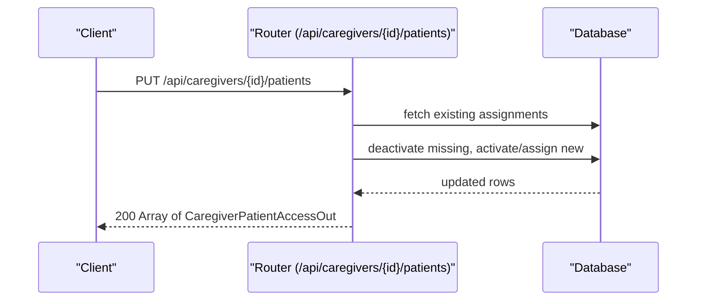
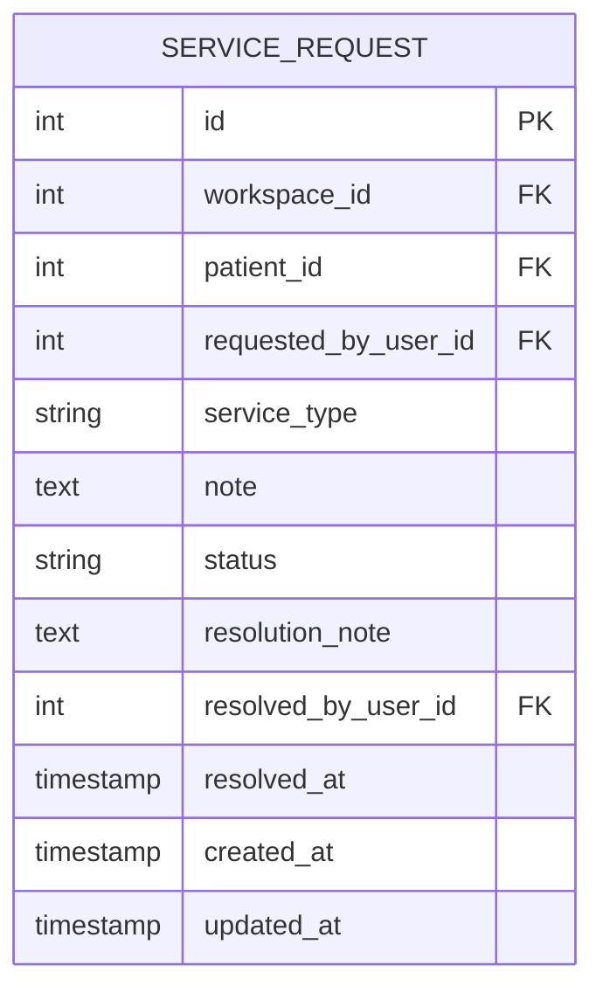
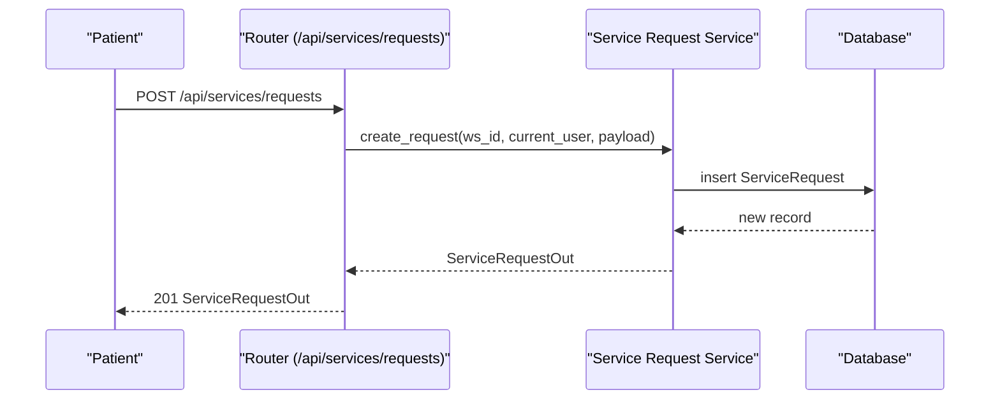
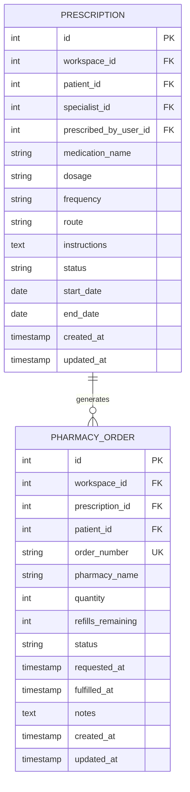
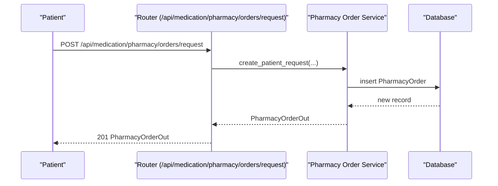
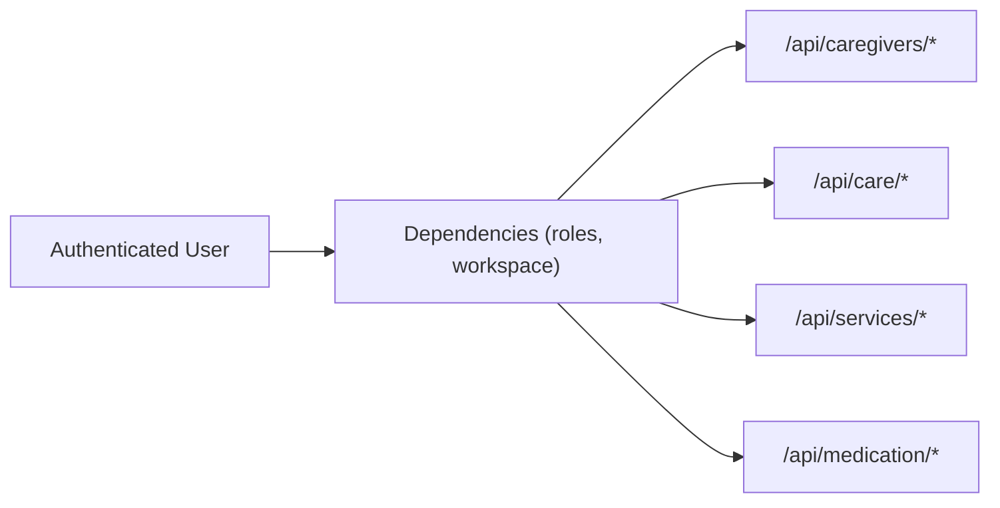

# Caregiver & Services

<cite>
**Referenced Files in This Document**
- [router.py](file://server/app/api/router.py)
- [caregivers.py](file://server/app/api/endpoints/caregivers.py)
- [care.py](file://server/app/api/endpoints/care.py)
- [service_requests.py](file://server/app/api/endpoints/service_requests.py)
- [medication.py](file://server/app/api/endpoints/medication.py)
- [caregivers.py (schemas)](file://server/app/schemas/caregivers.py)
- [service_requests.py (schemas)](file://server/app/schemas/service_requests.py)
- [medication.py (schemas)](file://server/app/schemas/medication.py)
- [caregivers.py (models)](file://server/app/models/caregivers.py)
- [service_requests.py (models)](file://server/app/models/service_requests.py)
- [medication.py (models)](file://server/app/models/medication.py)
</cite>

## Table of Contents
1. [Introduction](#introduction)
2. [Project Structure](#project-structure)
3. [Core Components](#core-components)
4. [Architecture Overview](#architecture-overview)
5. [Detailed Component Analysis](#detailed-component-analysis)
6. [Dependency Analysis](#dependency-analysis)
7. [Performance Considerations](#performance-considerations)
8. [Troubleshooting Guide](#troubleshooting-guide)
9. [Conclusion](#conclusion)
10. [Appendices](#appendices)

## Introduction
This document provides comprehensive API documentation for caregiver and service management endpoints. It covers:
- Caregiver registration, profile updates, and deletion
- Skill and specialty management via the “specialist” interface
- Zone and shift management for caregivers
- Care team coordination and caregiver-patient access controls
- Service request handling (creation, filtering, updates)
- Medication management (prescriptions and pharmacy orders)
- Integration touchpoints with patient monitoring and device assignment

The goal is to enable developers and operators to integrate with the platform’s caregiver and service domains using clear endpoint definitions, request/response schemas, and operational patterns.

## Project Structure
The API surface for caregiver and service domains is organized under a single router that mounts multiple domain-specific routers. The relevant mount points include:
- /api/caregivers for caregiver CRUD, zones, shifts, and device assignments
- /api/care for specialists lookup and sync
- /api/services for service requests
- /api/medication for prescriptions and pharmacy orders

**Diagram sources**
- [router.py:26-96](file://server/app/api/router.py#L26-L96)

**Section sources**
- [router.py:16-159](file://server/app/api/router.py#L16-L159)

## Core Components
- Caregivers API: Provides CRUD for caregivers, zone assignments, shifts, device assignments, and caregiver-patient access management.
- Care API: Provides lookup and synchronization of specialists (linked to caregivers’ specialties).
- Service Requests API: Allows authenticated users to list/filter requests, patients to create requests, and admins to update statuses.
- Medication API: Supports listing and managing prescriptions and pharmacy orders, with patient visibility controls and role-based access.

**Section sources**
- [caregivers.py:100-269](file://server/app/api/endpoints/caregivers.py#L100-L269)
- [care.py:21-59](file://server/app/api/endpoints/care.py#L21-L59)
- [service_requests.py:17-55](file://server/app/api/endpoints/service_requests.py#L17-L55)
- [medication.py:35-169](file://server/app/api/endpoints/medication.py#L35-L169)

## Architecture Overview
The API layer composes domain routers and enforces workspace-scoped access and roles. Each endpoint validates the current user’s role and workspace membership before operating on domain models.

**Diagram sources**
- [router.py:26-96](file://server/app/api/router.py#L26-L96)
- [caregivers.py:44](file://server/app/api/endpoints/caregivers.py#L44)
- [care.py:14](file://server/app/api/endpoints/care.py#L14)
- [service_requests.py:12](file://server/app/api/endpoints/service_requests.py#L12)
- [medication.py:28](file://server/app/api/endpoints/medication.py#L28)

## Detailed Component Analysis

### Caregiver Registration, Skills, and Scheduling

#### Endpoints
- List caregivers
  - Method: GET
  - Path: /api/caregivers
  - Roles: supervisor_read or higher
  - Response: Array of CareGiverOut
- Create caregiver
  - Method: POST
  - Path: /api/caregivers
  - Roles: patient_managers
  - Request: CareGiverCreate
  - Response: CareGiverOut
- Get caregiver
  - Method: GET
  - Path: /api/caregivers/{caregiver_id}
  - Roles: supervisor_read or higher
  - Response: CareGiverOut
- Update caregiver
  - Method: PATCH
  - Path: /api/caregivers/{caregiver_id}
  - Roles: patient_managers
  - Request: CareGiverPatch
  - Response: CareGiverOut
- Delete caregiver
  - Method: DELETE
  - Path: /api/caregivers/{caregiver_id}
  - Roles: patient_managers
  - Response: 204 No Content
- Upload profile image
  - Method: POST
  - Path: /api/caregivers/{caregiver_id}/profile-image
  - Roles: patient_managers
  - Request: multipart/form-data (file)
  - Response: CareGiverOut

- List caregiver-patient access
  - Method: GET
  - Path: /api/caregivers/{caregiver_id}/patients
  - Roles: supervisor_read or higher
  - Response: Array of CaregiverPatientAccessOut
- Replace caregiver-patient access
  - Method: PUT
  - Path: /api/caregivers/{caregiver_id}/patients
  - Roles: patient_managers
  - Request: CaregiverPatientAccessReplace
  - Response: Array of CaregiverPatientAccessOut

- List zones
  - Method: GET
  - Path: /api/caregivers/{caregiver_id}/zones
  - Roles: supervisor_read or higher
  - Response: Array of ZoneAssignOut
- Assign zone
  - Method: POST
  - Path: /api/caregivers/{caregiver_id}/zones
  - Roles: patient_managers
  - Request: ZoneAssignCreate
  - Response: ZoneAssignOut
- Update zone
  - Method: PATCH
  - Path: /api/caregivers/{caregiver_id}/zones/{zone_id}
  - Roles: patient_managers
  - Request: ZoneAssignPatch
  - Response: ZoneAssignOut
- Delete zone
  - Method: DELETE
  - Path: /api/caregivers/{caregiver_id}/zones/{zone_id}
  - Roles: patient_managers
  - Response: 204 No Content

- List caregiver devices
  - Method: GET
  - Path: /api/caregivers/{caregiver_id}/devices
  - Roles: supervisor_read or higher
  - Response: Array of CaregiverDeviceAssignmentOut
- Assign caregiver device
  - Method: POST
  - Path: /api/caregivers/{caregiver_id}/devices
  - Roles: patient_managers
  - Request: CaregiverDeviceAssignmentCreate
  - Response: CaregiverDeviceAssignmentOut

- List shifts
  - Method: GET
  - Path: /api/caregivers/{caregiver_id}/shifts
  - Roles: supervisor_read or higher
  - Response: Array of ShiftOut
- Create shift
  - Method: POST
  - Path: /api/caregivers/{caregiver_id}/shifts
  - Roles: patient_managers
  - Request: ShiftCreate
  - Response: ShiftOut
- Update shift
  - Method: PATCH
  - Path: /api/caregivers/{caregiver_id}/shifts/{shift_id}
  - Roles: patient_managers
  - Request: ShiftPatch
  - Response: ShiftOut
- Delete shift
  - Method: DELETE
  - Path: /api/caregivers/{caregiver_id}/shifts/{shift_id}
  - Roles: patient_managers
  - Response: 204 No Content

#### Request/Response Schemas

- CareGiverCreate
  - Fields: first_name, last_name, role, employee_code, department, employment_type, specialty, license_number, phone, email, emergency_contact_name, emergency_contact_phone, photo_url
- CareGiverPatch
  - Fields: first_name, last_name, role, employee_code, department, employment_type, specialty, license_number, phone, email, emergency_contact_name, emergency_contact_phone, photo_url, is_active
- CareGiverOut
  - Fields: id, workspace_id, first_name, last_name, role, employee_code, department, employment_type, specialty, license_number, phone, email, emergency_contact_name, emergency_contact_phone, photo_url, is_active, created_at

- ZoneAssignCreate
  - Fields: room_id, zone_name
- ZoneAssignPatch
  - Fields: room_id, zone_name, is_active
- ZoneAssignOut
  - Fields: id, caregiver_id, room_id, zone_name, is_active

- CaregiverPatientAccessReplace
  - Fields: patient_ids (array of integers)
- CaregiverPatientAccessOut
  - Fields: id, workspace_id, caregiver_id, patient_id, assigned_by_user_id, is_active, created_at, updated_at

- ShiftCreate
  - Fields: shift_date, start_time, end_time, shift_type ("regular" | "overtime" | "on_call"), notes
- ShiftPatch
  - Fields: shift_date, start_time, end_time, shift_type, notes
- ShiftOut
  - Fields: id, caregiver_id, shift_date, start_time, end_time, shift_type, notes

- CaregiverDeviceAssignmentCreate
  - Fields: device_id, device_role ("mobile_phone" | "polar_gateway" | "observer_device")
- CaregiverDeviceAssignmentOut
  - Fields: id, workspace_id, caregiver_id, device_id, device_role, assigned_at, unassigned_at, is_active

#### Data Model Relationships

**Diagram sources**
- [caregivers.py (models):22-166](file://server/app/models/caregivers.py#L22-L166)

#### Sequence: Create Caregiver

**Diagram sources**
- [caregivers.py:110-117](file://server/app/api/endpoints/caregivers.py#L110-L117)
- [caregivers.py:44](file://server/app/api/endpoints/caregivers.py#L44)

#### Sequence: Replace Caregiver-Patient Access

**Diagram sources**
- [caregivers.py:140-191](file://server/app/api/endpoints/caregivers.py#L140-L191)

**Section sources**
- [caregivers.py:100-502](file://server/app/api/endpoints/caregivers.py#L100-L502)
- [caregivers.py (schemas):11-122](file://server/app/schemas/caregivers.py#L11-L122)
- [caregivers.py (models):22-166](file://server/app/models/caregivers.py#L22-L166)

### Care Team Coordination and Specialist Lookup

#### Endpoints
- List specialists
  - Method: GET
  - Path: /api/care/specialists
  - Roles: clinical_staff
  - Query: specialty (optional)
  - Response: Array of SpecialistOut
- Create specialist
  - Method: POST
  - Path: /api/care/specialists
  - Roles: admin, head_nurse, supervisor
  - Request: SpecialistCreate
  - Response: SpecialistOut
- Update specialist
  - Method: PATCH
  - Path: /api/care/specialists/{specialist_id}
  - Roles: admin, head_nurse, supervisor
  - Request: SpecialistUpdate
  - Response: SpecialistOut

#### Request/Response Schemas
- SpecialistCreate: fields include specialty, name, contact info as needed by the service
- SpecialistUpdate: fields to modify
- SpecialistOut: fields returned upon read

Note: The specialist resource is backed by the care service and is used to enrich caregiver profiles with specialty information.

**Section sources**
- [care.py:21-59](file://server/app/api/endpoints/care.py#L21-L59)

### Service Request Handling

#### Endpoints
- List service requests
  - Method: GET
  - Path: /api/services/requests
  - Roles: authenticated
  - Query: status (open|in_progress|fulfilled|cancelled), service_type (food|transport|housekeeping), limit (1..200)
  - Response: Array of ServiceRequestOut
- Create service request
  - Method: POST
  - Path: /api/services/requests
  - Roles: patient
  - Request: ServiceRequestCreateIn
  - Response: ServiceRequestOut
- Update service request
  - Method: PATCH
  - Path: /api/services/requests/{request_id}
  - Roles: admin
  - Request: ServiceRequestPatchIn
  - Response: ServiceRequestOut

#### Request/Response Schemas
- ServiceRequestCreateIn
  - Fields: service_type, note
- ServiceRequestPatchIn
  - Fields: status, resolution_note
- ServiceRequestOut
  - Fields: id, workspace_id, patient_id, requested_by_user_id, service_type, note, status, resolution_note, resolved_by_user_id, resolved_at, created_at, updated_at

#### Data Model

**Diagram sources**
- [service_requests.py (models):10-45](file://server/app/models/service_requests.py#L10-L45)

#### Sequence: Create Service Request (Patient)

**Diagram sources**
- [service_requests.py:36-44](file://server/app/api/endpoints/service_requests.py#L36-L44)
- [service_requests.py:12](file://server/app/api/endpoints/service_requests.py#L12)

**Section sources**
- [service_requests.py:17-55](file://server/app/api/endpoints/service_requests.py#L17-L55)
- [service_requests.py (schemas):14-39](file://server/app/schemas/service_requests.py#L14-L39)
- [service_requests.py (models):10-45](file://server/app/models/service_requests.py#L10-L45)

### Medication Management

#### Endpoints
- List prescriptions
  - Method: GET
  - Path: /api/medication/prescriptions
  - Roles: authenticated
  - Query: patient_id (optional), status (optional)
  - Response: Array of PrescriptionOut
- Create prescription
  - Method: POST
  - Path: /api/medication/prescriptions
  - Roles: admin, head_nurse, supervisor
  - Request: PrescriptionCreate
  - Response: PrescriptionOut
- Update prescription
  - Method: PATCH
  - Path: /api/medication/prescriptions/{prescription_id}
  - Roles: admin, head_nurse, supervisor
  - Request: PrescriptionUpdate
  - Response: PrescriptionOut

- List pharmacy orders
  - Method: GET
  - Path: /api/medication/pharmacy/orders
  - Roles: authenticated
  - Query: patient_id (optional), prescription_id (optional), status (optional)
  - Response: Array of PharmacyOrderOut
- Create pharmacy order
  - Method: POST
  - Path: /api/medication/pharmacy/orders
  - Roles: admin, head_nurse, supervisor
  - Request: PharmacyOrderCreate
  - Response: PharmacyOrderOut
- Request pharmacy order (patient)
  - Method: POST
  - Path: /api/medication/pharmacy/orders/request
  - Roles: patient
  - Request: PharmacyOrderRequest
  - Response: PharmacyOrderOut
- Update pharmacy order
  - Method: PATCH
  - Path: /api/medication/pharmacy/orders/{order_id}
  - Roles: admin, head_nurse, supervisor
  - Request: PharmacyOrderUpdate
  - Response: PharmacyOrderOut

#### Request/Response Schemas
- PrescriptionCreate/Update/Out: fields include patient_id, specialist_id, medication_name, dosage, frequency, route, instructions, status, start_date, end_date, plus metadata
- PharmacyOrderCreate/Update/Out: fields include prescription_id, patient_id, order_number, pharmacy_name, quantity, refills_remaining, status, notes, timestamps
- PharmacyOrderRequest: fields include prescription_id, pharmacy_name, quantity, notes

#### Data Model

**Diagram sources**
- [medication.py (models):10-54](file://server/app/models/medication.py#L10-L54)

#### Sequence: Patient Requests Pharmacy Order

**Diagram sources**
- [medication.py:131-152](file://server/app/api/endpoints/medication.py#L131-L152)
- [medication.py:28](file://server/app/api/endpoints/medication.py#L28)

**Section sources**
- [medication.py:35-169](file://server/app/api/endpoints/medication.py#L35-L169)
- [medication.py (schemas):11-89](file://server/app/schemas/medication.py#L11-L89)
- [medication.py (models):10-54](file://server/app/models/medication.py#L10-L54)

### Care Plan Management and Service Delivery Tracking
While dedicated “care plan” and “service delivery” resources are not present in the referenced files, the following patterns align with the existing domain:
- Care plan alignment: Use specialists (specialty lookup) and caregiver-patient access to coordinate care teams.
- Service delivery tracking: Use service requests to track tasks and outcomes; combine with caregiver shifts and zones to schedule and monitor coverage.

[No sources needed since this section synthesizes patterns from existing endpoints]

## Dependency Analysis
- Router composition: The main router aggregates domain routers (/caregivers, /care, /services, /medication) and applies workspace and role checks per endpoint.
- Role gating: Endpoints enforce roles such as patient_managers, supervisor_read, clinical_staff, and admin/head_nurse/supervisor combinations.
- Workspace scoping: Queries filter by workspace_id to ensure tenant isolation.

**Diagram sources**
- [router.py:26-96](file://server/app/api/router.py#L26-L96)

**Section sources**
- [router.py:16-159](file://server/app/api/router.py#L16-L159)

## Performance Considerations
- Pagination and limits: Several endpoints cap results (e.g., limit=200) to control payload sizes.
- Filtering: Prefer query filters (status, type, specialty) to reduce result sets client-side.
- Indexes: Models define database indexes on frequently queried fields (e.g., status, created_at, patient_id).
- Batch operations: Use replace endpoints (e.g., caregiver-patient access) to minimize churn and maintain referential integrity efficiently.

[No sources needed since this section provides general guidance]

## Troubleshooting Guide
- 403 Forbidden: Patient accounts must be linked to a patient record for certain endpoints (e.g., pharmacy order request).
- 400 Bad Request: Workspace validation failures (e.g., invalid room_id or missing patients) will raise descriptive errors.
- 404 Not Found: Resources not found (caregiver, zone, shift, request, prescription, order) will return 404.
- Role mismatches: Ensure the caller has the required roles for the endpoint (e.g., patient_managers for caregiver CRUD).

**Section sources**
- [medication.py:138-140](file://server/app/api/endpoints/medication.py#L138-L140)
- [caregivers.py:49-96](file://server/app/api/endpoints/caregivers.py#L49-L96)

## Conclusion
The caregiver and service management APIs provide a cohesive foundation for staffing, scheduling, care coordination, and service delivery. By leveraging role-based access, workspace scoping, and explicit schemas, integrators can build robust workflows around caregiver operations, specialist coordination, service requests, and medication management.

[No sources needed since this section summarizes without analyzing specific files]

## Appendices

### Endpoint Reference Summary

- Caregivers
  - GET /api/caregivers
  - POST /api/caregivers
  - GET /api/caregivers/{id}
  - PATCH /api/caregivers/{id}
  - DELETE /api/caregivers/{id}
  - POST /api/caregivers/{id}/profile-image
  - GET /api/caregivers/{id}/patients
  - PUT /api/caregivers/{id}/patients
  - GET /api/caregivers/{id}/zones
  - POST /api/caregivers/{id}/zones
  - PATCH /api/caregivers/{id}/zones/{zone_id}
  - DELETE /api/caregivers/{id}/zones/{zone_id}
  - GET /api/caregivers/{id}/devices
  - POST /api/caregivers/{id}/devices
  - GET /api/caregivers/{id}/shifts
  - POST /api/caregivers/{id}/shifts
  - PATCH /api/caregivers/{id}/shifts/{shift_id}
  - DELETE /api/caregivers/{id}/shifts/{shift_id}

- Care (Specialists)
  - GET /api/care/specialists
  - POST /api/care/specialists
  - PATCH /api/care/specialists/{specialist_id}

- Service Requests
  - GET /api/services/requests
  - POST /api/services/requests
  - PATCH /api/services/requests/{request_id}

- Medication
  - GET /api/medication/prescriptions
  - POST /api/medication/prescriptions
  - PATCH /api/medication/prescriptions/{id}
  - GET /api/medication/pharmacy/orders
  - POST /api/medication/pharmacy/orders
  - POST /api/medication/pharmacy/orders/request
  - PATCH /api/medication/pharmacy/orders/{id}

**Section sources**
- [caregivers.py:100-502](file://server/app/api/endpoints/caregivers.py#L100-L502)
- [care.py:21-59](file://server/app/api/endpoints/care.py#L21-L59)
- [service_requests.py:17-55](file://server/app/api/endpoints/service_requests.py#L17-L55)
- [medication.py:35-169](file://server/app/api/endpoints/medication.py#L35-L169)