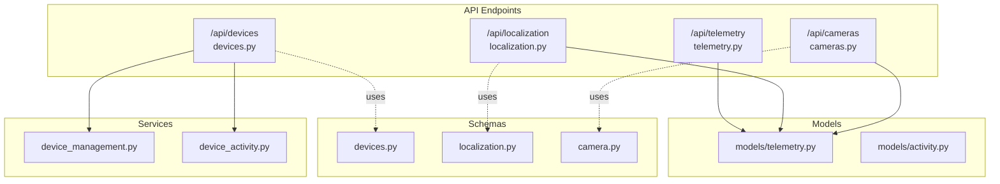
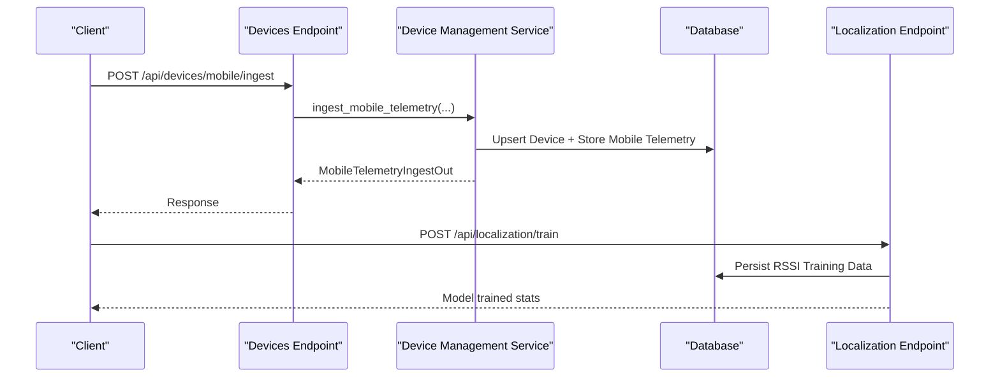
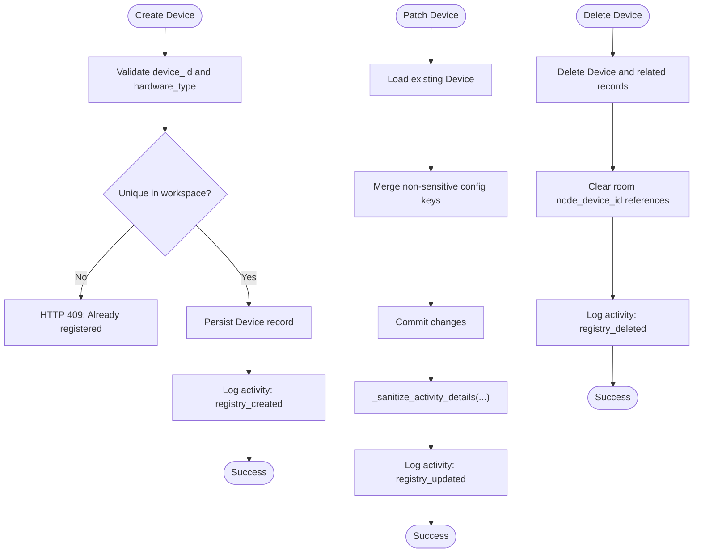
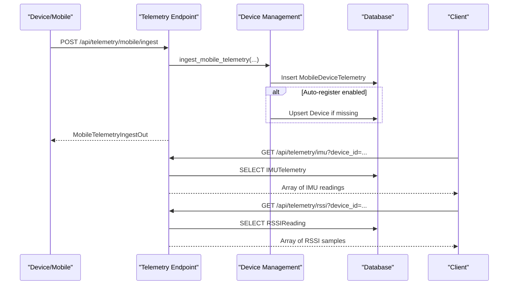
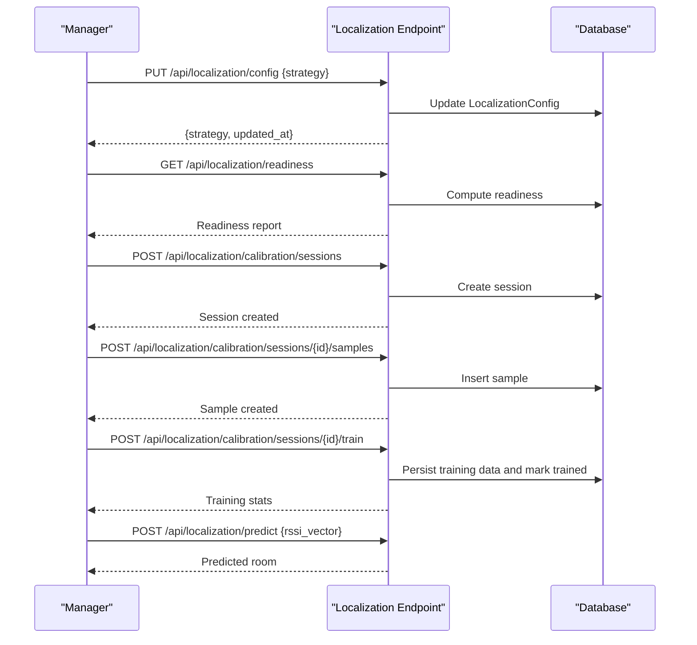
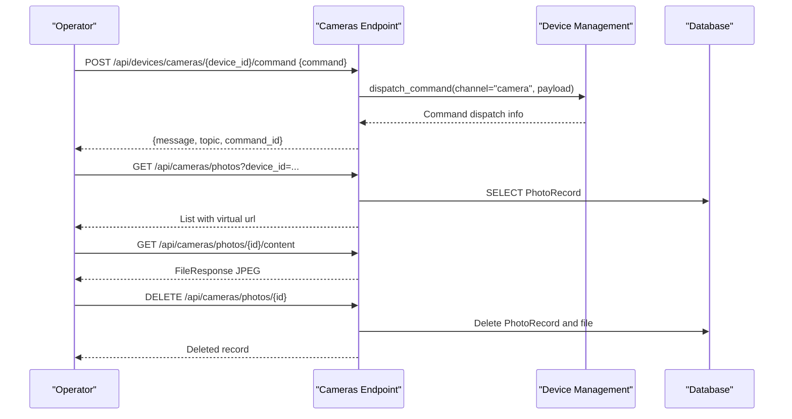
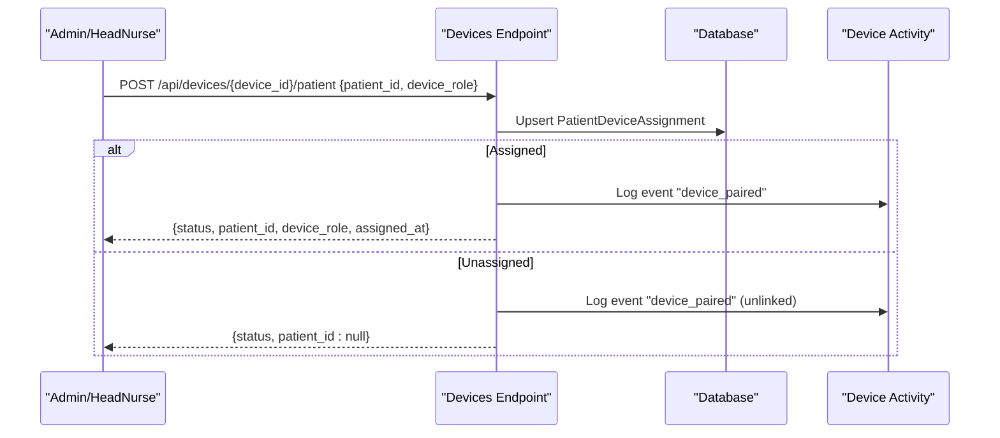
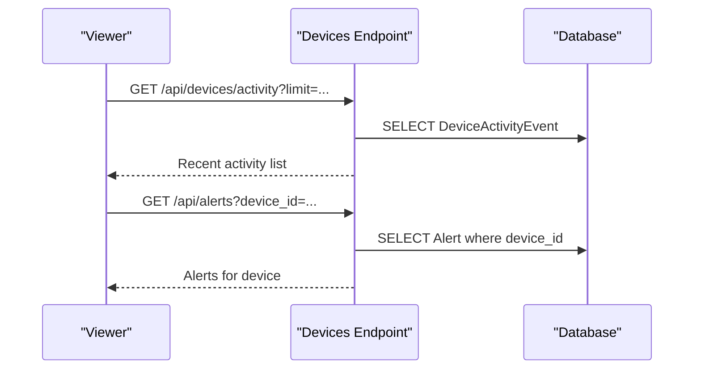
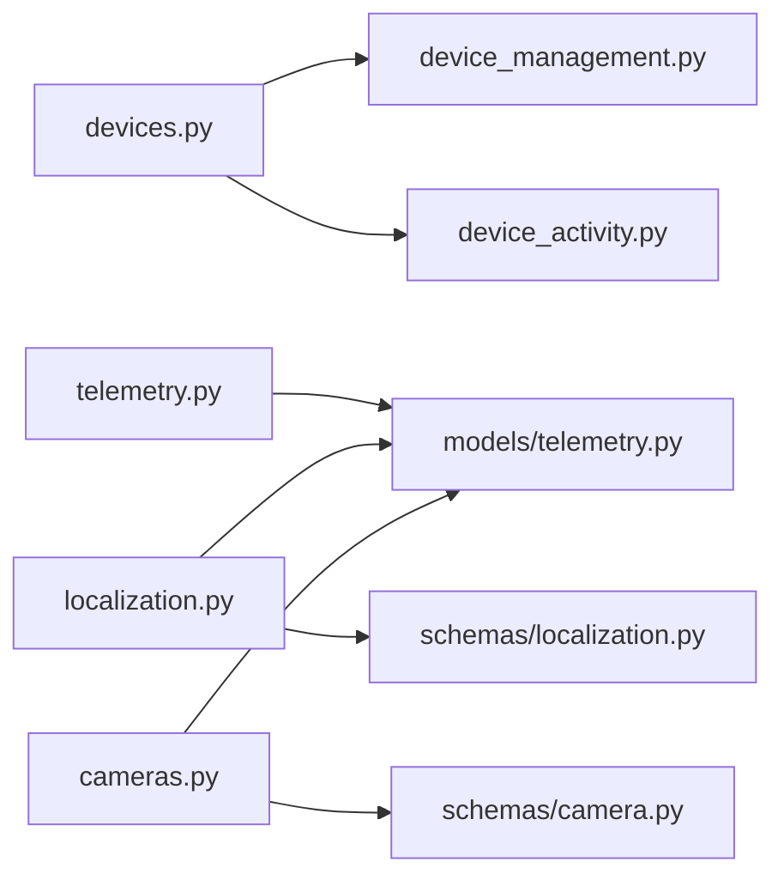

# Device Management

<cite>
**Referenced Files in This Document**
- [devices.py](file://server/app/api/endpoints/devices.py)
- [devices.py](file://server/app/schemas/devices.py)
- [device_management.py](file://server/app/services/device_management.py)
- [telemetry.py](file://server/app/api/endpoints/telemetry.py)
- [localization.py](file://server/app/api/endpoints/localization.py)
- [localization.py](file://server/app/schemas/localization.py)
- [models_telemetry.py](file://server/app/models/telemetry.py)
- [cameras.py](file://server/app/api/endpoints/cameras.py)
- [camera_schemas.py](file://server/app/schemas/camera.py)
- [device_activity.py](file://server/app/services/device_activity.py)
- [activity_models.py](file://server/app/models/activity.py)
</cite>

## Table of Contents
1. [Introduction](#introduction)
2. [Project Structure](#project-structure)
3. [Core Components](#core-components)
4. [Architecture Overview](#architecture-overview)
5. [Detailed Component Analysis](#detailed-component-analysis)
6. [Dependency Analysis](#dependency-analysis)
7. [Performance Considerations](#performance-considerations)
8. [Troubleshooting Guide](#troubleshooting-guide)
9. [Conclusion](#conclusion)
10. [Appendices](#appendices)

## Introduction
This document provides comprehensive API documentation for device management in the platform. It covers device registration, configuration, lifecycle management, telemetry ingestion, device status monitoring, localization service integration, camera device APIs, image capture control, and device health monitoring. It also documents device assignment workflows, patient-device linking, and device activity tracking. Request/response schemas are included for device CRUD operations, telemetry submission, and localization queries. Integration examples, error handling for disconnected devices, and performance optimization tips for high-frequency telemetry are provided.

## Project Structure
The device management domain spans API endpoints, Pydantic schemas, SQLAlchemy models, and service layers:
- API endpoints define HTTP routes and roles.
- Schemas define request/response contracts.
- Services encapsulate business logic and persistence.
- Models define database tables for telemetry, localization, and device metadata.

**Diagram sources**
- [devices.py:1-311](file://server/app/api/endpoints/devices.py#L1-L311)
- [devices.py:1-93](file://server/app/schemas/devices.py#L1-L93)
- [device_management.py:1-800](file://server/app/services/device_management.py#L1-L800)
- [telemetry.py:1-73](file://server/app/api/endpoints/telemetry.py#L1-L73)
- [localization.py:1-396](file://server/app/api/endpoints/localization.py#L1-L396)
- [localization.py:1-93](file://server/app/schemas/localization.py#L1-L93)
- [cameras.py:1-91](file://server/app/api/endpoints/cameras.py#L1-L91)
- [camera_schemas.py:1-22](file://server/app/schemas/camera.py#L1-L22)
- [models_telemetry.py:1-222](file://server/app/models/telemetry.py#L1-L222)
- [device_activity.py:1-61](file://server/app/services/device_activity.py#L1-L61)
- [activity_models.py:1-90](file://server/app/models/activity.py#L1-L90)

**Section sources**
- [devices.py:1-311](file://server/app/api/endpoints/devices.py#L1-L311)
- [devices.py:1-93](file://server/app/schemas/devices.py#L1-L93)
- [device_management.py:1-800](file://server/app/services/device_management.py#L1-L800)
- [telemetry.py:1-73](file://server/app/api/endpoints/telemetry.py#L1-L73)
- [localization.py:1-396](file://server/app/api/endpoints/localization.py#L1-L396)
- [localization.py:1-93](file://server/app/schemas/localization.py#L1-L93)
- [cameras.py:1-91](file://server/app/api/endpoints/cameras.py#L1-L91)
- [camera_schemas.py:1-22](file://server/app/schemas/camera.py#L1-L22)
- [models_telemetry.py:1-222](file://server/app/models/telemetry.py#L1-L222)
- [device_activity.py:1-61](file://server/app/services/device_activity.py#L1-L61)
- [activity_models.py:1-90](file://server/app/models/activity.py#L1-L90)

## Core Components
- Device Registry API: CRUD and listing for devices, with role-based access controls.
- Command Dispatch API: Send commands to devices via channels (wheelchair, camera).
- Telemetry Ingestion API: Accept mobile telemetry payloads and normalize device records.
- Telemetry Query API: Retrieve IMU and RSSI telemetry with filtering and limits.
- Localization API: Configure strategy, check readiness, collect calibration data, and predict rooms.
- Camera API: List, fetch, and delete captured photos; send camera commands.
- Device Activity Logging: Best-effort event logging for device registry and command actions.

**Section sources**
- [devices.py:63-311](file://server/app/api/endpoints/devices.py#L63-L311)
- [device_management.py:597-800](file://server/app/services/device_management.py#L597-L800)
- [telemetry.py:15-73](file://server/app/api/endpoints/telemetry.py#L15-L73)
- [localization.py:52-396](file://server/app/api/endpoints/localization.py#L52-L396)
- [cameras.py:19-91](file://server/app/api/endpoints/cameras.py#L19-L91)
- [device_activity.py:16-61](file://server/app/services/device_activity.py#L16-L61)

## Architecture Overview
The device management architecture integrates HTTP endpoints, service layers, and database models. Commands are dispatched to devices via MQTT topics, while telemetry is ingested and normalized. Localization leverages RSSI vectors and training data to predict room occupancy.

**Diagram sources**
- [devices.py:136-144](file://server/app/api/endpoints/devices.py#L136-L144)
- [device_management.py:162-214](file://server/app/services/device_management.py#L162-L214)
- [models_telemetry.py:132-154](file://server/app/models/telemetry.py#L132-L154)
- [localization.py:129-160](file://server/app/api/endpoints/localization.py#L129-L160)

## Detailed Component Analysis

### Device Registration, Configuration, and Lifecycle
- Device creation: Requires manager roles; validates hardware type and workspace uniqueness.
- Device patching: Updates display name and configuration; filters sensitive keys.
- Device deletion: Removes registry and all workspace-scoped telemetry/assignments.
- Listing and detail: Supports filtering by type and hardware type; patient role restricted to assigned devices.

**Diagram sources**
- [devices.py:186-240](file://server/app/api/endpoints/devices.py#L186-L240)
- [device_management.py:597-800](file://server/app/services/device_management.py#L597-L800)
- [device_activity.py:16-61](file://server/app/services/device_activity.py#L16-L61)

**Section sources**
- [devices.py:63-240](file://server/app/api/endpoints/devices.py#L63-L240)
- [device_management.py:597-800](file://server/app/services/device_management.py#L597-L800)
- [device_activity.py:16-61](file://server/app/services/device_activity.py#L16-L61)

### Telemetry Data Ingestion and Monitoring
- Mobile telemetry ingestion endpoint accepts structured payloads and normalizes device records when auto-registration is enabled.
- Query endpoints for IMU and RSSI telemetry support device filtering and pagination.

**Diagram sources**
- [devices.py:136-144](file://server/app/api/endpoints/devices.py#L136-L144)
- [device_management.py:162-214](file://server/app/services/device_management.py#L162-L214)
- [telemetry.py:15-73](file://server/app/api/endpoints/telemetry.py#L15-L73)
- [models_telemetry.py:132-154](file://server/app/models/telemetry.py#L132-L154)

**Section sources**
- [devices.py:136-144](file://server/app/api/endpoints/devices.py#L136-L144)
- [device_management.py:162-214](file://server/app/services/device_management.py#L162-L214)
- [telemetry.py:15-73](file://server/app/api/endpoints/telemetry.py#L15-L73)
- [models_telemetry.py:20-154](file://server/app/models/telemetry.py#L20-L154)

### Localization Service Integration
- Strategy configuration and readiness checks.
- Calibration sessions and samples collection.
- Model training from DB or provided vectors.
- Prediction endpoint using configured strategy.

**Diagram sources**
- [localization.py:62-127](file://server/app/api/endpoints/localization.py#L62-L127)
- [localization.py:191-231](file://server/app/api/endpoints/localization.py#L191-L231)
- [localization.py:233-396](file://server/app/api/endpoints/localization.py#L233-L396)
- [localization.py:1-93](file://server/app/schemas/localization.py#L1-L93)
- [models_telemetry.py:156-222](file://server/app/models/telemetry.py#L156-L222)

**Section sources**
- [localization.py:52-396](file://server/app/api/endpoints/localization.py#L52-L396)
- [localization.py:1-93](file://server/app/schemas/localization.py#L1-L93)
- [models_telemetry.py:156-222](file://server/app/models/telemetry.py#L156-L222)

### Camera Device APIs and Image Capture Control
- Camera command dispatch for start_stream and set_resolution.
- Photo listing, retrieval, and deletion with file existence checks.

**Diagram sources**
- [devices.py:283-311](file://server/app/api/endpoints/devices.py#L283-L311)
- [cameras.py:19-91](file://server/app/api/endpoints/cameras.py#L19-L91)
- [camera_schemas.py:1-22](file://server/app/schemas/camera.py#L1-L22)
- [models_telemetry.py:95-104](file://server/app/models/telemetry.py#L95-L104)

**Section sources**
- [devices.py:265-311](file://server/app/api/endpoints/devices.py#L265-L311)
- [cameras.py:19-91](file://server/app/api/endpoints/cameras.py#L19-L91)
- [camera_schemas.py:1-22](file://server/app/schemas/camera.py#L1-L22)
- [models_telemetry.py:95-104](file://server/app/models/telemetry.py#L95-L104)

### Device Assignment Workflows and Patient-Device Linking
- Assign or unassign a patient from a device; logs pairing/unpairing events.
- Device listing for patients restricted to active assignments.

**Diagram sources**
- [devices.py:146-184](file://server/app/api/endpoints/devices.py#L146-L184)
- [device_activity.py:16-61](file://server/app/services/device_activity.py#L16-L61)

**Section sources**
- [devices.py:63-88](file://server/app/api/endpoints/devices.py#L63-L88)
- [devices.py:146-184](file://server/app/api/endpoints/devices.py#L146-L184)
- [device_activity.py:16-61](file://server/app/services/device_activity.py#L16-L61)

### Device Health Monitoring Endpoints
- Device activity timeline for recent events.
- Alerts model captures device-related issues (e.g., offline, low battery).

**Diagram sources**
- [devices.py:53-61](file://server/app/api/endpoints/devices.py#L53-L61)
- [activity_models.py:49-90](file://server/app/models/activity.py#L49-L90)

**Section sources**
- [devices.py:53-61](file://server/app/api/endpoints/devices.py#L53-L61)
- [activity_models.py:49-90](file://server/app/models/activity.py#L49-L90)

## Dependency Analysis
- Endpoints depend on services for business logic and on schemas for validation.
- Services depend on models for persistence and on configuration for runtime behavior.
- Telemetry and localization endpoints share telemetry models for data storage.

**Diagram sources**
- [devices.py:1-311](file://server/app/api/endpoints/devices.py#L1-L311)
- [device_management.py:1-800](file://server/app/services/device_management.py#L1-L800)
- [device_activity.py:1-61](file://server/app/services/device_activity.py#L1-L61)
- [telemetry.py:1-73](file://server/app/api/endpoints/telemetry.py#L1-L73)
- [localization.py:1-396](file://server/app/api/endpoints/localization.py#L1-L396)
- [localization.py:1-93](file://server/app/schemas/localization.py#L1-L93)
- [cameras.py:1-91](file://server/app/api/endpoints/cameras.py#L1-L91)
- [camera_schemas.py:1-22](file://server/app/schemas/camera.py#L1-L22)
- [models_telemetry.py:1-222](file://server/app/models/telemetry.py#L1-L222)

**Section sources**
- [devices.py:1-311](file://server/app/api/endpoints/devices.py#L1-L311)
- [device_management.py:1-800](file://server/app/services/device_management.py#L1-L800)
- [device_activity.py:1-61](file://server/app/services/device_activity.py#L1-L61)
- [telemetry.py:1-73](file://server/app/api/endpoints/telemetry.py#L1-L73)
- [localization.py:1-396](file://server/app/api/endpoints/localization.py#L1-L396)
- [localization.py:1-93](file://server/app/schemas/localization.py#L1-L93)
- [cameras.py:1-91](file://server/app/api/endpoints/cameras.py#L1-L91)
- [camera_schemas.py:1-22](file://server/app/schemas/camera.py#L1-L22)
- [models_telemetry.py:1-222](file://server/app/models/telemetry.py#L1-L222)

## Performance Considerations
- Batch ingestion: Group telemetry submissions to reduce round trips and database load.
- Pagination: Use limit and offset parameters on telemetry and photo listing endpoints to avoid large payloads.
- Filtering: Apply device_id filters early to minimize result sets.
- Auto-registration: Enable MQTT auto-registration judiciously to prevent excessive device creation races.
- Command throttling: Limit high-frequency commands (e.g., camera start_stream intervals) to balance data volume and device capability.
- Caching: Cache frequently accessed device metadata and localization model info where appropriate.

[No sources needed since this section provides general guidance]

## Troubleshooting Guide
- Device not found: Ensure device_id exists in the current workspace; listing endpoints restrict access for patients to assigned devices.
- Duplicate device registration: Creation fails if device_id already exists in the workspace.
- Command delivery: Check command dispatch status and ack payloads; review activity logs for command_dispatched events.
- Disconnected devices: Use alerts for offline devices and RSSI telemetry to infer connectivity; leverage localization predictions to detect absence.
- Photo retrieval: If file is missing, the endpoint returns 404; ensure storage paths are valid and accessible.

**Section sources**
- [devices.py:63-88](file://server/app/api/endpoints/devices.py#L63-L88)
- [device_management.py:597-620](file://server/app/services/device_management.py#L597-L620)
- [device_activity.py:16-61](file://server/app/services/device_activity.py#L16-L61)
- [cameras.py:56-74](file://server/app/api/endpoints/cameras.py#L56-L74)
- [activity_models.py:49-90](file://server/app/models/activity.py#L49-L90)

## Conclusion
The device management APIs provide a robust foundation for registering, configuring, and monitoring devices, integrating telemetry and localization, and managing camera operations. By leveraging role-based access, structured schemas, and best-effort activity logging, the system supports scalable fleet control and reliable device lifecycle management.

[No sources needed since this section summarizes without analyzing specific files]

## Appendices

### API Reference: Device CRUD and Commands
- GET /api/devices
  - Filters: device_type, hardware_type
  - Role: authenticated
  - Response: array of device summaries
- GET /api/devices/{device_id}
  - Role: device owner or assigned patient
  - Response: device detail
- POST /api/devices
  - Role: admin/head_nurse
  - Request: DeviceCreate
  - Response: {id, device_id, hardware_type}
- PATCH /api/devices/{device_id}
  - Role: admin/head_nurse
  - Request: DevicePatch
  - Response: device summary
- DELETE /api/devices/{device_id}
  - Role: admin/head_nurse
  - Response: 204 No Content
- GET /api/devices/{device_id}/commands
  - Role: admin/head_nurse/supervisor
  - Query: limit (1..100)
  - Response: array of command dispatch records
- POST /api/devices/{device_id}/commands
  - Role: admin/head_nurse/supervisor
  - Request: DeviceCommandRequest
  - Response: DeviceCommandOut

**Section sources**
- [devices.py:63-311](file://server/app/api/endpoints/devices.py#L63-L311)
- [devices.py:12-43](file://server/app/schemas/devices.py#L12-L43)

### API Reference: Telemetry Ingestion and Queries
- POST /api/devices/mobile/ingest
  - Role: authenticated
  - Request: MobileTelemetryIngest
  - Response: MobileTelemetryIngestOut
- GET /api/telemetry/imu
  - Query: device_id, limit (default 50, max 500)
  - Response: array of IMU telemetry records
- GET /api/telemetry/rssi
  - Query: device_id, limit (default 100, max 1000)
  - Response: array of RSSI readings

**Section sources**
- [devices.py:136-144](file://server/app/api/endpoints/devices.py#L136-L144)
- [devices.py:69-93](file://server/app/schemas/devices.py#L69-L93)
- [telemetry.py:15-73](file://server/app/api/endpoints/telemetry.py#L15-L73)
- [models_telemetry.py:20-51](file://server/app/models/telemetry.py#L20-L51)

### API Reference: Localization
- GET /api/localization
  - Response: model info + strategy
- GET /api/localization/config
  - Response: LocalizationConfigOut
- PUT /api/localization/config
  - Role: admin/head_nurse/supervisor
  - Request: LocalizationConfigUpdate
  - Response: LocalizationConfigOut
- GET /api/localization/readiness
  - Role: admin/head_nurse/supervisor
  - Response: LocalizationReadinessOut
- POST /api/localization/readiness/repair
  - Role: admin/head_nurse/supervisor
  - Request: LocalizationReadinessRepairIn
  - Response: LocalizationReadinessOut
- POST /api/localization/train
  - Role: admin/head_nurse/supervisor
  - Request: TrainRequest
  - Response: {message, training stats}
- POST /api/localization/retrain
  - Role: admin/head_nurse/supervisor
  - Response: {message, training stats}
- POST /api/localization/predict
  - Request: PredictRequest
  - Response: prediction result
- GET /api/localization/predictions
  - Query: device_id, limit
  - Response: array of RoomPrediction
- POST /api/localization/calibration/sessions
  - Role: authenticated
  - Request: LocalizationCalibrationSessionCreate
  - Response: LocalizationCalibrationSessionOut
- POST /api/localization/calibration/sessions/{session_id}/samples
  - Role: authenticated
  - Request: LocalizationCalibrationSampleCreate
  - Response: LocalizationCalibrationSampleOut
- POST /api/localization/calibration/sessions/{session_id}/train
  - Role: admin/head_nurse/supervisor
  - Response: LocalizationCalibrationTrainOut

**Section sources**
- [localization.py:52-396](file://server/app/api/endpoints/localization.py#L52-L396)
- [localization.py:1-93](file://server/app/schemas/localization.py#L1-L93)
- [models_telemetry.py:53-222](file://server/app/models/telemetry.py#L53-L222)

### API Reference: Cameras
- GET /api/cameras/photos
  - Query: device_id, skip, limit
  - Response: array of PhotoRecordOut
- GET /api/cameras/photos/{photo_id}/content
  - Response: FileResponse (JPEG)
- DELETE /api/cameras/photos/{photo_id}
  - Role: admin/supervisor
  - Response: PhotoRecordOut
- POST /api/devices/cameras/{device_id}/command
  - Role: admin/head_nurse/supervisor
  - Request: CameraCommand
  - Response: {message, topic, command_id}
- POST /api/devices/{device_id}/camera/check
  - Role: admin/head_nurse/supervisor
  - Response: command dispatch info

**Section sources**
- [cameras.py:19-91](file://server/app/api/endpoints/cameras.py#L19-L91)
- [camera_schemas.py:1-22](file://server/app/schemas/camera.py#L1-L22)
- [devices.py:265-311](file://server/app/api/endpoints/devices.py#L265-L311)
- [models_telemetry.py:95-104](file://server/app/models/telemetry.py#L95-L104)

### Device Activity Timeline
- GET /api/devices/activity
  - Role: admin/head_nurse/supervisor
  - Query: limit (default 30, max 100)
  - Response: array of DeviceActivityEventOut

**Section sources**
- [devices.py:53-61](file://server/app/api/endpoints/devices.py#L53-L61)
- [device_activity.py:48-61](file://server/app/services/device_activity.py#L48-L61)

### Device Assignment and Linking
- POST /api/devices/{device_id}/patient
  - Role: admin/head_nurse/patient_managers
  - Request: DevicePatientAssign
  - Response: {status, patient_id, device_role, assigned_at?}

**Section sources**
- [devices.py:146-184](file://server/app/api/endpoints/devices.py#L146-L184)

### Data Models Overview
- Telemetry tables: IMUTelemetry, RSSIReading, RoomPrediction, RSSITrainingData, MotionTrainingData, PhotoRecord, NodeStatusTelemetry, MobileDeviceTelemetry, LocalizationConfig, LocalizationCalibrationSession, LocalizationCalibrationSample.
- Activity tables: ActivityTimeline, Alert.

**Section sources**
- [models_telemetry.py:20-222](file://server/app/models/telemetry.py#L20-L222)
- [activity_models.py:14-90](file://server/app/models/activity.py#L14-L90)