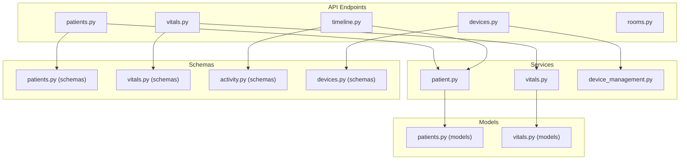
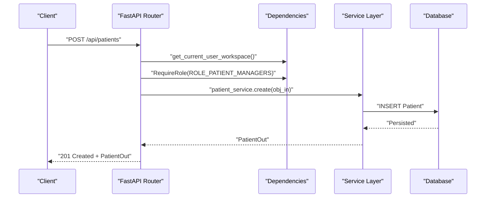
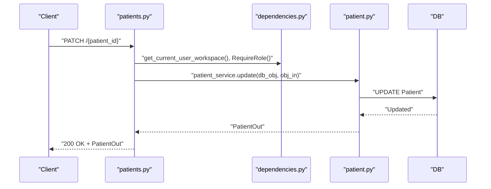
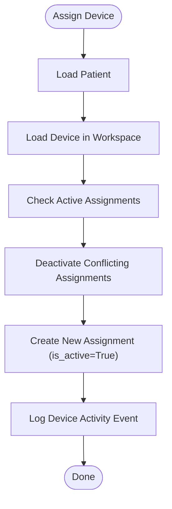
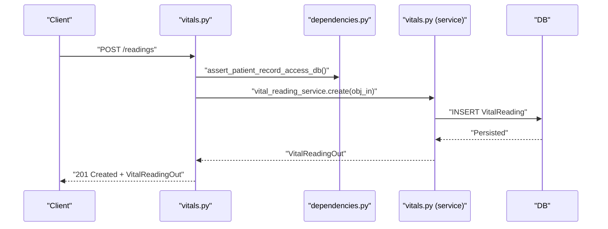
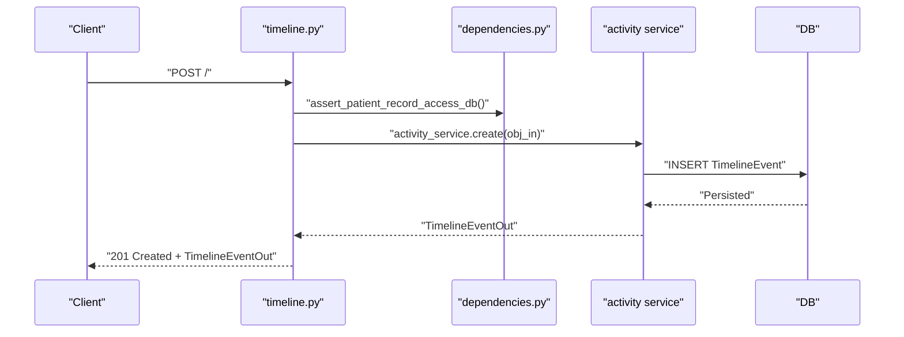
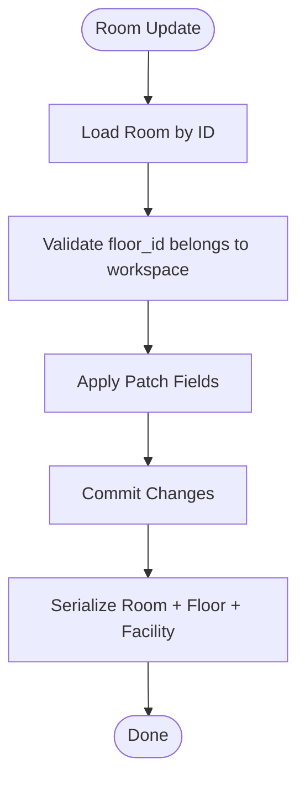
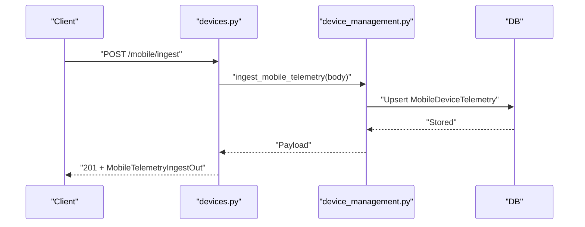
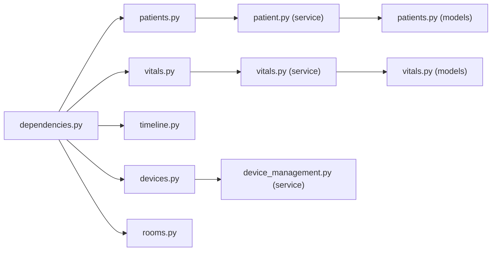

# Patient Management

<cite>
**Referenced Files in This Document**
- [patients.py](file://server/app/api/endpoints/patients.py)
- [vitals.py](file://server/app/api/endpoints/vitals.py)
- [timeline.py](file://server/app/api/endpoints/timeline.py)
- [devices.py](file://server/app/api/endpoints/devices.py)
- [rooms.py](file://server/app/api/endpoints/rooms.py)
- [patients.py (schemas)](file://server/app/schemas/patients.py)
- [vitals.py (schemas)](file://server/app/schemas/vitals.py)
- [activity.py (schemas)](file://server/app/schemas/activity.py)
- [devices.py (schemas)](file://server/app/schemas/devices.py)
- [patients.py (models)](file://server/app/models/patients.py)
- [vitals.py (models)](file://server/app/models/vitals.py)
- [patient.py (service)](file://server/app/services/patient.py)
- [vitals.py (service)](file://server/app/services/vitals.py)
- [device_management.py (service)](file://server/app/services/device_management.py)
- [dependencies.py](file://server/app/api/dependencies.py)
</cite>

## Table of Contents
1. [Introduction](#introduction)
2. [Project Structure](#project-structure)
3. [Core Components](#core-components)
4. [Architecture Overview](#architecture-overview)
5. [Detailed Component Analysis](#detailed-component-analysis)
6. [Dependency Analysis](#dependency-analysis)
7. [Performance Considerations](#performance-considerations)
8. [Troubleshooting Guide](#troubleshooting-guide)
9. [Conclusion](#conclusion)
10. [Appendices](#appendices)

## Introduction
This document provides comprehensive API documentation for patient management within the platform. It covers:
- Patient registration and profile updates
- Vitals monitoring and historical retrieval
- Timeline event creation and tracking
- Patient-device assignment and room assignment workflows
- Patient status management
- Vitals data ingestion and alert-triggering mechanisms
- Request/response schemas, validation rules, and workspace scoping
- Integration patterns with device telemetry and common workflows

## Project Structure
The patient management surface is implemented as FastAPI endpoints grouped under dedicated routers. Supporting services encapsulate business logic, while Pydantic schemas define request/response contracts. Data models enforce persistence constraints and workspace scoping.

**Diagram sources**
- [patients.py:126-261](file://server/app/api/endpoints/patients.py#L126-L261)
- [vitals.py:76-125](file://server/app/api/endpoints/vitals.py#L76-L125)
- [timeline.py:65-86](file://server/app/api/endpoints/timeline.py#L65-L86)
- [devices.py:136-184](file://server/app/api/endpoints/devices.py#L136-L184)
- [patient.py (service):80-164](file://server/app/services/patient.py#L80-L164)
- [vitals.py (service):12-45](file://server/app/services/vitals.py#L12-L45)
- [device_management.py (service):597-632](file://server/app/services/device_management.py#L597-L632)
- [patients.py (schemas):15-81](file://server/app/schemas/patients.py#L15-L81)
- [vitals.py (schemas):12-68](file://server/app/schemas/vitals.py#L12-L68)
- [activity.py (schemas):12-62](file://server/app/schemas/activity.py#L12-L62)
- [devices.py (schemas):12-93](file://server/app/schemas/devices.py#L12-L93)
- [patients.py (models):24-148](file://server/app/models/patients.py#L24-L148)
- [vitals.py (models):24-107](file://server/app/models/vitals.py#L24-L107)

**Section sources**
- [patients.py:126-261](file://server/app/api/endpoints/patients.py#L126-L261)
- [vitals.py:76-125](file://server/app/api/endpoints/vitals.py#L76-L125)
- [timeline.py:65-86](file://server/app/api/endpoints/timeline.py#L65-L86)
- [devices.py:136-184](file://server/app/api/endpoints/devices.py#L136-L184)

## Core Components
- Patient CRUD and profile management: create, read, update, delete, list, and mode switching
- Patient-device assignment: pair/unpair devices and enforce workspace-scoped uniqueness
- Vitals endpoints: create and list recent readings and observations
- Timeline endpoints: create and list timeline events scoped by patient
- Rooms endpoint: list and manage rooms within a workspace
- Device telemetry ingestion: accept mobile telemetry and integrate with device registry

**Section sources**
- [patients.py:90-261](file://server/app/api/endpoints/patients.py#L90-L261)
- [vitals.py:60-139](file://server/app/api/endpoints/vitals.py#L60-L139)
- [timeline.py:46-86](file://server/app/api/endpoints/timeline.py#L46-L86)
- [rooms.py:50-157](file://server/app/api/endpoints/rooms.py#L50-L157)
- [devices.py:136-184](file://server/app/api/endpoints/devices.py#L136-L184)

## Architecture Overview
The system enforces workspace scoping and role-based access control at the endpoint layer. Services encapsulate domain logic and maintain referential integrity. Device telemetry flows through a dedicated ingestion endpoint and integrates with device registry and vitals models.

**Diagram sources**
- [patients.py:126-133](file://server/app/api/endpoints/patients.py#L126-L133)
- [dependencies.py:159-169](file://server/app/api/dependencies.py#L159-L169)
- [patient.py (service):80-93](file://server/app/services/patient.py#L80-L93)

## Detailed Component Analysis

### Patient CRUD and Profile Management
Endpoints:
- GET /api/patients
- POST /api/patients
- GET /api/patients/{patient_id}
- GET /api/patients/{patient_id}/caregivers
- PUT /api/patients/{patient_id}/caregivers
- PATCH /api/patients/{patient_id}
- POST /api/patients/{patient_id}/profile-image
- DELETE /api/patients/{patient_id}
- POST /api/patients/{patient_id}/mode

Validation and scoping:
- Workspace-scoped: all operations scoped to current user’s workspace
- Access control: patient records readable by assigned caregivers; updates require patient managers
- Visibility filtering: non-admin users see only explicitly visible patients

Request/response schemas:
- PatientCreate/PatientUpdate/PatientOut
- ModeSwitchRequest
- DeviceAssignmentCreate/DeviceAssignmentOut
- PatientContactCreate/PatientContactUpdate/PatientContactOut

**Diagram sources**
- [patients.py:212-223](file://server/app/api/endpoints/patients.py#L212-L223)
- [dependencies.py:159-169](file://server/app/api/dependencies.py#L159-L169)
- [patient.py (service):80-93](file://server/app/services/patient.py#L80-L93)

**Section sources**
- [patients.py:90-261](file://server/app/api/endpoints/patients.py#L90-L261)
- [patients.py (schemas):15-81](file://server/app/schemas/patients.py#L15-L81)
- [patients.py (models):24-83](file://server/app/models/patients.py#L24-L83)
- [dependencies.py:328-368](file://server/app/api/dependencies.py#L328-L368)

### Patient-Device Assignment
Endpoints:
- GET /api/patients/{patient_id}/devices
- POST /api/patients/{patient_id}/devices
- DELETE /api/patients/{patient_id}/devices/{device_id}

Rules:
- Device assignment is workspace-scoped and unique per role and device
- Uniqueness constraint ensures only one active assignment per device and per role per patient
- Device pairing/unpairing logs activity events

**Diagram sources**
- [patients.py:294-313](file://server/app/api/endpoints/patients.py#L294-L313)
- [patient.py (service):94-142](file://server/app/services/patient.py#L94-L142)
- [devices.py:146-184](file://server/app/api/endpoints/devices.py#L146-L184)

**Section sources**
- [patients.py:283-332](file://server/app/api/endpoints/patients.py#L283-L332)
- [patient.py (service):94-161](file://server/app/services/patient.py#L94-L161)
- [patients.py (models):84-123](file://server/app/models/patients.py#L84-L123)

### Vitals Monitoring and Historical Retrieval
Endpoints:
- GET /api/vitals/readings
- POST /api/vitals/readings
- GET /api/vitals/readings/{reading_id}
- GET /api/vitals/observations
- POST /api/vitals/observations
- GET /api/vitals/observations/{observation_id}

Scoping:
- Patient role can only access their own vitals
- Non-clinical roles are restricted; admin may query all within workspace
- Visibility filtering applied when listing without patient_id

Request/response schemas:
- VitalReadingCreate/VitalReadingOut
- HealthObservationCreate/HealthObservationOut

**Diagram sources**
- [vitals.py:76-84](file://server/app/api/endpoints/vitals.py#L76-L84)
- [dependencies.py:354-367](file://server/app/api/dependencies.py#L354-L367)
- [vitals.py (service):12-26](file://server/app/services/vitals.py#L12-L26)

**Section sources**
- [vitals.py:60-139](file://server/app/api/endpoints/vitals.py#L60-L139)
- [vitals.py (schemas):12-68](file://server/app/schemas/vitals.py#L12-L68)
- [vitals.py (models):24-107](file://server/app/models/vitals.py#L24-L107)
- [vitals.py (service):12-45](file://server/app/services/vitals.py#L12-L45)

### Timeline Tracking
Endpoints:
- GET /api/timeline
- POST /api/timeline
- GET /api/timeline/{event_id}

Scoping:
- Patient role can only access their own timeline
- Admin may query all within workspace
- Visibility filtering applied when listing without patient_id

Request/response schemas:
- TimelineEventCreate/TimelineEventOut
- Alert schemas (AlertCreate/AlertOut) for alert-related events

**Diagram sources**
- [timeline.py:65-73](file://server/app/api/endpoints/timeline.py#L65-L73)
- [dependencies.py:354-367](file://server/app/api/dependencies.py#L354-L367)
- [activity.py (schemas):12-62](file://server/app/schemas/activity.py#L12-L62)

**Section sources**
- [timeline.py:46-86](file://server/app/api/endpoints/timeline.py#L46-L86)
- [activity.py (schemas):12-62](file://server/app/schemas/activity.py#L12-L62)

### Room Assignment Workflows
Endpoints:
- GET /api/rooms
- GET /api/rooms/{room_id}
- POST /api/rooms
- PATCH /api/rooms/{room_id}
- DELETE /api/rooms/{room_id}

Room detail includes hierarchical facility/floor context and room metadata.

**Diagram sources**
- [rooms.py:116-143](file://server/app/api/endpoints/rooms.py#L116-L143)

**Section sources**
- [rooms.py:50-157](file://server/app/api/endpoints/rooms.py#L50-L157)

### Device Telemetry Ingestion and Alerts
Endpoints:
- POST /api/devices/mobile/ingest
- POST /api/devices/{device_id}/patient
- POST /api/devices/{device_id}/commands
- POST /api/devices/{device_id}/camera/check
- POST /api/devices/cameras/{device_id}/command

Integration patterns:
- Mobile telemetry ingestion supports heart rate, RR interval, spo2, and RSSI samples
- Device commands routed via MQTT topics; command dispatch tracked in DeviceCommandDispatch
- Camera commands supported with configurable intervals and resolutions
- Device activity events logged for auditing and tracing

**Diagram sources**
- [devices.py:136-144](file://server/app/api/endpoints/devices.py#L136-L144)
- [device_management.py (service):597-632](file://server/app/services/device_management.py#L597-L632)
- [devices.py (schemas):69-93](file://server/app/schemas/devices.py#L69-L93)

**Section sources**
- [devices.py:136-311](file://server/app/api/endpoints/devices.py#L136-L311)
- [devices.py (schemas):12-93](file://server/app/schemas/devices.py#L12-L93)
- [device_management.py (service):597-632](file://server/app/services/device_management.py#L597-L632)

## Dependency Analysis
Role-based access control and workspace scoping are enforced consistently across endpoints:
- Role groups define capabilities and allowed operations
- Workspace scoping ensures data isolation
- Visibility filtering restricts list views for non-admin users

**Diagram sources**
- [dependencies.py:159-169](file://server/app/api/dependencies.py#L159-L169)
- [patients.py:126-133](file://server/app/api/endpoints/patients.py#L126-L133)
- [vitals.py:76-84](file://server/app/api/endpoints/vitals.py#L76-L84)
- [timeline.py:65-73](file://server/app/api/endpoints/timeline.py#L65-L73)
- [devices.py:136-144](file://server/app/api/endpoints/devices.py#L136-L144)
- [rooms.py:87-114](file://server/app/api/endpoints/rooms.py#L87-L114)
- [patient.py (service):80-93](file://server/app/services/patient.py#L80-L93)
- [vitals.py (service):12-26](file://server/app/services/vitals.py#L12-L26)
- [device_management.py (service):597-632](file://server/app/services/device_management.py#L597-L632)
- [patients.py (models):24-83](file://server/app/models/patients.py#L24-L83)
- [vitals.py (models):24-107](file://server/app/models/vitals.py#L24-L107)

**Section sources**
- [dependencies.py:171-311](file://server/app/api/dependencies.py#L171-L311)

## Performance Considerations
- Pagination defaults: most list endpoints use a default limit suitable for UI rendering
- Sorting and indexing: queries order by descending identifiers or timestamps and leverage indexed columns for performance
- Workspace scoping: filters reduce result sets early to minimize downstream processing
- Batch operations: device activity listing and telemetry ingestion are designed for high throughput

[No sources needed since this section provides general guidance]

## Troubleshooting Guide
Common issues and resolutions:
- 403 Forbidden: verify role and workspace assignment; ensure visibility rules apply
- 404 Not Found: confirm patient/device/workspace IDs exist and belong to the current workspace
- 400 Bad Request: review request schemas and constraints (e.g., device role, hardware type)
- Device pairing conflicts: only one active assignment per device and per role per patient is allowed

**Section sources**
- [dependencies.py:354-401](file://server/app/api/dependencies.py#L354-L401)
- [patient.py (service):94-161](file://server/app/services/patient.py#L94-L161)
- [device_management.py (service):597-632](file://server/app/services/device_management.py#L597-L632)

## Conclusion
The patient management API provides a secure, workspace-scoped interface for CRUD operations, vitals monitoring, timeline tracking, device assignment, and room management. Robust validation, role-based access control, and clear request/response schemas enable reliable integrations with device telemetry and clinical workflows.

[No sources needed since this section summarizes without analyzing specific files]

## Appendices

### API Definitions and Schemas

- Patient CRUD
  - POST /api/patients
    - Request: PatientCreate
    - Response: PatientOut
    - Roles: patient managers
  - GET /api/patients
    - Query: is_active?, care_level?, q?, skip, limit
    - Response: list[PatientOut]
  - GET /api/patients/{patient_id}
    - Response: PatientOut
  - PATCH /api/patients/{patient_id}
    - Request: PatientUpdate
    - Response: PatientOut
    - Roles: patient managers
  - DELETE /api/patients/{patient_id}
    - Response: 204 No Content
    - Roles: patient managers
  - POST /api/patients/{patient_id}/profile-image
    - Form-data: file
    - Response: PatientOut
    - Roles: patient managers

- Vitals
  - POST /api/vitals/readings
    - Request: VitalReadingCreate
    - Response: VitalReadingOut
    - Roles: care note writers
  - GET /api/vitals/readings
    - Query: patient_id?, limit
    - Response: list[VitalReadingOut]
  - GET /api/vitals/readings/{reading_id}
    - Response: VitalReadingOut
  - POST /api/vitals/observations
    - Request: HealthObservationCreate
    - Response: HealthObservationOut
    - Roles: care note writers
  - GET /api/vitals/observations
    - Query: patient_id?, limit
    - Response: list[HealthObservationOut]
  - GET /api/vitals/observations/{observation_id}
    - Response: HealthObservationOut

- Timeline
  - POST /api/timeline
    - Request: TimelineEventCreate
    - Response: TimelineEventOut
    - Roles: care note writers
  - GET /api/timeline
    - Query: patient_id?, limit
    - Response: list[TimelineEventOut]
  - GET /api/timeline/{event_id}
    - Response: TimelineEventOut

- Devices
  - POST /api/devices/mobile/ingest
    - Request: MobileTelemetryIngest
    - Response: MobileTelemetryIngestOut
    - Roles: authenticated
  - POST /api/devices/{device_id}/patient
    - Request: DevicePatientAssign
    - Response: {status, patient_id?, device_role?, assigned_at?}
    - Roles: patient managers
  - POST /api/devices/{device_id}/commands
    - Request: DeviceCommandRequest
    - Response: DeviceCommandOut
    - Roles: device commanders
  - POST /api/devices/{device_id}/camera/check
    - Response: {command_id, topic, status}
    - Roles: device commanders
  - POST /api/devices/cameras/{device_id}/command
    - Request: CameraCommand
    - Response: {message, topic, command_id}
    - Roles: device commanders

- Rooms
  - GET /api/rooms
    - Query: floor_id?
    - Response: list[Room summary]
  - GET /api/rooms/{room_id}
    - Response: Room summary
  - POST /api/rooms
    - Request: RoomCreate
    - Response: Room summary
    - Roles: patient managers
  - PATCH /api/rooms/{room_id}
    - Request: RoomUpdate
    - Response: Room summary
    - Roles: patient managers
  - DELETE /api/rooms/{room_id}
    - Response: 204 No Content
    - Roles: patient managers

**Section sources**
- [patients.py:90-261](file://server/app/api/endpoints/patients.py#L90-L261)
- [vitals.py:60-139](file://server/app/api/endpoints/vitals.py#L60-L139)
- [timeline.py:46-86](file://server/app/api/endpoints/timeline.py#L46-L86)
- [devices.py:136-311](file://server/app/api/endpoints/devices.py#L136-L311)
- [rooms.py:50-157](file://server/app/api/endpoints/rooms.py#L50-L157)

### Validation Rules and Constraints
- PatientCreate/PatientUpdate
  - Names: non-empty strings with length limits
  - Demographics: optional date of birth, gender, height/weight, blood type
  - Medical history: lists of conditions, allergies, medications, surgeries
  - Care attributes: care_level, mobility_type, current_mode, notes
  - Room linkage: optional room_id

- DeviceAssignmentCreate
  - device_id: non-empty string
  - device_role: constrained set of values

- VitalReadingCreate
  - patient_id, device_id required
  - Optional vital fields with numeric ranges
  - source: constrained values

- HealthObservationCreate
  - observation_type: constrained values
  - Optional BP, temp, weight, pain, meals, water
  - Free-form data dictionary

- TimelineEventCreate
  - event_type: constrained values
  - Optional room linkage and free-form data

- Device schemas
  - HARDWARE_TYPES validated
  - MobileTelemetryIngest validates telemetry ranges and optional fields

**Section sources**
- [patients.py (schemas):15-81](file://server/app/schemas/patients.py#L15-L81)
- [vitals.py (schemas):12-68](file://server/app/schemas/vitals.py#L12-L68)
- [activity.py (schemas):12-62](file://server/app/schemas/activity.py#L12-L62)
- [devices.py (schemas):12-93](file://server/app/schemas/devices.py#L12-L93)

### Workspace Scoping and Access Control
- All endpoints scoped to current user’s workspace
- Visibility rules:
  - Admin/Head Nurse: full access
  - Patient: self-only
  - Observer/Clinical staff: visible patient set via caregiver access
- Device access for patients restricted to actively assigned devices

**Section sources**
- [dependencies.py:328-401](file://server/app/api/dependencies.py#L328-L401)