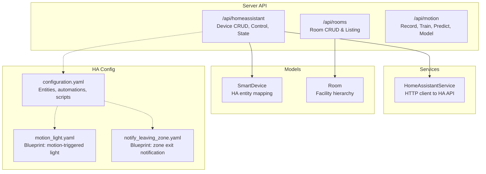
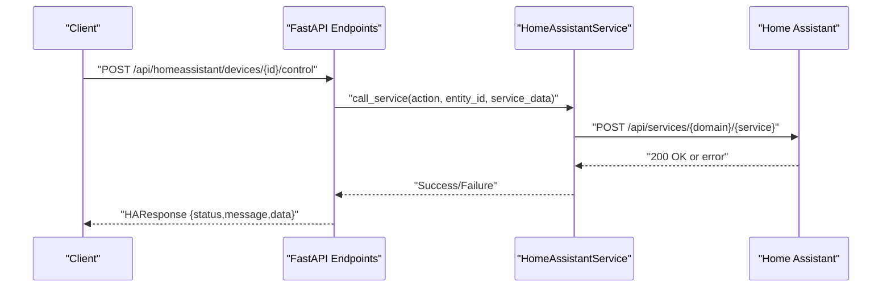
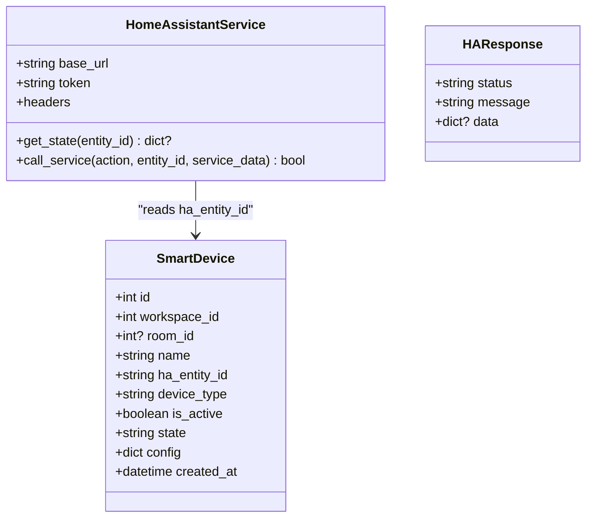
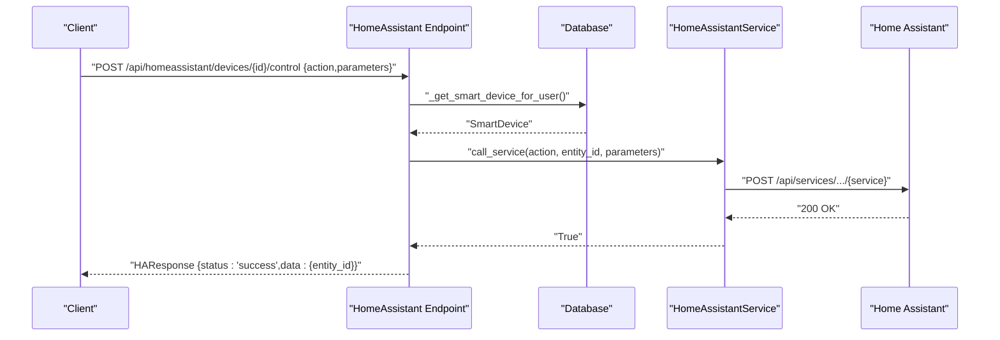
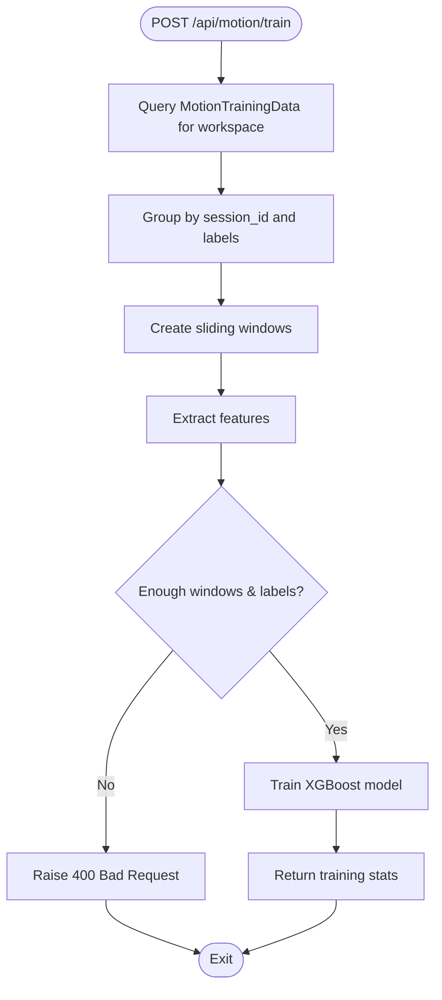
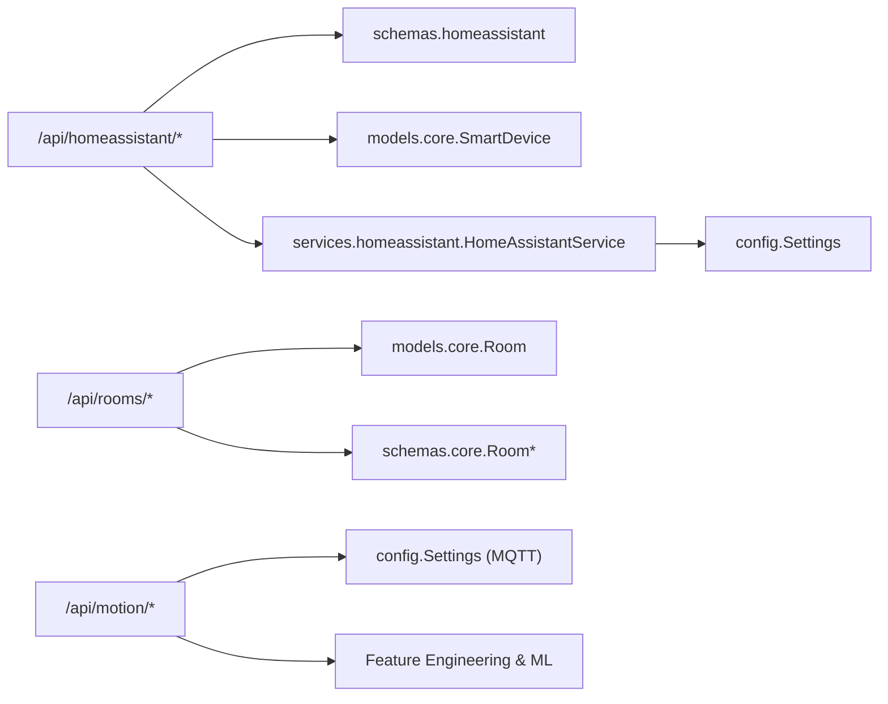

# Smart Home Integration

<cite>
**Referenced Files in This Document**
- [homeassistant.py](file://server/app/api/endpoints/homeassistant.py)
- [motion.py](file://server/app/api/endpoints/motion.py)
- [rooms.py](file://server/app/api/endpoints/rooms.py)
- [homeassistant.py](file://server/app/schemas/homeassistant.py)
- [homeassistant.py](file://server/app/services/homeassistant.py)
- [core.py](file://server/app/models/core.py)
- [core.py](file://server/app/schemas/core.py)
- [config.py](file://server/app/config.py)
- [configuration.yaml](file://server/homeassistant/configuration.yaml)
- [automations.yaml](file://server/homeassistant/automations.yaml)
- [motion_light.yaml](file://server/homeassistant/blueprints/automation/homeassistant/motion_light.yaml)
- [notify_leaving_zone.yaml](file://server/homeassistant/blueprints/automation/homeassistant/notify_leaving_zone.yaml)
- [scripts.yaml](file://server/homeassistant/scripts.yaml)
</cite>

## Table of Contents
1. [Introduction](#introduction)
2. [Project Structure](#project-structure)
3. [Core Components](#core-components)
4. [Architecture Overview](#architecture-overview)
5. [Detailed Component Analysis](#detailed-component-analysis)
6. [Dependency Analysis](#dependency-analysis)
7. [Performance Considerations](#performance-considerations)
8. [Troubleshooting Guide](#troubleshooting-guide)
9. [Conclusion](#conclusion)
10. [Appendices](#appendices)

## Introduction
This document provides comprehensive API documentation for smart home integration endpoints, focusing on:
- Home Assistant bridge APIs for device discovery, control, and status monitoring
- Room control endpoints for facility and room management
- Motion detection integration for recording, training, prediction, and model lifecycle
- Integration patterns with Home Assistant automations and blueprints
- Device compatibility requirements and error handling for network connectivity issues
- Examples of common smart home automation scenarios and device control patterns

The documentation covers request/response schemas, endpoint behaviors, and operational flows grounded in the repository’s implementation.

## Project Structure
Smart home integration spans three primary areas:
- API endpoints for Home Assistant device orchestration and motion intelligence
- Room management endpoints for facility hierarchy and room configuration
- Home Assistant configuration and blueprints enabling motion-based automation and notifications

**Diagram sources**
- [homeassistant.py:65-255](file://server/app/api/endpoints/homeassistant.py#L65-L255)
- [rooms.py:50-158](file://server/app/api/endpoints/rooms.py#L50-L158)
- [motion.py:49-218](file://server/app/api/endpoints/motion.py#L49-L218)
- [homeassistant.py:11-76](file://server/app/services/homeassistant.py#L11-L76)
- [core.py:104-124](file://server/app/models/core.py#L104-L124)
- [configuration.yaml:1-62](file://server/homeassistant/configuration.yaml#L1-L62)
- [motion_light.yaml:1-59](file://server/homeassistant/blueprints/automation/homeassistant/motion_light.yaml#L1-L59)
- [notify_leaving_zone.yaml:1-51](file://server/homeassistant/blueprints/automation/homeassistant/notify_leaving_zone.yaml#L1-L51)

**Section sources**
- [homeassistant.py:1-255](file://server/app/api/endpoints/homeassistant.py#L1-L255)
- [rooms.py:1-158](file://server/app/api/endpoints/rooms.py#L1-L158)
- [motion.py:1-218](file://server/app/api/endpoints/motion.py#L1-L218)
- [configuration.yaml:1-62](file://server/homeassistant/configuration.yaml#L1-L62)

## Core Components
- Home Assistant Bridge API
  - Device listing, creation, updates, deletion
  - Device control via HA service calls
  - Direct state queries from HA
- Room Management API
  - Room listing, retrieval, creation, updates, deletion
  - Hierarchical joins to floors and facilities
- Motion Intelligence API
  - Start/stop motion recording via MQTT
  - Train ML model from stored training data
  - Predict actions from raw IMU windows
  - Model persistence (save/load) and metadata inspection
- Home Assistant Configuration and Blueprints
  - Template-based demo entities
  - Automation blueprints for motion-activated lighting and zone exit notifications

**Section sources**
- [homeassistant.py:65-255](file://server/app/api/endpoints/homeassistant.py#L65-L255)
- [rooms.py:50-158](file://server/app/api/endpoints/rooms.py#L50-L158)
- [motion.py:49-218](file://server/app/api/endpoints/motion.py#L49-L218)
- [configuration.yaml:21-57](file://server/homeassistant/configuration.yaml#L21-L57)
- [motion_light.yaml:1-59](file://server/homeassistant/blueprints/automation/homeassistant/motion_light.yaml#L1-L59)
- [notify_leaving_zone.yaml:1-51](file://server/homeassistant/blueprints/automation/homeassistant/notify_leaving_zone.yaml#L1-L51)

## Architecture Overview
The system integrates a FastAPI backend with Home Assistant and MQTT for motion telemetry. The Home Assistant service encapsulates HTTP calls to the HA REST API, while the motion pipeline uses MQTT to control devices and ML routines to classify motion.

**Diagram sources**
- [homeassistant.py:187-224](file://server/app/api/endpoints/homeassistant.py#L187-L224)
- [homeassistant.py:42-73](file://server/app/services/homeassistant.py#L42-L73)

## Detailed Component Analysis

### Home Assistant Bridge API
Endpoints enable device lifecycle management and control through Home Assistant.

- Device Discovery and Listing
  - GET /api/homeassistant/devices
    - Scope by workspace and, for patients, by assigned room
    - Returns active devices only for patients
- Device Registration
  - POST /api/homeassistant/devices
    - Admin-only creation linking HA entity to a device
    - Logs activity events
- Device Update and Deletion
  - PATCH /api/homeassistant/devices/{device_id}
    - Validates room ownership and updates attributes
  - DELETE /api/homeassistant/devices/{device_id}
    - Admin-only removal with activity logging
- Device Control
  - POST /api/homeassistant/devices/{id}/control
    - Supports actions like turn_on, turn_off, toggle
    - Infers domain from entity_id when action is a short verb
    - Returns HAResponse with status and data
- Status Monitoring
  - GET /api/homeassistant/devices/{id}/state
    - Fetches latest state from HA and caches locally
    - Returns HAResponse with state data

Request/Response Schemas
- SmartDeviceCreate, SmartDeviceUpdate, SmartDeviceResponse
  - Fields include name, ha_entity_id, device_type, room_id, is_active, config, state, timestamps
- HADeviceControl
  - action: string (e.g., turn_on, toggle)
  - parameters: object (e.g., brightness)
- HAResponse
  - status: string (success/error)
  - message: string
  - data: object (optional)

Behavior Notes
- Patient role scoping ensures control only within their room
- Inactive devices cannot be controlled
- HA service failures return 502 with guidance to check token

**Section sources**
- [homeassistant.py:65-255](file://server/app/api/endpoints/homeassistant.py#L65-L255)
- [homeassistant.py:7-46](file://server/app/schemas/homeassistant.py#L7-L46)
- [homeassistant.py:11-76](file://server/app/services/homeassistant.py#L11-L76)
- [core.py:104-124](file://server/app/models/core.py#L104-L124)

#### Class Diagram: Home Assistant Entities and Service

**Diagram sources**
- [core.py:104-124](file://server/app/models/core.py#L104-L124)
- [homeassistant.py:11-76](file://server/app/services/homeassistant.py#L11-L76)
- [homeassistant.py:42-46](file://server/app/schemas/homeassistant.py#L42-L46)

### Room Control Endpoints
Manage rooms within a workspace, including hierarchical associations to floors and facilities.

- Listing Rooms
  - GET /api/rooms
    - Optional floor_id filter
    - Returns serialized room with floor and facility details
- Retrieve Room
  - GET /api/rooms/{room_id}
- Create Room
  - POST /api/rooms
    - Validates floor ownership and persists room
- Update Room
  - PATCH /api/rooms/{room_id}
    - Validates floor ownership and updates fields
- Delete Room
  - DELETE /api/rooms/{room_id}

Request/Response Schemas
- RoomCreate, RoomUpdate
  - Fields include name, description, floor_id, room_type, node_device_id, adjacent_rooms, config

**Section sources**
- [rooms.py:50-158](file://server/app/api/endpoints/rooms.py#L50-L158)
- [core.py:17-31](file://server/app/schemas/core.py#L17-L31)

#### Sequence Diagram: Device Control Flow

**Diagram sources**
- [homeassistant.py:187-224](file://server/app/api/endpoints/homeassistant.py#L187-L224)
- [homeassistant.py:42-73](file://server/app/services/homeassistant.py#L42-L73)

### Motion Detection Integration
Supports recording, training, prediction, and model lifecycle management.

- Recording Control
  - POST /api/motion/record/start
    - Publishes MQTT start command to device topic
  - POST /api/motion/record/stop
    - Publishes MQTT stop command to device topic
- Machine Learning
  - POST /api/motion/train
    - Slides windows over grouped sessions, extracts features, trains model
  - POST /api/motion/predict
    - Extracts features from raw IMU window and predicts action
  - GET /api/motion/model
    - Returns model info/status
  - POST /api/motion/model/save
    - Persists model to disk
  - POST /api/motion/model/load
    - Loads model from disk

Request/Response Schemas
- MotionRecordStartRequest, MotionRecordStopRequest
  - device_id, session_id, label (start)
- MotionTrainRequest
  - window_size, overlap, test_split
- MotionPredictRequest
  - imu_data: array of {ax,ay,az,gx,gy,gz}

Error Handling
- 404 for missing device/workspace
- 502 for MQTT communication failures
- 400 for insufficient training data or model readiness

**Section sources**
- [motion.py:49-218](file://server/app/api/endpoints/motion.py#L49-L218)
- [core.py:44-59](file://server/app/schemas/core.py#L44-L59)

#### Flowchart: Motion Training Pipeline

**Diagram sources**
- [motion.py:111-178](file://server/app/api/endpoints/motion.py#L111-L178)

### Home Assistant Configuration and Blueprints
Enable motion-based automation and notifications without custom code.

- configuration.yaml
  - Template-based demo lights and input booleans
  - Includes automations.yaml and scripts.yaml
- blueprints/automation/homeassistant/motion_light.yaml
  - Blueprint: motion-activated light
  - Inputs: motion_entity, light_target, no_motion_wait
- blueprints/automation/homeassistant/notify_leaving_zone.yaml
  - Blueprint: zone exit notification
  - Inputs: person_entity, zone_entity, notify_device
- scripts.yaml
  - Placeholder for HA scripts

Integration Patterns
- Use SmartDevice.config to store HA entity IDs per room
- Compose HA automations with blueprint inputs to trigger room-specific lights and notifications
- Combine motion predictions with presence/zone states for contextual actions

**Section sources**
- [configuration.yaml:1-62](file://server/homeassistant/configuration.yaml#L1-L62)
- [automations.yaml:1-2](file://server/homeassistant/automations.yaml#L1-L2)
- [motion_light.yaml:1-59](file://server/homeassistant/blueprints/automation/homeassistant/motion_light.yaml#L1-L59)
- [notify_leaving_zone.yaml:1-51](file://server/homeassistant/blueprints/automation/homeassistant/notify_leaving_zone.yaml#L1-L51)
- [scripts.yaml:1-2](file://server/homeassistant/scripts.yaml#L1-L2)

## Dependency Analysis
- API endpoints depend on:
  - SQLAlchemy models for persistence
  - Pydantic schemas for request/response validation
  - HomeAssistantService for external HA integration
- HomeAssistantService depends on:
  - Application settings for HA base URL and access token
  - HTTPX for asynchronous requests
- Motion endpoints depend on:
  - MQTT client for device control
  - Feature engineering and ML utilities for training/prediction
- Room endpoints depend on:
  - Floor and Facility joins for hierarchical serialization

**Diagram sources**
- [homeassistant.py:1-255](file://server/app/api/endpoints/homeassistant.py#L1-L255)
- [homeassistant.py:1-46](file://server/app/schemas/homeassistant.py#L1-L46)
- [core.py:104-124](file://server/app/models/core.py#L104-L124)
- [homeassistant.py:1-76](file://server/app/services/homeassistant.py#L1-L76)
- [config.py:64-67](file://server/app/config.py#L64-L67)
- [rooms.py:1-158](file://server/app/api/endpoints/rooms.py#L1-L158)
- [core.py:17-31](file://server/app/schemas/core.py#L17-L31)
- [motion.py:1-218](file://server/app/api/endpoints/motion.py#L1-L218)

**Section sources**
- [homeassistant.py:1-255](file://server/app/api/endpoints/homeassistant.py#L1-L255)
- [rooms.py:1-158](file://server/app/api/endpoints/rooms.py#L1-L158)
- [motion.py:1-218](file://server/app/api/endpoints/motion.py#L1-L218)
- [homeassistant.py:1-76](file://server/app/services/homeassistant.py#L1-L76)
- [config.py:64-67](file://server/app/config.py#L64-L67)
- [core.py:104-124](file://server/app/models/core.py#L104-L124)

## Performance Considerations
- Asynchronous HTTP and MQTT clients minimize blocking during HA and device communications
- Caching HA state locally reduces repeated HA queries
- Sliding window sizes and overlaps should balance accuracy and latency in motion training/prediction
- Batch training on sufficient sessions improves model stability

## Troubleshooting Guide
Common Issues and Resolutions
- Home Assistant Token Missing
  - Symptom: 502 responses when controlling devices or fetching state
  - Resolution: Set HA access token in environment settings
- Entity Not Found
  - Symptom: 404 state fetch or control failure
  - Resolution: Verify ha_entity_id and that the entity exists in HA
- Network Connectivity Failures
  - Symptom: 502 MQTT publish failures or HA request errors
  - Resolution: Confirm broker credentials and HA API availability
- Patient Role Scoping
  - Symptom: 404 when accessing devices outside assigned room
  - Resolution: Ensure patient is assigned to a room and device belongs to that room
- Model Readiness
  - Symptom: 400 when predicting without training
  - Resolution: Train model with sufficient sessions and labels

**Section sources**
- [homeassistant.py:211-216](file://server/app/api/endpoints/homeassistant.py#L211-L216)
- [homeassistant.py:22-40](file://server/app/services/homeassistant.py#L22-L40)
- [motion.py:75-77](file://server/app/api/endpoints/motion.py#L75-L77)
- [motion.py:105-107](file://server/app/api/endpoints/motion.py#L105-L107)
- [motion.py:186-187](file://server/app/api/endpoints/motion.py#L186-L187)

## Conclusion
The smart home integration provides a robust foundation for:
- Managing and controlling Home Assistant devices via secure, role-scoped endpoints
- Orchestrating room-level automation and presence-aware actions
- Integrating motion telemetry with machine learning for actionable insights
- Leveraging Home Assistant blueprints to implement motion-based lighting and notifications

By adhering to the documented schemas and patterns, teams can extend the system with additional device types, refine automation blueprints, and scale to larger deployments.

## Appendices

### API Reference Summary

- Home Assistant Bridge
  - GET /api/homeassistant/devices
  - POST /api/homeassistant/devices
  - PATCH /api/homeassistant/devices/{device_id}
  - DELETE /api/homeassistant/devices/{device_id}
  - POST /api/homeassistant/devices/{device_id}/control
  - GET /api/homeassistant/devices/{device_id}/state

- Room Management
  - GET /api/rooms
  - GET /api/rooms/{room_id}
  - POST /api/rooms
  - PATCH /api/rooms/{room_id}
  - DELETE /api/rooms/{room_id}

- Motion Intelligence
  - POST /api/motion/record/start
  - POST /api/motion/record/stop
  - POST /api/motion/train
  - POST /api/motion/predict
  - GET /api/motion/model
  - POST /api/motion/model/save
  - POST /api/motion/model/load

**Section sources**
- [homeassistant.py:65-255](file://server/app/api/endpoints/homeassistant.py#L65-L255)
- [rooms.py:50-158](file://server/app/api/endpoints/rooms.py#L50-L158)
- [motion.py:49-218](file://server/app/api/endpoints/motion.py#L49-L218)

### Configuration Requirements
- Home Assistant
  - Access token and base URL must be configured
- MQTT
  - Broker, port, credentials, and TLS settings must be configured
- Blueprints
  - Use motion_light.yaml and notify_leaving_zone.yaml to define automation behaviors

**Section sources**
- [config.py:64-67](file://server/app/config.py#L64-L67)
- [config.py:23-37](file://server/app/config.py#L23-L37)
- [motion_light.yaml:1-59](file://server/homeassistant/blueprints/automation/homeassistant/motion_light.yaml#L1-L59)
- [notify_leaving_zone.yaml:1-51](file://server/homeassistant/blueprints/automation/homeassistant/notify_leaving_zone.yaml#L1-L51)