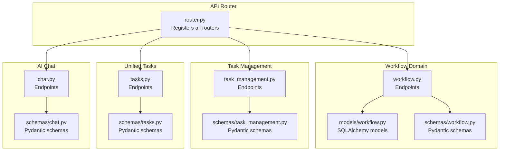
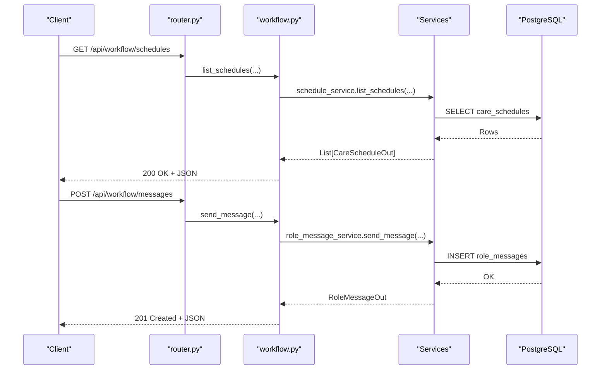
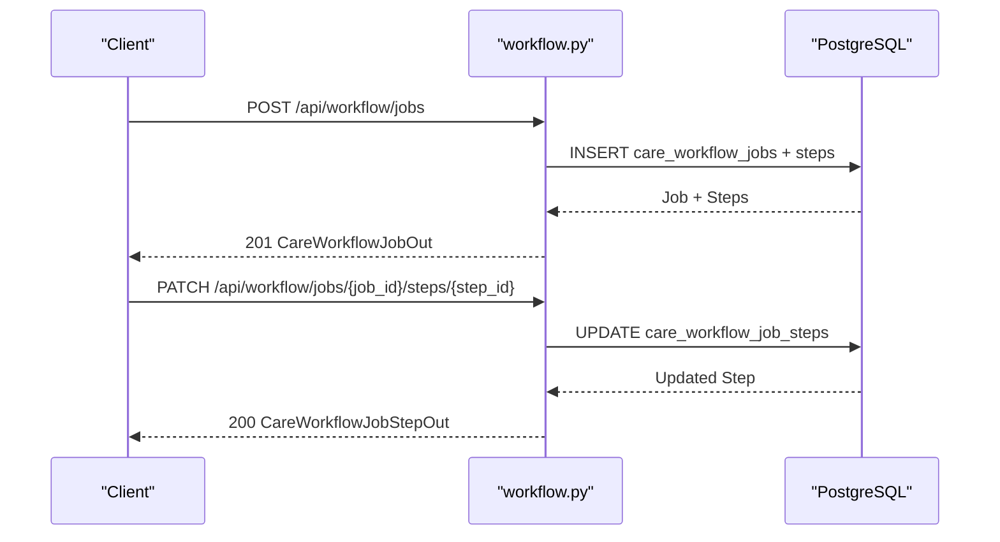
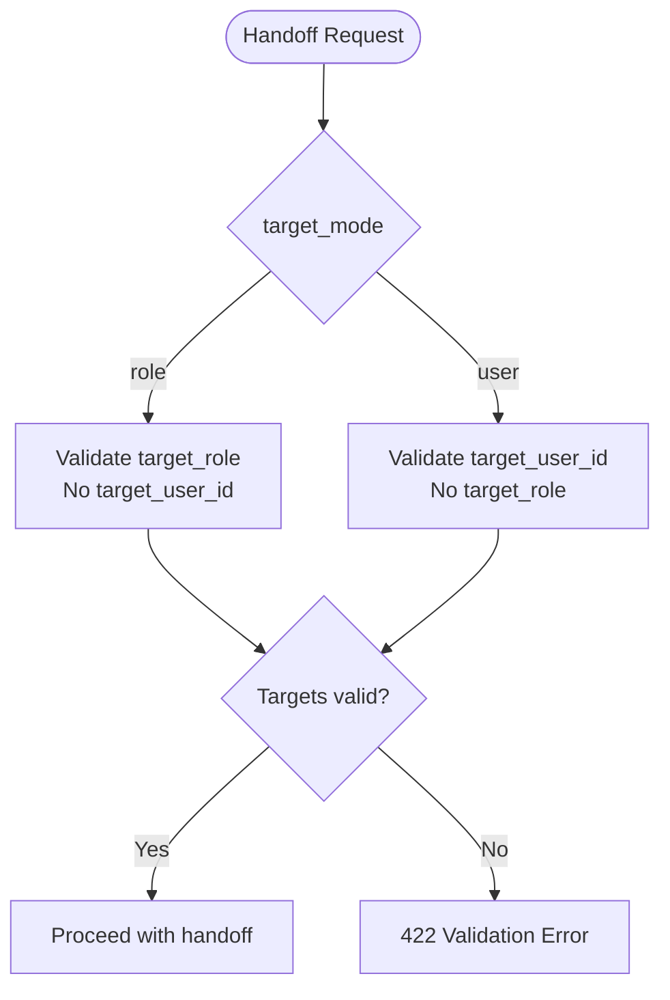
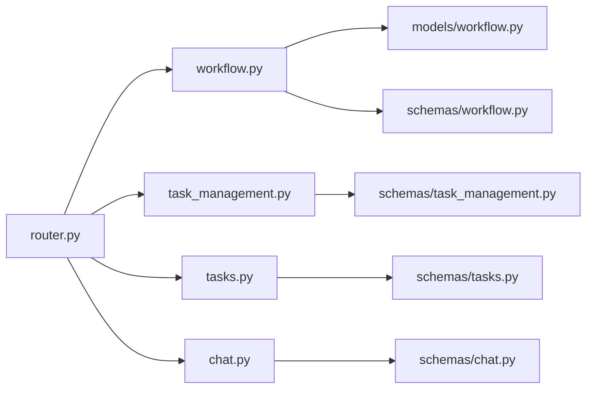

# Workflow & Task Management

<cite>
**Referenced Files in This Document**
- [router.py](file://server/app/api/router.py)
- [workflow.py](file://server/app/api/endpoints/workflow.py)
- [workflow.py](file://server/app/models/workflow.py)
- [workflow.py](file://server/app/schemas/workflow.py)
- [chat.py](file://server/app/api/endpoints/chat.py)
- [chat.py](file://server/app/schemas/chat.py)
- [task_management.py](file://server/app/api/endpoints/task_management.py)
- [task_management.py](file://server/app/schemas/task_management.py)
- [tasks.py](file://server/app/api/endpoints/tasks.py)
- [tasks.py](file://server/app/schemas/tasks.py)
</cite>

## Table of Contents
1. [Introduction](#introduction)
2. [Project Structure](#project-structure)
3. [Core Components](#core-components)
4. [Architecture Overview](#architecture-overview)
5. [Detailed Component Analysis](#detailed-component-analysis)
6. [Dependency Analysis](#dependency-analysis)
7. [Performance Considerations](#performance-considerations)
8. [Troubleshooting Guide](#troubleshooting-guide)
9. [Conclusion](#conclusion)

## Introduction
This document provides comprehensive API documentation for workflow and task management endpoints. It covers:
- Workflow job creation and checklist-style execution
- Task assignment, lifecycle, and reporting
- Workflow state management, claims, and handoffs
- Chat messaging endpoints and workflow message attachments
- Task scheduling, checklist management, and workflow audit trails
- Request/response schemas for workflow operations, task CRUD APIs, and chat message handling
- Orchestration patterns, dependency management, and real-time updates
- Examples of workflow automation, task delegation, and integration with the AI agent runtime

## Project Structure
The workflow and task management APIs are exposed under the /api prefix and grouped by domain:
- Workflow domain: /api/workflow
- Task management (routine tasks): /api/task-management
- Unified task management: /api/tasks
- AI chat: /api/chat

**Diagram sources**
- [router.py:16-154](file://server/app/api/router.py#L16-L154)
- [workflow.py](file://server/app/api/endpoints/workflow.py)
- [workflow.py](file://server/app/models/workflow.py)
- [workflow.py](file://server/app/schemas/workflow.py)
- [task_management.py](file://server/app/api/endpoints/task_management.py)
- [task_management.py](file://server/app/schemas/task_management.py)
- [tasks.py](file://server/app/api/endpoints/tasks.py)
- [tasks.py](file://server/app/schemas/tasks.py)
- [chat.py](file://server/app/api/endpoints/chat.py)
- [chat.py](file://server/app/schemas/chat.py)

**Section sources**
- [router.py:16-154](file://server/app/api/router.py#L16-L154)

## Core Components
- Workflow domain: schedules, tasks, directives, handover notes, workflow jobs, and audit trail
- Task management: routine tasks, daily logs, and patient fix routines
- Unified tasks: task CRUD, reporting, and board views
- AI chat: streaming chat, conversations, and message history

Key responsibilities:
- Enforce workspace and patient visibility
- Validate roles for write operations
- Log audit trail events
- Attach and serve workflow message attachments
- Stream AI responses and persist conversation history

**Section sources**
- [workflow.py:110-800](file://server/app/api/endpoints/workflow.py#L110-L800)
- [task_management.py:168-645](file://server/app/api/endpoints/task_management.py#L168-L645)
- [tasks.py:44-265](file://server/app/api/endpoints/tasks.py#L44-L265)
- [chat.py:25-150](file://server/app/api/endpoints/chat.py#L25-L150)

## Architecture Overview
The system exposes REST endpoints organized by domain. Each domain endpoint validates access, enforces roles, and delegates to service layers. Workflow and task operations integrate with audit logging and optional AI agent runtime for automated actions.

**Diagram sources**
- [router.py:68-72](file://server/app/api/router.py#L68-L72)
- [workflow.py:261-325](file://server/app/api/endpoints/workflow.py#L261-L325)

## Detailed Component Analysis

### Workflow Domain APIs
Endpoints for schedules, tasks, directives, handover notes, workflow jobs, messaging, and audit trail.

- Schedules
  - GET /api/workflow/schedules
  - POST /api/workflow/schedules
  - PATCH /api/workflow/schedules/{schedule_id}

- Tasks
  - GET /api/workflow/tasks
  - POST /api/workflow/tasks
  - PATCH /api/workflow/tasks/{task_id}

- Messaging
  - GET /api/workflow/messages
  - POST /api/workflow/messages
  - POST /api/workflow/messages/{message_id}/read
  - POST /api/workflow/messages/attachments
  - GET /api/workflow/messages/{message_id}/attachments/{attachment_id}/content
  - DELETE /api/workflow/messages/{message_id}

- Handover Notes
  - GET /api/workflow/handovers
  - POST /api/workflow/handovers

- Directives
  - GET /api/workflow/directives
  - POST /api/workflow/directives
  - PATCH /api/workflow/directives/{directive_id}
  - POST /api/workflow/directives/{directive_id}/acknowledge

- Audit Trail
  - GET /api/workflow/audit

- Workflow Item Details and Actions
  - GET /api/workflow/items/{item_type}/{item_id}
  - POST /api/workflow/items/{item_type}/{item_id}/claim
  - POST /api/workflow/items/{item_type}/{item_id}/handoff

- Recipient Discovery
  - GET /api/workflow/messaging/recipients

Request/Response Schemas
- Schedules: CareScheduleCreate, CareScheduleUpdate, CareScheduleOut
- Tasks: CareTaskCreate, CareTaskUpdate, CareTaskOut
- Messages: RoleMessageCreate, RoleMessageOut, PendingWorkflowAttachmentUploadOut, RoleMessageAttachmentOut
- Directives: CareDirectiveCreate, CareDirectiveUpdate, CareDirectiveOut, CareDirectiveAcknowledge
- Handover Notes: HandoverNoteCreate, HandoverNoteOut
- Audit: AuditTrailEventOut
- Workflow Jobs: CareWorkflowJobCreate, CareWorkflowJobUpdate, CareWorkflowJobOut, CareWorkflowJobStepOut, CareWorkflowJobStepPatch, WorkflowJobStepFinalizeAttachmentsBody
- Workflow Item Detail: WorkflowItemDetailOut, WorkflowActionOut

Operational Notes
- Visibility: Enforced via workspace membership and patient visibility checks
- Roles: Write operations restricted to specific roles; read access for authenticated users
- Audit: Events logged for sensitive updates (e.g., directive updates)
- Attachments: Pending uploads and retrieval for workflow messages

**Section sources**
- [workflow.py:110-800](file://server/app/api/endpoints/workflow.py#L110-L800)
- [workflow.py](file://server/app/models/workflow.py)
- [workflow.py](file://server/app/schemas/workflow.py)

#### Workflow Job Creation and Checklist Execution
- Create job: POST /api/workflow/jobs
- Update job: PATCH /api/workflow/jobs/{job_id}
- List jobs: GET /api/workflow/jobs
- Get job detail: GET /api/workflow/jobs/{job_id}
- Patch step: PATCH /api/workflow/jobs/{job_id}/steps/{step_id}
- Finalize step attachments: POST /api/workflow/jobs/{job_id}/steps/{step_id}/finalize-attachments
- Assignees: GET /api/workflow/jobs/{job_id}/assignees

Request/Response Schemas
- CareWorkflowJobCreate, CareWorkflowJobUpdate, CareWorkflowJobOut
- CareWorkflowJobStepOut, CareWorkflowJobStepPatch, WorkflowJobStepFinalizeAttachmentsBody

**Diagram sources**
- [workflow.py:110-800](file://server/app/api/endpoints/workflow.py#L110-L800)

**Section sources**
- [workflow.py:110-800](file://server/app/api/endpoints/workflow.py#L110-L800)
- [workflow.py](file://server/app/schemas/workflow.py)

#### Task Assignment, Claims, and Handoffs
- Claim item: POST /api/workflow/items/{item_type}/{item_id}/claim
- Handoff item: POST /api/workflow/items/{item_type}/{item_id}/handoff
- Retrieve item detail: GET /api/workflow/items/{item_type}/{item_id}

Validation rules:
- WorkflowHandoffRequest enforces either role or user target selection
- Access checks ensure users can only act on items they can access

**Diagram sources**
- [workflow.py:24-38](file://server/app/schemas/workflow.py#L24-L38)

**Section sources**
- [workflow.py:666-737](file://server/app/api/endpoints/workflow.py#L666-L737)
- [workflow.py:24-38](file://server/app/schemas/workflow.py#L24-L38)

#### Workflow Message Attachments
- Upload attachment: POST /api/workflow/messages/attachments
- Download attachment: GET /api/workflow/messages/{message_id}/attachments/{attachment_id}/content
- Send message with attachments: POST /api/workflow/messages

Attachment handling:
- Pending upload metadata returned to client
- Attachment resolution and file serving

**Section sources**
- [workflow.py:345-385](file://server/app/api/endpoints/workflow.py#L345-L385)
- [workflow.py:138-197](file://server/app/schemas/workflow.py#L138-L197)

#### Audit Trail Endpoints
- Query audit events: GET /api/workflow/audit

Audit events capture domain, action, entity type, and details for compliance and tracing.

**Section sources**
- [workflow.py:521-544](file://server/app/api/endpoints/workflow.py#L521-L544)
- [workflow.py:262-274](file://server/app/schemas/workflow.py#L262-L274)

### Task Management APIs (Routine Tasks)
Endpoints for managing routine tasks, daily logs, and patient fix routines.

- Routine Tasks
  - GET /api/task-management/routine-tasks
  - POST /api/task-management/routine-tasks
  - PATCH /api/task-management/routine-tasks/{task_id}
  - DELETE /api/task-management/routine-tasks/{task_id}

- Daily Logs
  - GET /api/task-management/routine-logs
  - PATCH /api/task-management/routine-logs/{log_id}
  - POST /api/task-management/routine-logs/reset

- Patient Fix Routines
  - GET /api/task-management/patient-routines
  - POST /api/task-management/patient-routines
  - PATCH /api/task-management/patient-routines/{routine_id}
  - DELETE /api/task-management/patient-routines/{routine_id}

- Exports
  - GET /api/task-management/export/routine-logs
  - GET /api/task-management/export/patient-routines

Request/Response Schemas
- RoutineTaskCreate, RoutineTaskUpdate, RoutineTaskOut
- RoutineTaskLogUpdate, RoutineTaskLogOut, DailyBoardResponse
- PatientFixRoutineCreate, PatientFixRoutineUpdate, PatientFixRoutineOut

**Section sources**
- [task_management.py:168-645](file://server/app/api/endpoints/task_management.py#L168-L645)
- [task_management.py](file://server/app/schemas/task_management.py)

### Unified Task Management APIs
Endpoints for task CRUD, reporting, and board views.

- Tasks
  - GET /api/tasks/
  - GET /api/tasks/board
  - GET /api/tasks/{task_id}
  - POST /api/tasks/
  - PATCH /api/tasks/{task_id}
  - DELETE /api/tasks/{task_id}

- Reports
  - POST /api/tasks/{task_id}/reports
  - GET /api/tasks/{task_id}/reports

- Reset routines
  - POST /api/tasks/routines/reset

Request/Response Schemas
- TaskCreate, TaskUpdate, TaskOut, TaskBoardResponse
- TaskReportCreate, TaskReportOut

Access control:
- Management operations require head_nurse or admin
- Executing reports requires authorized executor roles

**Section sources**
- [tasks.py:44-265](file://server/app/api/endpoints/tasks.py#L44-L265)
- [tasks.py](file://server/app/schemas/tasks.py)

### AI Chat Messaging Endpoints
- Stream assistant response: POST /api/chat/stream
- Conversations: GET /api/chat/conversations, POST /api/chat/conversations, GET /api/chat/conversations/{conversation_id}/messages, DELETE /api/chat/conversations/{conversation_id}

Request/Response Schemas
- ChatStreamRequest, ChatConversationOut, ChatMessageOut, ChatConversationCreate

Behavior
- Streaming response with plain text chunks
- Optional conversation persistence and message append

**Section sources**
- [chat.py:25-150](file://server/app/api/endpoints/chat.py#L25-L150)
- [chat.py](file://server/app/schemas/chat.py)

## Dependency Analysis
- Router registration maps endpoints to routers with consistent prefixes and tags
- Workflow endpoints depend on services for schedules, tasks, directives, messages, and audit
- Task management endpoints depend on models and schemas for routine tasks and logs
- Unified tasks endpoints depend on task service for CRUD and reporting
- Chat endpoints depend on AI chat service for streaming

**Diagram sources**
- [router.py:16-154](file://server/app/api/router.py#L16-L154)
- [workflow.py](file://server/app/models/workflow.py)
- [workflow.py](file://server/app/schemas/workflow.py)
- [task_management.py](file://server/app/schemas/task_management.py)
- [tasks.py](file://server/app/schemas/tasks.py)
- [chat.py](file://server/app/schemas/chat.py)

**Section sources**
- [router.py:16-154](file://server/app/api/router.py#L16-L154)

## Performance Considerations
- Pagination: All list endpoints accept a limit parameter with a maximum value
- Visibility checks: Enforce workspace and patient visibility to reduce result sets
- Audit logging: Prefer batched writes and avoid logging excessive details
- Attachments: Serve files directly from storage paths resolved by message attachments
- Streaming: Use streaming responses for chat to minimize memory overhead

## Troubleshooting Guide
Common issues and resolutions:
- 403 Forbidden: Insufficient role or access to the resource
  - Ensure the user has the required role and can access the associated patient/workspace
- 404 Not Found: Resource does not exist or belongs to another workspace
  - Verify IDs and workspace context
- 422 Unprocessable Entity: Validation errors (e.g., invalid workflow item type, missing recipient)
  - Review request schemas and required fields
- Attachment errors: Permission denied or missing attachment metadata
  - Confirm user can read message attachments and attachment IDs are valid

**Section sources**
- [workflow.py:155-182](file://server/app/api/endpoints/workflow.py#L155-L182)
- [workflow.py:376-403](file://server/app/api/endpoints/workflow.py#L376-L403)
- [workflow.py:244-259](file://server/app/api/endpoints/workflow.py#L244-L259)

## Conclusion
The workflow and task management APIs provide a cohesive set of endpoints for orchestrating care workflows, managing tasks, and enabling secure messaging with attachments. They enforce robust access controls, maintain audit trails, and integrate with AI chat capabilities. The unified task and routine task systems support both operational and administrative workflows, while the chat streaming endpoints enable real-time AI-assisted interactions.