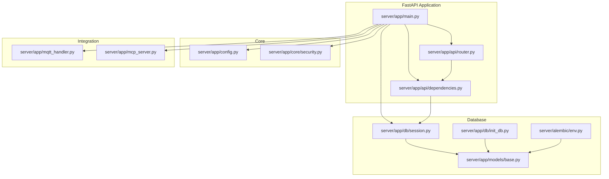
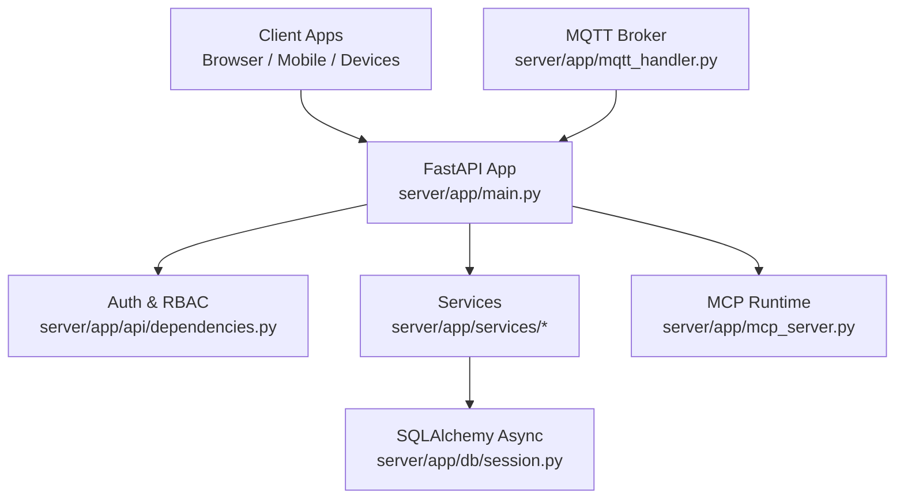
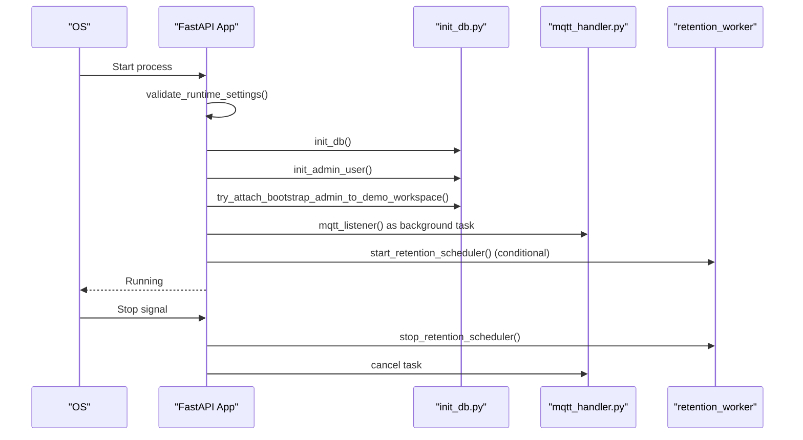
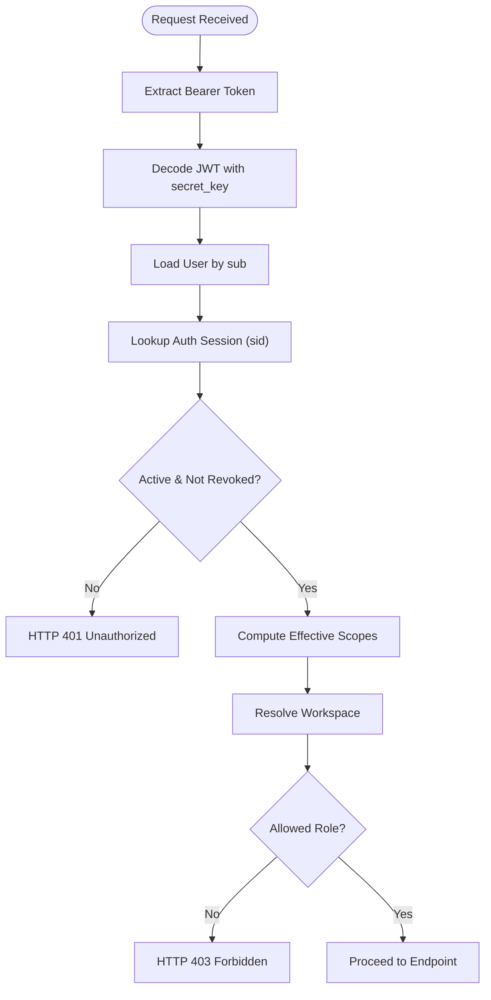
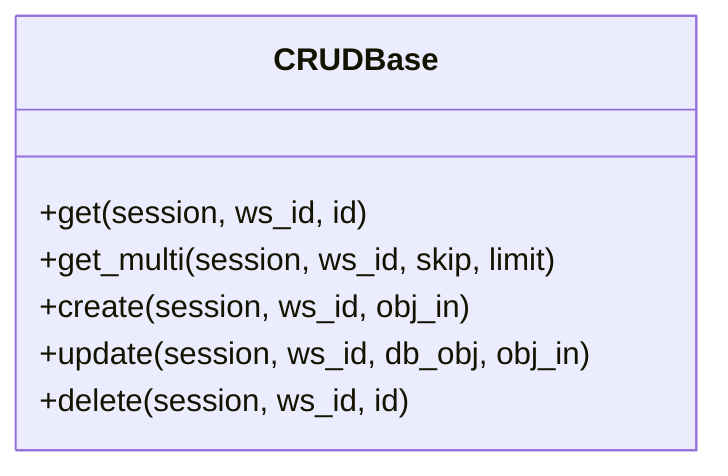
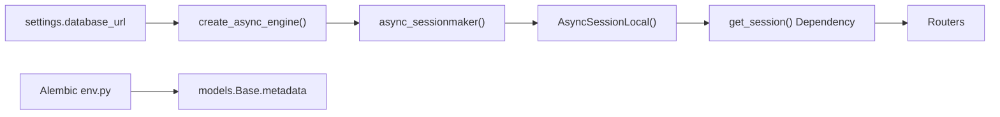
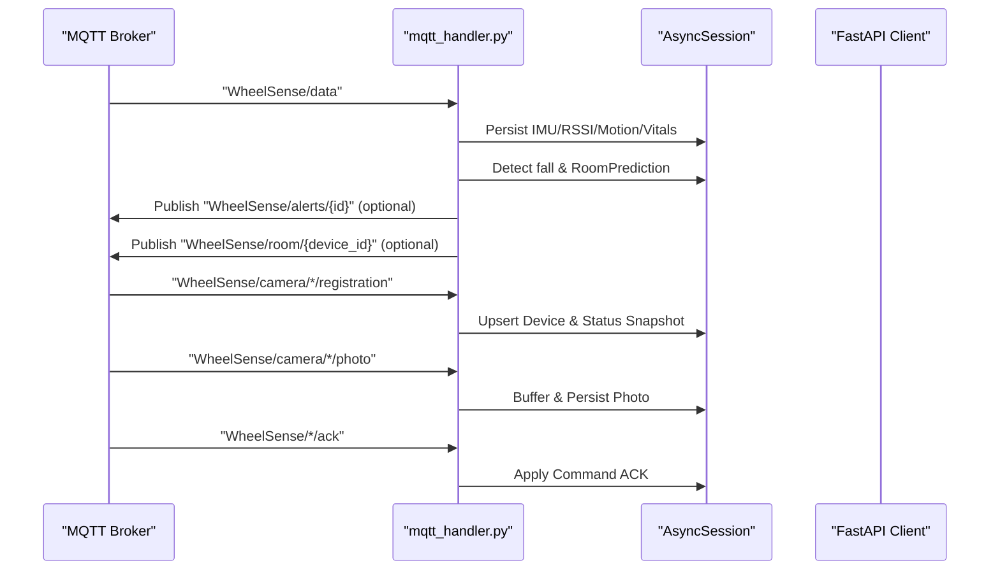
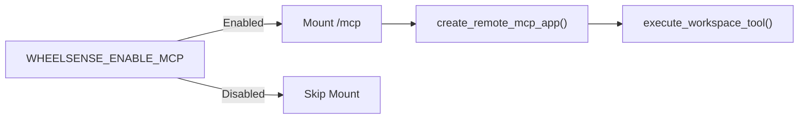
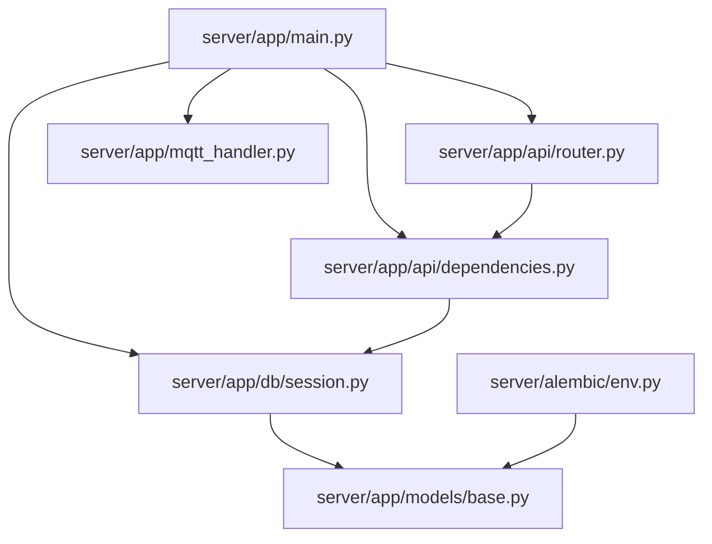

# Backend Services

<cite>
**Referenced Files in This Document**
- [main.py](file://server/app/main.py)
- [config.py](file://server/app/config.py)
- [router.py](file://server/app/api/router.py)
- [dependencies.py](file://server/app/api/dependencies.py)
- [session.py](file://server/app/db/session.py)
- [env.py](file://server/alembic/env.py)
- [init_db.py](file://server/app/db/init_db.py)
- [base.py](file://server/app/models/base.py)
- [security.py](file://server/app/core/security.py)
- [mqtt_handler.py](file://server/app/mqtt_handler.py)
- [mcp_server.py](file://server/app/mcp_server.py)
- [base_service.py](file://server/app/services/base.py)
- [core_schemas.py](file://server/app/schemas/core.py)
</cite>

## Table of Contents
1. [Introduction](#introduction)
2. [Project Structure](#project-structure)
3. [Core Components](#core-components)
4. [Architecture Overview](#architecture-overview)
5. [Detailed Component Analysis](#detailed-component-analysis)
6. [Dependency Analysis](#dependency-analysis)
7. [Performance Considerations](#performance-considerations)
8. [Troubleshooting Guide](#troubleshooting-guide)
9. [Conclusion](#conclusion)
10. [Appendices](#appendices)

## Introduction
This document describes the backend services of the WheelSense Platform, focusing on the FastAPI application structure, dependency injection, service layer architecture, database layer with SQLAlchemy and Alembic, API organization, authentication and authorization, MQTT device integration, AI agent runtime, and operational practices. It aims to be accessible to both technical and non-technical readers while providing precise references to source files.

## Project Structure
The backend is organized around a FastAPI application with modular routers, a robust dependency injection system, a service layer implementing CRUD and domain logic, an asynchronous SQLAlchemy layer, Alembic migrations, and integration points for MQTT telemetry, MCP (Model Context Protocol) runtime, and scheduled tasks.

**Diagram sources**
- [main.py:68-123](file://server/app/main.py#L68-L123)
- [router.py:16-159](file://server/app/api/router.py#L16-L159)
- [dependencies.py:25-402](file://server/app/api/dependencies.py#L25-L402)
- [config.py:12-152](file://server/app/config.py#L12-L152)
- [security.py:13-56](file://server/app/core/security.py#L13-L56)
- [session.py:18-64](file://server/app/db/session.py#L18-L64)
- [init_db.py:16-101](file://server/app/db/init_db.py#L16-L101)
- [base.py:6-11](file://server/app/models/base.py#L6-L11)
- [env.py:14-89](file://server/alembic/env.py#L14-L89)
- [mqtt_handler.py:73-137](file://server/app/mqtt_handler.py#L73-L137)
- [mcp_server.py:5-13](file://server/app/mcp_server.py#L5-L13)

**Section sources**
- [main.py:68-123](file://server/app/main.py#L68-L123)
- [router.py:16-159](file://server/app/api/router.py#L16-L159)
- [dependencies.py:25-402](file://server/app/api/dependencies.py#L25-L402)
- [config.py:12-152](file://server/app/config.py#L12-L152)
- [session.py:18-64](file://server/app/db/session.py#L18-L64)
- [env.py:14-89](file://server/alembic/env.py#L14-L89)

## Core Components
- FastAPI application entrypoint initializes logging, validates runtime settings, sets up database, starts MQTT listener, and mounts routers and optional MCP service.
- Configuration encapsulates environment-driven settings for database, MQTT, auth, AI, MCP, and retention policies.
- Dependency injection supplies database sessions, current user resolution, workspace scoping, and role-based access checks.
- Service layer provides generic CRUD utilities enforcing workspace isolation and specialized domain services for device management, vitals, analytics, and workflows.
- Database layer uses SQLAlchemy with async engines and session factories, Alembic for migrations, and a declarative base.
- MQTT handler ingests telemetry, camera frames, and device status, persists data, triggers alerts, and publishes derived topics.
- MCP server exposes remote MCP endpoints and tools when enabled.

**Section sources**
- [main.py:26-66](file://server/app/main.py#L26-L66)
- [config.py:19-94](file://server/app/config.py#L19-L94)
- [dependencies.py:25-170](file://server/app/api/dependencies.py#L25-L170)
- [base_service.py:13-90](file://server/app/services/base.py#L13-L90)
- [session.py:18-64](file://server/app/db/session.py#L18-L64)
- [mqtt_handler.py:73-325](file://server/app/mqtt_handler.py#L73-L325)
- [mcp_server.py:5-13](file://server/app/mcp_server.py#L5-L13)

## Architecture Overview
The backend follows a layered architecture:
- Presentation: FastAPI routers and endpoints under /api.
- Application: Dependency injection, auth/ RBAC, and request/response schemas.
- Service: Business logic and domain operations with workspace-scoped enforcement.
- Persistence: Async SQLAlchemy with Alembic migrations.
- Integration: MQTT ingestion and MCP runtime.

**Diagram sources**
- [main.py:68-123](file://server/app/main.py#L68-L123)
- [dependencies.py:41-170](file://server/app/api/dependencies.py#L41-L170)
- [session.py:18-64](file://server/app/db/session.py#L18-L64)
- [mqtt_handler.py:73-137](file://server/app/mqtt_handler.py#L73-L137)
- [mcp_server.py:5-13](file://server/app/mcp_server.py#L5-L13)

## Detailed Component Analysis

### FastAPI Application and Lifecycle
- Startup lifecycle initializes database, admin user, demo workspace attachment, MQTT listener, and retention scheduler based on configuration.
- Shutdown cancels MQTT task and stops retention scheduler.
- Root and health endpoints expose metadata and localization readiness.
- Optional MCP mount is controlled by an environment flag.

**Diagram sources**
- [main.py:26-66](file://server/app/main.py#L26-L66)
- [init_db.py:16-101](file://server/app/db/init_db.py#L16-L101)
- [mqtt_handler.py:73-137](file://server/app/mqtt_handler.py#L73-L137)

**Section sources**
- [main.py:26-66](file://server/app/main.py#L26-L66)
- [main.py:78-123](file://server/app/main.py#L78-L123)

### Dependency Injection and Authentication/Authorization
- Database session dependency yields an async session factory scoped to requests.
- OAuth2 password bearer scheme resolves current user from JWT claims.
- Session validation ensures active, non-revoked sessions and UTC timestamps.
- Workspace scoping and role-based access control enforce per-domain permissions.
- Token scopes are intersected with role-defined capabilities.

**Diagram sources**
- [dependencies.py:41-170](file://server/app/api/dependencies.py#L41-L170)
- [security.py:21-41](file://server/app/core/security.py#L21-L41)

**Section sources**
- [dependencies.py:25-170](file://server/app/api/dependencies.py#L25-L170)
- [security.py:13-56](file://server/app/core/security.py#L13-L56)

### Service Layer and Business Logic
- Generic CRUD base class enforces workspace isolation and supports create, read, update, delete operations.
- Services encapsulate domain logic and coordinate with repositories and models.
- Example patterns include device registration and ingestion, vitals persistence, and room prediction updates.

**Diagram sources**
- [base_service.py:13-90](file://server/app/services/base.py#L13-L90)

**Section sources**
- [base_service.py:13-90](file://server/app/services/base.py#L13-L90)

### Database Layer: SQLAlchemy, Alembic, and Sessions
- Asynchronous engine and session factory configured with pool settings for PostgreSQL; SQLite detection adjusts behavior.
- Session dependency provides request-scoped AsyncSession instances.
- Alembic environment loads models and applies migrations using the configured database URL.
- Initialization seeds admin user and attaches to demo workspace when configured.

**Diagram sources**
- [session.py:18-64](file://server/app/db/session.py#L18-L64)
- [env.py:21-31](file://server/alembic/env.py#L21-L31)
- [init_db.py:16-101](file://server/app/db/init_db.py#L16-L101)

**Section sources**
- [session.py:18-64](file://server/app/db/session.py#L18-L64)
- [env.py:21-89](file://server/alembic/env.py#L21-L89)
- [init_db.py:16-101](file://server/app/db/init_db.py#L16-L101)

### API Organization and Request/Response Schemas
- Routers are mounted under /api with prefixes for domains (workspaces, devices, rooms, telemetry, localization, motion, patients, caregivers, facilities, vitals, timeline, alerts, analytics, auth, users, homeassistant, retention, cameras, chat, ai_settings, workflow, floorplans, care, medication, service_requests, calendar, support, chat_actions, demo_control, admin_database, shift_checklist, task_management, tasks).
- Public endpoints include profile image uploads.
- Health endpoint reports service status and localization model readiness.
- Request/response schemas define training, prediction, motion labeling, and other domain-specific payloads.

```mermaid
graph TB
R["API Router<br/>server/app/api/router.py"] --> WS["/workspaces"]
R --> DEV["/devices"]
R --> ROOM["/rooms"]
R --> TEL["/telemetry"]
R --> LOC["/localization"]
R --> PAT["/patients"]
R --> CARE["/caregivers"]
R --> FAC["/facilities"]
R --> VIT["/vitals"]
R --> TIM["/timeline"]
R --> ALR["/alerts"]
R --> ANA["/analytics"]
R --> AUT["/auth"]
R --> USR["/users"]
R --> HA["/ha"]
R --> RET["/retention"]
R --> CAM["/cameras"]
R --> CHAT["/chat"]
R --> AIS["/settings/ai"]
R --> WF["/workflow"]
R --> FLP["/floorplans"]
R --> CAREDOM["/care"]
R --> MED["/medication"]
R --> SR["/services"]
R --> CAL["/calendar"]
R --> SUP["/support"]
R --> CHATA["/chat actions"]
R --> DEMO["/demo"]
R --> ADM["/admin/database"]
R --> SCH["/shift-checklist"]
R --> TM["/task-management"]
R --> TK["/tasks"]
```

**Diagram sources**
- [router.py:16-159](file://server/app/api/router.py#L16-L159)

**Section sources**
- [router.py:16-159](file://server/app/api/router.py#L16-L159)
- [core_schemas.py:6-60](file://server/app/schemas/core.py#L6-L60)

### MQTT Integration for Device Communication
- Background task subscribes to telemetry, camera, and device ACK topics.
- Telemetry ingestion persists IMU, RSSI, motion, and optional vitals; detects falls; predicts rooms; tracks transitions; publishes derived topics.
- Camera registration/status handlers manage device registry and node status snapshots.
- Photo chunks are buffered and persisted; frame topics are saved directly.

**Diagram sources**
- [mqtt_handler.py:73-325](file://server/app/mqtt_handler.py#L73-L325)

**Section sources**
- [mqtt_handler.py:73-667](file://server/app/mqtt_handler.py#L73-L667)

### AI Agent Runtime and MCP Integration
- MCP server is conditionally mounted based on environment variable.
- Remote MCP app and tool execution are exposed via compatibility wrapper.
- OAuth well-known resource endpoint advertises supported scopes and authorization servers.

**Diagram sources**
- [main.py:117-123](file://server/app/main.py#L117-L123)
- [mcp_server.py:5-13](file://server/app/mcp_server.py#L5-L13)

**Section sources**
- [main.py:117-123](file://server/app/main.py#L117-L123)
- [mcp_server.py:5-13](file://server/app/mcp_server.py#L5-L13)

### Transaction Management and Concurrency
- Async sessions are created per request and committed after write operations.
- MQTT handler uses per-message transactions to persist telemetry and device state atomically.
- Session factory manages pooling and expiration behavior.

**Section sources**
- [session.py:52-56](file://server/app/db/session.py#L52-L56)
- [mqtt_handler.py:161-277](file://server/app/mqtt_handler.py#L161-L277)

## Dependency Analysis
- Application depends on configuration, database session factory, and routers.
- Routers depend on dependency providers and services.
- Services depend on SQLAlchemy models and repositories.
- Alembic depends on models and settings for migration execution.
- MQTT handler depends on services for device management and models for persistence.

**Diagram sources**
- [main.py:68-123](file://server/app/main.py#L68-L123)
- [router.py:16-159](file://server/app/api/router.py#L16-L159)
- [dependencies.py:25-402](file://server/app/api/dependencies.py#L25-L402)
- [session.py:18-64](file://server/app/db/session.py#L18-L64)
- [base.py:6-11](file://server/app/models/base.py#L6-L11)
- [env.py:14-89](file://server/alembic/env.py#L14-L89)

**Section sources**
- [main.py:68-123](file://server/app/main.py#L68-L123)
- [router.py:16-159](file://server/app/api/router.py#L16-L159)
- [dependencies.py:25-402](file://server/app/api/dependencies.py#L25-L402)
- [session.py:18-64](file://server/app/db/session.py#L18-L64)
- [env.py:14-89](file://server/alembic/env.py#L14-L89)

## Performance Considerations
- Asynchronous database operations reduce blocking during I/O-bound requests.
- Connection pooling is configured for PostgreSQL; SQLite mode disables pooling.
- MQTT ingestion batches writes and publishes derived events asynchronously.
- Consider enabling compression for large payloads and optimizing frequent queries with indexes.
- Monitor retention scheduling overhead and adjust intervals based on data volume.

[No sources needed since this section provides general guidance]

## Troubleshooting Guide
- Authentication failures: Verify JWT decoding, session validity, and scope intersection logic.
- Database connectivity: Confirm async engine initialization and Alembic migration status.
- MQTT connectivity: Check broker host/port/credentials and subscription topics; inspect reconnection logs.
- MCP availability: Ensure environment flag allows mounting and that OAuth scopes are correctly advertised.

**Section sources**
- [dependencies.py:58-120](file://server/app/api/dependencies.py#L58-L120)
- [session.py:58-64](file://server/app/db/session.py#L58-L64)
- [mqtt_handler.py:73-137](file://server/app/mqtt_handler.py#L73-L137)
- [main.py:117-123](file://server/app/main.py#L117-L123)

## Conclusion
The WheelSense backend integrates FastAPI, async SQLAlchemy, Alembic, and MQTT to deliver a scalable IoT platform. The dependency injection and RBAC layers ensure secure, workspace-scoped operations, while the service layer organizes business logic cleanly. MQTT ingestion powers real-time telemetry and alerts, and MCP enables extensible tooling. Proper configuration, logging, and retention policies support reliable operation across environments.

[No sources needed since this section summarizes without analyzing specific files]

## Appendices

### Practical API Usage Patterns
- Login and obtain JWT via /api/auth/login; use Authorization: Bearer for protected endpoints.
- Fetch telemetry for a device within your workspace; ensure device is registered and assigned.
- Predict room occupancy using /api/localization/predict with RSSI vector.
- Manage devices and rooms under /api/devices and /api/rooms; workspace scoping applies.
- Access chat and workflow endpoints under /api/chat and /api/workflow with appropriate scopes.

[No sources needed since this section provides general guidance]