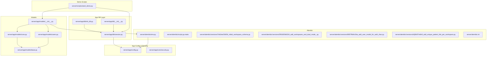
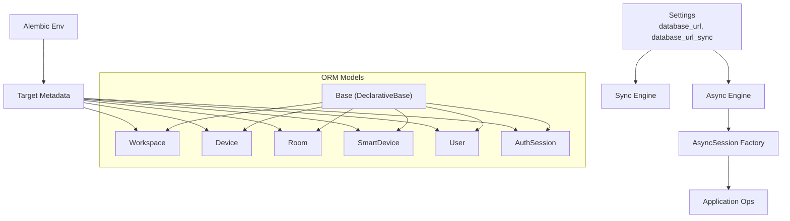
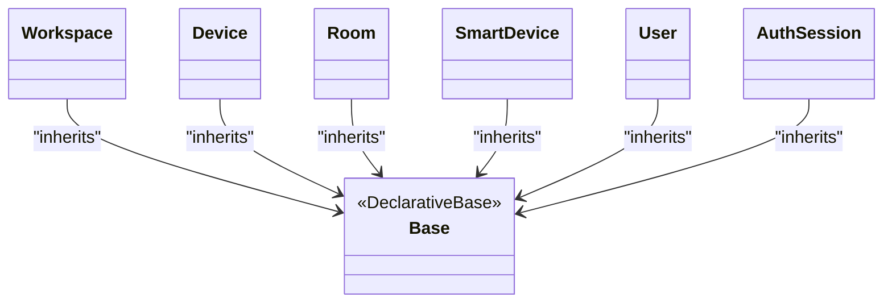
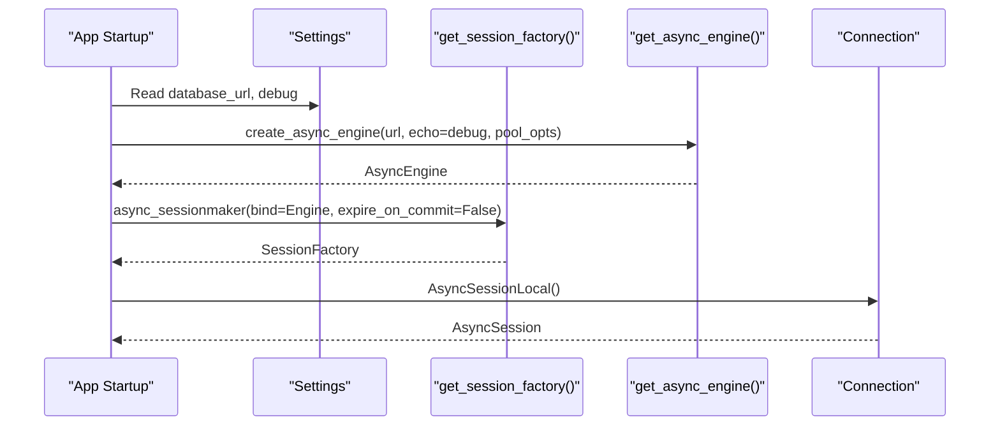
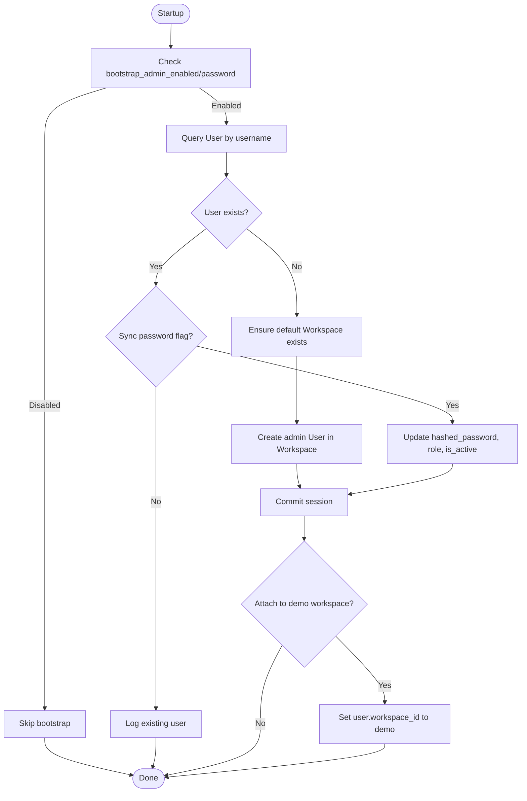
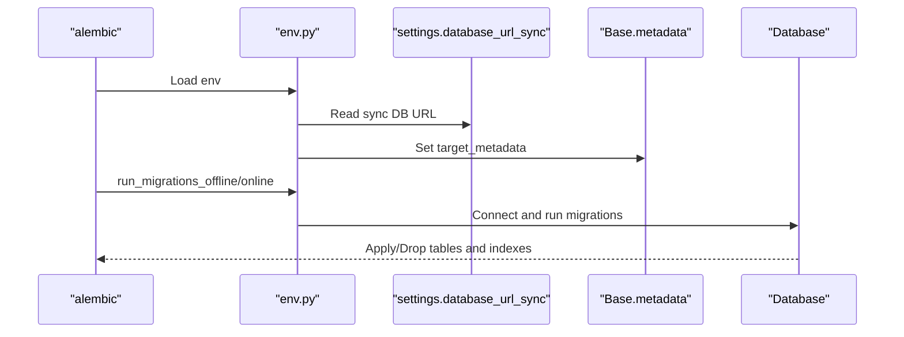
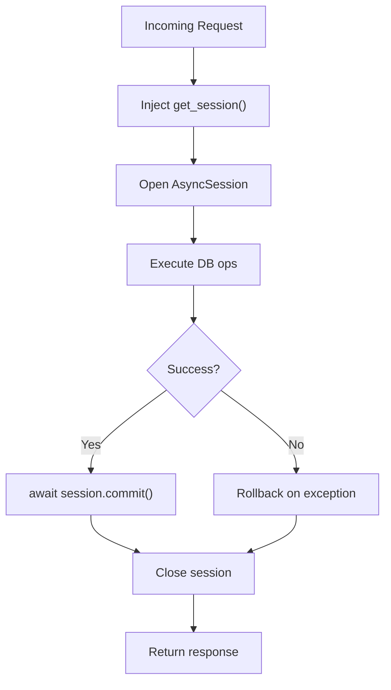
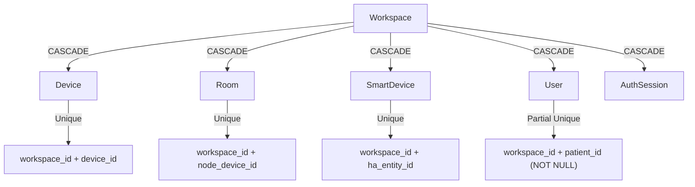
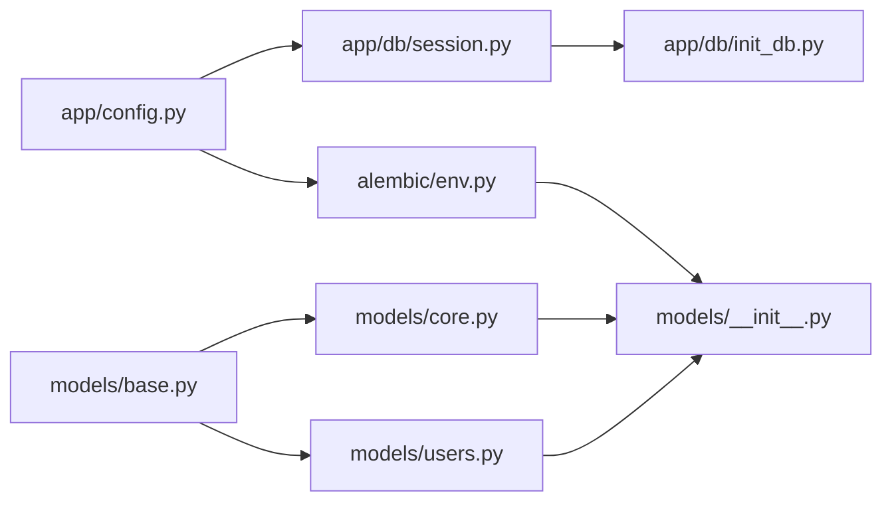

# Database Layer

<cite>
**Referenced Files in This Document**
- [session.py](file://server/app/db/session.py)
- [init_db.py](file://server/app/db/init_db.py)
- [__init__.py](file://server/app/db/__init__.py)
- [base.py](file://server/app/models/base.py)
- [core.py](file://server/app/models/core.py)
- [users.py](file://server/app/models/users.py)
- [__init__.py](file://server/app/models/__init__.py)
- [env.py](file://server/alembic/env.py)
- [script.py.mako](file://server/alembic/script.py.mako)
- [7eb2ee25df34_initial_workspace_schema.py](file://server/alembic/versions/7eb2ee25df34_initial_workspace_schema.py)
- [5f91820b6334_add_workspaces_and_dual_mode_.py](file://server/alembic/versions/5f91820b6334_add_workspaces_and_dual_mode_.py)
- [8957f9d4c3ba_add_user_model_for_auth_rbac.py](file://server/alembic/versions/8957f9d4c3ba_add_user_model_for_auth_rbac.py)
- [i4j5k6l7m8n9_add_unique_patient_link_per_workspace.py](file://server/alembic/versions/i4j5k6l7m8n9_add_unique_patient_link_per_workspace.py)
- [config.py](file://server/app/config.py)
- [security.py](file://server/app/core/security.py)
- [seed_demo.py](file://server/scripts/seed_demo.py)
- [alembic.ini](file://server/alembic.ini)
</cite>

## Table of Contents
1. [Introduction](#introduction)
2. [Project Structure](#project-structure)
3. [Core Components](#core-components)
4. [Architecture Overview](#architecture-overview)
5. [Detailed Component Analysis](#detailed-component-analysis)
6. [Dependency Analysis](#dependency-analysis)
7. [Performance Considerations](#performance-considerations)
8. [Troubleshooting Guide](#troubleshooting-guide)
9. [Conclusion](#conclusion)
10. [Appendices](#appendices)

## Introduction
This document explains the WheelSense Platform database layer built on SQLAlchemy with asynchronous sessions, Alembic migrations, and workspace-scoped models. It covers ORM setup, session and engine management, connection pooling, database initialization, admin bootstrap, demo workspace attachment, model inheritance and relationships, migration lifecycle, transaction patterns, and data integrity rules enforced by unique constraints and foreign keys.

## Project Structure
The database layer is organized into:
- Session and engine management under app/db
- SQLAlchemy declarative base and models under app/models
- Alembic configuration and migration versions under server/alembic
- Application configuration and security utilities under app/config and app/core



**Diagram sources**
- [session.py:1-64](file://server/app/db/session.py#L1-L64)
- [init_db.py:1-101](file://server/app/db/init_db.py#L1-L101)
- [__init__.py:1-20](file://server/app/db/__init__.py#L1-L20)
- [base.py:1-11](file://server/app/models/base.py#L1-L11)
- [core.py:1-124](file://server/app/models/core.py#L1-L124)
- [users.py:1-92](file://server/app/models/users.py#L1-L92)
- [__init__.py:1-136](file://server/app/models/__init__.py#L1-L136)
- [env.py:1-89](file://server/alembic/env.py#L1-L89)
- [script.py.mako:1-27](file://server/alembic/script.py.mako#L1-L27)
- [7eb2ee25df34_initial_workspace_schema.py:1-176](file://server/alembic/versions/7eb2ee25df34_initial_workspace_schema.py#L1-L176)
- [5f91820b6334_add_workspaces_and_dual_mode_.py:1-29](file://server/alembic/versions/5f91820b6334_add_workspaces_and_dual_mode_.py#L1-L29)
- [8957f9d4c3ba_add_user_model_for_auth_rbac.py:1-50](file://server/alembic/versions/8957f9d4c3ba_add_user_model_for_auth_rbac.py#L1-L50)
- [i4j5k6l7m8n9_add_unique_patient_link_per_workspace.py:1-35](file://server/alembic/versions/i4j5k6l7m8n9_add_unique_patient_link_per_workspace.py#L1-L35)
- [config.py:1-152](file://server/app/config.py#L1-L152)
- [security.py:1-56](file://server/app/core/security.py#L1-L56)
- [seed_demo.py:1-1549](file://server/scripts/seed_demo.py#L1-L1549)
- [alembic.ini:1-117](file://server/alembic.ini#L1-L117)

**Section sources**
- [session.py:1-64](file://server/app/db/session.py#L1-L64)
- [init_db.py:1-101](file://server/app/db/init_db.py#L1-L101)
- [__init__.py:1-20](file://server/app/db/__init__.py#L1-L20)
- [base.py:1-11](file://server/app/models/base.py#L1-L11)
- [core.py:1-124](file://server/app/models/core.py#L1-L124)
- [users.py:1-92](file://server/app/models/users.py#L1-L92)
- [__init__.py:1-136](file://server/app/models/__init__.py#L1-L136)
- [env.py:1-89](file://server/alembic/env.py#L1-L89)
- [script.py.mako:1-27](file://server/alembic/script.py.mako#L1-L27)
- [7eb2ee25df34_initial_workspace_schema.py:1-176](file://server/alembic/versions/7eb2ee25df34_initial_workspace_schema.py#L1-L176)
- [5f91820b6334_add_workspaces_and_dual_mode_.py:1-29](file://server/alembic/versions/5f91820b6334_add_workspaces_and_dual_mode_.py#L1-L29)
- [8957f9d4c3ba_add_user_model_for_auth_rbac.py:1-50](file://server/alembic/versions/8957f9d4c3ba_add_user_model_for_auth_rbac.py#L1-L50)
- [i4j5k6l7m8n9_add_unique_patient_link_per_workspace.py:1-35](file://server/alembic/versions/i4j5k6l7m8n9_add_unique_patient_link_per_workspace.py#L1-L35)
- [config.py:1-152](file://server/app/config.py#L1-L152)
- [security.py:1-56](file://server/app/core/security.py#L1-L56)
- [seed_demo.py:1-1549](file://server/scripts/seed_demo.py#L1-L1549)
- [alembic.ini:1-117](file://server/alembic.ini#L1-L117)

## Core Components
- Declarative base and UTC timestamp utility define the ORM foundation.
- Workspace-scoped models enforce isolation and uniqueness per workspace.
- Async session factory and engine with connection pooling for PostgreSQL.
- Alembic environment dynamically loads metadata and applies migrations offline/online.
- Bootstrap admin initialization and demo workspace attachment utilities.

**Section sources**
- [base.py:1-11](file://server/app/models/base.py#L1-L11)
- [core.py:1-124](file://server/app/models/core.py#L1-L124)
- [users.py:1-92](file://server/app/models/users.py#L1-L92)
- [session.py:1-64](file://server/app/db/session.py#L1-L64)
- [env.py:1-89](file://server/alembic/env.py#L1-L89)
- [init_db.py:1-101](file://server/app/db/init_db.py#L1-L101)

## Architecture Overview
The database layer follows a clean separation:
- Declarative models inherit from a shared Base class.
- Workspace is the top-level scoping entity for most domain tables.
- Users and related RBAC/auth tables are scoped to a workspace.
- Alembic manages schema evolution independently of FastAPI/Falcon.
- Sessions are created via an async session factory and injected into endpoints.



**Diagram sources**
- [config.py:19-22](file://server/app/config.py#L19-L22)
- [session.py:18-44](file://server/app/db/session.py#L18-L44)
- [base.py:6-11](file://server/app/models/base.py#L6-L11)
- [core.py:18-124](file://server/app/models/core.py#L18-L124)
- [users.py:9-92](file://server/app/models/users.py#L9-L92)
- [env.py:14-31](file://server/alembic/env.py#L14-L31)

## Detailed Component Analysis

### SQLAlchemy ORM Setup and Base Classes
- A lightweight DeclarativeBase subclass centralizes model definition.
- A UTC timestamp helper ensures consistent timezone-aware timestamps across models.



**Diagram sources**
- [base.py:6-11](file://server/app/models/base.py#L6-L11)
- [core.py:18-124](file://server/app/models/core.py#L18-L124)
- [users.py:9-92](file://server/app/models/users.py#L9-L92)

**Section sources**
- [base.py:1-11](file://server/app/models/base.py#L1-L11)
- [core.py:1-124](file://server/app/models/core.py#L1-L124)
- [users.py:1-92](file://server/app/models/users.py#L1-L92)

### Session Management and Connection Pooling
- Async engine is lazily created from settings.database_url with echo controlled by debug.
- Non-PostgreSQL databases (e.g., SQLite) skip pool_size/max_overflow to avoid compatibility issues.
- Async session factory is created once and reused; expire_on_commit is disabled for performance.
- Sync engine is created from settings.database_url_sync for Alembic operations.
- get_session yields a scoped async session for FastAPI dependency injection.



**Diagram sources**
- [session.py:18-56](file://server/app/db/session.py#L18-L56)
- [config.py:20-21](file://server/app/config.py#L20-L21)

**Section sources**
- [session.py:1-64](file://server/app/db/session.py#L1-L64)
- [config.py:1-152](file://server/app/config.py#L1-L152)

### Database Initialization and Admin Bootstrap
- On startup, a connectivity check executes a simple SELECT against the async engine.
- Admin bootstrap:
  - Creates an admin user if not present and configured.
  - Optionally syncs the admin password from environment.
  - Ensures a default System Workspace exists if none is present.
- Demo workspace attachment:
  - If a demo workspace exists (seeded by scripts/seed_demo.py), moves the bootstrap admin into that workspace for visibility.



**Diagram sources**
- [init_db.py:16-100](file://server/app/db/init_db.py#L16-L100)
- [config.py:52-62](file://server/app/config.py#L52-L62)
- [security.py:52-56](file://server/app/core/security.py#L52-L56)

**Section sources**
- [init_db.py:1-101](file://server/app/db/init_db.py#L1-L101)
- [config.py:1-152](file://server/app/config.py#L1-L152)
- [security.py:1-56](file://server/app/core/security.py#L1-L56)

### Model Inheritance Patterns and Relationships
- Workspace-scoped entities:
  - Device, Room, SmartDevice, DeviceActivityEvent, DeviceCommandDispatch are scoped by workspace_id with CASCADE deletes.
  - Unique constraints enforce workspace-scoped uniqueness for device_id, room node_device_id, and smart device HA entity id.
- Users:
  - Scoped to Workspace via workspace_id.
  - Unique constraint enforces a single patient link per workspace (when patient_id is not null).
  - Optional links to CareGiver and Patient.
- AuthSession:
  - Tracks user sessions scoped to workspace with indexes for efficient queries.

```mermaid
erDiagram
WORKSPACE {
int id PK
string name
string mode
boolean is_active
timestamptz created_at
}
DEVICE {
int id PK
int workspace_id FK
string device_id
string device_type
string hardware_type
string display_name
string ip_address
string firmware
timestamptz last_seen
json/jsonb config
}
ROOM {
int id PK
int workspace_id FK
int floor_id FK
string name
text description
string node_device_id
string room_type
json/jsonb adjacent_rooms
json/jsonb config
timestamptz created_at
}
SMARTDEVICE {
int id PK
int workspace_id FK
int room_id FK
string name
string ha_entity_id
string device_type
boolean is_active
string state
json/jsonb config
timestamptz created_at
}
USER {
int id PK
int workspace_id FK
string username
string hashed_password
string role
boolean is_active
int caregiver_id FK
int patient_id FK
string ai_provider
string ai_model
string profile_image_url
timestamptz created_at
timestamptz updated_at
}
AUTHSESSION {
string id PK
int workspace_id FK
int user_id FK
int impersonated_by_user_id FK
string user_agent
string ip_address
timestamptz created_at
timestamptz updated_at
timestamptz last_seen_at
timestamptz expires_at
timestamptz revoked_at
}
WORKSPACE ||--o{ DEVICE : "has"
WORKSPACE ||--o{ ROOM : "has"
WORKSPACE ||--o{ SMARTDEVICE : "has"
WORKSPACE ||--o{ USER : "has"
WORKSPACE ||--o{ AUTHSESSION : "has"
ROOM ||--o{ SMARTDEVICE : "hosts"
```

**Diagram sources**
- [core.py:18-124](file://server/app/models/core.py#L18-L124)
- [users.py:9-92](file://server/app/models/users.py#L9-L92)

**Section sources**
- [core.py:1-124](file://server/app/models/core.py#L1-L124)
- [users.py:1-92](file://server/app/models/users.py#L1-L92)

### Alembic Migration System and Schema Evolution
- Alembic env.py:
  - Adds server root to sys.path to import app modules.
  - Loads target_metadata from app.models.Base.metadata.
  - Sets sqlalchemy.url from settings.database_url_sync for offline/online runs.
- Migration templates:
  - script.py.mako provides a reusable template for revision scripts.
- Example migrations:
  - Initial workspace schema with core tables and indices.
  - Workspaces and dual-mode placeholder.
  - User model for auth/RBAC with indexes.
  - Unique patient link per workspace enforcement via a partial unique index.



**Diagram sources**
- [env.py:11-89](file://server/alembic/env.py#L11-L89)
- [script.py.mako:1-27](file://server/alembic/script.py.mako#L1-L27)
- [7eb2ee25df34_initial_workspace_schema.py:21-176](file://server/alembic/versions/7eb2ee25df34_initial_workspace_schema.py#L21-L176)
- [5f91820b6334_add_workspaces_and_dual_mode_.py:19-29](file://server/alembic/versions/5f91820b6334_add_workspaces_and_dual_mode_.py#L19-L29)
- [8957f9d4c3ba_add_user_model_for_auth_rbac.py:21-50](file://server/alembic/versions/8957f9d4c3ba_add_user_model_for_auth_rbac.py#L21-L50)
- [i4j5k6l7m8n9_add_unique_patient_link_per_workspace.py:19-35](file://server/alembic/versions/i4j5k6l7m8n9_add_unique_patient_link_per_workspace.py#L19-L35)

**Section sources**
- [env.py:1-89](file://server/alembic/env.py#L1-L89)
- [script.py.mako:1-27](file://server/alembic/script.py.mako#L1-L27)
- [7eb2ee25df34_initial_workspace_schema.py:1-176](file://server/alembic/versions/7eb2ee25df34_initial_workspace_schema.py#L1-L176)
- [5f91820b6334_add_workspaces_and_dual_mode_.py:1-29](file://server/alembic/versions/5f91820b6334_add_workspaces_and_dual_mode_.py#L1-L29)
- [8957f9d4c3ba_add_user_model_for_auth_rbac.py:1-50](file://server/alembic/versions/8957f9d4c3ba_add_user_model_for_auth_rbac.py#L1-L50)
- [i4j5k6l7m8n9_add_unique_patient_link_per_workspace.py:1-35](file://server/alembic/versions/i4j5k6l7m8n9_add_unique_patient_link_per_workspace.py#L1-L35)
- [alembic.ini:1-117](file://server/alembic.ini#L1-L117)

### Transaction Management, Session Lifecycle, and Error Handling
- Session lifecycle:
  - get_session() is a FastAPI dependency that opens and closes an AsyncSession per request.
  - AsyncSessionLocal() returns a fresh session from the factory.
- Transactions:
  - Use async with get_session_factory()() as session for request-scoped transactions.
  - Commit on success; exceptions propagate to callers for centralized error handling.
- Error handling:
  - Connectivity check on startup uses a simple SELECT to verify DB availability.
  - Password hashing and verification use bcrypt utilities.
  - Bootstrap admin skips creation if environment variables are missing or disabled.



**Diagram sources**
- [session.py:52-56](file://server/app/db/session.py#L52-L56)
- [init_db.py:28-65](file://server/app/db/init_db.py#L28-L65)
- [security.py:43-56](file://server/app/core/security.py#L43-L56)

**Section sources**
- [session.py:1-64](file://server/app/db/session.py#L1-L64)
- [init_db.py:1-101](file://server/app/db/init_db.py#L1-L101)
- [security.py:1-56](file://server/app/core/security.py#L1-L56)

### Dual-Mode Workspace Scoping and Data Integrity Rules
- Workspace mode supports “real” and “simulation” modes to differentiate environments.
- Unique constraints:
  - Devices: workspace_id + device_id must be unique.
  - Rooms: workspace_id + node_device_id must be unique.
  - SmartDevices: workspace_id + ha_entity_id must be unique.
  - Users: workspace_id + patient_id is unique when patient_id is not null.
- Cascade semantics:
  - Deleting a Workspace cascades to child entities to maintain referential integrity.



**Diagram sources**
- [core.py:29-31](file://server/app/models/core.py#L29-L31)
- [core.py:89-91](file://server/app/models/core.py#L89-L91)
- [core.py:107-109](file://server/app/models/core.py#L107-L109)
- [users.py:13-22](file://server/app/models/users.py#L13-L22)

**Section sources**
- [core.py:1-124](file://server/app/models/core.py#L1-L124)
- [users.py:1-92](file://server/app/models/users.py#L1-L92)

### Practical Examples
- Model definition pattern:
  - Define a table class inheriting from Base, declare columns and constraints, and optionally add indexes or unique constraints.
  - Reference [core.py:18-124](file://server/app/models/core.py#L18-L124) and [users.py:9-92](file://server/app/models/users.py#L9-L92).
- Creating a migration:
  - Use Alembic CLI to generate a revision from script.py.mako template.
  - Reference [alembic.ini:1-117](file://server/alembic.ini#L1-L117) and [script.py.mako:1-27](file://server/alembic/script.py.mako#L1-L27).
- Running migrations:
  - Alembic env.py dynamically loads metadata and applies migrations offline/online.
  - Reference [env.py:63-89](file://server/alembic/env.py#L63-L89).
- Database operations pattern:
  - Acquire session via get_session() dependency, perform CRUD, commit, and handle exceptions.
  - Reference [session.py:52-56](file://server/app/db/session.py#L52-L56).
- Demo workspace seeding:
  - scripts/seed_demo.py creates a demo workspace and role-ready data; it uses AsyncSession and model classes.
  - Reference [seed_demo.py:201-218](file://server/scripts/seed_demo.py#L201-L218).

**Section sources**
- [core.py:1-124](file://server/app/models/core.py#L1-L124)
- [users.py:1-92](file://server/app/models/users.py#L1-L92)
- [alembic.ini:1-117](file://server/alembic.ini#L1-L117)
- [script.py.mako:1-27](file://server/alembic/script.py.mako#L1-L27)
- [env.py:63-89](file://server/alembic/env.py#L63-L89)
- [session.py:52-56](file://server/app/db/session.py#L52-L56)
- [seed_demo.py:201-218](file://server/scripts/seed_demo.py#L201-L218)

## Dependency Analysis
- The session module depends on configuration for database URLs and debug toggles.
- Alembic env.py depends on app.models.Base.metadata and settings.database_url_sync.
- Models depend on the shared Base class and utcnow utility.
- Bootstrap admin logic depends on settings, security utilities, and model classes.



**Diagram sources**
- [config.py:19-22](file://server/app/config.py#L19-L22)
- [session.py:1-64](file://server/app/db/session.py#L1-L64)
- [env.py:14-31](file://server/alembic/env.py#L14-L31)
- [base.py:6-11](file://server/app/models/base.py#L6-L11)
- [core.py:1-124](file://server/app/models/core.py#L1-L124)
- [users.py:1-92](file://server/app/models/users.py#L1-L92)
- [__init__.py:1-136](file://server/app/models/__init__.py#L1-L136)
- [init_db.py:1-101](file://server/app/db/init_db.py#L1-L101)

**Section sources**
- [config.py:1-152](file://server/app/config.py#L1-L152)
- [session.py:1-64](file://server/app/db/session.py#L1-L64)
- [env.py:1-89](file://server/alembic/env.py#L1-L89)
- [base.py:1-11](file://server/app/models/base.py#L1-L11)
- [core.py:1-124](file://server/app/models/core.py#L1-L124)
- [users.py:1-92](file://server/app/models/users.py#L1-L92)
- [__init__.py:1-136](file://server/app/models/__init__.py#L1-L136)
- [init_db.py:1-101](file://server/app/db/init_db.py#L1-L101)

## Performance Considerations
- Connection pooling:
  - Async engine uses pool_size and max_overflow for non-SQLite databases to improve concurrency.
  - For SQLite, pooling parameters are omitted to avoid compatibility issues.
- Session behavior:
  - expire_on_commit=False reduces overhead by avoiding object expiration checks.
- Indexes and constraints:
  - Strategic indexes on workspace_id and frequently filtered columns improve query performance.
  - Unique constraints prevent data anomalies at the database level.

[No sources needed since this section provides general guidance]

## Troubleshooting Guide
- Database connectivity:
  - Startup connectivity check uses a simple SELECT; failures indicate URL or network issues.
- Admin bootstrap:
  - If BOOTSTRAP_ADMIN_PASSWORD is empty or bootstrap is disabled, admin creation is skipped.
  - If attaching to demo workspace fails, ensure the demo workspace exists and the admin user is present.
- Password hashing:
  - Verify bcrypt availability and correct hashing/verification paths.
- Alembic:
  - Ensure settings.database_url_sync is correct and env.py can import app.models.Base.metadata.

**Section sources**
- [session.py:58-64](file://server/app/db/session.py#L58-L64)
- [init_db.py:16-100](file://server/app/db/init_db.py#L16-L100)
- [security.py:43-56](file://server/app/core/security.py#L43-L56)
- [env.py:21-31](file://server/alembic/env.py#L21-L31)

## Conclusion
The WheelSense database layer leverages SQLAlchemy’s async ORM with a robust workspace-scoped design, strict unique constraints, and Alembic-driven migrations. Session management is streamlined via a lazy-initialized async engine and a reusable session factory. The bootstrap admin and demo workspace attachment utilities simplify local development and testing. Together, these components provide a scalable, maintainable, and integrity-focused persistence layer.

[No sources needed since this section summarizes without analyzing specific files]

## Appendices

### Appendix A: Key Configuration Options
- Database URLs:
  - database_url: Async database URL for application sessions.
  - database_url_sync: Sync database URL for Alembic.
- Bootstrap admin:
  - bootstrap_admin_enabled, bootstrap_admin_username, bootstrap_admin_password, bootstrap_admin_sync_password, bootstrap_demo_workspace_name, bootstrap_admin_attach_demo_workspace.

**Section sources**
- [config.py:19-62](file://server/app/config.py#L19-L62)