# FastAPI Application

<cite>
**Referenced Files in This Document**
- [main.py](file://server/app/main.py)
- [config.py](file://server/app/config.py)
- [router.py](file://server/app/api/router.py)
- [errors.py](file://server/app/api/errors.py)
- [security.py](file://server/app/core/security.py)
- [session.py](file://server/app/db/session.py)
- [mqtt_handler.py](file://server/app/mqtt_handler.py)
- [mcp_server.py](file://server/app/mcp_server.py)
- [auth.py](file://server/app/mcp/auth.py)
- [retention_worker.py](file://server/app/workers/retention_worker.py)
- [taskiq_app.py](file://server/app/workers/taskiq_app.py)
- [dependencies.py](file://server/app/api/dependencies.py)
- [pyproject.toml](file://server/pyproject.toml)
- [requirements.txt](file://server/requirements.txt)
</cite>

## Table of Contents
1. [Introduction](#introduction)
2. [Project Structure](#project-structure)
3. [Core Components](#core-components)
4. [Architecture Overview](#architecture-overview)
5. [Detailed Component Analysis](#detailed-component-analysis)
6. [Dependency Analysis](#dependency-analysis)
7. [Performance Considerations](#performance-considerations)
8. [Troubleshooting Guide](#troubleshooting-guide)
9. [Conclusion](#conclusion)
10. [Appendices](#appendices)

## Introduction
This document describes the FastAPI application powering the WheelSense Platform. It covers the application entry point, configuration management, startup/shutdown lifecycle, dependency injection, error handling, middleware setup, router organization, endpoint registration, request/response flow, lifespan manager for database initialization, MQTT task management, and worker scheduler setup. It also documents configuration validation, environment variable handling, runtime settings, OAuth-protected resource endpoint for MCP integration, and conditional mounting strategies. Practical examples of initialization, error handling patterns, and configuration best practices are included.

## Project Structure
The FastAPI application resides under server/app and is composed of:
- Application entry point and lifecycle management
- Configuration and runtime validation
- API router and endpoint grouping
- Error handling and standardized envelopes
- Security utilities and dependency injection
- Database session factory and initialization
- MQTT ingestion and device/event handling
- MCP server integration and middleware
- Worker scheduler for data retention
- Optional Taskiq-based task infrastructure

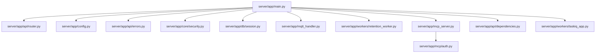

**Diagram sources**
- [main.py:68-76](file://server/app/main.py#L68-L76)
- [router.py:16-158](file://server/app/api/router.py#L16-L158)
- [config.py:12-151](file://server/app/config.py#L12-L151)
- [errors.py:50-76](file://server/app/api/errors.py#L50-L76)
- [security.py:13-56](file://server/app/core/security.py#L13-L56)
- [session.py:18-64](file://server/app/db/session.py#L18-L64)
- [mqtt_handler.py:73-137](file://server/app/mqtt_handler.py#L73-L137)
- [retention_worker.py:55-87](file://server/app/workers/retention_worker.py#L55-L87)
- [mcp_server.py:5-12](file://server/app/mcp_server.py#L5-L12)
- [auth.py:16-157](file://server/app/mcp/auth.py#L16-L157)
- [dependencies.py:25-120](file://server/app/api/dependencies.py#L25-L120)
- [taskiq_app.py:11-28](file://server/app/workers/taskiq_app.py#L11-L28)

**Section sources**
- [main.py:1-123](file://server/app/main.py#L1-L123)
- [router.py:1-159](file://server/app/api/router.py#L1-L159)
- [config.py:1-152](file://server/app/config.py#L1-L152)

## Core Components
- Application entry point and lifespan: initializes database, starts MQTT listener, conditionally starts retention scheduler, and shuts down resources cleanly.
- Configuration: strongly typed settings with environment variable loading and normalization helpers.
- Router: organizes endpoints by domain and applies per-route dependency injection for active user enforcement.
- Error handling: standardized error envelope and exception handlers for validation and HTTP exceptions.
- Security: runtime settings validation, JWT creation/verification, and OAuth2 bearer extraction.
- Database: async SQLAlchemy engine/session factory with lazy initialization and dependency provider.
- MQTT handler: continuous listener with topic routing, ingestion, and device/status updates.
- Workers: retention scheduler using APScheduler; optional Taskiq integration.
- MCP integration: middleware enforcing origin checks and token validation for MCP endpoints.

**Section sources**
- [main.py:26-76](file://server/app/main.py#L26-L76)
- [config.py:12-151](file://server/app/config.py#L12-L151)
- [router.py:16-158](file://server/app/api/router.py#L16-L158)
- [errors.py:14-76](file://server/app/api/errors.py#L14-L76)
- [security.py:13-56](file://server/app/core/security.py#L13-L56)
- [session.py:18-64](file://server/app/db/session.py#L18-L64)
- [mqtt_handler.py:73-137](file://server/app/mqtt_handler.py#L73-L137)
- [retention_worker.py:25-87](file://server/app/workers/retention_worker.py#L25-L87)
- [taskiq_app.py:11-28](file://server/app/workers/taskiq_app.py#L11-L28)
- [mcp_server.py:5-12](file://server/app/mcp_server.py#L5-L12)
- [auth.py:16-157](file://server/app/mcp/auth.py#L16-L157)
- [dependencies.py:25-120](file://server/app/api/dependencies.py#L25-L120)

## Architecture Overview
The application follows a layered architecture:
- Entry point defines FastAPI app, lifespan, and conditional mounting.
- Router composes domain-specific routers and enforces authentication via dependency injection.
- Services and models encapsulate business logic and persistence.
- Asynchronous workers run scheduled tasks independently of request handling.
- MCP integration is mounted conditionally and protected by middleware.

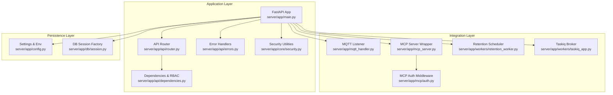

**Diagram sources**
- [main.py:68-123](file://server/app/main.py#L68-L123)
- [router.py:16-158](file://server/app/api/router.py#L16-L158)
- [errors.py:50-76](file://server/app/api/errors.py#L50-L76)
- [security.py:13-56](file://server/app/core/security.py#L13-L56)
- [dependencies.py:25-120](file://server/app/api/dependencies.py#L25-L120)
- [mqtt_handler.py:73-137](file://server/app/mqtt_handler.py#L73-L137)
- [mcp_server.py:5-12](file://server/app/mcp_server.py#L5-L12)
- [auth.py:16-157](file://server/app/mcp/auth.py#L16-L157)
- [retention_worker.py:55-87](file://server/app/workers/retention_worker.py#L55-L87)
- [taskiq_app.py:11-28](file://server/app/workers/taskiq_app.py#L11-L28)
- [config.py:12-151](file://server/app/config.py#L12-L151)
- [session.py:18-64](file://server/app/db/session.py#L18-L64)

## Detailed Component Analysis

### Application Entry Point and Lifespan
- Defines FastAPI app with metadata and registers error handlers and router.
- Implements lifespan manager to initialize database, create admin user, attach demo workspace if configured, start MQTT listener, and conditionally start retention scheduler.
- On shutdown, cancels MQTT task and stops retention scheduler.
- Conditionally mounts MCP app when enabled via environment variable.

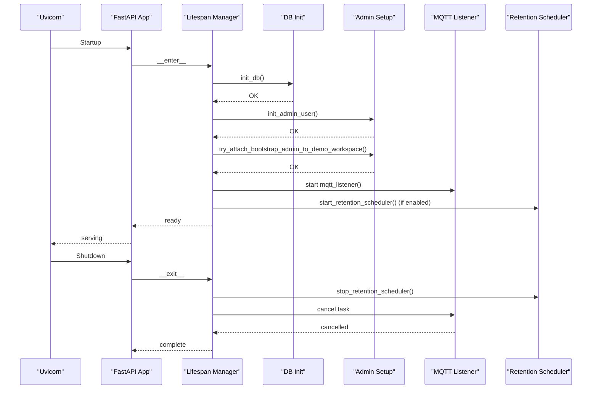

**Diagram sources**
- [main.py:26-76](file://server/app/main.py#L26-L76)
- [retention_worker.py:55-87](file://server/app/workers/retention_worker.py#L55-L87)
- [mqtt_handler.py:73-137](file://server/app/mqtt_handler.py#L73-L137)

**Section sources**
- [main.py:26-76](file://server/app/main.py#L26-L76)

### Configuration Management and Validation
- Strongly typed settings loaded from .env with Pydantic settings.
- Normalizes debug and environment mode values.
- Provides computed properties for MCP allowed origins and Ollama API origin.
- Validates runtime settings to prevent insecure startup outside debug/local contexts.

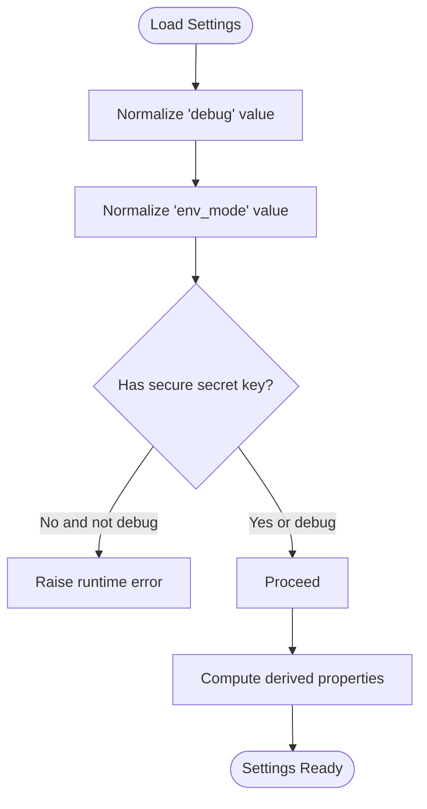

**Diagram sources**
- [config.py:119-150](file://server/app/config.py#L119-L150)
- [security.py:13-19](file://server/app/core/security.py#L13-L19)

**Section sources**
- [config.py:12-151](file://server/app/config.py#L12-L151)
- [security.py:13-19](file://server/app/core/security.py#L13-L19)

### Router Organization and Endpoint Registration
- APIRouter is prefixed with /api and includes routers for domains such as workspaces, devices, rooms, telemetry, localization, motion, patients, caregivers, facilities, vitals, timeline, alerts, analytics, auth, users, homeassistant, retention, cameras, chat, ai_settings, workflow, floorplans, care, medication, service_requests, calendar, support, chat_actions, demo_control, admin_database, shift_checklist, task_management, and tasks.
- Public profile images are exposed under /api/public/profile-images.
- Health endpoint checks localization model readiness.
- MCP OAuth endpoints are grouped under /api/mcp.

```mermaid
graph TB
R["APIRouter '/api'"] --> WS["Workspaces"]
R --> DV["Devices"]
R --> RM["Rooms"]
R --> TL["Telemetry"]
R --> LC["Localization"]
R --> MT["Motion"]
R --> PT["Patients"]
R --> CG["Caregivers"]
R --> FC["Facilities"]
R --> VT["Vitals"]
R --> TM["Timeline"]
R --> AL["Alerts"]
R --> AN["Analytics"]
R --> AU["Auth"]
R --> US["Users"]
R --> HA["HomeAssistant"]
R --> RN["Retention"]
R --> CM["Cameras"]
R --> CJ["Chat"]
R --> AS["AI Settings"]
R --> WF["Workflow"]
R --> FP["Floorplans"]
R --> CR["Care"]
R --> MD["Medication"]
R --> SR["Service Requests"]
R --> CL["Calendar"]
R --> SP["Support"]
R --> CA["Chat Actions"]
R --> DM["Demo Control"]
R --> AD["Admin Database"]
R --> SC["Shift Checklist"]
R --> TM2["Task Management"]
R --> TS["Tasks"]
R --> MCPO["MCP OAuth '/api/mcp'"]
R --> PH["Health '/api/health'"]
R --> PI["Public Images '/api/public/profile-images'"]
```

**Diagram sources**
- [router.py:16-158](file://server/app/api/router.py#L16-L158)

**Section sources**
- [router.py:16-158](file://server/app/api/router.py#L16-L158)

### Dependency Injection and Authentication Flow
- Global dependency on active user is applied to most routes via Depends(get_current_active_user).
- OAuth2PasswordBearer extracts Bearer tokens from Authorization headers.
- Token decoding validates issuer/sub/role/session claims and verifies active sessions.
- Scope resolution enforces role-based capabilities and MCP token scopes when applicable.
- Impersonation and actor context are supported for administrative actions.

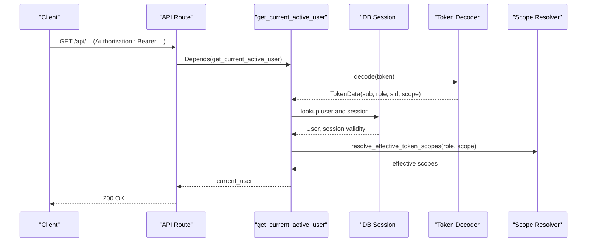

**Diagram sources**
- [dependencies.py:41-120](file://server/app/api/dependencies.py#L41-L120)

**Section sources**
- [dependencies.py:25-120](file://server/app/api/dependencies.py#L25-L120)

### Error Handling Mechanisms
- Standardized error envelope with machine-readable code and human-readable message.
- Validation error handler converts Pydantic validation errors into a consistent JSON response.
- HTTP exception handler normalizes both string and structured details into the standardized envelope.
- All handlers return JSONResponse with appropriate status codes and headers.

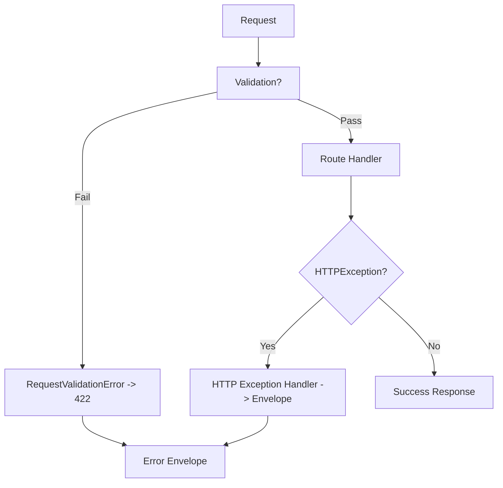

**Diagram sources**
- [errors.py:50-76](file://server/app/api/errors.py#L50-L76)

**Section sources**
- [errors.py:14-76](file://server/app/api/errors.py#L14-L76)

### Middleware Setup for MCP Integration
- MCP auth middleware enforces allowed origins and requires Origin header when configured.
- Extracts Bearer token and validates JWT; supports MCP-specific tokens with revocation and expiration checks.
- Resolves effective scopes from either MCP token or session scopes and injects actor context.

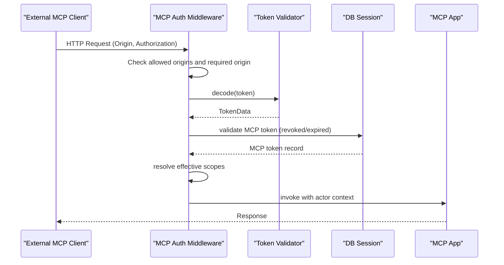

**Diagram sources**
- [auth.py:16-157](file://server/app/mcp/auth.py#L16-L157)

**Section sources**
- [auth.py:16-157](file://server/app/mcp/auth.py#L16-L157)

### Request/Response Flow Through the API
- Root endpoint returns application metadata and links to docs, health, and MCP when enabled.
- OAuth-protected resource endpoint exposes MCP metadata for external clients.
- All authenticated endpoints depend on active user and enforce role/scopes.

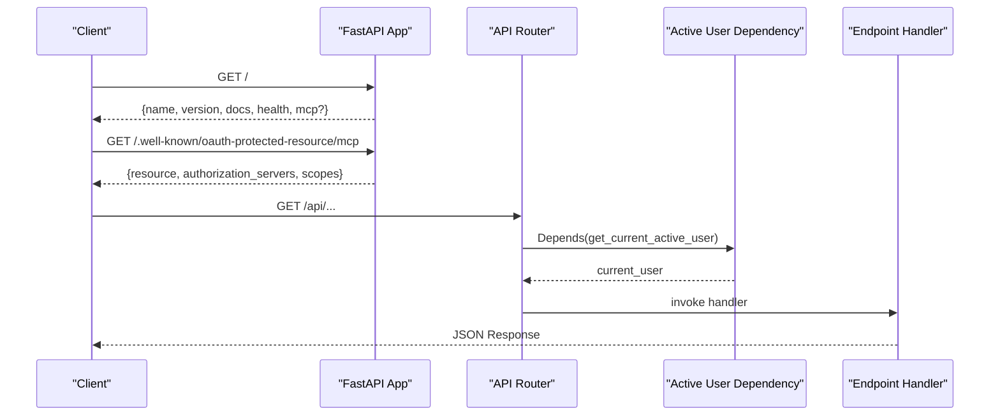

**Diagram sources**
- [main.py:78-123](file://server/app/main.py#L78-L123)
- [router.py:156-158](file://server/app/api/router.py#L156-L158)
- [dependencies.py:131-136](file://server/app/api/dependencies.py#L131-L136)

**Section sources**
- [main.py:78-123](file://server/app/main.py#L78-L123)
- [router.py:156-158](file://server/app/api/router.py#L156-L158)
- [dependencies.py:131-136](file://server/app/api/dependencies.py#L131-L136)

### Database Initialization and Session Management
- Lazy-initialized async SQLAlchemy engine and session factory.
- Engine parameters adapt to SQLite vs PostgreSQL; debug toggles echo.
- Dependency provider yields sessions per request.
- Startup verifies connectivity via SELECT 1.

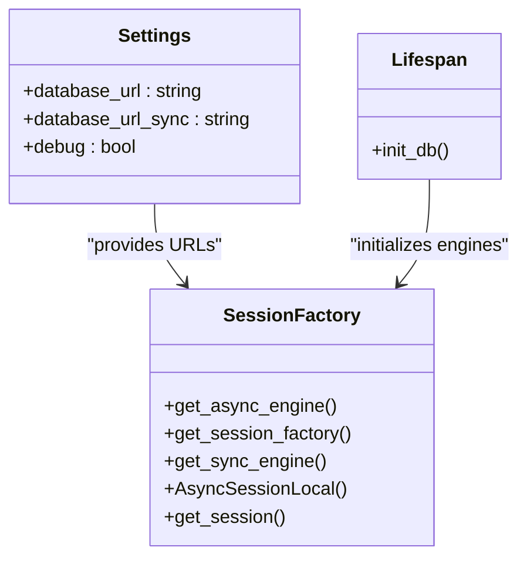

**Diagram sources**
- [session.py:18-64](file://server/app/db/session.py#L18-L64)
- [config.py:19-22](file://server/app/config.py#L19-L22)

**Section sources**
- [session.py:18-64](file://server/app/db/session.py#L18-L64)

### MQTT Task Management
- Continuous MQTT client connects to broker with TLS support and subscribes to topics.
- Routes messages to specialized handlers for telemetry, acknowledgments, camera registration/status, and photo/frame ingestion.
- Persists telemetry, RSSI, vitals, room predictions, and activity timeline events.
- Publishes downstream alerts and room predictions to WheelSense channels.

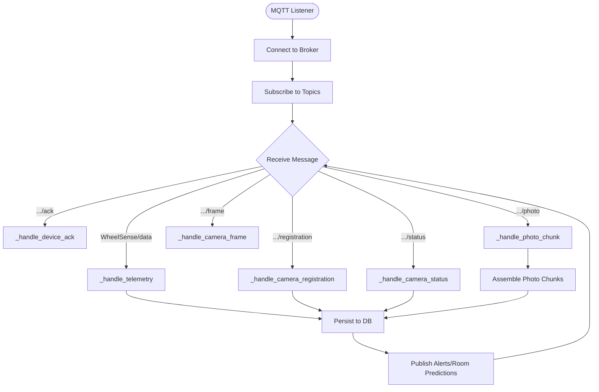

**Diagram sources**
- [mqtt_handler.py:73-137](file://server/app/mqtt_handler.py#L73-L137)
- [mqtt_handler.py:139-325](file://server/app/mqtt_handler.py#L139-L325)
- [mqtt_handler.py:542-564](file://server/app/mqtt_handler.py#L542-L564)
- [mqtt_handler.py:566-573](file://server/app/mqtt_handler.py#L566-L573)
- [mqtt_handler.py:575-588](file://server/app/mqtt_handler.py#L575-L588)
- [mqtt_handler.py:590-638](file://server/app/mqtt_handler.py#L590-L638)
- [mqtt_handler.py:640-667](file://server/app/mqtt_handler.py#L640-L667)

**Section sources**
- [mqtt_handler.py:73-137](file://server/app/mqtt_handler.py#L73-L137)

### Worker Scheduler Setup (Data Retention)
- APScheduler runs periodic cleanup across all workspaces.
- Lifecycle-managed via lifespan; scheduler is started/stopped accordingly.
- Delegates to retention service with configurable retention windows.

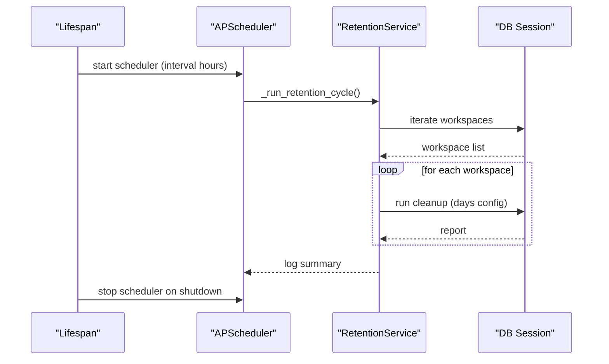

**Diagram sources**
- [retention_worker.py:25-87](file://server/app/workers/retention_worker.py#L25-L87)
- [main.py:47-66](file://server/app/main.py#L47-L66)

**Section sources**
- [retention_worker.py:25-87](file://server/app/workers/retention_worker.py#L25-L87)

### Conditional Mounting Strategy for MCP
- MCP is mounted under /mcp only when WHEELSENSE_ENABLE_MCP is truthy.
- Exposes OAuth-protected resource metadata endpoint for external clients.

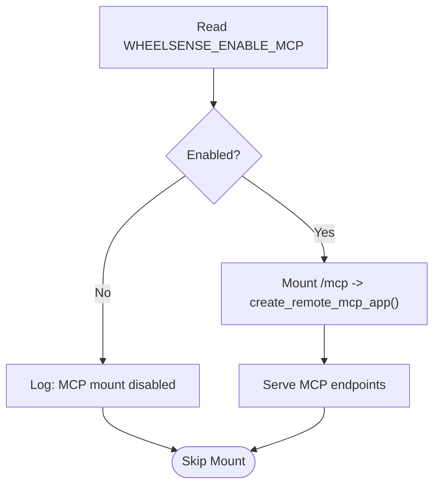

**Diagram sources**
- [main.py:24-25](file://server/app/main.py#L24-L25)
- [main.py:117-122](file://server/app/main.py#L117-L122)

**Section sources**
- [main.py:24-25](file://server/app/main.py#L24-L25)
- [main.py:117-122](file://server/app/main.py#L117-L122)

### Practical Examples
- Application initialization: see lifespan startup steps and conditional mounting.
- Error handling pattern: standardized envelope construction and exception handlers.
- Configuration best practices: set SECRET_KEY, configure database URLs, enable debug only locally, and normalize env_mode.

**Section sources**
- [main.py:26-76](file://server/app/main.py#L26-L76)
- [errors.py:24-47](file://server/app/api/errors.py#L24-L47)
- [config.py:119-150](file://server/app/config.py#L119-L150)

## Dependency Analysis
- FastAPI app depends on router, error handlers, security utilities, database session factory, MQTT handler, retention worker, MCP server wrapper, and dependencies.
- Router composes domain routers and enforces authentication dependencies.
- MCP auth middleware depends on settings for allowed origins and resource metadata URL.
- Taskiq integration is optional and gracefully degrades when not installed.

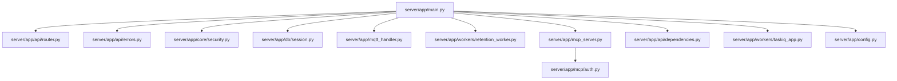

**Diagram sources**
- [main.py:68-76](file://server/app/main.py#L68-L76)
- [router.py:16-158](file://server/app/api/router.py#L16-L158)
- [errors.py:50-76](file://server/app/api/errors.py#L50-L76)
- [security.py:13-56](file://server/app/core/security.py#L13-L56)
- [session.py:18-64](file://server/app/db/session.py#L18-L64)
- [mqtt_handler.py:73-137](file://server/app/mqtt_handler.py#L73-L137)
- [retention_worker.py:55-87](file://server/app/workers/retention_worker.py#L55-L87)
- [mcp_server.py:5-12](file://server/app/mcp_server.py#L5-L12)
- [auth.py:16-157](file://server/app/mcp/auth.py#L16-L157)
- [dependencies.py:25-120](file://server/app/api/dependencies.py#L25-L120)
- [taskiq_app.py:11-28](file://server/app/workers/taskiq_app.py#L11-L28)
- [config.py:12-151](file://server/app/config.py#L12-L151)

**Section sources**
- [main.py:68-76](file://server/app/main.py#L68-L76)
- [router.py:16-158](file://server/app/api/router.py#L16-L158)
- [auth.py:16-157](file://server/app/mcp/auth.py#L16-L157)

## Performance Considerations
- Use async database sessions and avoid blocking operations in request handlers.
- Tune pool_size and max_overflow for PostgreSQL; echo is controlled by debug setting.
- Keep MQTT message handlers efficient; batch writes and publish only when necessary.
- Configure retention intervals and retention windows to balance storage and performance.
- Use APscheduler jobs judiciously; ensure cleanup routines are idempotent and resilient.

[No sources needed since this section provides general guidance]

## Troubleshooting Guide
- Startup fails due to insecure secret key: ensure SECRET_KEY is set to a strong value when not in debug mode.
- Database connectivity errors: verify DATABASE_URL and network access; check echo logs when debug is enabled.
- MQTT connection issues: confirm broker host/port/TLS settings; inspect reconnect logs.
- MCP access denied: verify allowed origins, Origin header presence, and token validity.
- Validation errors: review standardized error envelope details for field-level issues.
- Retention job failures: check scheduler logs and workspace iteration for exceptions.

**Section sources**
- [security.py:13-19](file://server/app/core/security.py#L13-L19)
- [session.py:58-64](file://server/app/db/session.py#L58-L64)
- [mqtt_handler.py:126-136](file://server/app/mqtt_handler.py#L126-L136)
- [auth.py:30-50](file://server/app/mcp/auth.py#L30-L50)
- [errors.py:50-76](file://server/app/api/errors.py#L50-L76)
- [retention_worker.py:49-50](file://server/app/workers/retention_worker.py#L49-L50)

## Conclusion
The WheelSense FastAPI application integrates asynchronous request handling, robust configuration management, lifecycle-aware initialization, standardized error handling, and secure authentication. It orchestrates MQTT telemetry ingestion, scheduled retention cleanup, and optional MCP integration with strict origin and token validation. The modular router and dependency injection patterns promote maintainability and scalability.

[No sources needed since this section summarizes without analyzing specific files]

## Appendices

### Configuration Reference
- Database URLs: async and sync variants for SQLAlchemy.
- MQTT: broker, port, credentials, TLS, auto-registration options.
- App: name, debug, environment mode.
- Auth: secret key, algorithm, token expiration.
- Bootstrap admin: enable and credential synchronization.
- HomeAssistant: base URL and access token.
- AI chat: provider selection, models, base URLs, internal service secret, MCP allowed origins and origin requirement.
- Agent runtime: intent and LLM routing settings.
- Data retention: enable flag and retention windows with interval.

**Section sources**
- [config.py:19-118](file://server/app/config.py#L19-L118)

### Runtime Settings Best Practices
- Set SECRET_KEY to a cryptographically secure value in production.
- Use environment mode to control demo vs production behavior.
- Enable debug only in development; disable in staging/production.
- Configure allowed MCP origins and require Origin header for MCP access.
- Monitor retention intervals and adjust for storage capacity.

**Section sources**
- [security.py:13-19](file://server/app/core/security.py#L13-L19)
- [config.py:119-150](file://server/app/config.py#L119-L150)
- [auth.py:24-28](file://server/app/mcp/auth.py#L24-L28)

### Environment and Tooling Notes
- Python version and linting targets are defined in project configuration.
- Dependencies include FastAPI, Uvicorn, SQLAlchemy, Alembic, aiomqtt, Pydantic, APScheduler, and MCP.

**Section sources**
- [pyproject.toml:1-15](file://server/pyproject.toml#L1-L15)
- [requirements.txt:1-30](file://server/requirements.txt#L1-L30)