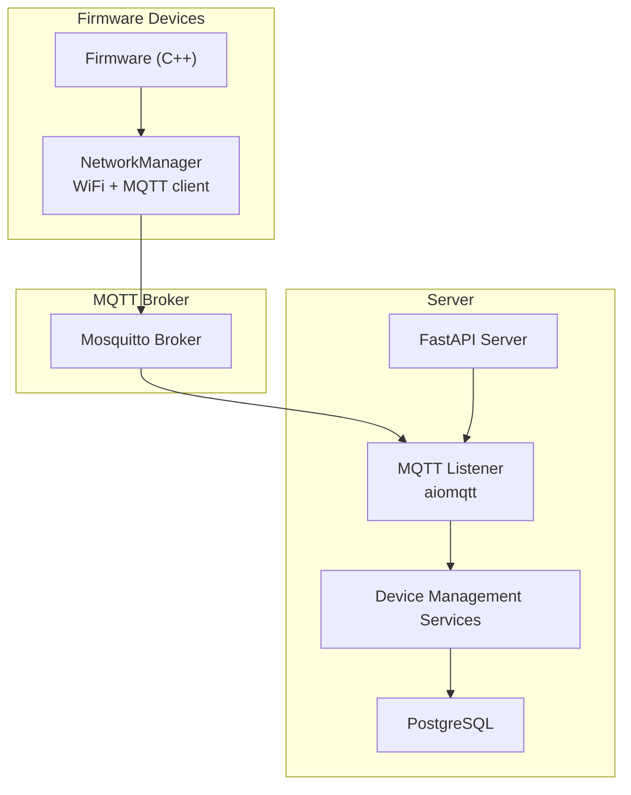
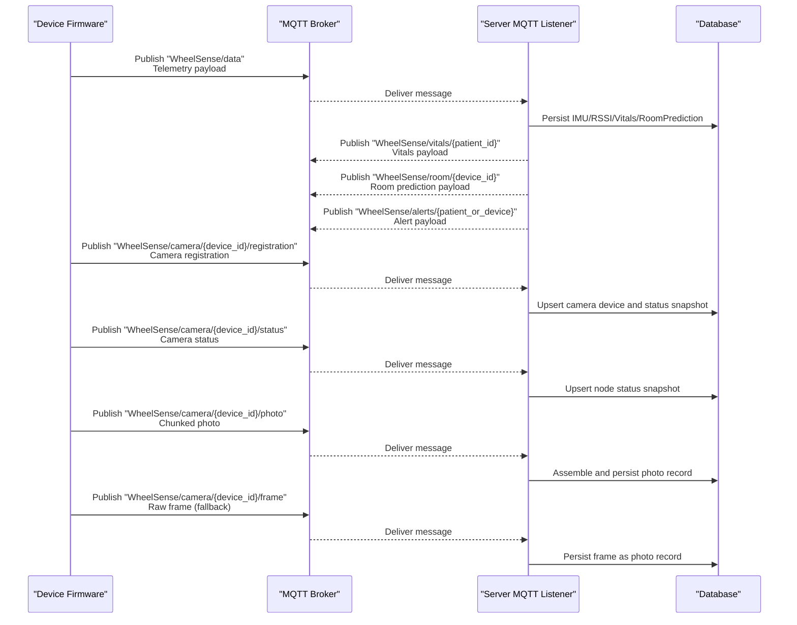
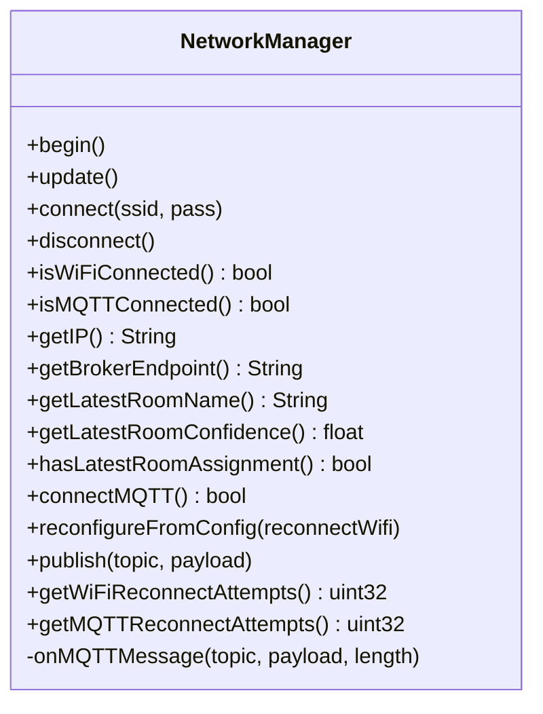
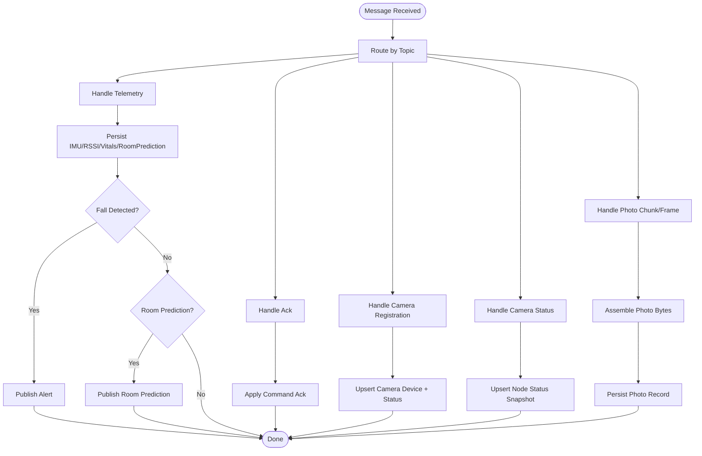
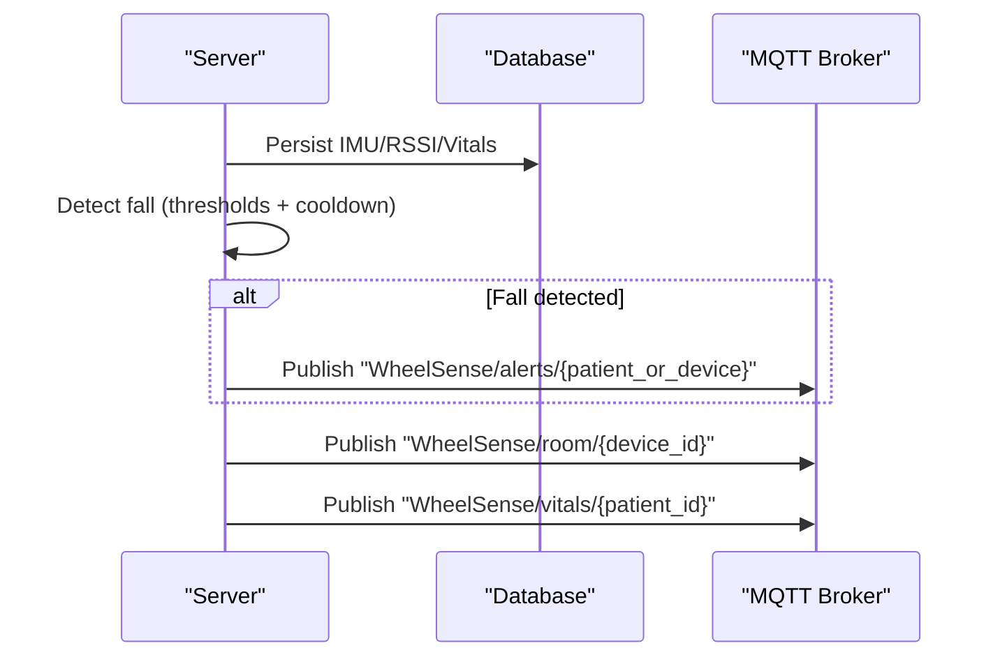
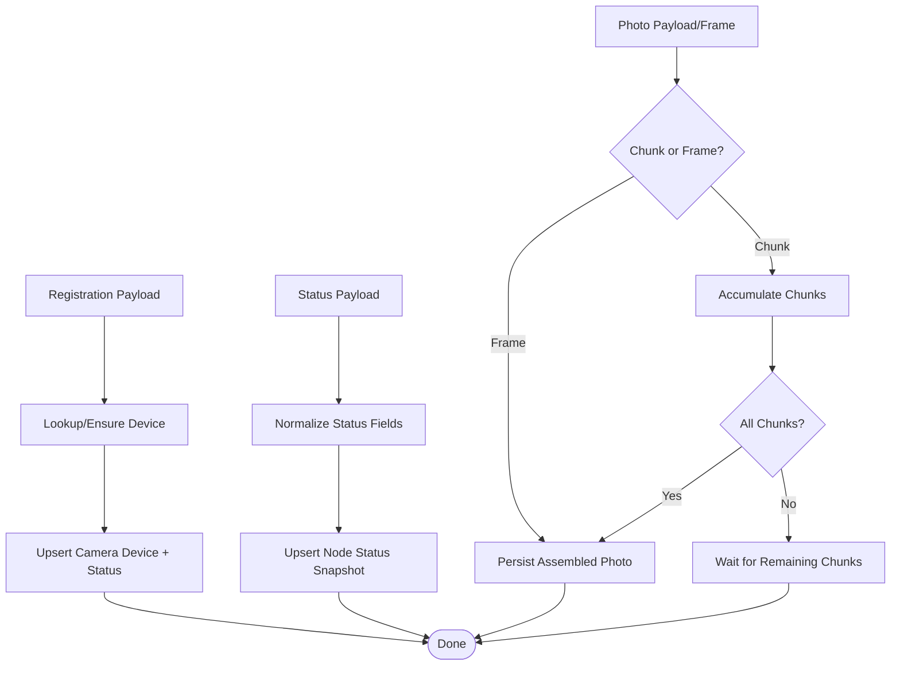
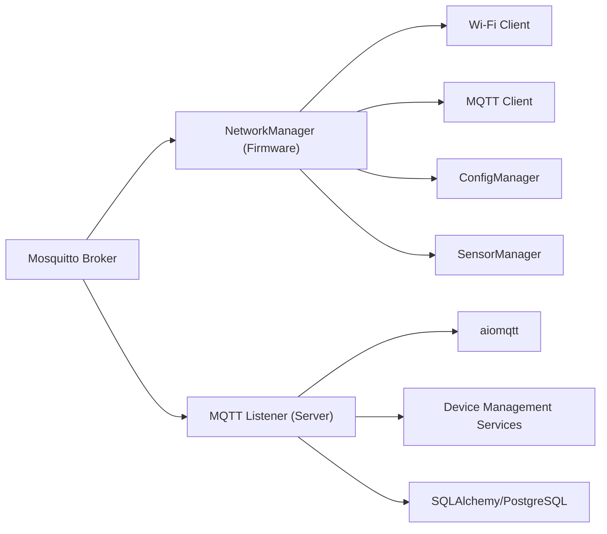

# MQTT Integration

<cite>
**Referenced Files in This Document**
- [mqtt_handler.py](file://server/app/mqtt_handler.py)
- [config.py](file://server/app/config.py)
- [NetworkManager.cpp](file://firmware/M5StickCPlus2/src/managers/NetworkManager.cpp)
- [NetworkManager.h](file://firmware/M5StickCPlus2/src/managers/NetworkManager.h)
- [TELEMETRY_CONTRACT.md](file://firmware/TELEMETRY_CONTRACT.md)
- [mosquitto.conf](file://server/mosquitto.conf)
- [device_management.py](file://server/app/services/device_management.py)
- [telemetry.py](file://server/app/models/telemetry.py)
- [docker-compose.yml](file://server/docker-compose.yml)
- [test_system_flows.py](file://server/tests/e2e/test_system_flows.py)
</cite>

## Table of Contents
1. [Introduction](#introduction)
2. [Project Structure](#project-structure)
3. [Core Components](#core-components)
4. [Architecture Overview](#architecture-overview)
5. [Detailed Component Analysis](#detailed-component-analysis)
6. [Dependency Analysis](#dependency-analysis)
7. [Performance Considerations](#performance-considerations)
8. [Troubleshooting Guide](#troubleshooting-guide)
9. [Conclusion](#conclusion)
10. [Appendices](#appendices)

## Introduction
This document explains the MQTT integration for the WheelSense Platform. It covers client configuration and connection management in device firmware, broker setup and security, message handling and routing in the server, telemetry ingestion and alerting, and operational practices for reliability and observability. It also documents the integration with the service layer for device management and monitoring, and provides practical examples of topics, payloads, and subscription patterns.

## Project Structure
The MQTT integration spans two primary areas:
- Device firmware (C++ for M5StickC Plus2 and Node_Tsimcam) that publishes telemetry and photos, subscribes to control and configuration topics, and manages Wi-Fi and MQTT connectivity.
- Server (Python/AsyncIO) that subscribes to device topics, parses payloads, persists telemetry and status, generates alerts, and publishes downstream topics for vitals, room predictions, and alerts.

**Diagram sources**
- [NetworkManager.cpp:12-133](file://firmware/M5StickCPlus2/src/managers/NetworkManager.cpp#L12-L133)
- [mqtt_handler.py:73-137](file://server/app/mqtt_handler.py#L73-L137)
- [mosquitto.conf:1-7](file://server/mosquitto.conf#L1-L7)
- [device_management.py:127-200](file://server/app/services/device_management.py#L127-L200)

**Section sources**
- [NetworkManager.cpp:12-133](file://firmware/M5StickCPlus2/src/managers/NetworkManager.cpp#L12-L133)
- [mqtt_handler.py:73-137](file://server/app/mqtt_handler.py#L73-L137)
- [mosquitto.conf:1-7](file://server/mosquitto.conf#L1-L7)

## Core Components
- Firmware MQTT client (NetworkManager)
  - Initializes Wi-Fi and MQTT client, sets keep-alive and buffer sizes, and manages reconnection with exponential backoff.
  - Subscribes to device-specific control, ack, config, and room topics.
  - Publishes telemetry and handles incoming control/config/room messages.
- Server MQTT listener (aiomqtt)
  - Connects to the broker with optional TLS and credentials.
  - Subscribes to telemetry, camera registration/status/photo/frame, and ack topics.
  - Routes messages to handlers for telemetry, acknowledgements, camera registration/status, and photo assembly.
- Device management services
  - Auto-registration of devices on first telemetry, BLE node creation from RSSI, camera registration and status snapshotting, and command acknowledgment application.
- Data models
  - IMU telemetry, RSSI readings, room predictions, motion training data, photo records, and node status telemetry.

**Section sources**
- [NetworkManager.cpp:12-133](file://firmware/M5StickCPlus2/src/managers/NetworkManager.cpp#L12-L133)
- [NetworkManager.h:8-63](file://firmware/M5StickCPlus2/src/managers/NetworkManager.h#L8-L63)
- [mqtt_handler.py:73-137](file://server/app/mqtt_handler.py#L73-L137)
- [device_management.py:127-200](file://server/app/services/device_management.py#L127-L200)
- [telemetry.py:20-130](file://server/app/models/telemetry.py#L20-L130)

## Architecture Overview
The integration follows an event-driven architecture:
- Devices publish telemetry and camera frames to the broker.
- The server listens and processes messages asynchronously, persists data, and publishes derived outputs (vitals, room predictions, alerts).
- Device firmware subscribes to control and configuration topics to receive commands and dynamic reconfiguration.

**Diagram sources**
- [TELEMETRY_CONTRACT.md:5-68](file://firmware/TELEMETRY_CONTRACT.md#L5-L68)
- [mqtt_handler.py:100-125](file://server/app/mqtt_handler.py#L100-L125)
- [mqtt_handler.py:139-325](file://server/app/mqtt_handler.py#L139-L325)
- [mqtt_handler.py:590-667](file://server/app/mqtt_handler.py#L590-L667)
- [mqtt_handler.py:542-573](file://server/app/mqtt_handler.py#L542-L573)

## Detailed Component Analysis

### Firmware MQTT Client (NetworkManager)
Responsibilities:
- Initialize Wi-Fi and MQTT client with configurable broker endpoint and credentials.
- Manage connection lifecycle with exponential backoff and keep-alive.
- Subscribe to control, ack, config, and room topics.
- Parse and apply configuration updates and control commands.
- Publish telemetry and handle acknowledgements.

Key behaviors:
- On connect, subscribe to device-scoped topics and “all” config.
- On receiving control commands, acknowledge immediately and act (e.g., reboot, reset distance, start/stop recording).
- On receiving room assignment updates, cache latest room name and confidence.

**Diagram sources**
- [NetworkManager.h:8-63](file://firmware/M5StickCPlus2/src/managers/NetworkManager.h#L8-L63)
- [NetworkManager.cpp:12-133](file://firmware/M5StickCPlus2/src/managers/NetworkManager.cpp#L12-L133)

**Section sources**
- [NetworkManager.cpp:12-133](file://firmware/M5StickCPlus2/src/managers/NetworkManager.cpp#L12-L133)
- [NetworkManager.h:8-63](file://firmware/M5StickCPlus2/src/managers/NetworkManager.h#L8-L63)

### Server MQTT Listener and Message Pipeline
Responsibilities:
- Connect to broker with TLS and credentials from settings.
- Subscribe to telemetry, camera registration/status/photo/frame, ack topics.
- Route messages to specialized handlers:
  - Telemetry ingestion and alerting.
  - Acknowledgement processing.
  - Camera registration and status snapshotting.
  - Photo chunk assembly and persistence.
- Publish downstream topics for vitals, room predictions, and alerts.

Processing logic highlights:
- Telemetry ingestion validates timestamps, auto-registers devices, persists IMU/RSSI/motion/vitals, detects falls, predicts rooms, and publishes alerts and room predictions.
- Camera registration/status normalizes payloads and upserts node status telemetry.
- Photo handling supports chunked JSON and raw JPEG fallback, assembling and persisting images.

**Diagram sources**
- [mqtt_handler.py:100-125](file://server/app/mqtt_handler.py#L100-L125)
- [mqtt_handler.py:139-325](file://server/app/mqtt_handler.py#L139-L325)
- [mqtt_handler.py:542-573](file://server/app/mqtt_handler.py#L542-L573)
- [mqtt_handler.py:590-667](file://server/app/mqtt_handler.py#L590-L667)

**Section sources**
- [mqtt_handler.py:73-137](file://server/app/mqtt_handler.py#L73-L137)
- [mqtt_handler.py:139-325](file://server/app/mqtt_handler.py#L139-L325)
- [mqtt_handler.py:542-573](file://server/app/mqtt_handler.py#L542-L573)
- [mqtt_handler.py:590-667](file://server/app/mqtt_handler.py#L590-L667)

### Telemetry Data Processing and Real-Time Alert Generation
- Telemetry ingestion:
  - Validates and normalizes timestamps, auto-registers devices if enabled, persists IMU, motion, battery, and RSSI.
  - Optionally ingests vitals from Polar HR when available.
  - Detects falls using thresholds on acceleration and velocity, with cooldown to avoid duplicates.
  - Predicts room from RSSI vector and tracks transitions, emitting timeline events.
- Downstream publishing:
  - Vitals topic for live vitals feed.
  - Room prediction topic for occupancy and localization.
  - Alert topic for critical fall events.

**Diagram sources**
- [mqtt_handler.py:139-325](file://server/app/mqtt_handler.py#L139-L325)

**Section sources**
- [mqtt_handler.py:139-325](file://server/app/mqtt_handler.py#L139-L325)

### Device Status Updates and Camera Integration
- Camera registration:
  - Creates or updates camera device records, captures IP address and firmware, and normalizes status.
- Camera status:
  - Normalizes battery, snapshots, and runtime metrics; updates device config and last-seen.
- Photo handling:
  - Supports chunked JSON transport and raw JPEG fallback; buffers and reassembles chunks; persists to disk and records metadata.

**Diagram sources**
- [mqtt_handler.py:590-667](file://server/app/mqtt_handler.py#L590-L667)
- [mqtt_handler.py:485-540](file://server/app/mqtt_handler.py#L485-L540)
- [mqtt_handler.py:542-573](file://server/app/mqtt_handler.py#L542-L573)

**Section sources**
- [mqtt_handler.py:590-667](file://server/app/mqtt_handler.py#L590-L667)
- [mqtt_handler.py:485-540](file://server/app/mqtt_handler.py#L485-L540)
- [mqtt_handler.py:542-573](file://server/app/mqtt_handler.py#L542-L573)

### Topic Routing and Payload Parsing Strategies
- Topics subscribed by server:
  - Telemetry: WheelSense/data
  - Camera: registration, status, photo, frame
  - Acknowledgements: WheelSense/+/ack and WheelSense/camera/+/ack
- Topics published by server:
  - Vitals: WheelSense/vitals/{patient_id}
  - Room: WheelSense/room/{device_id}
  - Alerts: WheelSense/alerts/{patient_or_device}

- Firmware subscriptions:
  - Config: WheelSense/config/{device_id} and WheelSense/config/all
  - Control: WheelSense/{device_id}/control
  - Ack: WheelSense/{device_id}/ack
  - Room: WheelSense/room/{device_id}

- Payload highlights:
  - Telemetry includes device identifiers, IMU, motion, battery, and RSSI list.
  - Camera registration/status includes device identity, IP, firmware, and battery/status fields.
  - Photo payloads include chunk indices and base64-encoded data for chunked transport.

**Section sources**
- [mqtt_handler.py:100-125](file://server/app/mqtt_handler.py#L100-L125)
- [TELEMETRY_CONTRACT.md:5-68](file://firmware/TELEMETRY_CONTRACT.md#L5-L68)
- [NetworkManager.cpp:115-133](file://firmware/M5StickCPlus2/src/managers/NetworkManager.cpp#L115-L133)

### MQTT Broker Configuration, Security, and Authentication
- Broker configuration:
  - Default listener on 1883, anonymous access allowed, persistence enabled, logs to stdout.
- Security settings:
  - TLS support is configurable in server settings; firmware supports TLS via underlying client.
  - Username/password authentication supported in both server and firmware.
- Operational notes:
  - Use TLS and strong credentials in production environments.
  - Consider restricting anonymous access and enabling persistence for reliability.

**Section sources**
- [mosquitto.conf:1-7](file://server/mosquitto.conf#L1-L7)
- [config.py:23-37](file://server/app/config.py#L23-L37)
- [NetworkManager.cpp:108-113](file://firmware/M5StickCPlus2/src/managers/NetworkManager.cpp#L108-L113)

### Message Persistence, Retry Logic, and Error Recovery
- Server:
  - Uses aiomqtt with automatic reconnection and exponential backoff.
  - Handlers log exceptions and continue processing subsequent messages.
  - Database transactions are committed per message ingestion.
- Firmware:
  - Exponential backoff for Wi-Fi and MQTT reconnections.
  - Publish drop counters track delivery failures.
  - On receiving control commands, acknowledges immediately and acts accordingly.

**Section sources**
- [mqtt_handler.py:73-137](file://server/app/mqtt_handler.py#L73-L137)
- [NetworkManager.cpp:58-94](file://firmware/M5StickCPlus2/src/managers/NetworkManager.cpp#L58-L94)
- [NetworkManager.cpp:276-282](file://firmware/M5StickCPlus2/src/managers/NetworkManager.cpp#L276-L282)

### Integration with Device Firmware, Message Queuing, and Event-Driven Patterns
- Firmware integrates Wi-Fi and MQTT clients, exposing a simple publish/subscribe interface.
- Server leverages asynchronous message processing to handle bursts and maintain responsiveness.
- Device management services encapsulate workspace-aware device operations, ensuring isolation and auditability.

**Section sources**
- [NetworkManager.cpp:12-133](file://firmware/M5StickCPlus2/src/managers/NetworkManager.cpp#L12-L133)
- [device_management.py:127-200](file://server/app/services/device_management.py#L127-L200)

### Practical Examples
- Telemetry payload fields:
  - device_id, device_type, hardware_type, imu, motion, battery, rssi[], timestamp, session_id, polar_hr, firmware.
- Camera registration/status payload fields:
  - device_id, ip_address, firmware, battery/battery_pct/battery_v, snapshots_captured, last_snapshot_id, frames_captured, stream_enabled, heap, payload.
- Photo payload fields:
  - photo_id, device_id, chunk_index, total_chunks, data (base64 JPEG chunk).
- Subscription patterns:
  - Server subscribes to WheelSense/data, WheelSense/camera/+/registration, WheelSense/camera/+/status, WheelSense/camera/+/photo, WheelSense/camera/+/frame, WheelSense/+/ack, WheelSense/camera/+/ack.
  - Firmware subscribes to WheelSense/config/{device_id}, WheelSense/config/all, WheelSense/{device_id}/control, WheelSense/{device_id}/ack, WheelSense/room/{device_id}.
- Integration with service layer:
  - Device auto-registration and status snapshotting leverage service methods for workspace-scoped operations.

**Section sources**
- [TELEMETRY_CONTRACT.md:5-68](file://firmware/TELEMETRY_CONTRACT.md#L5-L68)
- [mqtt_handler.py:100-125](file://server/app/mqtt_handler.py#L100-L125)
- [device_management.py:162-200](file://server/app/services/device_management.py#L162-L200)

## Dependency Analysis
- Firmware depends on:
  - NetworkManager for Wi-Fi and MQTT lifecycle.
  - ConfigManager for persisted device configuration.
  - SensorManager for telemetry data.
- Server depends on:
  - aiomqtt for asynchronous MQTT operations.
  - SQLAlchemy for database persistence.
  - Device management services for workspace-aware operations.
- Broker depends on:
  - Mosquitto configuration for listeners, persistence, and logging.

**Diagram sources**
- [NetworkManager.h:8-63](file://firmware/M5StickCPlus2/src/managers/NetworkManager.h#L8-L63)
- [mqtt_handler.py:12-40](file://server/app/mqtt_handler.py#L12-L40)
- [device_management.py:1-60](file://server/app/services/device_management.py#L1-L60)

**Section sources**
- [NetworkManager.h:8-63](file://firmware/M5StickCPlus2/src/managers/NetworkManager.h#L8-L63)
- [mqtt_handler.py:12-40](file://server/app/mqtt_handler.py#L12-L40)
- [device_management.py:1-60](file://server/app/services/device_management.py#L1-L60)

## Performance Considerations
- Use TLS and credentials to secure the broker in production.
- Enable persistence on the broker to survive restarts.
- Tune keep-alive and socket timeouts to balance responsiveness and resource usage.
- Consider rate-limiting and batching for device command dispatch to avoid broker overload.
- Monitor dropped publish counts and reconnection attempts in firmware; investigate network stability if retries increase.

[No sources needed since this section provides general guidance]

## Troubleshooting Guide
Common issues and remedies:
- Broker connectivity:
  - Verify broker address/port and credentials in server settings and firmware configuration.
  - Ensure TLS settings match broker capabilities.
- Device auto-registration:
  - Confirm MQTT auto-register is enabled and workspace selection is valid.
  - Check that the first telemetry payload includes a valid device_id and firmware info.
- Photo ingestion:
  - For chunked transport, ensure all chunks arrive; verify chunk_index and total_chunks.
  - For raw JPEG fallback, confirm frame topic and payload handling.
- Alerts and room predictions:
  - Validate fall detection thresholds and cooldown settings.
  - Confirm room prediction inputs (RSSI vector) and model configuration.

**Section sources**
- [config.py:23-37](file://server/app/config.py#L23-L37)
- [device_management.py:138-159](file://server/app/services/device_management.py#L138-L159)
- [mqtt_handler.py:139-325](file://server/app/mqtt_handler.py#L139-L325)
- [test_system_flows.py:48-86](file://server/tests/e2e/test_system_flows.py#L48-L86)

## Conclusion
The WheelSense MQTT integration provides a robust, event-driven foundation for device telemetry, camera operations, and real-time insights. By combining resilient firmware connectivity, asynchronous server processing, and workspace-aware device management, the system supports reliable operation across diverse deployments. Adopt TLS, strict credentials, and persistence to harden production setups, and leverage the documented topics and payloads for seamless integration.

[No sources needed since this section summarizes without analyzing specific files]

## Appendices

### Appendix A: Configuration Reference
- Server settings (environment variables via pydantic settings):
  - mqtt_broker, mqtt_port, mqtt_user, mqtt_password, mqtt_tls
  - mqtt_auto_register_devices, mqtt_auto_register_workspace_id
  - mqtt_auto_register_ble_nodes, mqtt_merge_ble_camera_by_mac

**Section sources**
- [config.py:23-37](file://server/app/config.py#L23-L37)

### Appendix B: Docker Compose Context
- The platform uses a composed setup that includes core and data stacks; ensure the broker and server are started together for end-to-end testing.

**Section sources**
- [docker-compose.yml:1-10](file://server/docker-compose.yml#L1-L10)