# Security & Access Control

<cite>
**Referenced Files in This Document**
- [security.py](file://server/app/core/security.py)
- [token_crypto.py](file://server/app/core/token_crypto.py)
- [config.py](file://server/app/config.py)
- [dependencies.py](file://server/app/api/dependencies.py)
- [auth.py](file://server/app/api/endpoints/auth.py)
- [mcp_auth.py](file://server/app/api/endpoints/mcp_auth.py)
- [auth.py](file://server/app/mcp/auth.py)
- [context.py](file://server/app/mcp/context.py)
- [schemas/mcp_auth.py](file://server/app/schemas/mcp_auth.py)
- [models/users.py](file://server/app/models/users.py)
- [models/mcp_tokens.py](file://server/app/models/mcp_tokens.py)
- [services/auth.py](file://server/app/services/auth.py)
- [api/router.py](file://server/app/api/router.py)
- [errors.py](file://server/app/api/errors.py)
</cite>

## Table of Contents
1. [Introduction](#introduction)
2. [Project Structure](#project-structure)
3. [Core Components](#core-components)
4. [Architecture Overview](#architecture-overview)
5. [Detailed Component Analysis](#detailed-component-analysis)
6. [Dependency Analysis](#dependency-analysis)
7. [Performance Considerations](#performance-considerations)
8. [Troubleshooting Guide](#troubleshooting-guide)
9. [Conclusion](#conclusion)
10. [Appendices](#appendices)

## Introduction
This document explains the WheelSense Platform’s security and access control design. It covers JWT-based authentication, session management, token validation, role-based access control (RBAC), workspace scoping, permission management, password hashing, credential validation, security middleware, authorization decorators, dependency injection for security checks, MCP authentication, OAuth-like scope-based authorization, and audit trail patterns. Practical examples illustrate authentication flows, permission checks, and secure endpoint implementation patterns.

## Project Structure
Security and access control span several layers:
- Configuration defines cryptographic settings and environment modes.
- Core utilities provide JWT creation, password hashing, and token encryption helpers.
- Dependencies define FastAPI dependency injection for authentication and authorization.
- Endpoints implement authentication, session management, and MCP token issuance.
- Services encapsulate business logic for authentication, sessions, and impersonation.
- Models define user, session, and MCP token persistence.
- MCP middleware enforces origin policies and validates MCP tokens.
- Error handlers standardize API error responses.

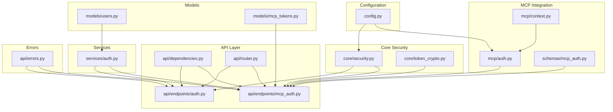

**Diagram sources**
- [config.py:1-152](file://server/app/config.py#L1-L152)
- [security.py:1-56](file://server/app/core/security.py#L1-L56)
- [token_crypto.py:1-25](file://server/app/core/token_crypto.py#L1-L25)
- [dependencies.py:1-402](file://server/app/api/dependencies.py#L1-L402)
- [auth.py:1-269](file://server/app/api/endpoints/auth.py#L1-L269)
- [mcp_auth.py:1-339](file://server/app/api/endpoints/mcp_auth.py#L1-L339)
- [router.py:1-159](file://server/app/api/router.py#L1-L159)
- [services/auth.py:1-688](file://server/app/services/auth.py#L1-L688)
- [models/users.py:1-92](file://server/app/models/users.py#L1-L92)
- [models/mcp_tokens.py:1-84](file://server/app/models/mcp_tokens.py#L1-L84)
- [auth.py:1-190](file://server/app/mcp/auth.py#L1-L190)
- [context.py:1-38](file://server/app/mcp/context.py#L1-L38)
- [schemas/mcp_auth.py:1-212](file://server/app/schemas/mcp_auth.py#L1-L212)
- [errors.py:1-77](file://server/app/api/errors.py#L1-L77)

**Section sources**
- [router.py:1-159](file://server/app/api/router.py#L1-L159)
- [config.py:1-152](file://server/app/config.py#L1-L152)

## Core Components
- JWT utilities: token creation, password hashing, and verification.
- Session management: server-tracked sessions with expiry and revocation.
- RBAC: role-based capabilities and token-scoped permissions.
- MCP authentication: short-lived tokens with scope narrowing and origin enforcement.
- Dependency injection: standardized resolution of current user, workspace, and scopes.
- Error handling: unified error envelopes for API responses.

**Section sources**
- [security.py:1-56](file://server/app/core/security.py#L1-L56)
- [services/auth.py:458-688](file://server/app/services/auth.py#L458-L688)
- [dependencies.py:159-311](file://server/app/api/dependencies.py#L159-L311)
- [mcp_auth.py:1-339](file://server/app/api/endpoints/mcp_auth.py#L1-L339)
- [auth.py:1-190](file://server/app/mcp/auth.py#L1-L190)
- [errors.py:1-77](file://server/app/api/errors.py#L1-L77)

## Architecture Overview
The system enforces authentication and authorization across three planes:
- Web/API plane: JWT bearer tokens validated via dependency injection.
- MCP plane: specialized middleware validating MCP tokens and enforcing origins.
- Workspace plane: all resources scoped to the user’s workspace.

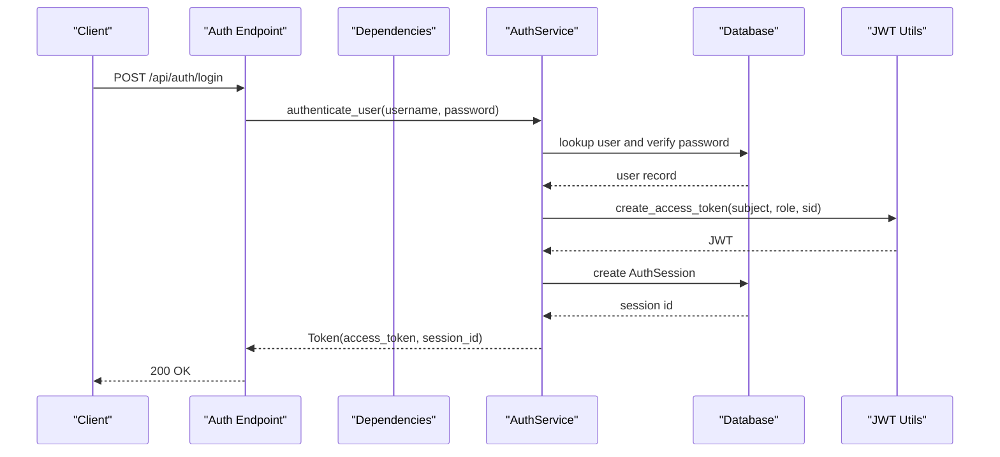

**Diagram sources**
- [auth.py:57-72](file://server/app/api/endpoints/auth.py#L57-L72)
- [services/auth.py:576-626](file://server/app/services/auth.py#L576-L626)
- [security.py:21-41](file://server/app/core/security.py#L21-L41)

**Section sources**
- [auth.py:57-72](file://server/app/api/endpoints/auth.py#L57-L72)
- [services/auth.py:576-626](file://server/app/services/auth.py#L576-L626)
- [security.py:21-41](file://server/app/core/security.py#L21-L41)

## Detailed Component Analysis

### JWT Authentication and Password Hashing
- Password hashing uses bcrypt with salt generation and constant-time comparison.
- JWT creation encodes subject, role, expiry, and optional session id and impersonation claims.
- Configuration enforces secure secret key usage and sets algorithm and expiry.

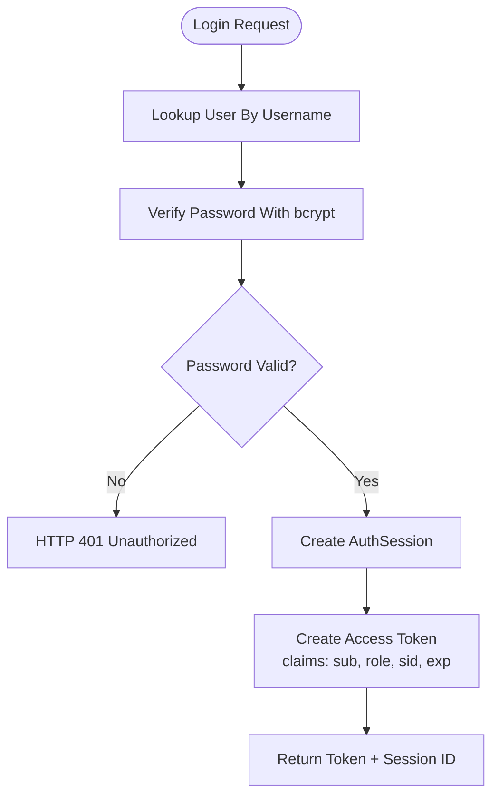

**Diagram sources**
- [services/auth.py:576-626](file://server/app/services/auth.py#L576-L626)
- [security.py:43-56](file://server/app/core/security.py#L43-L56)
- [config.py:47-50](file://server/app/config.py#L47-L50)

**Section sources**
- [security.py:43-56](file://server/app/core/security.py#L43-L56)
- [services/auth.py:576-626](file://server/app/services/auth.py#L576-L626)
- [config.py:47-50](file://server/app/config.py#L47-L50)

### Session Management and Impersonation
- Sessions are stored server-side with expiry and revocation tracking.
- Impersonation issues short-lived tokens with actor metadata embedded in JWT claims.
- Logout and per-session revocation invalidate the session and associated MCP tokens.

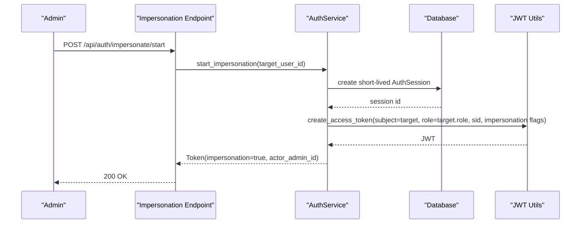

**Diagram sources**
- [auth.py:206-220](file://server/app/api/endpoints/auth.py#L206-L220)
- [services/auth.py:629-687](file://server/app/services/auth.py#L629-L687)
- [security.py:21-41](file://server/app/core/security.py#L21-L41)

**Section sources**
- [models/users.py:59-92](file://server/app/models/users.py#L59-L92)
- [services/auth.py:629-687](file://server/app/services/auth.py#L629-L687)
- [auth.py:206-220](file://server/app/api/endpoints/auth.py#L206-L220)

### Role-Based Access Control (RBAC) and Permission Management
- Roles are canonical (admin, head_nurse, supervisor, observer, patient).
- Capability maps define functional permissions per role.
- Token-scoped permissions intersect requested scopes with role allowances.
- Workspace scoping ensures all queries operate within the user’s workspace.

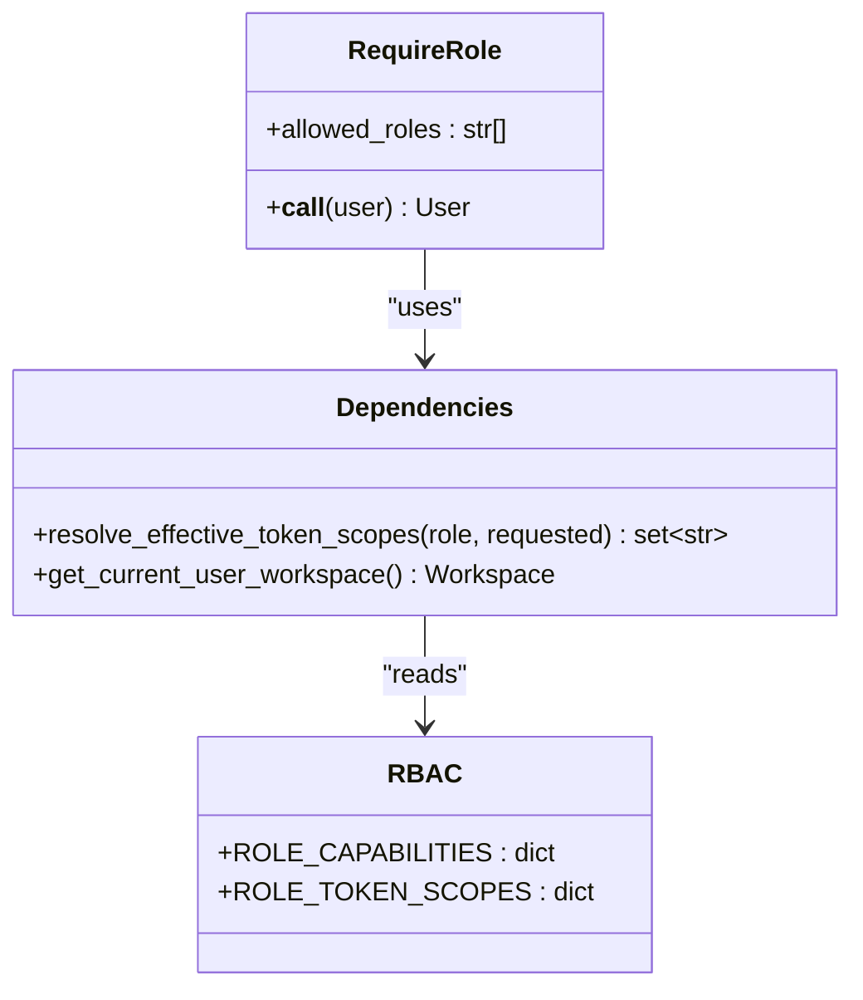

**Diagram sources**
- [dependencies.py:159-311](file://server/app/api/dependencies.py#L159-L311)

**Section sources**
- [dependencies.py:159-311](file://server/app/api/dependencies.py#L159-L311)

### Token Validation and Dependency Injection
- Centralized token decoding and validation populate user attributes and token scopes.
- Session validity is checked against stored AuthSession records.
- Impersonation metadata is propagated for audit and policy enforcement.

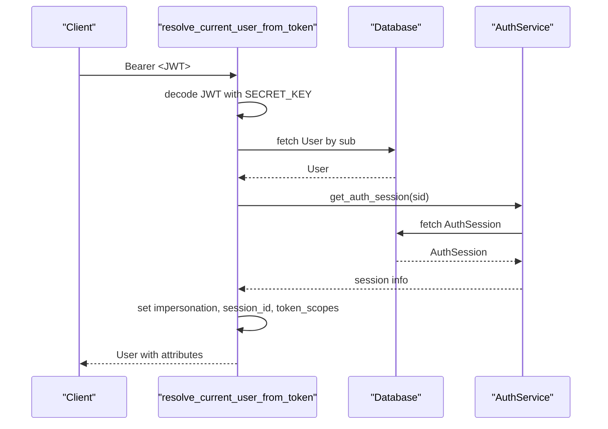

**Diagram sources**
- [dependencies.py:58-120](file://server/app/api/dependencies.py#L58-L120)
- [services/auth.py:518-524](file://server/app/services/auth.py#L518-L524)

**Section sources**
- [dependencies.py:58-120](file://server/app/api/dependencies.py#L58-L120)
- [services/auth.py:518-524](file://server/app/services/auth.py#L518-L524)

### OAuth Integration and MCP Authentication
- MCP tokens are short-lived, scope-narrowed, and tied to a parent AuthSession.
- MCP middleware enforces allowed origins, validates bearer tokens, checks revocation/expiry, and resolves effective scopes.
- MCP endpoints issue tokens with MCP-specific claims and persist MCP token records.

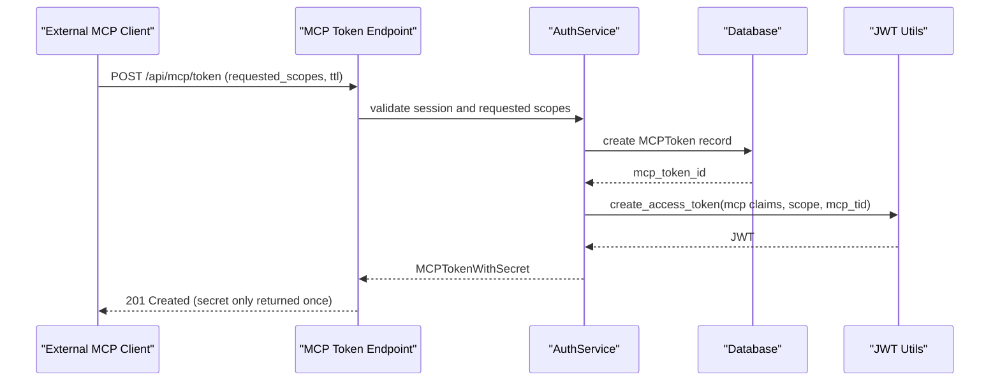

**Diagram sources**
- [mcp_auth.py:93-178](file://server/app/api/endpoints/mcp_auth.py#L93-L178)
- [models/mcp_tokens.py:10-84](file://server/app/models/mcp_tokens.py#L10-L84)
- [schemas/mcp_auth.py:119-134](file://server/app/schemas/mcp_auth.py#L119-L134)

**Section sources**
- [mcp_auth.py:93-178](file://server/app/api/endpoints/mcp_auth.py#L93-L178)
- [models/mcp_tokens.py:10-84](file://server/app/models/mcp_tokens.py#L10-L84)
- [schemas/mcp_auth.py:119-134](file://server/app/schemas/mcp_auth.py#L119-L134)

### MCP Middleware and Scope Enforcement
- Middleware validates origin, requires Authorization header, decodes JWT, checks MCP token revocation/expiry, and updates last-used timestamps.
- Effective scopes are computed from persisted MCP token scopes or session scopes.
- Actor context carries user, workspace, role, and scopes for downstream tools.

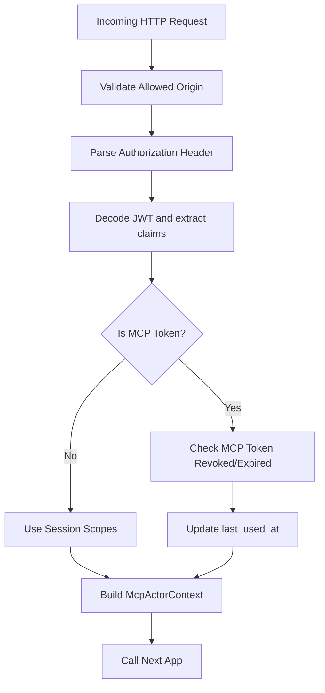

**Diagram sources**
- [auth.py:30-142](file://server/app/mcp/auth.py#L30-L142)
- [context.py:8-38](file://server/app/mcp/context.py#L8-L38)

**Section sources**
- [auth.py:30-142](file://server/app/mcp/auth.py#L30-L142)
- [context.py:8-38](file://server/app/mcp/context.py#L8-L38)

### Workspace Scoping and Permission Checking
- All endpoints depend on the current active user and resolved workspace.
- Helpers enforce visibility constraints for patients and device assignments.
- Workspace isolation prevents cross-workspace data access.

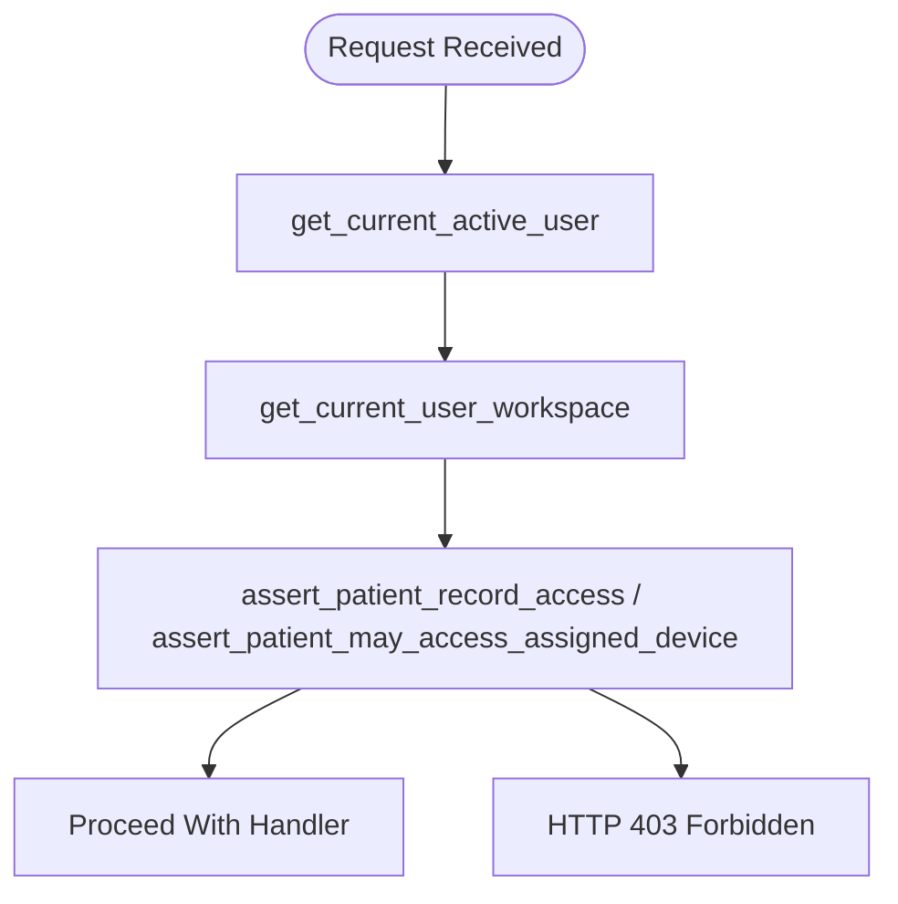

**Diagram sources**
- [dependencies.py:139-150](file://server/app/api/dependencies.py#L139-L150)
- [dependencies.py:313-401](file://server/app/api/dependencies.py#L313-L401)

**Section sources**
- [dependencies.py:139-150](file://server/app/api/dependencies.py#L139-L150)
- [dependencies.py:313-401](file://server/app/api/dependencies.py#L313-L401)

### Credential Validation and Security Middleware Setup
- Configuration validates secure secret key usage and normalizes environment modes.
- Token crypto helpers derive symmetric keys from SECRET_KEY for encrypting OAuth tokens at rest.
- Error handlers standardize HTTP exceptions and validation errors.

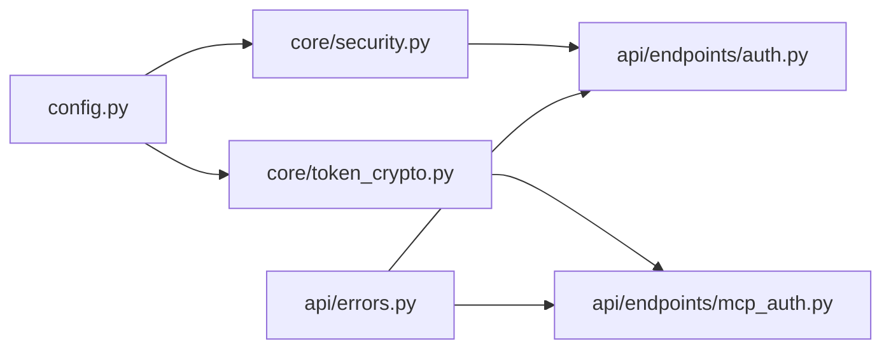

**Diagram sources**
- [config.py:47-50](file://server/app/config.py#L47-L50)
- [token_crypto.py:12-24](file://server/app/core/token_crypto.py#L12-L24)
- [errors.py:50-77](file://server/app/api/errors.py#L50-L77)

**Section sources**
- [config.py:47-50](file://server/app/config.py#L47-L50)
- [token_crypto.py:12-24](file://server/app/core/token_crypto.py#L12-L24)
- [errors.py:50-77](file://server/app/api/errors.py#L50-L77)

## Dependency Analysis
- Endpoints depend on dependencies for authentication and authorization.
- Services encapsulate business logic and interact with models.
- Models define persistence and constraints for users, sessions, and MCP tokens.
- MCP integration depends on middleware and context propagation.

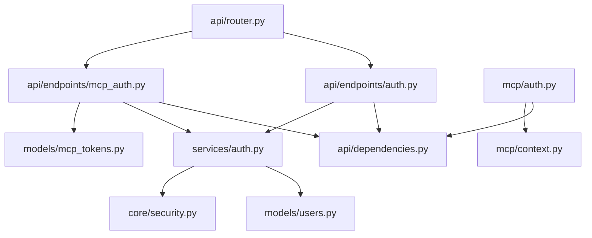

**Diagram sources**
- [auth.py:1-269](file://server/app/api/endpoints/auth.py#L1-L269)
- [dependencies.py:1-402](file://server/app/api/dependencies.py#L1-L402)
- [services/auth.py:1-688](file://server/app/services/auth.py#L1-L688)
- [models/users.py:1-92](file://server/app/models/users.py#L1-L92)
- [models/mcp_tokens.py:1-84](file://server/app/models/mcp_tokens.py#L1-L84)
- [auth.py:1-190](file://server/app/mcp/auth.py#L1-L190)
- [context.py:1-38](file://server/app/mcp/context.py#L1-L38)
- [router.py:1-159](file://server/app/api/router.py#L1-L159)

**Section sources**
- [auth.py:1-269](file://server/app/api/endpoints/auth.py#L1-L269)
- [dependencies.py:1-402](file://server/app/api/dependencies.py#L1-L402)
- [services/auth.py:1-688](file://server/app/services/auth.py#L1-L688)
- [models/users.py:1-92](file://server/app/models/users.py#L1-L92)
- [models/mcp_tokens.py:1-84](file://server/app/models/mcp_tokens.py#L1-L84)
- [auth.py:1-190](file://server/app/mcp/auth.py#L1-L190)
- [context.py:1-38](file://server/app/mcp/context.py#L1-L38)
- [router.py:1-159](file://server/app/api/router.py#L1-L159)

## Performance Considerations
- Prefer indexed workspace and user foreign keys for session and MCP token queries.
- Cache frequently accessed role and scope mappings in memory if needed.
- Minimize JWT payload size; avoid embedding large claims.
- Use short-lived MCP tokens to reduce revocation window.
- Batch revocation operations for token rotation.

## Troubleshooting Guide
Common issues and resolutions:
- Invalid or expired JWT: Ensure SECRET_KEY matches deployment, verify algorithm and expiry, and confirm session validity.
- Session not active: Check AuthSession revocation and expiry timestamps.
- Insufficient permissions: Verify role capabilities and requested scopes intersection.
- MCP token not accepted: Confirm origin allowed, token not revoked/expired, and scopes supported.
- Validation errors: Review standardized error envelopes for structured details.

**Section sources**
- [dependencies.py:58-120](file://server/app/api/dependencies.py#L58-L120)
- [services/auth.py:518-524](file://server/app/services/auth.py#L518-L524)
- [auth.py:30-142](file://server/app/mcp/auth.py#L30-L142)
- [errors.py:50-77](file://server/app/api/errors.py#L50-L77)

## Conclusion
WheelSense implements a robust, layered security model: JWT-based authentication with bcrypt password hashing, server-tracked sessions, strict workspace scoping, and role-based capabilities. MCP integration adds short-lived, scope-narrowed tokens with origin enforcement. Dependency injection centralizes validation and authorization, while standardized error handling improves operability. These patterns collectively prevent common vulnerabilities and enable secure, auditable operations across roles and domains.

## Appendices

### Practical Examples

- Secure endpoint pattern
  - Apply get_current_active_user dependency to enforce authentication and activation.
  - Use RequireRole decorator for role gating.
  - Resolve workspace via get_current_user_workspace for scoping.
  - Example paths:
    - [router.py:26-154](file://server/app/api/router.py#L26-L154)
    - [dependencies.py:131-150](file://server/app/api/dependencies.py#L131-L150)
    - [dependencies.py:159-169](file://server/app/api/dependencies.py#L159-L169)

- Permission checking
  - Use assert_patient_record_access for staff-to-patient visibility.
  - Use assert_patient_may_access_assigned_device_db for device assignment constraints.
  - Example paths:
    - [dependencies.py:313-401](file://server/app/api/dependencies.py#L313-L401)

- Authentication flow
  - Login endpoint triggers AuthService.authenticate_user and session creation.
  - Example paths:
    - [auth.py:57-72](file://server/app/api/endpoints/auth.py#L57-L72)
    - [services/auth.py:576-626](file://server/app/services/auth.py#L576-L626)

- MCP token issuance and validation
  - Create MCP token with requested scopes and TTL; JWT includes MCP claims.
  - Middleware validates origin, bearer, and MCP token state.
  - Example paths:
    - [mcp_auth.py:93-178](file://server/app/api/endpoints/mcp_auth.py#L93-L178)
    - [auth.py:30-142](file://server/app/mcp/auth.py#L30-L142)

- Audit trail integration
  - Log events with actor_user_id, domain, action, entity details, and impersonation metadata.
  - Example paths:
    - [services/auth.py:366-367](file://server/app/services/auth.py#L366-L367)