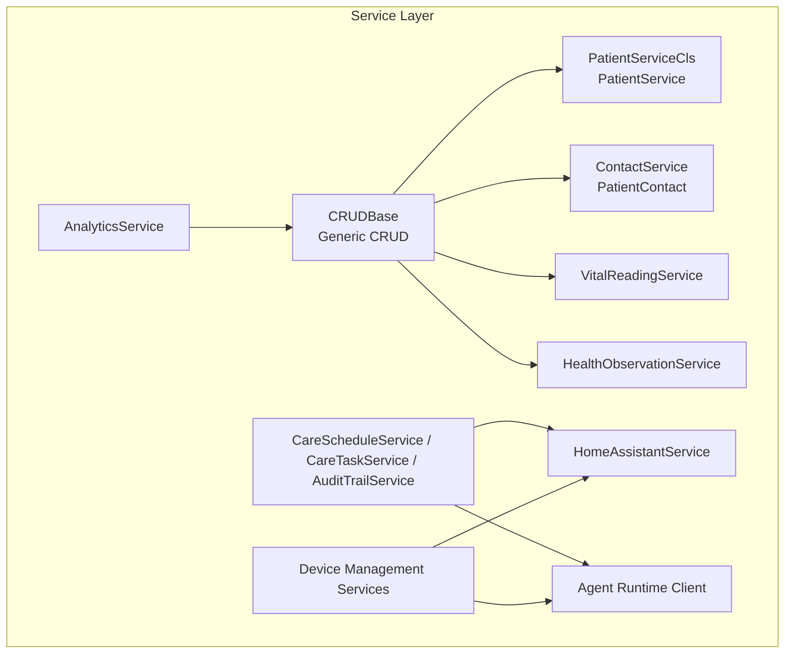
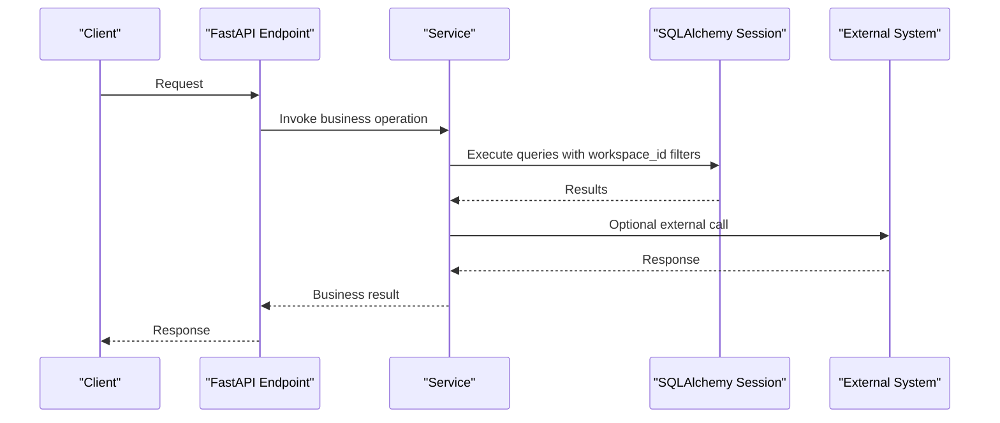
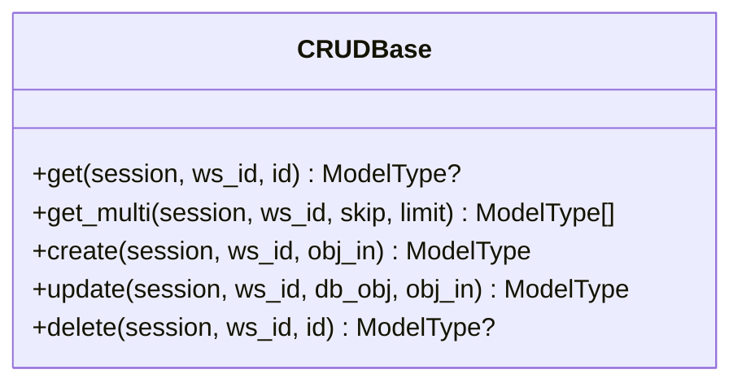
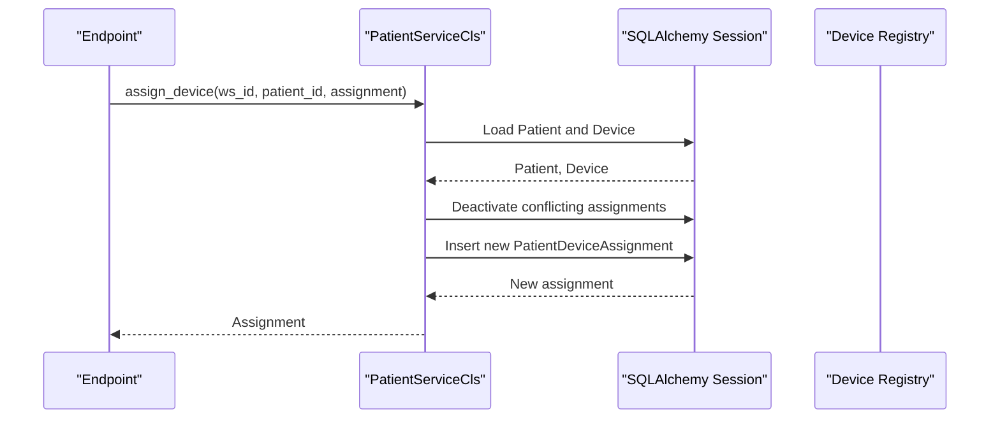
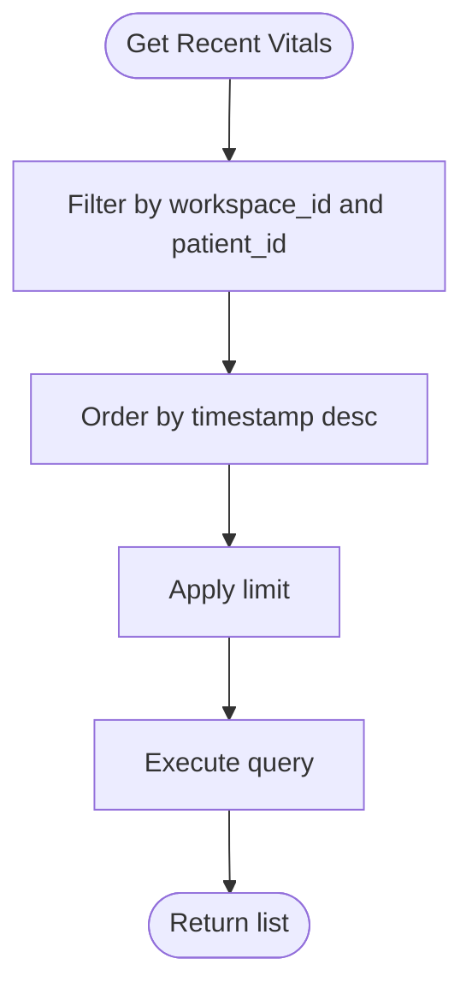
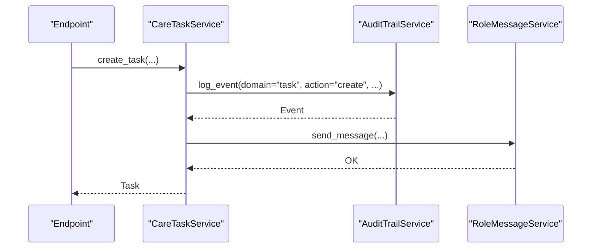
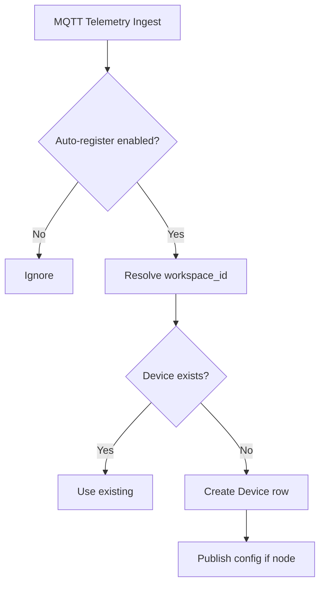
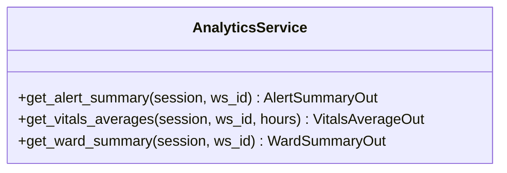
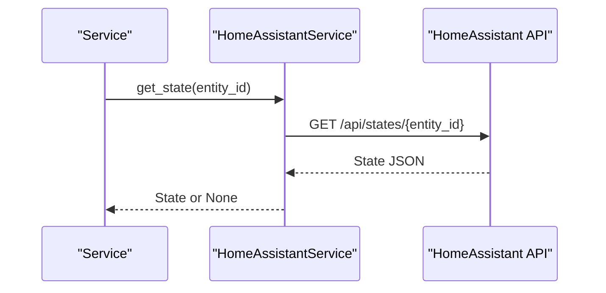
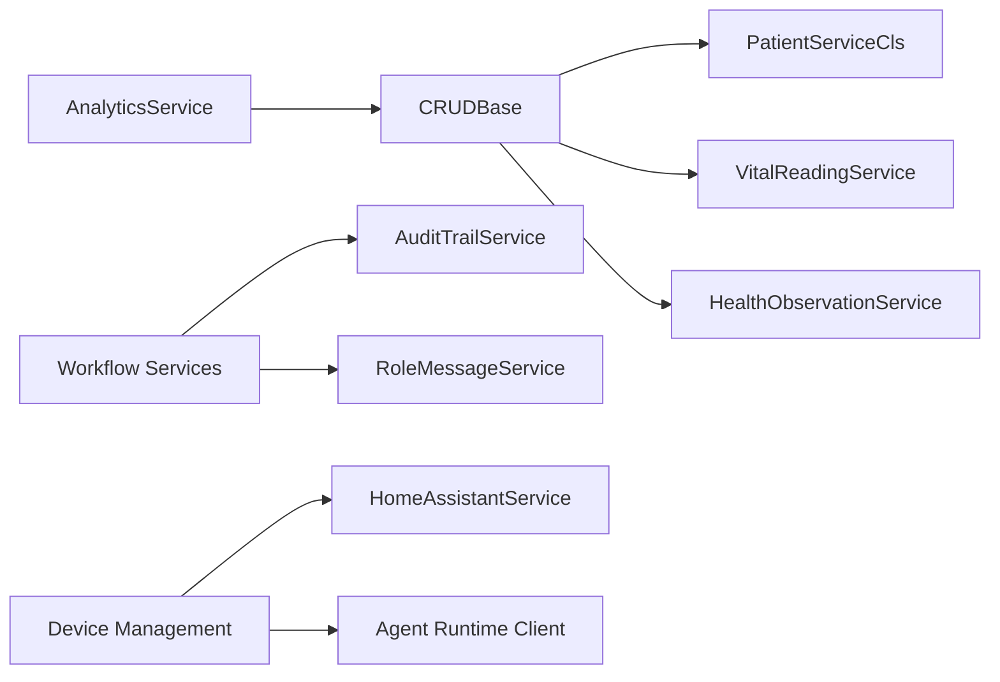

# Service Layer Architecture

<cite>
**Referenced Files in This Document**
- [base.py](file://server/app/services/base.py)
- [__init__.py](file://server/app/services/__init__.py)
- [patient.py](file://server/app/services/patient.py)
- [vitals.py](file://server/app/services/vitals.py)
- [workflow.py](file://server/app/services/workflow.py)
- [device_management.py](file://server/app/services/device_management.py)
- [homeassistant.py](file://server/app/services/homeassistant.py)
- [agent_runtime_client.py](file://server/app/services/agent_runtime_client.py)
- [analytics.py](file://server/app/services/analytics.py)
- [main.py](file://server/app/main.py)
</cite>

## Table of Contents
1. [Introduction](#introduction)
2. [Project Structure](#project-structure)
3. [Core Components](#core-components)
4. [Architecture Overview](#architecture-overview)
5. [Detailed Component Analysis](#detailed-component-analysis)
6. [Dependency Analysis](#dependency-analysis)
7. [Performance Considerations](#performance-considerations)
8. [Troubleshooting Guide](#troubleshooting-guide)
9. [Conclusion](#conclusion)

## Introduction
This document describes the service layer architecture of the WheelSense Platform. It explains the service pattern implementation, business logic organization, dependency injection strategies, base service class, common CRUD operations, transaction management, service-to-service communication, error propagation, security integration, permission validation, workspace scoping, factory-style service composition, and integrations with external systems such as MQTT, Home Assistant, and AI agents. Practical examples illustrate service implementation, business rule enforcement, and cross-service coordination patterns.

## Project Structure
The service layer is organized under server/app/services and exposes reusable building blocks and domain-specific services. The base service class provides generic CRUD operations with strict workspace scoping. Domain services encapsulate business logic and orchestrate cross-domain operations. External integrations are implemented as lightweight clients.

**Diagram sources**
- [base.py:13-90](file://server/app/services/base.py#L13-L90)
- [patient.py:80-165](file://server/app/services/patient.py#L80-L165)
- [vitals.py:12-46](file://server/app/services/vitals.py#L12-L46)
- [workflow.py:424-800](file://server/app/services/workflow.py#L424-L800)
- [device_management.py:597-800](file://server/app/services/device_management.py#L597-L800)
- [homeassistant.py:11-76](file://server/app/services/homeassistant.py#L11-L76)
- [agent_runtime_client.py:23-65](file://server/app/services/agent_runtime_client.py#L23-L65)
- [analytics.py:16-91](file://server/app/services/analytics.py#L16-L91)

**Section sources**
- [__init__.py:1-19](file://server/app/services/__init__.py#L1-L19)

## Core Components
- Base service class: Provides generic CRUD operations with workspace scoping and safe update semantics.
- Domain services: Specialized services for patients, vitals, workflow, device management, analytics, and integrations.
- External clients: Lightweight clients for Home Assistant and Agent Runtime.

Key characteristics:
- Workspace scoping enforced on reads, creates, updates, and deletes.
- Safe update method prevents accidental workspace_id changes and cross-workspace mutations.
- Transaction boundaries managed by callers (typically FastAPI endpoints) using SQLAlchemy async sessions.
- Cross-service collaboration via service instances and shared models/schemas.

**Section sources**
- [base.py:13-90](file://server/app/services/base.py#L13-L90)
- [__init__.py:1-19](file://server/app/services/__init__.py#L1-L19)

## Architecture Overview
The service layer sits between FastAPI endpoints and the persistence layer. Endpoints receive requests, validate inputs, enforce authorization, and invoke services. Services encapsulate business logic, coordinate with other services, and manage transactions. External systems are integrated via dedicated clients.

[No sources needed since this diagram shows conceptual workflow, not actual code structure]

## Detailed Component Analysis

### Base Service Class (CRUDBase)
The base service class defines generic CRUD operations with strict workspace scoping. It ensures that:
- Reads filter by workspace_id.
- Creates set workspace_id on persisted entities.
- Updates validate workspace ownership and prevent workspace_id mutation.
- Deletes operate within the workspace boundary.

**Diagram sources**
- [base.py:13-90](file://server/app/services/base.py#L13-L90)

**Section sources**
- [base.py:13-90](file://server/app/services/base.py#L13-L90)

### Patient Service
The patient service extends the base service and adds domain-specific operations:
- Fetch patient with related contacts.
- Device assignment with deactivation of conflicting assignments.
- Device unassignment with timestamping.

**Diagram sources**
- [patient.py:94-142](file://server/app/services/patient.py#L94-L142)

**Section sources**
- [patient.py:80-165](file://server/app/services/patient.py#L80-L165)

### Vitals Services
Vitals services provide recent readings retrieval per patient with workspace scoping.

**Diagram sources**
- [vitals.py:13-26](file://server/app/services/vitals.py#L13-L26)

**Section sources**
- [vitals.py:12-46](file://server/app/services/vitals.py#L12-L46)

### Workflow Services
Workflow services implement role-based visibility, target validation, audit trail logging, and cross-service messaging. They enforce:
- Canonical roles and item types.
- Workspace-aware user and patient validation.
- Audit trail events with impersonation metadata.
- Cross-service message sending during handoffs.

**Diagram sources**
- [workflow.py:629-656](file://server/app/services/workflow.py#L629-L656)
- [workflow.py:460-470](file://server/app/services/workflow.py#L460-L470)
- [workflow.py:604-617](file://server/app/services/workflow.py#L604-L617)

**Section sources**
- [workflow.py:424-800](file://server/app/services/workflow.py#L424-L800)

### Device Management Services
Device management orchestrates registry operations, MQTT auto-registration, BLE node merging, and cleanup. It integrates with external systems and enforces workspace scoping.

**Diagram sources**
- [device_management.py:162-213](file://server/app/services/device_management.py#L162-L213)
- [device_management.py:216-269](file://server/app/services/device_management.py#L216-L269)
- [device_management.py:306-387](file://server/app/services/device_management.py#L306-L387)

**Section sources**
- [device_management.py:597-800](file://server/app/services/device_management.py#L597-L800)

### Analytics Service
Analytics service computes summaries and averages scoped to a workspace.

**Diagram sources**
- [analytics.py:16-91](file://server/app/services/analytics.py#L16-L91)

**Section sources**
- [analytics.py:16-91](file://server/app/services/analytics.py#L16-L91)

### External Integrations
- Home Assistant client: Stateless client to query entity states and call services.
- Agent runtime client: Internal HTTP client to propose turns and execute plans.

**Diagram sources**
- [homeassistant.py:20-40](file://server/app/services/homeassistant.py#L20-L40)

**Section sources**
- [homeassistant.py:11-76](file://server/app/services/homeassistant.py#L11-L76)
- [agent_runtime_client.py:23-65](file://server/app/services/agent_runtime_client.py#L23-L65)

## Dependency Analysis
- Cohesion: Each service module focuses on a single domain (patients, vitals, workflow, devices, analytics).
- Coupling: Services depend on the base service class and share models/schemas. Cross-service calls are explicit (e.g., audit trail, messaging).
- External dependencies: HTTP clients for Home Assistant and Agent Runtime; MQTT library for device commands.
- Configuration: External URLs and secrets are loaded from settings.

**Diagram sources**
- [base.py:13-90](file://server/app/services/base.py#L13-L90)
- [patient.py:80-165](file://server/app/services/patient.py#L80-L165)
- [vitals.py:12-46](file://server/app/services/vitals.py#L12-L46)
- [workflow.py:364-423](file://server/app/services/workflow.py#L364-L423)
- [device_management.py:597-800](file://server/app/services/device_management.py#L597-L800)
- [homeassistant.py:11-76](file://server/app/services/homeassistant.py#L11-L76)
- [agent_runtime_client.py:23-65](file://server/app/services/agent_runtime_client.py#L23-L65)
- [analytics.py:16-91](file://server/app/services/analytics.py#L16-L91)

**Section sources**
- [__init__.py:1-19](file://server/app/services/__init__.py#L1-L19)

## Performance Considerations
- Workspace scoping: All queries include workspace_id filters; ensure appropriate indexes exist on workspace_id and foreign keys.
- Bulk operations: Prefer batched updates and deletions where feasible (e.g., device cleanup).
- Lazy loading: Use selectinload judiciously to avoid N+1 queries (as seen in patient contacts).
- Asynchronous I/O: External calls (HTTP, MQTT) are asynchronous; avoid blocking operations in hot paths.
- Caching: Consider caching frequently accessed metadata (e.g., person maps) per request/session.

[No sources needed since this section provides general guidance]

## Troubleshooting Guide
Common issues and resolutions:
- Cross-workspace update errors: Ensure the workspace_id of the target entity matches the caller’s workspace.
- Not found errors: Verify workspace-scoped identifiers (patient, device, user) exist in the current workspace.
- Integrity errors: Auto-registration races are handled gracefully; retries/reloads are performed automatically.
- External integration failures: Check tokens/URLs and network connectivity; logs capture warnings and errors.

**Section sources**
- [base.py:58-60](file://server/app/services/base.py#L58-L60)
- [device_management.py:199-204](file://server/app/services/device_management.py#L199-L204)
- [homeassistant.py:22-40](file://server/app/services/homeassistant.py#L22-L40)

## Conclusion
The WheelSense service layer follows a clean separation of concerns with a robust base service class enforcing workspace scoping and safe updates. Domain services encapsulate business logic and coordinate through explicit cross-service calls. External integrations are isolated in dedicated clients. The architecture supports scalability, maintainability, and secure, workspace-aware operations across devices, workflows, and analytics.