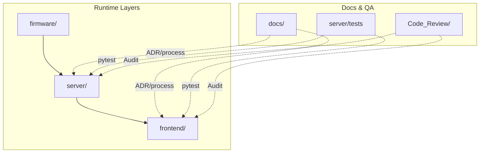
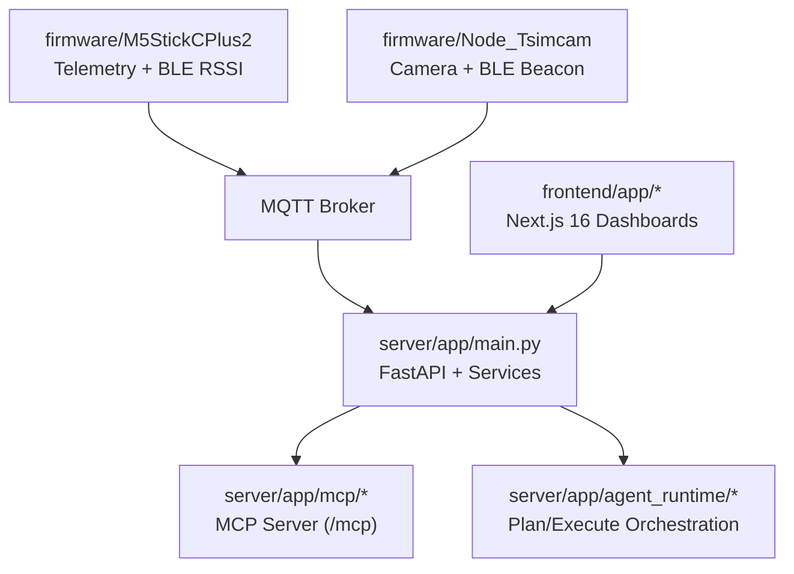
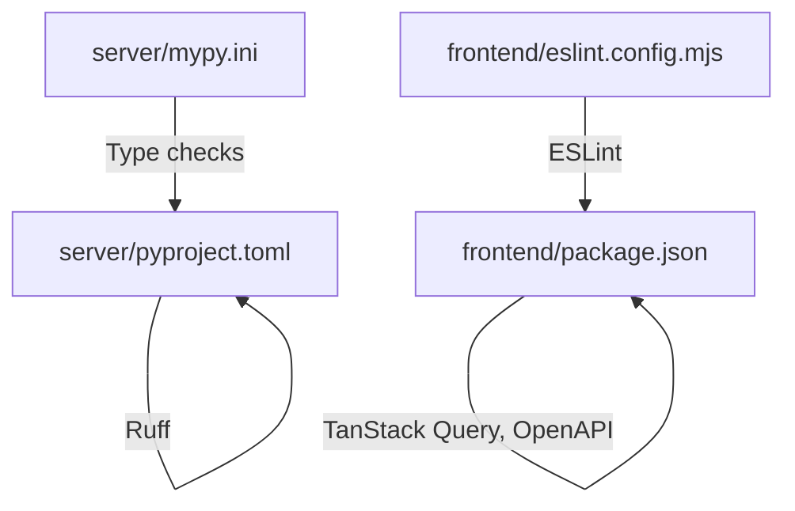

# Development Guidelines

<cite>
**Referenced Files in This Document**
- [README.md](file://README.md)
- [ARCHITECTURE.md](file://docs/ARCHITECTURE.md)
- [server/docs/CONTRIBUTING.md](file://server/docs/CONTRIBUTING.md)
- [server/pyproject.toml](file://server/pyproject.toml)
- [server/mypy.ini](file://server/mypy.ini)
- [frontend/package.json](file://frontend/package.json)
- [frontend/eslint.config.mjs](file://frontend/eslint.config.mjs)
- [firmware/M5StickCPlus2/platformio.ini](file://firmware/M5StickCPlus2/platformio.ini)
- [server/AGENTS.md](file://server/AGENTS.md)
- [docs/adr/README.md](file://docs/adr/README.md)
- [docs/adr/template.md](file://docs/adr/template.md)
- [docs/adr/0001-fastmcp-sse-for-ai-integration.md](file://docs/adr/0001-fastmcp-sse-for-ai-integration.md)
- [docs/adr/0007-tdd-service-layer-architecture.md](file://docs/adr/0007-tdd-service-layer-architecture.md)
- [Code_Review/iter-6/Full-Stack-Code-Review.md](file://Code_Review/iter-6/Full-Stack-Code-Review.md)
- [server/docker-compose.yml](file://server/docker-compose.yml)
- [server/docker-compose.data-prod.yml](file://server/docker-compose.data-prod.yml)
- [server/docker-compose.no-web.yml](file://server/docker-compose.no-web.yml)
- [server/scripts/start-prod.sh](file://server/scripts/start-prod.sh)
- [server/scripts/start-prod.ps1](file://server/scripts/start-prod.ps1)
- [server/tests/test_agent_runtime.py](file://server/tests/test_agent_runtime.py)
- [server/tests/test_chat_actions_integration.py](file://server/tests/test_chat_actions_integration.py)
- [docs/plans/wheelsense-full-roadmap.md](file://docs/plans/wheelsense-full-roadmap.md)
</cite>

## Table of Contents
1. [Introduction](#introduction)
2. [Project Structure](#project-structure)
3. [Core Components](#core-components)
4. [Architecture Overview](#architecture-overview)
5. [Detailed Component Analysis](#detailed-component-analysis)
6. [Dependency Analysis](#dependency-analysis)
7. [Performance Considerations](#performance-considerations)
8. [Troubleshooting Guide](#troubleshooting-guide)
9. [Conclusion](#conclusion)
10. [Appendices](#appendices)

## Introduction
This document provides comprehensive development guidelines for the WheelSense Platform across Python, TypeScript/Next.js, and C++ firmware. It consolidates coding standards, style guides, pull request and code review processes, quality assurance procedures, architectural decision records (ADRs), planning documentation, change management, development workflow, debugging and profiling practices, testing requirements, and deployment procedures. The goal is to ensure consistent, secure, and maintainable development across the backend, frontend, and firmware layers.

## Project Structure
The repository is organized into three primary runtime layers and supporting documentation and testing artifacts:
- server/: FastAPI backend, PostgreSQL models, MQTT ingestion, MCP/LLM integration, CLI, and Home Assistant integration
- frontend/: Next.js 16 role-based dashboards and UI components
- firmware/: PlatformIO projects for M5StickCPlus2 (wheelchair telemetry) and Node_Tsimcam (camera/beacon)
- docs/: architecture overview, ADRs, design notes (`docs/design/`), and implementation plans
- Code_Review/: iterative audits and closure logs

**Section sources**
- [README.md:1-74](file://README.md#L1-L74)
- [ARCHITECTURE.md:1-275](file://docs/ARCHITECTURE.md#L1-L275)

## Core Components
- Backend runtime (Python)
  - FastAPI application, PostgreSQL models, MQTT ingestion, MCP server, AI chat orchestration, and service layer architecture
  - Style and linting via Ruff; type checking via MyPy; tests via PyTest
- Frontend runtime (TypeScript/Next.js)
  - Role-based dashboards, TanStack Query for caching, ESLint configuration, and OpenAPI-generated types
- Firmware runtime (C++)
  - PlatformIO projects for M5StickCPlus2 and Node_Tsimcam with Arduino framework and PubSubClient

**Section sources**
- [server/AGENTS.md:1-614](file://server/AGENTS.md#L1-L614)
- [server/pyproject.toml:1-15](file://server/pyproject.toml#L1-L15)
- [server/mypy.ini:1-3](file://server/mypy.ini#L1-L3)
- [frontend/package.json:1-58](file://frontend/package.json#L1-L58)
- [frontend/eslint.config.mjs:1-19](file://frontend/eslint.config.mjs#L1-L19)
- [firmware/M5StickCPlus2/platformio.ini:1-22](file://firmware/M5StickCPlus2/platformio.ini#L1-L22)

## Architecture Overview
The platform integrates three runtime layers:
- Firmware publishes telemetry and camera data over MQTT
- Backend ingests MQTT, persists data, orchestrates AI/MCP, and exposes REST APIs consumed by the frontend
- Frontend provides role-based dashboards and proxies API requests to the backend

**Diagram sources**
- [ARCHITECTURE.md:322-351](file://docs/ARCHITECTURE.md#L322-L351)
- [server/AGENTS.md:386-425](file://server/AGENTS.md#L386-L425)

**Section sources**
- [ARCHITECTURE.md:1-275](file://docs/ARCHITECTURE.md#L1-L275)
- [server/AGENTS.md:1-614](file://server/AGENTS.md#L1-L614)

## Detailed Component Analysis

### Backend Coding Standards and Style Guides (Python)
- Linting and formatting
  - Ruff configuration enforces style and selected error categories with a maximum line length and target Python version
- Type checking
  - MyPy configuration enables relaxed missing import handling for third-party libraries
- Project metadata
  - pyproject.toml defines project name, version, and Python requirement

Best practices
- Keep endpoint handlers thin; move business logic into services
- Enforce workspace scoping via current user context
- Use SQLAlchemy JSON column patterns consistently
- Add Alembic migrations for schema changes
- Prefer service-layer architecture for testability and maintainability

**Section sources**
- [server/pyproject.toml:1-15](file://server/pyproject.toml#L1-L15)
- [server/mypy.ini:1-3](file://server/mypy.ini#L1-L3)
- [server/docs/CONTRIBUTING.md:67-79](file://server/docs/CONTRIBUTING.md#L67-L79)
- [docs/adr/0007-tdd-service-layer-architecture.md:1-63](file://docs/adr/0007-tdd-service-layer-architecture.md#L1-L63)

### Frontend Coding Standards and Style Guides (TypeScript/Next.js)
- ESLint configuration
  - Extends Next.js core-web-vitals and TypeScript configs; overrides default ignores for build artifacts
- Package scripts
  - Provides dev/build/start/lint and OpenAPI types generation via exported schema
- Client caching and data fetching
  - TanStack Query with namespaced query keys, explicit queryFn, and optional defaults; legacy wrapper removed
- Proxy and auth
  - Next.js app route proxies to backend with cookie-based auth and Authorization header injection

**Section sources**
- [frontend/eslint.config.mjs:1-19](file://frontend/eslint.config.mjs#L1-L19)
- [frontend/package.json:1-58](file://frontend/package.json#L1-L58)
- [ARCHITECTURE.md:140-183](file://docs/ARCHITECTURE.md#L140-L183)
- [server/AGENTS.md:560-590](file://server/AGENTS.md#L560-L590)

### Firmware Coding Standards and Style Guides (C++)
- PlatformIO configuration
  - Board, framework, monitor speed, partitions, build flags, library dependencies, and ignored libraries
- Debugging and logging
  - Build flags include debug level and USB mode settings

**Section sources**
- [firmware/M5StickCPlus2/platformio.ini:1-22](file://firmware/M5StickCPlus2/platformio.ini#L1-L22)

### Pull Request Process and Code Review Guidelines
- PR checklist
  - Correct auth/workspace dependencies, service-layer logic, JSON column patterns, migrations, tests, and documentation updates
- Iterative code reviews
  - Structured audits across backend, frontend, and full-stack flows with closure tracking and remediation logs

**Section sources**
- [server/docs/CONTRIBUTING.md:127-136](file://server/docs/CONTRIBUTING.md#L127-L136)
- [Code_Review/iter-6/Full-Stack-Code-Review.md:1-83](file://Code_Review/iter-6/Full-Stack-Code-Review.md#L1-L83)

### Quality Assurance Procedures
- Backend testing
  - PyTest suites covering auth/API contracts, MQTT/telemetry, device flows, models/schema, services, MCP system, chat actions, and agent runtime
  - Coverage targets and quality gates (coverage, type checks, lint, security scanning)
- Frontend testing
  - TanStack Query patterns, suspense boundaries, and role-specific UI flows
- End-to-end and UX flows
  - Prefer automated checks in `server/tests` and targeted frontend verification; ad-hoc browser reports previously lived under a removed `testing/` tree

**Section sources**
- [server/AGENTS.md:524-559](file://server/AGENTS.md#L524-L559)

### Architectural Decision Record (ADR) Process
- Purpose
  - Capture why the system is shaped a certain way; do not use ADRs as runtime truth
- Template
  - Includes context, decision, alternatives considered, consequences (positive/negative/risks), and status
- Accepted and proposed decisions
  - Examples include FastMCP SSE mounting, dual-path Polar integration, configurable localization strategy, and LLM-native MCP routing

**Section sources**
- [docs/adr/README.md:1-25](file://docs/adr/README.md#L1-L25)
- [docs/adr/template.md:1-45](file://docs/adr/template.md#L1-L45)
- [docs/adr/0001-fastmcp-sse-for-ai-integration.md:1-42](file://docs/adr/0001-fastmcp-sse-for-ai-integration.md#L1-L42)
- [docs/adr/0007-tdd-service-layer-architecture.md:1-63](file://docs/adr/0007-tdd-service-layer-architecture.md#L1-L63)

### Planning Documentation and Change Management
- Execution plans
  - Full roadmap execution plan with loop workflow, agent/model assignments, and Docker smoke checks
- Closure tracking
  - Iterative code review closures and remediation logs

**Section sources**
- [wheelsense-full-roadmap.md:1-173](file://docs/plans/wheelsense-full-roadmap.md#L1-L173)
- [Code_Review/iter-1/README.md:1-10](file://Code_Review/iter-1/README.md#L1-L10)

### Development Workflow, Branching Strategies, and Version Control Practices
- Environment modes
  - Two isolated database modes via Docker Compose: mock/simulator and production
- Profiles and overrides
  - Core stack plus data fragments merged via include; optional disabling of the web container
- Scripts and helpers
  - OS-specific start scripts for production mode with build, reset, and detach options

**Section sources**
- [server/AGENTS.md:72-111](file://server/AGENTS.md#L72-L111)
- [server/docker-compose.yml:1-9](file://server/docker-compose.yml#L1-L9)
- [server/docker-compose.data-prod.yml:1-28](file://server/docker-compose.data-prod.yml#L1-L28)
- [server/docker-compose.no-web.yml:1-15](file://server/docker-compose.no-web.yml#L1-L15)
- [server/scripts/start-prod.sh:1-133](file://server/scripts/start-prod.sh#L1-L133)
- [server/scripts/start-prod.ps1:76-108](file://server/scripts/start-prod.ps1#L76-L108)

### Release Management
- Docker Compose stacks
  - Production and simulator modes with isolated volumes and merged service definitions
- Smoke testing
  - Post-deploy checks including health endpoints, UI availability, and seed verification counts

**Section sources**
- [server/docker-compose.yml:1-9](file://server/docker-compose.yml#L1-L9)
- [server/docker-compose.data-prod.yml:1-28](file://server/docker-compose.data-prod.yml#L1-L28)
- [wheelsense-full-roadmap.md:156-173](file://docs/plans/wheelsense-full-roadmap.md#L156-L173)

### Debugging Procedures, Profiling Techniques, and Performance Optimization
- Backend
  - Logs via Docker Compose; environment detection and simulator reset capabilities; MQTT topic mapping and data flow
- Frontend
  - TanStack Query caching, suspense boundaries, and role-specific UI patterns
- Firmware
  - PlatformIO build flags and library dependencies for telemetry and MQTT

**Section sources**
- [server/AGENTS.md:72-111](file://server/AGENTS.md#L72-L111)
- [server/AGENTS.md:322-351](file://server/AGENTS.md#L322-L351)
- [ARCHITECTURE.md:140-183](file://docs/ARCHITECTURE.md#L140-L183)
- [firmware/M5StickCPlus2/platformio.ini:1-22](file://firmware/M5StickCPlus2/platformio.ini#L1-L22)

### Contribution Guidelines, Community Standards, and Collaboration Practices
- Backend conventions
  - Workspace scoping, service-layer logic, and migration discipline
- Frontend conventions
  - Namespaced TanStack Query keys, explicit query functions, and role navigation patterns
- Collaboration
  - Iterative audits, closure logs, and shared documentation responsibilities

**Section sources**
- [server/docs/CONTRIBUTING.md:67-79](file://server/docs/CONTRIBUTING.md#L67-L79)
- [ARCHITECTURE.md:140-183](file://docs/ARCHITECTURE.md#L140-L183)
- [server/AGENTS.md:599-614](file://server/AGENTS.md#L599-L614)

### Code Documentation Standards and Testing Requirements
- Backend
  - Service-layer architecture, test categories (unit/integration/MQTT), and quality gates
- Frontend
  - Generated OpenAPI types, role contracts, and UI component responsibilities
- Testing
  - Focused PyTest suites under `server/tests`, ADR-0007 service-layer expectations, and targeted frontend checks

**Section sources**
- [docs/adr/0007-tdd-service-layer-architecture.md:1-63](file://docs/adr/0007-tdd-service-layer-architecture.md#L1-L63)
- [server/AGENTS.md:524-559](file://server/AGENTS.md#L524-L559)

### Deployment Procedures
- Production mode
  - Isolated production database volume, environment variables, and health checks
- Simulator mode
  - Pre-seeded demo data and optional synthetic MQTT
- No-web override
  - Running the Next.js app locally while backend runs in Docker

**Section sources**
- [server/docker-compose.data-prod.yml:1-28](file://server/docker-compose.data-prod.yml#L1-L28)
- [server/AGENTS.md:72-111](file://server/AGENTS.md#L72-L111)
- [server/docker-compose.no-web.yml:1-15](file://server/docker-compose.no-web.yml#L1-L15)

## Dependency Analysis
Backend and frontend dependencies are primarily managed via package manifests and configuration files. The backend relies on FastAPI, SQLAlchemy, Alembic, and PyTest; the frontend on Next.js, TanStack Query, and OpenAPI tooling.

**Diagram sources**
- [server/pyproject.toml:1-15](file://server/pyproject.toml#L1-L15)
- [server/mypy.ini:1-3](file://server/mypy.ini#L1-L3)
- [frontend/eslint.config.mjs:1-19](file://frontend/eslint.config.mjs#L1-L19)
- [frontend/package.json:1-58](file://frontend/package.json#L1-L58)

**Section sources**
- [server/pyproject.toml:1-15](file://server/pyproject.toml#L1-L15)
- [server/mypy.ini:1-3](file://server/mypy.ini#L1-L3)
- [frontend/eslint.config.mjs:1-19](file://frontend/eslint.config.mjs#L1-L19)
- [frontend/package.json:1-58](file://frontend/package.json#L1-L58)

## Performance Considerations
- Backend
  - Service-layer architecture reduces duplication and improves testability; quality gates help maintain performance and reliability
- Frontend
  - TanStack Query caching and suspense boundaries improve perceived performance; incremental adoption of server components is advised
- Firmware
  - Build flags and partition settings impact runtime stability and memory usage

[No sources needed since this section provides general guidance]

## Troubleshooting Guide
- Backend
  - Use Docker Compose logs for the server container; verify environment mode and simulator reset capabilities
  - Validate MQTT topic mapping and data flow through the ingestion pipeline
- Frontend
  - Confirm proxy behavior, cookie-based auth, and TanStack Query key patterns
- Firmware
  - Inspect build flags and library dependencies for telemetry and MQTT connectivity

**Section sources**
- [server/AGENTS.md:72-111](file://server/AGENTS.md#L72-L111)
- [server/AGENTS.md:322-351](file://server/AGENTS.md#L322-L351)
- [ARCHITECTURE.md:140-183](file://docs/ARCHITECTURE.md#L140-L183)
- [firmware/M5StickCPlus2/platformio.ini:1-22](file://firmware/M5StickCPlus2/platformio.ini#L1-L22)

## Conclusion
These guidelines consolidate WheelSense Platform development practices across Python, TypeScript/Next.js, and C++. By adhering to service-layer architecture, strict testing, documented ADRs, and disciplined deployment procedures, contributors can maintain a secure, scalable, and user-centric system.

[No sources needed since this section summarizes without analyzing specific files]

## Appendices

### Practical Examples of Development Workflows and Code Quality Practices
- Backend
  - Use Ruff and MyPy as part of the quality gates; run focused PyTest suites after changes affecting auth, MQTT, devices, models, MCP, chat actions, and agent runtime
- Frontend
  - Maintain namespaced TanStack Query keys and generated OpenAPI types; leverage suspense boundaries where beneficial
- Firmware
  - Verify build flags and library dependencies for stable telemetry and MQTT operations

**Section sources**
- [server/AGENTS.md:524-559](file://server/AGENTS.md#L524-L559)
- [ARCHITECTURE.md:140-183](file://docs/ARCHITECTURE.md#L140-L183)
- [firmware/M5StickCPlus2/platformio.ini:1-22](file://firmware/M5StickCPlus2/platformio.ini#L1-L22)