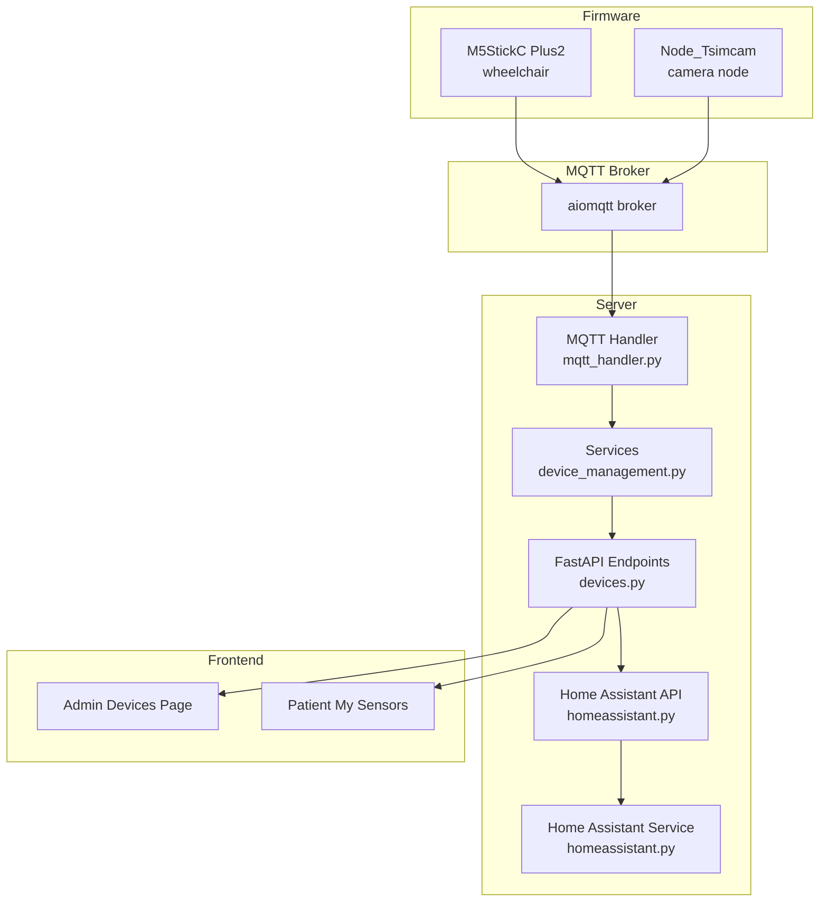
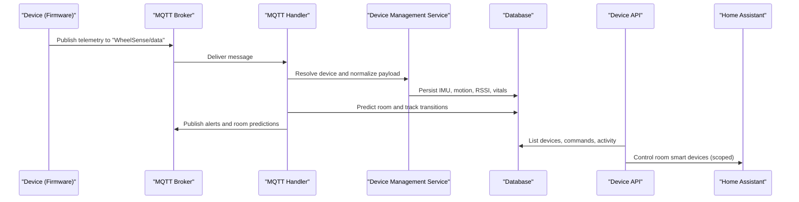
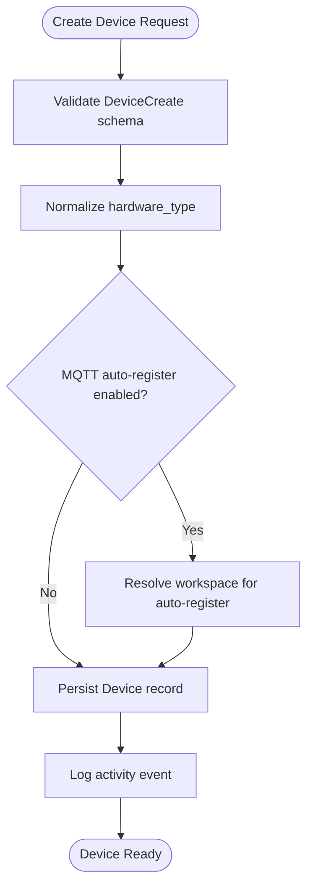
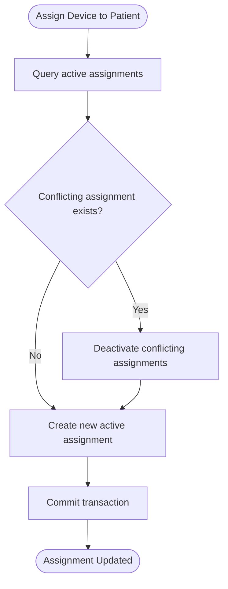
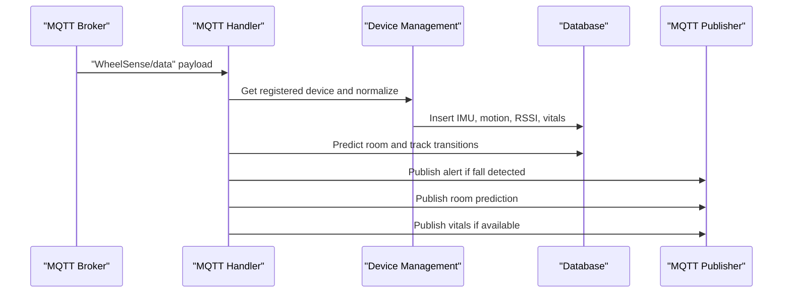
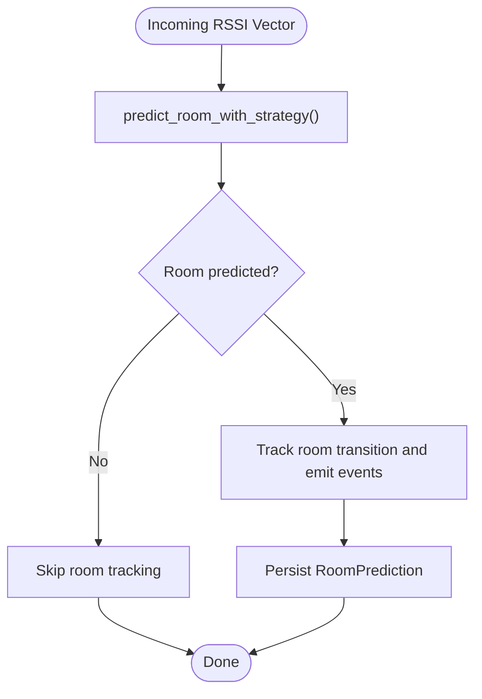
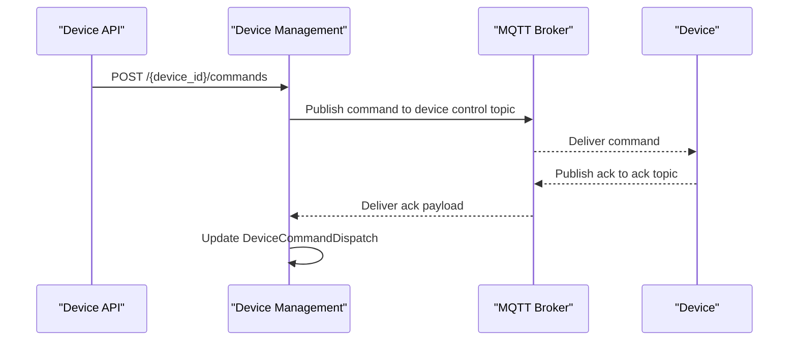
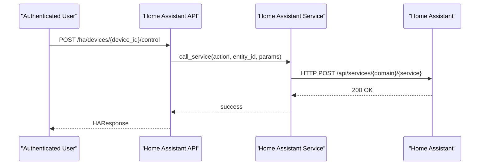
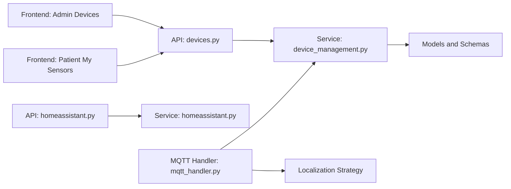

# Device Management

<cite>
**Referenced Files in This Document**
- [devices.py](file://server/app/api/endpoints/devices.py)
- [devices.py](file://server/app/schemas/devices.py)
- [device_management.py](file://server/app/services/device_management.py)
- [mqtt_handler.py](file://server/app/mqtt_handler.py)
- [homeassistant.py](file://server/app/api/endpoints/homeassistant.py)
- [homeassistant.py](file://server/app/services/homeassistant.py)
- [TELEMETRY_CONTRACT.md](file://firmware/TELEMETRY_CONTRACT.md)
- [test_mqtt_phase4.py](file://server/tests/test_mqtt_phase4.py)
- [test_system_flows.py](file://server/tests/e2e/test_system_flows.py)
- [test_patient.py](file://server/tests/test_services/test_patient.py)
- [localization_setup.py](file://server/app/services/localization_setup.py)
- [MCP-README.md](file://docs/MCP-README.md)
- [server.py](file://server/app/mcp/server.py)
- [page.tsx](file://frontend/app/admin/devices/page.tsx)
- [PatientMySensors.tsx](file://frontend/components/patient/PatientMySensors.tsx)
</cite>

## Table of Contents
1. [Introduction](#introduction)
2. [Project Structure](#project-structure)
3. [Core Components](#core-components)
4. [Architecture Overview](#architecture-overview)
5. [Detailed Component Analysis](#detailed-component-analysis)
6. [Dependency Analysis](#dependency-analysis)
7. [Performance Considerations](#performance-considerations)
8. [Troubleshooting Guide](#troubleshooting-guide)
9. [Conclusion](#conclusion)
10. [Appendices](#appendices)

## Introduction
This document provides comprehensive device management documentation for the WheelSense Platform. It covers the device registry system, device lifecycle management, and patient-device assignment. It explains the telemetry processing pipeline from MQTT messages to database storage and real-time alert generation. It details localization algorithms using RSSI data for room positioning and presence detection. It also documents device activity tracking, status monitoring, and health reporting; the device command execution system; smart device control through Home Assistant integration; room controls management; device provisioning and firmware updates; and device security, authentication, and access control. Practical examples of device integration and custom device support are included.

## Project Structure
The device management system spans the server backend (FastAPI, SQLAlchemy, MQTT), firmware (M5StickC Plus2 and Node_Tsimcam), and the frontend (Next.js). Key areas include:
- Device registry and lifecycle: API endpoints, schemas, and services
- Telemetry ingestion and processing: MQTT handler and alerting logic
- Localization: RSSI-based room prediction and room transitions
- Command dispatch and control: device commands and Home Assistant integration
- Frontend dashboards: device listing, activity, and health views

**Diagram sources**
- [devices.py:186-221](file://server/app/api/endpoints/devices.py#L186-L221)
- [device_management.py:162-200](file://server/app/services/device_management.py#L162-L200)
- [mqtt_handler.py:73-137](file://server/app/mqtt_handler.py#L73-L137)
- [homeassistant.py:65-82](file://server/app/api/endpoints/homeassistant.py#L65-L82)
- [homeassistant.py:11-76](file://server/app/services/homeassistant.py#L11-L76)
- [page.tsx:315-332](file://frontend/app/admin/devices/page.tsx#L315-L332)
- [PatientMySensors.tsx:1-45](file://frontend/components/patient/PatientMySensors.tsx#L1-L45)

**Section sources**
- [devices.py:63-88](file://server/app/api/endpoints/devices.py#L63-L88)
- [device_management.py:127-200](file://server/app/services/device_management.py#L127-L200)
- [mqtt_handler.py:139-325](file://server/app/mqtt_handler.py#L139-L325)
- [homeassistant.py:65-82](file://server/app/api/endpoints/homeassistant.py#L65-L82)
- [homeassistant.py:11-76](file://server/app/services/homeassistant.py#L11-L76)
- [page.tsx:315-332](file://frontend/app/admin/devices/page.tsx#L315-L332)
- [PatientMySensors.tsx:1-45](file://frontend/components/patient/PatientMySensors.tsx#L1-L45)

## Core Components
- Device Registry and Lifecycle
  - Device creation, patching, deletion, and listing
  - Device detail retrieval and command history
  - Mobile telemetry ingestion
- Device-Patient Assignment
  - Active assignment enforcement
  - Unassignment and deactivation
- Telemetry Pipeline
  - MQTT ingestion, persistence, and alerting
  - Room prediction and presence tracking
- Localization
  - RSSI-based room inference and calibration
- Commands and Controls
  - Command dispatch and acknowledgments
  - Home Assistant integration for room controls
- Frontend Views
  - Admin device listing and health
  - Patient device metrics and assignments

**Section sources**
- [devices.py:186-221](file://server/app/api/endpoints/devices.py#L186-L221)
- [devices.py:125-133](file://server/app/api/endpoints/devices.py#L125-L133)
- [devices.py:136-144](file://server/app/api/endpoints/devices.py#L136-L144)
- [device_management.py:963-999](file://server/app/services/device_management.py#L963-L999)
- [mqtt_handler.py:139-325](file://server/app/mqtt_handler.py#L139-L325)
- [localization_setup.py:527-557](file://server/app/services/localization_setup.py#L527-L557)
- [homeassistant.py:187-223](file://server/app/api/endpoints/homeassistant.py#L187-L223)

## Architecture Overview
The system ingests device telemetry over MQTT, persists it to the database, triggers alerts, predicts room locations, and publishes real-time updates. Administrators can manage devices and issue commands. Home Assistant integration enables room control actions scoped to users’ roles and rooms.

**Diagram sources**
- [mqtt_handler.py:100-125](file://server/app/mqtt_handler.py#L100-L125)
- [mqtt_handler.py:139-325](file://server/app/mqtt_handler.py#L139-L325)
- [device_management.py:162-200](file://server/app/services/device_management.py#L162-L200)
- [devices.py:90-123](file://server/app/api/endpoints/devices.py#L90-L123)
- [homeassistant.py:187-223](file://server/app/api/endpoints/homeassistant.py#L187-L223)

## Detailed Component Analysis

### Device Registry and Lifecycle
- Device Registration
  - Create device records with device_id, device_type, hardware_type, and display_name
  - Automatic registration on first telemetry when enabled
- Device Patching and Deletion
  - Safe config updates excluding sensitive provisioning keys
  - Audit logging for registry changes
- Device Listing and Detail
  - Role-scoped listing and detail retrieval
  - Mobile telemetry ingestion endpoint

**Diagram sources**
- [devices.py:186-202](file://server/app/api/endpoints/devices.py#L186-L202)
- [device_management.py:162-200](file://server/app/services/device_management.py#L162-L200)

**Section sources**
- [devices.py:186-221](file://server/app/api/endpoints/devices.py#L186-L221)
- [devices.py:63-88](file://server/app/api/endpoints/devices.py#L63-L88)
- [devices.py:125-133](file://server/app/api/endpoints/devices.py#L125-L133)
- [devices.py:136-144](file://server/app/api/endpoints/devices.py#L136-L144)
- [device_management.py:127-200](file://server/app/services/device_management.py#L127-L200)

### Device-Patient Assignment
- Active Assignment Enforcement
  - When assigning a device to a patient for a role, deactivate conflicting active assignments
  - Ensure only one active assignment per patient and per device role
- Unassignment
  - Deactivate active assignment and record unassigned_at

**Diagram sources**
- [patient.py:111-141](file://server/tests/test_services/test_patient.py#L111-L141)
- [devices.py:294-313](file://server/app/api/endpoints/devices.py#L294-L313)

**Section sources**
- [patient.py:111-141](file://server/tests/test_services/test_patient.py#L111-L141)
- [devices.py:294-313](file://server/app/api/endpoints/devices.py#L294-L313)
- [devices.py:146-184](file://server/app/api/endpoints/devices.py#L146-L184)

### Telemetry Processing Pipeline
- MQTT Ingestion
  - Subscribe to telemetry and control topics
  - Parse and validate payloads
- Persistence
  - Store IMU, motion, battery, RSSI, and optional vitals
  - Merge BLE node devices from RSSI
- Alerts and Room Tracking
  - Detect falls based on thresholds and publish alerts
  - Predict rooms via RSSI and track room transitions
- Real-time Publishing
  - Publish vitals, alerts, and room predictions to downstream topics

**Diagram sources**
- [mqtt_handler.py:100-125](file://server/app/mqtt_handler.py#L100-L125)
- [mqtt_handler.py:139-325](file://server/app/mqtt_handler.py#L139-L325)

**Section sources**
- [mqtt_handler.py:139-325](file://server/app/mqtt_handler.py#L139-L325)
- [TELEMETRY_CONTRACT.md:7-34](file://firmware/TELEMETRY_CONTRACT.md#L7-L34)
- [test_mqtt_phase4.py:261-333](file://server/tests/test_mqtt_phase4.py#L261-L333)
- [test_system_flows.py:10-86](file://server/tests/e2e/test_system_flows.py#L10-L86)

### Localization Algorithms (RSSI-based Room Positioning)
- Room Prediction
  - Build RSSI vector from incoming telemetry
  - Apply configurable localization strategy (KNN fingerprinting or strongest RSSI)
- Room Transitions
  - Track previous room per device and emit enter/exit events
- Auto-creation and Binding
  - Auto-create rooms and bind node devices when missing
  - Raise explicit errors if binding cannot be resolved

**Diagram sources**
- [mqtt_handler.py:253-276](file://server/app/mqtt_handler.py#L253-L276)
- [localization_setup.py:527-557](file://server/app/services/localization_setup.py#L527-L557)

**Section sources**
- [mqtt_handler.py:253-276](file://server/app/mqtt_handler.py#L253-L276)
- [localization_setup.py:527-557](file://server/app/services/localization_setup.py#L527-L557)

### Device Command Execution System
- Command Dispatch
  - Send commands via MQTT channels (e.g., wheelchair, camera)
  - Persist dispatch records with status and timestamps
- Acknowledgment Handling
  - Receive ack payloads and update dispatch records
- Camera Commands
  - Dedicated endpoints for camera checks and command routing

**Diagram sources**
- [devices.py:241-263](file://server/app/api/endpoints/devices.py#L241-L263)
- [devices.py:265-310](file://server/app/api/endpoints/devices.py#L265-L310)
- [mqtt_handler.py:575-588](file://server/app/mqtt_handler.py#L575-L588)

**Section sources**
- [devices.py:241-263](file://server/app/api/endpoints/devices.py#L241-L263)
- [devices.py:265-310](file://server/app/api/endpoints/devices.py#L265-L310)
- [mqtt_handler.py:575-588](file://server/app/mqtt_handler.py#L575-L588)

### Smart Device Control via Home Assistant Integration
- Device Discovery and Mapping
  - Admin links Home Assistant entities to platform SmartDevice records
- Scoped Access Control
  - Patient access restricted to their room’s devices
- Control and State Queries
  - Execute services and fetch states via HA API
- MCP Tool Integration
  - MCP tool for controlled room device control with scope enforcement

**Diagram sources**
- [homeassistant.py:187-223](file://server/app/api/endpoints/homeassistant.py#L187-L223)
- [homeassistant.py:42-73](file://server/app/services/homeassistant.py#L42-L73)
- [server.py:687-706](file://server/app/mcp/server.py#L687-L706)

**Section sources**
- [homeassistant.py:65-82](file://server/app/api/endpoints/homeassistant.py#L65-L82)
- [homeassistant.py:187-223](file://server/app/api/endpoints/homeassistant.py#L187-L223)
- [homeassistant.py:11-76](file://server/app/services/homeassistant.py#L11-L76)
- [server.py:687-706](file://server/app/mcp/server.py#L687-L706)

### Device Provisioning, Firmware Updates, and Security
- Provisioning
  - Firmware enforces strict MQTT topic contracts; device_id must match registry
  - Auto-registration supported when workspace is determinable
- Firmware Updates
  - Firmware images managed externally; server tracks firmware version per device
- Security and Access Control
  - Non-public config keys excluded from patches
  - Role-based access to device management and commands
  - Patient access to devices limited to assigned devices or room-scoped devices

**Section sources**
- [TELEMETRY_CONTRACT.md:32-34](file://firmware/TELEMETRY_CONTRACT.md#L32-L34)
- [device_management.py:50-68](file://server/app/services/device_management.py#L50-L68)
- [devices.py:53-61](file://server/app/api/endpoints/devices.py#L53-L61)
- [devices.py:72-81](file://server/app/api/endpoints/devices.py#L72-L81)

### Device Activity Tracking, Status Monitoring, and Health Reporting
- Activity Logging
  - Registry changes, command dispatches, pairing events logged as DeviceActivityEvent
- Status Monitoring
  - Node status telemetry persisted and cached in device config
  - Frontend displays firmware version and last seen timestamps
- Health Reporting
  - Admin dashboard surfaces device health and recent activity

**Section sources**
- [devices.py:53-61](file://server/app/api/endpoints/devices.py#L53-L61)
- [devices.py:204-221](file://server/app/api/endpoints/devices.py#L204-L221)
- [mqtt_handler.py:458-482](file://server/app/mqtt_handler.py#L458-L482)
- [page.tsx:315-332](file://frontend/app/admin/devices/page.tsx#L315-L332)

## Dependency Analysis
The device management system exhibits clear separation of concerns:
- API endpoints depend on services for business logic
- Services depend on models and schemas for persistence and validation
- MQTT handler depends on services for device resolution and on localization for room prediction
- Home Assistant integration is encapsulated behind a service abstraction

**Diagram sources**
- [devices.py:1-38](file://server/app/api/endpoints/devices.py#L1-L38)
- [device_management.py:1-50](file://server/app/services/device_management.py#L1-L50)
- [mqtt_handler.py:1-48](file://server/app/mqtt_handler.py#L1-L48)
- [homeassistant.py:1-25](file://server/app/api/endpoints/homeassistant.py#L1-L25)
- [homeassistant.py:1-20](file://server/app/services/homeassistant.py#L1-L20)
- [page.tsx:315-332](file://frontend/app/admin/devices/page.tsx#L315-L332)
- [PatientMySensors.tsx:1-45](file://frontend/components/patient/PatientMySensors.tsx#L1-L45)

**Section sources**
- [devices.py:1-38](file://server/app/api/endpoints/devices.py#L1-L38)
- [device_management.py:1-50](file://server/app/services/device_management.py#L1-L50)
- [mqtt_handler.py:1-48](file://server/app/mqtt_handler.py#L1-L48)
- [homeassistant.py:1-25](file://server/app/api/endpoints/homeassistant.py#L1-L25)
- [homeassistant.py:1-20](file://server/app/services/homeassistant.py#L1-L20)

## Performance Considerations
- Asynchronous I/O
  - MQTT handler and database operations use async sessions to minimize latency
- Batch Writes
  - Multiple telemetry samples are inserted in a single transaction commit
- Deduplication and Cooldown
  - Fall detection cooldown prevents repeated alerts during short intervals
- Room Transition Debounce
  - Room tracker avoids duplicate enter events for the same room

[No sources needed since this section provides general guidance]

## Troubleshooting Guide
- Device Not Appearing in Registry
  - Ensure device_id matches backend registry or enable MQTT auto-registration with a single workspace
- No Telemetry Stored
  - Verify MQTT broker connectivity and topic subscriptions
  - Confirm device firmware publishes to correct topics
- Alerts Not Generated
  - Check fall thresholds and velocity conditions
  - Verify patient-device assignment exists for device
- Room Predictions Missing
  - Ensure RSSI samples are present and node devices are registered
  - Confirm localization strategy configuration
- Home Assistant Control Failures
  - Verify HA access token and base URL are configured
  - Confirm entity_id exists and user has appropriate role scope
- Device Commands Not Acknowledged
  - Confirm device subscribes to ack topic and responds with proper ack payload

**Section sources**
- [TELEMETRY_CONTRACT.md:32-34](file://firmware/TELEMETRY_CONTRACT.md#L32-L34)
- [mqtt_handler.py:139-325](file://server/app/mqtt_handler.py#L139-L325)
- [test_mqtt_phase4.py:261-333](file://server/tests/test_mqtt_phase4.py#L261-L333)
- [homeassistant.py:11-76](file://server/app/services/homeassistant.py#L11-L76)
- [homeassistant.py:187-223](file://server/app/api/endpoints/homeassistant.py#L187-L223)

## Conclusion
The WheelSense Platform provides a robust device management ecosystem with secure, role-scoped access, comprehensive telemetry ingestion, intelligent localization, and integrated control capabilities. The modular architecture supports extensibility for custom devices and workflows, while built-in safeguards ensure reliability and safety in healthcare environments.

[No sources needed since this section summarizes without analyzing specific files]

## Appendices

### Practical Examples

- Device Integration Checklist
  - Provision device_id and ensure firmware publishes to correct topics
  - Register device in backend or rely on MQTT auto-registration
  - Assign device to patient and verify active assignment
  - Confirm RSSI visibility for localization and room tracking
  - Configure Home Assistant integration for room controls

- Custom Device Support
  - Extend hardware_type and device_type to support new device categories
  - Define MQTT contracts aligned with firmware telemetry and control topics
  - Integrate alerting and localization rules for new sensors or actuators

**Section sources**
- [TELEMETRY_CONTRACT.md:7-34](file://firmware/TELEMETRY_CONTRACT.md#L7-L34)
- [devices.py:10-17](file://server/app/schemas/devices.py#L10-L17)
- [MCP-README.md](file://docs/MCP-README.md)