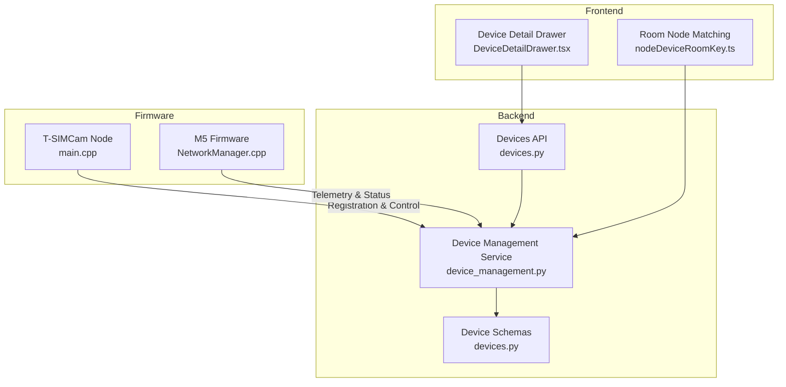
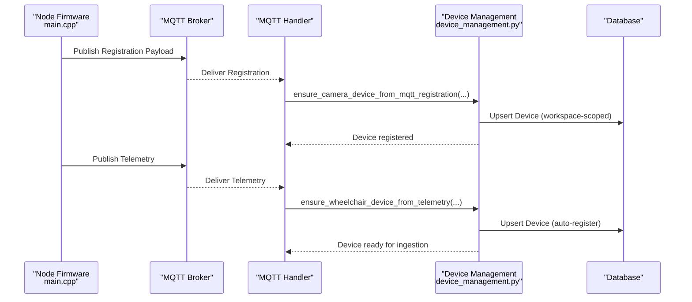
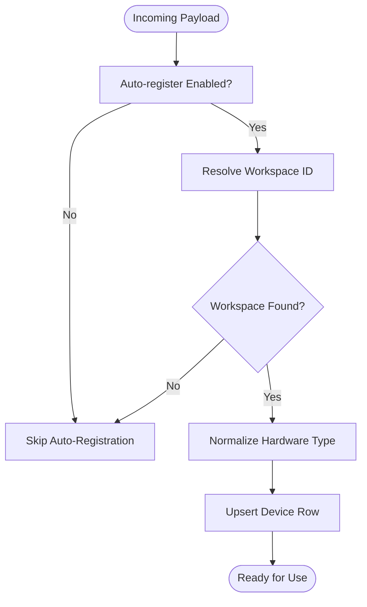
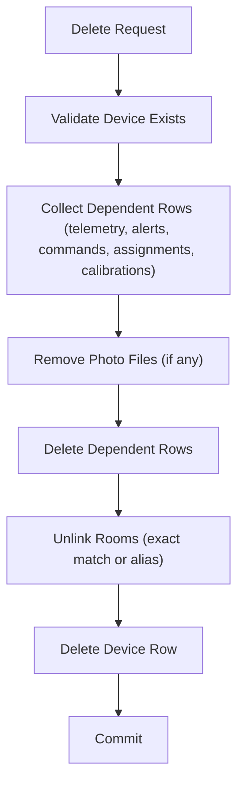
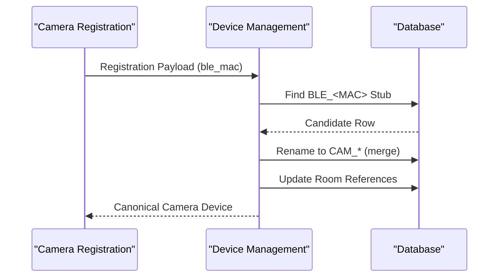
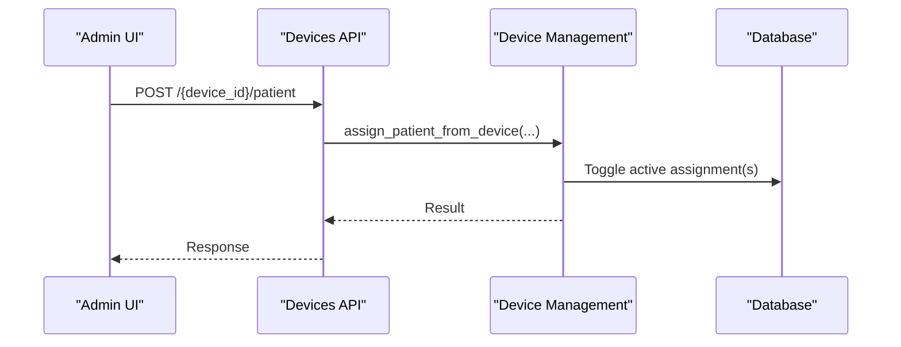
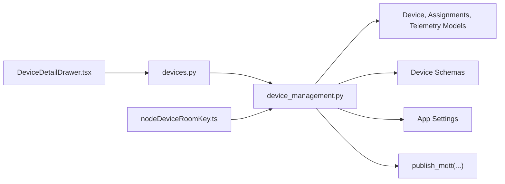

# Device Registry

<cite>
**Referenced Files in This Document**
- [device_management.py](file://server/app/services/device_management.py)
- [devices.py](file://server/app/api/endpoints/devices.py)
- [devices.py](file://server/app/schemas/devices.py)
- [devices.py](file://server/tests/test_devices_mvp.py)
- [test_mqtt_handler.py](file://server/tests/test_mqtt_handler.py)
- [seed_device_extras.py](file://server/seed_device_extras.py)
- [main.cpp](file://firmware/Node_Tsimcam/src/main.cpp)
- [NetworkManager.cpp](file://firmware/M5StickCPlus2/src/managers/NetworkManager.cpp)
- [nodeDeviceRoomKey.ts](file://frontend/lib/nodeDeviceRoomKey.ts)
- [DeviceDetailDrawer.tsx](file://frontend/components/admin/devices/DeviceDetailDrawer.tsx)
- [phase2-device-management.md](file://.agents/changes/phase2-device-management.md)
- [0010-phase2-device-fleet-control-plane.md](file://docs/adr/0010-phase2-device-fleet-control-plane.md)
</cite>

## Table of Contents
1. [Introduction](#introduction)
2. [Project Structure](#project-structure)
3. [Core Components](#core-components)
4. [Architecture Overview](#architecture-overview)
5. [Detailed Component Analysis](#detailed-component-analysis)
6. [Dependency Analysis](#dependency-analysis)
7. [Performance Considerations](#performance-considerations)
8. [Troubleshooting Guide](#troubleshooting-guide)
9. [Conclusion](#conclusion)
10. [Appendices](#appendices)

## Introduction
This document describes the WheelSense device registry and lifecycle management. It covers device creation, validation, normalization, configuration security, automatic registration from telemetry, MQTT auto-registration settings, workspace scoping, deletion with cascade cleanup, assignment management (patient and caregiver), and practical integration patterns. It also outlines device types and hardware classifications, and provides troubleshooting guidance for common registration issues.

## Project Structure
The device registry spans backend services, API endpoints, schemas, firmware, and frontend components:
- Backend services orchestrate device creation, updates, deletion, auto-registration, and command dispatch.
- API endpoints expose device CRUD, commands, and activity logs.
- Schemas define allowed device types and configuration structures.
- Firmware publishes registration and telemetry payloads to enable auto-registration.
- Frontend supports device detail editing and room-node matching.

**Diagram sources**
- [device_management.py](file://server/app/services/device_management.py)
- [devices.py](file://server/app/api/endpoints/devices.py)
- [devices.py](file://server/app/schemas/devices.py)
- [main.cpp](file://firmware/Node_Tsimcam/src/main.cpp)
- [NetworkManager.cpp](file://firmware/M5StickCPlus2/src/managers/NetworkManager.cpp)
- [DeviceDetailDrawer.tsx](file://frontend/components/admin/devices/DeviceDetailDrawer.tsx)
- [nodeDeviceRoomKey.ts](file://frontend/lib/nodeDeviceRoomKey.ts)

**Section sources**
- [device_management.py](file://server/app/services/device_management.py)
- [devices.py](file://server/app/api/endpoints/devices.py)
- [devices.py](file://server/app/schemas/devices.py)
- [main.cpp](file://firmware/Node_Tsimcam/src/main.cpp)
- [NetworkManager.cpp](file://firmware/M5StickCPlus2/src/managers/NetworkManager.cpp)
- [DeviceDetailDrawer.tsx](file://frontend/components/admin/devices/DeviceDetailDrawer.tsx)
- [nodeDeviceRoomKey.ts](file://frontend/lib/nodeDeviceRoomKey.ts)

## Core Components
- Device registry service: central logic for device creation, updates, deletion, auto-registration, merging, and command dispatch.
- Devices API: REST endpoints for listing, creating, patching, deleting, assigning, and commanding devices.
- Device schemas: typed definitions for device creation, patching, and configuration.
- Firmware: publishes registration and telemetry payloads enabling auto-registration.
- Frontend: device detail editing and room-node matching helpers.

Key capabilities:
- Device types and hardware classification: wheelchair, node (camera), polar_sense, mobile_phone.
- Device ID normalization and validation for MQTT safety.
- Automatic device registration from telemetry and MQTT registration/status.
- Workspace-scoped uniqueness and scoping for auto-registration.
- Non-public configuration security (WiFi/MQTT provisioning keys).
- Device deletion with cascade cleanup and assignment handling.
- Device merging strategies (BLE stub to camera).
- Practical CRUD and integration patterns.

**Section sources**
- [device_management.py](file://server/app/services/device_management.py)
- [devices.py](file://server/app/api/endpoints/devices.py)
- [devices.py](file://server/app/schemas/devices.py)

## Architecture Overview
The device registry integrates with MQTT telemetry and firmware payloads to automatically register devices when enabled. Workspace scoping ensures isolation and prevents ambiguity. The service enforces validation, normalization, and security policies while supporting device lifecycle operations.

**Diagram sources**
- [main.cpp](file://firmware/Node_Tsimcam/src/main.cpp)
- [device_management.py](file://server/app/services/device_management.py)
- [test_mqtt_handler.py](file://server/tests/test_mqtt_handler.py)

**Section sources**
- [device_management.py](file://server/app/services/device_management.py)
- [main.cpp](file://firmware/Node_Tsimcam/src/main.cpp)
- [test_mqtt_handler.py](file://server/tests/test_mqtt_handler.py)

## Detailed Component Analysis

### Device Types and Hardware Classifications
- Allowed hardware types: wheelchair, node, polar_sense, mobile_phone.
- Legacy device_type normalization: node devices are stored with device_type "camera" for MQTT/camera topic compatibility.
- Device type inference from telemetry payload supports backward compatibility.

Practical implications:
- Use hardware_type for modern routing and UI categorization.
- device_type remains "camera" for node devices to preserve MQTT paths.

**Section sources**
- [devices.py](file://server/app/schemas/devices.py)
- [device_management.py](file://server/app/services/device_management.py)
- [seed_device_extras.py](file://server/seed_device_extras.py)

### Device ID Normalization and Validation
- Device IDs are normalized and validated for MQTT safety:
  - Length limits and forbidden values (e.g., "unknown").
  - Strict validation during auto-registration and ingestion.
- Telemetry-safe normalization defaults unknown values to wheelchair.

Validation rules:
- Minimum length 1, maximum 32 characters.
- Disallow "unknown".

**Section sources**
- [device_management.py](file://server/app/services/device_management.py)

### Configuration Security (Non-Public Keys)
- Non-public configuration keys are excluded from frontend exposure and activity logs:
  - wifi_ssid, wifi_password, mqtt_broker, mqtt_user, mqtt_password, wifi_scan_results.
- Patch merges exclude non-public keys; sanitized copies are logged.

Security guidance:
- Provision WiFi/MQTT credentials via firmware or ops tooling, not device PATCH requests.
- Treat non-public keys as secrets.

**Section sources**
- [device_management.py](file://server/app/services/device_management.py)
- [devices.py](file://server/app/api/endpoints/devices.py)

### Automatic Device Registration from Telemetry and MQTT
- Auto-registration is controlled by settings:
  - mqtt_auto_register_devices: enable/disable.
  - mqtt_auto_register_workspace_id: explicit workspace selection.
- Resolution logic:
  - If workspace_id is set, use it.
  - If zero or multiple workspaces exist, skip auto-registration and log warnings.
- Telemetry auto-registration:
  - Creates wheelchair registry rows on first WheelSense/data payload.
  - Uses telemetry device_type/hardware_type with fallback normalization.
- MQTT registration:
  - Creates camera node rows on first WheelSense/camera/{id}/registration.
  - Extracts node_id, ble_mac, firmware, ip_address, and sets last_seen.
- BLE node auto-registration:
  - Creates node registry rows from wheelchair RSSI reports.
  - Prevents duplicates by MAC and cleans up stubs.

**Diagram sources**
- [device_management.py](file://server/app/services/device_management.py)
- [test_mqtt_handler.py](file://server/tests/test_mqtt_handler.py)

**Section sources**
- [device_management.py](file://server/app/services/device_management.py)
- [test_mqtt_handler.py](file://server/tests/test_mqtt_handler.py)

### Workspace Scoping
- Device registry is scoped to the current workspace.
- Auto-registration respects workspace scoping and disallows ambiguous multi-workspace scenarios.
- Deletion cascades within the workspace scope.

Operational note:
- Set MQTT_AUTO_REGISTER_WORKSPACE_ID to avoid ambiguity when multiple workspaces exist.

**Section sources**
- [device_management.py](file://server/app/services/device_management.py)

### Device Lifecycle Management
- Create: Enforce uniqueness by device_id per workspace; normalize hardware type; set display_name.
- Patch: Update display_name and config (excluding non-public keys).
- Delete: Cascade deletes telemetry, alerts, command dispatches, assignments, calibration sessions, and room references; remove photo files if present.

**Diagram sources**
- [device_management.py](file://server/app/services/device_management.py)

**Section sources**
- [device_management.py](file://server/app/services/device_management.py)

### Device Merging Strategies
- BLE stub to camera merge:
  - When BLE_<MAC> stub matches camera’s ble_mac, rename stub to camera device_id.
  - Updates device_type/hardware_type, firmware, IP, display_name, and marks merge.
  - Moves room node_device_id references and cleans duplicates.
- Race handling:
  - Uses nested transactions and reloads to handle concurrent writers.

**Diagram sources**
- [device_management.py](file://server/app/services/device_management.py)
- [test_mqtt_handler.py](file://server/tests/test_mqtt_handler.py)

**Section sources**
- [device_management.py](file://server/app/services/device_management.py)
- [test_mqtt_handler.py](file://server/tests/test_mqtt_handler.py)

### Device Assignments
- Patient-device assignment:
  - Activate/unassign via device endpoint; maintains active-only constraint.
  - Activity events logged on pairing/unpairing.
- Caregiver-device assignment:
  - Enforces active-only constraint per device_id or per caregiver+role.
  - Supports listing and creating assignments.

**Diagram sources**
- [devices.py](file://server/app/api/endpoints/devices.py)
- [device_management.py](file://server/app/services/device_management.py)

**Section sources**
- [devices.py](file://server/app/api/endpoints/devices.py)
- [device_management.py](file://server/app/services/device_management.py)

### Device Commands and MQTT Integration
- Command dispatch:
  - Validates channel vs hardware_type.
  - Builds topics: WheelSense/{device_id}/control or WheelSense/camera/{mqtt_id}/control.
  - Persists dispatch row and publishes MQTT; captures acks.
- Camera control:
  - Supports snapshot capture and stream/resolution commands.
- MQTT auto-registration for camera:
  - On registration/status, creates/updates camera node device with node_id and BLE MAC.

**Section sources**
- [device_management.py](file://server/app/services/device_management.py)
- [devices.py](file://server/app/api/endpoints/devices.py)
- [main.cpp](file://firmware/Node_Tsimcam/src/main.cpp)

### Frontend Integration Patterns
- Device detail editing:
  - Display name editing and saving.
- Room-node matching:
  - Matches room node IDs against device_id, preferred key, config ble_node_id, and WSN_* extracted from display_name.

**Section sources**
- [DeviceDetailDrawer.tsx](file://frontend/components/admin/devices/DeviceDetailDrawer.tsx)
- [nodeDeviceRoomKey.ts](file://frontend/lib/nodeDeviceRoomKey.ts)

### Practical Examples
- Create a device:
  - Endpoint: POST /api/devices
  - Body: device_id, device_type, hardware_type, display_name
  - Response: id, device_id, hardware_type
- Patch device:
  - Endpoint: PATCH /api/devices/{device_id}
  - Body: display_name, config (non-public keys ignored)
- Delete device:
  - Endpoint: DELETE /api/devices/{device_id}
  - Behavior: cascade cleanup within workspace
- Send command:
  - Endpoint: POST /api/devices/{device_id}/commands
  - Body: channel, payload
- Camera command:
  - Endpoint: POST /api/devices/cameras/{device_id}/command
  - Body: command, interval_ms, resolution

**Section sources**
- [devices.py](file://server/app/api/endpoints/devices.py)
- [device_management.py](file://server/app/services/device_management.py)

## Dependency Analysis
The device registry service depends on:
- SQLAlchemy models for devices, assignments, telemetry, and room references.
- Pydantic schemas for request/response validation.
- MQTT publishing utilities for command dispatch.
- Configuration settings for auto-registration and security.

**Diagram sources**
- [device_management.py](file://server/app/services/device_management.py)
- [devices.py](file://server/app/api/endpoints/devices.py)
- [DeviceDetailDrawer.tsx](file://frontend/components/admin/devices/DeviceDetailDrawer.tsx)
- [nodeDeviceRoomKey.ts](file://frontend/lib/nodeDeviceRoomKey.ts)

**Section sources**
- [device_management.py](file://server/app/services/device_management.py)
- [devices.py](file://server/app/api/endpoints/devices.py)

## Performance Considerations
- Auto-registration uses nested transactions and flush to minimize contention; races are handled by reload.
- Deletion cascades iterate over multiple tables; batching or indexing improvements can reduce overhead.
- MQTT publish failures are captured and logged; consider retry/backoff in future enhancements.
- Room-node alias resolution leverages precomputed candidate lists; keep candidate caches warm for frequent lookups.

## Troubleshooting Guide
Common issues and resolutions:
- Device ID conflicts:
  - Cause: Duplicate device_id in the same workspace.
  - Resolution: Use unique device_id; the service raises a conflict error on create.
- Invalid device_id:
  - Cause: Empty, too long (>32), or "unknown".
  - Resolution: Ensure device_id meets validation rules.
- Auto-registration skipped:
  - Cause: Disabled setting, no workspaces, or multiple workspaces without explicit workspace_id.
  - Resolution: Enable mqtt_auto_register_devices and set MQTT_AUTO_REGISTER_WORKSPACE_ID.
- Ambiguous device resolution across workspaces:
  - Cause: Same device_id exists in multiple workspaces.
  - Resolution: Use workspace-scoped APIs or ensure uniqueness.
- Non-public config keys rejected:
  - Cause: Attempting to set wifi/mqtt provisioning via PATCH.
  - Resolution: Provision via firmware or ops tooling; avoid device PATCH merges for non-public keys.
- Camera merge race:
  - Cause: Concurrent creation/rename of camera device.
  - Resolution: Service handles race by reloading canonical row; retry if needed.
- Room-node mismatch:
  - Cause: Room node_device_id differs from device_id or aliases.
  - Resolution: Use roomNodeDeviceMatchesDevice helpers to reconcile.

**Section sources**
- [device_management.py](file://server/app/services/device_management.py)
- [test_mqtt_handler.py](file://server/tests/test_mqtt_handler.py)
- [nodeDeviceRoomKey.ts](file://frontend/lib/nodeDeviceRoomKey.ts)

## Conclusion
The WheelSense device registry provides a robust, workspace-scoped system for device lifecycle management. It supports automatic registration from telemetry and MQTT, secure configuration handling, flexible assignment models, and comprehensive deletion with cascade cleanup. The documented patterns and troubleshooting guidance enable reliable integration and operation across firmware, backend, and frontend components.

## Appendices

### Device Types Reference
- wheelchair: mobility device with IMU and motion telemetry.
- node: camera node device (legacy device_type "camera" preserved for MQTT).
- polar_sense: vitals sensor device.
- mobile_phone: staff/patient mobile device for telemetry and vitals.

**Section sources**
- [devices.py](file://server/app/schemas/devices.py)
- [seed_device_extras.py](file://server/seed_device_extras.py)

### Future Work (Phase 2)
- Fleet control plane for aggregated device metrics and batched commands.
- Lifecycle state transitions (optional).
- Enhanced RBAC and audit controls.

**Section sources**
- [phase2-device-management.md](file://.agents/changes/phase2-device-management.md)
- [0010-phase2-device-fleet-control-plane.md](file://docs/adr/0010-phase2-device-fleet-control-plane.md)